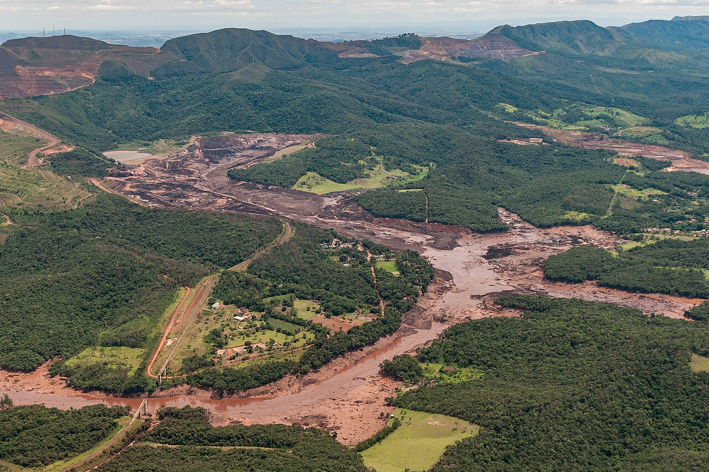
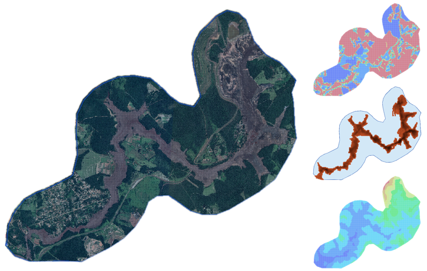
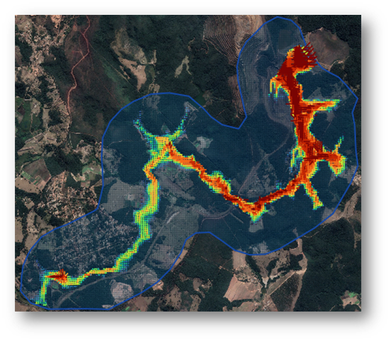

Brumadinho I
==================================

.. note:: Historical aerial photograph of the Brumadinho tailings dam failure in Minas Gerais, Brazil, showing the 
    tailings inundation path and affected landscape following the January 25, 2019 dam collapse. Source: Wikimedia 
    Commons, photograph by Antonio Cruz. Refer to the Wikimedia Commons image page for licensing information.

The failure of the Brumadinho tailings dam in Minas Gerais, Brazil, on January 25, 2019, represents one of the most
significant tailings dam disasters in recent history and has become a defining case study in modern tailings risk assessment
and dam safety engineering. The event highlighted the complex behavior of saturated tailings materials and the importance
of understanding failure mechanisms associated with liquefaction and rapid flow mobilization.

The dam was constructed using the upstream method over several decades and reached a height of approximately 86 meters
prior to failure. The impoundment stored iron ore tailings deposited hydraulically behind successive raises, with the
foundation consisting primarily of cohesive native soils. The failure was driven by static liquefaction of loose,
saturated tailings, associated with elevated pore pressures and rapid loss of shear strength under undrained loading conditions.

Once the structure lost stability, the stored tailings mass rapidly mobilized and flowed downstream as a high-density
mudflow, impacting infrastructure, industrial facilities, and nearby communities. The event demonstrated the
destructive potential of tailings flows and underscored the need for reliable numerical modeling tools
capable of representing mudflows, deposition processes, and downstream hazard propagation.

Because the failure mechanism and post-event investigations were extensively documented, the Brumadinho disaster has
become a critical reference case for evaluating tailings dam breach modeling methodologies and for
developing emergency response and risk management strategies.

Project Characteristics
---------------------------------

The Brumadinho tailings dam stored a large volume of saturated mining waste material in a confined valley setting.
At the time of failure, the impoundment contained approximately 12 million cubic meters of material,
with an estimated 11.7 million cubic meters of tailings released during the event. The reservoir conditions
prior to failure were characterized by high saturation and elevated pore pressure levels,
conditions that significantly increased the susceptibility of the tailings to liquefaction.

The failure occurred rapidly, with the main flow event developing over a relatively short duration of approximately
two hours. The released material exhibited high sediment concentration and non-Newtonian flow behavior,
producing a dense mudflow capable of transporting large volumes of solids over significant distances.
These conditions make the Brumadinho case particularly suitable for evaluating numerical models that
simulate sediment transport, rheological behavior, and deposition processes associated with tailings dam failures.

In addition to the hydraulic and geotechnical complexity of the event, the availability of documented material
properties and failure parameters provides a valuable dataset for calibrating and validating numerical
models used in tailings dam safety studies.

Modeling Objectives
---------------------------------

The primary objective of this case study was to simulate the failure of the Brumadinho tailings dam using the FLO-2D model
and evaluate the downstream movement and deposition of tailings material following the collapse of the structure.
The simulation focused on reproducing the timing, magnitude, and spatial distribution of the released material in order
to assess potential downstream hazards.

Specific modeling objectives included:

- Estimating the volume and timing of the released tailings
- Simulating the propagation of the mudflow downstream
- Evaluating sediment transport and deposition patterns
- Identifying areas of high flow depth and velocity
- Verifying model stability and volume conservation

This type of analysis is commonly performed in consequence assessments, dam safety evaluations, risk management studies,
and regulatory compliance investigations for tailings storage facilities.

Model Setup and Data
---------------------------------

The simulation domain was defined using terrain data representing the pre-disaster topographic conditions of the
downstream valley. Land use and surface roughness information were incorporated into the model to represent
resistance to flow and to capture the interaction between the moving tailings and the surrounding environment.

Material properties were defined to represent the rheological behavior of the tailings, including parameters controlling
sediment concentration, flow resistance, and density. Because direct laboratory measurements of rheological properties
are often unavailable for historical events, representative values consistent with published ranges for similar
tailings materials were adopted to define the flow behavior.

The model configuration allowed the simulation to represent the rapid mobilization of saturated tailings
and the resulting downstream transport and deposition processes. Boundary conditions were defined to represent the
release of tailings from the failed structure, and control parameters were selected to ensure numerical stability during the simulation.

This modeling approach reflects typical engineering practice for tailings dam risk assessments,
where the objective is to simulate realistic failure scenarios using defensible assumptions and available data.

Simulation Results
---------------------------------

The FLO-2D simulation reproduced the key hydraulic and sediment transport characteristics of the Brumadinho tailings
dam failure. The model generated time-dependent flow depth, velocity, and sediment concentration distributions that
allowed detailed evaluation of the movement and deposition of tailings throughout the downstream valley.

The results demonstrated the ability of the model to simulate dense mudflows and to capture the rapid spread of
tailings material following structural collapse. Areas of high flow depth and velocity were identified near the dam
location and along confined drainage paths, while downstream areas exhibited progressive deposition of sediment as the
flow energy decreased. These patterns are consistent with the expected behavior of liquefied tailings
released during a sudden failure event.

The simulation also confirmed that the total released volume matched the expected tailings discharge,
indicating that the model maintained appropriate mass conservation throughout the event. This verification step
is critical for ensuring the reliability of tailings dam simulations used in engineering and regulatory applications.

Training and Professional Development
------------------------------------------

This case study is part of the FLO-2D tailings dam modeling training program, which provides practical guidance on
how to simulate tailings dam failures using real-world scenarios and industry-relevant datasets.
The training focuses on developing technical confidence in model setup, parameter selection, and interpretation of
results for mudflow simulations.

Participants learn how to:

- Define tailings dam failure scenarios
- Represent sediment transport and rheological behavior
- Configure computational domains and boundary conditions
- Run stable numerical simulations
- Analyze flow depth, velocity, and deposition results
- Generate maps and technical outputs for decision-making

The training materials are designed for engineers, consultants, regulators, and mining professionals
responsible for tailings dam safety and risk management.

