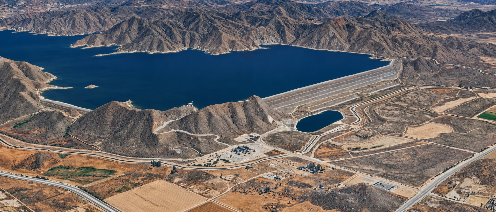
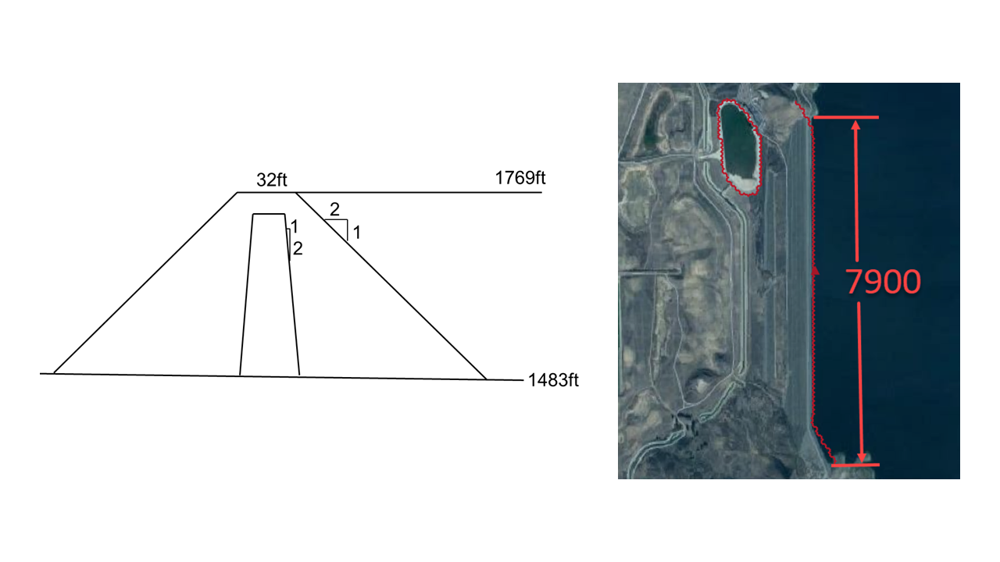

Erosion of Diamond Valley Lake
==================================

Source: Google Earth Pro imagery. Image enhanced for clarity; dam/basin features unchanged.

A conceptual dam failure scenario was developed for Diamond Valley Lake, a major reservoir located in Riverside County,
California. The objective of the study was to evaluate the potential downstream impacts associated with a
progressive erosion failure of the embankment dam using a physically based breach modeling approach in the FLO-2D model.

Diamond Valley Lake is a large water supply reservoir designed to provide regional water storage and reliability
for Southern California. The dam system consists of engineered embankment structures constructed using zoned materials,
including a central core and outer shell layers. Because of the size of the reservoir and the stored water volume,
any failure of the embankment has the potential to generate significant downstream flooding and infrastructure impacts.

The scenario analyzed in this case study represents a hypothetical erosion-driven breach initiated by internal
instability or surface erosion processes. The modeling effort was conducted to support dam safety evaluation
and emergency planning by simulating the progressive development of the breach and the resulting flood propagation downstream.

This type of analysis is commonly performed for large reservoirs where the failure mechanism is expected to
evolve over time rather than occur instantaneously.

The modeling framework and dam parameters used in this study are based on representative geometry and
material properties defined in the project dataset.

Dam Characteristics and Material Properties
---------------------------------------------

The dam structure analyzed in this case study represents a large embankment dam constructed using zoned materials
typical of modern reservoir design. The geometry of the dam plays a critical role in controlling breach development
and discharge magnitude during a failure event.

Representative structural characteristics for the dam include:

- Crest width of approximately 32 feet
- Crest length of approximately 7,900 feet
- Upstream and downstream shell slopes of approximately 2H:1V
- Core slope of approximately 0.5H:1V

These geometric parameters influence both the hydraulic head available for erosion and the stability of
the embankment during breach formation.

Material properties are equally important in determining the rate at which the breach develops.
In erosion-based failure modeling, parameters such as grain size distribution, porosity, cohesion, and
internal friction control the resistance of the embankment to hydraulic erosion.

Typical material properties considered in the analysis include:

- Median grain size of the core and shell materials
- Porosity and unit weight of the embankment zones
- Cohesive strength and friction angle of the materials
- Roughness characteristics of the downstream face

These parameters define the mechanical response of the dam during erosion and directly
affect the timing and magnitude of the breach discharge.

Modeling Objectives
---------------------------------------------

The primary objective of this case study was to simulate a progressive erosion failure of the dam and evaluate the
resulting downstream flood behavior using a physically based breach development model.

The analysis focused on:

- Simulating the initiation of erosion within the embankment
- Modeling progressive enlargement of the breach opening
- Estimating discharge as the reservoir drains
- Evaluating downstream flood propagation
- Supporting dam safety and emergency planning

This type of modeling is particularly important for large reservoirs where failure mechanisms are controlled by
erosion processes rather than instantaneous structural collapse.

Modeling Approach
---------------------------------

The dam failure was simulated using the FLO-2D erosion breach method, in which the breach develops dynamically in
response to hydraulic forces acting on the embankment materials. Unlike simplified hydrograph-based approaches,
the model computes the breach discharge internally as erosion progresses and the breach geometry evolves.

The simulation begins with the reservoir filled to the defined water surface elevation. Once the breach initiates,
flow accelerates through the embankment opening and progressively enlarges the breach as material is removed by hydraulic erosion.

Key parameters controlling breach development in this analysis include:

- Maximum allowable breach width
- Initial breach elevation
- Weir discharge coefficient
- Breach width-to-depth ratio
- Material resistance to erosion

These parameters govern how quickly the breach forms and how rapidly the reservoir drains following failure.

The erosion-based approach provides a physically realistic representation of dam failure behavior and is
particularly appropriate for large embankment dams where internal erosion or
overtopping is the dominant failure mechanism.

Simulation Results
---------------------------------

.. image:: ../../../img/dam-breach/dam-breach0004.png

The simulation demonstrated the progressive formation of a breach in the embankment and the resulting release of
reservoir water over time. The model predicted an initial period of relatively low discharge followed by rapid
acceleration of flow as the breach widened and deepened.

As the breach developed, the reservoir water level declined steadily, producing a sustained release of flow
downstream. The results showed that the peak discharge occurred after the breach reached a critical size,
at which point the hydraulic head driving the flow was maximized.

Downstream flooding patterns reflected the gradual increase in discharge associated with erosion-driven failure.
Areas closest to the dam experienced the highest flow velocities and water depths, while downstream areas exhibited
broader floodplain inundation as flow energy dissipated.

The simulation also confirmed that the total released volume matched the reservoir storage, indicating that
the model maintained appropriate mass conservation throughout the event. This verification step is essential for
ensuring the reliability of dam breach simulations used in engineering and regulatory applications.

Training and Professional Development
------------------------------------------

This case study is part of the FLO-2D dam breach modeling training program and is designed to illustrate how
erosion-based breach modeling can be applied to large reservoir systems. The scenario provides a practical example
of how numerical modeling can support decision-making in dam safety and risk management.

Participants learn how to:

- Define embankment geometry and material properties
- Configure erosion-based breach parameters
- Simulate progressive breach development
- Evaluate downstream flood impacts
- Interpret model results for emergency planning

The workflow presented in this case study reflects standard engineering practice
for physically based dam breach analysis in large reservoir systems.
