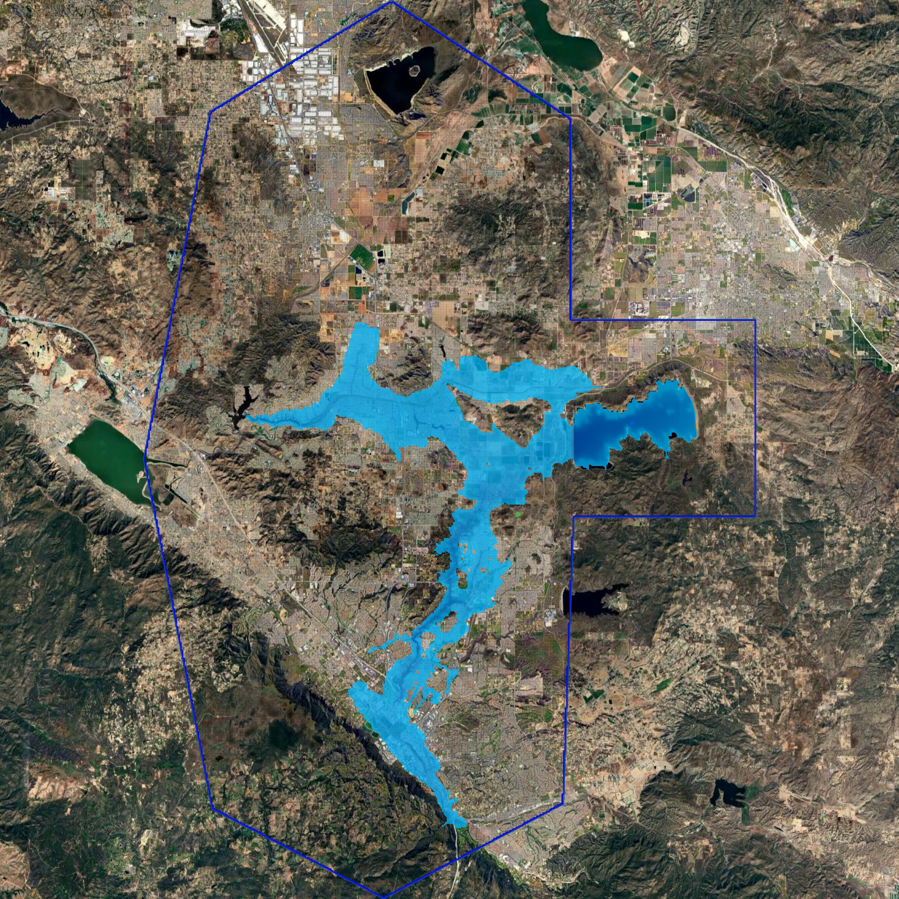

Water Dam Breach
==================================

To model water dam breach scenarios in FLO-2D, several approaches are available depending on the level of detail required,
the available data, and the purpose of the analysis. These approaches range from simplified empirical methods for rapid
screening studies to more detailed hydraulic simulations that represent breach development and downstream flood routing.

Three methods can be used to simulate water dam failures in FLO-2D. Each method represents a different level of
modeling complexity and physical representation of the failure process. The following sections describe these methods
in detail, including their assumptions, typical applications, and recommended tutorial packages for implementation.

Method 1: Breach Hydrograph Tool
---------------------------------

.. image:: ../../img/dam-breach/dam-breach0002.png

The Breach Hydrograph Tool is a simplified and efficient method for estimating the outflow hydrograph associated with a
water dam failure. This approach is commonly used for preliminary assessments, regulatory studies, emergency planning,
and screening-level analyses where detailed breach mechanics are not required or where limited data are available.

The tool estimates the key breach parameters required to define the dam failure hydrograph, including the peak discharge,
time to peak discharge, average breach width, and the total duration of the hydrograph. These parameters are calculated
using widely accepted empirical relationships derived from historical dam failure data, such as the Froehlich equations,
the ANA-LNEC methodology, and the MMC approach. These methods provide practical and defensible estimates of breach
characteristics when detailed information about the failure mechanism is not available.

After estimating the breach characteristics, the tool generates the breach hydrograph using simplified analytical
shapes that represent the temporal evolution of the discharge during the failure process. Common hydrograph shapes
include triangular, parabolic, and TR66 formulations. The resulting hydrograph can then be directly assigned to an
inflow boundary condition in the FLO-2D model, allowing the released water to be routed through the downstream system
to evaluate flood depths, velocities, and inundation extent.

The case study for this method is the Teton Dam Failure, which used the complete workflow for
estimating breach parameters, generating the outflow hydrograph, and routing the resulting floodwave using the Breach Hydrograph Tool.

.. toctree::
   :maxdepth: 1

   teton-dam/index

Method 2: Prescribed Breach
---------------------------------

.. image:: ../../img/dam-breach/dam-breach0003.gif

In this method, the user directly defines the breach geometry and the rate at which the breach develops over time.
The model then computes the resulting outflow hydrograph dynamically based on the changing breach
dimensions and the hydraulic conditions in the reservoir.

This approach is commonly used when site-specific information about the breach characteristics is available or when
regulatory guidance requires the explicit definition of breach parameters. The prescribed breach method allows the
user to control aspects of the failure process, including the final breach width, breach development rates,
breach invert elevation, and the time required for the breach to fully develop.

The prescribed breach method is particularly appropriate for engineering studies where the breach characteristics
can be reasonably estimated based on design information, dam geometry, or regulatory guidance. It is also commonly
used in consequence assessments, dam safety evaluations, and emergency action planning studies where a defined failure
scenario must be simulated in a consistent and repeatable manner.

The case study for this method is the Conceptual Urban Dam Failure Scenario, which defined the breach geometry,
specified the breach development time, and simulated the resulting reservoir release using the Prescribed Breach method.

.. toctree::
   :maxdepth: 1

   urban-dam/index

Method 3: Erosion Breach
---------------------------

The Erosion Breach method represents the most physically based approach for simulating dam failure in FLO-2D.
In this method, the breach develops dynamically as a result of hydraulic erosion driven by the flow of water through
the dam structure. Instead of prescribing the final breach geometry or estimating a hydrograph in advance,
the model computes the progressive enlargement of the breach based on erosion processes and hydraulic conditions during the simulation.

This approach is particularly useful when the failure mechanism is expected to involve overtopping or internal erosion
and when the objective of the study is to represent the time-dependent evolution of the breach. The erosion breach
method accounts for the interaction between reservoir hydraulics, flow velocity, and material resistance, allowing
the breach dimensions to change continuously as the simulation progresses. As the breach widens and deepens, the
model automatically updates the discharge and reservoir drawdown, producing a hydrograph that reflects the physical
development of the failure.

The erosion process is controlled by parameters that describe the resistance of the dam material to erosion,
such as erodibility coefficients and critical shear stress. These parameters can be estimated from laboratory testing,
published ranges for similar materials, or regulatory guidance. Because the breach geometry is not predefined,
the resulting failure behavior is influenced by both the hydraulic conditions and the assumed material properties,
making this method well suited for sensitivity analyses and detailed engineering evaluations of potential failure scenarios.

The erosion breach method is commonly applied in dam safety studies, risk assessments, and design evaluations
where the failure mechanism must be represented explicitly and where the timing and magnitude of the breach discharge
are important for downstream hazard analysis. It is also valuable when evaluating the influence of material properties
or reservoir conditions on the progression of the failure and the resulting floodwave characteristics.

The case study for this method is the Erosion of Diamond Valley Lake, which defined the dam material properties, configured the erosion parameters,
and simulated the progressive development of the breach and resulting flood routing using the Erosion Breach method.

.. toctree::
   :maxdepth: 1

   diamond-valley-dam/index
