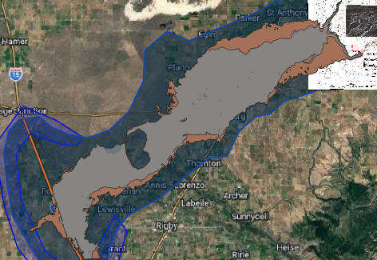
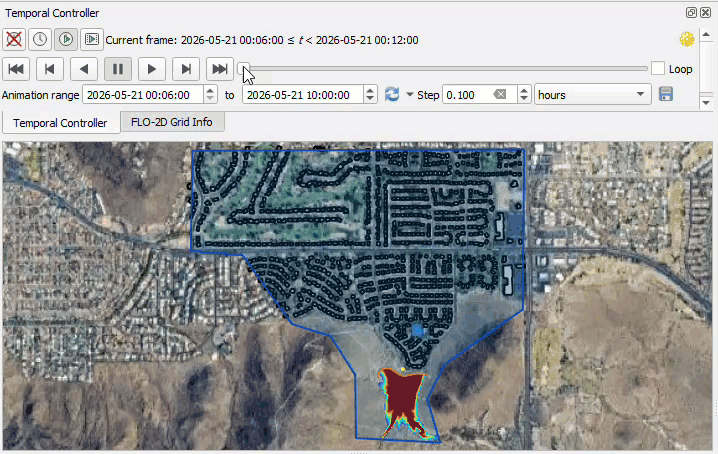
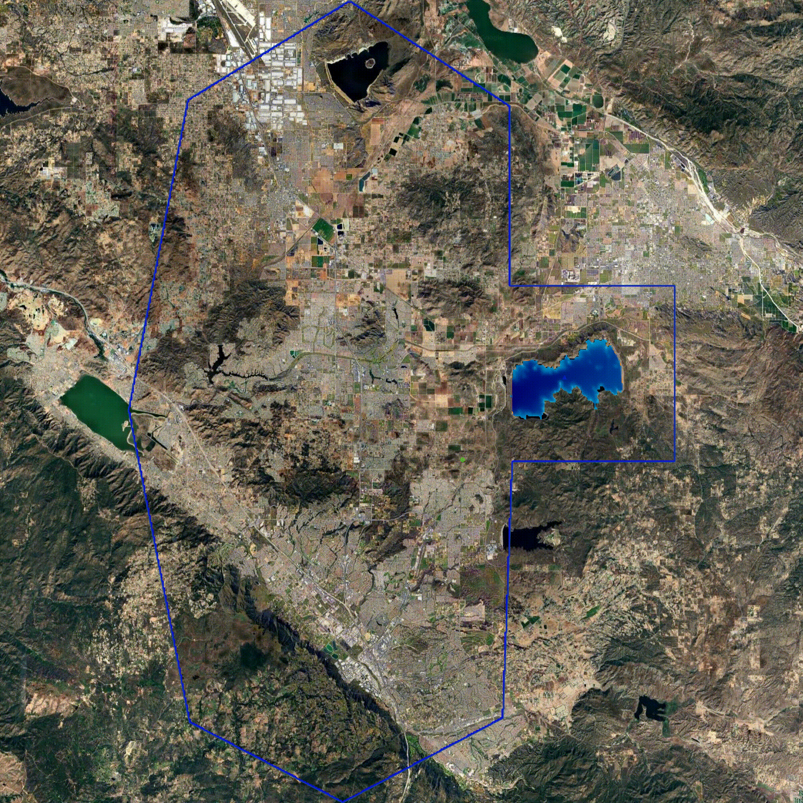

Water Dam Breach
==================================

To model water dam breach scenarios in FLO-2D, several approaches are available depending on the level of detail required,
the available data, and the purpose of the analysis. These approaches range from simplified empirical methods for rapid
screening studies to more detailed hydraulic simulations that represent breach development and downstream flood routing.

Three methods can be used to simulate water dam failures in FLO-2D. Each method represents a different level of
modeling complexity and physical representation of the failure process. The following sections describe these methods
in detail, including their assumptions, typical applications, and recommended tutorial packages for implementation.

Method 1: Breach Hydrograph Tool
---------------------------------

The Breach Hydrograph Tool is a simplified and efficient method for estimating the outflow hydrograph associated with a
water dam failure. This approach is commonly used for preliminary assessments, regulatory studies, emergency planning,
and screening-level analyses where detailed breach mechanics are not required or where limited data are available.

The tool estimates the key breach parameters required to define the dam failure hydrograph, including the peak discharge,
time to peak discharge, average breach width, and the total duration of the hydrograph. These parameters are calculated
using widely accepted empirical relationships derived from historical dam failure data, such as the Froehlich equations,
the ANA-LNEC methodology, and the MMC approach. These methods provide practical and defensible estimates of breach
characteristics when detailed information about the failure mechanism is not available.

After estimating the breach characteristics, the tool generates the breach hydrograph using simplified analytical
shapes that represent the temporal evolution of the discharge during the failure process. Common hydrograph shapes
include triangular, parabolic, and TR66 formulations. The resulting hydrograph can then be directly assigned to an
inflow boundary condition in the FLO-2D model, allowing the released water to be routed through the downstream system
to evaluate flood depths, velocities, and inundation extent.

The case study for this method is the Teton Dam Failure, which used the complete workflow for
estimating breach parameters, generating the outflow hydrograph, and routing the resulting floodwave using the Breach Hydrograph Tool.

.. dropdown:: **Teton Dam Failure**

   .. image:: ../../img/dam-breach/dam-breach0001.png
      :width: 75%

   .. note:: Historical aerial photograph of the Teton Dam failure near Newdale, Idaho, captured on June 5, 1976. The image shows 
      the breached dam and downstream flood impacts along the Teton River corridor. 
      **Source:** Roberts, WaterArchives.org (Image ID-L-0010). No known U.S. copyright restrictions. Credit to WaterArchives.org is requested.

   The failure of the Teton Dam in Idaho, United States, on June 5, 1976, remains one of the most thoroughly documented
   embankment dam failures in hydraulic engineering history. The event occurred during the initial filling of the reservoir,
   when the water level approached the design maximum pool elevation. Due to the extensive forensic investigations conducted
   after the failure, the case provides a reliable and well-documented benchmark for evaluating dam breach modeling
   methodologies and flood routing performance.

   The dam failure was initiated by internal erosion through the embankment core, commonly referred to as piping.
   Seepage developed along fractures in the core and foundation materials, progressively enlarging internal flow paths until
   structural integrity was compromised. Once a sinkhole formed on the downstream face, rapid erosion led to full breach
   formation within a few hours. The resulting flood wave propagated downstream along the Teton River valley,
   producing widespread inundation and significant economic damage.

   Because the failure mechanism, reservoir conditions, breach development, and downstream impacts were extensively documented,
   the Teton Dam event has become a standard reference case for validating hydraulic models and training engineers in dam breach simulation.

   .. container:: h3
      
      Project Characteristics
   
   The Teton Dam failure involved the sudden release of a large reservoir volume and produced one of the highest recorded
   discharges associated with an embankment dam failure. The hydraulic conditions and downstream flood response provide an
   ideal test case for evaluating dam breach modeling tools and flood hazard assessment methodologies.

   The dam had a total height of approximately 305 feet and stored a reservoir with a capacity of approximately 435 million
   cubic yards. At the time of failure, the reservoir contained an estimated released volume of approximately 396 million
   cubic yards. The breach developed rapidly, generating a peak discharge of approximately 2.3 million cubic feet per
   second and producing a flood wave that inundated an area of roughly 240 square kilometers downstream of the dam.

   .. container:: h3

      Modeling Objectives
   
   The primary objective of this case study was to simulate the dam failure using FLO-2D and the Breach Hydrograph Tool
   to evaluate the downstream flood response resulting from the breach. The simulation focused on reproducing the magnitude
   and timing of the released flow and estimating the resulting inundation extent and hydraulic conditions across the downstream valley.

   Specific modeling objectives included:

   - Estimating the breach discharge hydrograph
   - Simulating flood propagation downstream of the dam
   - Evaluating inundation depth and flood extent
   - Verifying model stability and volume conservation

   This type of analysis is commonly performed in dam safety studies, emergency action planning, consequence assessments,
   and regulatory evaluations.

   .. container:: h3

      Model Setup and Data
   
   .. image:: ../../img/dam-breach/dam-breach0005.png
      :width: 75%

   The simulation domain was defined using terrain and land cover data representative of the downstream watershed.
   Elevation data were processed to generate a computational grid suitable for hydraulic routing,
   and surface roughness values were assigned based on land cover classification. The modeling domain was configured
   to capture the expected flood propagation along the river valley and adjacent floodplain areas.

   The computational grid resolution was selected to balance numerical stability, computational efficiency, and spatial accuracy.
   Boundary conditions were defined to represent the inflow generated by the dam breach and the downstream flow routing conditions.
   The resulting model configuration allowed the simulation to reproduce the hydraulic response of the flood wave as it moved through the downstream system.

   The modeling workflow included verification of simulation stability and review of diagnostic outputs such as volume conservation,
   velocity distribution, and time step behavior. These checks are essential for ensuring that the simulation results are
   physically realistic and numerically stable.

   .. container:: h3

      Simulation Results

   .. image:: ../../img/dam-breach/dam-breach0002.png

   .. important:: update this image.

   The FLO-2D simulation reproduced the key hydraulic characteristics of the Teton Dam failure, including rapid reservoir drawdown,
   high peak discharge, and extensive downstream inundation. The model generated time-dependent flow depth and velocity
   fields that allowed detailed evaluation of flood behavior throughout the computational domain.

   The results demonstrated the ability of the model to simulate large-scale dam breach events and to capture the
   dynamic interaction between the released flow and the downstream terrain. Areas of high velocity were identified near
   the breach and along confined sections of the river valley, while broader floodplain areas exhibited lower velocities
   and deeper inundation depths. These patterns are consistent with the expected hydraulic behavior of a large dam breach flood wave.

   The simulation also confirmed that the total released volume matched the expected reservoir discharge,
   indicating that the model maintained appropriate mass conservation throughout the event.
   This verification step is critical for ensuring the reliability of dam breach simulations used in
   engineering and regulatory applications.

   .. container:: h3

      Training and Professional Development
   
   This case study is part of the FLO-2D Dam Breach training package, which provides practical guidance on how to develop,
   run, and evaluate dam failure simulations using real-world scenarios. The training focuses on building technical
   confidence in model setup, parameter selection, and result interpretation.

   Participants learn how to:

   - Define a dam breach scenario
   - Generate and apply a breach hydrograph
   - Configure the computational domain
   - Run the hydraulic simulation
   - Analyze flood depth, velocity, and inundation results
   - Produce maps and technical outputs for decision-making

   The training materials are designed for engineers, consultants, regulators,
   and emergency planners responsible for dam safety and flood risk management.

Method 2: Prescribed Breach
---------------------------------

In this method, the user directly defines the breach geometry and the rate at which the breach develops over time.
The model then computes the resulting outflow hydrograph dynamically based on the changing breach
dimensions and the hydraulic conditions in the reservoir.

This approach is commonly used when site-specific information about the breach characteristics is available or when
regulatory guidance requires the explicit definition of breach parameters. The prescribed breach method allows the
user to control aspects of the failure process, including the final breach width, breach development rates,
breach invert elevation, and the time required for the breach to fully develop.

The prescribed breach method is particularly appropriate for engineering studies where the breach characteristics
can be reasonably estimated based on design information, dam geometry, or regulatory guidance. It is also commonly
used in consequence assessments, dam safety evaluations, and emergency action planning studies where a defined failure
scenario must be simulated in a consistent and repeatable manner.

The case study for this method is the Conceptual Urban Dam Failure Scenario, which defined the breach geometry,
specified the breach development time, and simulated the resulting reservoir release using the Prescribed Breach method.

.. toctree::
   :maxdepth: 1

   urban-dam/index

Method 3: Erosion Breach
---------------------------

The Erosion Breach method represents the most physically based approach for simulating dam failure in FLO-2D.
In this method, the breach develops dynamically as a result of hydraulic erosion driven by the flow of water through
the dam structure. Instead of prescribing the final breach geometry or estimating a hydrograph in advance,
the model computes the progressive enlargement of the breach based on erosion processes and hydraulic conditions during the simulation.

This approach is particularly useful when the failure mechanism is expected to involve overtopping or internal erosion
and when the objective of the study is to represent the time-dependent evolution of the breach. The erosion breach
method accounts for the interaction between reservoir hydraulics, flow velocity, and material resistance, allowing
the breach dimensions to change continuously as the simulation progresses. As the breach widens and deepens, the
model automatically updates the discharge and reservoir drawdown, producing a hydrograph that reflects the physical
development of the failure.

The erosion process is controlled by parameters that describe the resistance of the dam material to erosion,
such as erodibility coefficients and critical shear stress. These parameters can be estimated from laboratory testing,
published ranges for similar materials, or regulatory guidance. Because the breach geometry is not predefined,
the resulting failure behavior is influenced by both the hydraulic conditions and the assumed material properties,
making this method well suited for sensitivity analyses and detailed engineering evaluations of potential failure scenarios.

The erosion breach method is commonly applied in dam safety studies, risk assessments, and design evaluations
where the failure mechanism must be represented explicitly and where the timing and magnitude of the breach discharge
are important for downstream hazard analysis. It is also valuable when evaluating the influence of material properties
or reservoir conditions on the progression of the failure and the resulting floodwave characteristics.

The case study for this method is the Erosion of Diamond Valley Lake, which defined the dam material properties, configured the erosion parameters,
and simulated the progressive development of the breach and resulting flood routing using the Erosion Breach method.

.. toctree::
   :maxdepth: 1

   diamond-valley-dam/index
