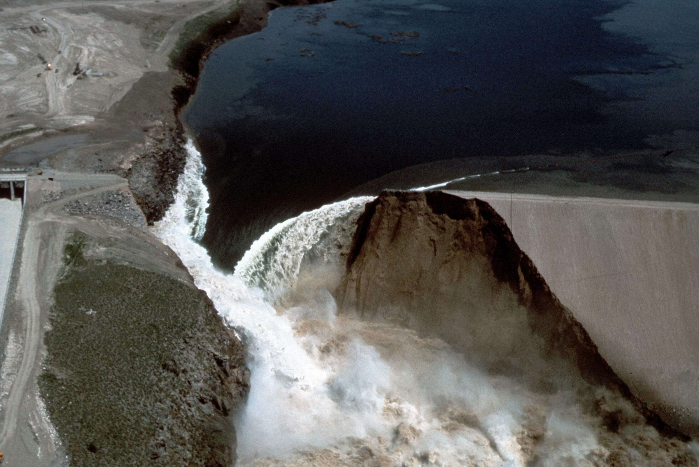
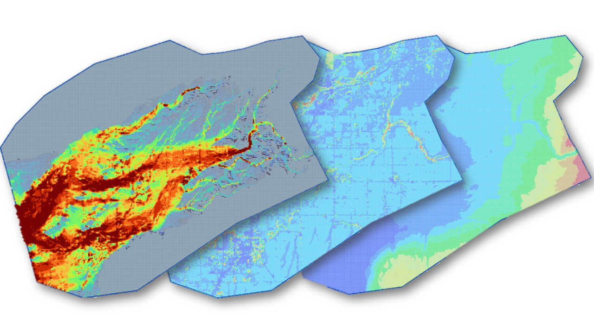

Teton Dam Failure
==================================

.. note:: Historical aerial photograph of the Teton Dam failure near Newdale, Idaho, captured on June 5, 1976. The image shows 
   the breached dam and downstream flood impacts along the Teton River corridor. 
   **Source:** Roberts, WaterArchives.org (Image ID-L-0010). No known U.S. copyright restrictions. Credit to WaterArchives.org is requested.

The failure of the Teton Dam in Idaho, United States, on June 5, 1976, remains one of the most thoroughly documented
embankment dam failures in hydraulic engineering history. The event occurred during the initial filling of the reservoir,
when the water level approached the design maximum pool elevation. Due to the extensive forensic investigations conducted
after the failure, the case provides a reliable and well-documented benchmark for evaluating dam breach modeling
methodologies and flood routing performance.

The dam failure was initiated by internal erosion through the embankment core, commonly referred to as piping.
Seepage developed along fractures in the core and foundation materials, progressively enlarging internal flow paths until
structural integrity was compromised. Once a sinkhole formed on the downstream face, rapid erosion led to full breach
formation within a few hours. The resulting flood wave propagated downstream along the Teton River valley,
producing widespread inundation and significant economic damage.

Because the failure mechanism, reservoir conditions, breach development, and downstream impacts were extensively documented,
the Teton Dam event has become a standard reference case for validating hydraulic models and training engineers in dam breach simulation.

Project Characteristics
---------------------------------

The Teton Dam failure involved the sudden release of a large reservoir volume and produced one of the highest recorded
discharges associated with an embankment dam failure. The hydraulic conditions and downstream flood response provide an
ideal test case for evaluating dam breach modeling tools and flood hazard assessment methodologies.

The dam had a total height of approximately 305 feet and stored a reservoir with a capacity of approximately 435 million
cubic yards. At the time of failure, the reservoir contained an estimated released volume of approximately 396 million
cubic yards. The breach developed rapidly, generating a peak discharge of approximately 2.3 million cubic feet per
second and producing a flood wave that inundated an area of roughly 240 square kilometers downstream of the dam.

Modeling Objectives
---------------------------------

The primary objective of this case study was to simulate the dam failure using FLO-2D and the Breach Hydrograph Tool
to evaluate the downstream flood response resulting from the breach. The simulation focused on reproducing the magnitude
and timing of the released flow and estimating the resulting inundation extent and hydraulic conditions across the downstream valley.

Specific modeling objectives included:

- Estimating the breach discharge hydrograph
- Simulating flood propagation downstream of the dam
- Evaluating inundation depth and flood extent
- Verifying model stability and volume conservation

This type of analysis is commonly performed in dam safety studies, emergency action planning, consequence assessments,
and regulatory evaluations.

Model Setup and Data
---------------------------------

The simulation domain was defined using terrain and land cover data representative of the downstream watershed.
Elevation data were processed to generate a computational grid suitable for hydraulic routing,
and surface roughness values were assigned based on land cover classification. The modeling domain was configured
to capture the expected flood propagation along the river valley and adjacent floodplain areas.

The computational grid resolution was selected to balance numerical stability, computational efficiency, and spatial accuracy.
Boundary conditions were defined to represent the inflow generated by the dam breach and the downstream flow routing conditions.
The resulting model configuration allowed the simulation to reproduce the hydraulic response of the flood wave as it moved through the downstream system.

The modeling workflow included verification of simulation stability and review of diagnostic outputs such as volume conservation,
velocity distribution, and time step behavior. These checks are essential for ensuring that the simulation results are
physically realistic and numerically stable.

Simulation Results
--------------------

.. image:: ../../../img/dam-breach/dam-breach0002.png

.. important update this image.

The FLO-2D simulation reproduced the key hydraulic characteristics of the Teton Dam failure, including rapid reservoir drawdown,
high peak discharge, and extensive downstream inundation. The model generated time-dependent flow depth and velocity
fields that allowed detailed evaluation of flood behavior throughout the computational domain.

The results demonstrated the ability of the model to simulate large-scale dam breach events and to capture the
dynamic interaction between the released flow and the downstream terrain. Areas of high velocity were identified near
the breach and along confined sections of the river valley, while broader floodplain areas exhibited lower velocities
and deeper inundation depths. These patterns are consistent with the expected hydraulic behavior of a large dam breach flood wave.

The simulation also confirmed that the total released volume matched the expected reservoir discharge,
indicating that the model maintained appropriate mass conservation throughout the event.
This verification step is critical for ensuring the reliability of dam breach simulations used in
engineering and regulatory applications.

Training and Professional Development
---------------------------------------

This case study is part of the FLO-2D Dam Breach training package, which provides practical guidance on how to develop,
run, and evaluate dam failure simulations using real-world scenarios. The training focuses on building technical
confidence in model setup, parameter selection, and result interpretation.

Participants learn how to:

- Define a dam breach scenario
- Generate and apply a breach hydrograph
- Configure the computational domain
- Run the hydraulic simulation
- Analyze flood depth, velocity, and inundation results
- Produce maps and technical outputs for decision-making

The training materials are designed for engineers, consultants, regulators,
and emergency planners responsible for dam safety and flood risk management.