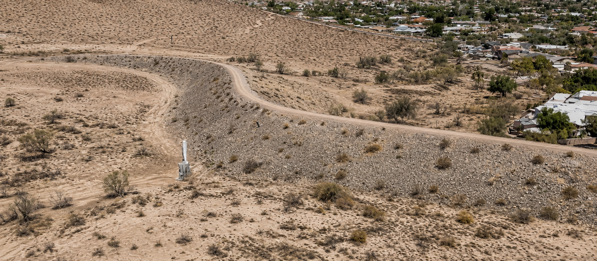
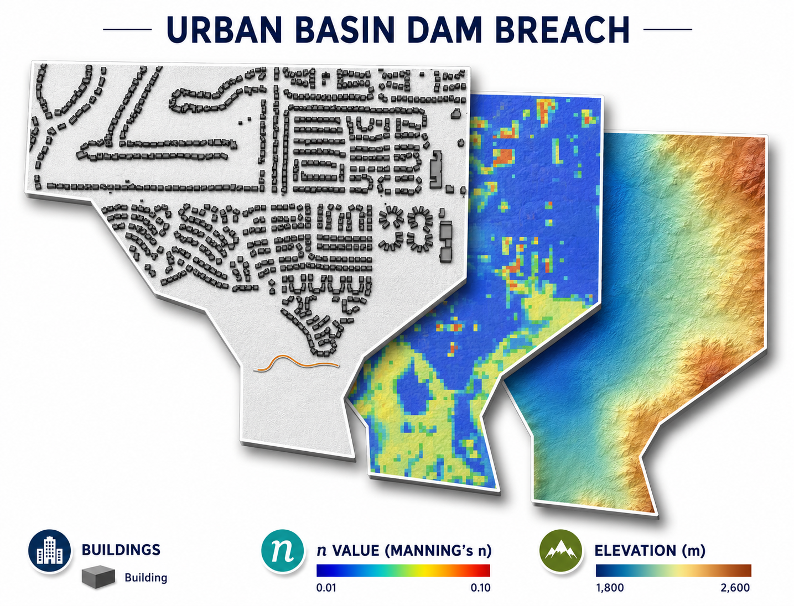
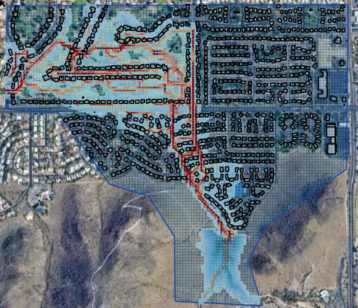

Conceptual Urban Dam Failure
======================================

Dry detention basin and earthen dam located in Phoenix, Arizona. Phoenix Basin No. 7 provides approximately 
257 acre-feet of storage and drains a 0.6 square-mile watershed. Runoff is discharged through a 27-inch principal 
outlet pipe connected to a downstream channel and supplemented by an emergency spillway. The outlet pipe inlet 
invert is located at the basin floor elevation of 1371.34 ft and extends approximately 160 ft through the embankment. 
The emergency spillway has a minimum crest elevation of 1393.7 ft and provides overflow protection during extreme storm events.

Additional information about Phoenix Basin No. 7 is available from the Flood Control District of Maricopa County:

.. raw:: html

   <a href="https://alert.fcd.maricopa.gov/alert/Flow/13307.htm#RNOFF"
      target="_blank"
      rel="noopener noreferrer">
      Phoenix Basin No. 7 Data
   </a>

Source: Google Earth Pro imagery. Image enhanced for clarity; dam/basin features unchanged.

A conceptual dam failure scenario was developed for an urban watershed located in the Phoenix metropolitan area in
Arizona, United States. The purpose of the study was to evaluate the potential downstream impacts associated with the
failure of a flood control structure located within a developed urban environment. The analysis was performed using
the prescribed breach method in the FLO-2D model to simulate the release of stored water following a structural failure of the dam.

Urban flood control dams in the Phoenix region are commonly designed to manage storm runoff generated by intense
rainfall events. These structures play a critical role in reducing downstream flood risk.
However, failure of such structures, whether due to overtopping, structural instability, or operational malfunction,
can result in rapid downstream flooding with potentially significant consequences.

The scenario analyzed in this case study represents a hypothetical failure of an urban detention dam.

Modeling Objectives
--------------------

The primary objective of this case study was to simulate the failure of an urban flood control dam using a
physically defined breach and to evaluate the resulting downstream flooding behavior within a developed area.

The analysis focused on:

- Simulating the structural failure of the dam
- Evaluating downstream flood propagation
- Identifying potential infrastructure impacts
- Assessing flood routing across transportation corridors

This type of modeling is commonly performed for dam safety evaluations,
urban flood risk studies, and regulatory compliance assessments.

Model Setup and Data
---------------------------------

The dam structure was represented as a levee dam within the computational domain. The failure was simulated using a
prescribed breach, in which the location, geometry, and direction of the breach were defined explicitly within the model.
The breach was positioned at a location along the dam crest to simulate a structural failure mechanism.

The model dynamically calculated the discharge through the breach as water levels within the reservoir exceeded the
structural capacity of the dam. This approach allowed the simulation to represent the progressive release of stored
water and the resulting downstream flood routing.

By combining breach dynamics with hydraulic infrastructure representation, the model provided a realistic
simulation of both normal and failure conditions for the dam.

Simulation Results
--------------------

The simulation demonstrated the rapid downstream propagation of floodwaters following the structural failure of the dam.
The model predicted that released water would initially follow the primary drainage pathway downstream of the structure
before spreading laterally across the urban terrain.

One of the key findings of the analysis was the potential for floodwaters to intersect major transportation infrastructure.
The results indicated that flow could cross a nearby highway corridor and continue toward lower-elevation areas located to the southwest of the dam.

The model outputs provided detailed spatial information describing:

- Maximum flood depth distribution
- Flow velocity patterns
- Timing of flood arrival
- Potential inundation extent
- Downstream hazard zones

These results are critical for evaluating evacuation requirements, infrastructure vulnerability, and emergency response planning.

Training and Professional Development
---------------------------------------

This conceptual urban dam failure scenario is a case study part of the FLO-2D dam breach modeling training program and
is designed to illustrate how prescribed breach modeling can be applied to urban flood control systems.
The case study provides a practical example of how numerical modeling can support decision-making
in emergency planning and infrastructure risk management.

Participants learn how to:

- Define realistic breach scenarios
- Set up urban infrastructure within the model
- Evaluate downstream flood impacts
- Interpret model results for risk assessment

The workflow presented in this case study reflects standard engineering practice for dam safety and urban
flood risk analysis using physically based hydraulic modeling tools.