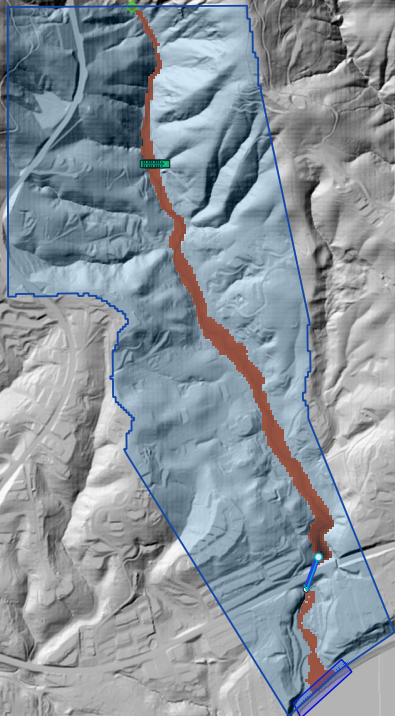
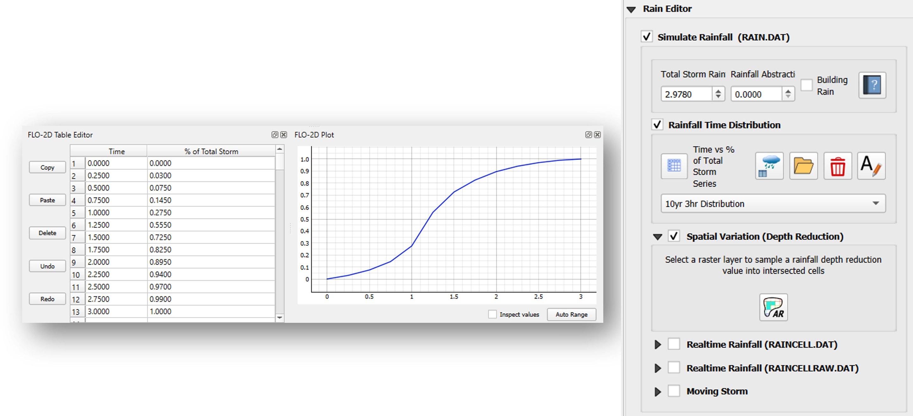
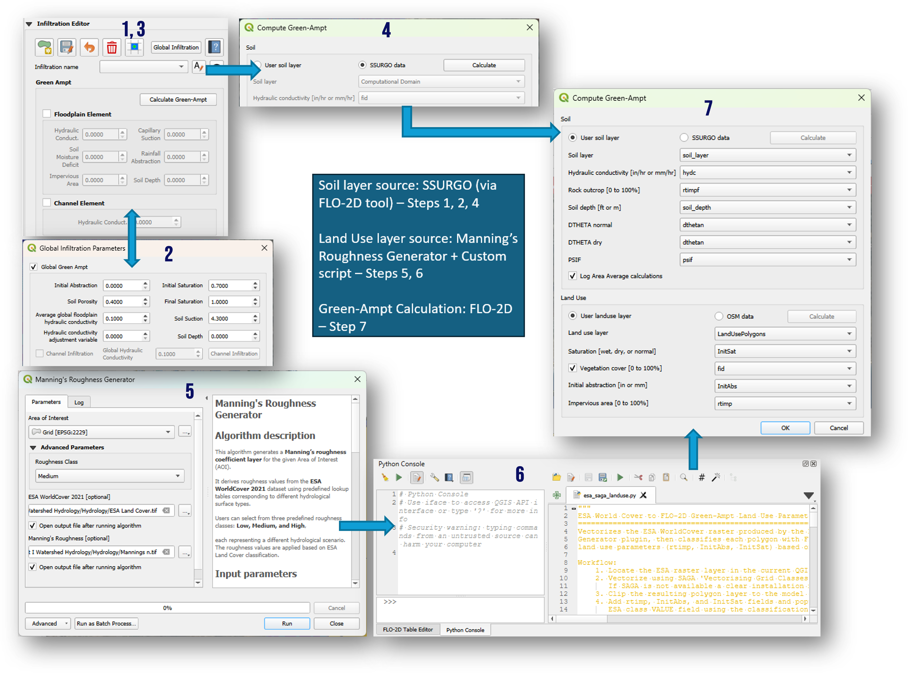
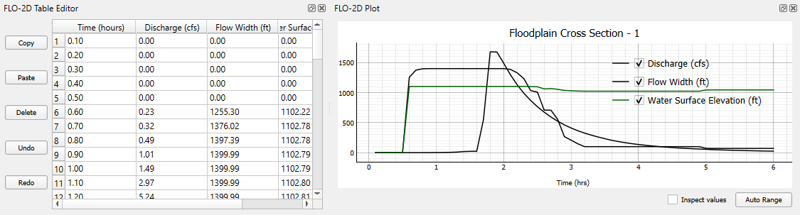
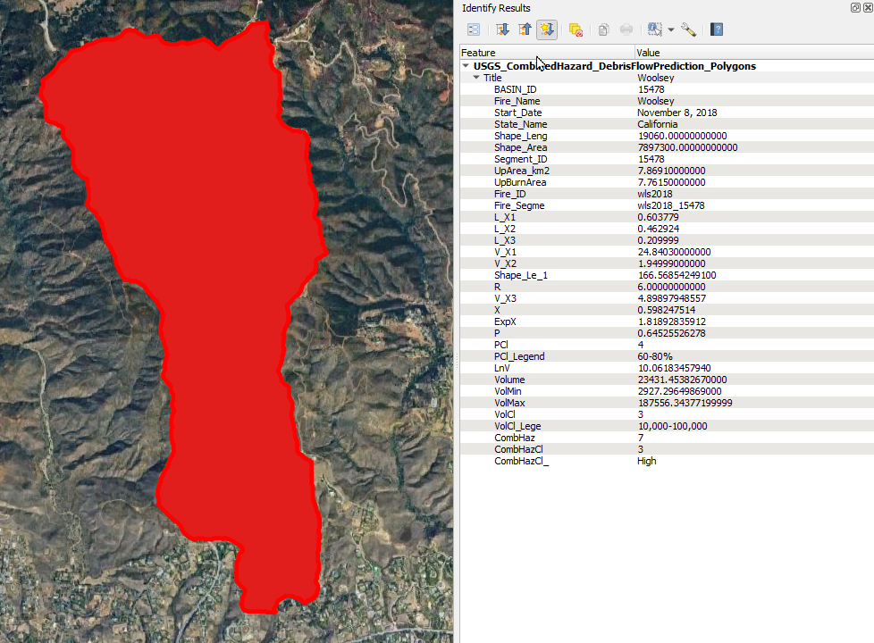
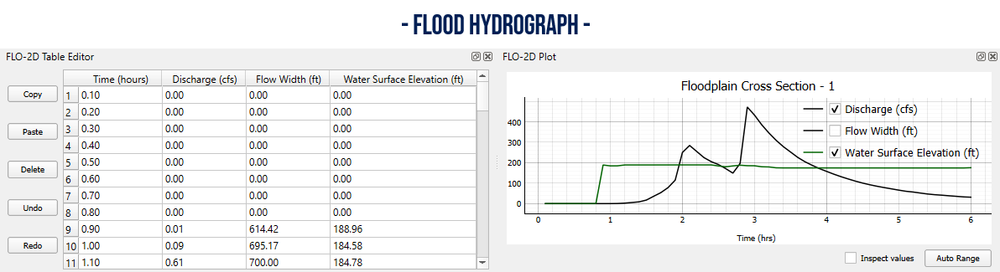
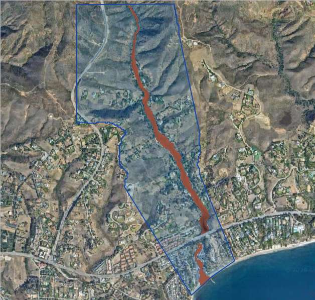
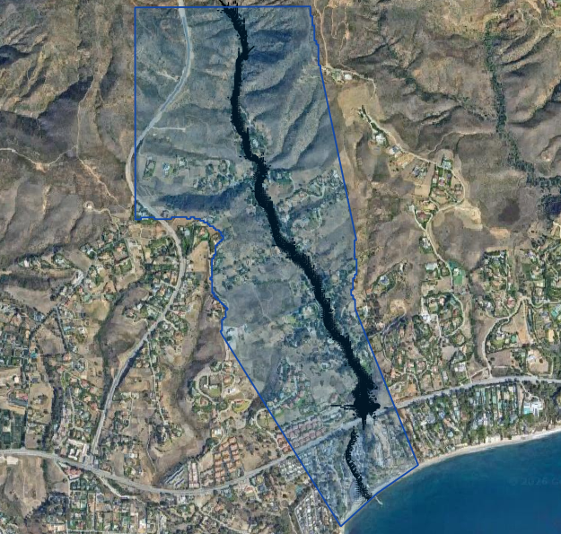
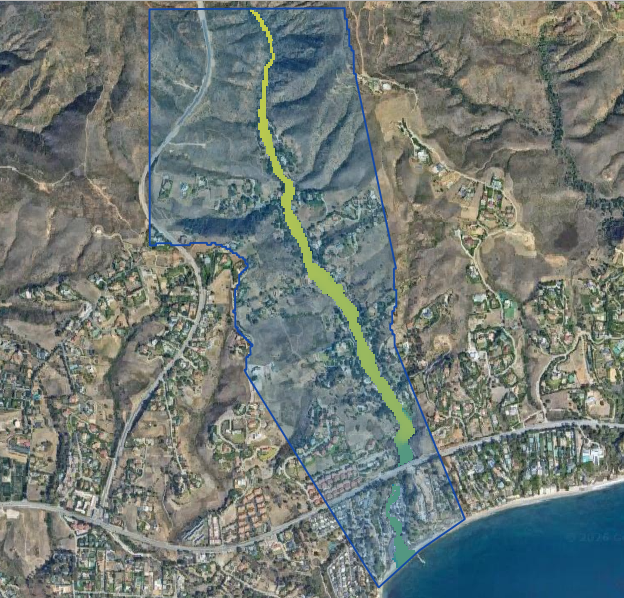

.. _mudflow:

Mudflow Modeling
============================================

.. contents:: Contents
   :local: 
   :depth: 1
   :backlinks: entry

Overview
--------

Mudflows are among the most destructive natural hazards in mountainous and steep coastal environments. Following intense rainfall, 
large volumes of water, sediment, rock, and woody debris can rapidly mobilize within steep drainages and canyon channels, 
producing fast-moving flows capable of damaging infrastructure and threatening downstream communities. Post-fire conditions can 
significantly increase the hazard by reducing vegetation cover, creating hydrophobic soil conditions, and exposing previously 
stabilized soils to erosion and mudflow propagation.

This case study demonstrates a complete FLO-2D workflow for evaluating mudflow hazards within a steep coastal watershed. The project 
combines watershed hydrology, rainfall-runoff modeling, infiltration analysis, and FLO-2D mudflow routing to simulate the generation 
and downstream movement of sediment-laden flows. Model results are used to evaluate inundation extents, mudflow volumes and concentrations, 
flow depths, velocities, and potential hazard areas along the drainage corridor and developed downstream areas. These results are used to 
define hazard areas, facilitate mitigation design and basin design, and define safety corridors.

The workflow illustrates how a rainfall-driven watershed response can be converted into a mudflow
hydrograph and routed through a detailed FLO-2D computational grid.

Project Objectives
~~~~~~~~~~~~~~~~~~~~~~~

The primary objectives of this study were to:

* Delineate the contributing watershed.
* Develop a rainfall-runoff model for a design storm event.
* Estimate infiltration losses using globally available soil and land use data.
* Generate a runoff hydrograph at the downstream canyon cross section.
* Convert the flood hydrograph into a mudflow hydrograph.
* Simulate downstream mudflow routing.
* Evaluate potential inundation depths, velocities, and mudflow concentrations.

Study Area
~~~~~~~~~~~~~~~~

The study area consists of a steep mountainous watershed near Malibu, California, that drains through 
a network of steep tributary channels into developed foothill areas along the canyon outlet. Numerous 
tributaries converge within the watershed, concentrating runoff, sediment, and debris during short-duration, 
high-intensity, post-fire storm events.

.. image:: ../img/mudflow-modeling/mudflow001.png

*Figure 1. Watershed and foothills study area.*

Data Sources
-----------------

Several publicly available datasets were used during model development:

* Digital elevation model (DEM)
* National hydrography data
* Design rainfall data
* Soil classification data
* Global land cover data
* High-resolution aerial imagery

These datasets were integrated into the GIS workflow to derive the terrain, hydrologic, and land surface parameters used by the FLO-2D model.

Terrain Development
~~~~~~~~~~~~~~~~~~~~~~

A computational domain was created to encompass the contributing watershed and downstream developed zone. Elevation data 
was interpolated to the FLO-2D grid and used to define overland flow paths, channelized drainage features, and canyon outlet topography.

.. image:: ../img/mudflow-modeling/mudflow002.png

*Figure 2. Computational grid and terrain model.*

Surface Roughness
~~~~~~~~~~~~~~~~~~~~~~

Manning's roughness values were developed using land cover classifications and interpolated to the computational grid.

Spatially varying roughness values were applied to represent:

* Natural channels
* Desert vegetation
* Disturbed areas
* Urbanized regions

.. image:: ../img/mudflow-modeling/mudflow003.png

*Figure 3. Spatial distribution of Manning's roughness.*

Hydrology
----------------

Rainfall 
~~~~~~~~~~~~~~~~~~~~~

The design storm was selected to represent a short-duration, high-intensity event capable of generating significant runoff and mudflow. A temporal 
rainfall distribution was developed to represent storm intensification and recession over the event duration.  The 10 yr 3-hr design storm rainfall in inches 
and rainfall distribution curve was defined for the project using the rainfall editor.

*Figure 4. Design storm rainfall distribution.*

Infiltration 
~~~~~~~~~~~~~~~~~~~~~~~~~~

Infiltration losses were estimated using soil and land use information. Green-Ampt parameters were developed from:

* Soil hydraulic properties
* Land cover classifications
* Surface abstraction characteristics

This process allowed rainfall excess to be converted into runoff while accounting for spatial variability in infiltration parameters. 
The Green-Ampt method uses Hydraulic Conductivity (xksat), Infiltration Volume (dtheta), Capillary Suction (psif), Initial Abstraction (aa), 
and Percent Impervious (rtimp) to define transmission losses over a project area. The SSURGO Soil and ESA World Land Cover were used in this 
example to interpolate Green-Ampt Parameters to the grid.

*Figure 5. Infiltration parameter development.*

Hydrologic Response
~~~~~~~~~~~~~~~~~~~~~~

A rainfall-runoff simulation was performed to estimate the watershed response to a 10-year 3-hr design storm. The runoff hydrograph was extracted 
from a cross section located near the watershed outlet at the canyon mouth. The resulting hydrograph represents the timing and volume of flow 
entering the downstream mudflow routing domain. Short-duration rainfall intensity is a primary factor controlling post-fire debris-flow initiation 
and watershed response, particularly in steep coastal watersheds where debris flows can be be triggered by relatively frequent storm events. Although 
this case study uses a 10-year design storm, Staley et al. (2020) found that many post-fire debris flows are triggered by more frequent rainfall 
events, indicating that damaging debris flows are not limited to rare, extreme storms.

*Figure 6. Simulated watershed hydrograph.*

Mudflow Volume
--------------

An estimated debris-flow volume was obtained from the USGS post-fire debris-flow
hazard assessment dataset for the 2018 Woolsey Fire. The dataset was generated using
the empirical regression model developed by Gartner et al. (2014), which predicts
debris-flow volume from watershed relief, burned area, and short-duration rainfall
intensity. The predicted debris-flow volume is expressed as:

.. math::

   \ln(V) = 4.22 + 0.13\sqrt{R} + 0.36\ln(B_{MH}) + 0.39\sqrt{I_{15}}

where:

* :math:`V` = predicted debris-flow volume (m³)
* :math:`R` = watershed relief (m)
* :math:`B_{MH}` = burned area at moderate and high burn severity (km²)
* :math:`I_{15}` = 15-minute rainfall intensity (mm/hr)

The USGS hazard assessment predicts a debris-flow volume of approximately
23,400 m³ for the study watershed (Figure XX). This value was used to estimate
the sediment volume available for entrainment during the FLO-2D mudflow
simulation.

*Figure 7. USGS post-fire debris-flow hazard polygons.*

   USGS post-fire debris-flow hazard polygon for the study watershed. The
   attribute table includes the intermediate regression variables and the
   predicted debris-flow volume used in this case study.

Mudflow Hydrograph 
------------------------------

The clear-water runoff hydrograph was converted to a mudflow hydrograph by estimating the volume of sediment delivered from the burned 
watershed and combining it with the simulated runoff volume. Post-fire sediment yield may be estimated from site-specific sediment 
studies or empirical debris-flow volume models that relate sediment production to rainfall intensity, burned watershed area, terrain, 
and burn severity. The USGS uses the empirical methods developed by East et al. (2014) to estimate potential post-fire debris-flow 
volumes in the Transverse Ranges of Southern California.

The estimated sediment volume was converted to a sediment concentration by volume, Cv, relative to the combined water and sediment 
volume. The selected Cv was then applied to the clear-water hydrograph to increase the discharge and volume while preserving the timing 
and general shape of the runoff hydrograph. The resulting mudflow hydrograph represents the combined discharge of water and sediment 
entering the downstream routing domain.

The resulting hydrograph includes:

* Water discharge
* Sediment concentration
* Event duration

These data were assigned to an inflow boundary condition for a detailed urban FLO-2D model.

*Figure 8. Mudflow hydrograph development.*

Mudflow Routing Simulation
~~~~~~~~~~~~~~~~~~~~~~~~~~~~~~~~

The FLO-2D mudflow model was configured to simulate flow conditions.

Model inputs included:

* Mudflow hydrograph
* Mudflow concentration parameters
* Viscosity and yield stress coefficient and exponent parameters
* Surface roughness
* Terrain elevations
* Hydraulic structures

The simulation routed the mudflow downstream of the canyon apex and through the urban zone crossing Highway 1 with the Pacific Ocean as a boundary.

.. image:: ../img/mudflow-modeling/mudflow008.gif

*Figure 9. FLO-2D mudflow simulation.*

Results
-------

The simulation produced a series of hazard maps that describe the magnitude and extent of the event.

Maximum Mudflow Depth
~~~~~~~~~~~~~~~~~~~~~

*Figure 10. Maximum mudflow depth.*

Maximum Velocity
~~~~~~~~~~~~~~~~

*Figure 11. Maximum mudflow velocity.*

Maximum Sediment Concentration
~~~~~~~~~~~~~~~~~~~~~~~~~~~~~~

*Figure 12. Maximum sediment concentration by volume.*

Combined Hazard Assessment
~~~~~~~~~~~~~~~~~~~~~~~~~~

The resulting hazard maps identify areas potentially exposed to:

* Deep mudflow inundation
* High velocity impacts
* Elevated sediment concentrations
* Deposition zones in the urban areas

These outputs can be used to support:

* Hazard mapping
* Infrastructure planning
* Emergency response planning
* Debris-flow mitigation studies
* Land development reviews

Key Findings
------------

* Watershed-scale rainfall runoff can be converted into a defensible mudflow inflow hydrograph.
* Spatially distributed infiltration improves runoff estimation.
* Mudflow routing is highly sensitive to topography and channel confinement.
* Sediment concentration significantly influences downstream hazard extent.
* FLO-2D provides a practical workflow for evaluating rainfall-triggered mudflow hazards.

Conclusion
~~~~~~~~~~~~~~~

This case study demonstrates a complete end-to-end workflow for simulating rainfall-generated
mudflows using FLO-2D. By combining watershed hydrology, infiltration analysis, hydrograph
generation, and mudflow routing, engineers can evaluate potential downstream impacts, design mitigation features, 
and support hazard planning in debris-flow-prone watersheds.

References
~~~~~~~~~~~~~

O'Brien, J.S. (2020). *Simulating Mudflow Guidelines*. FLO-2D Software, Inc., Nutrioso AZ. 
https://documentation.flo-2d.com/Build25/flo-2d_pro/Simulating%20Mudflow%20Guidelines/Simulating%20Mudflow%20Guidelines.html

Staley, D.M., Kean, J.W., and Rengers, F.K., 2020, "The Recurrence Interval of Post-Fire Debris-Flow Generating Rainfall in the 
Southwestern United States," Geomorphology, Vol. 370, Article 107392. Elsevier. https://doi.org/10.1016/j.geomorph.2020.107392

