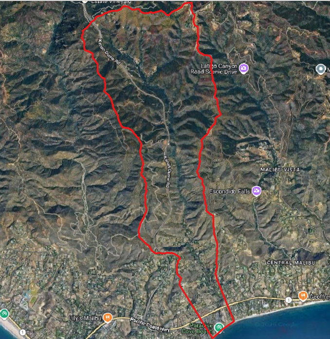
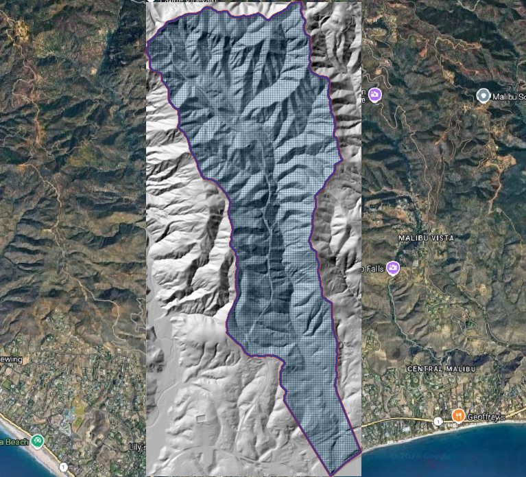
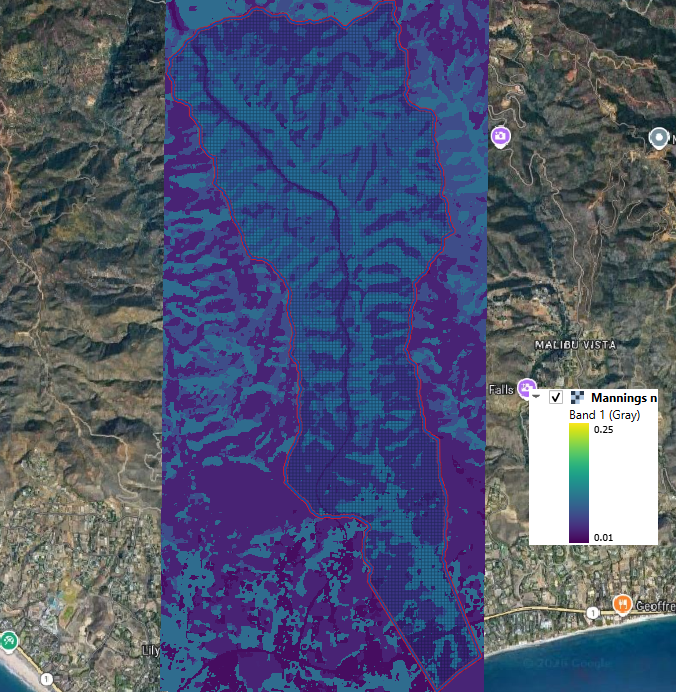

.. _mudflow:

============================================
Mudflow Hazard Assessment on an Alluvial Fan
============================================

Overview
--------

Mudflows are among the most destructive natural hazards in mountainous and semi-arid environments.
Following intense rainfall, large volumes of water, sediment, rock, and debris can rapidly concentrate
within steep drainages and emerge onto downstream alluvial fans where infrastructure and development are often located.

This case study demonstrates a complete FLO-2D workflow for evaluating mudflow hazards on an alluvial fan.
The project combines watershed hydrology, rainfall-runoff modeling, infiltration analysis, and FLO-2D
mudflow routing to estimate downstream inundation, sediment concentrations, flow depths, and velocities.

The workflow illustrates how a rainfall-driven watershed response can be converted into a mudflow
hydrograph and routed through a detailed FLO-2D computational grid.

Project Objectives
------------------

The primary objectives of this study were to:

* Delineate the contributing watershed.
* Develop a rainfall-runoff model for a design storm event.
* Estimate infiltration losses using globally available soil and land use data.
* Generate a runoff hydrograph at the apex of the alluvial fan.
* Convert the flood hydrograph into a mudflow hydrograph.
* Simulate downstream mudflow routing.
* Evaluate potential inundation depths, velocities, and sediment concentrations.

Study Area
----------

The study area consists of a steep mountainous watershed that drains onto a developed alluvial fan.
Numerous tributary channels converge near the apex of the fan where debris flows and mudflows
commonly initiate during short-duration, high-intensity storm events.

*Figure 1. Watershed and alluvial fan study area.*

Data Sources
------------

Several publicly available datasets were used during model development:

* Digital elevation model (DEM)
* National hydrography data
* Design rainfall data
* Soil classification data
* Global land cover data
* High-resolution aerial imagery

These datasets were processed within QGIS and imported directly into the FLO-2D GeoPackage workflow.

Terrain Development
-------------------

A computational domain was created to encompass the contributing watershed and downstream alluvial fan.

Elevation data were interpolated to the FLO-2D grid and used to define overland flow paths, channelized drainage features, and fan topography.

*Figure 2. Computational grid and terrain model.*

Surface Roughness
-----------------

Manning's roughness values were developed using land cover classifications and interpolated to the computational grid.

Spatially varying roughness values were applied to represent:

* Natural channels
* Desert vegetation
* Disturbed areas
* Urbanized regions

*Figure 3. Spatial distribution of Manning's roughness.*

Rainfall Analysis
-----------------

The design storm was selected to represent a short-duration, high-intensity event capable of generating significant runoff and sediment transport.

A temporal rainfall distribution was developed to represent storm intensification and recession over the event duration.

The rainfall distribution was applied directly to the FLO-2D grid using the rainfall editor.

.. image:: img/mudflow004.png
   :align: center

*Figure 4. Design storm rainfall distribution.*

Infiltration Modeling
---------------------

Infiltration losses were estimated using soil and land use information.

Green-Ampt parameters were developed from:

* Soil hydraulic properties
* Land cover classifications
* Surface abstraction characteristics

This process allowed rainfall excess to be converted into runoff while accounting for spatial variability in infiltration rates.

.. image:: img/mudflow005.png
   :align: center

*Figure 5. Infiltration parameter development.*

Hydrologic Response
-------------------

A rainfall-runoff simulation was performed to estimate the watershed response to the design storm.

A floodplain cross section was established near the apex of the alluvial fan to measure the discharge generated by the watershed.

The resulting hydrograph represents the volume and timing of runoff entering the fan system.

.. image:: img/mudflow006.png
   :align: center

*Figure 6. Simulated watershed hydrograph.*

Mudflow Hydrograph Development
------------------------------

The flood hydrograph was converted into a mudflow hydrograph using sediment concentration by volume (Cv) relationships.

The resulting hydrograph includes:

* Water discharge
* Sediment concentration
* Mudflow volume
* Event duration

These data were assigned to an inflow boundary condition within FLO-2D.

.. image:: img/mudflow007.png
   :align: center

*Figure 7. Mudflow hydrograph development.*

Mudflow Routing Simulation
--------------------------

The FLO-2D mudflow model was configured to simulate two-phase flow conditions.

Model inputs included:

* Mudflow hydrograph
* Sediment concentration parameters
* Surface roughness
* Terrain elevations
* Hydraulic structures

The simulation routed the mudflow through channels and across the alluvial fan while accounting for sediment transport and deposition processes.

.. image:: img/mudflow008.png
   :align: center

*Figure 8. FLO-2D mudflow simulation.*

Results
-------

The simulation produced a series of hazard maps that describe the magnitude and extent of the event.

Maximum Mudflow Depth
~~~~~~~~~~~~~~~~~~~~~

.. image:: img/mudflow009.png
   :align: center

*Figure 9. Maximum mudflow depth.*

Maximum Velocity
~~~~~~~~~~~~~~~~

.. image:: img/mudflow010.png
   :align: center

*Figure 10. Maximum mudflow velocity.*

Maximum Sediment Concentration
~~~~~~~~~~~~~~~~~~~~~~~~~~~~~~

.. image:: img/mudflow011.png
   :align: center

*Figure 11. Maximum sediment concentration by volume.*

Combined Hazard Assessment
~~~~~~~~~~~~~~~~~~~~~~~~~~

The resulting hazard maps identify areas potentially exposed to:

* Deep mudflow inundation
* High velocity impacts
* Elevated sediment concentrations
* Deposition zones on the alluvial fan

These outputs can be used to support:

* Hazard mapping
* Infrastructure planning
* Emergency response planning
* Debris-flow mitigation studies
* Land development reviews

Key Findings
------------

* Watershed-scale rainfall runoff can be converted into a defensible mudflow inflow hydrograph.
* Spatially distributed infiltration improves runoff estimation.
* Mudflow routing is highly sensitive to topography and channel confinement.
* Sediment concentration significantly influences downstream hazard extent.
* FLO-2D provides a practical workflow for evaluating rainfall-triggered mudflow hazards.

Conclusion
----------

This case study demonstrates a complete end-to-end workflow for simulating rainfall-generated
mudflows using FLO-2D. By combining watershed hydrology, infiltration analysis, hydrograph
generation, and two-phase mudflow routing, engineers can evaluate potential downstream impacts
and support hazard mitigation planning in debris-flow-prone watersheds.

References
----------

O'Brien, J.S. (2020). *Simulating Mudflow Guidelines*. FLO-2D Software, Inc.

FLO-2D Software, Inc. *Mudflow Modeling Tutorial 2026*.

FLO-2D Reference Manual.