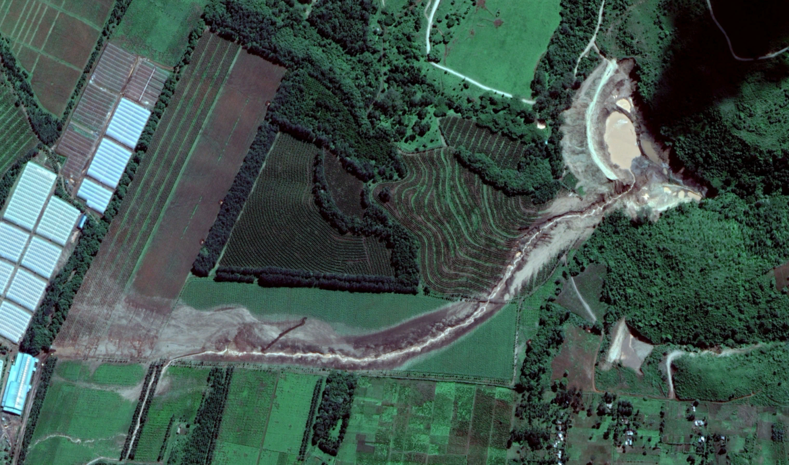

.. vim: syntax=rst

Patel Milmet Dam Failure: A Case Study
======================================

**Disclaimer:**
*This document is intended solely as a demonstration of the FLO-2D QGIS Plugin workflow for a
dam-break modeling and flood inundation mapping.
It is* **NOT** *a formal engineering investigation, calibrated hydraulic study, safety assessment,
or forensic analysis of the Patel (Milmet) Dam failure.
The modeling parameters presented are based on publicly available information and reasonable
engineering assumptions for demonstration purposes only.
The results should therefore be interpreted as an illustration of FLO-2D capabilities
rather than reconstruction of the actual 2018 flood event or a basis for engineering or
regulatory decision-making.*

.. toctree::
   :maxdepth: 1
   :caption: Contenxt

   patel-milmet-failure

