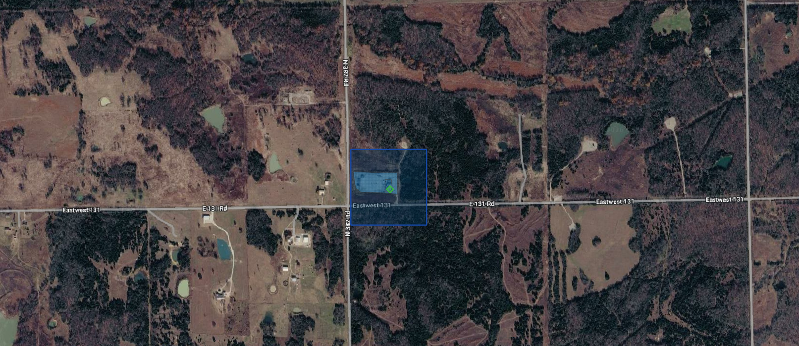
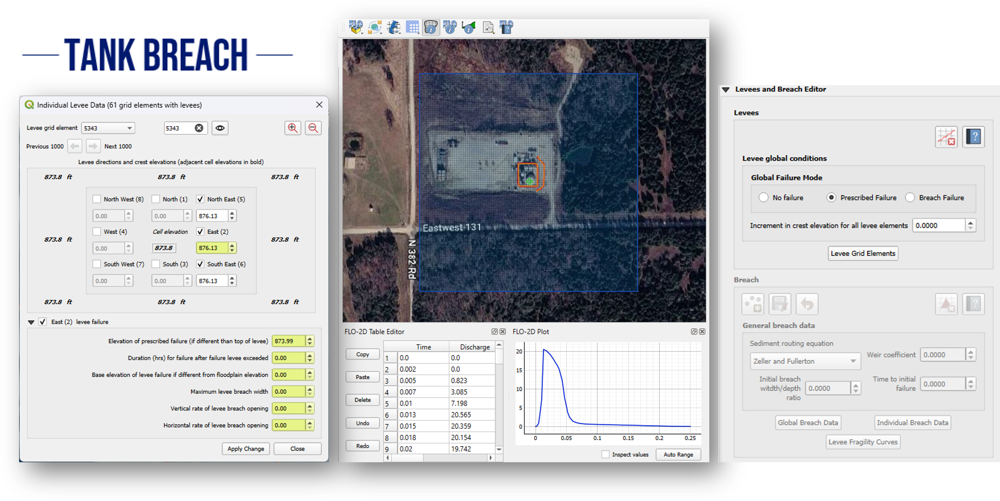
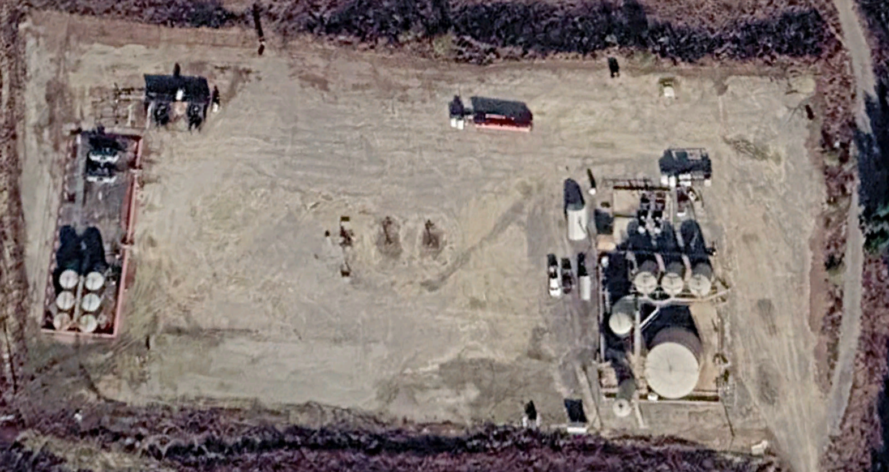
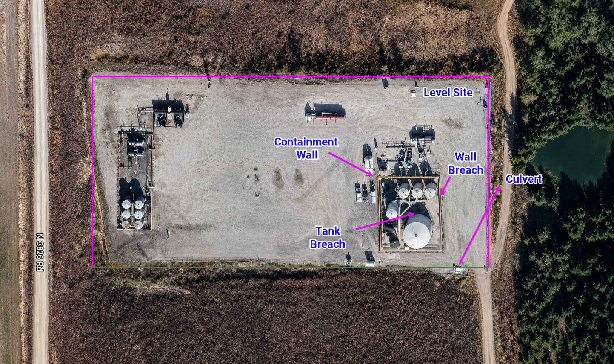
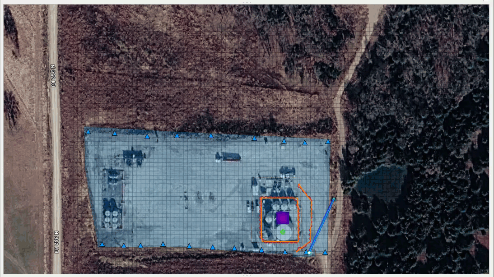

.. vim: syntax=rst

Tank Breach
===========

Introduction
------------

A tank breach is the sudden or progressive failure of a storage tank or containment system that results in the
 uncontrolled release of stored liquid (e.g., water) into the surrounding environment. In FLO-2D, tank breach 
 modeling is used to simulate the movement and extent of the released liquid across the terrain, evaluate 
 whether it remains within containment features such as berms or walls, and identify potential flow paths to 
 nearby drainage systems. This analysis supports emergency response planning, containment design, hazard mapping, 
 and risk assessment.

In this case study, the tank breach and containment wall breach were applied.  The tank breach was simulated with a 
hydrograph and the containment wall breach was simulated with a prescribed breach of using a collapse failure.

This approach is commonly used when site-specific information about the breach characteristics is available or when
regulatory guidance requires the explicit definition of breach parameters. The prescribed breach method allows the
user to control aspects of the failure process.

The prescribed breach method is particularly appropriate for engineering studies where the breach characteristics
can be reasonably estimated based on design information, tank geometry, or regulatory guidance. It can also be
used in consequence assessment, tank safety evaluation, and emergency action planning studies where defined
failure scenario must be simulated ina consistent and repeated manner.

Case Study
----------
For this study a prescribed breach failure of a tank in Oklahoma near the intersection of N382 Rd and E131 Rd.
The minimum and maximum elevation of the site is 846.070 and 903.852 ft, respectively.

Workshop 
~~~~~~~~~~~~~~~~~~~
The Tank Breach Workshop is an advanced FLO-2D Plugin/QGIS training exercise focused on teaching
participants how to build, run, and map a tank-breach flood model. The workshop’s main objectives
are to help participants:

    1. Set up the FLO-2D/QGIS working environment by installing class data, required plugins, QGIS settings,
       and a 3DEP elevation server connection.
    2. Prepare spatial and elevation data in QGIS, including loading a KMZ site file, selecting the Oklahoma
       South coordinate system, adding Google Hybrid imagery, loading 3DEP elevation data, importing LiDAR,
       creating an area of interest, converting LiDAR to raster, and transforming elevation data.
    3. Develop tank breach hydrographs, using both a simple and an advanced breach hydrograph workflow to
       represent the release from a breached tank.
    4. Build and simulate a FLO-2D breach project, including creating a GeoPackage, defining the computational
       domain, creating the grid, assigning elevations, correcting site elevations, adding an inflow node,
       adding containment walls, exporting the model, running the simulation, and creating a recovery file.
    5. Model additional breach and containment features, including a levee breach, a small ditch and culvert,
       and a secondary containment berm.
    6. Review, map, and visualize results, including checking volume, rasterizing output maps, using MapCrafter,
       creating profiles, and animating the breach.

Methodology
~~~~~~~~~~~
The workshop follows a step-by-step, hands-on modeling workflow. It begins with software and data preparation,
where participants install the workshop dataset, configure QGIS, add the FLO-2D and mapping plugins,
and connect to USGS 3DEP elevation data.

Next, participants prepare the GIS inputs by loading the site location, setting the coordinate reference system,
adding background imagery, importing 3DEP and LiDAR elevation data, defining an area of interest,
and converting/transforming elevation layers into usable raster inputs.

The hydrologic input is then created by developing a tank breach hydrograph. The document includes
a workflow where a release volume is converted into a hydrograph and saved as FLO-2D inflow data for use in the model.

After the input preparation, the workshop moves into FLO-2D model construction.
Participants create the breach project database, reload external data, define the computational domain,
generate the grid, assign and correct elevations, place the breach inflow node, and represent containment
structures as levee or wall features.

Finally, the model is exported and run, then results are reviewed through volume checks, raster maps,
MapCrafter outputs, profile plots, and animation of the breach flood behavior. Additional exercises
extend the model to levee breach, culvert/ditch, and secondary containment scenarios.

Sample Results
~~~~~~~~~~~~~~

Overall, the tank breach workflow provides a practical method for evaluating how a tank failure may
behave under different site and release conditions. By creating the FLO-2D grid, assigning elevations,
adding inflow nodes, modeling containment walls or berms, and reviewing mapped results, users can assess
flood extent, containment performance, overtopping potential, and downstream impacts. The tutorial also
highlights that breach behavior can be sensitive to the selected release pattern and timing.