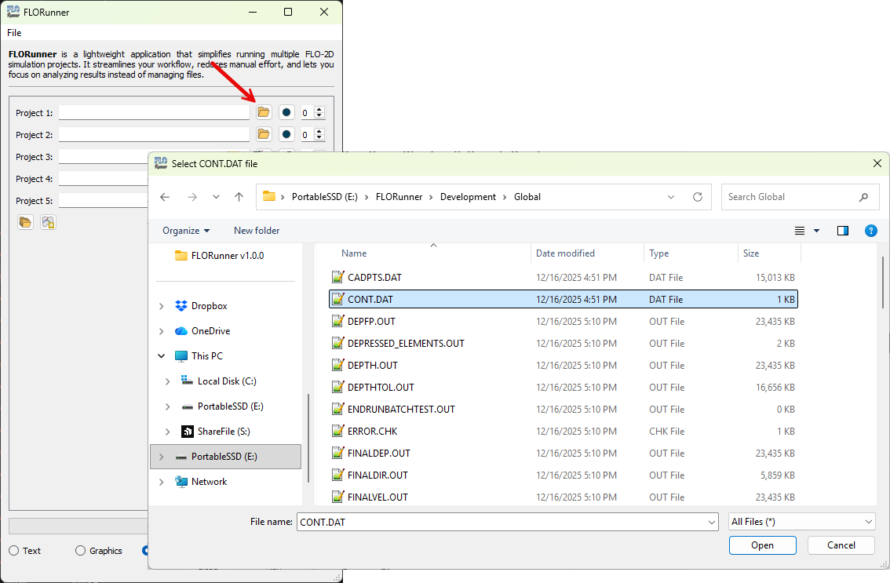

FLORunner
=====================================

1. Select the folder containing your FLO-2D project by clicking the "Folder" button and selecting the 'CONT.DAT'.

2. It is also possible to select multiple project folders at once by clicking the "Multiple folders" button.

.. figure:: img/select_md.png
   :align: center
   :width: 400pt

3. Once the folder(s) is selected, the application will automatically detect all FLO-2D projects within that folder and list them in the main window and check the current status.

.. figure:: img/selected_projects.png
   :align: center
   :width: 400pt

.. note ::

   Green check mark indicates that the project was successfully. Blue circle indicates that the project is on hold. Red warn indicates that the project failed.

4. The last column is the order in which the projects will be run. You can change the order by using the "Up Arrow" and "Down Arrow".

.. figure:: img/project_order.png
   :align: center
   :width: 400pt

.. note ::

    It is not possible to repeat a number in the order column and projects with order 0 will not run.

5. Once the order is set, click the "Run" button to start the simulations in the selected order.

