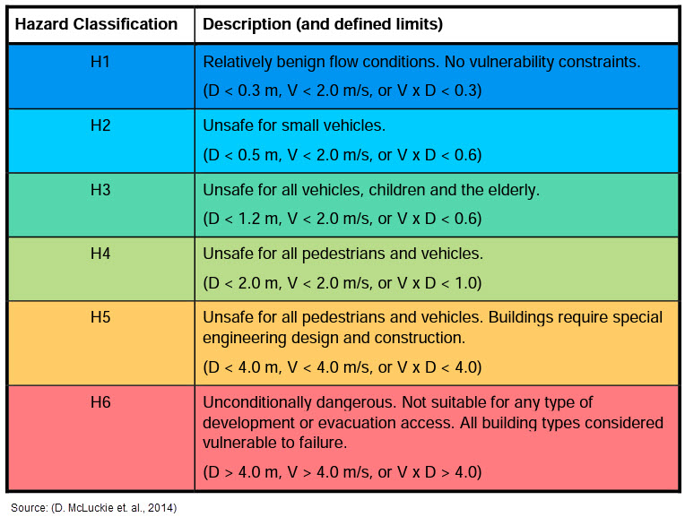
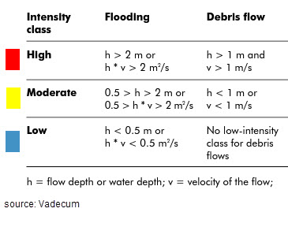

Hazard Maps
===========

Develops hydrodynamic risk maps, highlighting areas with elevated risks
based on FLO-2D simulations, aiding in risk management.

Australian Rainfall & Runoff (ARR)
----------------------------------

This hazard map is based on the *Australian Rainfall & Runoff: A Guide
to Flood Estimation (2019)*.

Flood Hazard Map
~~~~~~~~~~~~~~~~

| :math:`\qquad` H1: Generally safe for vehicles, people and buildings
| :math:`\qquad` H2: Unsafe for small vehicles
| :math:`\qquad` H3: Unsafe for vehicles, children and the elderly
| :math:`\qquad` H4: Unsafe for vehicles and people
| :math:`\qquad` H5: Unsafe for vehicles and people. All buildings
  vulnerable to structural damage. Some less robust buildings subject to
  failure
| :math:`\qquad` H6: Unsafe for vehicles and people. All building types
  considered vulnerable to failure

Swiss
-----

These hazard maps are based on *Vademecum: Hazard maps and related
instruments (2005)*.

Flood Intensity Map
~~~~~~~~~~~~~~~~~~~

| :math:`\qquad` HIGH INTENSITY: Depth > 2 m or Depth \* Velocity > 2
  m²/s
| :math:`\qquad` MODERATE INTENSITY: 0.5 > Depth > 2 m or 0.5 > Depth \*
  Velocity > 2 m²/s
| :math:`\qquad` LOW INTENSITY: Depth < 0.5 m or Depth \* Velocity < 0.5
  m²/s

Debris Intensity Map
~~~~~~~~~~~~~~~~~~~~

| :math:`\qquad` HIGH INTENSITY: Depth > 1 m and Velocity > 1 m/s
| :math:`\qquad` MODERATE INTENSITY: Depth < 1 m or Velocity < 1 m/s

US Bureau of Reclamation
------------------------

.. image:: ../img/haz_3.png

These hazard maps are based on the *Downstream Hazard Classification
Guidelines (1988)*.

Houses Hazard Map
~~~~~~~~~~~~~~~~~

| :math:`\qquad` HIGH DANGER ZONE: Occupants of most houses are in
  danger from flood water
| :math:`\qquad` JUDGMENT ZONE: Danger level is based upon engineering
  judgment
| :math:`\qquad` LOW DANGER ZONE: Occupants of most houses are not
  seriously in danger from flood water

Mobile Home Hazard Map
~~~~~~~~~~~~~~~~~~~~~~

| :math:`\qquad` HIGH DANGER ZONE: Occupants of almost any size mobile
  home are in danger from flood water
| :math:`\qquad` JUDGMENT ZONE: Danger level is based upon engineering
  judgment
| :math:`\qquad` LOW DANGER ZONE: Occupants of almost any size mobile
  home are not seriously in danger from flood water

Vehicle Hazard Map
~~~~~~~~~~~~~~~~~~

| :math:`\qquad` HIGH DANGER ZONE: Occupants of almost any size
  passenger vehicle are in danger from flood water
| :math:`\qquad` JUDGMENT ZONE: Danger level is based upon engineering
  judgment
| :math:`\qquad` LOW DANGER ZONE: Occupants of almost any size passenger
  vehicle are not seriously in danger from flood water

Adults Hazard Map
~~~~~~~~~~~~~~~~~

| :math:`\qquad` HIGH DANGER ZONE: Almost any size adult is in danger
  from flood water
| :math:`\qquad` JUDGMENT ZONE: Danger level is based upon engineering
  judgment
| :math:`\qquad` LOW DANGER ZONE: Almost any size adult is not seriously
  threatened by flood water

Children Hazard Map
~~~~~~~~~~~~~~~~~~~

| :math:`\qquad` HIGH DANGER ZONE: Almost any size child is in danger
  from flood water
| :math:`\qquad` JUDGMENT ZONE: Danger level is based upon engineering
  judgment
| :math:`\qquad` LOW DANGER ZONE: Almost any size child (excluding
  infants) is not seriously threatened by flood water
