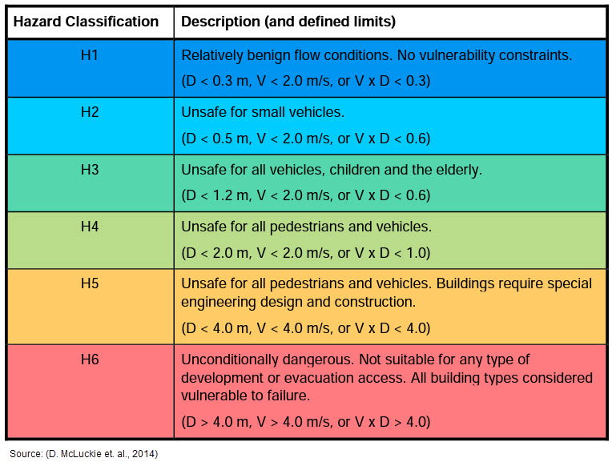
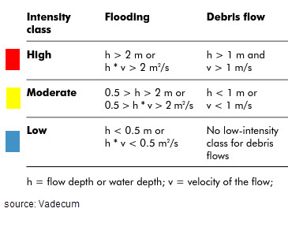
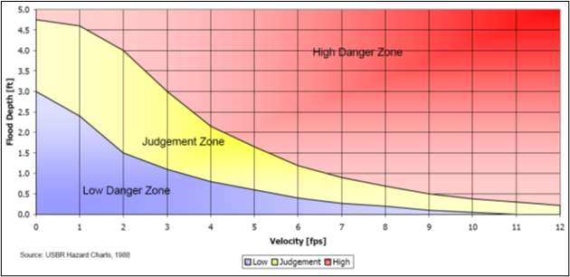

Hazard Maps
===========

Develops hydrodynamic risk maps, highlighting areas with elevated risks
based on FLO-2D simulations, aiding in risk management.

Australian Rainfall & Runoff (ARR)
----------------------------------

This hazard map is based on the *Australian Rainfall & Runoff: A Guide
to Flood Estimation (2019)*.

Flood Hazard Map
~~~~~~~~~~~~~~~~

| :math:`\qquad` H1: Generally safe for vehicles, people and buildings
| :math:`\qquad` H2: Unsafe for small vehicles
| :math:`\qquad` H3: Unsafe for vehicles, children and the elderly
| :math:`\qquad` H4: Unsafe for vehicles and people
| :math:`\qquad` H5: Unsafe for vehicles and people. All buildings
  vulnerable to structural damage. Some less robust buildings subject to
  failure
| :math:`\qquad` H6: Unsafe for vehicles and people. All building types
  considered vulnerable to failure

Swiss
-----

These hazard maps are based on *Vademecum: Hazard maps and related
instruments (2005)*.

Flood Intensity Map
~~~~~~~~~~~~~~~~~~~

| :math:`\qquad` HIGH INTENSITY: Depth > 2 m or Depth \* Velocity > 2
  m²/s
| :math:`\qquad` MODERATE INTENSITY: 0.5 > Depth > 2 m or 0.5 > Depth \*
  Velocity > 2 m²/s
| :math:`\qquad` LOW INTENSITY: Depth < 0.5 m or Depth \* Velocity < 0.5
  m²/s

Debris Intensity Map
~~~~~~~~~~~~~~~~~~~~

| :math:`\qquad` HIGH INTENSITY: Depth > 1 m and Velocity > 1 m/s
| :math:`\qquad` MODERATE INTENSITY: Depth < 1 m or Velocity < 1 m/s

US Bureau of Reclamation
------------------------

These hazard maps are based on the *Downstream Hazard Classification
Guidelines (1988)*.

Houses Hazard Map
~~~~~~~~~~~~~~~~~

| :math:`\qquad` HIGH DANGER ZONE: Occupants of most houses are in
  danger from flood water
| :math:`\qquad` JUDGMENT ZONE: Danger level is based upon engineering
  judgment
| :math:`\qquad` LOW DANGER ZONE: Occupants of most houses are not
  seriously in danger from flood water

Mobile Home Hazard Map
~~~~~~~~~~~~~~~~~~~~~~

| :math:`\qquad` HIGH DANGER ZONE: Occupants of almost any size mobile
  home are in danger from flood water
| :math:`\qquad` JUDGMENT ZONE: Danger level is based upon engineering
  judgment
| :math:`\qquad` LOW DANGER ZONE: Occupants of almost any size mobile
  home are not seriously in danger from flood water

Vehicle Hazard Map
~~~~~~~~~~~~~~~~~~

| :math:`\qquad` HIGH DANGER ZONE: Occupants of almost any size
  passenger vehicle are in danger from flood water
| :math:`\qquad` JUDGMENT ZONE: Danger level is based upon engineering
  judgment
| :math:`\qquad` LOW DANGER ZONE: Occupants of almost any size passenger
  vehicle are not seriously in danger from flood water

Adults Hazard Map
~~~~~~~~~~~~~~~~~

| :math:`\qquad` HIGH DANGER ZONE: Almost any size adult is in danger
  from flood water
| :math:`\qquad` JUDGMENT ZONE: Danger level is based upon engineering
  judgment
| :math:`\qquad` LOW DANGER ZONE: Almost any size adult is not seriously
  threatened by flood water

Children Hazard Map
~~~~~~~~~~~~~~~~~~~

| :math:`\qquad` HIGH DANGER ZONE: Almost any size child is in danger
  from flood water
| :math:`\qquad` JUDGMENT ZONE: Danger level is based upon engineering
  judgment
| :math:`\qquad` LOW DANGER ZONE: Almost any size child (excluding
  infants) is not seriously threatened by flood water

Pier Scour Mapping
=====================

The Pier Scour mapping tool in MapCrafter provides a spatial screening method for identifying areas where hydraulic conditions may contribute to local scour at bridge piers. The tool is intended to support rapid visualization and comparative assessment of scour potential based on FLO-2D simulation results.

Pier scour maps are derived from modeled hydraulic variables and are not a substitute for detailed bridge design or regulatory scour analyses.

---

Purpose and Scope
-------------------

Pier scour mapping is used to:

- Identify zones of elevated scour potential near pier locations
- Compare relative scour severity across multiple events or scenarios
- Support planning-level risk assessments and visualization workflows

The method is best suited for post-event evaluation, dam breach studies, and flood hazard screening where detailed bridge geometry or foundation data may not be available.

---

Governing Variables
-------------------

Pier scour potential is estimated using depth and velocity results extracted from FLO-2D model outputs. The primary variables include:

- Flow depth
- Velocity magnitude
- Optional unit discharge or shear-related indicators

These variables are sampled spatially near pier locations using raster-based analysis.

---

Scour Index Formulation
------------------------

A simplified pier scour index is computed using the depth–velocity product:

.. math::

   S = d \cdot v

where:

- :math:`S` = scour index
- :math:`d` = flow depth
- :math:`v` = velocity magnitude

This index provides a relative measure of hydraulic intensity near pier locations and is used for classification and mapping purposes.

---

Optional Threshold Criteria
-----------------------------

Additional screening criteria may be applied depending on project needs:

Velocity threshold:

.. math::

   v \ge v_{crit}

Depth threshold:

.. math::

   d \ge d_{crit}

Threshold values are user-defined or selected based on internal MapCrafter defaults and should be interpreted as screening indicators rather than design limits.

---

Spatial Evaluation Method
---------------------------

Pier scour potential is evaluated by sampling raster values in the vicinity of pier locations. Typical evaluation approaches include:

- Sampling at pier centroid points
- Sampling within a defined buffer radius
- Selecting maximum values within the sampled area

The resulting scour index values are mapped and symbolized to highlight areas of increased scour potential.

---

Classification and Mapping
--------------------------

Computed scour index values are grouped into relative hazard classes, such as:

- Low scour potential
- Moderate scour potential
- High scour potential

Class breaks may be defined using fixed thresholds or data-driven methods depending on the analysis objective.

The final output is a classified raster or vector layer suitable for visualization, comparison, and reporting.

---

Example Workflow
----------------

1. Run a FLO-2D simulation producing depth and velocity outputs.
2. Load results into QGIS.
3. Open **MapCrafter → Pier Scour**.
4. Select:
   - Depth raster
   - Velocity raster
   - Pier location layer
5. Define sampling method and thresholds.
6. Generate the pier scour map.

---

Outputs
-------

The pier scour tool produces:

- A pier scour index layer
- Classified scour potential maps
- Styled layers compatible with MapCrafter layouts
- Data suitable for further GIS or engineering review

---

Limitations
-----------

- The pier scour map is a screening-level product.
- Structural geometry, foundation depth, and sediment properties are not explicitly modeled.
- Results should not be used directly for design or regulatory determinations.
- Detailed scour evaluations should follow established hydraulic and geotechnical guidelines.

---

Summary
-------

The MapCrafter Pier Scour tool provides a rapid, GIS-based method for visualizing and comparing potential scour conditions using FLO-2D hydraulic results. When used appropriately, it enhances post-processing workflows and supports informed decision-making during flood risk assessments.

