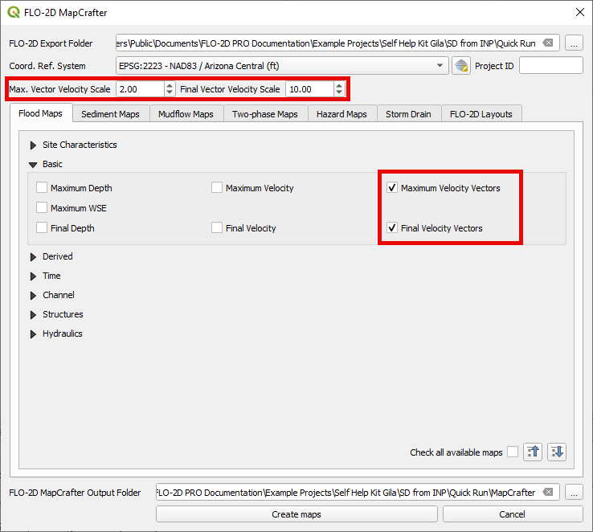
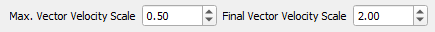

Velocity Vector Maps
====================

The velocity vector maps show the flow direction at the max velocity.

These maps use a point feature with a magnitude and direction to show
the velocity and flow direction at the max velocity.

Sometimes velocities are so small that they do not show up on the map in
a manner that is useful for the reviewer. Other times the velocities are
so long that they make the map look odd.

Adding a Scale Factor to the symbology helps users adjust the view of
the velocity features to make the maps more helpful.

.. image:: ../img/veloc_3.png
