.. vim: syntax=rst

Technical Reference Manual
==========================

Overview
------------

The FLO-2D Plugin for QGIS is a tool to develop, format, analyze, and display data used by the FLO-2D Flood Model.
The Plugin can import project data, generate data and export appropriately formatted FLO-2D data input files for a FLO-2D Project.
This reference manual describes the assumptions, functions, and processes applied in the QGIS Plugin.
A companion manual, the `FLO-2D QGIS Plugin User’s Manual, <https://flo-2dsoftware.github.io/qgis-flo-2d-plugin/index.html>`__ describes the workflow,
outlines the data structure and presents tutorials for the Plugin.
It does not address the functionality and use of the FLO-2D model which has a separate set of reference manuals.

Data File Structure
----------------------
The FLO-2D QGIS Plugin uses native QGIS layers to display FLO-2D project data.
Several aspects of the Plugin file structure are fundamental to understanding project data organization and workflows.

GeoPackage File
^^^^^^^^^^^^^^^^

All FLO-2D project data is stored in an SQLite database conforming to the GeoPackage specification.
The GeoPackage specification is a product of the Open Geospatial Consortium (OGC) and stores spatial data in a non-proprietary database format.
For the FLO2D QGIS Plugin, the GeoPackage file is a \*.gpkg file.
This file is the central repository for project metadata, spatial information, data layers, and attributes.
The Plugin generates and requires a single GeoPackage file for each project.

The GeoPackage file can be perused manually using any compatible SQLite database viewer.
Manual editing of the file, however, is not recommended and manual review of the file is not required for the use of the Plugin.
Plugin tools process and store data within the project GeoPackage.
FLO-2D uses \*.dat or \*.hdf5 files.
These files are exported from the \*.gpkg database.
Figure 1 shows the layout of the layers and tables in QGIS that are used by the FLO-2D Plugin.

.. image:: ../img/technical_reference_manual/tech_ref_manual01.jpg

*Figure 1.
Overview of the QGIS Layout and Layer Structure.*

Project Metadata
^^^^^^^^^^^^^^^^

Non-spatial project metadata, such as data in the CONT.DAT and TOLER.DAT files, as well as the project spatial reference, are stored in tables within
the project GeoPackage file.
While the project spatial reference is not a spatial dataset, the spatial project data within the GeoPackage file is sensitive to the reference
coordinate projection and changes to the selected spatial projection will require regeneration of the project GeoPackage.

Project Spatial Data
^^^^^^^^^^^^^^^^^^^^

Project spatial data is stored within the project GeoPackage file.
All input datasets are assumed to have the same spatial coordinate reference system (CRS) as assigned to the FLO-2D project.
Datasets in other spatial reference systems should first be projected into the FLO-2D project spatial reference system before attempting to use any of
the FLO-2D QGIS Plugin tools.

FLO-2D Plugin
---------------

Python Plugin
^^^^^^^^^^^^^^

The FLO-2D Plugin is built with python code.
The code is open source and available for any programmer to review or edit.
The code is stored in the flo2d directory of the qgis/python/plugins folder (Figure 2).

.. image:: ../img/technical_reference_manual/tech_ref_manual02.jpg

*Figure 2.
Plugin Folder.*

The code can be viewed, queried and edited with any text editor including UltraEdit, Notepad++ or Textpad.
The files include the following:

   \*.png – icon files

   \*.py – python code files

   \*.qml – QGIS layer styles

   \*.svg – icon files

   \*.sql – SQL code relational database information

   \*.ui – QT Creator window editor

The plugin is organized into utility-based directories for plugin files that perform specific functions.
For example, there is a folder for the toolbar and one for the sidebar widgets.

The plugin code is built with Pycharm, and Eclipse.
The python formatting module Black is used to format the code.
Additional python modules are required for some processing purposes.
Numpy, H5PY, HDF5, DASK, and DASK Distributed modules may be installed with the OSGEO4W network installer.
This method is more complicated than the stand-alone installer but allows for build updates, and multiple versions.
It may be necessary to get IT Admin support to add python modules to the QGIS version of Python.

Plugin Processes
-----------------

The Plugin builds a GeoPackage file.
It is generated by running the *FLO-2D Plugin Settings* Tool.
The GeoPackage contains data to define the layers and tables, create layer styles and views.
The Plugin includes all the tools to digitize, import, view, edit and export FLO-2D project data.
The processes include:

    - Import/export tools
    - Elevation interpolation and adjustment tools
    - Levee calculation
    - Sampling spatial data
    - Schematization
    - Rainfall interpolation
    - Infiltration interpolation
    - Storm drain import, export, digitize
    - Storm drain SWMM.inp development tools
    - Channel development tools
    - Sediment transport and mudflow development tools
    - HAZUS development tools

Grid System
^^^^^^^^^^^^

The grid system is defined by using the extent of the *Computational Domain* to generate a grid system boundary.
The code generates a bounding box using the x (max, min), and y (max, min) of the computational domain polygon.
The bounding box aligned to the upper and lower left extent of the computational domain polygon.
The cells of the grid are individual polygons ordered by row and column.
Only polygons that intersect the *Computation Domain* layer are created.
The default numbering system is in order of row and then column (Figure 3).

.. image:: ../img/technical_reference_manual/tech_ref_manual03.jpg

*Figure 3.
Grid Numbering Scheme.*

The Number Units and Coordinate Reference System (CRS) are established when the project GeoPackage is developed using the *FLO-2D Plugin Settings*
Tool.
The grid alignment is generally set to the extent of the computational domain, but it can be aligned to the raster as well as shown in Figure 4.

.. image:: ../img/technical_reference_manual/tech_ref_manual04.png

*Figure 4.
Grid Element Alignment.*

Elevation from Raster
^^^^^^^^^^^^^^^^^^^^^

The *Elevation from Raster* calculator uses the alignment and cell size of the grid system to set the origin and raster resolution of the *Warp* tool.
The `Geospatial Data Abstraction Library (GDAL) Warp <https://gdal.org/programs/gdalwarp.html>`__ tool is used by the FLO-2D Plugin to generate a
temporary elevation file based on one of twelve sampling methods: Near, bilinear, cubic, cubic spline, Lanczos, average, mode, max, min, med, q1 and
q3 (Figure 5).
The warp is an area weighted calculation of every pixel that touches a single grid element.

After the temporary raster is complete, the *grid layer elevation* attribute is filled using a centroid point sampling tool.
The temporary raster is then removed from QGIS memory, but the interpolate raster is saved alongside the source raster.
The external raster layer does not need to have the same coordinates as the project.
The warp will transform the new raster into the grid coordinate system.
If the elevation layer has the wrong units i.e., meters vs ft, convert the raster to the correct units with the raster calculator before running the
elevation from raster processing tool.

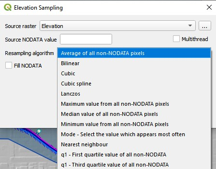

*Figure 5.
Raster Elevation Dialog Box.*

The GDAL warp method is modified so that only the raw input resolution of the raster is applied.
This is the most accurate method for the GDAL warp.
It is slower than using the ORV data.

Elevation from LiDAR
^^^^^^^^^^^^^^^^^^^^

The *Elevation from LiDAR* calculator uses a direct average of the points within each cell.
(Figure 6).

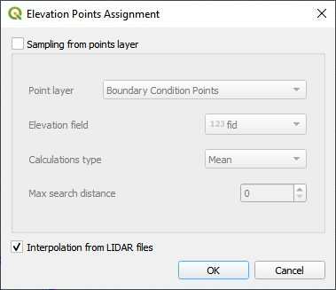

*Figure 6.
Point Elevation Dialog Box.*

   If a cell does not contain a point, the cell elevation is averaged from nearest neighbors (Figure 7).
   The search distance is important if the LiDAR data is filtered from buildings, overpasses, or bridges.
   LiDAR data for FLO-2D usually represents bare ground.
   If the Max search distance is too low, there may be a need to process the neighbor calculation more than once.
   The LiDAR processing tool will identify how many iterations are required to fill the missing grid element elevation.
   Please remember that there are many excellent LiDAR processing tools available, and this tool is fast and accurate so long as there aren’t too many
   very large buildings, overpasses, or bridges.

.. image:: ../img/technical_reference_manual/tech_ref_manual07.jpg

*Figure 7.
Interpolate Empty Cells Dialog.*

Figure 8 shows the elevation interpolation before the missing cell correction, after the missing cell correction and the raster warp.

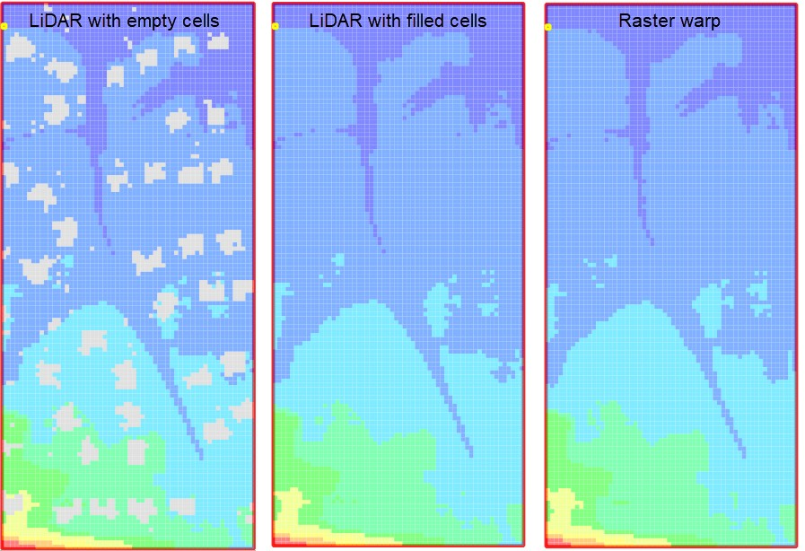

*Figure 8.
Results Test Case 5.*

Elevation Adjustment Tool
^^^^^^^^^^^^^^^^^^^^^^^^^

The *Grid Element Adjustment* tool is used to make modifications and corrections to the grid element elevations without having to manipulate the
original elevation dataset.
It is used to make corrections where the elevation might be assigned incorrectly because of the grid element size.
This process can be used to define first floor building elevations, invert elevations at headwalls, inlet rim elevation corrections and channel invert
and bank elevation corrections.
The *Grid Elevation Adjustment* tool uses several unique processes to redefine baseline elevation data.

User Layers Mode
~~~~~~~~~~~~~~~~~~

The following User Layer corrections are available (Figure 6):

    - TIN (based on elevation points and polygons)
    - TIN (based on elevation polygon boundaries)
    - Elevation polygons attributes
    - Grid statistics within blocked areas

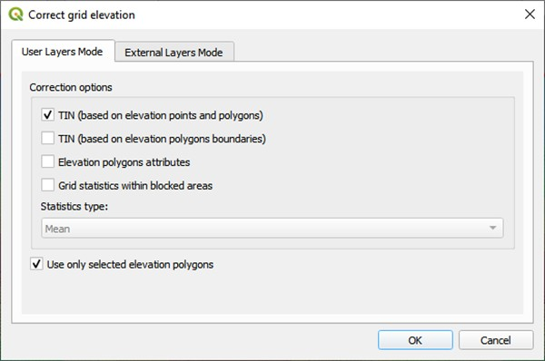

*Figure 9.
Correct Elevation Dialog Box.*

TIN (based on elevation points and polygons)
~~~~~~~~~~~~~~~~~~~~~~~~~~~~~~~~~~~~~~~~~~~~~

This method uses a set of elevation points surrounded by triangular irregular network (TIN).
The TIN generator is derived from the QgsTINInterpolator feature class that is built in to the QGIS processor libraries.
The TIN generator uses the x y coordinates of the elevation correction polygon and the points within the polygon to define the TIN mesh and elevation.
The TIN is finally intersected to the grid and the new elevations are assigned to each grid element covered by the TIN.

TIN (based on elevation polygon boundaries)
~~~~~~~~~~~~~~~~~~~~~~~~~~~~~~~~~~~~~~~~~~~

This method uses a polygon boundary to define a TIN.
The TIN generator is derived from the QgsTINInterpolator feature class that is built in to the QGIS processor libraries.
The TIN generator uses the x y coordinates of the *elevation correction polygon* where it intersects to the grid system.
The elevations along the boundary of the polygon are used to fill or cut the data from channels or levees.
The TIN is finally intersected to the grid and the new elevations are assigned to each grid element covered by the TIN.

Elevation Polygons Attributes
~~~~~~~~~~~~~~~~~~~~~~~~~~~~~~

This method intersects the polygon layer to the grid and assigns the elevation or the elevation correction that is defined in the *Polygon Attribute
Elevation* or *Correction* fields.

Grid Statistics within Blocked Areas
~~~~~~~~~~~~~~~~~~~~~~~~~~~~~~~~~~~~~

This method intersects the polygon to the grid and calculates the elevation statistics of min, max and mean for each cell within the polygon.
The user can select the statistic to use as the final grid element elevation assignment.
Each cell within the polygon will be assigned the same elevation.

External Layers Mode
~~~~~~~~~~~~~~~~~~~~~
The grid element correction from *External Layers Mode* offers several methods to correct or edit elevations in the *Grid* layer from polygon layers
that can be imported into the FLO-2D Project in QGIS (Figure 10).
The tool uses the same correction calculations discussed above in the *User Layers Mode* but applies them to imported polygon layers.

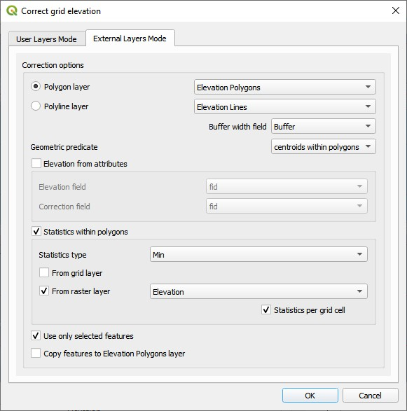

*Figure 10.
Correct Grid Elevation Dialog Box.*

The **polygon layer** is any polygon layer in the layers list.
It can be a layer that is part of the geopackage or an imported shapefile layer.
The polygons in the list should cover grid elements that need to be corrected.

The **polyline layer** can be any external shapefile layer.
It requires a buffer field that contains the width of the feature that is being sampled.
This could be a ditch or a levee or a gutter.
If the buffer width is less than the width of one grid element, the grid element width is sufficient as a buffer width.
The polyline can be placed at the center of a feature that needs an adjustment like the ones in Figure 11.
The polyline layer is essentially a polygon with the line as a center.

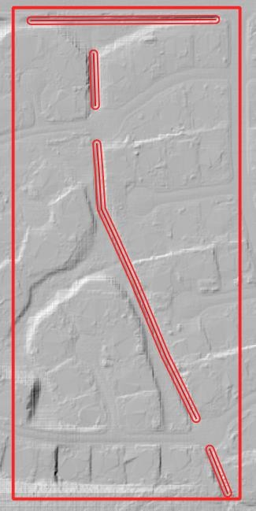

*Figure 11.
Polyline with Buffer.*

The **geometric predicate** is the intersection method that identifies which grid elements will be adjusted.
**Grids within polygons** means the polygon must cover the whole grid element for the grid element to be corrected.
**Centroids within polygons** are more forgiving and only the centroid of each grid element needs to be within a polygon to be corrected.

The **elevation from attributes** correction tool applies a direct correction from the elevation and or correction field of the Polygon Layer.
The elevation field should contain the new desired elevation in ft or m for the polygon and the correction field should contain NULL or a positive or
negative correction value in ft or m.
Depending on the geometric predicate, the correction is applied to each grid element or each centroid that falls within the polygon.

The **statistics within polygons** correction tool uses zonal statistics on wither a group of grid element or a group of pixels that are identified by
the polygon.
If “\ **from grid layer”** is selected, the zonal statistics are applied to the group of grid elements or centroids within the polygon.
Each grid element or centroid will get a min, max or mean of the intersected grid elements.
If “\ **from raster layer”** is selected, the zonal statistics are applied to the raster pixels within the polygon.
Each grid element will be assigned a mean, max or min value of raster pixels within the whole elevation polygon.
If **statistics per grid cell** is checked, the raster zonal statistics will be applied to the individual grid elements within the polygon.
The checkbox should be used in most cases unless a single elevation is desired for a group of cells.

Levee Tool
^^^^^^^^^^^

The *Levee* *Elevation Tool* sees the grid as a set of octagonal sides at a specified distance from the node (Figure 12).

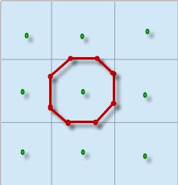

*Figure 12.
Grid Centroid and Octagonal Sides.*

The *Levee Elevation Tool* uses polylines (*Levee Lines*) and crest elevation points (*Elevation Points*) to calculate and digitize the sides of the
grid to the *Levees* layer as “cutoff directions”.
The tool uses a combination of polyline to polygon intersection and point to point interpolation to establish the levee position and crest elevation.
It intersects each side of the octagon with the *Levee Line* and a buffer to create individual polylines for each levee cutoff direction as shown in
Figure 13.

.. image:: ../img/technical_reference_manual/tech_ref_manual013.jpg

*Figure 13.
Levee Cutoff Directions.*

Walls
^^^^^^

The wall calculator is a tool that is used to add polyline data to the Levee Lines (User Layer).
This data can represent any levee like feature but was specifically designed to create urban wall features.
The wall features are copied from a polyline shapefile with the attributes: crest elevation, correction, and name.
The features are copied into the Levee User Layer.

Digitize a wall shapefile to represent the walls that will make a significant impact to the flooding in an urban development.
This represents a wall that may prevent flooding in a neighborhood or walls that may cause flooding by blocking water.
The depth and velocity vector maps can help identify walls that are hydraulically significant.

Wall Polyline Properties
~~~~~~~~~~~~~~~~~~~~~~~~
Walls that have the potential for failure due to collapse should also be identified.
The shapefile must have polyline geometry and should have the following attributes:

    - **Name** – Feature name (string).
      The Name field is required by the dialog box, but the values can be null.
    - **Elevation** – Crest elevation (ft or m) (real).
      For walls, this is the top elevation of the wall.
      This field is required but can be NULL.
      If NULL, the wall elevation is calculated from the correction field and described in correction as an elevation.
    - **Correction** – Elevation correction (ft or m) (real) Null correction is OK.

        - The correction field is ignored if it is NULL.
          If Elevation is not NULL and Correction is positive, it will be added to the elevation of the wall.
        - If Elevation is not NULL and Correction is negative, it will be subtracted from the elevation of the wall.
        - If Elevation is NULL and Correction is filled, the Correction is used as a wall height and is applied to a wall elevation calculation using the grid
          max grid element + the wall height.

Figure 14 shows the relationship between a NULL elevation field and a wall height applied to the correction field.

.. image:: ../img/technical_reference_manual/tech_ref_manual014.jpg

*Figure 14.
Wall Height vs Wall Elevation.*

Wall Failure
~~~~~~~~~~~~~

The wall calculator is used to assign failure data to the levee polylines.
The data required for wall failure is as follows:

    - Fail Elevation or Fail Depth
    - Duration (0 default else, duration water is on levee before failure starts)
    - Maximum Width (0 for wall collapse)
    - Vertical Fail Rate (0 for wall collapse)
    - Horizontal Fail Rate (0 for wall collapse)

When a failure depth option is selected, the failure elevation is calculated from the failure depth variable.
Once the wall failure is assigned to the Levee Lines (User Layer), the Levee Tool will set up the walls and failure for individual grid elements.
Wall failure is complicated due to elevation differences across grid elements.
The Levee Tool evaluates the ground elevation on each side of the levee and applies the Failure Depth to the highest grid element.
The failure elevation is calculated by adding the failure depth to the highest elevation on either side of the grid element.
This condition can be seen on the right-hand side of Figure 15.

.. image:: ../img/technical_reference_manual/tech_ref_manual015.png

*Figure 15.
Grid Element Elevation and Wall Failure.*

Moving Window Optimization
~~~~~~~~~~~~~~~~~~~~~~~~~~~

Walls are typically used on large projects and the calculation process can result in too much data for a computer to process.
To optimize the plugin, a moving window analysis is used.
This window is a geometric bounding box that samples a small set of grid elements at a time.
The window size is 100 x 100 grid elements.
The levee lines are clipped to the window to eliminate duplicate calculations.
Figure 16 shows an example of a grid system split into a bounding box.
Each box in the figure is isolated and calculated individually.

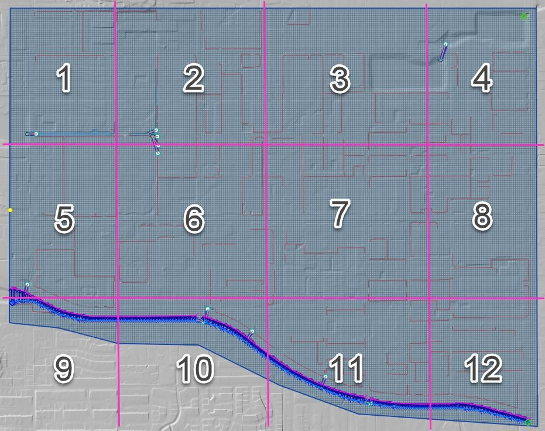

*Figure 16.
Levee and Wall Moving Window Example.*

The final step is to identify and remove duplicates.
The levee tables are sorted and scanned for additional duplicates which are removed.
Redundant levees are also identified and removed.
Duplicate levees are levees with the same cutoff listed twice.
That means the same set of D lines for each L line.
Redundant levees are levees with a neighboring cell that has a facing levee.
They are not typically the same crest elevation.
The plugin will identify redundant levees and delete the levee with the lower crest elevation.

Spatially Variable Data Processing
^^^^^^^^^^^^^^^^^^^^^^^^^^^^^^^^^^

The plugin processes data for several spatially variable data sets.
These include:

    - Manning’s n-value
    - Spatial Tol (LID)
    - Spatial Limiting Froude
    - Spatial Shallow n-value
    - Gutters

To assign spatially variable data, the Plugin uses a combination of intersecting polygons to the grid and uses the centroid to point sample data to
the grid.
The spatial data is stored in the attributes table for each polygon.
Figure 17 shows an example of a polygon with spatial TOL data.
It needs to be assigned to any grid element that intersects the pink polygon.
The processor will intersect the pink area to each grid element and extract the grid element number and the TOL variable into a specific layer.
In some instances, the intersection is not necessary.
A point sample that represents the center of each grid element is used to sample the polygon and extract the data of a known point based on the grid
element ID.

.. image:: ../img/technical_reference_manual/tech_ref_manual017.jpg

*Figure 17.
Spatially Variable Data.*

Area and Width Reduction Factor
^^^^^^^^^^^^^^^^^^^^^^^^^^^^^^^

The calculator intersects the polygons in the *Blocked Areas* (buildings) layer to the polygons in the *Grid* layer and uses the centroid to set up
the ARF/WRF table of variables.
The ARF calculator intersects the *Blocked Areas* polygon with the grid polygon and calculates the area of the building that occupies each grid.
If the grid is totally blocked, the ARF = 1.
If the blockage is greater than 0.9, the ARF is reset to 1.
If the area of the building is a percentage of the grid, then the value is assessed and written to the ARF attribute.
Figure 18 shows an ARF that would have a value of 4.74 / 9.29 = 0.51.

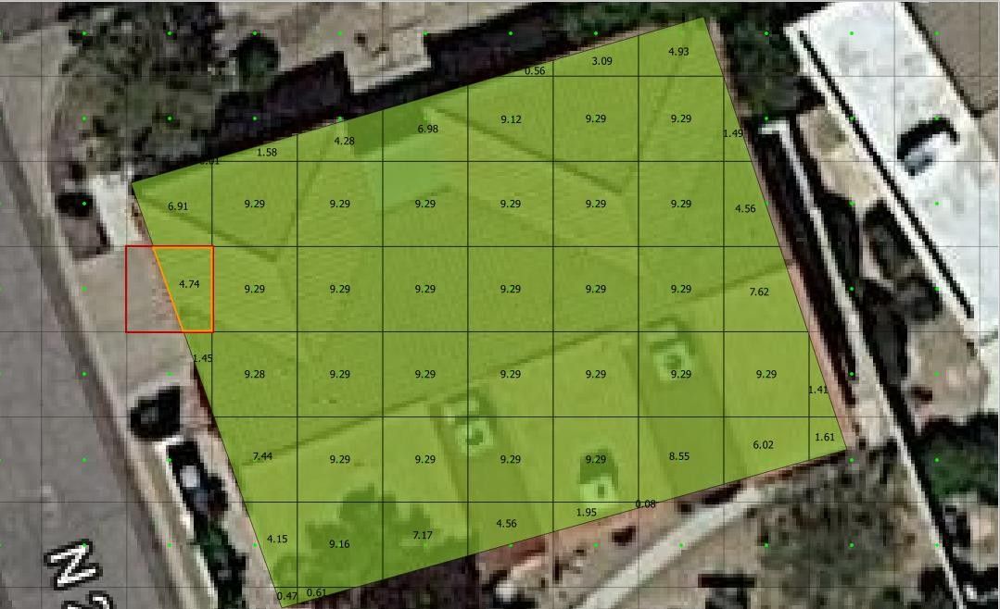

*Figure 18.
Area Reduction Intersection.*

The WRF calculator intersects the *Blocked Areas* polygon to grid element.
It is different in that it intersects the building to the octagonal side of the grid.
The WRF calculator uses the grid centroid, half width and a Lambda function (Python, 2018) to define the grid octagon.
The Lambda function defines the position of the octagon sides.
The octagonal sides are intersected to the polygons in the *Blocked Areas* layer to calculate the width reduction factor (Figure 19).

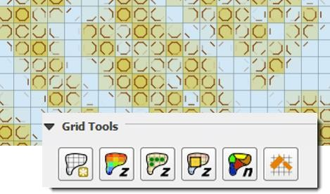

*Figure 19.
Area and Width Reduction Factors.*

The QGIS and GDS have slight differences in calculators.

1. The Plugin will reset ARF = 1 for any cell greater than 0.90 ARF.
   This can be seen in the following image.
   GDS left ARF = 0.94 and QGIS Right ARF = 1 (Figure 20).

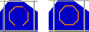

*Figure 20.
ARF GDS / QGIS Comparison.*

2. The GDS inserts redundant WRFs for cells that would otherwise be empty.
   This makes the GDS WRFs look more conservative, but it isn’t necessary.
   GDS on the left and QGIS on the right (Figure 21).

.. image:: ../img/technical_reference_manual/tech_ref_manual021.jpg

*Figure 21.
WRF Redundancy GDS / QGIS Comparison.*

3. QGIS calculator is more accurate on cells that have partial WRFs.
   The GDS WRF on the left is calculated as 0.98.
   The QGIS WRF on the right is calculated at 0.44 and that is more accurate (Figure 22).

.. image:: ../img/technical_reference_manual/tech_ref_manual022.png

*Figure 22.
WRF Calculator GDS / QGIS Comparison.*

Rainfall Interpolation Tool
^^^^^^^^^^^^^^^^^^^^^^^^^^^

The *Rainfall Interpolation Tool* uses rainfall depth rasters like those provided by NOAA Atlas 14.
The original raster resolution is on the order of 2000 by 2000 ft pixels (**Error! R eference source not found.**).

.. image:: ../img/technical_reference_manual/tech_ref_manual023.jpg

*Figure 23.
Rainfall 24hr 100yr NOAA Atlas 14.*

The interpolation processor performs a GDAL *Warp* function to build a rastername_interp.tif.
The new raster has these properties:

    - Reprojected CRS = Project CRS.
    - Pixel size = grid element size.
    - Clipped to Grid layer extent.
    - Aligned to the grid.

The new raster (figure 24) is sampled to the grid using the centroid.
Raster statistics determine the maximum rainfall value (RAIN\ :sub:`max`).
The final RAIN\ :sub:`arf` variable is calculated as a ratio of the local rain depth to the max rain depth.
A rainfall reduction value is calculated for each element in the grid system using Eq.1.

.. math::
    :label:

    𝑅𝐴𝐼𝑁_{arf} = \frac{𝑅𝐴𝐼𝑁_{grid}}{𝑅𝐴𝐼𝑁_{max}}

where:

    RAIN\ :sub:`arf` = A spatially reduced rainfall value

    RAIN\ :sub:`grid` = The rainfall sampled from the centroid of the grid element.

    RAIN\ :sub:`max` = The maximum rainfall for the raster in the project area.

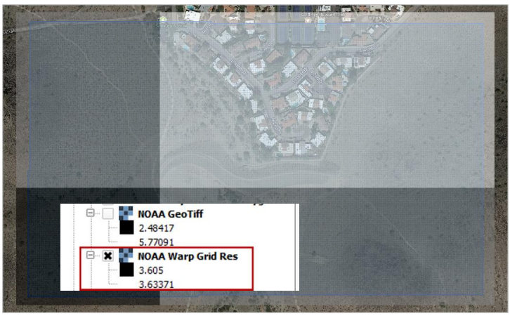

*Figure 24.
Warped Rainfall Raster.*

Real-time Rainfall Sampling Tool (NEXRAD Data)
^^^^^^^^^^^^^^^^^^^^^^^^^^^^^^^^^^^^^^^^^^^^^^

Interpolated rainfall data from NEXRAD is an estimation of a rainfall event over a particular region using data from the NEXRAD radar network.
NEXRAD (Next-Generation Radar) is a network of over 150 high-resolution Doppler weather radars operated by the National Oceanic and Atmospheric
Administration (NOAA) in the United States.

The spatial and temporal resolution of the radar rainfall data is limited by the network coverage, and there are gaps and inconsistencies in the
precipitation data.
The NEXRAD data is post processed or interpolated to rain gage data.
The interpolation algorithms analyze the relationship between the radar observations and the topography of the region to estimate rainfall.
The interpolated rainfall data from NEXRAD can be used by FLO-2D to simulate real storm events.

The *Real-Time Rain Interpolation Tool* requires ascii grid files \*.asc files and a catalog file \*.rtc with the rainfall heading data and list of
grid files to import.
There is one file for every 5 to 15 minutes of rainfall.
Figure 25 shows the layout of a \*.asc file and a group of files.

.. image:: ../img/technical_reference_manual/tech_ref_manual025.jpg

*Figure 25.
NEXRAD Rainfall \*.ASC File Example.*

The \*.asc files are read as rasters in alphabetical order.
Each raster file is warped to the grid and sampled at the centroid as described in the previous section.
The grid assignment is a point sample.
The data is not interpolated.
The plugin will export a

RAINCELL.DAT file or a binary RAINCELL.HDF5 file.
These files contain the entire rainfall event.
Figure 26 shows an example of the rainfall data file.

.. image:: ../img/technical_reference_manual/tech_ref_manual026.jpg

*Figure 26.
RAINCELL.DAT.*

Infiltration Development Tools
^^^^^^^^^^^^^^^^^^^^^^^^^^^^^^^

The *Infiltration Editor* is used to assign infiltration data globally or spatially from polygon layers.
The Infiltration calculators can use embedded layers for infiltration or imported layers.
The infiltration calculators intersect the infiltration polygons to each cell to calculate area weighted infiltration parameters.
The infiltration calculator is optimized to run on large projects with millions of cells.
The optimization process isolates blocks of polygon data and runs them individually as defined by small bounding boxes that break up the data for
processing.
Individual calculations are addressed below for each infiltration type.

Green and Ampt
~~~~~~~~~~~~~~~

There are various methods for assigning spatially variable Green and Ampt data.
The Schematize method assigns data directly to the grid from polygons digitized to the *Infiltration Areas* layer.
The calculator calculates data from external soils and landuse layers.

*Schematize Method*
'''''''''''''''''''

The Schematize Method samples the Infiltration Areas polygons from the grid centroid and assigns the infiltration values that are written in the Green
Ampt fields.
These fields are the fields that are written to the INFIL.DAT file:

    - green_char – green ampt character
    - hydc – hydraulic conductivity
    - soils – soil suction
    - dtheta – soil moisture deficit
    - abstrinf – initial abstraction
    - rtimpf – impervious percentage
    - soildepth – soil depth

The attribute data is written to the infil_cells_green table.
The widget uses the poly2grid processor.
This processor uses an intersection where the grid element centroid is located within a polygon in the Infiltration Areas layer.
The Green-Ampt attributes for the grid elements are copied to the infil_cells_green table.
Any grid element that does not contain a polygon is not written to the table.
That infiltration data will default to the Global Infiltration parameters.

*Green and Ampt (FCDMC Method 2023)*
''''''''''''''''''''''''''''''''''''

The Calculate Green and Ampt Method intersects the landuse and soils polygons to the grid polygons and calculates a spatially variable infiltration
from the external layers.
Figure 27 shows the Compute Green-Ampt dialog for the FCDMC Method 2023.

.. image:: ../img/technical_reference_manual/tech_ref_manual027.jpg

*Figure 27.
Compute Green-Ampt dialog (FCDMC Method 2023)*

This method follows the guidelines in the FCDMC Hydrology Manual from 2023 (FCDMC, 2023).
The difference between this method and the 2018 method is the Log Average of PSIF.
The general calculations are as follows:

    **XKSAT**

    XKXAT is the hydraulic conductivity in in/hr or mm/hr of the soil layer.
    Figure 28 shows the hydraulic conductivity of the soil layer.

    .. image:: ../img/technical_reference_manual/tech_ref_manual028.jpg

    *Figure 28.
    Soil layer with XKSAT.*

    The area weighted log average is calculated for each grid element from the soil layer (Eq.2).

    .. math::
       :label:

       {\overline{XKSAT}}_{grid} = 10\ \hat{}\ \left( \frac{\Sigma A_{i}*log({XKSAT}_{i})}{A_{ge}} \right)

    where:

       XKSAT\ :sub:`i` is obtained from the soil attribute table.

       A\ :sub:`i` is the subarea intercepted by the grid element from the 3\ :sup:`rd` column of the landuse table and *A\ GE* is the grid element area.

    **PSIF**

    PSIF is the wetting front capillary suction in or mm of the soil layer (Figure 29).

    .. image:: ../img/technical_reference_manual/tech_ref_manual029.jpg

    *Figure 29.
    Soil Layer with PSIF.*

    The area weighted log average is calculated for each grid element from the soil layer (Eq.3).
    The soil polygon is intersected with the grid polygon to provide the A\ :sub:`i`.

    .. math::
       :label:

       {\overline{PSIF}}_{grid} = 10\ \hat{}\ \left ( \frac{\Sigma A_{i}*log({PSIF}_{i})}{A_{ge}} \right)

    where:

       PSIF\ :sub:`i` is obtained from the soil attribute table.

       A\ :sub:`i` is subarea intercepted by the grid element from the 3\ :sup:`rd` column of the landuse table and *A\ GE* the grid element area.

    **DTHETA**

    DTHETA is the soil moisture deficit.
    It ranges in value from zero to the effective porosity of the soil (Figure 30).

    .. image:: ../img/technical_reference_manual/tech_ref_manual030.jpg

    *Figure 30.
    Soil Layer with DTHETA.*

    DTHETA represents the soil moisture capacity for the start of a rainfall event.
    The initial soil conditions vary with respect to landuse categories like irrigation or ponded water conditions.
    Initial saturation is part of the landuse data (see Figure 31).

    .. image:: ../img/technical_reference_manual/tech_ref_manual031.jpg

    *Figure 31.
    Landuse with Initial Saturation Condition.*

    As a result, DTHETA is split into individual parts that represent the DTHETA (wet, dry or normal).
    DTHETA\ :sub:`wet` is zero, DTHETA\ :sub:`dry` and DTHETA\ :sub:`normal` are calculated for the soil layers for individual soil groups (Figure 32).

    .. image:: ../img/technical_reference_manual/tech_ref_manual032.png

    *Figure 32.
    DTHETA Dry and Normal.*

    After the soil layer is intersected with the landuse, DTHETA\ :sub:`parts` attributes are filled.

    DTHETA\ :sub:`wet`, DTHETA\ :sub:`normal`, and DTHETA\ :sub:`dry` attributes are filled for individual parts.
    Once DTHETA\ :sub:`parts` is complete, DTHETA\ :sub:`grid` is calculated using a weighted average for each grid element (Eq.4).

    .. math::
       :label:

       {\overline{DTHETA}}_{\mathbf{grid}} = \left( \frac{\Sigma A_{i}*{DTHETA}_{i}}{A_{ge}} \right)

    where:

       DTHETA\ :sub:`i` is taken from the intersected landsoil DTHETA\ :sub:`parts`.

       A\ :sub:`i` is the subarea intercepted by the grid element from the 3\ :sup:`rd` column of the landuse table and *A\ GE* is the grid element area.

       If a grid element is within by a “wet” or “saturated” polygon, the DTHETA for that grid = 0.

    **RTIMP**

    RTIMP is the percent impervious of the landuse (paved surfaces, buildings) and the soil (rockout).
    Figure 33 shows the rock out percentages for the landuse layer.

    .. image:: ../img/technical_reference_manual/tech_ref_manual033.jpg

    *Figure 33.
    Landuse with Rockout Percentages.*

    Intersecting the landuse with the soil combines the data into a single layer (land_soil) of polygon features with attributes of RTIMP\ :sub:`land` and
    RTIMP\ :sub:`natural`.
    The RTIMP\ :sub:`max` is given by Eq.5.

    .. math::
       :label:

       {RTI MP}_{\max} = \max({RTIMP}_{land,\ }{RTIMP}_{natural})

    where:

       RTIMP\ :sub:`max` is the maximum impervious value of the intersection between the landuse data and the soil data.

       RTIMP\ :sub:`land` is percent impervious related to buildings, paved surfaces.

       RTIMP\ :sub:`natural` is percent impervious of the rock outcrop.

    RTIMP\ :sub:`grid` is the intersection of the land_soil and the grid.
    This is an area weighted average impervious decimal calculation (Eq.6) for each grid element.

    .. math::
       :label:

       {RTIMP}_{grid} = \ \frac{\left( \frac{\Sigma{RTIMP}_{\max}*(A_{i})}{A_{ge}} \right)}{100}

    where:

       RTIMP\ :sub:`grid` is the final decimal percent impervious for each grid element.
       RTIMP\ :sub:`max` is the maximum impervious polygon intersected from the land_soil intersection.

       Ai is the subarea intersected by the grid element and the RTIMP\ :sub:`max` polygon.

       A\ :sub:`ge` is the area of the grid element.

    RTIMP\ :sub:`final` is an intersection of the EFF Areas layer and the Grid.
    Any centroid within an EFF polygon is applied to an EFF or effectiveness of the impervious field (Eq.7).

    .. math::
       :label:

       {RTIMP }_{final} = \ \left( {RTIMP}_{grid}*(EFF*.01) \right)

    where:

       RTIMP\ :sub:`final` is the effective imperviousness of the grid element.

       RTIMP\ :sub:`grid` is the intersected imperviousness of the grid element.
       The geometric predicate is centroid within.

    The Green-Ampt parameters are printed to the spatially variable lines of the INFIL.DAT file (Figure 34).
    The INFIL.DAT structure is outlined in the Data Input Manual at the INFIL.DAT tab.
    More information on how FLO-2D uses the Green-Ampt method to calculate rainfall runoff is available in the FLO-2D Pro Reference Manual.

    .. image:: ../img/technical_reference_manual/tech_ref_manual034.jpg

    *Figure 34.
    Example INFIL.DAT file.*

    **VC**

    VC is the vegetative cover related to the topsoil horizon.
    Figure 35 shows the vegetative cover of the landuse layer.

    .. image:: ../img/technical_reference_manual/tech_ref_manual035.jpg

    *Figure 35.
    Landuse with Vegetative Cover.*

    It is used to adjust *XKSAT* (Eq.2) as a function of the vegetation cover VC (Eq.8) from the landuse table when XSAT < 0.4 in/hr.
    This requires a computation of the ratio of the hydraulic conductivity for the vegetative cover to the bare ground hydraulic conductivity (Eq.9):

    .. math::
       :label:

       C_{K} = \left( \frac{{VC}_{K} - 10)}{90} \right) + 1

    .. math::
       :label:

       XKSATC = XKSAT\ \sum_{k}^{}{P_{k}C_{k}}

    where:

        P\ :sub:`k` is the percentage of the area within the grid element corresponding to C\ :sub:`k` and XKSATC for each grid element is written in the
        INFIL.DAT file.

    **IA**

    IA is the initial abstraction for each grid element.
    Figure 36 shows the initial abstraction for the landuse layer.

    .. image:: ../img/technical_reference_manual/tech_ref_manual036.jpg

    *Figure 36.
    Landuse with Initial Abstraction.*

    The intersection between the landuse and grid element gives an area weighted average for the initial abstraction (Eq.10):

    .. math::
       :label:

       IABSTR\  = \left( \frac{\sum_{}^{}{A_{i}({IA}_{i})}}{A_{GE}} \right)

    where:

        IA\ :sub:`i` is the initial abstraction in the subarea *A\ i* intercepted by the element
        and is based on the 3\ :sup:`rd` column of the landuse table.
        The intercepted subareas are computed using the landuse shape file and
        *IABSTR* is added to the INFIL.DAT file for each element.

*Green and Ampt (FCDMC Method 2018)*
''''''''''''''''''''''''''''''''''''

The 2018 method for Green-Ampt uses a different calculator for PSIF and DTHETA.
Figure 37 shows the Compute Green-Ampt dialog for the FCDMC Method 2018.

.. image:: ../img/technical_reference_manual/tech_ref_manual037.jpeg

*Figure 37.
Green-Ampt dialog (FCDMC Method 2018)*

For each grid element, compute wetting front capillary suction PSIF according to the following regressions as a function of *XKSAT* (Generated from
Figure 4.3 of the Maricopa County Drainage Design Manual, 2018).

.. raw:: html

   <table style="border-collapse: collapse; width: 75%;">
     <tr>
       <th style="border: 1px solid #000; padding: 4px;">XKSAT (in/hr)</th>
       <th style="border: 1px solid #000; padding: 4px;">PSIF (in)</th>
     </tr>
     <tr>
       <td style="border: 1px solid #000; padding: 4px;">
         <pre>0.01 ≤ XKSAT ≤ 1.2</pre>
       </td>
       <td style="border: 1px solid #000; padding: 4px;">
         <pre>PSIF = EXP(0.9813 - 0.439*Ln(XKSAT) + 0.0051(Ln(XKSAT))^2 + 0.0060(Ln(XKSAT))^3)</pre>
       </td>
     </tr>
   </table>

.. raw:: html

     

For each grid element, compute volumetric soil moisture deficiency *(DTHETA)* according to the following table.
The specific table used for DTHETA depends on the *saturation* field of the soil table (6th column).

*Saturation = DRY*

.. raw:: html

   <table style="border-collapse: collapse; width: 75%;">
     <tr>
       <th style="border: 1px solid #000; padding: 2px;">XKSAT (in/hr)</th>
       <th style="border: 1px solid #000; padding: 2px;">DTHETA DRY</th>
     </tr>
     <tr>
       <td style="border: 1px solid #000; padding: 2px;"><pre>0.01 ≤ XKSAT ≤ 0.15</pre></td>
       <td style="border: 1px solid #000; padding: 2px;"><pre>DTHETA =EXP(-0.2394 + 0.3616 Ln(XKSAT))</pre></td>
     </tr>
     <tr>
       <td style="border: 1px solid #000; padding: 2px;"><pre>0.15 ≤ XKSAT ≤ 0.25</pre></td>
       <td style="border: 1px solid #000; padding: 2px;"><pre>DTHETA =EXP(-1.4122 - 0.2614 Ln(XKSAT))</pre></td>
     </tr>

     <tr>
       <td style="border: 1px solid #000; padding: 2px;"><pre>0.25 ≤ XKSAT ≤ 1.2</pre></td>
       <td style="border: 1px solid #000; padding: 2px;"><pre>DTHETA = 0.35</pre></td>
     </tr>
   </table>

.. raw:: html

     

*Saturation = NORMAL*

.. raw:: html

   <table style="border-collapse: collapse; width: 75%;">
     <tr>
       <th style="border: 1px solid #000; padding: 2px;">XKSAT (in/hr)</th>
       <th style="border: 1px solid #000; padding: 2px;">DTHETA NORMAL</th>
     </tr>
     <tr>
       <td style="border: 1px solid #000; padding: 2px;"><pre>0.01 ≤ XKSAT ≤ 0.02</pre></td>
       <td style="border: 1px solid #000; padding: 2px;"><pre>DTHETA = EXP(1.6094 + Ln(XKSAT)</pre></td>
     </tr>
     <tr>
       <td style="border: 1px solid #000; padding: 2px;"><pre>0.02 ≤ XKSAT ≤ 0.25</pre></td>
       <td style="border: 1px solid #000; padding: 2px;"><pre>DTHETA = EXP(-0.0142 + 0.5850 Ln(XKSAT))</pre></td>
     </tr>

     <tr>
       <td style="border: 1px solid #000; padding: 2px;"><pre>0.02 ≤ XKSAT ≤ 0.04</pre></td>
       <td style="border: 1px solid #000; padding: 2px;"><pre>DTHETA = 0.15</pre></td>
     </tr>
     <tr>
       <td style="border: 1px solid #000; padding: 2px;"><pre>0.04 ≤ XKSAT ≤ 0.15</pre></td>
       <td style="border: 1px solid #000; padding: 2px;"><pre>DTHETA = EXP(1.0038 + 1.2599 Ln(XKSAT))</pre></td>
     </tr>
     <tr>
       <td style="border: 1px solid #000; padding: 2px;"><pre>0.15 ≤ XKSAT ≤ 0.4</pre></td>
       <td style="border: 1px solid #000; padding: 2px;"><pre>DTHETA = 0.25</pre></td>
     </tr>

     <tr>
       <td style="border: 1px solid #000; padding: 2px;"><pre>0.4 ≤ XKSAT ≤ 1.2</pre></td>
       <td style="border: 1px solid #000; padding: 2px;"><pre>DTHETA = EXP(-1.2342 + 0.1660 Ln(XKSAT))</pre></td>
     </tr>
   </table>

.. raw:: html

     

*Saturation = WET or SATURATED*

.. raw:: html

   <table style="border-collapse: collapse; width: 15%;">
     <tr>
       <td style="border: 1px solid #000; padding: 4px;">
         <pre>DTHETA = 0 for all XKSAT</pre>
       </td>
     </tr>
   </table>

.. raw:: html

     

*Moving Window Optimization*
''''''''''''''''''''''''''''

The moving window code is used to speed up the Green-Ampt infiltration calculator.
This window is a geometric bounding box that samples a small set of grid elements at a time.
The window size is 100 x 100 grid elements.
The polygons are clipped to the window to eliminate duplicate calculations.

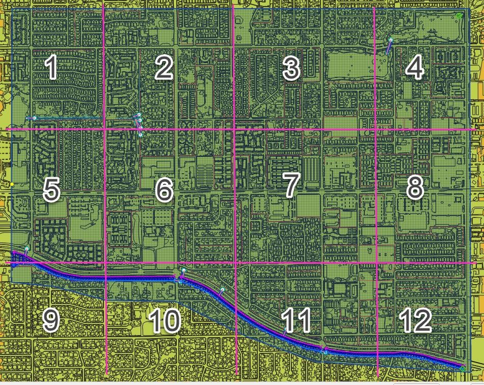

*SCS Curve*
'''''''''''

There are two methods for assigning spatially variable SCS data.
The Schematize method assigns data directly to the grid from polygons digitized to the *Infiltration Areas* layer.
This is the most effective method.

The Calculator assigns the SCS curve number from a single external polygon.
It can also calculate the Pima County method from a combined layer with soil, coverage density and impervious areas.
Each method intersects the infiltration polygons to the grid and assigns an area weighted average to each grid element.
The calculator method requires polygon layers with no geometric deficiencies and therefore is not as desirable as the Schematize method.

*Horton*
''''''''

The Schematize Method assigns data directly to the grid from polygons digitized to the Infiltration Areas layer.
The required data fields are:

    - fhorti – Initial infiltration rate
    - fhortf – Final infiltration rate
    - deca – Decay coefficient

The schematize method intersects the Horton polygons to the grid and assigns the variables using an area weighted average.

Channel Development Tools
^^^^^^^^^^^^^^^^^^^^^^^^^

The channel development tools use several methods and calculators for channel development.
A channel is composed of three polyline layers for the banks and cross sections and a point layer for confluences.
The channel layers are defined by intersecting the left banks to the grid at the nearest centroid to the left bank.

Left Bank Layers
~~~~~~~~~~~~~~~~~

The *Left Bank User Layer* defines the geographical position of the left bank.
The Plugin uses this polyline layer to intersect and connect the left bank grid elements.
The position of the left bank elements is dependent on the position of the polyline vertices.
It is important to note that if left bank schematization does not have accurate bank coverage, more vertices may be required along the length of the
polyline.

The *Left Bank Schematic Layer* is a polyline layer that represents the real position of the FLO-2D channel with a single vertex representing each
channel element in a segment.
Multiple polyline features are used to represent separate channel segments.
Figure 38 shows a sample of the two separate layers.

.. image:: ../img/technical_reference_manual/tech_ref_manual038.jpg

*Figure 38.
Left Bank Layers.*

Cross Section Layers
~~~~~~~~~~~~~~~~~~~~

The *Channel Cross Section User Layer* is used to define the channel geometry and the position of the right bank (Figure 39).
The data requirement is station elevation data from the left top of bank to the right top of bank.
The station elevation data is obtained from several sources including survey data or profile data from rasters or points.
The data can also be defined for trapezoidal or rectangular channels.
The last data source is a variable area equation such as: A = a*d^b.
Where the area is defined by a coefficient, depth, and exponent.

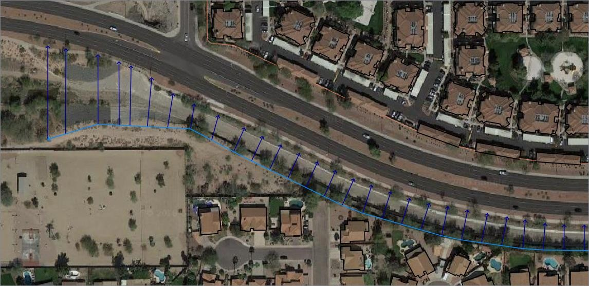

*Figure 39.
Cross Section User Layer.*

Right Banks
~~~~~~~~~~~

The Standard schematization button will produce a right bank according to the position of the cross sections.
It works somewhat similar to the left bank but will allow for more than one cross section to be assigned to a right bank.

Bank Elevation
~~~~~~~~~~~~~~

The plugin uses two methods to define bank elevation.
The first is to assign the bank elevation in the cross section data.
This is the only method for N (Natural) channels as the bank elevation is assigned in the *Station Elevation* table.
Assigning bank elevation is the preferred method for T (trapezoidal), R (rectangular), and V (variable area) channels.
With this method, the left and right bank data is assigned to *Left Bank Elevation* and *Right Bank Elevation* fields in the *Cross Section User
Layer* attributes.

The second bank elevation method is to leave the *Left Bank Elevation* and *Right Bank Elevation* variables NULL.
This method only works with the T, R, and V channel types.
The NULL variable assignment results in No Data being assigned to the Schematized Left Bank Layer.
When no data is assigned, *the Left Bank Elevation* and *Right Bank Elevation* is not written to CHAN.DAT.
The model uses the grid element elevation in lieu of the missing data.

Interpolation
~~~~~~~~~~~~~

The Plugin uses the same interpolator that the PROFILES program uses.
It is an external App that is installed into the FLO-2D Pro subdirectory along with the FLO-2D software.
The Plugin exports the CHAN.DAT, CHANBANK.DAT, and XSEC.DAT and executes the interpolation program.
The data is reloaded into the Plugin *Schematic Layers* with the interpolation dialog box.

Import HEC-RAS
~~~~~~~~~~~~~~

The *Import HEC-RAS* tool is used to import channel data from HEC-RAS geometry files.
The RAS project must be georeferenced and in the same coordinate system as the GeoPackage.
This system can import channel geometry, full cross sections, bank to bank cross sections, interpolated cross sections and levees.

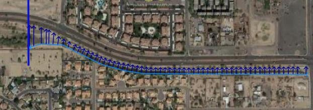

*Figure 40.
HEC-RAS Import.*

Upon import, the HEC-RAS channels are saved to the *User Layers* (Figure 40).
The data is saved to the left bank and cross section layers.
It is important to note that the data imported to QGIS is read from the \*.g0 file in linear order.
The channels are imported as segment 1 being the first data set and segment 2 is next in order of the geometry file.
If the channel data is in the wrong order, it should be corrected before being imported.

Cross sections are saved to the Cross Section layer in the order by which they were written to the geometry file.
The cross section names are extracted from the river mile field (Figure 41).

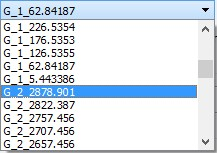

*Figure 41.
Channel Cross Sections.*

Storm Drain Development Tools
^^^^^^^^^^^^^^^^^^^^^^^^^^^^^

The FLO-2D surface water model has a dynamic exchange with the storm drain system.
FLO-2D calculates the surface water depth at grid cells.
Those cells that contain the storm drain inlets use the surface water depth and the inlet geometry, to compute the discharge inflow to the storm drain
system.
The storm drain engine then routes the flow in the pipe network and calculates potential return flow to the surface water system (Figure 42).

The `Storm Drain Editor <https://flo-2dsoftware.github.io/qgis-flo-2d-plugin/widgets/storm-drainer-editor/Storm%20Drain.html>`__ application and setup
are well documented in the FLO-2D Plugin User Manual and a detailed tutorial is available `online.
<https://documentation.flo-2d.com/Workshops/Lesson%203.html>`__ This document will discuss data management and important algorithms in the
calculators.

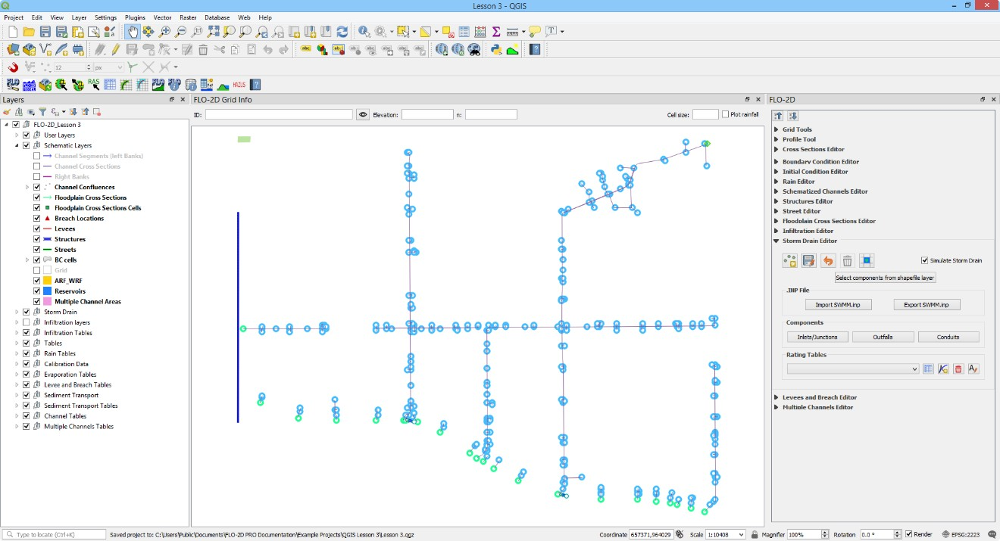

*Figure 42.
Storm Drain Layout in QGIS.*

The Storm Drain data files (SWMM.INP and \*.DAT files) can be developed from scratch in the FLO-2D *Plugin Storm Drain Editor* by assigning the data
from shapefiles to the storm drain features.
Figure 43 shows the *Storm Drain* dialog box.

.. image:: ../img/technical_reference_manual/tech_ref_manual043.jpg

*Figure 43.
Storm Drain Dialog Box.*

QGIS can be used to create the storm drain shapefiles for Inlets/Junctions, Outfalls and Conduits.
These shapefiles contain all the required data to fill the Storm Drain data files (see FLO-2D Plugin User’s Manual and FLO-2D Storm Drain Manual for
more information about the required data for each component).
If the storm drain shapefiles exist, they can be imported into the QGIS project.
If the storm drain shapefiles do not exist, they can be digitized into *Storm Drain User Layers* (Figure 44).

.. image:: ../img/technical_reference_manual/tech_ref_manual044.jpg

*Figure 44.
Storm Drain Shapefiles.*

Storm Drain Components
~~~~~~~~~~~~~~~~~~~~~~
The Storm Drain Configuration Tool (Figure 45), is the main processing tool for storm drain development.
The algorithms copy features and attributes from shapefiles into the storm drain tables and layers.
This organizes the data in a manner that is ideal for the swmm.inp, SWMMFLO.DAT, and SWMMOUTF.DAT data files.

.. image:: ../img/technical_reference_manual/tech_ref_manual045.jpg

*Figure 45.
Select Components from Shapefile Layer: Inlet/Junctions.*

The data layout and organization prevent array allocation errors between FLO-2D engine and the storm drain engine.
The features are written in the correct order from between swmm.inp and SWMMFLO.DAT.

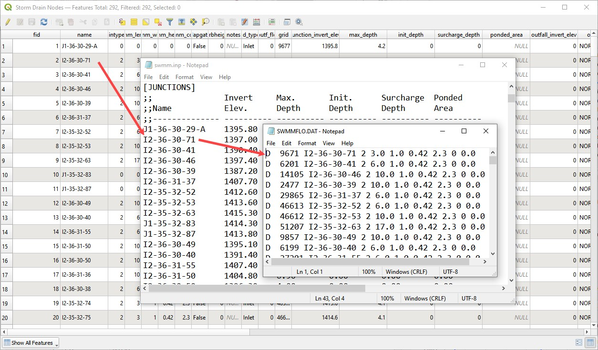

*Figure 46.
Data Organization Inlets.*

The finished tables can be validated and edited with the node and link dialog boxes (Figure 47).
These boxes highlight and pan/zoom to the current feature and allow extra data to be assigned.
Changes to these dialog boxes automatically update the storm drain arrays.

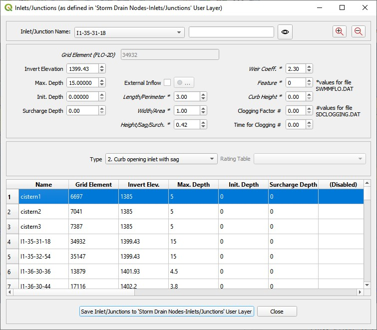

*Figure 47.
Review Attributes from Storm Drain Table.*

Digitizing Storm Drain Features
~~~~~~~~~~~~~~~~~~~~~~~~~~~~~~~

Storm Drain features can be created in QGIS for the development of the INP file.
Point layer shapefiles must be created for Inlets/Junctions and outfalls.
Line Layer Shapefiles must be created for conduits.
Once the shapefiles have been created, features from the shapefiles can be selected and assigned to the storm drain data.

The storm drain editor has an option *to Select Components from Shapefile Layer* in the *Storm Drain Editor*.
The selected attributes will be assigned to the *Inlets/Junctions, Outfalls and Conduits Components Tables* in *User Layers*.

The data must be schematized using the schematize button in the *Storm Drain Editor*.

Then the \*.INP can be created by clicking Export SWMM.inp.
Storm drain data files as:

SWMMFLO.DAT file, SWMMOUTF.DAT File and SWMMFLORT.DAT file will be created when FLO-2D Data Files are exported in the QGIS Project.
The Storm Drain component needs to be turned ON in the FLO-2D Control and Tolerance Variables.

Importing existing \*.INP file
~~~~~~~~~~~~~~~~~~~~~~~~~~~~~~

An existing \*.INP file can be imported with the buttons in Figure 48 once the FLO-2D surface model has been already created.
The *Storm Drain Editor* has an option to Import SWMM.inp that can be used to read an existing \*.INP file.
Storm drain systems created using other software can be imported if the format is compatible with EPA SWMM Version 5.

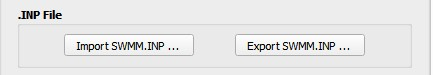

*Figure 48.
Import Export SWMM.INP Options.*

The storm drain features will be read from the \*.INP file and the *Inlets/Junctions, Outfalls* and *Conduits* tables in the components section in the
*Storm Drain Editor* will be completed.

Auto assign nodes
~~~~~~~~~~~~~~~~~

The auto assign tool (Figure 49) scans the polyline data and finds the nodes at the upstream and downstream end.
The node names fields from the Link tables are filled automatically.

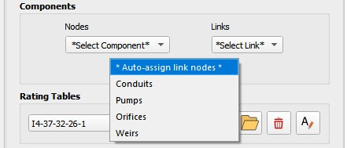

*Figure 49.
Auto Assign Tool.*

The algorithm uses a loop to read the xy coordinate of each end of the polyline using the xat,yat vertex(1) and xat,yat vertex (-1).
This calls the first and last vertex of each line.
A small buffer is then applied to each of the points.
If a node is within the buffer, it is assigned to the InNode or OutNode table for each of the Link features.
It is important that the links are digitized in the correct flow direction.
Arrows are used in the feature style to represent the flow direction.
Figure 50 shows the nodes next to each end of the link and the flow direction is shown by the blue arrows.

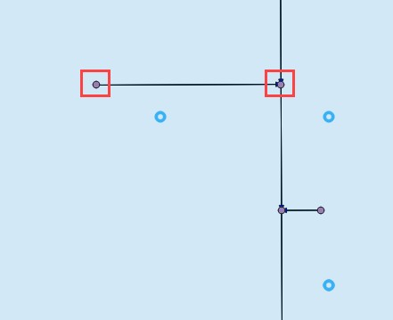

*Figure 50.
Link Node and Flow Direction.*

Rating Tables and Pump Curves
~~~~~~~~~~~~~~~~~~~~~~~~~~~~~

The rating table and pump curve tools (Figure 51) can import or build tabular data for type 4 inlets and pumps.
These tools are connected to the table and plotting windows shown in Figure 52.
These tools facilitate data assignment by automatically finding node names or link names and assigning the data with the same name.

.. image:: ../img/technical_reference_manual/tech_ref_manual051.jpg

*Figure 51.
Rating Tables and Pump Curves.*

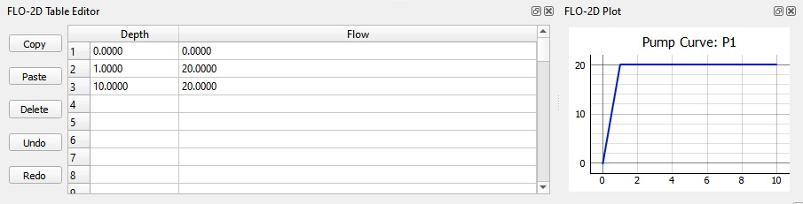

*Figure 52.
Table Editor and Plotting Window.*

Hazus tools
^^^^^^^^^^^^

The *Hazus* tool will generate a raster maximum depth file that can be used as an input for the FEMA Hazus program.
The required layers include building shape files, grid cell elevations, grid cell depth and water surface elevations.
The user must define ground elevation, water surface elevation and maximum flow depth for each building.
An adjustment factor can be applied to calculate the finished floor elevation.
Figure 53 shows the tool requirements.

.. image:: ../img/technical_reference_manual/tech_ref_manual053.jpg

*Figure 53.
Hazus Tool.*

The process to generate a Hazus raster is outlined in the User’s Manual.
It requires the use of several general QGIS tools for importing, intersecting, calculating, and rasterizing data.
The requirements and calculations are outlined below for each layer.

    - **Building** **layer** – This layer is used to define the building locations and set the building ID.
    - **Depth** **and water surface data** – FLO-2D results imported as text files.
    - **Assign water surface and depth** – This calculation process uses a simple Join feature to write the results into the Grid layer.
    - **Intersect buildings layer** – This QGIS process splits the building polygons into separate polygons for each grid element.
    - **Homogenize the building intersection layer** – This process joins the split buildings to the grid elevation, depth and water elevation data and
      calculates statistics for the building.
    - **Join building statistics to building polygons** – This QGIS process writes the stats back to the Buildings layer.
    - **Rasterize** – This QGIS process rasterizes building depth and water surface data for Hazus.

References
-----------

Library of Congress, 2017.
Geopackage Encoding Standard (OGC), version 1.0, https://www.loc.gov/preservation/digital/formats/fdd/fdd000419.shtml

Python Software Foundation, 2018.
The Python Tutorial, Python English 2.7.15 Documentation, https://docs.python.org/2.7/tutorial

Flood Control District of Maricopa County, 2018, Drainage Design Manual for Maricopa County, Arizona Hydrology.

Flood Control District of Maricopa County, 2023, Drainage Design Manual for Maricopa County, Arizona Hydrology.

Appendix A GeoPackage Structure
---------------------------------

all_schem_bc
^^^^^^^^^^^^

A table that stores the boundary condition cell data from the BC cells schematic layer.

.. list-table::
   :widths: 33 33 33
   :header-rows: 0

   * - **Field Name**
     - **Field Type**
     - **Description**

   * - **fid**
     - INTEGER
     - Unit fid is unique and not associated with the grid id.

   * - **type**
     - TEXT
     - Defines inlet or outlet.

   * - **tab_bc_fid**
     - INTEGER
     - Link to the hydrograph or stage timetable.

   * - **grid_fid (DUM)**
     - INTEGER
     - Grid element id of the cell.

   * - **geom**
     - POLYGON
     - Polygon of the cell.

blocked_cells
^^^^^^^^^^^^^^^

This table lists the data stored in the ARF_WRF layer of the Schematic group.
The ARF_WRF layer stores the data written to the ARF.DAT file.

.. list-table::
   :widths: 33 33 33
   :header-rows: 0

   * - **Field Name**
     - **Field Type**
     - **Description**

   * - **fid**
     - INTEGER
     - Unique id not related to the grid element.

   * - **grid_fid (igd / ittawf)**
     - INTEGER
     - Grid element id of the cell.

   * - **area_fid**
     - INTEGER
     - Id of the blocked areas layer in the User Layers group.

   * - **arf**
     - REAL
     - Area reduction factor.

   * - **wrf1**
     - REAL
     - Width reduction factor north.

   * - **wrf2**
     - REAL
     - Width reduction factor east.

   * - **wrf3**
     - REAL
     - Width reduction factor south.

   * - **wrf4**
     - REAL
     - Width reduction factor west.

   * - **wrf5**
     - REAL
     - Width reduction factor northeast.

   * - **wrf6**
     - REAL
     - Width reduction factor southeast.

   * - **wrf7**
     - REAL
     - Width reduction factor southwest.

   * - **wrf8**
     - REAL
     - Width reduction factor northwest.

   * - **geom**
     - POINT
     - A point layer but the style of the layer is set up to look like blocked cells with 8 direction blockage.

breach
^^^^^^^^

Individual breach data stored in the breach.dat file.
This table works with import and export.
It can be edited in the Breach layer of the Schematic Layers group.

.. list-table::
   :widths: 33 33 33
   :header-rows: 0

   * - **Field Name**
     - **Field Type**
     - **Description**

   * - **fid**
     - INTEGER
     - Unit fid is unique and not associated with the grid id.

   * - **ibreachdir**
     - INTEGER
     - Breach direction.

   * - **zu**
     - REAL
     - Upstream face slope.

   * - **zd**
     - REAL
     - Downstream face slope.

   * - **zc**
     - REAL
     - Upstream and downstream core slope.

   * - **crestwidth**
     - REAL
     - Crest width of the dam or levee.

   * - **crestlength**
     - REAL
     - Crest length of the dam or levee

   * - **brbotwidmax**
     - REAL
     - Maximum breach width at the bottom.

   * - **brtopwidmax**
     - REAL
     - Maximum breach width at the top of the breach.

   * - **brbottomel**
     - REAL
     - Minimum erosion elevation of the breach.

   * - **weircoef**
     - REAL
     - Weir coefficient.

   * - **d50c**
     - REAL
     - Mean sediment size core.

   * - **porc**
     - REAL
     - The porosity of the core material.

   * - **uwc**
     - REAL
     - Unit weight core.

   * - **cnc**
     - REAL
     - Manning’s n core.

   * - **afrc**
     - REAL
     - Angle of internal friction core.

   * - **unfcc**
     - REAL
     - Cohesive strength core.

   * - **cohc**
     - REAL
     - Sediment gradient core.

   * - **d50s**
     - REAL
     - Mean sediment size shell.

   * - **pors**
     - REAL
     - The porosity of the shell.

   * - **uws**
     - REAL
     - Unit weight shell.

   * - **cns**
     - REAL
     - Manning’s n shell.

   * - **afrs**
     - REAL
     - Angle of internal friction shell.

   * - **cohs**
     - REAL
     - Cohesive strength shell.

   * - **unfcs**
     - REAL
     - Sediment gradient shell.

   * - **bratio**
     - REAL
     - The ratio of initial breach width to depth.

   * - **grasslength**
     - REAL
     - Average grass length on downstream face.

   * - **grasslength**
     - REAL
     - Average grass length on downstream face.

   * - **grasscond**
     - REAL
     - The condition of the grass. Poor or Good.

   * - **grassvmaxp**
     - REAL
     - Maximum permissible velocity for the the grasslined downstream face.

   * - **sedconmax**
     - REAL
     - Maximum sediment concentration.

   * - **d50df**
     - REAL
     - Mean sediment size of the downstream upper one foot face.

   * - **unfcdf**
     - REAL
     - Sediment gradient of the downstream upper one foot face.

   * - **breachtime**
     - REAL
     - Length of time between the initial breach condition and the start of the breach.

   * - **geom**
     - POINT
     - Breach layer is a point layer.

breach_cells
^^^^^^^^^^^^^

.. list-table::
   :widths: 33 33 33
   :header-rows: 0

   * - **Field Name**
     - **Field Type**
     - **Description**

   * - **fid**
     - INTEGER
     - Unit fid is unique and not associated with the grid id or the breach id.

   * - **breach_fid**
     - INTEGER
     - Id that joins to the breach point layer.

   * - **grid_fid (dum)**
     - INTEGER
     - Grid element id of the cell.

breach_fragility_curves
^^^^^^^^^^^^^^^^^^^^^^^

.. list-table::
   :widths: 33 33 33
   :header-rows: 0

   * - **Field Name**
     - **Field Type**
     - **Description**

   * - **fid**
     - INTEGER
     - Unit fid is unique and not associated with the grid id.

   * - **fragchar**
     - TEXT
     - Fragility character.

   * - **prfail**
     - REAL
     - Levee fragility failure probability.

   * - **prdepth**
     - REAL
     - The distance below levee crest paired with the failure probability.

breach_global
^^^^^^^^^^^^^^

.. list-table::
   :widths: 33 33 33
   :header-rows: 0

   * - **Field Name**
     - **Field Type**
     - **Description**

   * - **fid**
     - INTEGER
     - Unit fid is unique and not associated with the grid id.

   * - **ibreachsedeqn**
     - INTEGER
     - Unit fid is unique and not associated with the grid id.

   * - **gbratio**
     - REAL
     - The ratio of the initial breach width to breach depth.

   * - **gweircoef**
     - REAL
     - Weir coefficient

   * - **gbreachtime**
     - REAL
     - Time to start of erosion from when pipe elevation is reached.

   * - **gzu**
     - REAL
     - Upstream face slope.

   * - **gzd**
     - REAL
     - Downstream face slope.

   * - **gzc**
     - REAL
     - Upstream and downstream core slope.

   * - **gcrestwidth**
     - REAL
     - Crest width of the dam or levee.

   * - **gcrestlength**
     - REAL
     - Crest length of the dam or levee.

   * - **gbrbotwidmax**
     - REAL
     - Maximum breach width at the bottom.

   * - **gbrtopwidmax**
     - REAL
     - Maximum breach width at the top of the breach.

   * - **gbrbottomel**
     - REAL
     - Minimum erosion elevation of the breach.

   * - **gd50c**
     - REAL
     - D50 of the core material.

   * - **gporc**
     - REAL
     - The porosity of the core material.

   * - **guwc**
     - REAL
     - Unit weight core.

   * - **gcnc**
     - REAL
     - Manning’s n core.

   * - **gafrc**
     - REAL
     - Angle of internal friction core.

   * - **gcohc**
     - REAL
     - Cohesive strength core.

   * - **gunfcc**
     - REAL
     - Sediment gradient core.

   * - **gd50s**
     - REAL
     - Mean sediment size shell.

   * - **gpors**
     - REAL
     - The porosity of the shell.

   * - **guws**
     - REAL
     - Unit weight shell.

   * - **gcns**
     - REAL
     - Manning’s n shell.

   * - **gafrs**
     - REAL
     - Angle of internal friction shell.

   * - **gcohs**
     - REAL
     - Cohesive strength shell.

   * - **ggrasslength**
     - REAL
     - Sediment gradient shell.

   * - **gunfcs**
     - REAL
     - Average grass length on downstream face.

   * - **ggrasscond**
     - REAL
     - Condition of grass. Poor or Good.

   * - **ggrassvmaxp**
     - REAL
     - Maximum permissible velocity for grass lined downstream face.

   * - **gsedconmax**
     - REAL
     - Maximum sediment concentration.

   * - **d50df**
     - REAL
     - Mean sediment size of the downstream upper one foot face.

   * - **gunfcdf**
     - REAL
     - Sediment gradient of the downstream upper one foot face.

bridge_variables
^^^^^^^^^^^^^^^^

.. list-table::
   :widths: 33 33 33
   :header-rows: 0

   * - **Field Name**
     - **Field Type**
     - **Description**

   * - **struct_fid**
     - INTEGER
     - structure fid for which the data are defined "IBTYPE" INTEGER.

   * - **IBTYPE**
     - INTEGER
     - Type of bridge configuration (see Appendix figures).

   * - **COEFF**
     - REAL
     - Overall bridge discharge coefficient assigned or computed (default = 0.).

   * - **C_PRIME_USER**
     - REAL
     - Baseline bridge discharge coefficient to be adjusted with detail coefficients.

   * - **KF_COE**
     - REAL
     - Froude number coefficient assigned or computed (= 0.).

   * - **KWW_COEF**
     - REAL
     - Wingwall coefficient assigned or computed (= 0.).

   * - **KPHI_COEF**
     - REAL
     - Flow angle with bridge coefficient assigned or computed (= 0.).

   * - **KY_COEF**
     - REAL
     - Coefficient associated with sloping embankments and vertical abutments (= 0.).

   * - **KX_COEF**
     - REAL
     - Coefficient associated with sloping abutments assigned or computed (= 0.).

   * - **KX_COEF**
     - REAL
     - Coefficient associated with sloping abutments assigned or computed (= 0.).

   * - **KJ_COEF**
     - REAL
     - Coefficient associated with pier and piles assigned or computer (= 0.).

   * - **BOPENING**
     - REAL
     - Bridge opening width (ft or REAL**BOPENING** m). See Figure 7.

   * - **BLENGTH**
     - REAL
     - Bridge length from upstream edge to downstream abutment (ft or m).

   * - **BN_VALUE**
     - REAL
     - Bridge reach n-value (typical channel n-value for the bridge cross section).

   * - **UPLENGTH12**
     - REAL
     - Distance to upstream cross section unaffected by bridge backwater (ft or m).

   * - **LOWCHORD**
     - REAL
     - Average elevation of the low chord (ft or m).

   * - **DECKHT**
     - REAL
     - Average elevation of the top of the deck railing for overtop flow (ft or m).

   * - **DECKLENGTH**
     - REAL
     - Deck weir length (ft or m).

   * - **PIERWIDTH**
     - REAL
     - Combined pier or pile cross section width (flow blockage width in ft or m).

   * - **SLUICECOEFADJ**
     - REAL
     - Adjustment factor to raise or lower the sluice gate coefficient which is 0.33 for Yu/Z = 1.0.

   * - **ORIFICECOEFADJ**
     - REAL
     - Adjustment factor to raise or lower the orifice flow coefficient which is 0.80 for Yu/Z = 1.0.

   * - **COEFFWEIRB**
     - REAL
     - Weir coefficient for flow over the bridge deck. For metric: COEFFWIERB x 0.552.

   * - **WINGWALL_ANGLE**
     - REAL
     - Angle the wingwall makes with the abutment perpendicular to the flow.

   * - **PHI_ANGLE**
     - REAL
     - Angle the flow makes with the bridge alignment perpendicular to the flow.

   * - **LBTOEABUT**
     - REAL
     - Toe elevation of the left abutment (ft or m).

   * - **RBTOEABUT**
     - REAL
     - Toe elevation of the right abutment (ft or m)

buildings_areas
^^^^^^^^^^^^^^^^

.. list-table::
   :widths: 33 33 33
   :header-rows: 0

   * - **Field Name**
     - **Field Type**
     - **Description**

   * - **fid**
     - INTEGER
     - Unit fid is unique and not associated with the grid id.

   * - **adjustment_factor(arfblockmod)**
     - REAL
     - Global adjustment of totally blocked cell ARFs.
       Coefficient.

   * - **geom**
     - POLYGON
     - Polygon of the building footprint.

buildings_stats
^^^^^^^^^^^^^^^

.. list-table::
   :widths: 33 33 33
   :header-rows: 0

   * - **Field Name**
     - **Field Type**
     - **Description**

   * - **fid**
     - INTEGER
     - Unit fid is unique and not associated with the grid id.

   * - **building_id**
     - INTEGER
     - ID of a unique building

   * - **grnd_elev_avg**
     - REAL
     - Average elevation of the cells within the building footprint.

   * - **grnd_elev_min**
     - REAL
     - Min elevation of the cells within the building footprint.

   * - **grnd_elev_max**
     - REAL
     - Max elevation of the cells within the building footprint.

   * - **floor_avg**
     - REAL
     - Average floor elevation.

   * - **floor_min**
     - REAL
     - Min floor elevation.

   * - **floor_max**
     - REAL
     - Max floor elevation.

   * - **water_elev_afb**
     - INTEGER
     - Average water surface elevation of the cells surrounding the building footprint.

   * - **water_elev_max**
     - REAL
     - Max water surface elevation of the cells surrounding the building footprint.

   * - **depth_afg**
     - REAL
     - Average depth of th cells around the building  footprint.

   * - **depth_min**
     - REAL
     - Average depth of the cells around the building footprint

   * - **geom**
     - POLYGON
     - Polygon of the building footprint.

bridge_xs
^^^^^^^^^^^^^^

Table for bridge upstream and downstream cross section identification.

.. list-table::
   :widths: 33 33 33
   :header-rows: 0

   * - **Field Name**
     - **Field Type**
     - **Description**

   * - **fid**
     - INTEGER
     - Unit fid is unique and not associated with the grid id.

   * - **struct_fid**
     - INTEGER
     - Unique id for the hydraulic structure that the bridge cross section matches.

   * - **xup**
     - REAL
     - Station in ft or m.

   * - **yup**
     - REAL
     - Elevation in ft or
       m.

   * - **yb**
     - REAL
     - Distance from bridge to up cross section.

chan
^^^^

Table for the Channel Segments (left banks) layer in the Schematic Layers group.
This layer stores the data that is written to the chanbank.dat for each channel segment control line.
It also sets the rank of each channel in the chan.dat file so that the channel matches the position of the cross-sections.
Channel are written in order from rank = 1 to n number of segments.

.. list-table::
   :widths: 33 33 33
   :header-rows: 0

   * - **Field Name**
     - **Field Type**
     - **Description**

   * - **fid**
     - INTEGER
     - Unit fid is unique and not associated with the grid id.

   * - **name**
     - TEXT
     - Segment name.

   * - **depinitial**
     - REAL
     - Initial depth.

   * - **froudc**
     - REAL
     - Limiting Froude.

   * - **roughadj**
     - REAL
     - Manning’s n adjustment factor.

   * - **isedn**
     - INTEGER
     - Channel sediment switch.

   * - **notes**
     - TEXT
     - Notes.

   * - **user_lbank_fid**
     - INTEGER
     - Left bank id links channel segment to a left bank line.

   * - **rank**
     - INTEGER
     - Rank order in the chan.dat file.

   * - **geom**
     - LINESTRING
     - Polyline

chan_confluences
^^^^^^^^^^^^^^^^

Table of data associated with the Channel Confluences layer in the Schematic Layers group.
This table identifies the connecting channel cells and identifies if a confluence cell is a tributary or main channel element.

.. list-table::
   :widths: 33 33 33
   :header-rows: 0

   * - **Field Name**
     - **Field Type**
     - **Description**

   * - **fid**
     - INTEGER
     - Unit fid is unique and not associated with the grid id, confluence or the channel id.

   * - **conf_fid**
     - INTEGER
     - Id of confluence pair.

   * - **type**
     - TEXT
     - Tributary or Main.

   * - **chan_elem_fid(iconflo1, iconflo2)**
     - INTEGER
     - Left or right bank id of the channel cell being connected.

   * - **notes**
     - TEXT
     - Notes

   * - **geom**
     - POINT
     - Point associated with the channel cell for a tributary or main element.

chan_elems
^^^^^^^^^^

Table associated with all Channel Cross Sections layer in the Schematic Layers group.
This table uses several id fields to link the cross sections to the correct channel segment, left bank element, right bank element and station or
geometry data.

.. list-table::
   :widths: 33 33 33
   :header-rows: 0

   * - **Field Name**
     - **Field Type**
     - **Description**

   * - **id**
     - INTEGER
     - Unit fid is unique and not associated with the grid id, seg id, xsec id.

   * - **Fid (leftbank)**
     - INTEGER
     - Left bank grid element id.

   * - **seg_fid**
     - INTEGER
     - Segment id from chan layer.

   * - **nr_in_seg**
     - INTEGER
     - Rank of channel element in segment.

   * - **Rbankgrid(rightbank)**
     - INTEGER
     - Right bank grid element id.

   * - **fcn**
     - REAL
     - Manning’s n number of channel cross section.

   * - **xlen**
     - REAL
     - Length of channel element.

   * - **type**
     - TEXT
     - Geometry type.
       R, T, N, V

   * - **notes**
     - TEXT
     - Notes.

   * - **user_xs_fid (nxsecnum)**
     - INTEGER
     - Cross-section id links each polyline to the cross-section data table.

   * - **interpolated**
     - INTEGER
     - Interpolated cross section. 0 non interpolated 1 interpolated.

   * - **max_water_elev**
     - REAL
     - Maximum water elevation imported from hychan.out.

   * - **peak_discharge**
     - REAL
     - Peak q imported from hychan.out.

   * - **geom**
     - LINESTRING
     - Polyline.

chan_elems_interp
^^^^^^^^^^^^^^^^^

This table is used for a calculation scheme that calculates the distance between channel cross sections for the purpose of interpolation.
The table is referenced in two python files.
They are Schematic_tools.py and flo2dobjects.py.

.. list-table::
   :widths: 33 33 33
   :header-rows: 0

   * - **Field Name**
     - **Field Type**
     - **Description**

   * - **id**
     - INTEGER
     - Id of the interpolated cross section.

   * - **fid**
     - INTEGER
     - Unit fid is unique and not associated with the grid id.

   * - **seg_fid**
     - INTEGER
     - Channel segment id.

   * - **up_fid**
     - INTEGER
     - Id of the upstream cross section.

   * - **lo_fid**
     - INTEGER
     - Id of the downstream cross section.

   * - **up_lo_dist_left**
     - REAL
     - Distance from upstream cross section to current cross section.

   * - **up_lo_dist_right**
     - REAL
     - Distance from current cross section to downstream cross section.

   * - **up_dist_left**    | REAL
     - Distance from left ban
     - to center.

   * - **up_dist_right**
     - REAL
     - Distance from right bank to center.

chan_n
^^^^^^

Table that stores the data that links natural cross-sections to left bank elements.

.. list-table::
   :widths: 33 33 33
   :header-rows: 0

   * - **Field Name**
     - **Field Type**
     - **Description**

   * - **fid**
     - INTEGER
     - Unit fid is unique and not associated with the grid id.

   * - **elem_fid(ichangrid)**
     - INTEGER
     - Left bank grid element id of the cell.

   * - **nxsecnum**
     - INTEGER
     - Natural cross section number.

   * - **xsecname**
     - TEXT
     - Cross section name.

chan_r
^^^^^^

The table that stores the cross-section data for rectangular cross sections and links them to left bank elements.

.. list-table::
   :widths: 33 33 33
   :header-rows: 0

   * - **Field Name**
     - **Field Type**
     - **Description**

   * - **fid**
     - INTEGER
     - Unit fid is unique and not associated with the grid id.

   * - **elem_fid(ichangrid)**
     - INTEGER
     - Left bank grid element id of the cell.

   * - **bankell**
     - REAL
     - Left bank elevation.

   * - **bankelr**
     - REAL
     - Right bank elevation.

   * - **fcw**
     - REAL
     - Channel width.

   * - **fcd**
     - REAL
     - Channel depth.

chan_t
^^^^^^

The table that stores the cross-section data for trapezoidal cross sections and links them to left bank elements.

.. list-table::
   :widths: 33 33 33
   :header-rows: 0

   * - **Field Name**
     - **Field Type**
     - **Description**

   * - **fid**
     - INTEGER
     - Unit fid is unique and not associated with the grid id.

   * - **elem_fid(ichangrid)**
     - INTEGER
     - Left bank grid element id of the cell.

   * - **bankell**
     - REAL
     - Left bank elevation.

   * - **bankelr**
     - REAL
     - Right bank elevation.

   * - **fcw**
     - REAL
     - Channel width.

   * - **fcd**
     - REAL
     - Channel depth.

   * - **zl**
     - REAL
     - Left bank slope.

   * - **zr**
     - REAL
     - Right bank slope.

chan_v
^^^^^^

The table that stores the cross-section data for variable area regression cross sections and links them to left bank elements.

.. list-table::
   :widths: 33 33 33
   :header-rows: 0

   * - **Field Name**
     - **Field Type**
     - **Description**

   * - **fid**
     - INTEGER
     - Unit fid is unique and not associated with the grid id.

   * - **elem_fid(ichangrid)**
     - INTEGER
     - Left bank grid element id of the cell.

   * - **bankell**
     - REAL
     - Left bank elevation.

   * - **bankelr**
     - REAL
     - Right bank elevation.

   * - **fcd**
     - REAL
     - Channel depth.

   * - **a1**
     - REAL
     - Coefficient area.

   * - **a2**
     - REAL
     - Exponent area.

   * - **b1**
     - REAL
     - Coefficient wetted perimeter.

   * - **b2**
     - REAL
     - Exponent wetted perimeter.

   * - **c1**
     - REAL
     - Coefficient top width.

   * - **c2**
     - REAL
     - Exponent top width.

   * - **excdep**
     - REAL
     - Second equation starts when channel reaches this depth.

   * - **a11**
     - REAL
     - Coefficient area (depth 2).

   * - **a22**
     - REAL
     - Exponent area (depth 2).

   * - **b11**
     - REAL
     - Coefficient wetted perimeter (depth 2).

   * - **b22**
     - REAL
     - Exponent wetted perimeter (depth 2).

   * - **c11**
     - REAL
     - Coefficient top width (depth 2).

   * - **c22**
     - REAL
     - Exponent top width (depth 2).

chan_wsel
^^^^^^^^^

Table connecting the initial conditions to specific channel segments.

.. list-table::
   :widths: 33 33 33
   :header-rows: 0

   * - **Field Name**
     - **Field Type**
     - **Description**

   * - **fid**
     - INTEGER
     - Unit fid is unique and not associated with the grid id.

   * - **seg_fid**
     - INTEGER
     - Channel segment id.

   * - **istart**
     - INTEGER
     - Channel element number that starts the water surface elevation.

   * - **wselstart**
     - REAL
     - Elevation at the start.

   * - **iend**
     - INTEGER
     - Channel element number that ends the water surface elevation.

   * - **wselend**
     - REAL
     - Elevation at the end.

cont
^^^^

.. list-table::
   :widths: 33 33 33
   :header-rows: 0

   * - **Field Name**
     - **Field Type**
     - **Description**

   * - **fid**
     - INTEGER
     - Unit fid is unique and not associated with the grid id.

   * - **name**
     - TEXT
     - Name field.

   * - **value**
     - TEXT
     - Value field.

   * - **note**
     - TEXT
     - Notes.

culvert_equations
^^^^^^^^^^^^^^^^^

The table that stores the data for the generalized culvert equations and linked to the Structures Layer.

.. list-table::
   :widths: 33 33 33
   :header-rows: 0

   * - **Field Name**
     - **Field Type**
     - **Description**

   * - **fid**
     - INTEGER
     - Unit fid is unique and not associated with the grid id.

   * - **struct_fid**
     - INTEGER
     - Hydraulic structure id from structures layer.

   * - **typec**
     - INTEGER
     - Culvert type box or circular.

   * - **typeen**
     - INTEGER
     - Entrance type.

   * - **culvertn**
     - REAL
     - Manning’s n value.

   * - **ke**
     - REAL
     - Contraction value.

   * - **cubase**
     - REAL
     - Culvert width.

   * - **multibarrels**
     - INTEGER
     - Multiple barrels.

evapor
^^^^^^

The table that stores the start time and date for the Evaporation group.

.. list-table::
   :widths: 33 33 33
   :header-rows: 0

   * - **Field Name**
     - **Field Type**
     - **Description**

   * - **fid**
     - INTEGER
     - Unit fid is unique and not associated with the grid id.

   * - **ievapmonth**
     - INTEGER
     - Starting month of simulation. 1-12

   * - **iday**
     - INTEGER
     - Starting day of the week. 1-7

   * - **clocktime**
     - REAL
     - Starting clock time hours.

evapor_hourly
^^^^^^^^^^^^^

Temporal evaporation information related to the evaporation of a specific calendar.

.. list-table::
   :widths: 33 33 33
   :header-rows: 0

   * - **Field Name**
     - **Field Type**
     - **Description**

   * - **fid**
     - INTEGER
     - Unit fid is unique and not associated with the grid id.

   * - **month**
     - TEXT
     - Name of evaporation month.

   * - **hour**
     - INTEGER
     - Evaporation hour.

   * - **hourly_evap**
     - REAL
     - Evaporation rate.

evapor_monthly
^^^^^^^^^^^^^^

.. list-table::
   :widths: 33 33 33
   :header-rows: 0

   * - **Field Name**
     - **Field Type**
     - **Description**

   * - **fid**
     - INTEGER
     - Unit fid is unique and not associated with the grid id.

   * - **month**
     - TEXT
     - Month.

   * - **monthly_evap**
     - REAL
     - Monthly evaporation rate.

fpfroude
^^^^^^^^

The table that lists the data for the Froude Areas layer in the User Layers group.
This polygon layers stores the spatially variable limiting Froude data.

.. list-table::
   :widths: 33 33 33
   :header-rows: 0

   * - **Field Name**
     - **Field Type**
     - **Description**

   * - **fid**
     - INTEGER
     - Unit fid is unique and not associated with the grid id.

   * - **froudefp**
     - REAL
     - Limting Froude.

   * - **geom**
     - POLYGON
     - Polygon features that outline the limiting Froude areas.

fpfroude_cells
^^^^^^^^^^^^^^

A table of cells that are written to the froudefp.dat when the project is exported.

.. list-table::
   :widths: 33 33 33
   :header-rows: 0

   * - **Field Name**
     - **Field Type**
     - **Description**

   * - **fid**
     - INTEGER
     - Unit fid is unique and not associated with the grid id.

   * - **area_fid**
     - INTEGER
     - This ID is joined to the fpfroude table from the User Layers.

   * - **grid_fid(idum)**
     - INTEGER
     - Grid element id of the cell.

fpxsec
^^^^^^

Table for the Floodplain Cross Sections layer in the Schematic Layers group.
Stores the order of cross sections listed in fpxsec.dat.

.. list-table::
   :widths: 33 33 33
   :header-rows: 0

   * - **Field Name**
     - **Field Type**
     - **Description**

   * - **fid**
     - INTEGER
     - Unit fid is unique and not associated with the grid id.

   * - **iflo**
     - INTEGER
     - Flow direction 1 – 8.

   * - **nnxsec**
     - INTEGER
     - Cross section number.

   * - **geom**
     - LINESTRING
     - Polyline representing the exact location of the floodplain cross section.

fpxsec_cells
^^^^^^^^^^^^

Table for the Floodplain Cross Sections Cells.
Lists the cells in each floodplain cross section as written to fpxsec.dat.

.. list-table::
   :widths: 33 33 33
   :header-rows: 0

   * - **Field Name**
     - **Field Type**
     - **Description**

   * - **fid**
     - INTEGER
     - Unit fid is unique and not associated with the grid id.

   * - **fpxsec_fid**
     - INTEGER
     - Floodplain cross-section id.

   * - **grid_fid(nodx)**
     - INTEGER
     - Grid element id of the cell.

   * - **geom**
     - POINT
     - Point geometry to identify the cells in each floodplain cross section.

gpkg_contents
^^^^^^^^^^^^^

OGC GeoPackage Encoding Standard Table (Open Geospatial Consortium, 2017).

.. list-table::
   :widths: 33 33 33
   :header-rows: 0

   * - **Field Name**
     - **Field Type**
     - **Description**

   * - **table_name**
     - TEXT
     -

   * - **data_type**
     - TEXT
     -

   * - **identifier**
     - TEXT
     -

   * - **description**
     - TEXT
     -

   * - **last_change**
     - DATETIME
     -

   * - **min_x**
     - DOUBLE
     -

   * - **min_y**
     - DOUBLE
     -

   * - **max_x**
     - DOUBLE
     -

   * - **max_y**
     - DOUBLE
     -

   * - **srs_id**
     - INTEGER
     -

gpkg_data_column_constraints
^^^^^^^^^^^^^^^^^^^^^^^^^^^^

OGC GeoPackage Encoding Standard Table (Open Geospatial Consortium, 2017).

.. list-table::
   :widths: 33 33 33
   :header-rows: 0

   * - **Field Name**
     - **Field Type**
     - **Description**

   * - **constraint_name**
     - TEXT
     -

   * - **constraint_type**
     - TEXT
     -

   * - **value**
     - TEXT
     -

   * - **min**
     - NUMERIC
     -

   * - **minIsInclusive**
     - BOOLEAN
     -

   * - **max**
     - NUMERIC
     -

   * - **maxIsInclusive**
     - BOOLEAN
     -

   * - **description**
     - TEXT
     -

gpkg_data_columns
^^^^^^^^^^^^^^^^^

OGC GeoPackage Encoding Standard Table (Open Geospatial Consortium, 2017).

.. list-table::
   :widths: 33 33 33
   :header-rows: 0

   * - **Field Name**
     - **Field Type**
     - **Description**

   * - **table_name**
     - TEXT
     -

   * - **column_name**
     - TEXT
     -

   * - **name**
     - TEXT
     -

   * - **title**
     - TEXT
     -

   * - **description**
     - TEXT
     -

   * - **mime_type**
     - TEXT
     -

   * - **constraint_name**
     - TEXT
     -

gpkg_extensions
^^^^^^^^^^^^^^^

OGC GeoPackage Encoding Standard Table (Open Geospatial Consortium, 2017).

.. list-table::
   :widths: 33 33 33
   :header-rows: 0

   * - **Field Name**
     - **Field Type**
     - **Description**

   * - **table_name**
     - TEXT
     -

   * - **column_name**
     - TEXT
     -

   * - **extension_name**
     - TEXT
     -

   * - **definition**
     - TEXT
     -

   * - **scope**
     - TEXT
     -

gpkg_geometry_columns
^^^^^^^^^^^^^^^^^^^^^

OGC GeoPackage Encoding Standard Table (Open Geospatial Consortium, 2017).

.. list-table::
   :widths: 33 33 33
   :header-rows: 0

   * - **Field Name**
     - **Field Type**
     - **Description**

   * - **table_name**
     - TEXT
     -

   * - **column_name**
     - TEXT
     -

   * - **geometry_type_name**
     - TEXT
     -

   * - **srs_id**
     - INTEGER
     - Coordinate system id.

   * - **z**
     - TINYINT
     -

   * - **m**
     - TINYINT
     -

gpkg_metadata
^^^^^^^^^^^^^

OGC GeoPackage Encoding Standard Table (Open Geospatial Consortium, 2017).

.. list-table::
   :widths: 33 33 33
   :header-rows: 0

   * - **Field Name**
     - **Field Type**
     - **Description**

   * - **id**
     - INTEGER
     -

   * - **md_scope**
     - TEXT
     -

   * - **md_standard_uri**
     - TEXT
     -

   * - **mime_type**
     - TEXT
     -

   * - **metadata**
     - TEXT
     -

gpkg_metadata_reference
^^^^^^^^^^^^^^^^^^^^^^^

OGC GeoPackage Encoding Standard Table (Open Geospatial Consortium, 2017).

.. list-table::
   :widths: 33 33 33
   :header-rows: 0

   * - **Field Name**
     - **Field Type**
     - **Description**

   * - **reference_scope**
     - TEXT
     -

   * - **table_name**
     - TEXT
     -

   * - **column_name**
     - TEXT
     -

   * - **row_id_value**
     - INTEGER
     -

   * - **timestamp**
     - DATETIME
     -

   * - **md_file_id**
     - INTEGER
     -

   * - **md_parent_id**
     - INTEGER
     -

gpkg_spatial_ref_sys
^^^^^^^^^^^^^^^^^^^^

OGC GeoPackage Encoding Standard Table (Open Geospatial Consortium, 2017).

.. list-table::
   :widths: 33 33 33
   :header-rows: 0

   * - **Field Name**
     - **Field Type**
     - **Description**

   * - **srs_name**
     - TEXT
     - Coordinate reference system.

   * - **srs_id**
     - INTEGER
     - Coordinate reference id number.

   * - **organization**
     - TEXT
     -

   * - **organization_coordsys_id**
     - INTEGER
     -

   * - **definition**
     - TEXT
     -

   * - **description**
     - TEXT
     -

gpkg_tile_matrix
^^^^^^^^^^^^^^^^

OGC GeoPackage Encoding Standard Table (Open Geospatial Consortium, 2017).

.. list-table::
   :widths: 33 33 33
   :header-rows: 0

   * - **Field Name**
     - **Field Type**
     - **Description**

   * - **table_name**
     - TEXT
     -

   * - **zoom_level**
     - INTEGER
     -

   * - **matrix_width**
     - INTEGER
     -

   * - **matrix_height**
     - INTEGER
     -

   * - **tile_width**
     - INTEGER
     -

   * - **tile_height**
     - INTEGER
     -

   * - **pixel_x_size**
     - DOUBLE
     -

   * - **pixel_y_size**
     - DOUBLE
     -

gpkg_tile_matrix_set
^^^^^^^^^^^^^^^^^^^^

OGC GeoPackage Encoding Standard Table (Open Geospatial Consortium, 2017).

.. list-table::
   :widths: 33 33 33
   :header-rows: 0

   * - **Field Name**
     - **Field Type**
     - **Description**

   * - **table_name**
     - TEXT
     -

   * - **srs_id**
     - INTEGER
     -

   * - **min_x**
     - DOUBLE
     -

   * - **min_y**
     - DOUBLE
     -

   * - **max_x**
     - DOUBLE
     -

   * - **max_y**
     - DOUBLE
     -

grid
^^^^

Table for the Grid layer in the Schematic Layers group.
Used to store the grid element number, n_value and elevation.
Data saved to topo.dat and mannings.dat.

.. list-table::
   :widths: 33 33 33
   :header-rows: 0

   * - **Field Name**
     - **Field Type**
     - **Description**

   * - **fid (dum)**
     - INTEGER
     - Grid element id of the cell.

   * - **col**
     - INTEGER
     - Row id.

   * - **row**
     - INTEGER
     - Column id.

   * - **n_value(fpnvalue)**
     - REAL
     - Manning’s n-value for each cell.

   * - **elevation(elev)**
     - REAL
     - Elevation for each cell.

   * - **water_elevation**
     - REAL
     - Imported water surface elevation.

   * - **flow_depth**
     - REAL
     - Imported flow depth.

   * - **geom**
     - POLYGON
     - Polygons define the grid system based on the cells size.

gutter_areas
^^^^^^^^^^^^

The Gutter_Areas layer is used to define the spatial position of gutters.
It also contains local variables used in gutter cells.

.. list-table::
   :widths: 33 33 33
   :header-rows: 0

   * - **Field Name**
     - **Field Type**
     - **Description**

   * - **fid**
     - INTEGER
     - Unit fid is unique and not associated with the grid id.

   * - **width (widstr)**
     - REAL
     - Individual cell street width.

   * - **height(curbht)**
     - REAL
     - Individual cell curb height.

   * - **n_value(xnstr)**
     - REAL
     - Individual cell street nvalue.

   * - **direction(icurbdir)**
     - INTEGER
     - Curb direction.

   * - **geom**
     - POLYGON
     - Polygons define the grid system based on the cells size.

gutter_cells
^^^^^^^^^^^^

The gutter cells calculated from the gutter_areas.
These are written to the GUTTER.DAT file when the project is exported.

.. list-table::
   :widths: 33 33 33
   :header-rows: 0

   * - **Field Name**
     - **Field Type**
     - **Description**

   * - **fid**
     - INTEGER
     - Unit fid is unique and not associated with the grid id.

   * - **area_fid**
     - INTEGER
     - The fid that is associated with the gutter area polygons.

   * - **line_fid**
     - INTEGER
     - The fid that is associated with the gutter line polylines.

   * - **line_fid**
     - INTEGER
     - Grid element id of the cell.

gutter_globals
^^^^^^^^^^^^^^

The gutter_globals layer is a table that stores the global gutter variables.
It is exported to GUTTER.DAT when the project is exported.

.. list-table::
   :widths: 33 33 33
   :header-rows: 0

   * - **Field Name**
     - **Field Type**
     - **Description**

   * - **fid**
     - INTEGER
     - Unit fid is unique and not associated with the grid id.

   * - **height(strwidth)**
     - REAL
     - Global curb height.

   * - **width(curbheight)**
     - REAL
     - Global street width.

   * - **n_value (street_n-value)**
     - REAL
     - Global gutter n-value

gutter_lines
^^^^^^^^^^^^

The gutter_lines layer is a polyline layer that stores the gutter lines.
It is exported to intersected to the gutter_cells table when the gutter calculator is applied.

.. list-table::
   :widths: 33 33 33
   :header-rows: 0

   * - **Field Name**
     - **Field Type**
     - **Description**

   * - **fid**
     - INTEGER
     - Unit fid is unique and not associated with the grid id.

   * - **width(strwidth)**
     - REAL
     - Gutter street width.

   * - **height(curbheight)**
     - REAL
     - Gutter height.

   * - **n_value (guttern-value)**
     - REAL
     - Gutter n-value

   * - **direction**
     -
     -

   * - **geom**
     - POLYLINE
     - Polyline geometry type.

infil
^^^^^

Table of global infiltration parameters for Green-Ampt, SCS, and Horton.

.. list-table::
   :widths: 33 33 33
   :header-rows: 0

   * - **Field Name**
     - **Field Type**
     - **Description**

   * - **fid**
     - INTEGER
     - Unit fid is unique and not associated with the grid id.

   * - **infmethod**
     - INTEGER
     - Grid element id of the cell.

   * - **abstr**
     - REAL
     - Initial abstraction global.(in or mm).

   * - **sati**
     - REAL
     - Initial saturation global. (decimal percentage).

   * - **satf**
     - REAL
     - Final saturation global. (decimal percentage usually 1).

   * - **poros**
     - REAL
     - Porosity global.(in^3 or mm^3).

   * - **soild**
     - REAL
     - Soil depth global.       The spatially variable soil depth will not be used unless this value is greater than zero.
       (ft or m).

   * - **infchan**
     - INTEGER
     - Infiltration channel switch.

   * - **hydcall**
     - REAL
     - Hydraulic conductivity global. (in/hr or mm/hr).

   * - **soilall**
     - REAL
     - Capillary soil suction global. (in or mm).

   * - **hydcadj**
     - REAL
     - Hydraulic conductivity adjustment.
       This variable will adjust spatially hydraulic conductivity per the

       conditions in the data Input Manual. (no units).

   * - **hydcxx**
     - REAL
     - Channel hydraulic conductivity global. (in/hr or mm/hr).

   * - **scsnall**
     - REAL
     - SCS curve number global. Do not use a value greater than 99.

   * - **abstr1**
     - REAL
     - SCS initial abstraction global. (in or mm).

   * - **fhortoni**
     - REAL
     - Horton initial infiltration rate global. (in/hr only).

   * - **fhortonf**
     - REAL
     - Horton final infiltration rate global. (in/hr only).

   * - **decaya**
     - REAL
     - Horton decay coefficient global. (no units).

infil_cells_green
^^^^^^^^^^^^^^^^^

Tables that stores green-ampt infiltration parameters for specific grid elements.

.. list-table::
   :widths: 33 33 33
   :header-rows: 0

   * - **Field Name**
     - **Field Type**
     - **Description**

   * - **fid**
     - INTEGER
     - Unit fid is unique and not associated with the grid id.

   * - **grid_fid (infgrid)**
     - INTEGER
     - Grid element id of the cell.

   * - **hydc**
     - REAL
     - Hydraulic conductivity for a specific grid element. (in/hr or mm/hr).

   * - **soils**
     - REAL
     - Capillary soil suction for a specific grid element.(in or mm).

   * - **dtheta**
     - REAL
     - Soil volumetric void ratio for a specific grid element. (unitless volume ratio).

   * - **abstrinf**
     - REAL
     - Initial abstraction for a specific grid element. (in or mm).

   * - **soil_depth**
     - REAL
     - Limiting soil infiltration depth for a specific grid element. (ft or m).

infil_cells_horton
^^^^^^^^^^^^^^^^^^

Table that stores the Horton infiltration parameters for specific grid elements.

.. list-table::
   :widths: 33 33 33
   :header-rows: 0

   * - **Field Name**
     - **Field Type**
     - **Description**

   * - **fid**
     - INTEGER
     - Unit fid is unique and not associated with the grid id.

   * - **grid_fid (infgrid)**
     - INTEGER
     - Grid element number.

   * - **fhorti**
     - REAL
     - Horton initial infiltration rate for a specific grid element. (in/hr only).

   * - **fhortf**
     - REAL
     - Horton final infiltration rate for a specific grid element. (in/hr only).

   * - **deca**
     - REAL
     - Horton decay coefficient for a specific grid element.

infil_cells_scs
^^^^^^^^^^^^^^^

Tables that stores the scs curve number for specific grid elements.

.. list-table::
   :widths: 33 33 33
   :header-rows: 0

   * - **Field Name**
     - **Field Type**
     - **Description**

   * - **fid**
     - INTEGER
     - Unit fid is unique and not associated with the grid id.

**grid_fid (infgrid)** INTEGER Grid element id of the cell.

.. _`scsn`:

scsn:

INTEGER

SCS curve number for specific grid elements.
Do not use a value greater than 99.

infil_chan_elems
^^^^^^^^^^^^^^^^

Table that stores the channel hydraulic conductivity for specific channel elements.

.. list-table::
   :widths: 33 33 33
   :header-rows: 0

   * - **Field Name**
     - **Field Type**
     - **Description**

   * - **fid**
     - INTEGER
     - Unit fid is unique and not associated with the grid id.

..

   Grid element id of the cell **grid_fid (infch)** INTEGER

   left bank.

.. _`hydconch`:

hydconch:

REAL

Hydraulic conductivity for a specific channel cross section identified by the left bank grid id.

infil_chan_seg
^^^^^^^^^^^^^^

Hidden table linked to the Infiltration editor.
Data is not available to view via a table.

.. list-table::
   :widths: 33 33 33
   :header-rows: 0

   * - **Field Name**
     - **Field Type**
     - **Description**

   * - **fid**
     - INTEGER
     - Unit fid is unique and not associated with the grid id.

   * - **chan_seg_fid**
     - INTEGER
     - Channel segment.

   * - **hydcx**
     - REAL
     - Hydraulic conductivity channel.

   * - **hydcxfinal**
     - REAL
     - Final hydraulic conductivity channel.

   * - **soildepthcx**
     - REAL
     - Soil depth channel.

inflow
^^^^^^

Table for Inflow layer stored in the Tables group.
Data is stored when the boundary condition schematize button is pushed.

.. list-table::
   :widths: 33 33 33
   :header-rows: 0

   * - **Field Name**
     - **Field Type**
     - **Description**

   * - **fid**
     - INTEGER
     - Unit fid is unique and not associated with the grid id.

   * - **name**
     - TEXT
     - Name of the inflow node.

   * - **time_series_fid**
     - INTEGER
     - Hydrograph id.

   * - **ident**
     - TEXT
     - Inflow type channel or floodplain.

   * - **inoutfc**
     - INTEGER
     - Inflow or outflow.

**note** TEXT Note.

.. _`geom_type`:

geom_type:

TEXT

The field that identifies if the inflow source was from a point, line or polygon.

..

   Id linking the inflow data **bc_fid** INTEGER

   to the BC layer.

inflow_cells
^^^^^^^^^^^^

The table stores the data for Inflow Cells layer in the Tables group.
This table joins the grid layer to the inflow layer.

.. list-table::
   :widths: 33 33 33
   :header-rows: 0

   * - **Field Name**
     - **Field Type**
     - **Description**

   * - **fid**
     - INTEGER
     - Unit fid is unique and not associated with the grid id.

   * - **inflow_fid**
     - INTEGER
     - Inflow id from the BC layer.

   * - **grid_fid**
     - INTEGER
     - Grid element id of the cell.

**area_factor** REAL Not used.

inflow_time_series
^^^^^^^^^^^^^^^^^^

The table that stores the number and name of the inflow time series.
This data is used to join the time series data to the inflow cell data and the time series tables.

.. list-table::
   :widths: 33 33 33
   :header-rows: 0

   * - **Field Name**
     - **Field Type**
     - **Description**

   * - **fid**
     - INTEGER
     - Unit fid is unique and not associated with the grid id.

**name** TEXT Name of the time series.

inflow_time_series_data
^^^^^^^^^^^^^^^^^^^^^^^

Table of the time series hydrograph data.

.. list-table::
   :widths: 33 33 33
   :header-rows: 0

   * - **Field Name**
     - **Field Type**
     - **Description**

   * - **fid**
     - INTEGER
     - Unit fid is unique and not associated with the grid id.

   * - **series_fid**
     - INTEGER
     - Id that joins the hydrographs to the time series names.

   * - **time (hp(j,1))**
     - REAL
     - Hydrograph time.

   * - **value(hp(j,2))**
     - REAL
     - Hydrograph discharge.

   * - **value2(hp(j,3))**
     - REAL
     - Mudflow concentration.

levee_data
^^^^^^^^^^

The table storing the data in the Levees layer in the Schematic Layers group.
This data is written to the levee.dat file when the file is exported.

.. list-table::
   :widths: 33 33 33
   :header-rows: 0

   * - **Field Name**
     - **Field Type**
     - **Description**

   * - **fid**
     - INTEGER
     - Unit fid is unique and not associated with the grid id.

   * - **grid_fid(lgridno)**
     - INTEGER
     - Grid element id of the cell.

   * - **ldir**
     - INTEGER
     - Levee cutoff direction.

   * - **levcrest**
     - REAL
     - Levee crest elevation.

   * - **user_line_fid**
     - INTEGER
     - Id from the user layer.

The line that represents a

**geom** LINESTRING levee aligned along the

   cut-off direction.

levee_failure
^^^^^^^^^^^^^

The table that stores the data for a prescribed levee breach.
This layer is hidden.
It is not editable.
It is filled when the project is imported.

.. list-table::
   :widths: 33 33 33
   :header-rows: 0

   * - **Field Name**
     - **Field Type**
     - **Description**

   * - **fid**
     - INTEGER
     - Unit fid is unique and not associated with the grid id.

   * - **grid_fid(lfailgrid)**
     - INTEGER
     - Grid element id of the cell.

   * - **lfaildir**
     - INTEGER
     - Levee fail direction.

   * - **failevel**
     - REAL
     - Fail start elevation.
       (ft or m)

   * - **failtime**
     - REAL
     - Levee fail time to delay start.
       (hrs)

   * - **levbase**
     - REAL
     - Fail base elevation.
       (ft or m)

   * - **failwidthmax**
     - REAL
     - Max breach width.
       (ft or m)

   * - **failrate**
     - REAL
     - Vertical fail rate.
       (ft/hr or m/hr)

   * - **failwidrate**
     - REAL
     - Horizontal fail rate.
       (ft/hr or m/hr)

levee_fragility
^^^^^^^^^^^^^^^

The table that stores the levee fragility data.
This data is written to the hidden layer when the data is imported.
This table is not editable.

.. list-table::
   :widths: 33 33 33
   :header-rows: 0

   * - **Field Name**
     - **Field Type**
     - **Description**

   * - **fid**
     - INTEGER
     - Unit fid is unique and not associated with the grid id.

   * - **grid_fid(levfraggrid)**
     - INTEGER
     - Grid element id of the cell.

   * - **levfragchar**
     - TEXT
     - Fragility character representing levee frag line.

**levfragprob** REAL Fragility probability.

levee_general
^^^^^^^^^^^^^

The hidden table that is filled when the file is imported.
Not editable.

.. list-table::
   :widths: 33 33 33
   :header-rows: 0

   * - **Field Name**
     - **Field Type**
     - **Description**

   * - **fid**
     - INTEGER
     - Unit fid is unique and not associated with the grid id.

   * - **raiselev**
     - REAL
     - Global height to raise all levees.
       (ft or m)

   * - **ilevfail**
     - INTEGER
     - Levee fail switch.

   * - **gfragchar**
     - TEXT
     - Levee fragility character.

   * - **gfragprob**
     - REAL
     - Levee fragility probability.

mud
^^^

Table of data for the sed.dat file mudflow line.
Data is imported into this table when GDS import is used.
It is not editable.

.. list-table::
   :widths: 33 33 33
   :header-rows: 0

   * - **Field Name**
     - **Field Type**
     - **Description**

   * - **fid**
     - INTEGER
     - Unit fid is unique and not associated with the grid id.

   * - **va**
     - REAL
     - Viscosity coefficient.

   * - **vb**
     - REAL
     - Viscosity exponent.

   * - **ysa**
     - REAL
     - Yield stress coefficient.

   * - **ysb**
     - REAL
     - Yield stress exponent.

   * - **sgsm**
     - REAL
     - Specific gravity.

   * - **xkx**
     - REAL
     - Laminar flow resistance.

mud_areas
^^^^^^^^^

The table that stores the data for the polygons that represent a debris storage basin.
The polygons are stored in the Mud Areas layer in the Sediment Transport group.
Data is for the sed.dat file.

.. list-table::
   :widths: 33 33 33
   :header-rows: 0

   * - **Field Name**
     - **Field Type**
     - **Description**

   * - **fid**
     - INTEGER
     - Unit fid is unique and not associated with the grid id.

   * - **debrisv**
     - REAL
     - The volume of debris basin.

   * - **geom**
     - POLYGON
     - Polygons features of debris basins.

mud_cells
^^^^^^^^^

The table that joins the mudflow debris basin polygons to the grid.
Data is for the SED.DAT file.

.. list-table::
   :widths: 33 33 33
   :header-rows: 0

   * - **Field Name**
     - **Field Type**
     - **Description**

   * - **fid**
     - INTEGER
     - Unit fid is unique and not associated with the grid id.

   * - **grid_fid(debnod)**
     - INTEGER
     - Grid element id of the cell.

   * - **area_fid**
     - INTEGER
     - Id of the mud areas layer.

mult
^^^^

The table that stores the data imported from the GDS import.
Hidden table not editable.
Data is for the mult.dat file.

.. list-table::
   :widths: 33 33 33
   :header-rows: 0

   * - **Field Name**
     - **Field Type**
     - **Description**

   * - **fid**
     - INTEGER
     - Unit fid is unique and not associated with the grid id.

   * - **wmc**
     - REAL
     - Incremental global width expansion.

   * - **wdrall**
     - REAL
     - Global maximum width.

   * - **dmall**
     - REAL
     - Maximum depth.

   * - **nodchansall**
     - INTEGER
     - Number of channels in each grid element.

   * - **xnmultall**
     - REAL
     - Global Manning’s n.

   * - **sslopemin**
     - REAL
     - Minimum slope.

   * - **sslopemax**
     - REAL
     - Maximum slope.

   * - **avuld50**
     - REAL
     - Bed material D50.

**simple_n** REAL Simple mult roughness.

mult_areas
^^^^^^^^^^

Table of values stored in the spatially variable multiple channel areas.
The Multiple Channel Areas layer is part of the Schematic Layers group.
Data is for the mult.dat file.

.. list-table::
   :widths: 33 33 33
   :header-rows: 0

   * - **Field Name**
     - **Field Type**
     - **Description**

   * - **fid**
     - INTEGER
     - Unit fid is unique and not associated with the grid id.

   * - **wdr**
     - REAL
     - Individual max width.

   * - **dm**
     - REAL
     - Individual max depth.

   * - **nodchns**
     - REAL
     - An individual number of channels within the element.

   * - **xnmult**
     - REAL
     - Individual Manning’s
       n.

..

   Feature polygon repre-

**geom** POLYGON senting individual multiple

   channel areas.

mult_cells
^^^^^^^^^^

The table that joins the multiple channel areas to the grid layer.
Data is for the mult.dat file.

.. list-table::
   :widths: 33 33 33
   :header-rows: 0

   * - **Field Name**
     - **Field Type**
     - **Description**

   * - **fid**
     - INTEGER
     - Unit fid is unique and not associated with the grid id.

   * - **grid_fid(igrid)**
     - INTEGER
     - Grid element id of the cell.

   * - **area_fid**
     - INTEGER
     - Multiple channel areas id.

   * - **line_fid**
     - INTEGER
     - Multiple channel line id.

   * - **wdr**
     - REAL
     - Local width.

   * - **dm**
     - REAL
     - Local depth.

   * - **nodchns**
     - INTEGER
     - Number of mult channels in a grid.

**xnmult** REAL Channel n-value.

mult_lines
^^^^^^^^^^

The table that joins the multiple channel lines to the grid layer.
Data is for the mult.dat file.

.. list-table::
   :widths: 33 33 33
   :header-rows: 0

   * - **Field Name**
     - **Field Type**
     - **Description**

   * - **fid**
     - INTEGER
     - Unit fid is unique and not associated with the grid id.

   * - **wdr**
     - REAL
     - Local width.

   * - **dm**
     - REAL
     - Local depth.

   * - **nodchns**
     - INTEGER
     - Number of mult channels in a grid.

   * - **xnmult**
     - REAL
     - Channel n-value.

**geom** POLYLINE

noexchange_chan_cells
^^^^^^^^^^^^^^^^^^^^^

This table stores the areas that are converted into noexchange channel cells.

.. list-table::
   :widths: 33 33 33
   :header-rows: 0

   * - **Field Name**
     - **Field Type**
     - **Description**

   * - **fid**
     - INTEGER
     - Unit fid is unique and not associated with the grid id.

   * - **area_fid**
     - INTEGER
     - Polygon area id intersected to grid element.

   * - **grid_fid**
     - INTEGER
     - Grid element id.

out_hydrographs
^^^^^^^^^^^^^^^

This is a table of polygon areas that define the outflow condition as O1 – O9.
This table is used for schematizing the out_hydrographs_cells table.

.. list-table::
   :widths: 33 33 33
   :header-rows: 0

   * - **Field Name**
     - **Field Type**
     - **Description**

   * - **fid**
     - INTEGER
     - Unit fid is unique and not associated with the grid id.

   * - **hydro_sym(outchar)**
     - TEXT
     - O1 – O9

   * - **name**
     - TEXT
     - Name of outflow cell with hydrograph.

Polygon that will intersect

**geom** POLYGON a group of cells that will be

assigned as outflow nodes.

out_hydrographs_cells
^^^^^^^^^^^^^^^^^^^^^

This table stores the grid elements and outflow polygons that are used to write the O1 – O9 outflow hydrograph data.
This data will be exported to the OUTFLOW.DAT file when the project is exported.

.. list-table::
   :widths: 33 33 33
   :header-rows: 0

   * - **Field Name**
     - **Field Type**
     - **Description**

   * - **fid**
     - INTEGER
     - Unit fid is unique and not associated with the grid id.

   * - **hydro_fid**
     - INTEGER
     - Fid for the polygons in out_hydrographs table.

   * - **grid_fid**
     - INTEGER
     - Grid element id of the cell.

outflow
^^^^^^^

Table of data for the Outflow layer.
This layer is part of the Tables group.
The table is listed in the import lines of the flo2dgeopackage.py code.
It is used by the import function and its the main purpose is to set up the id fields and switches to join various data tables to the outflow nodes.
It is referenced in the import GDS code, schematic to user layers code and export GDS code.

**Field Name Field Type Description**

.. _`fid`:

fid:

INTEGER

Unit fid is unique and not associated with the grid id.

..

   Name of the outflow fea\ **name** TEXT

   ture.

.. _`chan_out`:

chan_out:

INTEGER

Switch to identify a channel node.
Set to 1 for a channel.
Leave null for no channel.

..

   Switch to identify a floodplain node.
   Set to 1 for **fp_out** INTEGER

   floodplain.
   Leave null for no floodplain.

.. _`hydro_out`:

hydro_out:

INTEGER

Switch to identify that a hydrograph should be captured for a downstream model.

..

   Id to join to time series **chan_tser_fid** INTEGER

   data for a channel.

.. _`chan_qhpar_fid`:

chan_qhpar_fid:

INTEGER

Id to join to channel rating curve data.

.. _`chan_qhtab_fid`:

chan_qhtab_fid:

INTEGER

Id to join to depth discharge data.

.. _`fp_tser_fid`:

fp_tser_fid:

INTEGER

Id to join to outflow time series data.

.. _`type`:

type:

INTEGER

Inflow or outflow.

.. _`geom_type`:

geom_type:

TEXT

Point, line or polygon.

..

   Id from the BC layer in **bc_fid** INTEGER

Schematic layers.

outflow_cells
^^^^^^^^^^^^^

Table to join the outflow data to the grid layer.
This layer is part of the Tables group.

.. list-table::
   :widths: 33 33 33
   :header-rows: 0

   * - **Field Name**
     - **Field Type**
     - **Description**

   * - **fid**
     - INTEGER
     - Unit fid is unique and not associated with the grid id.

   * - **outflow_fid**
     - INTEGER
     - Id for the outflow features from the user layer.

   * - **grid_fid (kout,noddc)**
     - INTEGER
     - Grid element id of the cell.

**area_factor** REAL Not used.

outflow_time_series
^^^^^^^^^^^^^^^^^^^

The table that lists the time series tables by name.

**Field Name Field Type Description**

.. _`fid`:

fid:

INTEGER

Unit fid is unique and not associated with the grid id.

..

   Name of the time series **name** TEXT

   table.

outflow_time_series_data
^^^^^^^^^^^^^^^^^^^^^^^^

The table that lists the time series stage-time tables by time and elevation data.

.. list-table::
   :widths: 33 33 33
   :header-rows: 0

   * - **Field Name**
     - **Field Type**
     - **Description**

   * - **fid**
     - INTEGER
     - Unit fid is unique and not associated with the grid id.

   * - **series_fid**
     - INTEGER
     - Id to join to the time series table.

   * - **time(sta_time)**
     - REAL
     - Time for each stage.

**value (sta_stage)** REAL Stage in elevation.

qh_params
^^^^^^^^^

Table to store the names of features for channel outflow discharge curve.

**Field Name Field Type Description**

.. _`fid`:

fid:

INTEGER

Id of outflow curve.

**name** TEXT Name of outflow curve.

qh_params_data
^^^^^^^^^^^^^^

Parameters for the stage-discharge curve for a channel outflow node.
This table joins to the qh_params table to identify the name of the table and assign the data to the correct outflow node.
The data is imported and exported to the outflow.dat file.

.. list-table::
   :widths: 33 33 33
   :header-rows: 0

   * - **Field Name**
     - **Field Type**
     - **Description**

   * - **fid**
     - INTEGER
     - Unit fid is unique and not associated with the grid id.

   * - **params_fid**
     - INTEGER
     - Id of outflow curve.

   * - **hmax(hout(j,1))**
     - REAL
     - Max depth for valid equation.

   * - **coef(hout(j,2))**
     - REAL
     - Coefficient.

   * - **exponent(hout(j,3))**
     - REAL
     - Exponent.

qh_table
^^^^^^^^

Table for storing the name and id of the channel time discharge curve.

**Field Name Field Type Description**

.. _`fid`:

fid:

INTEGER

Unit fid is unique and not associated with the grid id.

**name** TEXT Name of the hydrograph.

qh_table_data
^^^^^^^^^^^^^

Table to store the depth discharge data for channel outflow nodes and join to the qh_table data.
Data is imported and exported for outflow.dat.

.. list-table::
   :widths: 33 33 33
   :header-rows: 0

   * - **Field Name**
     - **Field Type**
     - **Description**

   * - **fid**
     - INTEGER
     - Unit fid is unique and not associated with the grid id.

   * - **table_fid**
     - INTEGER
     - Id from qh_table.

   * - **depth(chdepth)**
     - REAL
     - Channel depth.

..

   Discharge for depth dis\ **q (cqtable)** REAL

charge outflow condition.

rain
^^^^

Table of global and control rain data.
Data is imported and exported to the rain.dat file.

.. list-table::
   :widths: 33 33 33
   :header-rows: 0

   * - **Field Name**
     - **Field Type**
     - **Description**

   * - **fid**
     - INTEGER
     - Unit fid is unique and not associated with the grid id.

   * - **name**
     - TEXT
     -

   * - **irainreal**
     - INTEGER
     - Real-time rainfall switch.

   * - **irainbuilding**
     - INTEGER
     - Rain on building switch.

   * - **time_series_fid**
     - INTEGER
     - Id for the time series data.

   * - **tot_rainfall(rtt)**
     - REAL
     - Total rainfall.

   * - **rainabs**
     - REAL
     - Global rainfall abstraction.

   * - **irainarf(rainarf)**
     - INTEGER
     - RainARF switch.
       This variable is miss labeled in QGIS.
       It is not an array but a global variable.

   * - **movingstorm**
     - INTEGER
     - Moving storm switch.

..

   The speed of moving **rainspeed** REAL

   storm.

.. _`iraindir`:

iraindir:

INTEGER

The direction of moving storm.

**notes** TEXT Notes.

rain_arf_cells
^^^^^^^^^^^^^^

The table that facilitates the join between the rain arf areas layer and the grid layer.
Data is imported and exported to the RAIN.DAT file.

.. list-table::
   :widths: 33 33 33
   :header-rows: 0

   * - **Field Name**
     - **Field Type**
     - **Description**

   * - **fid**
     - INTEGER
     - Unit fid is unique and not associated with the grid id.

   * - **rain_arf_area_fid**
     - INTEGER
     - Id of the rain arf areas polygons.

   * - **grid_fid**
     - INTEGER
     - Grid element id of the cell.

**arf** REAL Rainfall reduction factor.

rain_time_series
^^^^^^^^^^^^^^^^

A table that lists the names of the rainfall time series tables.

**Field Name Field Type Description**

.. _`fid`:

fid:

INTEGER

Unit fid is unique and not associated with the grid id.

**Name** TEXT Name of time series table.

rain_time_series_data
^^^^^^^^^^^^^^^^^^^^^

Data in the rainfall time series tables.
This date is imported and exported to the rain.dat file.

.. list-table::
   :widths: 33 33 33
   :header-rows: 0

   * - **Field Name**
     - **Field Type**
     - **Description**

   * - **fid**
     - INTEGER
     - Unit fid is unique and not associated with the grid id.

   * - **series_fid**
     - INTEGER
     - Id from the rain time series table.

   * - **time (r_time)**
     - REAL
     - Time of rainfall.

..

   Percent total rainfall 0 to **value (r_distr)** REAL

   1.

raincell
^^^^^^^^

Control data for the real-time rainfall data.
This data is imported and exported to the raincell.dat or raincell binary file.

.. list-table::
   :widths: 33 33 33
   :header-rows: 0

   * - **Field Name**
     - **Field Type**
     - **Description**

   * - **fid**
     - INTEGER
     - Unit fid is unique and not associated with the grid id.

   * - **rainintime**
     - REAL
     - Time interval minutes.

   * - **irinters**
     - INTEGER
     - Number of intervals.

   * - **timestamp**
     - TEXT
     - Start and end time.

   * - **name**
     - TEXT
     - Name of the rainfall event.

raincell_data
^^^^^^^^^^^^^

Data for the real-time rainfall event.
This data is imported and exported to the raincell.dat file or the raincell hdf5 file.

.. list-table::
   :widths: 33 33 33
   :header-rows: 0

   * - **Field Name**
     - **Field Type**
     - **Description**

   * - **fid**
     - INTEGER
     - Unit fid is unique and not associated with the grid id.

   * - **rrgrid**
     - INTEGER
     - Grid element.

   * - **time_interval**
     - REAL
     - Time of rainfall.

**iraindum** REAL Rainfall in inches or mm.

rat_curves
^^^^^^^^^^

Table of values for the rating curves for hydraulic structures.
This data is imported and exported to the hystruc.dat file.

.. list-table::
   :widths: 33 33 33
   :header-rows: 0

   * - **Field Name**
     - **Field Type**
     - **Description**

   * - **fid**
     - INTEGER
     - Unit fid is unique and not associated with the grid id.

   * - **struct_fid**
     - INTEGER
     - Id of the structure polyline feature.

   * - **hdepexc**
     - REAL
     - Maximum valid depth for curve q.

   * - **coefq**
     - REAL
     - Coefficient for curve q.

   * - **expq**
     - REAL
     - Exponent for curve
       q.

   * - **coefa**
     - REAL
     - Coefficient for replacement curve.

   * - **expa**
     - REAL
     - Exponent for replacement curve.

rat_table
^^^^^^^^^

Table of values for the depth discharge tables for hydraulic structures.
This data is imported and exported to the hystruc.dat file.

.. list-table::
   :widths: 33 33 33
   :header-rows: 0

   * - **Field Name**
     - **Field Type**
     - **Description**

   * - **fid**
     - INTEGER
     - Unit fid is unique and not associated with the grid id.

   * - **struct_fid**
     - INTEGER
     - Id to join to structure polyline.

   * - **hdepth**
     - REAL
     - Headwater depth value for the depth discharge table.

   * - **qtable**
     - REAL
     - Discharge for the depth discharge table.

   * - **atable**
     - REAL
     - Area for the depth discharge table.

rbank
^^^^^

Table of data linked to the Right Bank layer of the Schematic Layers group.

.. list-table::
   :widths: 33 33 33
   :header-rows: 0

   * - **Field Name**
     - **Field Type**
     - **Description**

   * - **fid**
     - INTEGER
     - Unit fid is unique and not associated with the grid id.

   * - **chan_seg_fid**
     - INTEGER
     - Id of the channel segment.

   * - **geom**
     - LINESTRING
     - Polyline representing a right bank.

repl_rat_curves
^^^^^^^^^^^^^^^

Table of data that stores the replacement rating curve data for hydraulic structures.
This data is saved to the HYSTRUC.DAT file.

.. list-table::
   :widths: 33 33 33
   :header-rows: 0

   * - **Field Name**
     - **Field Type**
     - **Description**

   * - **fid**
     - INTEGER
     - Unit fid is unique and not associated with the grid id.

..

   Id to join to structure pol\ **struct_fid** INTEGER

   yline.

.. _`repdep`:

repdep:

REAL

Replacement depth.
Replacement curve starts at this depth.

.. _`rqcoef`:

rqcoef:

REAL

Replacement discharge coefficient.

.. _`rqexp`:

rqexp:

REAL

Replacement discharge exponent.

.. _`racoef`:

racoef:

REAL

Replacement area coefficient.

.. _`raexp`:

raexp:

REAL

Replacement area exponent.

reservoirs
^^^^^^^^^^

This table stores the reservoir node data for the schematic layer.
It writes to the R line of the INFLOW.DAT file

.. list-table::
   :widths: 33 33 33
   :header-rows: 0

   * - **Field Name**
     - **Field Type**
     - **Description**

   * - **fid**
     - INTEGER
     - Unit fid is unique and not associated with the grid id.

   * - **user_res_fid**
     - INTEGER
     - Id of the reservoir feature in the user layer.

   * - **name**
     - TEXT
     - Name of the reservoir feature.

   * - **grid_fid**
     - INTEGER
     - Grid element id of the cell.

   * - **wsel**
     - REAL
     - Reservoir water surface elevation.

Replacement n value for

**n_value** REAL grid elements within reser-

   voir.

.. list-table::
   :widths: 25 25 25 25
   :header-rows: 0

   * - **use_n_value**
     -
     - INTEGER
     - Switch to replace n value within reservoir group to n_value reservoir.

..

   Tailings elevation.
   Should **tailings** REAL

   be lower than wsel.

.. _`note`:

note:

TEXT

Note.

..

   The geometry of this layer is a polygon and it would

**geom** POLYGON be the same size and

   shape as a single grid element.

rtree_buildings_stats_geom
^^^^^^^^^^^^^^^^^^^^^^^^^^

RSTLNE.

.. list-table::
   :widths: 33 33 33
   :header-rows: 0

   * - **Field Name**
     - **Field Type**
     - **Description**

   * - **id**
     - INTEGER
     - Unit fid is unique and not associated with the grid id.

   * - **minx**
     - REAL
     -

   * - **maxx**
     - REAL
     -

   * - **miny**
     - REAL
     -

   * - **maxy**
     - REAL
     -

rtree_buildings_stats_geom_node
^^^^^^^^^^^^^^^^^^^^^^^^^^^^^^^

RSTLNE.

.. list-table::
   :widths: 33 33 33
   :header-rows: 0

   * - **Field Name**
     - **Field Type**
     - **Description**

   * - **nodeno**
     - INTEGER
     -

**data** TEXT

rtree_buildings_stats_geom_parent
^^^^^^^^^^^^^^^^^^^^^^^^^^^^^^^^^

RSTLNE.

.. list-table::
   :widths: 33 33 33
   :header-rows: 0

   * - **Field Name**
     - **Field Type**
     - **Description**

   * - **nodeno**
     - INTEGER
     -

**parentnode** TEXT

rtree_buildings_stats_rowid
^^^^^^^^^^^^^^^^^^^^^^^^^^^

RSTLNE.

.. list-table::
   :widths: 33 33 33
   :header-rows: 0

   * - **Field Name**
     - **Field Type**
     - **Description**

   * - **rowid**
     - INTEGER
     - Unit fid is unique and not associated with the grid id.

**nodeno** INTEGER

rtree_grid_geom
^^^^^^^^^^^^^^^

RSTLNE.

.. list-table::
   :widths: 33 33 33
   :header-rows: 0

   * - **Field Name**
     - **Field Type**
     - **Description**

   * - **id**
     - INTEGER
     -

   * - **minx**
     - REAL
     -

   * - **maxx**
     - REAL
     -

   * - **miny**
     - REAL
     -

   * - **maxy**
     - REAL
     -

rtree_grid_geom_node
^^^^^^^^^^^^^^^^^^^^

RSTLNE.

**Field Name Field Type Description**

.. _`nodeno`:

nodeno:

INTEGER

**data** TEXT

rtree_grid_geom_parent
^^^^^^^^^^^^^^^^^^^^^^

RSTLNE.

**Field Name Field Type Description**

.. _`nodeno`:

nodeno:

INTEGER

**parentnode** TEXT

rtree_grid_geom_rowid
^^^^^^^^^^^^^^^^^^^^^

RSTLNE.

**Field Name Field Type Description**

.. _`rowid`:

rowid:

INTEGER

**nodeno** INTEGER

sed
^^^

A table of values that define like groups of sediment transport data.
This data is written to the SED.DAT file.

.. list-table::
   :widths: 33 33 33
   :header-rows: 0

   * - **Field Name**
     - **Field Type**
     - **Description**

   * - **fid**
     - INTEGER
     - Unit fid is unique and not associated with the grid id.

   * - **isedeqg**
     - INTEGER
     - Sediment transport equation.

   * - **isedsizefrac**
     - INTEGER
     - Sediment size fraction.

   * - **dfifty**
     - REAL
     - Sediment size D50

   * - **sgrad**
     - REAL
     - Sediment gradient coefficient.

   * - **sgst**
     - REAL
     - Sediment specific gravity.

   * - **dryspwt**
     - REAL
     - Dry specific weight.

   * - **cvfg**
     - REAL
     - Fine sediment volumetric concentration.

   * - **isedsupply**
     - INTEGER
     - Supply sediment group to floodplain or channel.

The element used for a list

**isedisplay** INTEGER of output for each sedi-

ment transport equation.

.. _`scourdep`:

scourdep:

REAL

Maximum allowable scour depth.

sed_group_areas
^^^^^^^^^^^^^^^

The table used to connect the sediment transport polygons to the sediment table.

.. list-table::
   :widths: 33 33 33
   :header-rows: 0

   * - **Field Name**
     - **Field Type**
     - **Description**

   * - **fid**
     - INTEGER
     - Unit fid is unique and not associated with the grid id.

   * - **group_fid**
     - INTEGER
     - Id of the sediment transport group data table.

   * - **geom**
     - POLYGON
     - Polygon layer.

sed_group_cells
^^^^^^^^^^^^^^^

Table and layer that joins the sediment layers to the grid layer.

.. list-table::
   :widths: 33 33 33
   :header-rows: 0

   * - **Field Name**
     - **Field Type**
     - **Description**

   * - **fid**
     - INTEGER
     - Unit fid is unique and not associated with the grid id.

   * - **grid_fid**
     - INTEGER
     - Grid element id of the cell.

   * - **area_fid**
     - INTEGER
     - Id for the sediment layer.

sed_group_frac
^^^^^^^^^^^^^^

This table lists the names of the sediment fragment groups.

**Field Name Field Type Description**

.. _`fid`:

fid:

INTEGER

Unit fid is unique and not associated with the grid id.

**name** TEXT

sed_group_frac_data
^^^^^^^^^^^^^^^^^^^

This table stores the sediment data for the sediment fragment groups.

.. list-table::
   :widths: 33 33 33
   :header-rows: 0

   * - **Field Name**
     - **Field Type**
     - **Description**

   * - **fid**
     - INTEGER
     - Unit fid is unique and not associated with the grid id.

   * - **dist_fid**
     - INTEGER
     - This is the Id of the sediment fragment group.

   * - **sediam**
     - REAL
     - Diameter of the sediment in this group.

Percentage of the sedi-

**sedpercent** REAL ment with the specified di-

   ameter.

sed_groups
^^^^^^^^^^

This table stores the data for sediment fraction groups like bed thickness and volumetric sediment concentration.

.. list-table::
   :widths: 33 33 33
   :header-rows: 0

   * - **Field Name**
     - **Field Type**
     - **Description**

   * - **fid**
     - INTEGER
     - Unit fid is unique and not associated with the grid id.

..

   Sediment transport equa\ **isedeqi** INTEGER

   tion number.

.. list-table::
   :widths: 25 25 25 25
   :header-rows: 0

   * - **bedthick**
     -
     - REAL
     - Sediment bed thickness for sediment routing by size fraction.

   * - **cvfi**
     -
     - REAL
     - Fine sediment volumetric concentration local.

   * - **name**
     -
     - TEXT
     - Name of sediment group.

**dist_fid** INTEGER Id of sediment group.

sed_rigid_areas
^^^^^^^^^^^^^^^

This table lists the polygons that represent rigid bed areas.

**Field Name Field Type Description**

.. _`fid`:

fid:

INTEGER

Unit fid is unique and not associated with the grid id.

**geom** POLYGON

sed_rigid_cells
^^^^^^^^^^^^^^^

This table connects the rigid bed areas to the grid elements.

.. list-table::
   :widths: 33 33 33
   :header-rows: 0

   * - **Field Name**
     - **Field Type**
     - **Description**

   * - **fid**
     - INTEGER
     - Unit fid is unique and not associated with the grid id.

   * - **grid_fid**
     - INTEGER
     - Grid element id of the cell.

   * - **area_fid**
     - INTEGER
     - Id from the rigid bed areas.

sed_supply_areas
^^^^^^^^^^^^^^^^

This table lists the sediment supply data for polygons that are used to define the location of specific local sediment supply areas.

.. list-table::
   :widths: 33 33 33
   :header-rows: 0

   * - **Field Name**
     - **Field Type**
     - **Description**

   * - **fid**
     - INTEGER
     - Unit fid is unique and not associated with the grid id.

   * - **isedcfp**
     - INTEGER
     - Floodplain or channel switch for this sediment supply area.

   * - **ased**
     - REAL
     - Sediment rating curve coefficient.

   * - **bsed**
     - REAL
     - Sediment rating curve exponent.

   * - **dist_fid**
     - INTEGER
     - Id of the sediment supply group.

Polygon features that rep-

**geom** POLYGON resent the sediment sup-

   ply areas.

sed_supply_cells
^^^^^^^^^^^^^^^^

These are the cells that are intersected with the sed_supply_areas table.

.. list-table::
   :widths: 33 33 33
   :header-rows: 0

   * - **Field Name**
     - **Field Type**
     - **Description**

   * - **fid**
     - INTEGER
     - Unit fid is unique and not associated with the grid id.

   * - **grid_fid**
     - INTEGER
     - Grid element id of the cell.

   * - **area_fid**
     - INTEGER
     - Id from the sediment_supply_areas.

sed_supply_frac
^^^^^^^^^^^^^^^

A table that lists the sediment supply groups.

**Field Name Field Type Description**

.. _`fid`:

fid:

INTEGER

Unit fid is unique and not associated with the grid id.

..

   Name of the sediment **name** TEXT

supply groups.

sed_supply_frac_data
^^^^^^^^^^^^^^^^^^^^

A table of sediment supply data representing sediment diameter and percentage of a given diameter.

.. list-table::
   :widths: 33 33 33
   :header-rows: 0

   * - **Field Name**
     - **Field Type**
     - **Description**

   * - **fid**
     - INTEGER
     - Unit fid is unique and not associated with the grid id.

   * - **dist_fid**
     - INTEGER
     - Id of the sediment supply group.

   * - **ssediam**
     - REAL
     - Sediment diameter.

..

   Percentage of the sedi\ **ssedpercent** REAL

ment for a given diameter.

simple_mult_cells
^^^^^^^^^^^^^^^^^

A table of cells that are identified as simple mult cells by the cell id and simple mult line id.

.. list-table::
   :widths: 33 33 33
   :header-rows: 0

   * - **Field Name**
     - **Field Type**
     - **Description**

   * - **fid**
     - INTEGER
     - Unit fid is unique and not associated with the grid id.

   * - **grid_fid**
     - INTEGER
     - Grid element number ID.

   * - **line_fid**
     - REAL
     - Simple mult line id.

simple_mult_lines
^^^^^^^^^^^^^^^^^

A table of cells that are identified as simple mult cells by the cell id and simple mult line id.

**Field Name Field Type Description**

.. _`fid`:

fid:

INTEGER

Unit fid is unique and not associated with the grid id.

**geom** POLYLINE Polyline geometry.

spatialshallow
^^^^^^^^^^^^^^

A table of data that lists the polygons that have local shallow n data.

.. list-table::
   :widths: 33 33 33
   :header-rows: 0

   * - **Field Name**
     - **Field Type**
     - **Description**

   * - **fid**
     - INTEGER
     - Unit fid is unique and not associated with the grid id.

   * - **shallow_n(shallown)**
     - REAL
     - Spatially variable shallow n-value.

   * - **geom**
     - POLYGON
     - Polygon of a group with the same spatial shallow n.

spatialshallow_cells
^^^^^^^^^^^^^^^^^^^^

A table that connects the spatial shallow polygons to the grid elements.

.. list-table::
   :widths: 33 33 33
   :header-rows: 0

   * - **Field Name**
     - **Field Type**
     - **Description**

   * - **fid**
     - INTEGER
     - Unit fid is unique and not associated with the grid id.

   * - **area_fid**
     - INTEGER
     - Fid associated with the spatial shallow n polygons.

   * - **grid_fid**
     - INTEGER
     - Grid element fid.

storm_drains
^^^^^^^^^^^^

The table of data for simple storm drains written to the HYDROSTRUC.DAT file.

**Field Name Field Type Description**

.. _`fid`:

fid:

INTEGER

Unit fid is unique and not associated with the grid id.

..

   Id of the hydraulic struc\ **struct_fid** INTEGER

   ture.

.. _`istormdout`:

istormdout:

INTEGER

Grid element number of the combined outflow node for the simple storm drain.

..

   Maximum discharge value **stormdmax** REAL

   for the outlet.

street_elems
^^^^^^^^^^^^

The table that links local street nodes to the street segment.

.. list-table::
   :widths: 33 33 33
   :header-rows: 0

   * - **Field Name**
     - **Field Type**
     - **Description**

   * - **fid**
     - INTEGER
     - Unit fid is unique and not associated with the grid id.

   * - **seg_fid**
     - INTEGER
     - Id of the street segment.

   * - **istdir**
     - INTEGER
     - Flow direction from the center of the node.

**widr** REAL Local street width.

street_general
^^^^^^^^^^^^^^

Table of global street data assigned to each street segment.

.. list-table::
   :widths: 33 33 33
   :header-rows: 0

   * - **Field Name**
     - **Field Type**
     - **Description**

   * - **fid**
     - INTEGER
     - Unit fid is unique and not associated with the grid id.

   * - **strman**
     - REAL
     - Manning’s n.

   * - **istrflo**
     - INTEGER
     - Inflow node to the street or floodplain switch.

   * - **strfno**
     - REAL
     - Maximum Froude number.

   * - **depx**
     - REAL
     - Global street curb height.

**widst** REAL Global street width.

street_seg
^^^^^^^^^^

Table of local street data.

.. list-table::
   :widths: 33 33 33
   :header-rows: 0

   * - **Field Name**
     - **Field Type**
     - **Description**

   * - **fid**
     - INTEGER
     - Unit fid is unique and not associated with the grid id.

Id field to join local streets

**str_fid** INTEGER to individual street fea-

   tures.

.. list-table::
   :widths: 25 25 25 25
   :header-rows: 0

   * - **igridn**
     -
     - INTEGER
     - Id field to join the individual street features to the grid element.

   * - **depex**
     -
     - REAL
     - Local curb height.

   * - **stman**
     -
     - REAL
     - Local Manning’s n.

   * - **elstr**
     -
     - REAL
     - Local elevation of the street.

   * - **geom**
     -
     - MULTILINESTRING
     - A geometry with multiple components.

streets
^^^^^^^

Table of street names for individual street segments.

.. list-table::
   :widths: 33 33 33
   :header-rows: 0

   * - **Field Name**
     - **Field Type**
     - **Description**

   * - **fid**
     - INTEGER
     - Unit fid is unique and not associated with the grid id.

   * - **stname**
     - TEXT
     - Name of the street segment.

   * - **notes**
     - TEXT
     - Notes.

struct
^^^^^^

Table of values assigned to the polyline features of the hydraulic structures layer.
This data is imported and exported to HYSTRUC.DAT.

.. list-table::
   :widths: 33 33 33
   :header-rows: 0

   * - **Field Name**
     - **Field Type**
     - **Description**

   * - **fid**
     - INTEGER
     - Unit fid is unique and not associated with the grid id.

   * - **type(struchar)**
     - TEXT
     - Character that identifies the line in hystruc.dat.

   * - **structname**
     - TEXT
     - Name of the structure.

   * - **ifporchan**
     - INTEGER
     - Switch to configure the structure floodplain or channel inlet and outlet designation.

   * - **icurvtable**
     - INTEGER
     - Switch to configure structure calculation source.

   * - **inflonod**
     - INTEGER
     - Inlet grid element.

   * - **outflonod**
     - INTEGER
     - Outlet grid element.

   * - **inoutcont**
     - INTEGER
     - Switch to configure the tailwater condition.

   * - **headrefel**
     - REAL
     - Head reference elevation.

**clength** REAL Culvert length.

.. _`cdiameter`:

cdiameter:

REAL

Culvert diameter.

**notes** TEXT Notes.

.. _`geom`:

geom:

LINESTRING

Geometry is a line that begins in the inlet node and ends in the outlet node.

swmm_inflow_patterns
^^^^^^^^^^^^^^^^^^^^

Table of data to represent the storm drain external inflow patterns.
This data is written to swmm.inp.

.. list-table::
   :widths: 33 33 33
   :header-rows: 0

   * - **Field Name**
     - **Field Type**
     - **Description**

   * - **fid**
     - INTEGER
     - Unit fid is unique and not associated with the grid id.

   * - **pattern_name**
     - TEXT
     - Pattern name.

   * - **patter_description**
     - TEXT
     - Pattern description.

   * - **hour**
     - REAL
     - Hourly repeat for each multiplier.

   * - **multiplier**
     - REAL
     - One for each hour.

swmm_inflows
^^^^^^^^^^^^

Schematized table of data to define the type of time series data and the location of the timeseries data file.
This data is written to swmm.inp.

.. list-table::
   :widths: 33 33 33
   :header-rows: 0

   * - **Field Name**
     - **Field Type**
     - **Description**

   * - **fid**
     - INTEGER
     - Unit fid is unique and not associated with the grid id.

   * - **node_name**
     - TEXT
     - Storm drain node name.

   * - **constituent**
     - TEXT
     - Water.

   * - **baseline**
     - REAL
     - Baseline discharge cfs (cms)

   * - **pattern_name**
     - TEXT
     - Name of the inflow pattern.

   * - **time_series_name**
     - TEXT
     - Name of the time series.

   * - **scale_factor**
     - REAL
     - Discharge scale factor.

swmm_pump_curve_data
^^^^^^^^^^^^^^^^^^^^

Schematized table of data to define the type pump curve.
This data is written to swmm.inp.

.. list-table::
   :widths: 33 33 33
   :header-rows: 0

   * - **Field Name**
     - **Field Type**
     - **Description**

   * - **fid**
     - INTEGER
     - Unit fid is unique and not associated with the grid id.

   * - **pump_curve_name**
     - TEXT
     - Name of the pump curve.

   * - **pump_curve_type**
     - TEXT
     - Type of pump curve.

   * - **description**
     - TEXT
     - Description field.

   * - **x_value**
     - REAL
     - x column of the table.

**y_value** REAL y column of the table.

swmm_tidal_curve
^^^^^^^^^^^^^^^^

Table of data to represent the storm drain tidal curve patterns.
This data is written to swmm.inp.

.. list-table::
   :widths: 33 33 33
   :header-rows: 0

   * - **Field Name**
     - **Field Type**
     - **Description**

   * - **fid**
     - INTEGER
     - Unit fid is unique and not associated with the grid id.

   * - **tidal_curve_name**
     - TEXT
     - Tidal curve name.

   * - **tidal_curve_description**
     - TEXT
     - Tidal curve description.

swmm_tidal_curve_data
^^^^^^^^^^^^^^^^^^^^^

Table of tidal data for stage and time.

.. list-table::
   :widths: 33 33 33
   :header-rows: 0

   * - **Field Name**
     - **Field Type**
     - **Description**

   * - **fid**
     - INTEGER
     - Unit fid is unique and not associated with the grid id.

   * - **tidal_curve_name**
     - TEXT
     - Tidal curve name.

   * - **hour**
     - REAL
     - Time at stage in hours.

**stage** REAL Stage at time in ft or m.

swmm_time_series
^^^^^^^^^^^^^^^^

Table of data to represent the storm drain time series file or data table id.
This data is written to swmm.inp.

.. list-table::
   :widths: 33 33 33
   :header-rows: 0

   * - **Field Name**
     - **Field Type**
     - **Description**

   * - **fid**
     - INTEGER
     - Unit fid is unique and not associated with the grid id.

   * - **time_series_name**
     - TEXT
     - Time series name.

   * - **time_series_description**
     - TEXT
     - Tidal curve description.

   * - **time_series_file**
     - TEXT
     - File path of the time series file.

   * - **time_series_data**
     - TEXT
     - Table name of the time series data.

swmm_time_series_data
^^^^^^^^^^^^^^^^^^^^^

Table of time series data.
This data is written to swmm.inp.

.. list-table::
   :widths: 33 33 33
   :header-rows: 0

   * - **Field Name**
     - **Field Type**
     - **Description**

   * - **fid**
     - INTEGER
     - Unit fid is unique and not associated with the grid id.

   * - **tidal_series_name**
     - TEXT
     - Tidal curve name.

   * - **date**
     - TEXT
     - Date ()

   * - **time**
     - TEXT
     - Time (HH:MM)

   * - **value**
     - REAL
     - Inflow or outflow discharge value.
       (cfs or cms)

swmmflo
^^^^^^^

Table of values that stores the FLO-2D parameters for storm drain inlets.
This data is imported and exported from SWMMFLO.DAT.

.. list-table::
   :widths: 33 33 33
   :header-rows: 0

   * - **Field Name**
     - **Field Type**
     - **Description**

   * - **fid**
     - INTEGER
     - Unit fid is unique and not associated with the grid id.

   * - **swmmchar**
     - TEXT
     - Line identifier for

   * - **swmm_jt**
     - INTEGER
     - Grid element assigned to the inlet.

   * - **swmm_iden**
     - TEXT
     - Storm drain inlet name.

   * - **intype**
     - INTEGER
     - Type of inlet.

   * - **swmm_length**
     - REAL
     - Curb opening length or grate wetted perimeter.

   * - **swmm_width**
     - REAL
     - Curb opening width or grate area.

   * - **swmm_height**
     - REAL
     - Curb opening height or grate sag or manhole surcharge depth.

   * - **swmm_coeff**
     - REAL
     - Weir coefficient.

   * - **flapgate**
     - INTEGER
     - Flapgate switch.

   * - **curbheight**
     - REAL
     - Curb height.

..

   Name (used by plugin not assigned to **name** TEXT

SWMMFLOW.DAT or

   SWMM.inp.)

.. _`geom`:

geom:

POINT

The feature is a point geometry that is assigned to the grid element closest to the actual inlet location.

swmmflo_culvert
^^^^^^^^^^^^^^^

A table of data that joins the grid element and swmmid to the generalized culvert equation data for the SWMMFLORT.DAT file.

.. list-table::
   :widths: 33 33 33
   :header-rows: 0

   * - **Field Name**
     - **Field Type**
     - **Description**

   * - **fid**
     - INTEGER
     - Unit fid is unique and not associated with the grid id.

   * - **grid_fid**
     - INTEGER
     - Grid element id of the cell.

   * - **name**
     - TEXT
     - Name of the inlet that the table is assigned to.

   * - **cdiameter**
     - REAL
     - Conduit diameter or height.
       (ft or m)

   * - **typec**
     - INTEGER
     - Inlet type.

   * - **typeen**
     - INTEGER
     - Entrance type.

   * - **cubase**
     - REAL
     - Conduit width.

**multbarrels** Integer Number of barrels.

swmmflort
^^^^^^^^^

A table of data that joins the grid element and swmmid to the rating table data for the SWMMFLORT.DAT file.

.. list-table::
   :widths: 33 33 33
   :header-rows: 0

   * - **Field Name**
     - **Field Type**
     - **Description**

   * - **fid**
     - INTEGER
     - Unit fid is unique and not associated with the grid id.

   * - **grid_fid**
     - INTEGER
     - Grid element id of the cell.

   * - **name**
     - TEXT
     - Name of the inlet that the table is assigned to.

swmmflort_data
^^^^^^^^^^^^^^

Table of data that stores the rating tables for individual inlets.
This data is imported and exported from SWMMFLORT.DAT.

.. list-table::
   :widths: 33 33 33
   :header-rows: 0

   * - **Field Name**
     - **Field Type**
     - **Description**

   * - **fid**
     - INTEGER
     - Unit fid is unique and not associated with the grid id.

   * - **swmm_rt_fid**
     - INTEGER
     - Id for individual inlets.

   * - **depth**
     - REAL
     - The depth of flow.

..

   Inlet discharge received **q** REAL

   for each depth.

swmmoutf
^^^^^^^^

Table of data to join the storm drain outfalls to the grid element.
This data is imported to and exported from to the SWMMOUTF.DAT.

.. list-table::
   :widths: 33 33 33
   :header-rows: 0

   * - **Field Name**
     - **Field Type**
     - **Description**

   * - **fid**
     - INTEGER
     - Unit fid is unique and not associated with the grid id.

..

   Grid element id of the out\ **grid_fid** INTEGER

   fall cell.

.. _`name`:

name:

TEXT

Name of the outfall.
This field is used by the

MOUTF.DAT and

SWMM.inp file.

**outf_flo** INTEGER Outfall discharge switch.

.. _`geom`:

geom:

POINT

The feature is a point geometry that is assigned to the grid element closest to the actual outfall location.

tailing_cells
^^^^^^^^^^^^^

Table of data that stores the rating tables for individual inlets.
This data is imported and exported from SWMMFLORT.DAT.

.. list-table::
   :widths: 33 33 33
   :header-rows: 0

   * - **Field Name**
     - **Field Type**
     - **Description**

   * - **fid**
     - INTEGER
     - Unit fid is unique and not associated with the grid id.

   * - **grid_fid**
     - INTEGER
     - Id for individual inlets.

   * - **thickness**
     - REAL
     - Tailings depth or thickness.
       (ft or m)

tolspatial
^^^^^^^^^^

Table of data that stores the depth assigned to individual polygons.

.. list-table::
   :widths: 33 33 33
   :header-rows: 0

   * - **Field Name**
     - **Field Type**
     - **Description**

   * - **fid**
     - INTEGER
     - Unit fid is unique and not associated with the grid id.

   * - **tol**
     - REAL
     - Depth associated with a storage value for individual grid elements.

   * - **geom**
     - POLYGON
     - Polygon geometry.

tolspatial_cells
^^^^^^^^^^^^^^^^

Table of values that join the tolspatial polygons to grid elements.

**Field Name Field Type Description**

.. _`fid`:

fid:

INTEGER

Unit fid is unique and not associated with the grid id.

..

   Id field from the tolspatial **area_fid** INTEGER

   layer.

.. _`grid_fid`:

grid_fid:

INTEGER

Id of the grid element spatially joined to the tolspatial polygon.

trigger_control
^^^^^^^^^^^^^^^

Table of data that lists a layer and sets a repaint control switch that is linked to the schematization buttons so that the layer is repainted when
the layers are schematized.

.. list-table::
   :widths: 33 33 33
   :header-rows: 0

   * - **Field Name**
     - **Field Type**
     - **Description**

   * - **fid**
     - INTEGER
     - Unit fid is unique and not associated with the grid id.

   * - **name**
     - TEXT
     - Layer name.

   * - **enabled**
     - INTEGER
     - Switch to enable trigger.

user_1d_domain
^^^^^^^^^^^^^^

Table of data assigned for a 1d layer.
This table is not currently used by the plugin.

**Field Name Field Type Description**

.. _`fid`:

fid:

INTEGER

Unit fid is unique and not associated with the grid id.

..

   Polygon geometry for a 1\ **geom** POLYGON

   D layer.

user_bc_lines
^^^^^^^^^^^^^

Table of data for the boundary control polylines in the user layers.
Polyline features that define an inflow or outflow boundary control.

.. list-table::
   :widths: 33 33 33
   :header-rows: 0

   * - **Field Name**
     - **Field Type**
     - **Description**

   * - **fid**
     - INTEGER
     - Unit fid is unique and not associated with the grid id.

   * - **type**
     - TEXT
     - Inflow or outflow type.

   * - **geom**
     - LINESTRING
     - Polyline geometry for an inlet or outlet feature.

user_bc_points
^^^^^^^^^^^^^^

Table of data for the boundary control points in the user layers.
Point features that define an inflow or outflow boundary control.
This data is schematized to the BC Cells layer.

.. list-table::
   :widths: 33 33 33
   :header-rows: 0

   * - **Field Name**
     - **Field Type**
     - **Description**

   * - **fid**
     - INTEGER
     - Unit fid is unique and not associated with the grid id.

   * - **type**
     - TEXT
     - Inflow or outflow.

   * - **geom**
     - POINT
     - Point geometry for an inlet or outlet feature.

user_bc_polygons
^^^^^^^^^^^^^^^^

Table of data for the boundary control polygons in the user layers.
Polygon features that define an inflow or outflow boundary control.
This data is schematized to the BC Cells layer.

.. list-table::
   :widths: 33 33 33
   :header-rows: 0

   * - **Field Name**
     - **Field Type**
     - **Description**

   * - **fid**
     - INTEGER
     - Unit fid is unique and not associated with the grid id.

   * - **type**
     - TEXT
     - Inlet or outlet.

   * - **geom**
     - POLYGON
     - Polygon geometry for an inlet or outlet feature.

user_blocked_areas
^^^^^^^^^^^^^^^^^^

Blocked areas table data for the Blocked Areas layer in the User Layer.
This layer is used to calculate the Area and Width Reduction Factors.
The polygons in this layer are typically building outlines.

**Field Name Field Type Description**

.. _`fid`:

fid:

INTEGER

Unique id field not associated with the grid field.

**collapse** INTEGER Building collapse switch

.. _`calc_arf`:

calc_arf:

INTEGER

ARF reduction factor.
A coefficient to reduce any ARF value generated by the plugin.

..

   WRF reduction factor.
   A coefficient to reduce any **calc_wrf** INTEGER

   WRF value generated by the plugin.

.. _`geom`:

geom:

POLYGON

Polygons that represent buildings or other blocked features.

user_chan_n
^^^^^^^^^^^

Table of data that joins a natural cross section to a channel element.
The data is saved and schematized to the Channel Tables.
This table is edited by many processes:

- RAS imported

- Cross section editor

- Channel left bank layer

- Converter schematic to user

- Schematize user data

- Interpolation processes

**Field Name Field Type Description**

.. _`fid`:

fid:

INTEGER

Unit fid is unique and not associated with the grid id.

Id of a cross-section fea-

**user_xs_fid** INTEGER ture to join to channel fea-

   ture.

.. _`nxsecnum`:

nxsecnum:

INTEGER

Id of a channel cross section to join the data from the cross-section table to the channel element.

**xsecname** TEXT Cross section name.

user_chan_r
^^^^^^^^^^^

Table of data that stores channel geometry and joins a rectangular cross section to a channel element.
The data is saved and schematized to the Channel Tables.
This table is edited by many processes:

- Cross section editor

- Channel left bank layer

- Converter schematic to user

- Schematize user data

.. list-table::
   :widths: 33 33 33
   :header-rows: 0

   * - **Field Name**
     - **Field Type**
     - **Description**

   * - **fid**
     - INTEGER
     - Unit fid is unique and not associated with the grid id.

   * - **user_xs_fid**
     - INTEGER
     - Id of a cross-section feature to join to channel feature.

   * - **bankell**
     - REAL
     - Left bank elevation.

   * - **bankelr**
     - REAL
     - Right bank elevation.

   * - **fcw**
     - REAL
     - Cross-section width.

**fcd** REAL Cross-section depth.

user_chan_t
^^^^^^^^^^^

Table of data that stores channel geometry and joins a trapezoidal cross section to a channel element.
The data is saved and schematized to the Channel Tables.
This table is edited by many processes:

- Cross section editor

- Channel left bank layer

- Converter schematic to user

- Schematize user data

.. list-table::
   :widths: 33 33 33
   :header-rows: 0

   * - **Field Name**
     - **Field Type**
     - **Description**

   * - **fid**
     - INTEGER
     - Unit fid is unique and not associated with the grid id.

   * - **user_xs_fid**
     - INTEGER
     - Id of a cross-section feature to join to channel feature.

   * - **bankell**
     - REAL
     - Left bank elevation.

   * - **bankelr**
     - REAL
     - Right bank elevation.

   * - **fcw**
     - REAL
     - Cross-section bottom width.

   * - **fcd**
     - REAL
     - Cross-section depth.

   * - **zl**
     - REAL
     - Left bank side slope.

**zr** REAL Right bank side slope.

user_chan_v
^^^^^^^^^^^

Table of data that stores channel geometry and joins a variable cross section to a channel element.
The data is saved and schematized to the Channel Tables.
This table is edited by many processes:

- Cross section editor

- Channel left bank layer

- Converter schematic to user

- Schematize user data

.. list-table::
   :widths: 33 33 33
   :header-rows: 0

   * - **Field Name**
     - **Field Type**
     - **Description**

   * - **fid**
     - INTEGER
     - Unit fid is unique and not associated with the grid id.

   * - **user_xs_fid**
     - INTEGER
     - Id of a cross-section feature to join to channel feature.

   * - **bankell**
     - REAL
     - Left bank elevation.

   * - **bankelr**
     - REAL
     - Right bank elevation.

   * - **fcd**
     - REAL
     - Cross-section depth.

   * - **a1**
     - REAL
     - Coefficient for variable area.

   * - **a2**
     - REAL
     - Exponent for variable area.

.. list-table::
   :widths: 33 33 33
   :header-rows: 0

   * - **b1**
     - REAL
     - Coefficient for variable wetted perimeter.

   * - **b2**
     - REAL
     - Exponent for variable wetted perimeter.

   * - **c1**
     - REAL
     - Coefficient for variable top width.

   * - **c2**
     - REAL
     - Exponent for variable top width.

   * - **excdep**
     - REAL
     - Limiting depth for upper replacement curves.

   * - **a11**
     - REAL
     - Upper coefficient for variable area.

   * - **a22**
     - REAL
     - Upper exponent for variable area.

   * - **b11**
     - REAL
     - Upper coefficient for variable wetted perimeter

   * - **b22**
     - REAL
     - Upper exponent for variable wetted perimeter

   * - **c11**
     - REAL
     - Upper coefficient for variable top width

..

   Upper exponent for varia\ **c22** REAL

   ble top width

user_effective_impervious_area
^^^^^^^^^^^^^^^^^^^^^^^^^^^^^^

A polygon layer of data that is intersected to the grid when infiltration calculator FCDMC method is used.
The EFF \* 0.01 is multiplied by the RTIMP.

.. list-table::
   :widths: 33 33 33
   :header-rows: 0

   * - **Field Name**
     - **Field Type**
     - **Description**

   * - **fid**
     - INTEGER
     - Unit fid is unique and not associated with the grid id.

   * - **name**
     - TEXT
     - Feature name.

   * - **eff**
     - REAL
     - EFF value in 0 to 100.

Correction value + will add

**geom** POLYGON elevation correction and – will subtract correction.

user_elevation_points
^^^^^^^^^^^^^^^^^^^^^

Table of data assigned to the Elevation Points layer.
This layer is used to define elevation of levee crests or correct elevations for specific grid elements.
This data is called by the Levee editor and the Correct Grid Elevation tools.
Data processing is saved to the Levee and Grid layers.

.. list-table::
   :widths: 33 33 33
   :header-rows: 0

   * - **Field Name**
     - **Field Type**
     - **Description**

   * - **fid**
     - INTEGER
     - Unit fid is unique and not associated with the grid id.

   * - **name**
     - TEXT
     - Feature name.

   * - **elev**
     - REAL
     - Elevation.

   * - **correction** | REAL|
     - Correction value + wil correction and – will
     - add elevation         |          | btract correction.
       |          |

   * - **membership**
     - TEXT
     - All, Grid or Levee.
       Elevation or correction is applied to grid layer or levee feature based on membership.

   * - **geom**       | POINT||
     - Geometry is a point representing a point of know elevation.
     - |          |
       |          |
       |          |

user_elevation_polygons
^^^^^^^^^^^^^^^^^^^^^^^

Table of data assigned to the Elevation Polygons layer.
This layer is used to define elevation of levee crests or correct elevations for specific grid elements.
This data is called by the Levee editor and the Correct Grid Elevation tools.
Data processing is saved to the Levee and Grid layers.

.. list-table::
   :widths: 33 33 33
   :header-rows: 0

   * - **Field Name**
     - **Field Type**
     - **Description**

   * - **fid**
     - INTEGER
     - Unit fid is unique and not associated with the grid id.

   * - **name**
     - TEXT
     - Name of the feature.

   * - **elev**
     - REAL
     - Elevation.

   * - **correction** | REAL||
     - Correction value + will add elevation correction and – will subtract correction.
     - |
       |
       |

   * - **membership**
     - TEXT              |    All, Gri |    correcti |    levee fe
     - or Levee.
       Elevation or is applied to grid layer or ure based on membership.

   * - **geom**       | POLYGON||
     - Geometry is a polygon representing an area of know elevation.
     - |
       |
       |

user_fpxsec
^^^^^^^^^^^

Table of data for the floodplain cross section user layer.
This data is schematized to the Floodplain Cross Sections and Floodplain Cross Sections Cells layers.

.. list-table::
   :widths: 33 33 33
   :header-rows: 0

   * - **Field Name**
     - **Field Type**
     - **Description**

   * - **fid**
     - INTEGER
     - Unit fid is unique and not associated with the grid id.

   * - **iflo**
     - INTEGER
     - Flow direction.

   * - **name**
     - TEXT
     - Cross-section name.

**geom** LINESTRING Geometry polyline.

user_infiltration_areas
^^^^^^^^^^^^^^^^^^^^^^^

Table of data for the infiltration user layer.
This is a polygon layer digitized by the user to define spatially Green-Ampt, SCS curve number or Horton infiltration.
The data from this layer is schematized to the Infiltration tables and layers.

.. list-table::
   :widths: 33 33 33
   :header-rows: 0

   * - **Field Name**
     - **Field Type**
     - **Description**

   * - **fid**
     - INTEGER
     - Unit fid is unique and not associated with the grid id.

   * - **name**
     - TEXT
     - Name of the polygon.

   * - **green_char**
     - TEXT
     - C for channel F for floodplain.

   * - **hydc**
     - REAL
     - Hydraulic conductivity.

   * - **soils**
     - REAL
     - Capillary suction.

   * - **dtheta**
     - REAL
     - Soil moisture deficit.

   * - **abstrinf**
     - REAL
     - Initial abstraction.

   * - **rtimpf**
     - REAL
     - Percent impervious.

   * - **soil_depth**
     - REAL
     - Soil limiting depth.

..

   Hydraulic conductivity **hydconch** REAL

   channel.

.. _`scsn`:

scsn:

REAL

Curve number.

.. _`fhorti`:

fhorti:

REAL

Horton initial infiltration.

.. _`fhortf`:

fhortf:

REAL

Horton final infiltration.

.. _`deca`:

deca:

REAL

Horton decay coefficient.

.. _`notes`:

notes:

TEXT

Notes.

..

   Polygon feature outlines **geom** POLYGON

variable infiltration areas.

user_left_bank
^^^^^^^^^^^^^^

Data table for the left bank line.
This data is schematized to the Channel Segments layer.

.. list-table::
   :widths: 33 33 33
   :header-rows: 0

   * - **Field Name**
     - **Field Type**
     - **Description**

   * - **fid**
     - INTEGER
     - Unit fid is unique and not associated with the grid id.

   * - **name**
     - TEXT
     - Channel segment name.

   * - **depinitial**
     - REAL
     - Initial depth.

   * - **froudc**
     - REAL
     - Channel limiting Froude.

   * - **roughadj**
     - REAL
     - Roughness adjustment.

   * - **isedn**
     - INTEGER
     - Sediment transport equation.

   * - **rank**
     - INTEGER
     - Segment rank.

   * - **notes**
     - TEXT
     - Notes

   * - **geom**
     - LINESTRING
     - Geometry is a polyline.

user_levee_lines
^^^^^^^^^^^^^^^^

Table of variables for the levee lines in the user layer.
It is also coupled to the Elevation Points layer to create 3-D center lines of levee data.
The Levee tool uses data from this layer to schematize the Levees layer.
Levee failure data is also contained in this table.

.. list-table::
   :widths: 33 33 33
   :header-rows: 0

   * - **Field Name**
     - **Field Type**
     - **Description**

   * - **fid**
     - INTEGER
     - Unit fid is unique and not associated with the grid id.

   * - **name**
     - TEXT
     - Levee name.

   * - **elev**
     - REAL
     - Crest elevation.
       (ft or m)

   * - **correction**
     - REAL
     - Elevation correction.
       (ft or m)

   * - **failElev**
     - LINESTRING
     - Elevation on the levee to initiate failure.
       (ft or m)

   * - **failDepth**
     - REAL
     - Depth from highest grid element to initiate failure.
       (ft or m)

   * - **failMaxWidth**
     - REAL
     - Maximum failure width.
       (ft or m)

..

   Vertical failure rate.
   (ft/hr **failVRate** REAL

   or m/hr)

.. _`failhrate`:

failhrate:

REAL

Horizontal failure rate.
(ft/hr or m/hr)

**geom** LINESTRING Multiline geometry.

user_model_boundary
^^^^^^^^^^^^^^^^^^^

Table of data assigned to the Computational Domain layer.
Computational domain layer is used to outline the project boundary and set the cell size.
This layer is intersected to the grid array to define the location of the grid elements in row and column form.
The plugin defines the elements in column, row order.
Element number 1 is the first cell of column 1 on the left.
The numbering is by column top to bottom.

.. list-table::
   :widths: 33 33 33
   :header-rows: 0

   * - **Field Name**
     - **Field Type**
     - **Description**

   * - **fid**
     - INTEGER
     - Unit fid is unique and not associated with the grid id.

   * - **cell_size**
     - REAL
     - Grid element size.
       Must be an integer.
       (ft or m)

   * - **geom**
     - POLYGON
     - Polygon of the boundary.

user_noexchange_chan_areas
^^^^^^^^^^^^^^^^^^^^^^^^^^

User polygon areas applied to left banks as no exchange channel cells.

.. list-table::
   :widths: 33 33 33
   :header-rows: 0

   * - **Field Name**
     - **Field Type**
     - **Description**

   * - **fid**
     - INTEGER
     - Unit fid is unique and not associated with the grid id.

   * - **notes**
     - TEXT
     - Notes.

   * - **geom**
     - POLYGON
     - Polygon no exchange cells.

user_reservoirs
^^^^^^^^^^^^^^^

Table of values that stores the data to be assigned as a reservoir node.
This data is schematized to the Reservoirs layer.

.. list-table::
   :widths: 33 33 33
   :header-rows: 0

   * - **Field Name**
     - **Field Type**
     - **Description**

   * - **fid**
     - INTEGER
     - Unit fid is unique and not associated with the grid id.

   * - **name**
     - TEXT
     - Name of reservoir point.

   * - **wsel**
     - REAL
     - Water surface elevation.
       (ft or m)

   * - **n_value**
     - REAL
     - Replacement n value for grid elements within the reservoir.n

   * - **use_n_value**
     - INTEGER
     - Switch to use replacement n value.
       (0 or 1)

   * - **tailings**
     - REAL
     - Tailings elevation.
       Should be lower than the wsel.
       (ft or m)

   * - **notes**
     - TEXT
     - Notes.

A point feature represent-

**geom** POINT ing any location within the

   banks of the reservoir.

user_right_bank
^^^^^^^^^^^^^^^

A layer that can be used to create a right bank defined by a polyline.

.. list-table::
   :widths: 33 33 33
   :header-rows: 0

   * - **Field Name**
     - **Field Type**
     - **Description**

   * - **fid**
     - INTEGER
     - Unit fid is unique and not associated with the grid id.

   * - **chag_seg_fid**
     - INTEGER
     - Id of a specific channel segment.

   * - **notes**
     - TEXT
     - Notes.

Polyline feature used to in-

   **geom** LINESTRING tersect grid elements for a right bank.

.. _user_right_bank-1:

user_right_bank
^^^^^^^^^^^^^^^

Data table for the right bank line.
This data is schematized to the Channel Segments layer.

.. list-table::
   :widths: 33 33 33
   :header-rows: 0

   * - **Field Name**
     - **Field Type**
     - **Description**

   * - **fid**
     - INTEGER
     - Unit fid is unique and not associated with the grid id.

   * - **chan_seg_fid**
     - REAL
     - Identifies the left bank line but not used.

   * - **notes**
     - TEXT
     - Notes

**geom** LINESTRING Geometry is a polyline.

user_roughness
^^^^^^^^^^^^^^

Table of data assigned to the Roughness layer.
This layer can be used to set the roughness variable to individual cells or blocks of cells in the grid layer.
It is not necessary to assign roughness data to this layer.
The tool will calculate it from any polygon layer.

.. list-table::
   :widths: 33 33 33
   :header-rows: 0

   * - **Field Name**
     - **Field Type**
     - **Description**

   * - **fid**
     - INTEGER
     - Unit fid is unique and not associated with the grid id.

   * - **n**
     - REAL
     - Manning’s n.

   * - **code**
     - TEXT
     - Notes.

Polygon features of spa-

**geom** POLYGON tially variable roughness

   data.

user_spatial_froude
^^^^^^^^^^^^^^^^^^^

A layer used to create spatially variable limiting Froude polygons.

.. list-table::
   :widths: 33 33 33
   :header-rows: 0

   * - **Field Name**
     - **Field Type**
     - **Description**

   * - **fid**
     - INTEGER
     - Unit fid is unique and not associated with the grid id.

   * - **Froude(froudefp)**
     - REAL
     - Manning’s n.

   * - **code**
     - TEXT
     - Notes.

Polygon features of spa-

   **geom** POLYGON tially variable roughness data.

user_spatial_shallown
^^^^^^^^^^^^^^^^^^^^^

A layer used to create spatially variable shallow n polygons.

.. list-table::
   :widths: 33 33 33
   :header-rows: 0

   * - **Field Name**
     - **Field Type**
     - **Description**

   * - **fid**
     - INTEGER
     - Unit fid is unique and not associated with the grid id.

   * - **n {shallown}**
     - REAL
     - Shallow Manning’s n.

   * - **code**
     - TEXT
     - Notes.

Polygon features of spa-

   **geom** POLYGON tially variable spatial shallow n data.

user_spatial_tolerance
^^^^^^^^^^^^^^^^^^^^^^

A layer used to create spatially variable tolerance or LID polygons.

.. list-table::
   :widths: 33 33 33
   :header-rows: 0

   * - **Field Name**
     - **Field Type**
     - **Description**

   * - **fid**
     - INTEGER
     - Unit fid is unique and not associated with the grid id.

   * - **tolerance(tol)**
     - REAL
     - Shallow Manning’s n.

   * - **code**
     - TEXT
     - Notes.

Polygon features of spa-

   **geom** POLYGON tially variable spatial shallow n data.

user_streets
^^^^^^^^^^^^

Table of data used to define the global data of street segments.
This data is schematized to the Streets layer.

.. list-table::
   :widths: 33 33 33
   :header-rows: 0

   * - **Field Name**
     - **Field Type**
     - **Description**

   * - **fid**
     - INTEGER
     - Unit fid is unique and not associated with the grid id.

   * - **name**
     - TEXT
     - Street name.

   * - **n_value**
     - REAL
     - Street Manning’s n value.

   * - **elevation**
     - REAL
     - Street elevation.

   * - **curb_height**
     - REAL
     - Curb height.

   * - **street_width**
     - REAL
     - Street width.

   * - **notes**
     - TEXT
     - Notes.

..

   Polyline that represents a **geom** LINESTRING

   single street segment.

user_struct
^^^^^^^^^^^

Table of data used to define hydraulic structure polylines.
The polylines sole purpose is to define the inlet node and outlet node.
All other data is stored in Hydraulic Structures tables.
These tables are not visible to the user.
They are edited via the Structure Editor widget.

**Field Name Field Type Description**

.. _`fid`:

fid:

INTEGER

Unit fid is unique and not associated with the grid id.

..

   Polyline used to define a straight line between the inlet and outlet of a hy\ **geom** LINESTRING

   draulic structure.
   It does not reflect the exact location of the structure.

user_swmm_conduits
^^^^^^^^^^^^^^^^^^

The user layer that stores storm drain conduit data.
This data is written to the schematic layers.

.. list-table::
   :widths: 33 33 33
   :header-rows: 0

   * - **Field Name**
     - **Field Type**
     - **Description**

   * - **fid**
     - INTEGER
     - Unit fid is unique and not associated with the grid id.

   * - **conduit_name**
     - TEXT
     - Name of the conduit.

   * - **conduit_inlet**
     - TEXT
     - Name of the inlet node.

   * - **conduit_outlet**
     - TEXT
     - Name of the outlet node.

   * - **conduit_length**
     - REAL
     - Length of the conduit.

**conduit_manning** REAL Roughness of the conduit.

.. _`conduit_inlet_offset`:

conduit_inlet_offset:

REAL

Offset height of conduit from inlet node invert elevation.

.. _`conduit_outlet_offset`:

conduit_outlet_offset:

REAL

Offset height of conduit from outlet node invert elevation.

.. _`conduit_init_flow`:

conduit_init_flow:

REAL

Initial flow.

**conduit_max_flow** REAL Max flow.

.. _`losses_inlet`:

losses_inlet:

REAL

Inlet loss coefficient.

.. _`losses_outlet`:

losses_outlet:

REAL

Outlet loss coefficient.

.. _`losses_average`:

losses_average:

REAL

Average loss coefficient

.. _`losses_flapgate`:

losses_flapgate:

TEXT

Flapgate.

.. _`xsections_shape`:

xsections_shape:

TEXT

Cross section shape.

.. _`xsections_max_depth`:

xsections_max_depth:

REAL

Maximum depth or diameter.

.. _`xsections_geom2`:

xsections_geom2:

REAL

Geom 2

.. _`xsections_geom3`:

xsections_geom3:

REAL

Geom 3

.. _`xsections_geom4`:

xsections_geom4:

REAL

Geom 4

.. _`xsections_barrels`:

xsections_barrels:

INTEGER

Number of barrels.

.. _`notes`:

notes:

TEXT

Notes

**geom** LINESTRING polyline geometry.

user_swmm_nodes
^^^^^^^^^^^^^^^

The user layer that stores storm drain inlet, junction and outfall data.
This data is written to the schematic layers.

.. list-table::
   :widths: 33 33 33
   :header-rows: 0

   * - **Field Name**
     - **Field Type**
     - **Description**

   * - **fid**
     - INTEGER
     - Unit fid is unique and not associated with the grid id.

   * - **grid**
     - INTEGER
     - Grid element number.

   * - **sd_type**
     - TEXT
     - Inlet, junction, or outfall.

Node name.
Use “i” or “I”

   TEXT for nodes that act as inlets **name** or manholes.

.. list-table::
   :widths: 20 20 20 20 20
   :header-rows: 0

   * - **intype**
     -
     -
     - INTEGER
     - Inlet type 1 to 5.
       1, and 2 are curb and gutter, 3 is grate, 4 is rating table or generalized culvert equation, 5 is manhole.

   * - **external_
     - nflow**
     -
     - INTEGER
     - Switch to turn external inflow on or off.
       (0 or 1)

   * - **junction_
     - nvert_elev*
     -
     - REAL
     - Junction invert elevation.

..

   node maximum depth

REAL from rim elevation to in-

**max_depth** vert elevation.

.. _`init_depth`:

init_depth:

REAL

Initial flow depth at the node.

.. _`surcharge_depth`:

surcharge_depth:

REAL

Depth or weight related to the manhole cover.

.. _`ponded_area`:

ponded_area:

REAL

Ponded area.

.. _`outfall_invert_elev`:

outfall_invert_elev:

REAL

Invert elevation of the outfall.

.. _`outfall_type`:

outfall_type:

TEXT

Outfall type: free, fixed stage, tidal, time series.

.. _`tidal_curve

tidal_curve

Tidal curve name or id to link the node to a tide table.

|
|
|

.. _`time_series|||`:

time_series|||:

TEXT

Time series name or id to link the node to a time series flow control.

**flapgate** TEXT Outfall flapgate.

.. _`swmm_length`:

swmm_length:

REAL

Length of a curb opening or perimeter of a grate or manhole opening.

.. _`swmm_width`:

swmm_width:

REAL

.. _`swmm_height`:

swmm_height:

REAL

Rim elevation.

.. _`swmm_coeff`:

swmm_coeff:

REAL

Grid element elevation.

.. _`swmm_feature`:

swmm_feature:

INTEGER

Grid element to rim elevation difference.

.. _`curbheight`:

curbheight:

REAL

Notes

.. _`swmm_clogging_factor`:

swmm_clogging_factor:

REAL

Inlet or junction point.

.. _`swmm_time_for_clogging`:

swmm_time_for_clogging:

REAL

.. _`swmm_allow_discharge`:

swmm_allow_discharge:

TEXT

.. _`water_depth`:

water_depth:

REAL

.. _`rt_fid`:

rt_fid:

INTEGER

.. _`rt_name`:

rt_name:

TEXT

.. _`outf_flo`:

outf_flo:

INTEGER

.. _`invert_elev_inp`:

invert_elev_inp:

REAL

.. _`max_depth_inp`:

max_depth_inp:

REAL

.. _`rim_elev_inp`:

rim_elev_inp:

REAL

**rim_elev** REAL

.. _`ge_elev`:

ge_elev:

REAL

.. _`difference`:

difference:

REAL

.. _`notes`:

notes:

TEXT

**geom** POINT

user_swmm_orifices
^^^^^^^^^^^^^^^^^^

The user layer that stores storm drain orifice data.
This data is written to the schematic layers.

.. list-table::
   :widths: 33 33 33
   :header-rows: 0

   * - **Field Name**
     - **Field Type**
     - **Description**

   * - **fid**
     - INTEGER
     - Unit fid is unique and not associated with the grid id.

   * - **orifice_name**
     - TEXT
     - Name of the conduit.

   * - **orifice_inlet**
     - TEXT
     - Name of the inlet node.

   * - **orifice_outlet**
     - TEXT
     - Name of the outlet node.

   * - **orifice_type**
     - TEXT
     - Orifice type

   * - **orifice_crest_height**
     - REAL
     - Height of the orifice crest.

   * - **orifice_disch_coeff**
     - REAL
     - Discharge coefficient.

   * - **orifice_flap_gate**
     - TEXT
     - Flapgate

   * - **orifice_open_close_time**
     - REAL
     - Time that orifice opens.

   * - **orifice_shape**
     - TEXT
     - Shape of the orifice opening.

   * - **orifice_height**
     - REAL
     - Orifice opening height.

**orifice_width** REAL Orifice opening width.

.. _`geom`:

geom:

LINESTRING

Polyline geometry.

user_swmm_pumps
^^^^^^^^^^^^^^^

The user layer that stores storm drain pump data.
This data is written to the schematic layers.

.. list-table::
   :widths: 33 33 33
   :header-rows: 0

   * - **Field Name**
     - **Field Type**
     - **Description**

   * - **fid**
     - INTEGER
     - Unit fid is unique and not associated with the grid id.

   * - **pump_name**
     - TEXT
     - Name of the conduit.

   * - **pump_inlet**
     - TEXT
     - Name of the inlet node.

   * - **pump_outlet**
     - TEXT
     - Name of the outlet node.

   * - **pump_curve**
     - TEXT
     - Name of the pump curve.

   * - **pump_init_status**
     - Text
     - On or Off initial status.

   * - **pump_startup_depth**
     - REAL
     - Startup depth.

   * - **pump_shutoff_depth**
     - REAL
     - Shutoff depth.

   * - **geom**
     - LINESTRING
     - Polyline geometry.

user_swmm_weirs
^^^^^^^^^^^^^^^

The user layer that stores storm drain weirs.
This data is written to the schematic layers.

.. list-table::
   :widths: 33 33 33
   :header-rows: 0

   * - **Field Name**
     - **Field Type**
     - **Description**

   * - **fid**
     - INTEGER
     - Unit fid is unique and not associated with the grid id.

   * - **weir_name**
     - TEXT
     - Name of the conduit.

   * - **weir_inlet**
     - TEXT
     - Name of the inlet node.

   * - **weir_outlet**
     - TEXT
     - Name of the outlet node.

   * - **weir_type**
     - TEXT
     - Orifice type

   * - **weir_crest_height**
     - REAL
     - Height of the orifice crest.

   * - **weir_disch_coeff**
     - REAL
     - Discharge coefficient.

   * - **weir_flap_gate**
     - TEXT
     - Flapgat.e

   * - **weir_end_contrac**
     - TEXT
     - End contraction.

   * - **weir_end_coeff**
     - REAL
     - End coefficient

   * - **weir_shape**
     - TEXT
     - Weir shape.

**weir_height** REAL Weir height.

.. _`weir_length`:

weir_length:

REAL

Weir length.

.. _`weir_side_slope`:

weir_side_slope:

REAL

Weir side slope.

.. _`geom`:

geom:

LINESTRING

Polyline geometry.

user_xsec_n_data
^^^^^^^^^^^^^^^^

User cross section data including cross section number and station elevation pairs.

.. list-table::
   :widths: 33 33 33
   :header-rows: 0

   * - **Field Name**
     - **Field Type**
     - **Description**

   * - **fid**
     - INTEGER
     - Unit fid is unique and not associated with the grid id.

   * - **chan_n_nxsecnum(nxsecum)**
     - INTEGER
     - Channel cross section number.

   * - **xi**
     - REAL
     - Cross section station.

**yi** REAL Cross section elevation.

user_xsections
^^^^^^^^^^^^^^

Table of data assigned to Cross Sections layer.
These cross sections are schematized to the Channel Cross Sections layer.
The data in this layer is used by the User Cross Sections Editor to define the location of cross sections and assign them to the left bank elements.

.. list-table::
   :widths: 33 33 33
   :header-rows: 0

   * - **Field Name**
     - **Field Type**
     - **Description**

   * - **fid**
     - INTEGER
     - Unit fid is unique and not associated with the grid id.

   * - **fcn**
     - REAL
     - Manning’s n.

   * - **type**
     - TEXT
     - Natural, Rectangular, Trapezoidal, Variable Area.

   * - **name**
     - TEXT
     - Cross section name.

   * - **notes**
     - TEXT
     - Notes.

A polyline that represents

**geom** LINESTRING the location of a cross sec-

   tion.

wstime
^^^^^^

Table of data assigned to the Calibration Data layers.
This data is imported from and exported to the WSTIME.DAT file.

.. list-table::
   :widths: 33 33 33
   :header-rows: 0

   * - **Field Name**
     - **Field Type**
     - **Description**

   * - **fid**
     - INTEGER
     - Unit fid is unique and not associated with the grid id.

   * - **grid_fid**
     - INTEGER
     - Grid element id of the cell.

   * - **wselev**
     - REAL
     - Water surface elevation.

..

   Time at which the eleva\ **wstime** REAL

   tion occurs.

.. list-table::
   :widths: 25 25 25 25
   :header-rows: 0

   * - **geom**
     -
     - POINT
     - Point feature reflecting a known location of elevation of water.

wsurf
^^^^^

Table of data assigned to the Calibration Data layers.
This data is imported from and exported to the WSURF.DAT file.

.. list-table::
   :widths: 33 33 33
   :header-rows: 0

   * - **Field Name**
     - **Field Type**
     - **Description**

   * - **Fid**
     - INTEGER
     - Unit fid is unique and not associated with the grid id.

   * - **grid_fid**
     - INTEGER
     - Grid element id of the cell.

   * - **wselev**
     - REAL
     - Max water surface elevation.

..

   Point of known water sur\ **geom** POINT

   face elevation.

xsec_n_data
^^^^^^^^^^^

Cross section data for the schematic data.
This data is written to the XSEC.DAT file when the project is exported.

.. list-table::
   :widths: 33 33 33
   :header-rows: 0

   * - **Field Name**
     - **Field Type**
     - **Description**

   * - **fid**
     - INTEGER
     - Unit fid is unique and not associated with the grid id.

   * - **chan_n_nxsecnum**
     - INTEGER
     - Channel cross section number.

   * - **xi**
     - REAL
     - Cross section station.

**yi** REAL Cross section elevation.

Appendix B FLO-2D Plugin Error Codes
-------------------------------------

Errors
^^^^^^

.. list-table::
   :widths: 100
   :header-rows: 0

   * - **Type Code Message Details**

   * - **ERROR**               |    110618.1828          |    Could not save FLO-2D parameters!

   * - **ERROR**               |    110618.1816          |    Could not save FLO-2D parameters!!

   * - **ERROR**               |    101218.1535          |    exporting CONT.DAT or TOLER.DAT failed!

   * - **ERROR**               |    101218.1541          |    exporting MANNINGS_N.DAT or TOPO.DAT failed!

   * - **ERROR**               |    101218.1542          |    exporting INFLOW.DAT failed!

   * - **ERROR**               |    101218.1543          |    exporting OUTFLOW.DAT failed!

   * - **ERROR**               |    101218.1543          |    exporting RAIN.DAT failed!

   * - **ERROR**               |    101218.1558          |    exporting RAINCELL.DAT failed!

   * - **ERROR**               |    101218.1559          |    exporting INFIL.DAT failed!

   * - **ERROR**               |    101218.1544          |    exporting EVAPOR.DAT failed!

   * - **ERROR**               |    101218.1623          |    exporting CHAN.DAT failed!

   * - **ERROR**               |    101218.1607          |    exporting XSEC.DAT failed!

   * - **ERROR**               |    101218.1608          |    exporting HYSTRUC.DAT failed!

   * - **ERROR**               |    101218.1609          |    exporting STREET.DAT failed!

   * - **ERROR**               |    101218.161           |    exporting ARF.DAT failed!

   * - **ERROR**               |    101218.1611          |    exporting MULT.DAT failed!

   * - **ERROR**               |    101218.1539          |    exporting TOLSPATIAL.DAT failed!

   * - **ERROR**               |    101218.1612          |    exporting SED.DAT failed!

   * - **ERROR**               |    101218.1614          |    exporting LEVEE.DAT failed!

   * - **ERROR**               |    101218.1613          |    exporting FPXSEC.DAT failed!

   * - **ERROR**               |    101218.1616          |    exporting BREACH.DAT failed!

   * - **ERROR**               |    101218.1617          |    exporting FPFROUDE.DAT failed!

   * - **ERROR**               |    101218.1901          |    exporting SHALLOWN_SPATIAL.DAT failed!

   * - **ERROR**               |    101218.1618          |    exporting SWMMFLO.DAT failed!

.. list-table::
   :widths: 33 33 33
   :header-rows: 0

   * - **ERROR**
     - 101218.1619
     - exporting SWMMFLORT.DAT failed!

   * - **ERROR**
     - 101218.162
     - exporting SWMMOUTF.DAT failed!

   * - **ERROR**
     - 101218.1621
     - exporting WSURF.DAT failed!

   * - **ERROR**
     - 101218.1622
     - exporting WSTIME.DAT failed!

   * - **ERROR**
     - 170618.0611
     - construction of INP dictionary failed!

   * - **ERROR**
     - 170618.0701
     - couldn't create a [LOSSES] group from storm drain .INP file!

   * - **ERROR**
     - 170618.0704
     - couldn't create a [XSECTIONS] group from storm drain .INP file!

   * - **ERROR**
     - 170618.07
     - couldn't create a [OUTFALLS] group from storm drain .INP file!

   * - **ERROR**
     - 170618.0701
     - couldn't create a [JUNCTIONS] group from storm drain .INP file!

   * - **ERROR**
     - 060319.1604
     - Evaluation of ARFs and WRFs failed! Please check your Blocked Areas User Layer.

   * - **ERROR**
     - 060319.1606
     - Evaluation of ARFs and WRFs failed! Please check your Blocked Areas User Layer.

   * - **ERROR**
     - 051218.2035
     - Green-Ampt             | while intersecting soil infiltration failed\\n | layer with grid.'

   * - **ERROR**
     - 51218.2001
     - Green-Ampt infiltration failed!

   * - **ERROR**
     - 140119.1715
     - Green-Ampt infiltration failed!

   * - **ERROR**
     - 40319.1921
     - Adding features to Storm Drain Nodes failed!

   * - **ERROR**
     - 21019.0629
     - update of Breach Global Data failed!

   * - **ERROR**
     - 40219.2015
     - update of Individual Breach Data failed!"

   * - **ERROR**
     - 130219.0755
     - update of fragility curves failed!

   * - **ERROR**
     - 200618.0707
     - assignment of value failed!

   * - **ERROR**
     - 200618.0705
     - assignment of value from conduits users layer failed!

   * - **ERROR**
     - 200618.0631
     - assignment of value failed!

   * - **ERROR**
     - 310718.1942
     - error populating control variables dialog.

   * - **ERROR**
     - 110618.1806
     - Could not save FLO-2D parameters!

   * - **ERROR**
     - 130618.165
     - Hazus layers loading failed!

   * - **ERROR**
     - 130618.1715
     - Hazus layers loading failed!

   * - **ERROR**
     - 80618.0456
     - Uniformization of field values failed!

   * - **ERROR**
     - 150618.0235
     - Error while computing buildings statistics!

.. _`error`:

error:

80618.0456

Uniformization of field values failed!

.. _`error`:

error:

40219.2015

update of Individual Breach Data failed!

.. _`error`:

error:

20219.0812

couldn't save inlets/junction into User Storm Drain Nodes!

.. _`error`:

error:

100618.0846

error while loading outfalls components!

.. _`error`:

error:

210618.1702

error assigning outfall values!

.. _`error`:

error:

40319.1915

Converting Schematic SD Inlets to User Storm Drain Nodes failed!

.. _`error`:

error:

51218.1146

couldn't load point or/and line layers!

.. _`error`:

error:

51218.0559

there are not defined or visible point layers to select ‘inlets/junctions’ components!

.. _`error`:

error:

51218.06

there are not defined or visible point layers to select outfall components!

.. _`error`:

error:

51218.0601

there are not defined or visible line layers to select conduits components!

.. _`error`:

error:

70618.0451

creation of Storm Drain Nodes (Inlets) layer failed!

.. _`error`:

error:

70618.0454

creation of Storm Drain Nodes (Outfalls) layer failed!

.. _`error`:

error:

70618.05

creation of Storm Drain Conduits User layer failed!

.. _`error`:

error:

290718.1934

error while displaying elevation of cell ' + fid

.. _`error`:

error:

60319.1607

Assigning grid elevation aborted! Please check your input layers.

.. _`error`:

error:

60319.1608

Evaluation of ARFs and WRFs failed! Please check your Blocked Areas User Layer.

.. _`error`:

error:

60319.1609

Replacing duplicated ARFs and WRFs failed!

.. _`error`:

error:

110618.1818

Could not read infiltration global parameters!

.. _`error`:

error:

271118.1638

error schematizing infiltration!

.. _`error`:

error:

51218.1839

Green-Ampt infiltration failed! Please check data in your input layers.

.. _`error`:

error:

40219.2004

assignment of Individual Breach Data failed!

.. _`error`:

error:

210119.0626

assignment of Breach Global Data failed!

.. _`error`:

error:

40219.2004

assignment of Individual Breach Data failed!

.. _`error`:

error:

130219.0746

Saving of Fragility Curve Data failed!

.. _`error`:

error:

100219.0646

assignment of Individual Multiple Channels Data failed!

.. _`error`:

error:

310818.0824

error populating export storm drain INP dialog.

.. _`error`:

error:

80618.0448

reading SWMM input file failed!"

.. _`error`:

error:

60319.161

Creating Storm Drain   |    + ""Please check your SWMM |    input data.\\nAre the nodes Nodes layer failed!\\n |    coordinates inside the |
computational domain?

.. _`error`:

error:

50618.1804

creation of Storm Drain Conduits layer failed!

.. _`error`:

error:

70618.0851

error while exporting [JUNCTIONS] to .INP file!

.. _`error`:

error:

70618.1619

error while exporting [OUTFALLS] to .INP file!

.. _`error`:

error:

70618.162

error while exporting [CONDUITS] to .INP file!

.. _`error`:

error:

70618.1621

error while exporting [XSECTIONS] to .INP file!

.. _`error`:

error:

70618.1622

error while exporting [LOSSES] to .INP file!

.. _`error`:

error:

70618.1623

error while exporting [COORDINATES] to .INP file!

.. _`error`:

error:

160618.0634

couldn't export .INP file!

.. _`error`:

error:

130718.0831

schematized dialog failed to show!

.. _`error`:

error:

60319.1611

Schematizing left bank lines failed!

.. _`error`:

error:

280718.1054

Schematizing right bank lines failed!

.. _`error`:

error:

101218.1607

exporting XSEC.DAT failed!

.. _`error`:

error:

260618.0416

couldn’t read CHANBANK.DAT or reassign right bank coordinates!

.. _`error`:

error:

50818.0618

couldn’t process HYCHAN.OUT!

.. _`error`:

error:

240718.0359

Couldn't join left and right banks!

.. _`error`:

error:

80618.0456

couldn't update the inlets/junctions component using [SUBCATCHMENT] group from storm drain .INP file!

.. _`error`:

error:

60319.1631

Interpolation of channel n-values failed!

Warnings
^^^^^^^^

.. list-table::
   :widths: 100
   :header-rows: 0

   * - **Type Code Message Details**

   * - **WARNING**     |    060319.1831     |    Levee user lines required!   |

   * - **WARNING**     |    060319.1806     |    Assigning values aborted!    ||                    |    Please check your crest      ||                    |
       elevation source layers.
       |

   * - **WARNING**     |    060319.1808     |    File DEPFP.OUT is needed for | + project_dir)|                    |    the Hazus flooding analysis.
       ||                    |    It is not in the current     ||                    |    project directory:\\n        |

   * - **WARNING**     |    060319.1810     |    Please choose at least one   ||                    |    conversion source!           |

   * - **WARNING**     |    060319.1811     |    Please choose at least one   ||                    |    conversion source!           |

   * - **WARNING**     |    060319.1612     |    Can't import channels!.\\n   |    CHAN.DAT|                    |                                 |
       doesn't exist.

   * - **WARNING**     |    060319.1632     |    Can't import channels!.\\n   |    CHANBANK.DAT|                    |                                 |
       doesn't exist.

   * - **WARNING**     |    010219.0742     |    Import channels failed!.
       |    Maybe the|                    |    Check CHAN.DAT and           |    number of left|                    |    CHANBANK.DAT files.
       Import   |    bank and right|                    |    channels failed!.\\n         |    bank cells are|                    |
       |    different.

   * - **WARNING**     |    060319.1613     |    Export to ""GUTTER.DAT""     ||                    |    failed!                      |

   * - **WARNING**     |    060319.1615     |    Assignment of building areas ||                    |    to building polygons.
       Not    ||                    |    implemented yet!'            |

   * - **WARNING**     |    060319.1633     |    You need at least 2          ||                    |    cross-sections crossing left ||                    |
       bank line!                   |

   * - **WARNING**     |    060319.1618     |    Error while creating         ||                    |    schematic Left banks!        |

   * - **WARNING**     |    220718.0741     |    Error while creating         ||                    |    schematic Right banks!       |

   * - **WARNING**     |    180319.1431     |    Schematizing of inflow       ||                    |    aborted!                     |

   * - **WARNING**     |    180319.1434     |    Schematizing of outflows     ||                    |    aborted!                     |

   * - **WARNING**     |    060319.1641     |    Element "" + elem + "" has a ||                    |    cross section of type 'R'    ||                    |
       without data!                |

   * - **WARNING**     |    060319.1624     |    Element "" + elem + "" has a ||                    |    cross section of type 'V'    ||                    |
       without data!                |

   * - **WARNING**     |    060319.1625     |    Element "" + elem + "" has a ||                    |    cross section of type 'T'    ||                    |
       without data!                |

.. list-table::
   :widths: 25 25 25 25
   :header-rows: 0

   * - **WARNING**
     - 060319.1626
     - Element "" + elem + "" has a cross section of type 'N' without data!
     -

   * - **WARNING**
     - 060319.1627
     - Probing grid elevation failed! Please check your raster layer.
     -

   * - **WARNING**
     - 060319.1629
     - Cell size must be positive.
       Change the feature attribute value in Computational Domain layer.
     -

   * - **WARNING**
     - 060319.1630
     - Cell size must be positive.
       Change the feature attribute value in Computational Domain layer or default cell size in the project settings.
     -

   * - **WARNING**
     - 060319.1632
     - Assignment of building areas to building polygons.
       Not implemented yet!
     -

   * - **WARNING**
     - 060319.1650
     - Evaluation of buildings adjustment factor failed! Please check your Building Areas (Schematic layer).
     -

   * - **WARNING**
     - 060319.1612
     - Please choose at least one crest elevation source!')
     -

   * - **WARNING**
     - 060319.1653
     - Couldn't create new database {}"".format(gpkg_path)
     -

   * - **WARNING**
     - 060319.1822
     - Error processing geometry of inlet/junction '"" + name
     -

   * - **WARNING**
     - 060319.1656
     - Inlet/junction "" + name + "" is faulty!
     -

   * - **WARNING**
     - 060319.1657
     - The following inlets/junctions are outside the computational domain!\\n
     - + outside_inlets

   * - **WARNING**
     - 060319.1658
     - Error processing geometry of outfall'"" + name
     -

   * - **WARNING**
     - 060319.1659
     - Outfall "" + name + "" is faulty!
     -

   * - **WARNING**
     - 060319.1700
     - The following outfalls are outside the computational domain!\\n
     - +
       outside_outfalls

   * - **WARNING**
     - 060319.1701
     - Error processing geometry of conduit '"" + conduit_name
     -

   * - **WARNING**
     - 060319.1702
     - Conduit "" + name + "" is faulty!
     -

   * - **WARNING**
     - 060319.1703
     - + str(no_in_out) + ""
       conduits have no inlet
       and/or outlet!
     -

   * - **WARNING**
     - 060319.1705
     - Process failed on schematizing floodplain crosssections!
     -

.. list-table::
   :widths: 25 25 25 25
   :header-rows: 0

   * - **WARNING**
     - 060319.1706
     - Cell size must be positive.
       Change the feature attribute value in Computational Domain layer.
     -

   * - **WARNING**
     - 060319.1707
     - Cell size must be positive.
       Change the feature attribute value in Computational Domain layer or default cell size in the project settings.'
     -

   * - **WARNING**
     - 060319.1709
     - Creating grid aborted! Please check Computational Domain layer.
     -

   * - **WARNING**
     - 060319.1710
     - Probing grid elevation failed! Please check your raster layer.
     -

   * - **WARNING**
     - 060319.1712
     - Calculating grid elevation aborted! Please check elevation points layer.
     -

   * - **WARNING**
     - 060319.1713
     - Calculating sampling of grid field aborted!

       Please check grid layer or input points layer.
     -

   * - **WARNING**
     - 060319.1714
     - Please choose at least one elevation source!
     -

   * - **WARNING**
     - 060319.1715
     - There are no roughness polygons! Please digitize them before running tool.
     -

   * - **WARNING**
     - 060319.1716
     - Assigning roughness aborted! Please check roughness layer.
     -

   * - **WARNING**
     - 060319.1717
     - Evaluation of spatial Froude failed! Please check your Froude Areas (Schematic layer).
     -

   * - **WARNING**
     - 060319.1719
     - Evaluation of spatial shallow-n failed! Please check your Shallow-n Areas (Schematic layer).
     -

   * - **WARNING**
     - 060319.1720
     - Evaluation of spatial gutter failed! Please check your Gutter Areas (Schematic layer).
     -

   * - **WARNING**
     - 060319.1721
     - Selection of no-exchange cells failed! Please check your No-xchange Cells (Tables layer).
     -

   * - **WARNING**
     - 060319.1724
     - Calculating SCS Curve Number parameters failed! Please check data in your input layers.'
     -

   * - **WARNING**
     - 060319.1835
     - Importing Rainfall Data failed! ({0})
     - {1}"".format(e.errno, e.strerror)

   * - **WARNING**
     - 060319.1726
     - Probing grid elevation failed! Please check your raster layer.
     -

   * - **WARNING**
     - 060319.1727
     - Cell size must be positive.
     - Change the feature attribute value in Computational Domain layer.

.. list-table::
   :widths: 25 25 25 25
   :header-rows: 0

   * - **WARNING**
     - 060319.1728
     - Cell size must be positive.
     - Change the feature attribute value in Computational Domain layer or default cell size in the project settings.'

   * - **WARNING**
     - 060319.1729
     - SWMM input file\\n
     - "" + swmm_file + "" has no coordinates defined!

   * - **WARNING**
     - 060319.1730
     - SWMM input file\\n
     - "" + swmm_file + "" has no coordinates defined!

   * - **WARNING**
     - 060319.1731
     - Storm Drain point '"" + name + ""' outside domain!
     -

   * - **WARNING**
     - 060319.1732
     - The following conduit inlets were not found!\\n
     - + conduit_inlets_not_found

   * - **WARNING**
     - 060319.1733
     - The following conduit outlets were not found!\\n
     - +
       conduit_outlets_not_found

   * - **WARNING**
     - 060319.1734
     - + str(no_in_out_conduits)
       + "" conduits have no
       inlet and/or outlet! The
       value '?' was assigned to
       them.\\
     -

   * - **WARNING**
     - 060319.1736
     - Schematizing of streets aborted! Please check Street Lines layer.
     -

   * - **WARNING**
     - 060319.1742
     - Schematizing failed while creating cross-sections!
     -

   * - **WARNING**
     - 060319.1743
     - Schematizing failed while processing attributes!
     -

   * - **WARNING**
     - 060319.1745
     - Schematizing failed while preparing interpolation table!
     -

   * - **WARNING**
     - 060319.1746
     - There are no user cross sections defined.
     -

   * - **WARNING**
     - 060319.1747
     - CHANRIGHTBANK.EXE execution is disabled!
     -

   * - **WARNING**
     - 060319.1748
     - Can't import channels!.\\n
     - CHAN.DAT doesn't exist

   * - **WARNING**
     - 060319.1749
     - There are no user cross sections defined!
     -

   * - **WARNING**
     - 060319.1751
     - Right bank cells selection failed!
     -

   * - **WARNING**
     - 060319.1752
     - Right bank cells calculated
     -

   * - **WARNING**
     - 060319.1756
     - Interpolation of cross-sections values failed!
     -

   * - **WARNING**
     - 060319.1757
     - Channel n-values interpolated into CHAN.DAT file!
     -

   * - **WARNING**
     - 060319.1758
     - Interpolation of channel n-values could not be performed!
     -

   * - **WARNING**
     - 060319.1759
     - Interpolation of channel n-values failed!
     -

Info Dialogs
^^^^^^^^^^^^

.. list-table::
   :widths: 100
   :header-rows: 0

   * - **Type Details**

   * - **show_info**                       |    ("Files read by this project:\\n\\n" + self.files_used +|    "\\n\\nFiles not found or empty:\\n\\n" +|
       self.files_not_used)

   * - **show_info**                       |    ("Files exported:\\n\\n" + self.files_used)

   * - **show_info**                       |    ('Values assigned to the Schematic Levees layer!')

   * - **show_info**                       |    ('Converting User Layers to Schematic Layers finished!)

   * - **show_info**                       |    ('gutter globals is empty')show_info,('gutter globals||    filled')show_info,('head')show_info,"('globals
       width%,|    height%, n_value%' % (head[0], head[1], head[2] ))

   * - **show_info**                       |    ('after rows')

   * - **show_info**                       |    ('opened')

   * - **show_info**                       |    ("fid %s, width %s, height %s , heign_value %s, direction|    %s" % (fid, width, height, n_value, direction))

   * - **show_info**                       |    ('next line')

   * - **show_info**                       |    ("WARNING 040319.0521:\\n\\nThe following cell(s) with|    inlet/junction of type 4 " +

   * - **show_info**                       |    ("Inflows schematized!")

   * - **show_info**                       |    ("Outflows schematized!")

   * - **show_info**                       |    ("Run 0.4 min debug")

   * - **show_info**                       |    ('Calculating elevation finished!')

   * - **show_info**                       |    ('Spatial tolerance values calculated!')

   * - **show_info**                       |    ('Perform average grid elevation interception.')

   * - **show_info**                       |    ('Perform elevation from shapefile.')

   * - **show_info**                       |    ('Flow depths were calculated.')

   * - **show_info**                       |    ('Perform sample from raster.')

   * - **show_info**                       |    ('Perform interpolate from DTM points.')

   * - **show_info**                       |    ('Compute from area reduction factors.')

   * - **show_info**                       |    ("Buildings statistics can be seen in 'Buildings|    Statistics' table.\\n\\n" +

   * - **show_info**                       |    ('Connection!')

   * - **show_info**                       |    ('TABLE CHANGED in ' + str(I) + ' ' + str(J))

.. list-table::
   :widths: 50 50
   :header-rows: 0

   * - **show_info**
     - ("WARNING 020219.1836:\\n\\nThe following " + str(no_rt) +

   * - **show_info**
     - ('Connection!')

   * - **show_info**
     - ('Sampling done.')

   * - **show_info**
     - ('Sampling done.')

   * - **show_info**
     - ("Importing Storm Drain nodes and conduits data finished!\\n\\n" +

   * - **show_info**
     - ("Importing Storm Drain conduits data finished!\\n\\n" +

   * - **show_info**
     - ("Importing Storm Drain nodes data finished!\\n\\n" +

   * - **show_info**
     - ("Floodplain cross-sections schematized!")

   * - **show_info**
     - ('Grid created!')

   * - **show_info**
     - ('Calculating elevation finished!')

   * - **show_info**
     - ("Sampling of grid field '" + grid_field + "' finished!")

   * - **show_info**
     - ('Assigning grid elevation finished!')

   * - **show_info**
     - ('Assigning roughness finished!')

   * - **show_info**
     - ('ARF and WRF values calculated!')

   * - **show_info**
     - ('Spatial tolerance values calculated!')

   * - **show_info**
     - ('Spatial Froude values calculated!')

   * - **show_info**
     - ('Spatial shallow-n values calculated!')

   * - **show_info**
     - ('Spatial gutter values calculated!')

   * - **show_info**
     - ('No-exchange areas selected!')

   * - **show_info**
     - ("WARNING 150119.0354 Calculating Green-Ampt parameters finished, but \\n"

   * - **show_info**
     - ('Calculating Green-Ampt parameters finished!')

   * - **show_info**
     - ('Calculating SCS Curve Number parameters finished!')

   * - **show_info**
     - ('Importing Rainfall Data finished!')

   * - **show_info**
     - ('Exporting Rainfall Data finished!')

   * - **show_info**
     - ('Importing predefined time series finished!')

   * - **show_info**
     - ("Schematizing of Storm Drains finished!\\n\\n" +

   * - **show_info**
     - ("No nodes or conduits were defined in file\\n\\n" + swmm_file)

   * - **show_info**
     - ("Importing Storm Drain data finished!\\n\\n" +

   * - **show_info**
     - (swmm_file + "\\n\\nfile saved with:\\n\\n" +

   * - **show_info**
     - ("Inlets saved to 'Storm Drain-Inlets' User Layer!\\n\\nSchematize it before saving into SWMMFLO.DAT.")

   * - **show_info**
     - ("Streets schematized!")

   * - **show_info**
     - ('Importing Storm Drain input data finished!')

   * - **show_info**
     - ('Updating SWMM input data finished!')

   * - **show_info**
     - ('Left Banks, Right Banks, and Cross Sections schematized!')

   * - **show_info**
     - ("Files CHAN.DAT and XSEC.DAT saved.")

   * - **show_info**
     - ('Interpolation of cross-sections values finished!')

   * - **show_info**
     - ('Confluences schematized!')

Bar Warning
^^^^^^^^^^^

.. list-table::
   :widths: 100
   :header-rows: 0

   * - **Type Message**

   * - **bar_warn**                        | Could not run simulation under current operation system!

   * - **bar_warn**                        | Running simulation failed!

   * - **bar_warn**                        | Could not find TOPO.DAT file! Importing GDS files aborted!',| dur=3

   * - **bar_warn**                        | Could not read HEC-RAS file!

   * - **bar_warn**                        | There is no grid layer to identify.

   * - **bar_warn**                        | There is no schematic cross-section data to display!

   * - **bar_warn**                        | There is no evaporation data to display!

   * - **bar_warn**                        | There is no grid! Please create it before running tool.

   * - **bar_warn**                        | There is no grid! Please create it before running tool.

   * - **bar_warn**                        | WARNING 060319.1809 There are not any polygon layers| selected (or visible)!

   * - **bar_warn**                        | Could not compute Hazus Flooding Analysis!

   * - **bar_warn**                        | Reading coordinates from SWMM input data failed!

   * - **bar_warn**                        | Reading conduits from SWMM input data failed!

   * - **bar_warn**                        | No time series fid for current outflow is defined.

   * - **bar_warn**                        | No time series fid for rain defined.

   * - **bar_warn**                        | Define a database connections first!

   * - **bar_warn**                        | No data series for this inflow.

   * - **bar_warn**                        | No time series data defined for that inflow.

   * - **bar_warn**                        | No data series for this type of outflow.

   * - **bar_warn**                        | Couldn't find outflow fid={} and type={}'.format(fid, typ).

   * - **bar_warn**                        | Schematized Channel Editor populated!

   * - **bar_warn**                        | Schematized Channel Segments (left bank) Layer is empty!

   * - **bar_warn**                        | Schematized Channel Segments (left bank) Layer is empty!

   * - **bar_warn**                        | Could not save Channels data! Please check it

   * - **bar_warn**                        | There are no Schematized Channel Cross Sections!

   * - **bar_warn**                        | Schematized Channel Segments (left bank) Layer is empty!

   * - **bar_warn**                        | There are no Schematized Channel Cross Sections!

.. list-table::
   :widths: 50 50
   :header-rows: 0

   * - **bar_warn**
     - There are not any polygon layers selected (or visible)

   * - **bar_warn**
     - There are not any polygon layers selected (or visible)

   * - **bar_warn**
     - There is no computational domain! Please digitize it before running tool.

   * - **bar_warn**
     - There is no grid! Please create it before running tool.

   * - **bar_warn**
     - There are no raster layers in the project!

   * - **bar_warn**
     - WARNING 060319.1628 There is no grid! Please create it before running tool.

   * - **bar_warn**
     - WARNING 060319.1631 There is no grid.
       Please, create it before evaluating the tolerance values.

   * - **bar_warn**
     - No inlets defined in 'Storm Drain Nodes' User Layer!

   * - **bar_warn**
     - No rating table defined!

   * - **bar_warn**
     - Could not import 3D levee lines data!

   * - **bar_warn**
     - There are not any point layers selected (or visible)

   * - **bar_warn**
     - Creating User Layers failed on Grid to Computational Domain conversion!

   * - **bar_warn**
     - Creating User Layers failed on Grid to Roughness conversion!

   * - **bar_warn**
     - Creating User Layers failed on Boundary Conditions conversion!

   * - **bar_warn**
     - Creating User Layers failed on 1D Domain elements conversion!

   * - **bar_warn**
     - Creating User Layers failed on Levees conversion!

   * - **bar_warn**
     - Creating User Layers failed on Floodplain cross-sections conversion!

   * - **bar_warn**
     - Creating User Layers failed on Infiltration conversion!

   * - **bar_warn**
     - There is no computational domain! Please digitize it before running tool.

   * - **bar_warn**
     - There is no grid! Please create it before running tool.

   * - **bar_warn**
     - No data was selected!

   * - **bar_warn**
     - There is no grid! Please create it before running tool.

   * - **bar_warn**
     - There is no any user floodplain cross sections!

   * - **bar_warn**
     - There is no Computational Domain! Please digitize it before running tool.

   * - **bar_warn**
     - There is no computational domain! Please digitize it before running tool.

   * - **bar_warn**
     - There is no grid! Please create it before running tool.

   * - **bar_warn**
     - WARNING 060319.1711 There is no grid! Please create it before running tool.

   * - **bar_warn**
     - There is no grid! Please create it before running tool.

.. _`bar_warn`:

bar_warn:

There are not any point layers selected (or visible)

.. _`bar_warn`:

bar_warn:

There is no grid! Please create it before running tool.

.. _`bar_warn`:

bar_warn:

There is no grid! Please create it before running tool.

.. _`bar_warn`:

bar_warn:

There is no grid.
Please, create it before evaluating the reduction factors.

.. _`bar_warn`:

bar_warn:

There is no any blocking polygons in ""Blocked Areas"" layer! Please digitize them before running tool.

.. _`bar_warn`:

bar_warn:

There is no grid.
Please, create it before evaluating the tolerance values.

.. _`bar_warn`:

bar_warn:

There is no grid.
Please, create it before evaluating the Froude values.

.. _`bar_warn`:

bar_warn:

WARNING 060319.1718 There is no grid.
Please, create it before evaluating the shallow-n values.

.. _`bar_warn`:

bar_warn:

There is no grid.
Please, create it before evaluating the shallow-n values.

.. _`bar_warn`:

bar_warn:

There is no grid.
Please, create it before evaluating the no-exchange cells.

.. _`bar_warn`:

bar_warn:

Please define global infiltration method first!

.. _`bar_warn`:

bar_warn:

Please define global infiltration method first!

.. _`bar_warn`:

bar_warn:

Please define global infiltration parameters first!

.. _`bar_warn`:

bar_warn:

Please define global infiltration method first!

.. _`bar_warn`:

bar_warn:

Please define global infiltration method first!

.. _`bar_warn`:

bar_warn:

Please define global infiltration method first!

.. _`bar_warn`:

bar_warn:

Schematizing of infiltration failed! Please check user infiltration layers.

.. _`bar_warn`:

bar_warn:

Importing Rainfall Data from ASCII files failed! Please check your input data.\\nIs the .RFC file missing?

.. _`bar_warn`:

bar_warn:

There is no h5py module installed! Please install it to run export tool.

.. _`bar_warn`:

bar_warn:

Exporting Rainfall Data failed! Please check your input data.

.. _`bar_warn`:

bar_warn:

Importing predefined time series failed! Please check your input data.

.. _`bar_warn`:

bar_warn:

There is no computational domain! Please digitize it before running tool.

.. _`bar_warn`:

bar_warn:

There is no grid! Please create it before running tool.

.. _`bar_warn`:

bar_warn:

There is no computational domain! Please digitize it before running tool.

.. _`bar_warn`:

bar_warn:

There is no grid! Please create it before running tool.

.. _`bar_warn`:

bar_warn:

There is no computational domain! Please digitize it before running tool.

.. _`bar_warn`:

bar_warn:

There is no grid! Please create it before running tool.

.. list-table::
   :widths: 50 50
   :header-rows: 0

   * - **bar_warn**
     - Vertical inlet opening is not allowed for {}!'.format(inlet_type))

   * - **bar_warn**
     - There is no computational domain! Please digitize it before running tool.

   * - **bar_warn**
     - There is no grid! Please create it before running tool.

   * - **bar_warn**
     - There are no storm drain components (inlets/outfalls) defined in layer Storm Drain Nodes  (User Layers"

   * - **bar_warn**
     - There is no computational domain! Please digitize it before running tool.

   * - **bar_warn**
     - There is no grid! Please create it before running tool.

   * - **bar_warn**
     - User Layer ""Storm Drain Nodes"" is empty! Import components from .INP file or shapefile, or schematize Storm Drains.

   * - **bar_warn**
     - No oulets defined in 'Storm Drain Nodes' User Layer!

   * - **bar_warn**
     - Could not save outfalls! Please check if they are correct.

   * - **bar_warn**
     - User Layer ""Storm Drain Nodes"" is empty! Import components from .INP file or shapefile, or schematize Storm Drains.

   * - **bar_warn**
     - No inlets defined in 'Storm Drain Nodes' User Layer!

   * - **bar_warn**
     - Could not save Inlets! Please check if they are correct.

   * - **bar_warn**
     - User Layer ""Storm Drain Conduits"" is empty! Import components from .INP file or shapefile, or schematize Storm Drains.

   * - **bar_warn**
     - Could not save conduits! Please check if they are correct.

   * - **bar_warn**
     - User Layer ""Storm Drain Conduits"" is empty!

   * - **bar_warn**
     - There is no computational domain! Please digitize it before running tool.

   * - **bar_warn**
     - There is no grid! Please create it before running tool.

   * - **bar_warn**
     - Storm drain components not saved!

   * - **bar_warn**
     - No rating table defined!

   * - **bar_warn**
     - There is no grid! Please create it before running tool.

   * - **bar_warn**
     - There is no any user streets to schematize! Please digitize them before running tool.

   * - **bar_warn**
     - Vertical inlet opening is not allowed for {}!'.format(inlet_type))

   * - **bar_warn**
     - Schematizing of Storm Drains failed! Please check user Storm Drains Points layer.

   * - **bar_warn**
     - Recalculation of Max Depth failed!

   * - **bar_warn**
     - Importing Storm Drain input data failed! Please check your SWMM input data.

   * - **bar_warn**
     - Updating SWMM input data failed! Please check Storm Drain data.

   * - **bar_warn**
     - No rating table defined!

   * - **bar_warn**
     - Too many columns to paste.

   * - **bar_warn**
     - There is no grid! Please create it before running tool.

   * - **bar_warn**
     - There are no User Left Bank lines! Please digitize them before running the tool.

   * - **bar_warn**
     - There are no User Cross Sections! Please digitize them before running the tool.

   * - **bar_warn**
     - There is no grid! Please create it before running tool.

   * - **bar_warn**
     - There are no User Right Bank lines! Please digitize them before running the tool.

   * - **bar_warn**
     - There is no grid! Please create it before running tool.

   * - **bar_warn**
     - There are no Schematized Channel Segments (Left Banks) to export.

   * - **bar_warn**
     - There are no Schematized Channel Cross Sections to export.

   * - **bar_warn**
     - Could not run interpolation under current operation system!

   * - **bar_warn**
     - Could not run CHANRIGHTBANK.EXE under current operation system!

   * - **bar_warn**
     - CHANRIGHTBANK.EXE failed!

   * - **bar_warn**
     - WARNING 060319.1754 There is no grid! Please create it before running tool.

   * - **bar_warn**
     - WARNING 060319.1755 There are no cross-sections! Please create them before running tool.

   * - **bar_warn**
     - There is no grid! Please create it before running tool.

   * - **bar_warn**
     - There is no grid! Please create it before running tool.

   * - **bar_warn**
     - Could not run 'CHAN N-VALUE INTERPOLATOR.EXE' under current operation system!

   * - **bar_warn**
     - There is no grid! Please create it before running tool.

   * - **bar_warn**
     - WARNING 060319.1801 There is no grid! Please create it before running tool.

   * - **bar_warn**
     - WARNING 060319.1802 There are no any user left bank lines! Please digitize them before running the tool.

   * - **bar_warn**
     - WARNING 060319.1803 There are no any user cross sections! Please digitize them before running the tool.

   * - **bar_warn**
     - All changes to this layer can be overwritten by changes in the User Layer.

   * - **bar_warn**
     - ERROR 12117.0602

   * - **bar_warn**
     - ERROR 121117.0544

Bar Error
^^^^^^^^^

.. list-table::
   :widths: 50 50
   :header-rows: 0

   * - **Type**
     - **Message**

   * - **bar_error**
     - ERROR 060319.1604 Cell size is 0 - something went wrong! Does TOPO.DAT file exists or is empty?

   * - **bar_error**
     - {} is NOT a GeoPackage!.format(gpkg_path)

   * - **bar_error**
     - {} is NOT a GeoPackage!.format(self.gutils.path)

   * - **bar_error**
     - ERROR while saving storm drain components from hydraulic layers!

   * - **bar_error**
     - ERROR 280318.0530 Cross sections interpolation dialog could not be loaded!

   * - **bar_error**
     - ERROR 280318.0528 Cross sections interpolation failed!

Bar Info
^^^^^^^^

.. list-table::
   :widths: 50 50
   :header-rows: 0

   * - **Type**
     - **Message**

   * - **bar_info**
     - Simulation started!, dur=3

   * - **bar_info**
     - Loading last model cancelled, dur=3

   * - **bar_info**
     - Import cancelled, dur=3

   * - **bar_info**
     - Flo2D model imported, dur=3

   * - **bar_info**
     - Flo2D model exported, dur=3

   * - **bar_info**
     - HEC-RAS geometry data imported!

   * - **bar_info**
     - Parameters saved!, dur=3

   * - **bar_info**
     - Hazus Flooding Analysis performed

   * - **bar_info**
     - Converting Schematic Layers to User Layers finished!

   * - **bar_info**
     - Not implemented...

   * - **bar_info**
     - Channel Profile tool not implemented for selected features.

   * - **bar_info**
     - There is no inflow defined in the database...

   * - **bar_info**
     - There is no outflow defined in the database...

   * - **bar_info**
     - Channel data saved!, dur=3

   * - **bar_info**
     - 3D levee lines data imported!

   * - **bar_info**
     - GeoPackage {} is OK .format(gpkg_path)

   * - **bar_info**
     - GeoPackage {} is OK .format(self.gutils.path)

   * - **bar_info**
     - No data was selected

   * - **bar_info**
     - Schematizing of infiltration finished!

   * - **bar_info**
     - There aren t cells with levees defined

   * - **bar_info**
     - Individual Breach Data saved.

   * - **bar_info**
     - Saving of Individual Breach Data failed!.

   * - **bar_info**
     - Breach Global Data saved.

   * - **bar_info**
     - Saving of Breach Global Data failed!.

   * - **bar_info**
     - There aren t individual breach cells

   * - **bar_info**
     - Individual Breach Data saved.

   * - **bar_info**
     - Saving of Individual Breach Data failed!.

   * - **bar_info**
     - Fragility curve data saved.

   * - **bar_info**
     - Saving of Fragility Curve Data failed!.

   * - **bar_info**
     - Individual Multiple Channels Data saved.

   * - **bar_info**
     - Saving of Individual Multriple Channels Data failed!.

   * - **bar_info**
     - Outfalls saved to Storm Drain-Outfalls User Layer!\\n\\nSchematize it before saving into  SWMMOUTF.DAT.

   * - **bar_info**
     - Conduits saved to Storm Drain-Conduits User Layer!\\n\\nSchematize it before saving into  SWMMOUTF.DAT.

   * - **bar_info**
     - Storm drain components (inlets, outfall, and/or conduits) from hydraulic layers saved.

   * - **bar_info**
     - Schematizing of Storm Drains finished!

   * - **bar_info**
     - Recalculation of Max Depth finished!

   * - **bar_info**
     - CHAN.DAT file exported to + outdir, dur = 5

   * - **bar_info**
     - CHAN.DAT file exported to + outdir, dur = 5

   * - **bar_info**
     - XSEC.DAT model exported to + outdir, dur=5

   * - **bar_info**
     - xsec.dat model exported to + outdir, dur=5

   * - **bar_info**
     - HYCHAN.OUT file imported.
       Channel Cross Sections updated with max.
       surface water elevations and peak discharge data.

   * - **bar_info**
     - Action cancelled, dur=3