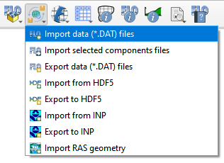

FLO-2D Import Export
=====================

The FLO-2D Import Export button facilitates the import of FLO-2D data, including \*.DAT files, \*.HDF5 files, and
HEC-RAS channel data. It also serves as the tool for exporting FLO-2D data, providing options to export all
components, selected components, or to the \*.HDF5 file.

.. toctree::
   :hidden:
   :maxdepth: 4

   Import Data Files
..   Import Selected Component Files
   Export Project
   Import from HDF5
   Export to HDF5
   Import swmm
   Export swmm
   Import RAS Channel