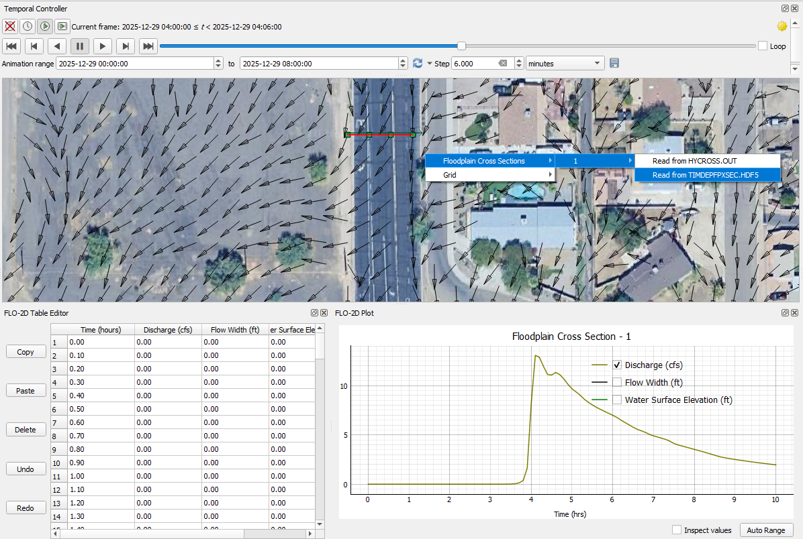

.. _flo-2d_results_tool:

FLO-2D Results Tool
=====================

The results tool is used to see results by location for specific components.

Connect to the Data
---------------------

1. Start by loading the completed simulation folder into the Run FLO-2D - Settings Tool.

.. note:: The FLO-2D Project folder is updated everytime that files are exported. Double check path before using the
          tool.

.. image:: ../../img/Flo-2D-Plugin-Settings/pluginsettings006.png

Activate the Tool
---------------------

1. The tool is a toggle.  Click FLO-2D Results button to activate it.

.. image:: ../../img/Buttons/floresults.png

2. Click on any component on the map.  If the component has active results, a selector will appear.

.. image:: ../../img/Flo-2D-Info-Tool/results001.png

3. Click the plotting panel to select the data to be plotted.

.. image:: ../../img/Flo-2D-Info-Tool/results002.png

Channel Results
------------------

1. Click a left bank line to plot the water elevation profile.

.. image:: ../../img/Flo-2D-Info-Tool/results003.png

2. Click a cross section to plot the results reported in the HYCHAN.OUT file.

.. image:: ../../img/Flo-2D-Info-Tool/results004.png

Hydraulic Structure Results
--------------------------------

1. Click a structure to plot the time discharge plot.

.. image:: ../../img/Flo-2D-Info-Tool/results005.png

Storm Drain Results
-------------------------

1. Click any storm drain feature to load the results in the table and plotting panel.

.. image:: ../../img/Flo-2D-Info-Tool/results006.png

.. image:: ../../img/Flo-2D-Info-Tool/results007.png

.. _fpxsec_results:

Floodplain Cross Section Results
--------------------------------------

.. important:: FLO-2D Pro Build 25 engine and FLO-2D Gila 2.0 plugin include a floodplain cross section tool that can read from any new cross section using a 
   time dependent file called TIMDEPXSEC.HDF5. to set this file up, go here:
   
   :ref:`Run XSEC Time Series Results <time_lapse_output>`

1. Click any floodplain cross section to load the results in the table and plotting panel. Note the new option Read from TIMDEPXSEC.HDF5 can be used for any new
   floodplain cross section.  The old option Read from HYCROSS.OUT is used for predefined floodplain cross sections that were saved to FPXSEC.DAT.

2. Learn how to build floodplain cross sections for either case here:
   :ref:`Create Floodplain Cross Sections <floodplain_cross_section_editor>`

1. Click any floodplain cross section cell to load the results in the table and plotting panel.

.. image:: ../../img/Flo-2D-Info-Tool/results009.png

Grid Cell Results
--------------------------------------

Run a model with the time series results enabled to see the grid cell results. 

:ref:`Run Time Series Results <time_lapse_output>`.

1. Click any grid cell to load the results in the table and plotting panel.

.. image:: ../../img/Flo-2D-Info-Tool/results010.png

