.. _breach_hydrograph_tool:

Breach Hydrograph Tool
======================

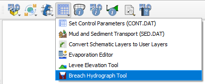

The Breach Hydrograph Tool was developed to estimate one of the most critical steps in hypothetical tailings and water dam break studies:
generating a defensible outflow hydrograph. The tool focuses on water and tailings dams and implements commonly
accepted empirical and statistical approaches for estimating peak discharge, released volume, average breach width, and
sediment load based on geometric and field data. The tool is fully integrated with the FLO-2D Gila plugin,
allowing users to define dam geometry, reservoir volume, breach parameters, and downstream routing conditions within
the same spatial workflow used for flood modeling.

Automatic Generation of Computational Domain
--------------------------------------------

The first functionality of the Breach Hydrograph Tool is to automatically generate a computational domain for the dam
break study, requiring four input parameters:

- Centerline
- Buffer
- Elevation raster
- Roughness raster

Figure 1 - Automatic Generation of Computational Domain

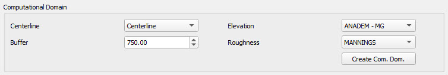

.. note:: The computational domain may be defined in advance using the Grid Editor.
   This tool includes an automatic option to generate a domain specifically
   for dam-break simulations, but it is not required.

The centerline is used to define the downstream channel or the potential path of the flood wave,
while the buffer defines the width of the computational domain to ensure that all potential flooding areas are included in the analysis.
A good estimation of the centerline can be done visually by a more experienced user, but its total length can be estimated
by using the following equation. The buffer width depends on the topography and the expected flood wave propagation,
but a common practice is to use a buffer width that is at least 1.5 the width of the dam to capture potential inundation areas.
Further refinement of both the centerline and buffer can be done after the initial generation of the computational domain
to ensure that critical areas are included and that the model runs efficiently.

.. math::

   D_{\max} = 8.870 \times 10^{-8} V_{\max}^{3}
   - 2.602 \times 10^{-4} V_{\max}^{2}
   + 2.648 \times 10^{-1} V_{\max}
   + 6.737

Figure 2 - Demonstration of the centerline and buffer used to generate the computational domain for a dam break study

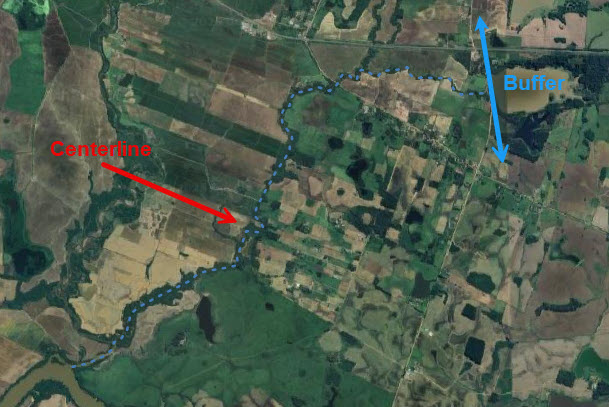

The elevation raster provides the topography required for hydraulic modeling, while the roughness raster defines the
spatial distribution of surface roughness coefficients that control flow resistance and flood wave propagation.
Each case study may require a finer DEM resolution to capture critical terrain features such as channels, levees, and road embankments.
However, for medium to large dams, a 30 m resolution DEM is often adequate for dam break studies.
Surface roughness values can be estimated from land-use and land-cover data. The freely available QGIS Manning’s Roughness Generator plugin,
based on ESA WorldCover 2021, has proven to be a reliable and consistent source for deriving spatially distributed Manning’s n values.

Figure 3 - Spatial parameters assigned to the computational domain (Left: Elevation; Right: Roughness)

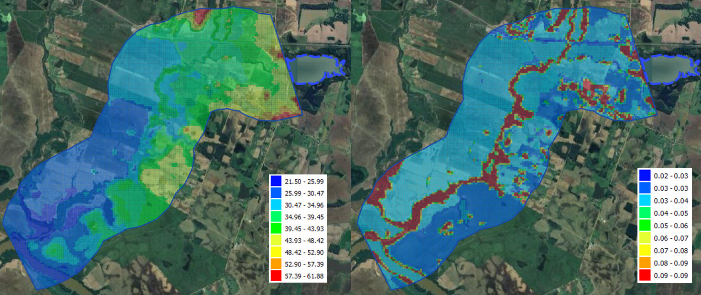

Once the computational domain is defined and the roughness and elevation are assigned, the inflow and outflow boundary conditions
should be set. Usually the inflow boundary is defined downstream of the dam as a line or point, while the outflow boundary is defined
at the downstream end of the computational domain as a polygon. The breach hydrograph generated by the tool will be assigned to the inflow boundary condition,
and the FLO-2D model will route the flood wave downstream to predict arrival times, inundation extent, and potential exposure of infrastructure and population.

Figure 4 - Definition of inflow and outflow boundary conditions

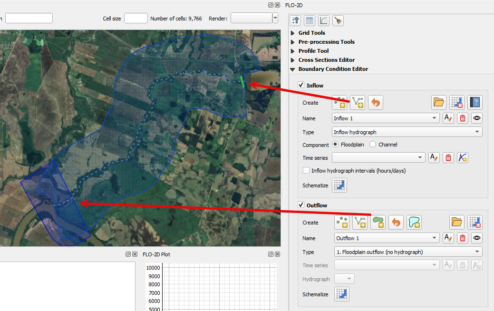

Water Dams
----------

Failures of water dams are rare compared with tailings dams, but when they occur the downstream consequences can be severe
due to the rapid release of large reservoir volumes. Historical records from ICOLD and FEMA dam-safety studies show that
many water-dam failures are associated with overtopping, internal erosion, foundation instability, or structural deficiencies,
often triggered by extreme hydrologic events. Even for small dams, hypothetical failure scenarios are required to
evaluate downstream risk, classify potential damage, and support emergency planning under dam-safety regulations.

Water dam breach analyses are uncertain because failure geometry, breach development rate, and reservoir conditions at
the time of failure are rarely known. As a result, hypothetical dam-break studies rely on empirical relationships
and scenario-based assumptions to estimate peak discharge, released volume, and breach hydrographs.
These parameters must then be routed downstream to determine flood arrival times, inundation extent, and potential
exposure of infrastructure and population.

Although several hydrologic and hydraulic models exist to simulate downstream flooding, generating defensible breach
hydrographs in a consistent and reproducible way remains one of the most challenging steps in water dam break studies.
Differences in assumed breach width, failure time, or reservoir level can lead to large variations in predicted flood impacts.

The Breach Hydrograph Tool addresses this need by providing a structured framework for generating hypothetical
water dam breach hydrographs using accepted empirical methods and consistent parameter assumptions.
The tool integrates directly with FLO-2D Gila, allowing dam geometry, reservoir characteristics,
and breach scenarios to be defined within the same spatial workflow used for flood routing.
This integration supports rapid scenario testing, reproducibility of assumptions, and a fast transition from
preliminary screening to more detailed hydraulic analyses when higher-consequence scenarios are identified.

Water Dam Geometry Data
-----------------------

To use the Water Dam process, check the Water Dam group box. The required data to generate a breach hydrograph for a water dam includes:

- Dam height
- Reservoir volume
- Failure mechanism
- Baseflow

Figure 5 - Water dam geometry data input

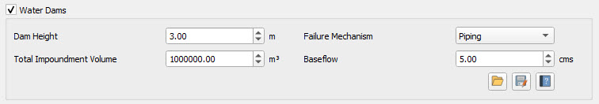

Water Dam Outflow Hydrograph Generation Methodologies
------------------------------------------------------

There are currently four methodologies available in the tool to generate peak discharge, time to peak, average breach,
and estimated hydrograph length for water dam failures. These methodologies are based on empirical relationships and are commonly used in dam safety analyses.

Figure 6 - Methodologies for generating breach parameters for water dam failures

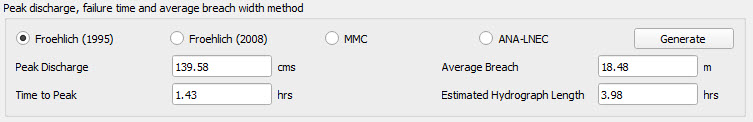

Table 1 - Empirical Relations for Breach Parameters

.. list-table::
   :header-rows: 1
   :widths: 20 30 25 25

   * - Method
     - Peak Discharge :math:`Q_p`
     - Time to peak :math:`T_f`
     - Breach Width :math:`B`

   * - Froehlich (1995)
     - :math:`Q_p = 0.607\, V^{0.295} H^{1.24}`
     - :math:`T_f = 0.00254\, V^{0.53} H^{-0.9}`
     - :math:`B = 0.1803\, k\, V^{0.32} H^{0.19}`
       :math:`k = 1.4` for overtopping,
       :math:`k = 1.0` for piping

   * - Froehlich (2008)
     - :math:`Q_p = 0.607\, V^{0.295} H^{1.24}`
     - :math:`T_f = 0.0176 \left(\dfrac{V}{g H^{2}}\right)^{0.5}`
     - :math:`B = 0.27\, k\, V^{0.5}`
       :math:`k = 1.3` for overtopping,
       :math:`k = 1.0` for piping

   * - MMC
     - :math:`Q_p = 0.0039042\, V^{0.8122}`
     - :math:`T_f = 0.011\, B`
     - :math:`B = 3H`

   * - ANA-LNEC
     - :math:`Q_p = \max\left(0.607\, V^{0.295} H^{1.24},\; 0.039\, V^{0.8122}\right)`
     - :math:`T_f = 0.00254\, V^{0.53} H^{-0.9}`
     - :math:`B = 0.1803\, k\, V^{0.32} H^{0.19}`
       :math:`k = 1.4` for overtopping,
       :math:`k = 1.0` for piping

Once the breach parameters are calculated, the tool allows the selection of three methodologies to generate the hydrograph.

Figure 7 - Methodologies for generating breach hydrograph shape for water dam failures

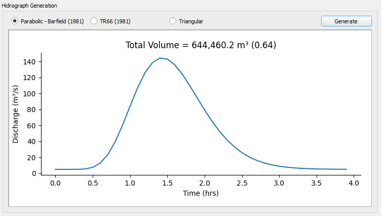

Table 2 - Hydrograph shape methods

.. list-table::
   :header-rows: 1
   :widths: 25 75

   * - Method
     - Equation

   * - Parabolic (Barfield, 1981)
     - :math:`Q_t = Q_{base} + Q_p
       \left[
       \dfrac{t}{t_f}
       e^{\left(1-\dfrac{t}{t_p}\right)}
       \right]^{\beta}`

   * - TR66 (SCS, 1981)
     - | :math:`Q_t = Q_{base} + Q_p \dfrac{t}{T_f}`,  for :math:`t \le T_f`
       | :math:`Q_t = Q_{base} + Q_p \exp\!\left(-(t-T_p)\dfrac{Q_p}{V}\right)`,  for :math:`t > T_f`

   * - Triangular
     - | :math:`Q_t = Q_{base} + Q_p \dfrac{t}{T_p}`,  for :math:`0 \le t \le T_p`
       | :math:`Q_t = Q_{base} + Q_p \left(1 - \dfrac{t - T_p}{T_f - T_p}\right)`,  for :math:`T_p < t \le T_f`
       | :math:`Q_t = Q_{base}`,  for :math:`t > T_f`

The breach parameters can be adjusted by the user to modify the duration of the breach hydrograph or to change the peak discharge,
which directly affects the released volume. Next to the total volume displayed on the graph, a ratio between the released
volume and the reservoir storage volume is shown. This ratio helps users evaluate how changes in breach parameters influence
the amount of released water. For typical water-dam failure scenarios, this ratio generally ranges between 0.75 and 0.95.

FLO-2D Save Options for Water Dams
----------------------------------

Once the breach hydrograph has been defined, select the inflow boundary condition where it will be applied and click Add.
The outflow hydrograph will then be assigned to the selected inflow boundary condition and included in the inflow list.

Figure 8 - Definition of inflow boundary condition for water dam breach hydrograph

.. important:: The inflow boundary condition must be schematized before exporting the model to ensure the hydrograph is written correctly.

Mapping of Water Dam Failures
--------------------------------------

A typical area of inundation map is shown in Figure 9 with the corresponding hazard map shown in Figure 10.
The hazard map indicates the area of inundation from the dam breach is a high hazard.

Figure 9 - Typical water dam breach area of inundation map

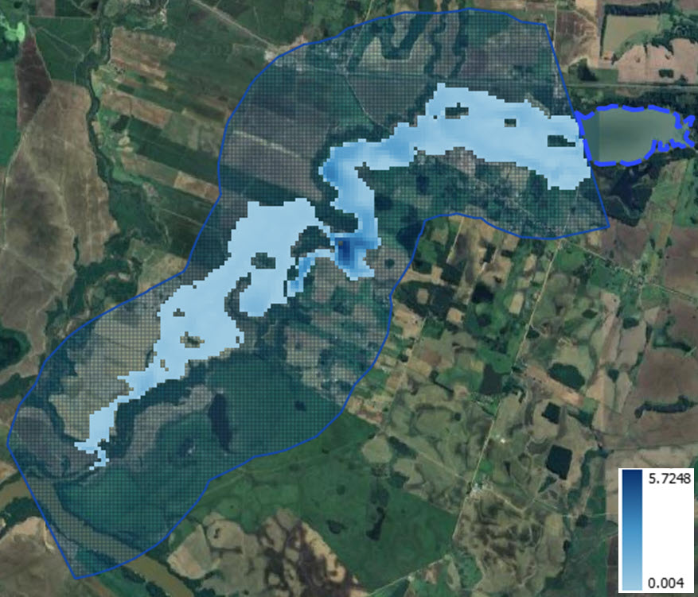

Figure 10 - Typical water dam breach flood hazard map

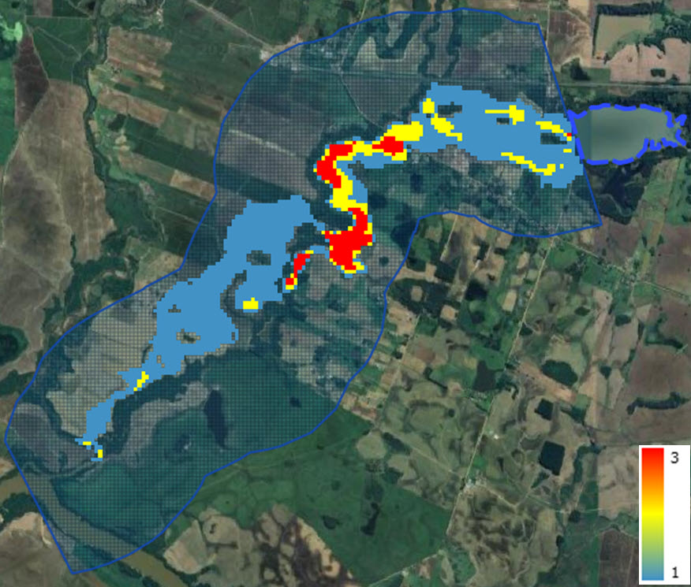

Tailings Dams
-------------

In the past few decades, there have been records of over 60 incidents involving the failure of tailings dams, and since 1960,
a total of 196 failures have been documented (as reported by the WISE Uranium Project in 2023; ICOLD, 2001).
The highest number of tailings dam failures occurred during the 1970s, and these failures have persisted, happening at an
approximate rate of 20 collapses per decade. Nearly all these failures can be attributed to issues related to inadequate
design, construction, or operation. It's important to note that there is a rapid expansion of mining
operations, with numerous new mines set to become operational in the near future.

The failures can be mainly grouped into four categories:

- Hydrologic (rain or flood inflow)
- Static failure including:

  - Piping and internal erosion
  - Foundation failure (slope stability)
  - Design related

- Seismic (Earthquake)
- Unknown

Tailings dams are designed to store the fine-grained solid waste materials produced during mineral processing,
and they are often raised in height over time as they are in use. The structural integrity of the tailing deposit,
both in terms of hydrology and slope stability, depends on the characteristics of the mine waste and the
construction methods employed for the dam.

Although there are hydrologic and hydraulic models available for forecasting potential flood hazards downstream,
assessing the amount of material that could be eroded from tailings deposits during a flood event is a highly
subjective process. The flood hazard associated with the downstream area of inundation in response to a tailings dam
failure is primarily governed by the volume of the tailings plus any additional water inflow from rainfall
or upstream watershed flooding.

Precisely forecasting the risk of tailings dam failure is of paramount importance to ensure safety and prevent
property damage. Traditionally, the standard method for evaluating the flood and mudflow hazard following a
dam breach involves employing a 2-D flood routing model (FLO-2D, 2014). However, estimating the volume of
material released during a tailings dam breach is a challenging task.

Tailings Dam Methodology
------------------------

During this analysis the data for fifty-seven hard rock mine tailings dam failures were collected to analyze failure
modes and develop an event tree model for the creation of this tailing dam failure tool. The failures were grouped
into the most common failure categories as shown in Table 3 and Table 4 below to compare the breach scenarios
(Azam et al, 2010; Rico et al, 2008 and Strachan, 2001) that categorize the events as described below:

Categories include:

- Overtopping – includes heavy rain and snow melt;
- Piping/internal erosion –  includes seepage and slope instability;
- Foundation failure – includes mine subsidence;
- Design related – includes structural failures and operations issues;
- Earthquake – includes seismic induced liquefaction;
- Unknown.

Table 3 - Summary of hard rock mine tailings dam failures 1970 to 2012

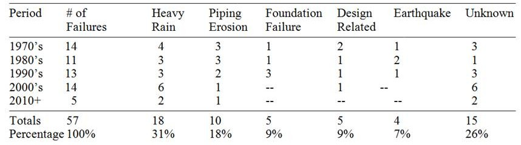

Table 4 - Percent of failures by cause

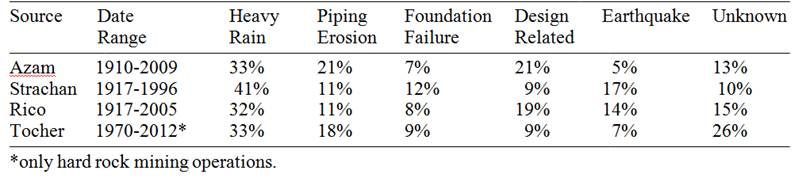

Based on the information provided above, one can draw the conclusion that the primary factors leading to dam failures
are extreme hydrologic events and piping erosion. Considering that there are typically two tailings dam failures
worldwide each year, the statistical likelihood of a tailings dam failure appears to be roughly on par with that of a
water storage dam failure. This emphasizes the urgent requirement for the development of more advanced tools and
methodologies to enhance the precision of predictions regarding tailings dam breaches.

Tailings Dam Geometry Data
--------------------------

To predict tailings dam breach volume, the new software tool requires input data for the dam and the impoundment materials.
The breach volume will be estimated based on the dam height and the documented tailing dam breach failures,
but other parameters entered in data fields are necessary to calculate the failure occurrence,
they play a critical role in determining whether a failure is likely to happen or not.
The user should also need to select some data input from a range of values. The parameters will include dam geometry,
tailings saturation, tailing shear strength, and depth of impounded water at the dam face.
The tailings dam data parameters are defined in Figure 11.

Figure 11 - Input data parameters for a tailings dam profile

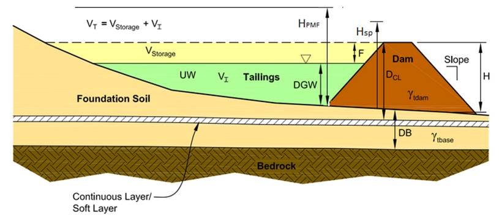

The tailings dam geometry dialog box is shown in Figure 12.

Figure 12 - Tailings dam geometry data input

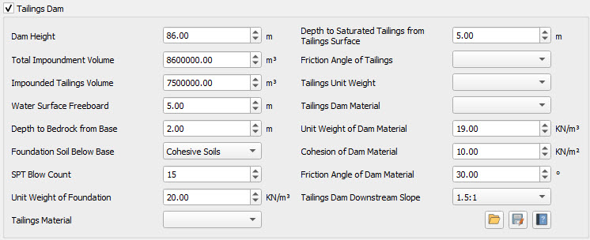

The tailing dam breach volume screening tool described in this manual, uses event tree diagrams based on risk analysis
methods created by the US Bureau of Reclamation for water storage dams (USBR, 2012). An event tree analysis is an
analytical diagram that uses Boolean logic to examine a chronological series of events (branches)
by tracing forward through a causal event chain.

The tool consists of a sequence of task dialogs that use the input data (geometry and tailing properties) provided
by the user in the first dialog of the tool, see Figure 12 above. The potential of a failure for three different
failure modes: hydrologic, static, and seismic is calculated.

The tool is organized to resolve on the background the event tree for the corresponding failure mode selected by the
user. The user does not see the logical process of the event tree, but the output of the event tree analysis is
displayed in the failure information as type of failure (see Figure 13). The result of the event tree diagram
for the tree failure modes is the failure occurrence or not of the dam breach.
If there is no potential of failure based on the data provided by the user in the first page of the tailing dam,
the tool will display a No Breach message in the failure information.

Figure 13 -  Failure modes for the Breach Hydrograph Tool

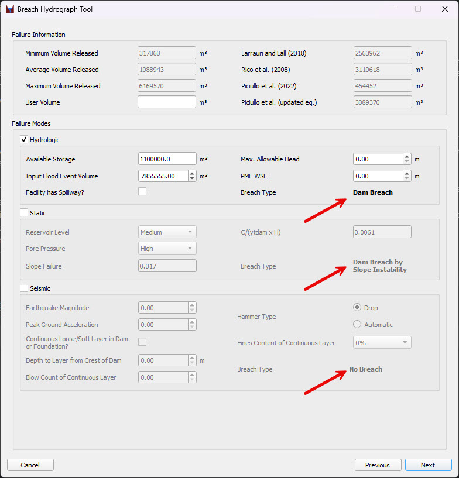

The tailing dam tool calculates the subsequent release volume of stored tailings employing empirical correlations of
documented failures. The intention is to reduce the uncertainty on the release volume and use the tool to define a
worst-case scenario. This tool was developed for application with the FLO-2D flood routing model so that dam owners
and regulators can estimate failure release volumes, predict the downstream flood hazard and assess
potential liabilities and risk.

Tailings Dam Failure Modes Selection
------------------------------------

The determination of whether a failure has occurred, along with the subsequent reporting of failure information as either
"Dam Breach by" or "No Breach,", is computed for each failure mode.
Some illustrative calculations involved in the tree event analysis include:

- The occurrence of a static failure mode involves utilizing the downstream slope, the reservoir level, and the friction angle of the tailings dam material to calculate the slope failure value through the application of stability analysis.
- For the earthquake failure mode, the capacity of soil to resist liquefaction represented by Cyclic Resistance Ratio (CRR) is computed, the tool goes through several checks one being the equivalent blow count and effective stress ratio that can cause the liquefaction and subsequent failure of the embankment.
- For the deformation of crest, the tool uses figures from USBR Risk Analysis (Swaisgood, 2003) and calculates whether the deformation of crest will be greater than the freeboard or not.

The failure modes are described in detail as follows.

Hydrologic Failure Mode
***********************

The probability of a hydrologic failure and the subsequent breach release volume are calculated using the Figure 14 data
as outlined in the hydrologic failure mode event tree (Figure 15). This data supports dam breach by erosion through overtopping.

- Reservoir stage and associated the storage capacity
- Flood stage and volume (probable maximum flood)
- Spillway blocked / capacity

Figure 14 - Hydrologic failure mode dialog box

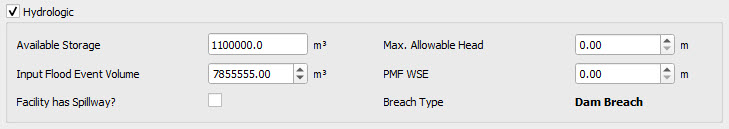

Event tree logic determines whether overtopping erosion leads to breach.

Figure 15 - Hydrologic failure model event tree

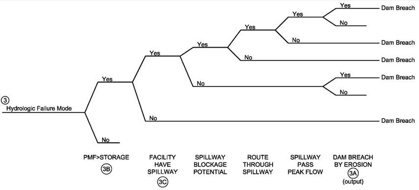

Static Failure Mode
*******************

Failure potential and the release volume is calculated based on limit equilibrium charts
(Tesarik and McWilliams; 1981 and Hoek and Bray; 1977) using the following data to
define event tree branches for the static failure mode:

Inputs include:

- Reservoir level (high, medium or low)
- Embankment pore pressure (high, medium or low)
- Foundation failure computed from bearing capacity failure charts
- Embankment slope failure to breach

Figure 16 - Static failure mode dialog box.

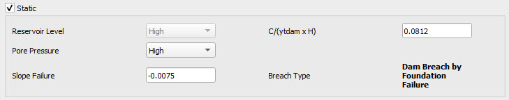

The event tree for the static mode failure is described in Figure 17 below.

Figure 17 - Event tree for the static failure mode

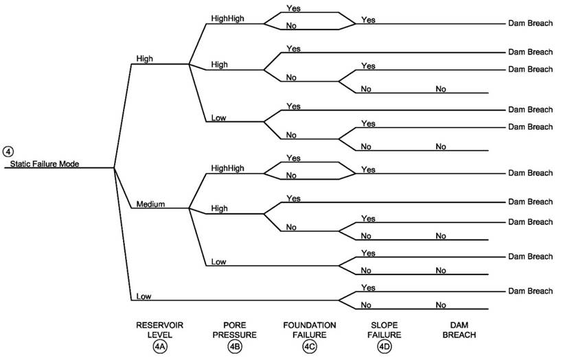

Seismic Failure Mode
********************

Several methodologies have been compiled to determine the potential for seismic failure.
The seismic failure release volume is calculated the following data:

- Earthquake magnitude and peak ground acceleration
- Foundation liquefaction potential (Seed et al. 1983, Juang et al. 2000)
- Crest deformation Swaisgood 2003

Figure 18 - Seismic failure modes dialog box

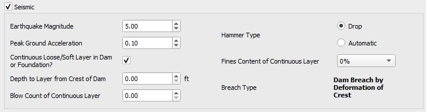

The event tree for the seismic mode failure is described in Figure 19 below.

Figure 19 - Event tree for the seismic failure

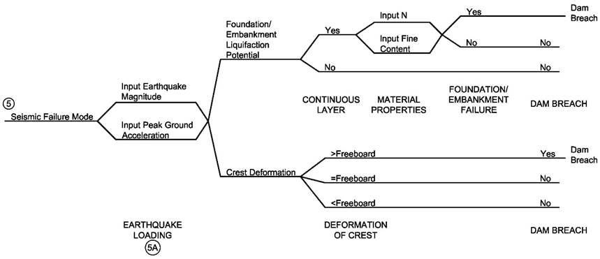

Release Volume of Tailings Dam Failure
--------------------------------------

Following the tailing dam failure assessment process where the tool leads the user through a series of dialog boxes
with pull-down menus and data entry fields that will result in the breach volume if failure is predicted to occur,
the tool calculates multiple release breach volumes.

The final product is a breach volume based on the empirical correlation with dam height.
Figure 20 show the empirical correlations based on the documented failures from Table 3.
This set of empirical correlations are identified in the tailing dam tool as
Vrmin, Vrmax and VAverage.

Figure 20 - Empirical correlations equations of documented tailings dam failures based on our analysis of the documented tailing dam failures

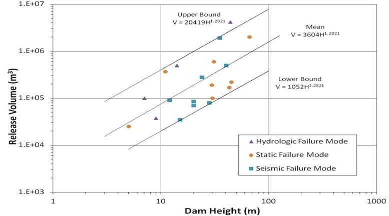

An additional set of multi-linear regressions (Larrauri and Lall, 2018; Rico et al., 2008; Piciullo et al., 2022)
have been implemented in the latest version of the tailing dam tool (Luca Piciullo, 2022), see Figure 21.

Figure 21 - Empirical correlations equations of documented tailings dam failures (Luca Piciullo, 2022).

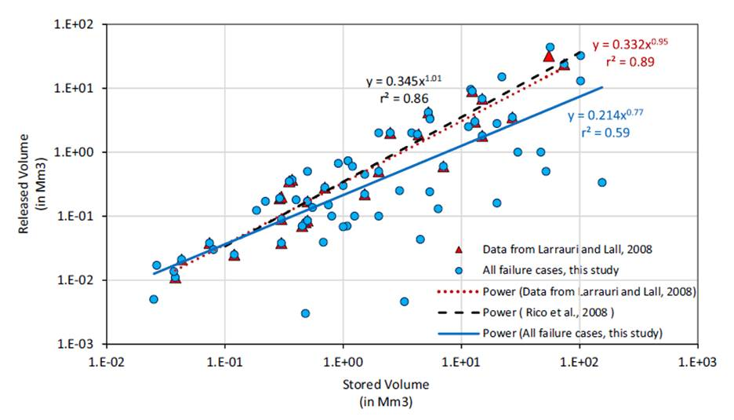

A second updated equation  (Luca Piciullo, 2022) with a multi variable power regression has been included in the tailing dam tool.

.. math::

   R = 10^{\beta_0 + \varepsilon} \, V^{\beta_1} H^{\beta_2}

The following variables are used in the tailing dam tool, as shown in Figure 22 below.

Figure 2 - Values for multiple linear regression between Released volume(R), Stored volume (V), and dam Height (H) (Luca Piciullo, 2022).

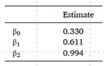

These equations can be used to estimate the release volume for the tailing dam failure. The rate of flow (discharge)
versus time as well as the sediment concentration by volume for each output time is necessary to understand
how the volume is being released from the earth filled reservoir. For this reason, six typical hydrograph
distributions and six typical distributions over time of sediment concentration by volume are available in the tool.

Tailings Dam Breach Hydrographs
--------------------------------------

Depending on the predicted failure mode, the tailing dam failure assessment tool calculates the occurrence of the
failure based on the geometry of the dam, and the water and impoundment characteristics, and it estimates the maximum,
minimum and average volumes based on the dam height and the documented failures.  Based on the historical data,
the breach volume typically ranges from 10% to 40% of the impounded tailings volume.

This predicted breach hydrograph is assigned into an user selected inflow for routing the flood downstream in the FLO-2D model.
Six typical unit hydrograph shapes with variable time of peak discharge are provided (Figure 23). Professional judgment
is required to select the hydrograph shape that may generate a worst-case flood hazard (largest area of inundation) with the FLO-2D model.
An iterative convergence routine was created for the tailings dam failure tool so that the selected the breach hydrograph
shape matches the predicted release volume. In other words, the release volume selected by the user in the tailing dam
tool is assigned to an inflow. The volume of water and tailings dam material is introduced into the FLO-2D model as a
boundary condition, and it subsequently flows downstream into the model's domain.
The final volume reported in the SUMMARY.OUT file should coincide with the user selected volume from the tailing dam tool.

Figure 23 - Breach Failure Hydrograph Shape Selection

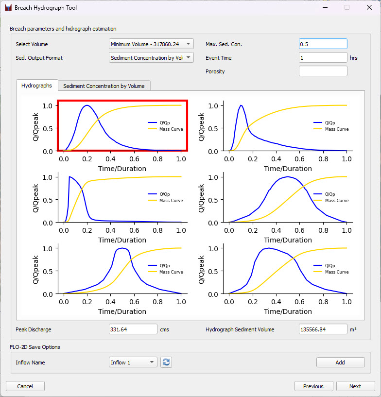

In a final step, the sediment concentration by volume is distributed over the duration of the hydrograph so the
hyperconcentrated sediment flows can be simulated in the FLO-2D.  Six possible sediment concentrations by volume
distributions are included in the tool. The user selects one distribution and enters the maximum concentration by volume
(Figure 24). The event duration is the same as that selected for the breach discharge hydrograph.
The total volume of water and sediment is known from the dam geometry.
The total volume is internally adjusted for porosity to have an equivalent solid block of sediment to compute the
average sediment concentration. The tool calculates the total volume of sediment by adjusting the maximum concentration
by volume to populate a table of sediment concentration by volume versus breach time.

Figure 24 - Selection of Sediment Concentration by Volume Distribution.

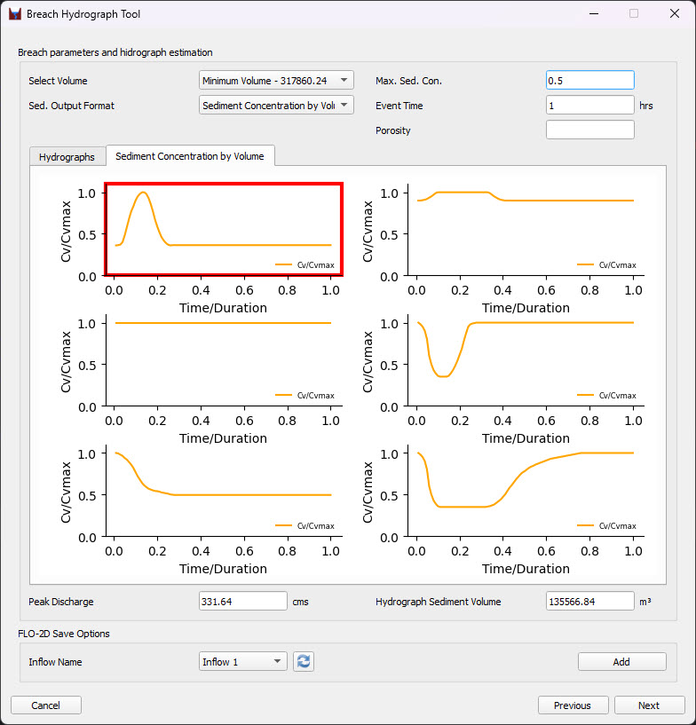

FLO-2D Save Options for Tailings Dam
-------------------------------------

Once the breach hydrograph has been defined, select the inflow boundary condition where it will be applied and click Add.
The outflow hydrograph will then be assigned to the selected inflow boundary condition and included in the inflow list.

Figure 25 - Definition of inflow boundary condition for tailings dam breach hydrograph

.. important:: The inflow boundary condition must be schematized before exporting the model to ensure the hydrograph is written correctly.

Mapping of Tailings Dam Failures
--------------------------------------

A typical area of inundation map is shown in Figure 26 with the corresponding hazard map shown in Figure 27.
The hazard map indicates that most of the area of inundation from the dam breach is a high hazard.
The hazard levels in Figure 27 are based on hydraulic intensity
(maximum depth and the maximum product of velocity times depth).

Figure 26 - Typical Tailings Dam Breach Area of Inundation Map

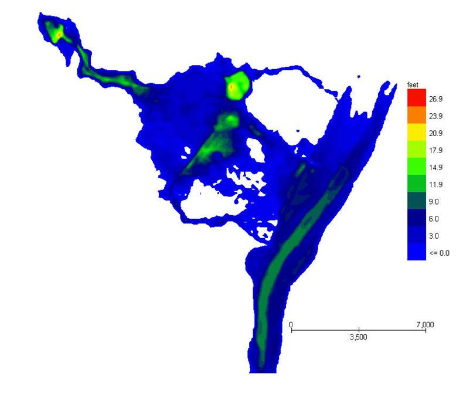

Figure 27 - Typical Tailings Dam Breach Flood Hazard Map

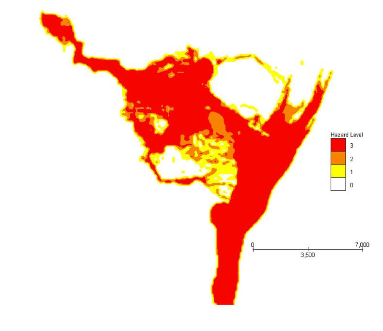

Tailings Dam Conclusions
--------------------------

The tailing dam tool estimates the release of tailing dam breach volume based on the documented failure of tailing dam.
The tailing dam failure assessment tool computes a range of release volumes so that the user can evaluate
the potential existing or proposed tailings dam flood hazard.  The tool assigns a breach hydrograph to the inflow
boundary condition to route the breach failure hydrograph downstream. Currently there is no comparable tool available
in the mining industry. Combined with the FLO-2D model, the tailings dam breach tool can:

- Predict tailings dam failure and the subsequent release volume of stored tailings

- Identify potential downstream flood hazard for assessing damages and risk

The tailing dam failure assessment tool has been verified and validated to assess accuracy and reliability of the
tool failure components during the different phases of the development.  A limited number of both historical and
recent tailing dam failures were used to evaluate the accuracy of the predicted breach volumes.
For additional information and documentation on the tailing dam breach tool or dam breach hazard mapping,
visit the FLO-2D website (www.flo-2d.com).

References
----------------

Azam, S. and Li, Q. 2010. Tailings dam failures: a review of the last one hundred years. Geotechnical News, December.

FLO-2D Reference Manual. 2014.  FLO-2D Software, Inc. Nutrioso, Arizona.

Hoek, E. and Bray, J. 1977. Rock Slope Engineering, 1st Edition, IMM, London.

International Commission on Large Dams (ICOLD). 2001. Tailings Dam Failures - Risk of Dangerous Occurrences, Lessons Learnt from Practical Experiences. Bulletin 121.

Juang, C.H., Chen, C.J., Jiang, T., and Andrus, R.D. 2000. Risk-Based Liquefaction Potential Evaluation Using Standard Penetration Tests. Can. Geotech. J. 37: 1195 - 1208.

Rico M, Benito G, Salgueiro A.R, Diez-Herrero A, and Pereira, H.G. 2008. Reported tailings dam failures: a review of the European incidents in the worldwide context. Journal of Hazardous Materials 52(2) 846–852.

Seed, H.B., Idriss, I.M., and Arango, I. 1983. Evaluation of Liquidation Potential Using Field Performance Data. J. Geotechnical Engineering. 109: 458-482.

Strachan, C. 2001. Tailings dam performance from USCOLD incident-survey data. Mining Engineering 53(3): 49–53.

Swaisgood, J.R. 2003. Embankment dam deformations caused by earthquakes. Proc. Pacific Conference on Earthquake Eng., Christchurch, New Zealand.

Tesarik, D.R. and McWilliams, P.C. 1981. Factor of Safety Charts for Estimating the Stability of Saturated and Unsaturated Tailings Pond Embankments. U.S. Department of the Interior, Bureau of Mines.

US Bureau of Reclamation and Army Corps of Engineers. 2012. Best Practices in Dam and Levee Safety Risk Analysis.