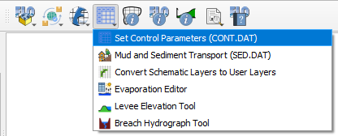
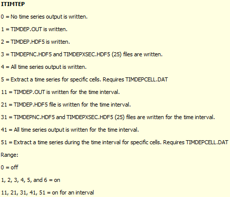

.. _set_control_parameters:

Set Control Parameters (CONT.DAT)
==================================

This button allows the user to set up the control variables.  The variable descriptions and instructions are available in the Data Input Manual.

See the :ref:`Data Input Manual 2025 <data_input_manual>` for more details.

Control Parameters
-----------------------------

1. Click the
   Set Control Parameters (CONT.DAT) button.  This dialog box is used to set the control parameters for each simulation.

Time Control and Plot Variables
__________________________________

1. Use this group of variables to define the simulation properties like simulation time and output interval.

2. Hover over any variable label to get a description in the tooltip.

.. image:: ../../img/Setup-Control-Variables/cont001.png

Global Data Modification
__________________________

1. Global variables can be applied to all elements in the grid system.

.. Note:: The Global ARF = 1 Revision is written to the ARF.DAT file.

.. image:: ../../img/Setup-Control-Variables/cont002.png

Switches
____________

1. Set up on off switches for modeling specific processes.  Don't turn on the switches until the data has been set up for each process.

.. image:: ../../img/Setup-Control-Variables/cont003.png

Floodplain / Channel Display Options
______________________________________

1. The floodplain and channel switches will write more data to the base.out file when turned on.  The default is off (2).  Keep them off unless troubleshooting specific processes or reviewing data on a timestep basis.

2. The Depress Depth (ft or m) is used to help find grid elements that have an elevation that is more than 3 ft lower lower than all of its neighbors.

3. The Depress Depth variable is also used to help find levees that have a crest elevation that is too close to the grid elevation.

4. Depress Depth used to be called super.out.  If trying to load a project in GDS, set this variable to 0 so GDS can load it.

.. image:: ../../img/Setup-Control-Variables/cont004.png

.. _time_lapse_output:

Time Lapse Output
======================================

1. Time-lapse output writes data to multiple output files (for example, TIMDEP.OUT).

2. Time-lapse switch behavior has evolved across software builds. Refer to the Data Input Manual for build-specific details.

3. Build 25 introduces new functionality for switch positions 3 and 4.

4. Uncheck the Use Time Interval option when the full simulation duration is to be processed. 

.. image:: ../../img/Setup-Control-Variables/cont005.png

5. Configure the time-lapse switch settings prior to running the model.

6. Output files generated by these switches can be large; use discretion when enabling them.

ITIMTEP — Time-Dependent Grid Output
-------------------------------------------

The ``ITIMTEP`` switch controls whether FLO-2D writes time-dependent grid
output, which output formats are written, and (in newer builds) the time
interval during which output is produced.

Behavior by Build
-----------------

.. list-table::
   :header-rows: 1
   :widths: 20 80

   * - Build
     - ITIMTEP Behavior

   * - ≤ Build 14 (2015)
     - ``ITIMTEP = 1`` writes ``TIMDEP.OUT``.

   * - Build 16 (2016–2017)
     - Output format selection introduced.

      * ``ITIMTEP = 1`` writes ``TIMDEP.OUT``  
      * ``ITIMTEP = 2`` writes ``TIMDEP.OUT`` and ``TIMDEP.HDF5``  
      * ``ITIMTEP = 3`` writes ``TIMDEP.OUT``, ``TIMDEPNC.HDF5``, and ``TIMDEP_NC4.OUT``  
      * ``ITIMTEP = 4`` writes ``TIMDEP.OUT``, ``TIMDEPNC.HDF5``, and ``TIMDEP_NC4.OUT``

   * - Builds 18 (2018–2019)
     - Build behavior

      * ``ITIMTEP = 1`` writes ``TIMDEP.OUT``  
      * ``ITIMTEP = 2`` writes ``TIMDEP.OUT`` and ``TIMDEP.HDF5``  
      * ``ITIMTEP = 3`` writes ``TIMDEP.OUT``, ``TIMDEPNC.HDF5``, and ``TIMDEP_NC4.OUT``  
      * ``ITIMTEP = 4`` writes ``TIMDEP.OUT``, ``TIMDEPNC.HDF5``, and ``TIMDEP_NC4.OUT``  

      * Cell-specific time-series extraction added:  
      ``ITIMTEP = 5`` extracts time series for selected cells using ``TIMDEPCELL.DAT``.

   * - Builds 19 (2019–2020)
     - Minor output variations introduced.

       ``ITIMTEP = 1`` writes ``TIMDEP.OUT``  
       ``ITIMTEP = 2`` writes ``TIMDEP.HDF5``  
       ``ITIMTEP = 3`` writes ``TIMDEPNC.HDF5T5``  
       ``ITIMTEP = 4`` writes ``TIMDEP.OUT`` and ``TIMDEPNC.HDF5``  

       Cell-specific time-series extraction retained:  
       ``ITIMTEP = 5`` extracts time series using ``TIMDEPCELL.DAT``.

   * - Build 21 (2021–2022)
     - Transitional and internally complex behavior driven by early QGIS
       time-series integration.

       ``ITIMTEP = 1`` writes ``TIMDEP.OUT`` and ``TIMDEP_NC4.OUT``  
       ``ITIMTEP = 2`` writes ``TIMDEP.HDF5``  
       ``ITIMTEP = 3`` writes ``TIMDEPNC.HDF5``  
       ``ITIMTEP = 4`` writes ``TIMDEP.OUT``, ``TIMDEP.HDF5``,
       ``TIMDEP_NC4.OUT``, and ``TIMDEPNC.HDF5``  

       ``ITIMTEP = 5`` extracts cell time series using ``TIMDEPCELL.DAT``.

   * - Build 23 (2022–2025)
     - Output format selection simplified.

       ``ITIMTEP = 1`` writes ``TIMDEP.OUT``  
       ``ITIMTEP = 2`` writes ``TIMDEP.HDF5``  
       ``ITIMTEP = 3`` writes ``TIMDEPNC.HDF5``  
       ``ITIMTEP = 4`` writes ``TIMDEP.OUT``, ``TIMDEP.HDF5``,
       ``TIMDEP_NC4.OUT``, and ``TIMDEPNC.HDF5``  

       ``ITIMTEP = 5`` extracts cell time series using ``TIMDEPCELL.DAT``.

       Interval-controlled output formally introduced.  
       Values ``11, 21, 31, 41, 51`` mirror modes ``1–5`` but restrict
       output to a user-defined time interval.

   * - Build 25 (2026+)
     - Output format selection refined.

       ``ITIMTEP = 1`` writes ``TIMDEP.OUT``  
       ``ITIMTEP = 2`` writes ``TIMDEP.HDF5``  
       ``ITIMTEP = 3`` writes ``TIMDEPNC.HDF5`` and ``TIMDEPFPXSEC.HDF5``  
       ``ITIMTEP = 4`` writes ``TIMDEP.OUT``, ``TIMDEP.HDF5``,
       ``TIMDEP_NC4.OUT``, and ``TIMDEPNC.HDF5``  

       ``ITIMTEP = 5`` extracts cell time series using ``TIMDEPCELL.DAT``.

       Interval-controlled output retained using values
       ``11, 21, 31, 41, 51``.

Backward Compatibility Notes
------------------------------

.. note::

   Projects created with FLO-2D builds prior to Build 15 treat
   ``ITIMTEP`` as a simple enable/disable flag. A ``1`` value
   activates ASCII ``TIMDEP.OUT``.

   Interval-based ``ITIMTEP`` values (``11, 21, 31, 41, 51``) will not work for 
   builds earlier than Build 23.

   When upgrading legacy projects, review ``ITIMTEP`` settings to ensure
   that output formats and interval behavior match the intended build
   capabilities.

Numerical Stability
---------------------

Numerical stability parameters are defined on the second tab.

1. Numerical stability parameters. These parameters are used to control the numerical stability of the model. The values are set based on the grid size and the flow conditions.  See the Data Input Manual for more details.

.. image:: ../../img/Setup-Control-Variables/toler001.png

.. Note:: The wavemax variable has been removed from this version of the FLO-2D Plugin.  The variable hasn't been
   used in a long time but it was maintained as a place holder.  If you have a toler.dat with a wavemax > 0.00, you
   likely have a project that is FLO-2D v2007 or earlier.  Get tech support to help identify which build was used 
   for your project.

   |contact| to find the correct which version you may have.

.. |contact| raw:: html

    <a href="https://flo-2d.com/contact/" target="_blank" rel="noopener">Contact us</a>

2. Courant Numbers

The Courant numbers are used to control the numerical stability of the model. The values are set based on the grid size and the flow conditions.  See the Data Input Manual for more details.

.. image:: ../../img/Setup-Control-Variables/toler002.png
