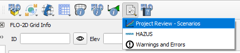
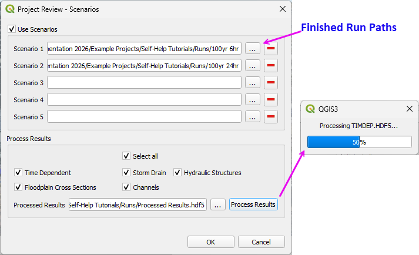
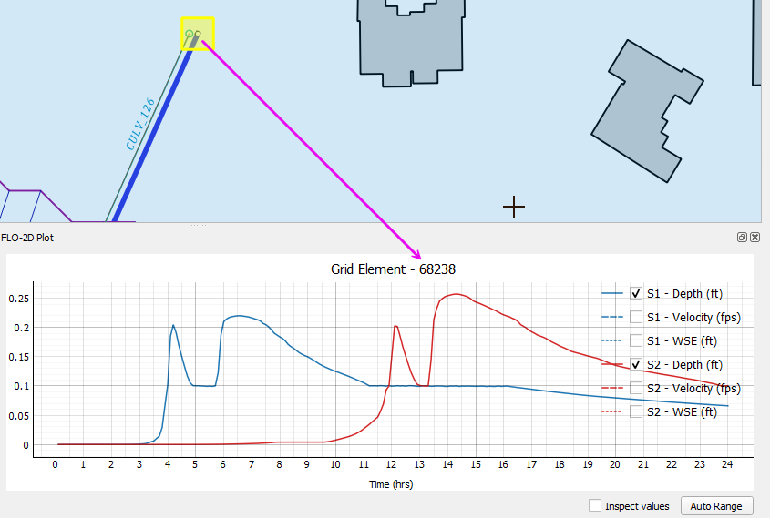
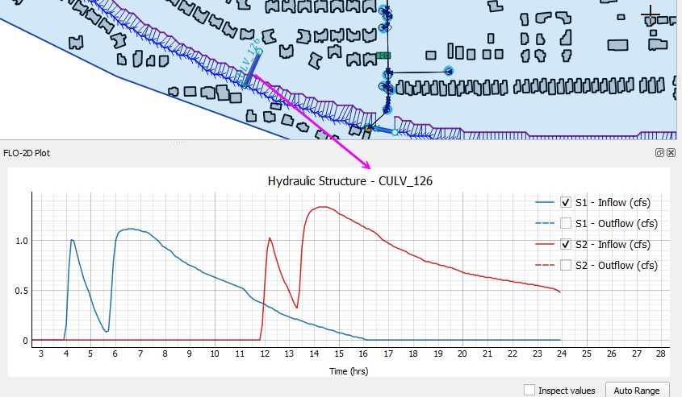
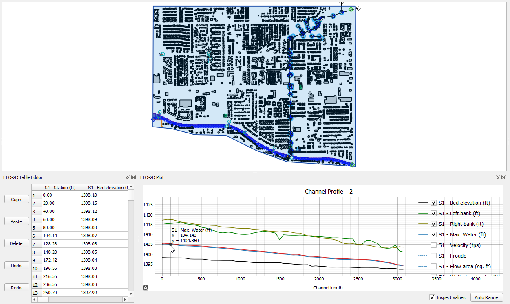
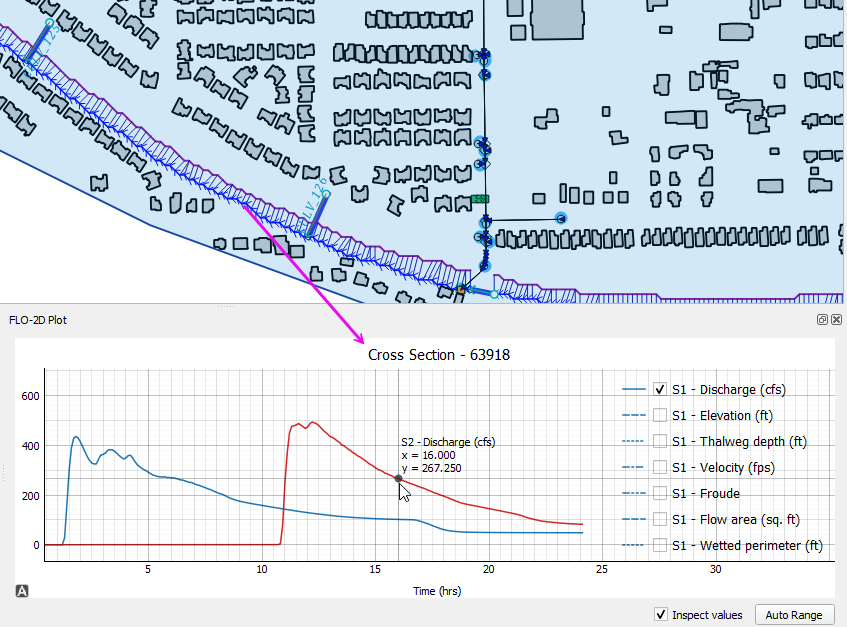
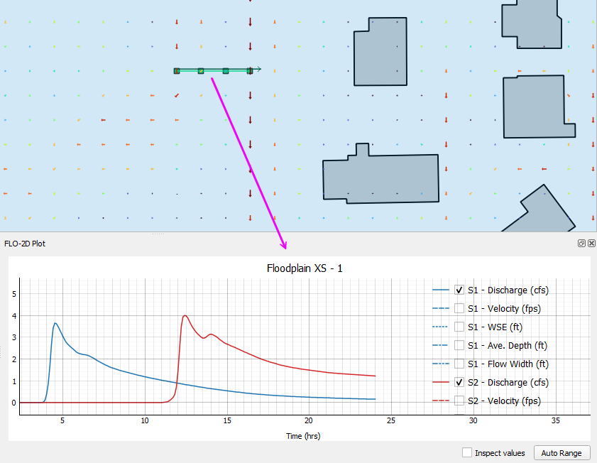
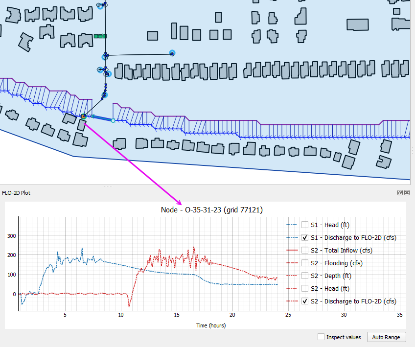
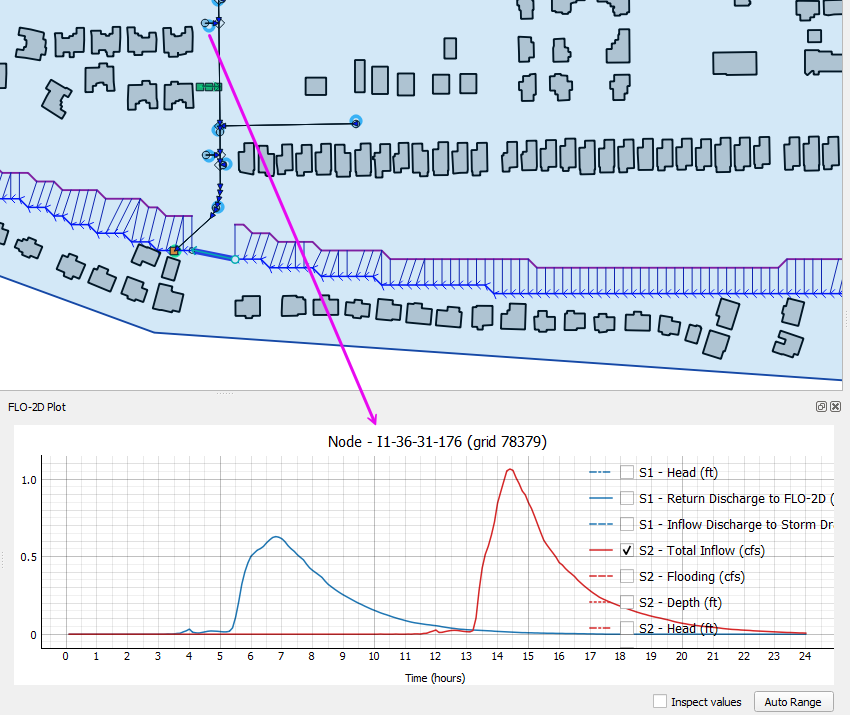
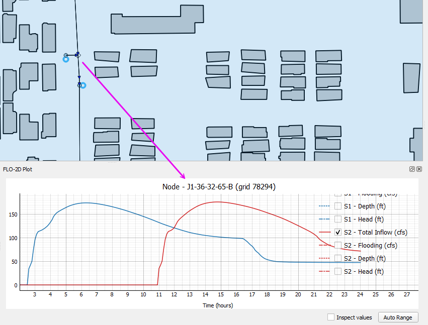

.. _scenarios:

Project Scenarios
=============================

Review scenarios lets users set up folder to compare model runs in a single instance.

Set the project up by processing the results into a single hdf5 file. 
The tool will access data in this file only so it must be rebuilt each time the runs are finished.

Once the Scenarios are set up, use the results tool to compare the results from various features.

Restrictions
----------------

- Simulation time must be identical for all runs.
- `TIMDEP.HDF5` must be present to use Time-Dependent Grid data. If the file is missing, disable the Time Dependent option.
- Grid size and grid layout must match.

Grid Elements
-----------------

The grid element results come from TIMDEP.OUT.

Hydraulic Structures
----------------------

The hydraulic structure results come from HYDROSTRUCT.OUT.

Channels
------------

The channel profiles and cross section results come from CHAN.DAT, XSEC.DAT, CHANMAX.OUT, and HYCHAN.OUT.

Floodplain Cross Sections
----------------------------

The floodplain cross section data comes from HYCROSS.OUT.

Storm Drain
---------------

The storm drain results come from swmm.rpt, SWMMOUTFIN.OUT, SWMMQIN.OUT.  

