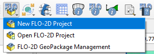

FLO-2D Project
=================

The FLO-2D project button serves to initiate a new project, open an existing one, and utilize the GeoPackage Management
tool for external layer management within the user's GeoPackage.

.. toctree::
   :hidden:
   :maxdepth: 1

   New FLO-2D Project
   Open FLO-2D Project
   Save FLO-2D Project
   FLO-2D GeoPackage Management