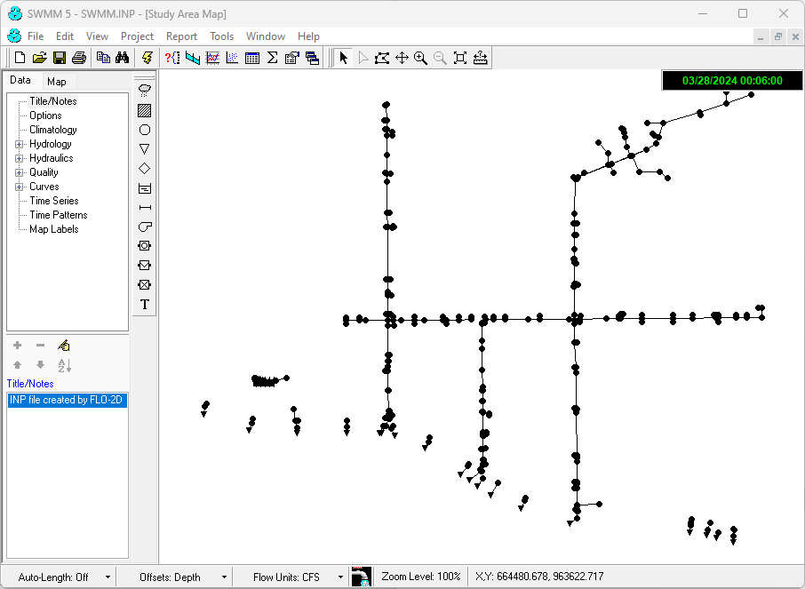

Run EPA SWMM GUI 5.0
=====================

Use this button to start the EPA SWMM Gui so that a storm drain system can be reviewed.

Run EPA SWMM GUI
------------------------

1. Click Run EPA SWMM GUI.

.. image:: ../../../img/Buttons/run010.png

2. The EPA SWMM 5.0 GUI will start.  Open a swmm.inp file to review the storm drain..

