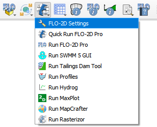

Run FLO-2D Pro
=================

Located under the Run FLO-2D Pro button are various FLO-2D executables/plugins, including:

- FLO-2D Plugin Run Settings
- Quick Run FLO-2D Pro
- Run FLO-2D Pro
- Run EPA SWMM GUI 5.0
- Run Tailings Dam Tool
- Run Profiles
- Run Hydrog
- Run MaxPlot
- Run MapCrafter
- Run Rasterizor

Additionally, the FLO-2D Plugin Settings buttons is located under this button and it is used to set up the
FLO-2D executable folder and the FLO-2D Project folder.

.. important:: To ensure proper execution of executables/plugins, it is essential to install the executables in the
               correct FLO-2D folder, the plugins in QGIS, and configure the paths accurately within the
               FLO-2D Plugin Settings.

.. toctree::
   :hidden:
   :maxdepth: 1

   FLO-2D Settings
   Quick Run FLO-2D Pro
   Run FLO-2D
   Run swmmgui
   Run Tailings Dam Tool
   Run Profiles
   Run Hydrog
   Run MaxPlot
   Run MapCrafter
   Run Rasterizor