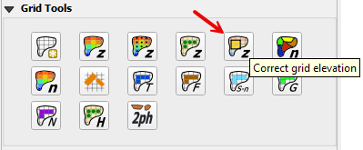

5. Correct Grid Elevation
==========================

This tool is used to correct elevation data for polygons, points or polylines.

The correction datasets are set up in the User Layers group.

-  Elevation Polygons

-  Elevation Points

-  Rasters

Users Layers Mode
-----------------

There are multiple options in this tool.
The following sections will show how to use each option in the Users Layers Mode tab.

Tin from Points and Polygon - TC 6
------------------------------------

Open a short YouTube Video: https://youtu.be/nCkEkSeaG-I

1. The first option is to edit the elevation on the grid using elevation points that are contained within a polygon boundary.

.. image:: ../../../img/gridtools/Elevation-Correction-from-Polygons/Elevat003.png

2. The tool creates a triangulated irregular network (TIN) that is confined to the elevation polygon layer.
   The TIN elevation is read from the Elevation Points layer.
   The elevation is assigned to the grid from the TIN as a correction to the grid elevation.
   Only grids with a centroid inside the polygon are adjusted.
   In this example, a section of the dam is removed from the grid element elevation so the dam can be breached.
   Most of the dam is left in place so the volume displacement is still occurring.

.. note:: The elevation image in this example is not the grid element.
          It is a hillshade of the raw raster data.
          The tool corrects the grid elevation only.

.. image:: ../../../img/gridtools/Elevation-Correction-from-Polygons/Elevat004.png

3. Here is a before and after image of the calculation.  The tool removed the dam from the grid elevation.
   It interpolated the grid elevations based on the point and a TIN.

.. image:: ../../../img/gridtools/Elevation-Correction-from-Polygons/Elevat005.png

Tin from Polygon Boundary - TC 7
----------------------------------

Open a short YouTube Video: https://youtu.be/5rvnX7c1GCk

1. The second option is to build a TIN from the grid element elevation surrounding a polygon.
   This will assess the elevation where the polygon intersects the grid and interpolate that elevation to the TIN.

.. image:: ../../../img/gridtools/Elevation-Correction-from-Polygons/Elevat006.png

2. This option is used when a Cut or Fill correction is required.
   For example, to fill a channel with elevation data along the bank, cover the channel with an elevation polygon and apply the correction.

.. image:: ../../../img/gridtools/Elevation-Correction-from-Polygons/Elevat007.png

Elevation Polygon Attributes - TC 8
------------------------------------

Open a short YouTube Video: https://youtu.be/Q2UetAd78Jw

1. This option is used when a single known elevation correction is required.

.. image:: ../../../img/gridtools/Elevation-Correction-from-Polygons/Elevat008.png

2. In this example, the invert elevation at the headwall inlet is incorrect.
   The polygon has a new elevation assigned that will be applied directly to the grid layer.
   In this case the correction is applied to centroid of the cell and the selected polygon only.

.. image:: ../../../img/gridtools/Elevation-Correction-from-Polygons/Elevat009.png

Grid Statistics Blocked Areas - TC 9
---------------------------------------

Open a short YouTube Video: https://youtu.be/Vql0HYwMf8Q

1. In this case, the correction is applied by analyzing the statistics of the elevations within the Blocked Areas Polygons.
   The mean, max or min elevation of the combined cell centroids within the polygon are applied as a general condition to all of the cells centroids
   within the polygon.

.. image:: ../../../img/gridtools/Elevation-Correction-from-Polygons/Elevat010.png

.. image:: ../../../img/gridtools/Elevation-Correction-from-Polygons/Elevat011.png

External Layer Tab
------------------

This section will review each option in the External Layers Mode tab:

Correction Options
------------------

There are several grid element correction options available in this tool.

-  Select any polygon layer.

-  Select any polyline layer.

-  Define the geometric predicate.
   Grid centroid or grid element within the polygon.

-  Take the elevation and correction from an attribute table.

-  Take the zonal statistics from the grid elements within the polygons.

-  Take the zonal statistics from raster pixels within a polygon.

-  Take the zonal statistics from raster pixels within a grid element selected by a polygon.

-  Use only selected features or all features.

.. image:: ../../../img/gridtools/Elevation-Correction-from-Polygons/Elevat012.png

Geometric Predicate - TC 10
----------------------------

Open a short YouTube Video: https://youtu.be/frQlvM6I0_k

This method will apply a elevation to each grid element within the polygon from the elevation field of the polygon.

1. Load or create a polygon layer with an elevation and a correction field.
   In this example, the Elevation Polygon layer was used.
   It isn’t’ an external layer but it still works.

2. Click the Elevation Correction Tool and click Correct Grid Elevation

.. image:: ../../../img/gridtools/Elevation-Correction-from-Polygons/Elevat013.png

3. Set up the Correct Grid Dialog as shown below and click OK.

.. image:: ../../../img/gridtools/Elevation-Correction-from-Polygons/Elevat014.png

4. Click ok to complete the process.

5. The following figure shows the result of the processing.
   The polygon had an elevation attribute of 1400 and a correction attribute of 1401.

.. image:: ../../../img/gridtools/Elevation-Correction-from-Polygons/Elevat015.png

Grid Statistics in Polygons - TC 11
-------------------------------------

Open a short YouTube Video: https://youtu.be/V9mLuptocMQ

This method will set a min, mean or max by calculating the statistics from the grid layer within the elevation
correction polygon.

1. Build a polygon around the grid elements to be modified.

2. Set up the tool as shown in the following image.

.. image:: ../../../img/gridtools/Elevation-Correction-from-Polygons/Elev001.png

4. Run the calculator and then plot the elevation to see the correction.

.. image:: ../../../img/gridtools/Elevation-Correction-from-Polygons/Elev002.png

Raster Statistics in Polygons - TC 12
----------------------------------------------

Open a short YouTube Video: https://youtu.be/6SmdYjZV310

This method will apply zonal statistics to a raster within a polygon to calculate the min, max or mean of an area.

1. Import an elevation raster and a create a polygon for the area that needs a correction.

2. Click the Elevation Correction Tool and click Correct Grid Elevation

.. image:: ../../../img/gridtools/Elevation-Correction-from-Polygons/Elevat013.png

3. Set up the Correct Grid Dialog as shown below and click OK.

.. image:: ../../../img/gridtools/Elevation-Correction-from-Polygons/Elevat016.png

4. Click ok to complete the process.

5. The following figure shows the result of the processing.
   The raster within the polygon had an elevation of 1409.44.
   This was applied to every cell within the polygon.

6. The figure below shows the change in elevation.

.. image:: ../../../img/gridtools/Elevation-Correction-from-Polygons/Elevat017.png

Polyline Elevation Correction - TC 13
--------------------------------------

Open a short YouTube Video: https://youtu.be/H-vfxOwJano

This method will apply zonal statistics to a raster within individual grid elements that are intersected by a polyline
with a buffer of width provided by an attribute field

1. Set up a polyline with a buffer that is approximately the width of a grid element or the width of a physical feature
   that is covered by the polyline.

.. image:: ../../../img/gridtools/Elevation-Correction-from-Polygons/Elevat018.png

3. Click the Elevation Correction Tool and click Correct Grid Elevation

.. image:: ../../../img/gridtools/Elevation-Correction-from-Polygons/Elevat013.png

4. Set up the Correct Grid Dialog as shown below and click OK.

.. image:: ../../../img/gridtools/Elevation-Correction-from-Polygons/Elevat019.png

5. Click ok to complete the process.

6. The following figure shows the result of the processing.
   The raster within the polygon had an elevation of 1409.44.
   This was applied to every cell within the polygon.

7. The figure below shows the change in elevation.

.. image:: ../../../img/gridtools/Elevation-Correction-from-Polygons/Elevat020.png

