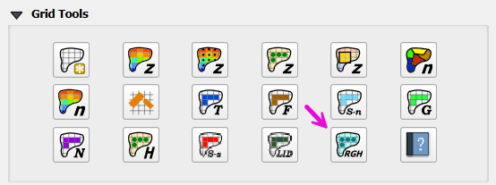
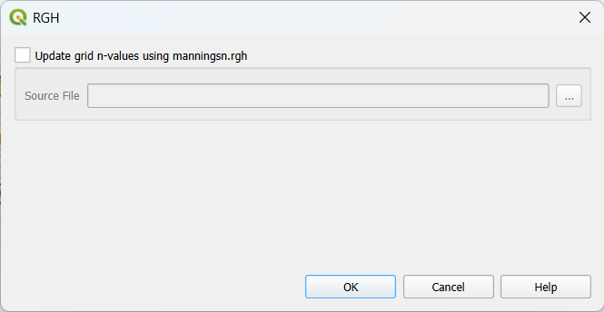
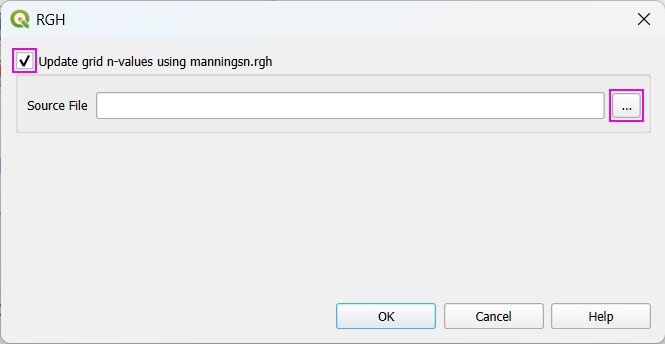
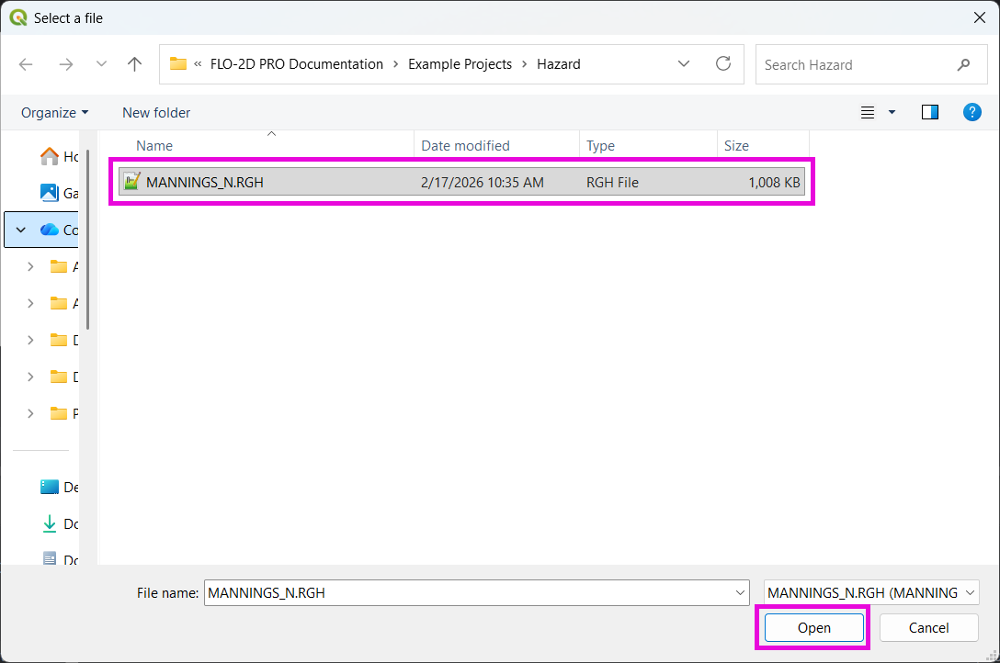
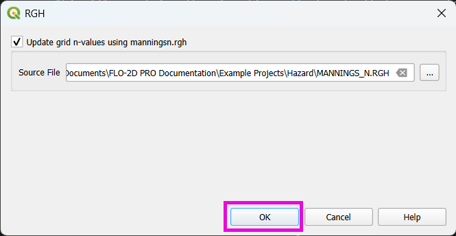
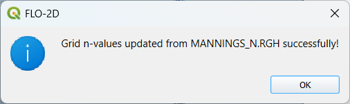

.. _rgh:

17. Model-Revised Grid Inputs (.RGH Files)
===========================================

.. warning::

    🚧 This page is currently under development 🚧

.. dropdown:: Overview

    **.RGH** files in FLO-2D are *runtime / revised data* output files the model can produce that contain updated versions
    of some input datasets after a run (for example: revised elevations, revised Manning’s n values, or other cell-by-cell
    adjustments that occurred during simulation).

    They are primarily used for:

        (1) recording model-computed changes to input parameters (so you can inspect or reuse
            those adjustments), and
        (2) optionally replacing the original `.DAT` file for a subsequent run (by renaming a `.RGH`
            to the corresponding `.DAT`).

    Two common triggers that produce or update `.RGH` contents:

        (1) the **FROUDL** (limiting Froude) handling that increases n-values at runtime, and
        (2) the **IBACKUP** option (particularly `IBACKUP = 2`) that writes
            elevation/outflow node changes back to an `.RGH` file.

    List of .RGH Files:

        - FPLAIN.RGH
        - CHAN.RGH
        - STREET.RGH
        - MULT.RGH
        - MANNINGS_N.RGH
        - FPLAIN_SDELEV.RGH
        - TOPO_SDELEV.RGH
        - STEEPROUGH.RGH

    *CHAN.RGH*

        CHAN.RGH is a duplicate file of the CHAN.DAT file with the updated
        Manning’s n-value changes that were reported in the ROUGH.OUT
        file.  The maximum and final Manning’s n-value changes are listed in the
        ROUGH.OUT file.  To accept the changes to Manning’s n-values, CHAN.
        RGH can be renamed to replace CHAN.DAT for the next FLO-2D flood
        simulation.  This automates the spatial adjustment of n-values for channel
        elements that exceed the limiting Froude number.

    *FPLAIN.RGH*

        This file contains the final Manning’s n-value changes for the floodplain
        grid elements.  The maximum and final Manning’s n-values are reported
        in the ROUGH.OUT.  If the changes are acceptable, FPLAIN.RGH can
        be renamed to FPLAIN.DAT for the next FLO-2D flood simulation.  This
        automates the spatial adjustment of n-values for floodplain elements that
        exceed the limiting Froude number.

    *FPLAIN_SDELEV.RGH*

        This file contains the elevation adjustments that were automatically correct
        ed when the FLO-2D engine compared the floodplain grid elements to the
        storm drain rim and type 4 invert elevations.  To fully accept the changes
        reported to fprimelev.new, replace FPLAIN.DAT with this file.  It is also
        necessarry to replace the TOPO.DAT with TOPO_SDELEV.RGH.

    *MANNINGS_N.RGH*

        MANNINGS_N.RGH is a duplicate file of the MANNINGS_N.DAT
        file with the updated Manning’s n-value changes that were reported in the
        ROUGH.OUT file.  The maximum and final Manning’s n-value changes
        are listed in the ROUGH.OUT

    *MULT.RGH*

        MULT.RGH is a duplicate file of the MULT.DAT file with the updated
        Manning’s n-value changes that were reported in the ROUGH.OUT file.
        The maximum and final Manning’s n-value changes are listed in the ROUGH.OUT.

    *STREET.RGH*

        This file lists the final changes to Manning’s n-values for the street grid
        elements.  The maximum and final Manning’s n-values are reported in the
        ROUGH.OUT file. If the n-value changes are acceptable, STREET.RGH
        can be renamed to STREET.DAT for the next FLO-2D flood simulation.
        This automates the spatial adjustment of n-values for street elements that
        exceeded the limiting Froude number

    *TOPO_SDELEV.RGH*

        This file contains the elevation adjustments that were automatically corrected
        when the FLO-2D engine compared the floodplain grid elements
        to the storm drain inlet rim and type 4 invert elevations.  To fully accept
        the changes reported to fprimelev.new, replace TOPO.DAT with this file.
        It is also necessary to replace the FPLAIN.DAT with FPLSIN_SDELEV. RGH.

MANNINGS_N.RGH
---------------

This tool updates the grid table n-values. To use it, the "Update grid n-values using manningsn.rgh"
checkbox must be checked as shown in the figure below.

After that, one can now select the source file (MANNINGS_N.RGH) and click **OK** and apply the corrections.

