Create Storm Drain
=====================

A storm drain network for FLO-2D is defined by vector layers.  These can be external shapefiles or they can be part of the
geopackage.  Vector layers contain point or line geometries that connect the data to the map.  They also have
properties that define the storm drain data.

Create Storm Drain System
---------------------------

In the latest plugin version, the Storm Drain System can be created from scratch. By using the Storm Drain layers in the User Layers,
it is possible to create all Storm Drain elements. To begin creating the system, use the QGIS 'Toggle Editing' button.

.. image:: ../../../img/Storm-Drain/Storm032.png

.. image:: ../../../img/Buttons/editorpencil.png

.. important:: The recommended  sequence is to start with the point layers (Storm Drain Inlets/Junctions, Storm Drain Outfalls,
               Storm Drain Storage Units) and then move to the line layers (Storm Drain Conduits, Storm Drain Pumps,
               Storm Drain Orifices, Storm Drain Weirs).

Storm Drain Point Layers
#########################

All Storm Drain Point Layers (Storm Drain Inlets/Junctions, Storm Drain Outfalls, Storm Drain Storage Units) are created in the same manner.
To keep the instructions concise, detailed steps will be provided for creating Inlets/Junctions.
The same process applies to the other Storm Drain point layers.

1. Select the Storm Drain Inlets/Junctions layer and click on the QGIS 'Toggle Editing' button.

2. Add the Inlets/Junctions on the computational domain.

.. image:: ../../../img/Storm-Drain/Storm033.png

.. important:: The Properties Dialog Form does not appear when creating the Storm Drain layers.
               The properties must be added or modified after the editing is finished.

3. Finish editing.

4. Select the FLO-2D Info Tool and click on the created Inlet/Junction.

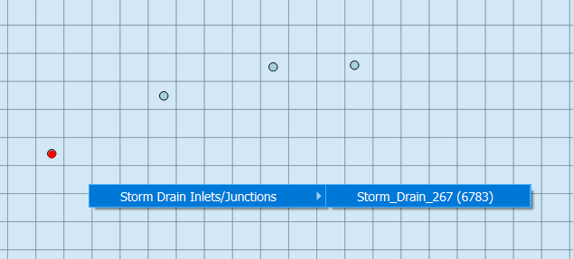

5. On the Inlet/Junction properties docked widget, modify the properties.

.. image:: ../../../img/Storm-Drain/Storm035.png

.. important:: The properties modified on the Inlet/Junction properties docket widget are automatically updated on the attribute table.

6. Another way to modify the properties is by right-clicking on the Storm Drain Inlets/Junctions layer and selecting "Open Attribute Table."

.. image:: ../../../img/Storm-Drain/Storm036.png

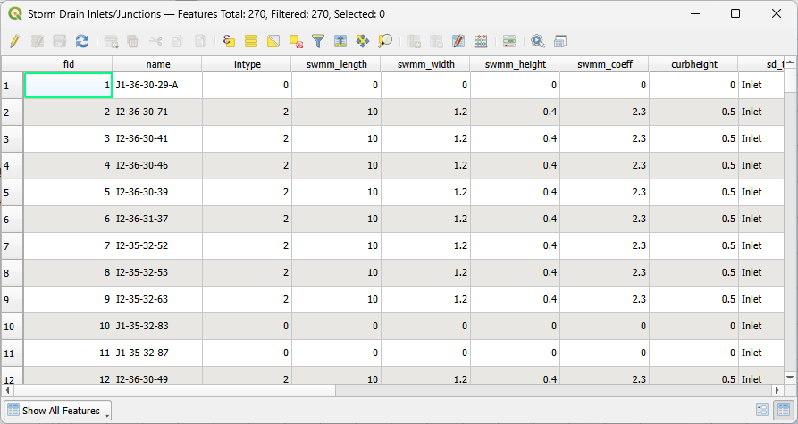

Storm Drain Line Layers
########################

All Storm Drain Line Layers (Storm Drain Conduits, Storm Drain Pumps, Storm Drain Orifices, Storm Drain Weirs) are created in the same manner.
To keep the instructions concise, detailed steps will be provided for creating Conduits.
The same process applies to the other Storm Drain line layers.

1. Select the Storm Drain Conduits layer and click on the QGIS 'Toggle Editing' button.

.. tip:: Enable the snapping tool to facilitate snapping to the Storm Drain point layers.

         .. image:: ../../../img/Buttons/snapping.png

2. Add a conduit by left-clicking on the upstream node, then left-click to add any vertices in-between nodes,
   and finish by right-clicking on the downstream node. You can add as many conduits as needed.

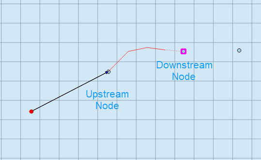

.. important:: The Properties Dialog Form does not appear when creating the Storm Drain layers.
               The properties must be added or modified after the editing is finished.

3. Finish editing.

4. Select the FLO-2D Info Tool and click on the created Conduit.

.. image:: ../../../img/Storm-Drain/Storm039.png

5. On the Conduit properties docked widget, modify the properties.

.. image:: ../../../img/Storm-Drain/Storm040.png

.. important:: The properties modified on the Conduit properties docket widget are automatically updated on the attribute table.

6. Another way to modify the properties is by right-clicking on the Storm Drain Conduits layer and selecting "Open Attribute Table."

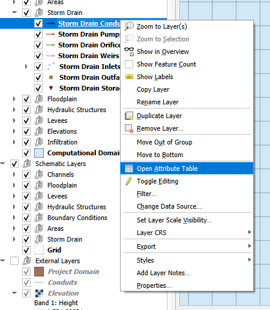

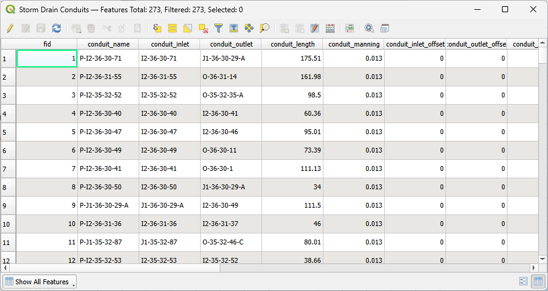

Create Storm Drain System from INP
-------------------------------------

The Storm Drain system can be imported from an existing \*.INP file developed in the SWMM GUI or any other software.

1. Select "Import from INP" on the toolbar.

.. image:: ../../../img/Buttons/importexport006.png

2. On the dialog box, select the \*.INP file.

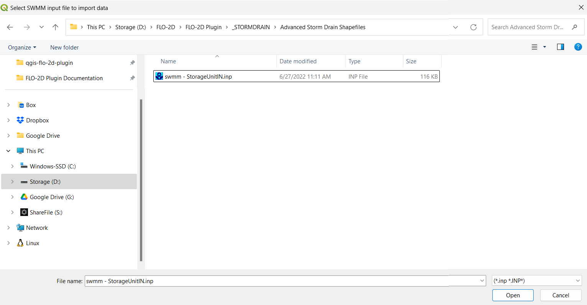

3. A message about replacing or completing the Storm Drain User Data will appear.
   Select 'Keep existing and complete' if there is already data in your Storm Drain layers.
   Otherwise, select 'Create New Storm Drains' to delete all existing data on the Storm Drain layers and
   add a new Storm Drain system with the data from the \*.INP file.

.. image:: ../../../img/Storm-Drain/Storm044.png

4. A message will appear showing information related to the \*.INP data just added. Click OK.

.. image:: ../../../img/Storm-Drain/Storm045.png

5. The Storm Drain Options will appear. The Storm Drain Options dialog is explained on its own section. Adjust the desired variables and click OK.

.. image:: ../../../img/Storm-Drain/Storm046.png

The \*.INP is imported to the project.

.. important:: Once the \*.INP file is imported into the geopackage layers, you can modify the shapefiles as needed.

Create Storm Drain System from Shapefiles
------------------------------------------

The Storm Drain system can be created from external shapefiles representing the Storm Drain System. The 'Select components from shapefile layer' processor is used to assign data to the
Storm Drain User Layers.

.. image:: ../../../img/Storm-Drain/storm002d.png

Input Layer Descriptions
############################

Points are Nodes

-  Inlets and Junctions - a point layer that contains the inlets nodes, manholes, and junctions.
-  Outfalls - a point layer that contains the outfalls.
-  Storage Units - a point layer that contains storage units. (Not required)

Polylines are Links

-  Conduits - a line layer that contains the conduits system.
-  Pumps - a line layer that contains the pump system. (Not required)
-  Orifices - a line layer that contains the orifices system. (Not required)
-  Weirs -  a line layer that contains the weirs system. (Not Required)

The following data must be available in the vector layers to create the storm drain data
files:

- SWMM.INP
- SWMMFLO.DAT
- SWMMOUTF.DAT
- SWMMFLORT.DAT
- SDCLOGGING.DAT
- SWMMFLODROPBOX.DAT

External Shapefiles
############################

The external shapefiles must include points and lines.

.. important:: Most editing work should be done in these layers. When the Assign button is clicked,
               the fields will be saved to a table so they are committed to memory
               when the project is reloaded.

1. Load the shapefiles or geopackage layers onto the map.

.. image:: ../../../img/Storm-Drain/Storm004.png

.. warning:: When the project is saved, the Storm Drain layers will be committed to the Geopackage. This means that
             the edits to the layers will be made to the geopackage not the shapefiles.

Inlets and Junctions
############################

1. Inlets and Junctions - a point layer that contains the inlets nodes, manholes, and junctions. This figure shows
   the fields that are used for storm drain modeling.

.. image:: ../../../img/Storm-Drain/sdtable001.png

2. This is a sample of the attributes table for the Inlet/Junctions shapefile.

.. image:: ../../../img/Storm-Drain/Storm007.png

3. The fields from the attribute table are selected using the Select Components from Shapefile dialog box.

.. important:: The plugin uses search terms to auto fill fields once you select the layer.  Double check the
               the fields to make sure they are assigned to the correct field.

.. image:: ../../../img/Storm-Drain/field001.png

Outfalls
############################

1. Outfalls - a point layer that contains the outfalls.

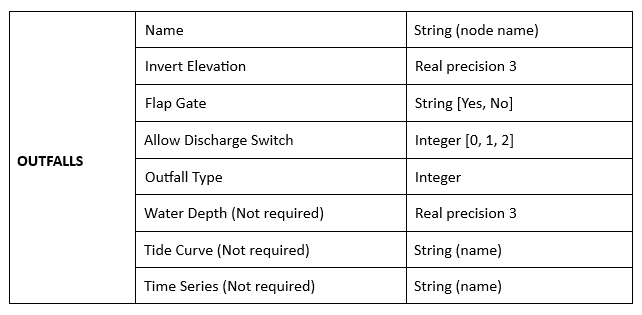

2. This is a sample of the attributes table for the outfall shapefile.

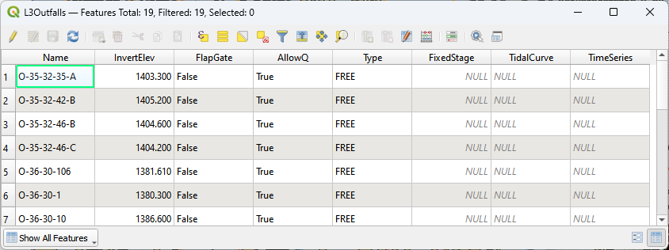

3. The fields from the attribute table are selected using the Select Components from Shapefile dialog box.

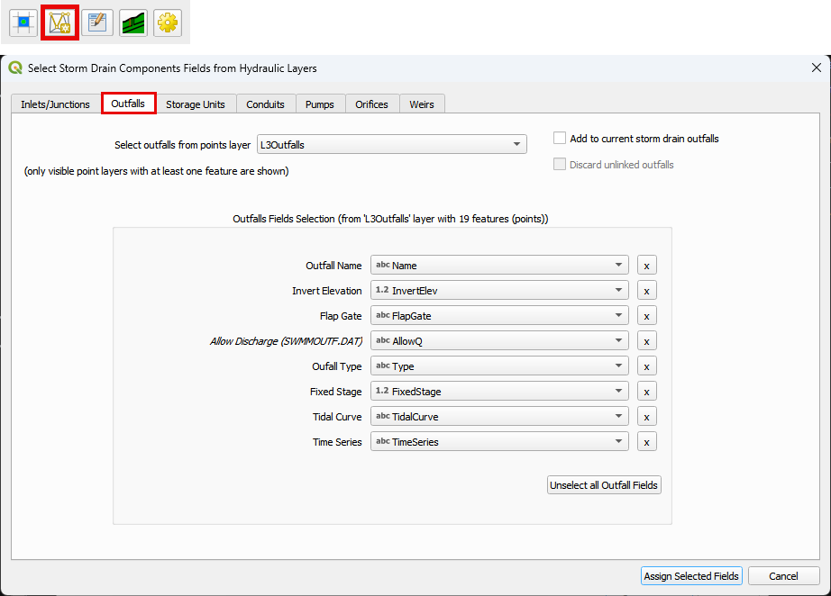

Storage Units
############################

1. Storage Units - a point layer that contains storage units data. (Not required)

.. image:: ../../../img/Storm-Drain/sdtable003.png

2. This is a sample of the attributes table for the storage unit shapefile.

.. image:: ../../../img/Storm-Drain/Storm012a.png

3. The fields from the attribute table are selected using the Select Components from Shapefile dialog box.

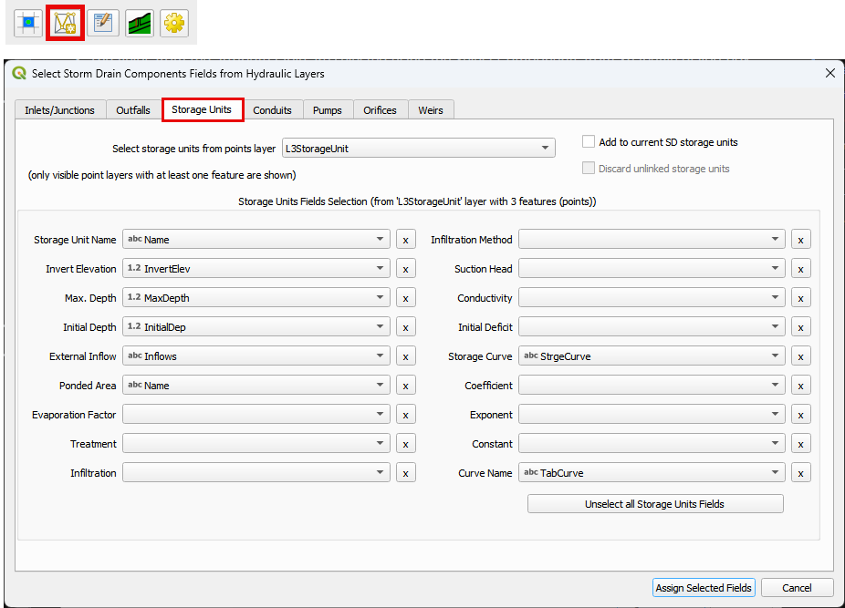

Conduits
############################

1. Conduits - a line layer that contains the conduits system.

.. image:: ../../../img/Storm-Drain/sdtable004.png

2. This is a sample of the attributes table for the conduit shapefile.

.. image:: ../../../img/Storm-Drain/Storm010.png

3. The fields from the attribute table are selected using the Select Components from Shapefile dialog box.

.. image:: ../../../img/Storm-Drain/field004.png

Pumps
############################

1. Pumps - a line layer that contains the pump system. (Not required)

.. image:: ../../../img/Storm-Drain/sdtable005.png

2. This is a sample of the attributes table for the conduit shapefile.

.. image:: ../../../img/Storm-Drain/Storm010a.png

3. The fields from the attribute table are selected using the Select Components from Shapefile dialog box.

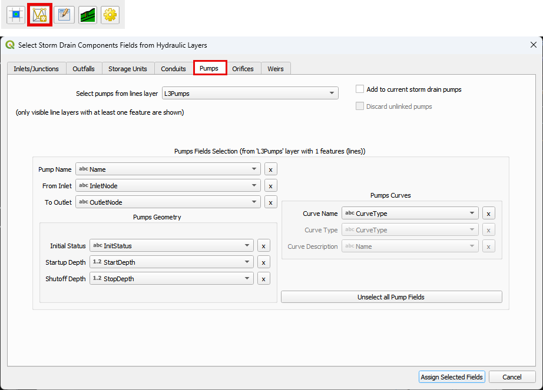

Orifices
############################

1. Orifices - a line layer that contains the orifices system. (Not required)

.. image:: ../../../img/Storm-Drain/sdtable006.png

2. This is a sample of the attributes table for the conduit shapefile.

.. image:: ../../../img/Storm-Drain/Storm010b.png

3. The fields from the attribute table are selected using the Select Components from Shapefile dialog box.

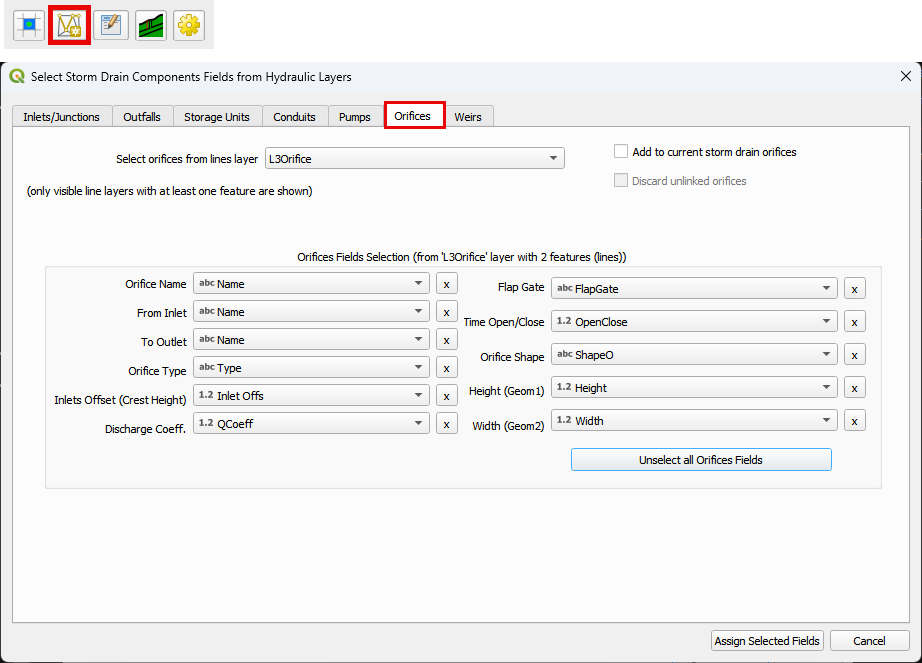

Weirs
############################

1. Weirs -  a line layer that contains the weirs system. (Not Required)

.. image:: ../../../img/Storm-Drain/sdtable007.png

2. This is a sample of the attributes table for the conduit shapefile.

.. image:: ../../../img/Storm-Drain/Storm010c.png

3. The fields from the attribute table are selected using the Select Components from Shapefile dialog box.

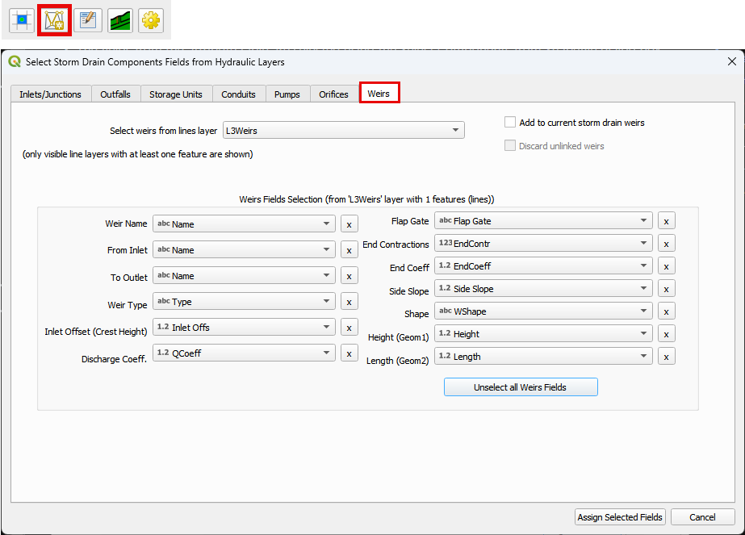

