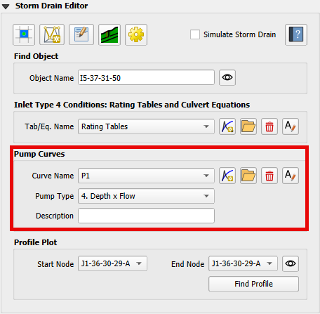
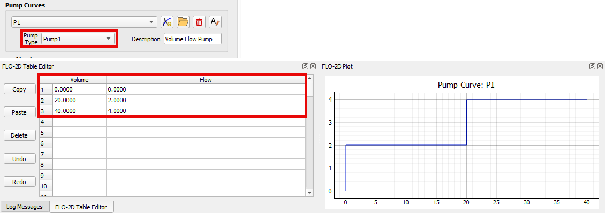
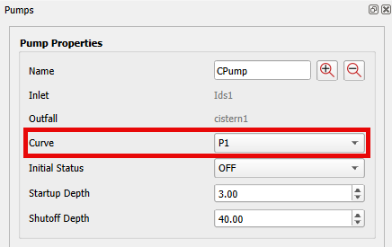
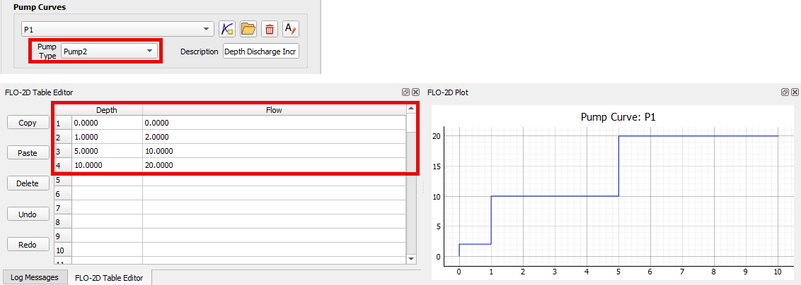
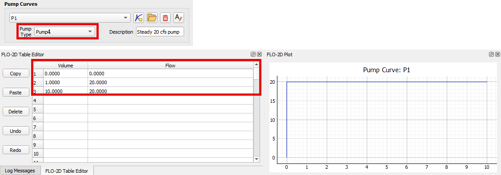

Pump Data Group
=====================

The Storm Drain Editor can define pump data.

Pump discharge is defined by pump types.  An Ideal pump is not limited by any tabular control but all other pump types
are controlled by pump tables that are defined below.

Ideal Pump
----------

The Ideal pump type transfer all inflow that is collected at
the inlet node. The pump must be the only outlet link connected to the inlet node.

1. To set an ideal pump, use the Find Object or the Info Tool to open the Pump Properties docked widget for the desired pump. Set the Curve to Ideal.

.. image:: ../../../img/Storm-Drain/pump006.png

Pump Type 1
-------------

Pump type 1 is a pump that is designed for an offline wet well. When the flow increases incrementally with the volume
of the wet well. The discharge in cubic feet per second (cfs) or cubic meters per second (cms) increases in steps
or incrementally as the volume in cubic feet (ft³) or cubic meters (m³) increases.

Offline means the inlet node cannot be connected to any other link than the pump link.

1. Define the Pump Type and data using the Pump Data Group and the FLO-2D Table Editor.

2. Use the Find Object or the Info Tool to open the Pump Properties docked widget for the desired pump. Set the Curve to the defined pump curve.

Pump Type 2
-------------

Pump Type 2 is a pump that is designed for an inline system.  It has a discharge (cfs or cms) to depth (ft or m)
relationship where the flow increases as the depth at the inlet node in a stepped pattern.

1. Define the Pump Type and data using the Pump Data Group and the FLO-2D Table Editor.

2. Use the Find Object or the Info Tool to open the Pump Properties docked widget for the desired pump. Set the Curve to the defined pump curve.

Pump Type 3
---------------

Pump type 3 is a pump that is designed for an inline system.  It has a head (ft or m) to discharge (cfs or cms)
relationship that varies continuously.  It is not a stepped pattern.  This pump flow will increase as the head
difference between the inlet and the outlet nodes decreases.

1. Define the Pump Type and data using the Pump Data Group and the FLO-2D Table Editor.

.. image:: ../../../img/Storm-Drain/pump004.png

2. Use the Find Object or the Info Tool to open the Pump Properties docked widget for the desired pump. Set the Curve to the defined pump curve.

Pump Type 4
--------------

Pump type 4 is an inline pump.  It has a discharge (cfs or cms) to depth (ft or m) relationship where the flow
increases as the depth increases.  It is a continuous increase not a stepped increase.

1. Define the Pump Type and data using the Pump Data Group and the FLO-2D Table Editor.

2. Use the Find Object or the Info Tool to open the Pump Properties docked widget for the desired pump. Set the Curve to the defined pump curve.

Pump Controls
--------------

In addition to pump tables, pumps are also controlled by rules that are defined in the Pump Properties.  These
properties include initial status of the pump which is on or off.  The depth at which the pump starts and the depth
at which the pump shuts off.  These properties are defined in the Pump Properties docked widget.

Pump Information
----------------

.. list-table::
   :header-rows: 1

   * - Name
     - Unique pump name.
   * - Inlet Node
     - Node name on the inlet of the pump.
   * - Outlet Node
     - Node name on the outlet  of the pump.
   * - Description
     - Pump description user defined.
   * - Pump Curve
     - Name of the Pump Curve which contains the pump's operating data. Use * for Ideal pump.
   * - Initial Status
     - Status of the pump (ON or OFF) at the beginning of the simulation.
   * - Startup Depth
     - Depth at inlet node that turns on the pump (ft or m).
   * - Shutoff Depth
     - Depth at inlet node that turns off the pump (ft or m).
