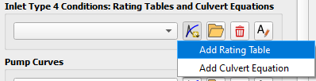
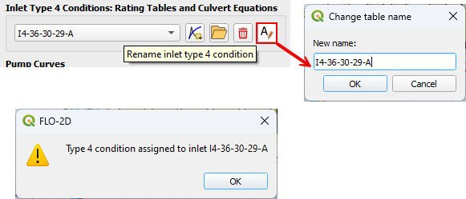
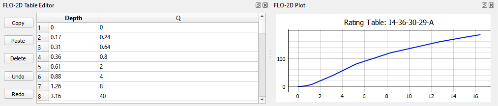
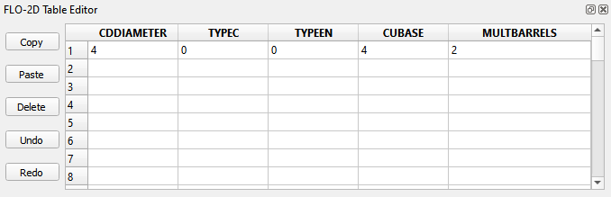
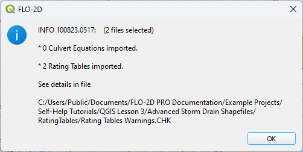
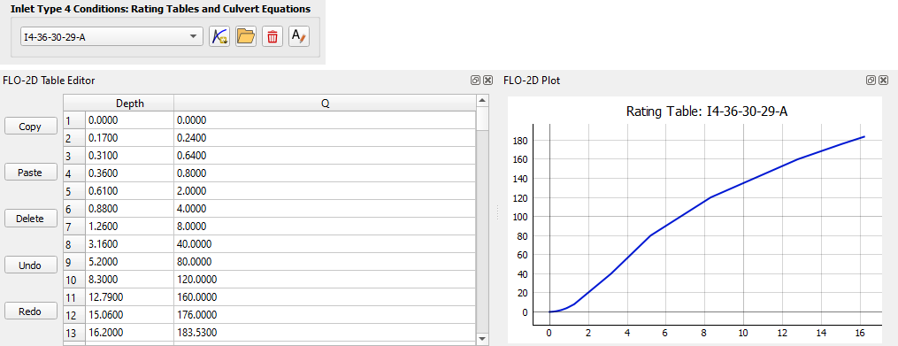
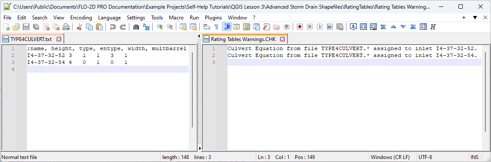

Type 4 Tables Group
=====================

Type 4 inlets are headwalls or complex inlets that need a rating table or a rating equation to define the inflow.
The rating table is a depth and discharge relationship that defines flow into the structure.  The rating equation
is per the Hydraulic Design of Highway Culverts from the U.S. Department of Transportation (DOT).

The storm drain editor has an editor group to create the data for individual inlets or import the data for multiple
inlets.

.. image:: ../../../img/Storm-Drain/typefour001.png

.. Note:: If a Type 4 inlet is a headwall, the Feature switch should = 1. This means the inlet will exchange flow with the
   grid at the invert of the headwall.

   If a Type 4 is non-traditional geometry inlet that has an underground invert elevation, the feature switch should
   = 0.  This means the inlet will exchange flow with the grid at the rim of the inlet.

Single Rating Table
----------------------

1. To add a rating table to a single inlet, click the Add Rating Table button.

2. Rename the new table to match the name of the type 4 inlet.  If the name is correct, a validating message will
   appear.

3. If this name is incorrect and does not match a type 4 inlet name, this message will appear.  Don't be confused by
   the "I4wrongName".  It's simple the "name" chosen to illustrate this error message.

.. image:: ../../../img/Storm-Drain/typefour004.png

4. Copy the depth and discharge table into the Table Editor.

Single Culvert Method
--------------------------

1. To add culvert equation data to a single inlet, click the Add Culvert Equation button.

.. image:: ../../../img/Storm-Drain/typefour010.png

2. Rename the new table to match the name of the type 4 inlet.  If the name is correct, a validating message will
   appear.

.. image:: ../../../img/Storm-Drain/typefour012.png

3. If the name is wrong and does not match a type 4 inlet, this message will appear.

.. image:: ../../../img/Storm-Drain/typefour004.png

4. Fill the culvert data.

Many Rating Tables
----------------------

1. For many rating tables, use the import button.

.. image:: ../../../img/Storm-Drain/typefour006.png

2. The files that contain the rating table data are ascii text files and the name matches the inlet name.  Select
   all of the files.

3. If there is an error in one of the files, the error report will be written to the Rating Tables Warning.CHK.

4. An example of the rating table data is shown on the left in the following image and the warning file example is
   shown on the right.

.. image:: ../../../img/Storm-Drain/typefour009.png

5. The imported data is loaded in the table plot and editor when the type 4 inlet is selected.

Many Culverts Method
------------------------------

1. To add a set of culvert equation data to many inlets, click the import button.

.. image:: ../../../img/Storm-Drain/typefour006.png

2. Select a file named TYPE4CULVERT.txt.  The file name should be TYPE4CULVERT.txt.

.. image:: ../../../img/Storm-Drain/typefour013.png

3. If there is an error in one of the files, the error report will be written to the Rating Tables Warning.CHK.

.. image:: ../../../img/Storm-Drain/typefour014.png

4. An example of the rating table data is shown on the left in the following image and the warning file example is
   shown on the right.

5. The imported data is loaded in the table editor when the type 4 inlet is selected.

.. image:: ../../../img/Storm-Drain/typefour017.png

Generalized Culvert Equation
------------------------------

The culvert equation data is partially defined by the conduit that the headwall is connected to and partly defined by
the culvert opening.

+-------------------+----------------------------------------------------------------------------------+
| VARIABLE          | DESCRIPTION                                                                      |
+===================+==================================================================================+
| CDIAMETER         || Diameter for a circular culvert                                                 |
|                   || Height for rectangular culvert                                                  |
|                   || (ft or m)                                                                       |
+-------------------+----------------------------------------------------------------------------------+
| CUBASE            || Width for rectangular culvert width                                             |
|                   || 0.0 for a circular culvert                                                      |
|                   || (ft or m)                                                                       |
+-------------------+----------------------------------------------------------------------------------+
| MULTBARREL        | Number of barrels                                                                |
+-------------------+----------------------------------------------------------------------------------+
| STRUCTNAME_INLET  | Name of the type 4 inlet. Exact Match required                                   |
+-------------------+----------------------------------------------------------------------------------+
| TYPEC             | Culvert switch. 1 = rectangular 2 = circular                                     |
+-------------------+----------------------------------------------------------------------------------+
| TYPEEN            || Culvert switch. Set TYPEEN(I) for entrance type 1, 2, or 3.                     |
|                   || BOX entrance:                                                                   |
|                   || type 1 - wingwall flare 30 to 75 degrees                                        |
|                   || type 2 - wingwall flare 90 or 15 degrees                                        |
|                   || type 3 - wingwall flare 0 degrees                                               |
|                   || PIPE entrance:                                                                  |
|                   || type 1 - square edge with headwall                                              |
|                   || type 2 - socket end with headwall                                               |
|                   || type 3 - socket end projecting                                                  |
+-------------------+----------------------------------------------------------------------------------+

