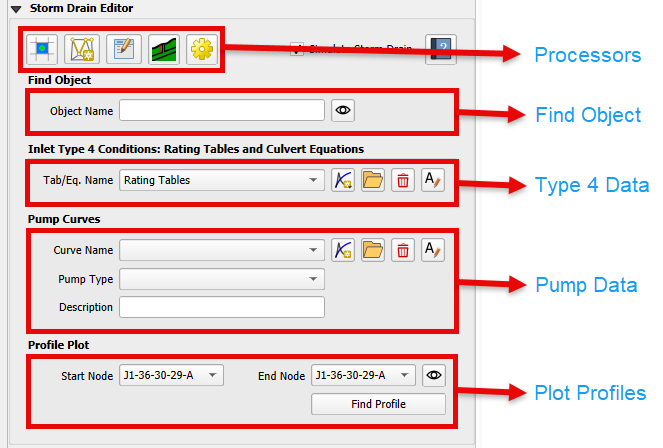

Storm Drain Editor
=====================

.. toctree::
   :hidden:
   :maxdepth: 4

   Create Storm Drain
   Processors Group
   Find Object
   Type 4 Tables
   Pump Data
   Profile Plot
   Properties

Overview
-------------

The Storm Drain Editor widget has several functions to prepare the data that integrates the FLO-2D surface water model
with the storm drain model.  This document will show different methodologies to set up a storm drain system and
to connect it to the grid elements.

The widget has functions that are outlined in red in the following image.  Each of these blocks is covered in
different sections that can be selected on the left side content table.

Storm Drain Resources
------------------------

FLO-2D incorporates a modified version of the EPA SWMM 5.0 engine to manage its storm drain modeling, which is both
complex and detailed. Below are some resources to assist in developing effective modeling practices.

1. Start with an advanced tutorial. This will give a good example of a real storm drain model.

   |sd1|

.. |sd1| raw:: html

   <a href ="https://www.youtube.com/watch?v=Q4G6GtgAM2M&list=PLkT3KNZwX6zkkfrM5Pcdvt7WqZuHWYU4c&pp=gAQBiAQB" target="_blank">Storm Drain Tutorial</a>

2. FLO-2D Storm drain guidelines are installed with FLO-2D Software.

   C:\\Users\\Public\\Documents\\FLO-2D PRO Documentation\\flo_help\\Manuals\\FLO-2D Storm Drain Manual 2023.pdf

3. EPA SWMM Documentation 5.0 is installed with EPA SWMM.

   C:\\Program Files (x86)\\EPA SWMM 5.0\\epaswmm5.chm

4. Open SWMM Documentation and Forum is an excellent resource for general storm drain modeling questions.

   |sd2|

.. |sd2| raw:: html

   <a href ="https://www.openswmm.org/" target="_blank">Open SWMM</a>

5. ChatGPT is an excellent quick reference but be careful because it often uses the wrong version of a software when it
   provides help.

   |sd3|

.. |sd3| raw:: html

   <a href ="https://chat.openai.com/" target="_blank">Chat GPT 3.5</a>

6. Use the contact form if these resources do not provide a solution to a FLO-2D storm drain modeling problem.

   |sd4|

.. |sd4| raw:: html

   <a href ="https://flo-2d.com/contact/" target="_blank">Contact FLO-2D Support</a>

Storm Drain Units
------------------------

FLO-2D uses the following units for storm drain modeling.

====================  ========================  ========================
**Parameter**         **Units (Imperial)**      **Units (Metric)**
====================  ========================  ========================
Discharge             cubic feet per second     cubic meters per second
                      (cfs)                     (cms)
Volume                cubic feet (ft³)          cubic meters (m³)
Depth                 feet (ft)                 meters (m)
Area                  square feet (ft²)         square meters (m²)
Elevation             feet (ft)                 meters (m)
Velocity              feet per second (ft/s)    meters per second (m/s)
Time                  hours (hr)                hours (hr)
Date                  MM/DD/YYYY                MM/DD/YYYY
Time Series           HH:MM                     HH:MM
====================  ========================  ========================

