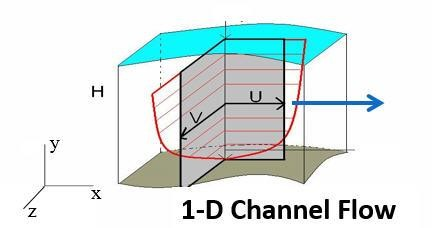
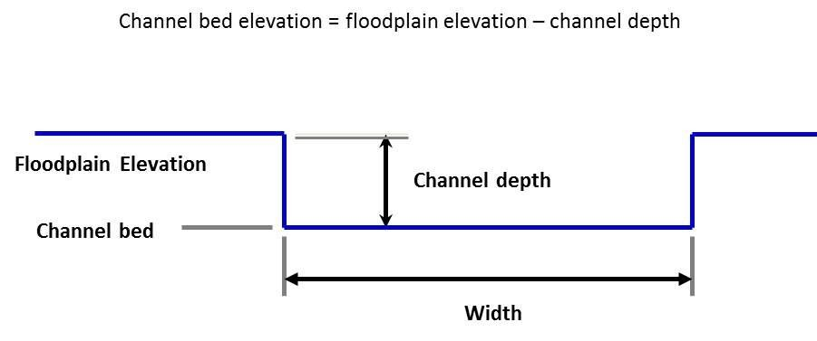
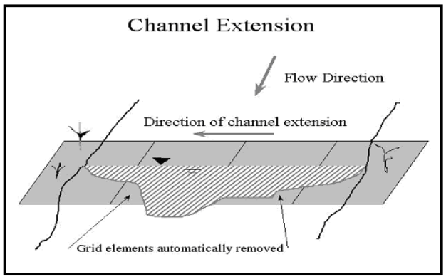
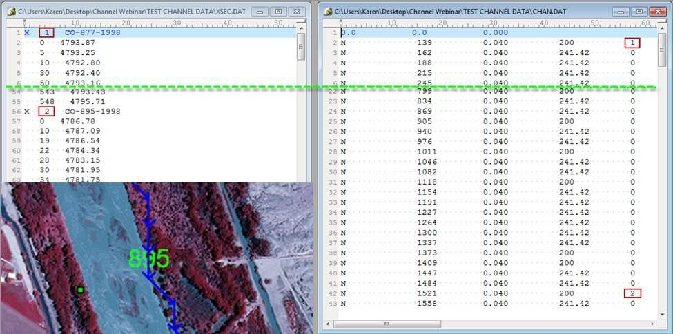
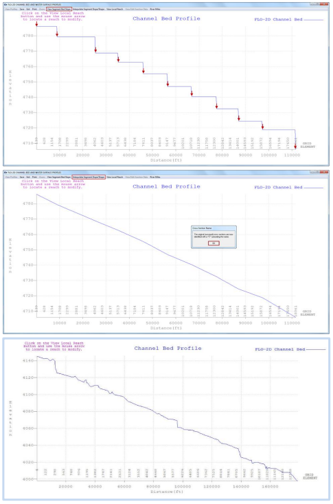
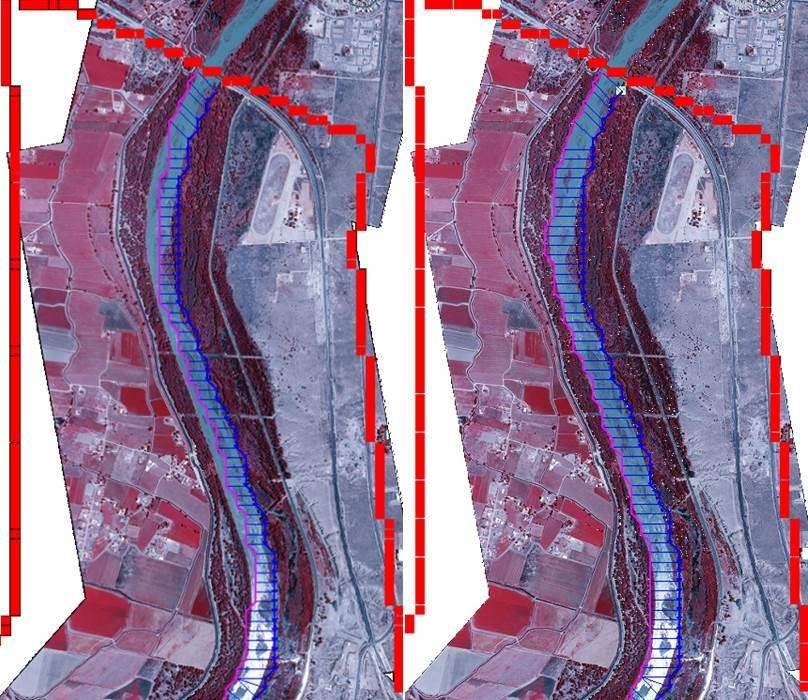
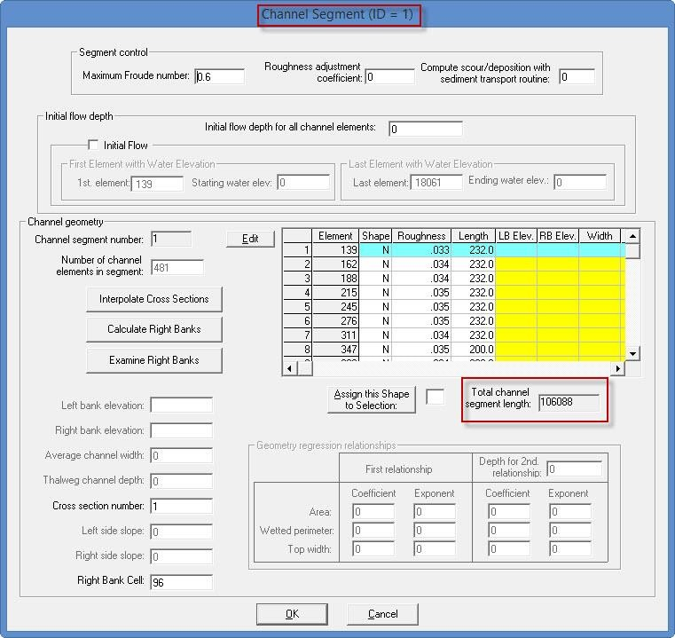
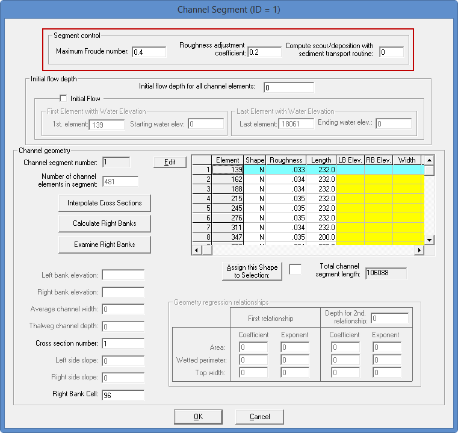

.. vim: syntax=rst

Chapter 1
==========

This document supplements the FLO-2D Reference Manual, Data Input Manual and training materials such as the webinars and videos, lessons and short
course PowerPoint presentations.
It presents guidelines and information that are designed to assist the user in developing a model with a detailed 1-D channel.
Here is a list of other available references for channel modeling: C:\\users\\Public\\Public Documents\\FLO-2D PRO Documentation

- Data Input Manual

    ˖ Chan.dat, chanbank.dat, xsec.dat
    ˖ Profiles.exe processor program overview
    ˖ Channel output files

- Workshop Lessons

   ˖ Lesson 3 – Simple geometry and confluence
   ˖ Lesson 4 – Simple cross section converter
   ˖ Lesson 5 – Profiles.exe overview and example
   ˖ Lesson 8 – Import from HEC-RAS
   ˖ Lesson 14 – Advanced natural channel modeling

- QGIS Workshop Lessons

   ˖ Lesson 2 – Import from HEC-RAS

- Example Projects w/Channels

   ˖ Urban example
   ˖ Lesson 15 – natural channel with levee
   ˖ Alawai
   ˖ Rio Grande
   ˖ Goat
   ˖ Aqueduct
   ˖ Sediment transport

Sharefile.flo-2d.com – Webinar Series\\Channel Series

- Videos

   ˖ Basic channels
   ˖ Advanced channel modeling
   ˖ Channel optimization
   ˖ Advanced natural channels

Channel Overview
----------------

Channel flow is simulated as one-dimensional depth averaged flow represented by a single water surface within the cross section.
Average flow hydraulics of velocity and depth define the discharge between channel grid elements.
There is no two-dimensional flow variation within the channel and there is no vertical velocity distribution, secondary currents, or superelevation in
channel bends.
Flow is only simulated in the downstream direction (x-direction = blue arrow in Figure 1).
The flow is routed between channel elements by solving the full dynamic wave momentum and the continuity equations.
The average flow path length between two channel elements is on the order of the length of the grid element and this precludes a profile plot of a
hydraulic jumps over a short distance.
The flow transition between subcritical and supercritical flow is based on the average conditions between two channel elements.

*Figure 1.
Channel Flow is One-Dimensional – No Vertical or Horizontal Velocity Distribution*

River flow is simulated with rectangular, trapezoidal or natural channel cross sections.
The CHAN.DAT file contains the following data: grid element number, rectangular or trapezoidal cross section geometry (natural cross section station
and elevation data are compiled in the XSEC.DAT file), average cross section roughness, and the length of channel within the grid element.
Channel bed slope is computed as the difference between the channel element thalweg (lowest point in the cross section) elevations divided by the half
the sum of the channel lengths within the channel elements.
Channel elements must be contiguous to be able to share discharge.

Channel Geometry, Length and Roughness
--------------------------------------

There are four channel geometry options:

    - R - Rectangular
    - T - Trapezoidal
    - N - Natural
    - V - Regression Equation (not recommended except for unique cases)

The channel cross section options are rectangular, trapezoidal and natural.
In FLO-2D, the floodwave movement in the channel is controlled by the rate of change in the discharge as a function of the rate of change in the flow
area (∂Q/∂A).
The cross section shape is not critical in the flood routing.
It is important when reading the data to set up the relationship between flow area and depth.
The rectangular and trapezoid channel bed elevations are computed by subtracting the channel depth from the lowest floodplain bank elevation unless
the bank elevations are assigned in the CHAN.DAT file.
For these cross sections, since the channel bed elevations are referenced to the floodplain elevation, it is important to review the PROFILES program
bed slope before running the model.
For the natural channel cross sections, the station data is given by the actual elevation, so the bed profile should reflect the field conditions.
The user has several other options for setting up the channel data file including grouping the channel elements into segments, specifying initial flow
depths, identifying contiguous channel elements that do not share discharge, and assigning limiting Froude numbers and depth variable n-value
adjustments.
For data file example refer to the FLO-2D Data Input Manual.

*Rectangular*
~~~~~~~~~~~~~

The rectangular channel geometry is defined by width, depth and length of channel inside the grid element (Figure 2).

*Figure 2.
Rectangular Channel Geometry.*

.. note:: The channel bank elevations can be entered directly in the CHAN.DAT file for both rectangular and trapezoidal channels.*

*Trapezoidal*
~~~~~~~~~~~~~

Similarly, the trapezoidal channels are defined by bottom width, channel depth and side slopes (ratio of horizontal to vertical) (Figure 3).
Again, the channel length is the length inside the grid element.

.. image:: img/Chapter1/Chapte026.png

*Figure 3.
Trapezoidal Channel Geometry.*

For small channels, urban channels, or channels with unknown detailed geometry or lack of survey data, a rectangular or trapezoidal cross section
representation can be used by estimating the channel configuration.
This is certainly the case for a channel with a conveyance capacity less than the 2-year flood event when the floods being simulated are 10-year event
or larger.
Most of the flood volume is on the floodplain in this situation.

The type of channel geometry can vary within a channel segment.
A trapezoidal channel in one channel element can be followed by a rectangular or natural cross section in the next downstream element.
Similar channel geometry is typically assigned by segment in CHAN.DAT.
In urban areas, there may be a rectangular concrete channel that transitions to a natural cross section.
Trapezoidal tributaries represented by one segment can join a mainstem channel segment that has natural cross section geometry.

*Natural*
~~~~~~~~~

Actual river natural cross sections can be modeled if the station and elevation data is available (Figure 4).
Geo-referenced cross section station and elevation data can be obtained by survey (land or bathymetry) or by cutting cross sections from a digital
terrain model data.
This data can be entered directly into the model data files.
To use natural cross section data, an XSEC.DAT file has to be created with all cross section station and elevation data.
The cross sections are then assigned to a channel element in the CHAN.DAT.
The relationship between the flow depth and channel geometry (flow area, wetted perimeter and topwidth) is based on an interpolation of depth between
vertical slices as small trapezoids (Figure 5).
The vertical slices stop at the lowest top of bank.
For flow depths above this the cross section is extended vertically.
This data constitutes a channel geometry rating table for each cross section.
The cross section data in the XSEC.DAT file can be automatically assigned from a GEO-RAS geometry file using the GDS.

.. image:: img/Chapter1/Chapte004.jpg

*Figure 4.
Natural Channel Cross Section Data.*

.. image:: img/Chapter1/Chapte024.png

*Figure 5.
Natural Shape Cross Section Geometry*

Natural river cross sections should be spaced to represent a uniform river reach that may encompass any number of channel elements.
Interpolations between cross sections facilitate transitions to changes in geometry.
A surveyed or cut cross section might represent 5 to 10 elements but if the channel shape is uniform, cross sections can be spaced farther apart.

A channel cross-section can extend across multiple grid elements (Figure 6).
If the channel width is greater than the grid element width, the right bank can extend into neighboring grid elements.
For example, a channel may be 1,000 ft (300 m) wide and the grid element only 30 ft (10 m) square.
The model also makes sure that there is sufficient floodplain surface area within the left and right bank grids after assigning the right bank.
There must at least 5% of a bank grid element available for floodplain storage in order for the channel to interact with the bank floodplain elements
to share discharge to the floodplain.
Each bank element can have a unique elevation.
If the two bank elevations are different in the CHAN.DAT file, the model automatically splits the channel into two elements even if the channel would
fit into one grid element.

*Figure 6
Channel Extension over Several Grid Elements*

There are three options for establishing the channel bank elevation to bed elevation relationship:

    1. A prismatic channel element bed elevation (rectangular and trapezoidal channels) is determined by subtracting the assigned channel thalweg depth from
       the floodplain elevation.
    2. A bank elevation is assigned in the CHAN.DAT file and the channel bed elevation is computed by subtracting the channel depth from the lowest bank
       elevation.
       This is appropriated for rectangular and trapezoidal geometry.
    3. Station/elevation cross section data is assigned in XSEC.DAT that represents the top of bank and bed elevations in the channel.
       When using actual cross section data for the channel geometry, option 3 should be applied.

Channel Development
~~~~~~~~~~~~~~~~~~~

There are several steps required when developing the 1-D channel component in the GDS.
These include locating the channel position, interpolating the cross sections or entering geometry data, adjusting the slope, adjusting the length,
and assigning the n-values.
The step by step processes are outlined in several workshop lesson tutorials and videos.
Specifically, Lessons 3, 4, 5, 8, and 14 are tutorials that deal with channel development.
The Data Input Manual is another source of information for channel modeling.
It lists and describes the data files and variables used to create channels.
An overview of the overall process is briefly discussed below.

Locate the channel element with respect to the grid system
^^^^^^^^^^^^^^^^^^^^^^^^^^^^^^^^^^^^^^^^^^^^^^^^^^^^^^^^^^

Using the GDS and an aerial photo, the channels can be assigned to a grid element.
For channel flow to occur through a reach of river, the channel elements must be contiguous neighbors Using the background image, a polyline can be
drawn along the left bank to select the left bank elements and then the individual cross sections can be identified with the appropriate channel bank
element (Figure 7).
This process is completely automated if a GEO-RAS geometry file can be imported with the cross section data.

.. image:: img/Chapter1/Chapte005.png

*Figure 7.
Channel Delineation.*

Interpolate the Cross Section
^^^^^^^^^^^^^^^^^^^^^^^^^^^^^

Eventually, each left bank channel element is assigned a cross section in the CHAN.DAT file.
Generally, there are only a few cross sections and numerous channel elements, so each cross section will be assigned to represent several channel
elements.
In the GDS, the surveyed or known cross sections are assigned to corresponding channel elements where they are located, the rest of the channel
elements have a zero assigned as the cross section number (Figure 8).
A shapefile of cross section locations can be used to help identify the cross section to channel element placement.

*Figure 8.
Cross Section Assignment.*

When the cross sections have all been assigned the channel bed profile looks like a staircase (Figure 9 top) because the channel elements without a
surveyed cross section not been interpolated.
The intermediate grid elements without a surveyed cross section must be filled in using interpolation between known cross sections.
The command can be performed in the GDS or in the PROFILES program.
It adjusts and assigns a cross section data with a linear bed slope for each channel element (Figure 9).
The cross section geometry interpolation has two loops.
The first loop interpolates only the cross section shape and the second loop is a weighted flow area adjustment to achieve a more uniform rate of
change in the flow area between interpolated cross sections.
The original cross sections are not edited.

*Figure 9.
Channel Bed Profile Examples*

Adjust the Channel Bed Slope
^^^^^^^^^^^^^^^^^^^^^^^^^^^^

Following the channel cross section interpolation, the bed slope is linear between two known or surveyed cross sections.
There is no other data available to create a variable bed slope between cross sections.
When reviewing the cross section slope, it is possible that there may be abrupt bed slope changes or adverse slope conditions that seem unreasonable.
Adverse bed slope in the downstream direction can be accommodated by the model (Figure 9), but subsequent surveys or data collection, may justify
adjustments to the bed slope.
Re-interpolating the bed slope can be accomplished in the Profiles program for local cross section adjustments.

Assign the Right Bank Element
^^^^^^^^^^^^^^^^^^^^^^^^^^^^^

Once the channel geometry has been assigned and interpolated, the right bank elements can be assigned using a GDS menu command (Figure 10).
After the assignment, the right or left banks can be realigned to the better represent the bank locations in the aerial image using mouse point and
click commands.

*Figure 10.
Right Bank Assignment and Realignment.*

Channel Length Adjustment
^^^^^^^^^^^^^^^^^^^^^^^^^

The channel length within each grid element is initially estimated as a straight line for a half grid element and is reported in the GDS dialog box
(Figure 11).

*Figure 11.
Channel Segment Length and Segment Number.*

This value is based on the position of each grid element with respect to its contiguous upstream and downstream neighbors.
The length is the sum half the length of the grid element from the center of the node to the edge or corner closest to the upstream or downstream node
(Figure 12).

.. image:: img/Chapter1/Chapte009.png

*Figure 12.
Channel Length for 3 Channel Elements.*

The total channel length in the dialog box represents the sum of the individual grid element channel lengths.
Using the GDS distance measurement tool in the Tools menu, a channel centerline length can be computed.
(This can also be done in any GIS or CADD program).
Knowing the channel centerline length, individual channel element lengths can be adjusted so that the total channel length shown in the dialog box
matches the centerline length within an acceptable tolerance (e.g. one ft or meter).
The total bankfull channel volume is the sum of all the channel element cross section areas times the channel lengths.
Adjusting the channel element lengths to have an accurate total channel volume will improve the relationship between the flood volume in the channel
and the flood volume on the floodplain.
Figure 13 shows the total distance of the channel in the GDS and the isolated channel lengths in the CHAN.DAT file.

.. image:: img/Chapter1/Chapte010.jpg

*Figure 13.
Channel Length.*

Channel Roughness
^^^^^^^^^^^^^^^^^

Open channel uniform flow is characterized by a constant depth, velocity, flow area and discharge such that the bed slope, water surface slope and
energy grade line are all parallel.
Generally, uniform flow dictates that the flow is also steady.
Unsteady, uniform flow typically does not occur naturally.
For practical purposes, natural uniform flow assumes the turbulent boundary layer is fully developed and the vertical velocity distribution is
logarithmic.
There are a number of mean velocity equations for open channel uniform flow and Manning’s equation is the best known of these:

.. math::
    :label:

    V = 1.486/n R^{2/3} S^{1/2}

where V = velocity, R = hydraulic radius, S = friction slope, n = Manning’s roughness coefficient.

The hydraulic radius exponent value (0.667) has been known to vary over a range from about 0.59 to 0.85 depending primarily on channel geometry and
roughness (Chow, 1959).
The roughness coefficient or Manning’s n-value varies with a number of factors including but not limited to bed friction, bed form,
expansion/contraction, vegetation, obstructions, and flow depth.
As the flow departs from a steady, uniform condition, the n-value must increase if the hydraulic radius and slope exponents remain the same.
Higher n-values must be applied to represent accelerating or decelerating flow.

It is important to note that Manning’s equation is an empirical formula that was developed on the basis of laboratory and field measurements for
steady, uniform, fully developed turbulent flow.
Its application however has become universal to virtually all flow conditions.
In a FLO-2D flood simulation the flow is rarely steady or uniform.
Channel backwater and ponded flow conditions are two instances when Manning’s equation may not be appropriate.
The flow resistance should be represented by a composite n-value that includes consideration for bed irregularities, obstructions, vegetation,
variation in channel geometry, channel expansion and contraction, potential rapidly varying flow and variable river bed forms.
Poor selection of n-values or failure to provide spatial variation in roughness can result in numerical surging.
Using n-values that represent prismatic channel flow for nonprismatic natural channels should be avoided.

Manning’s n-value is also known to increase with decreasing flow depth (Chow, 1959).
Manning’s equation will overpredict the velocity for shallow flow if typical n-values have been assigned that represent bankfull flow (blue line in
Figure 14).
Bankfull flow is depicted by the Blue Line.
The green Line represents the flow in the photo.
Bankfull discharge n-value = 0.035.
When the remnant ripples in the photo are covered by a flow of 0.1 ft, n-value = 0.060.
When computing velocity for shallow flow depths on the order of 0.1 ft or smaller (tolerance TOL value), unique n-values should be used.
In lieu of using different velocity equations, one for deeper flow and one for shallow flow, it is necessary to compensate for overpredicting the low
flow velocity by assigning higher shallow n-values or by using depth variable n-value adjustment or both.

.. image:: img/Chapter1/Chapte023.png

*Figure 14.
Low Flow vs. Bank Full Discharge.*

A channel roughness adjustment can be assigned in the CHAN.DAT file to estimate the n-value at depths below bankfull discharge (Figure 15 – red box).

*Figure 15.
Channel Control Variables.*

The n-value assigned in CHAN.DAT should represent the flow roughness near bankfull flow.
The depth integrated n-value based on the ROUGHADJ coefficient (0.2 to 0.4) will result in an n-value of 1.5 to 1.8 times the assigned bankfull
n-value at a depth of 0.5 ft (0.15 m).
Figure 16 shows the relationship between the SHALLOWN (0.2) and the depth integrated n-value for a cross section with a bankfull n-value of 0.03 and
ROUGHADJ = 0.4.
With this temporal roughness adjustment during the FLO-2D simulation, the arrival of a floodwave can be accurately simulated.
If only one n-value is assigned representing bankfull discharge, the Caballo dam release floodwave shown in Figure 17, would arrive at a gaging
station in El Paso (107 miles downstream) 6 to 8 hours too soon.
Similarly, matching the measured hydrographs at the Jensen, Utah gage from diurnal power plant releases at Flaming Gorge Dam would not be possible
without the depth integrated n-value adjustment (Figure 18).

.. image:: img/Chapter1/Chapte012.jpg

*Figure 16.
Depth Variable Roughness.*

.. image:: img/Chapter1/Chapte013.jpg

*Figure 17.
Dam Release Hydrograph El Paso, TX.*

.. image:: img/Chapter1/Chapte014.jpg

*Figure 18.
Dam Release Hydrograph Jenson, UT.* \ :sup:`1`

The applicability of Manning’s equation to a given flow condition depends on the relative submergence of the roughness elements (d/k\ :sub:`s`) where
d is the flow depth and k\ :sub:`s` is the effective roughness height.
In general, Manning’s equation is appropriate for a relative submergence greater than 100 (Julien, 1995):

.. math::
    :label:

    {d/k}_s > 100

The typical roughness height for grain size bed materials can range from 0.0015 ft for rough concrete to 0.01 ft for coarse sand or uniform earth
channels.
In this case Manning’s equation for a coarse sand plane bed would be applicable to as low as 0.7 ft.
In general, Manning’s equation should apply (with limited variation n-value with the roughness height if the flow depth is roughly 25 times or more
than the relative roughness (Simons and Senturk, 1976 and Chow, 1959).
Using these criteria, a flow depth for coarse sand would be about 0.25 ft.

The depth integrated roughness is given by the equation:

.. math::
    :label:

    n_d = n_b r_c e^{–(r2 depth/dmax)}

where:

    depth = flow depth

    d\ :sub:`max` = bankfull depth

    n\ :sub:`b` = bankfull n-value

    n\ :sub:`d` = n-value at the flow depth

    r2 = ROUGHADJ factor (0.2 – 0.4) rc = 1./e –(r2)

The bankfull n-value is defined as the n-value for a depth of 3 ft or 1 m for overland or floodplain and the ROUGHADJ default value is 0.4.
The ROUGHADJ factor can be higher ranging up to 1.0 or more, but a typical range is from 0.2 to 0.4.
The application of the depth variable roughness has the following advantages:

    - Can be used to reduce or eliminate surging from low to high flow;
    - Accounts for submerged roughness elements;
    - Enhances the modeling upper regime sediment transport.

The basic guidelines for roughness assignment and temporal variation in a FLO-2D model are:

    - SHALLOWN – for very shallow flows up to 0.2 ft
    - SHALLOWN/2 for flows up to 0.5 ft
    - Assign n-values for floodplain flow depths > 3 ft or 1 m (channel – bankfull)
    - Use depth integrated n-values (default for floodplain)
    - Calibrate n-values for reasonable Froude numbers – adjusted at runtime

Channel – Floodplain Flow Exchange
----------------------------------

The channel-floodplain exchange is computed for each channel bank element and is based on the potential water surface elevation difference between the
channel and the floodplain for both the left and right bank (Figure 19).
The flow can overtop the left bank without overtopping the right bank, they are independent.
The velocity of either the channel overbank or the return flow to the channel is computed using the diffusive wave momentum equation.
It is assumed that the overbank flow velocity is relatively moderate or small compared to the channel and thus the acceleration terms are negligible.
The channel-floodplain flow exchange is limited by the available exchange volume.
For return flow to the channel, if the channel water surface is less than the bank elevation, the bank elevation is used to compute the slope for the
return flow velocity.
The slope is the given by path length (a function of the available floodplain surface area) and the difference between the floodplain water surface
elevation and the top of bank elevation.
Overbank discharge or return flow to the channel is computed using the floodplain assigned roughness.
The overland flow can enter a previously dry channel.

.. image:: img/Chapter1/Chapte015.png

*Figure 19.
Channel Floodplain Flow Exchange.*

Channel flow is exchanged with the floodplain grid elements in a separate routine after the channel and floodplain flow subroutines have been
completed.
The exchange flow is not subject to the numerical stability criteria associated with the channel or the floodplain.
When the channel interface routine is called, the floodplain and the channel computation loops for the timestep have been completed.
The interface routine is internal to the model and there are no data requirements for its application.
For the channel floodplain flow exchange, the limiting Froude number for overland flow on a bank element is hardcoded to 0.9 to reduce the number of
n-value adjustments.
The overbank nvalues have a maximum value of 0.120.

The channel top-of-bank elevation typically does not match the interpolated floodplain elevation containing the bank element.
Often the floodplain elevation interpolation includes some DTM points that are within the dry channel (on the bed or banks of the channel).
This lowers the floodplain elevation with for the bank element.
When a model simulation begins, if the difference between the surveyed top-of-bank elevation and the floodplain elevation are different by 1 ft or
more, the floodplain elevation is reset to the channel top-of-bank elevation.
Alternatively, if the overbank slope (difference between the channel top-of-bank and floodplain elevations divided by the grid element side) is
greater than 0.01 (1 percent), the floodplain elevation is reset to the channel top-of-bank.
This reduces the opportunity for severe overbank or return flow discharge based on unrealistic floodplain conditions.

The floodplain elements with the channel banks n-values are also reset to a minimum 0.065 value to account for channel bank vegetation, floodplain
surface irregularities and plunging overbank flow conditions.
Often n-values assigned for parking areas, streets or other urban features with n-values are inadvertently assigned to the bank elements.
When shapefiles are used to assign n-values, the bank elements can fall within the shapefile limits for a street or parking lot.
A minimum n-value assignment of 0.065 will help to avoid overbank exchange discharge spikes that might affect the channel numerical stability.

The 1D natural channel conveyance capacity is based on the highest bank elevation with the lower bank extended vertically to match the higher bank
elevation.
This eliminates the potential of the natural channel being represented with an exceedingly low bank with essentially no cross sectional flow area.
The channel routing is similar to the HEC-RAS assessment of channel cross sections.
It does not significantly change the potential for overbank discharge exchange with the floodplain.
It only slightly increases the flow area for channel hydraulic computations.
The channel conveyance flow area for a natural channel is increased by the green space in Figure 20.

.. image:: img/Chapter1/Chapte025.png

*Figure 20.
Vertical Extension of the Lowest Top of Bank to the Highest Top of Bank.*

Channel Numerical Stability and Volume Conservation
---------------------------------------------------

Channel numerical stability requires the convergence of the routing algorithm solution to the full dynamic wave equation for velocity.
For almost any channel configuration, a small timestep will eliminate the numerical surging.
The key to efficient computational flood routing for a finite difference model with an explicit numerical scheme is appropriate numerical stability
criteria that limits the timestep to avoid surging and yet allows timesteps that are large enough to complete the simulation in a reasonable time.

FLO-2D has a variable timestep that is a function of the numerical stability criteria.
The numerical stability criteria are checked for the every channel element for every timestep.
If the numerical stability criteria for any channel element are exceeded, the timestep is decreased and all the previous hydraulic computations for
that timestep are discarded.

The Courant Number is used in the FLO-2D model as the stability criteria to control the timestep.
The Courant Number relates the floodwave movement to the model discretization in time and space.
The concept of the Courant Number is that a particle of fluid should not travel more than one spatial increment Δx (channel element length) in one
timestep Δt.
In the FLO-2D model the Courant number limits the timestep Δt by:

.. math::
    :label:

    Δt = \frac{C Δx}{(V + c)}

where:

   C = Courant Number (C ≤ 1.0)

   Δx = square grid element width V = depth averaged velocity c = floodwave celerity = (gd)\ :sup:`0.5` where g is gravitation acceleration and d is the
   flow depth

The Courant Number C can vary from 0.0 to 1.0 (recommended range 0.2 to 0.6), and a value of 1.0 in FLO-2D would enable the model to have the largest
possible timestep.
While the Courant condition is a necessary condition solution convergence, it is not always sufficient to guarantee numerical stability.
When C is set to 1.0, artificial or numerical diffusivity is theoretically zero for a linear convective equation.
In previous versions of FLO-2D, the Courant Number was hardwired in the model with a value of C = 1.0.
Recent testing has shown that the model can run faster (more consistent higher timesteps) with greater stability if the Courant Number is set to
values less than 1.0.
A starting value of C = 0.6 is recommended.
Some guidelines fo applying the Courant number are:

    1. Use the default stability criteria for the initial simulation:
       - Courant Number C = 0.6
       - DEPTOL = 0.0
       - WAVEMAX = 0.0.
    2. If the model has no numerical surging or unreasonable maximum velocities, the model can run faster by increasing the Courant Number to 0.7 or 0.8.
    3. If the model has some numerical instability, decrease the Courant Number by 0.1 to a minimum value of 0.3.
    4. After a flood simulation is complete, review the TIME.OUT file to determine which of the stability criterion is slowing down the model.

It has been determined that the Courant Number is more effective in controlling numerical instability surging than the other FLO-2D stability
parameters DEPTOL and WAVEMAX.
It is recommended that both parameters be set to zero.

Channel instability arises because of a mismatch in the channel flow area, friction slope and n-value

(Figure 21).
Discharge is a function of the friction slope S\ :sub:`f` in Manning’s equations to the one-half power and is inversely proportional to the n-value,
but the discharge is a function of the flow area A to approximately the 5/3 power.

.. math::
    :label:

    Q = f(A, S, n)

where A = a d\ :sup:`b` and a = power regression coefficient and b = power regression exponent

Assigning a reasonable n-value that balances flow area and slope will make the model more stable.

To identify channel surging, first review the VELTIMEC.OUT file for any unreasonable maximum velocities (listed by grid element and time in descending
order).
The CHANMAX.OUT file lists the maximum discharge, maximum stage and time of occurrence, and can also be reviewed for numerical instability.
The HYDROG program plotted hydrographs (Figure 21) can also reveal channel surging.
Typically steep rising hydrographs and small channel storage cause the most frequent surging issues (Figure 22).
The rate of change in the discharge flux (ΔQ/Δt) is the culprit.

.. image:: img/Chapter1/Chapte016.jpg

*Figure 21.
Surging Observed in a Channel Element Hydrograph.*

.. image:: img/Chapter1/Chapte017.jpg

*Figure 22.
Steep Rising Hydrograph.*

A steep rising hydrograph, intense rainfall, or severe overland flow to the channel may cause instability near the inflow node or at any location in
the channel where the conveyance capacity may be highly variable.
To eliminate channel surging, perform the following steps:

    1. Check the bed profile for unreasonable spikes (PROFILES program – Figure 23);
    2. Adjust the n-values (particularly in channel area transition reaches);
    3. Adjust the flow area - smooth out the area transitions (re-interpolate the cross sections);
    4. Apply the depth variable roughness; 5.
       Use limiting Froude number FROUDC.

.. image:: img/Chapter1/Chapte018.jpg

*Figure 23.
Check the Channel Bed Profile for Data Errors.*

The Froude number is important for several reasons:

    - It delineates subcritical and supercritical flow;
    - It is the ratio of average flow velocity to shallow wave celerity;
    - It relates the movement of a translational wave to the stream flow; • It defines an appropriate relationship between velocity and depth.

Most models report the Froude number or provide warnings when the Froude number is high, but do not make any model adjustments at runtime to limit
unreasonable Froude numbers from being encountered.
The Froude number is directly related to model stability through the Courant number:

.. math::
    :label:

    C = \frac {c(F + 1)}{(\frac{\Delta x}{\Delta t})}

where:

    C = selected value of Courant number

    F = Froude number

    c = wave celerity = (gd)\ :sup:`0.5`; d = flow depth, g = gravitational acceleration

    t = timestep

    x = channel element length

Channel instability arises when the Froude number is high, the timestep is large, or the computation length is small (small channel conveyance
capacity).

Jia (1990) suggested that the trend towards a minimum Froude number is a mechanism that controls the channel adjustment.
The minimum Froude number concept states that an alluvial channel system tends to seek its lowest potential energy and attain higher stability as it
evolves.
This indicates that the greater the bed material movement, the lower the channel stability.
It follows, therefore, that a channel with low bed material transport and high stability will also have minimum hydraulic values.
As alluvial channels approach equilibrium conditions, the Froude number will seek a value that reflects minimum bed material motion and maximum
channel stability.
Since the Froude number identifies a hydraulic state, the most stable condition for sand-bed channel equilibrium is directly related to a minimum
Froude number.

Establishing a limiting Froude number in a flood routing model can help maintain the numerical stability.
In alluvial channels, the practical range of Froude numbers at bankfull discharge is 0.4 to 0.6.
Supercritical flow on alluvial fans is typically suppressed by high rates of sediment transport.
High velocities and shallow depths on alluvial surfaces will dissipate energy with sediment entrainment.
Supercritical flow is more prevalent on hard surfaces such as concrete-lined channels.
Jia (1990) provides a relationship to estimate a minimum Froude number (Fr\ :sub:`min`) for stable alluvial channels at equilibrium:

.. math::
    :label:

    Fr_{min} = 4.49 d^{-0.186} (VS)^{0.377}

Where:

    d = representative sediment size (typically D\ :sub:`50)` V = velocity and S = bed slope.

Recommended limiting Froude numbers are:

    - Major rivers: 0.3 – 0.6
    - Floodplain: 0.5 – 0.8
    - Alluvial fans: 0.9 – 1.1
    - Street flow: 1.1 – 1.75

When a limiting Froude number (FROUDC in CHAN.DAT) is assigned, the model computes the channel Froude number for each timestep.
If the limiting Froude number is exceeded, the Manning’s n-value is increased according to the following criteria:

.. list-table::
   :widths: 50 50
   :header-rows: 0

   * - percent change
     -

   * - from the original n-value
     - n-value increment increase

   * - < 20
     - 0.0002

   * - 20 < % < 50
     - 0.0001

   * - 50 < % < 100
     - 0.00002

   * - 100 < % < 200
     - 0.000002

On the recessional limb, when the limiting Froude number is no longer exceeded, the n-value is decreased by 0.0001.
This increase in flow resistance mimics increasing energy loss as the flow accelerates.
When the limiting Froude is exceeded, the changes in the n-value are reported in the ROUGH.OUT file.
When the simulation is completed the maximum n-values in the ROUGH.OUT file are written to CHAN.RGH.
After reviewing the maximum n-value changes in ROUGH.OUT and making any necessary changes in the CHAN.RGH file, this file can be renamed to CHAN.DAT
for the next simulation.
In this manner, the channel n-value is spatially calibrated to a reasonable Froude number.
Spatially variable limiting channel Froude numbers (FROUDC) can be assigned by segment (reach) in the first line of each segment (control line).
For the final model product, the ROUGH.OUT should be almost empty and the limiting Froude numbers can be turned off.

Supercritical flow in alluvial mobile bed channels is limited because of the rapid energy dissipation associated with sediment entrainment and bed
erosion.
As slope increases, competent flow for sediment transport asymptotically approaches critical flow.
In most instances, flow is forced to be less than critical by incipient motion thresholds.
This will define a limiting Froude number as given by Grant (1997):

.. math::
    :label:

    F_r = 3.85 S^{0.33} gravel bed (τ^*_cr` = 0.03)

    F_r = 5.18 S^{0.11} sand bed (τ^*_cr = 0.06)

For mobile bed channels a steep slope is required for flow to approach critical because the hydraulics oscillate with sediment entrainment.
These relationships define the upper limit Froude number for sand and gravel for slopes < 0.10.
There is a unique relationship that exists between slope, flow area and roughness.
The Froude number (Fr) is related to the flow resistance K and the energy slope S as given by:

.. math::
    :label:

    Fr = (KS)_{0.5}

If there is a mismatch between these physical variables in a flood routing model, then high velocities can occur that may result in flow surging.
Assigning a limiting Froude number has several practical advantages.
First, it helps to maintain the average flow velocity within a reasonable range.
Secondly, a review of the increased n-values in ROUGH.OUT will identify any trouble spots where the velocity exceeds a reasonable value.
In this case, the roughness value is increased to offset an inappropriate flow area and slope relationship.
When the adjusted n-values in CHAN.RGH are used for the next simulation, the effect of the mismatched variables is reduced and numerical surging is
dampened.
In addition, the increased n-values can prevent oversteepening of the frontal wave.
The final n-values used in a simulation should be carefully reviewed for reasonableness.
The limiting Froude numbers can be set to “0” for the final simulation to avoid any additional adjustments in the n-values.

In summary, most channel surging occurs in channel transition reaches from wide to narrow or narrow to wide because of the mismatched change in
n-value (or no n-value variation) with the changing flow area and bed slope.
This will be discussed further in the troubleshooting section.
Steady, uniform flow (Manning’s eqn.) n-values are not equivalent to unsteady, non-uniform grid element nvalues in a discretized flood routing model.
FLO-2D numerical stability is inherently linked to the Courant number and a reasonable local Froude number.

A complex urban model can conserve volume and still have channel instability.
Surging is often limited to a few channel elements over one time step or just a few time steps.
Volume conservation errors are almost always data errors and typically grow with time.
A volume conservation error that is greater than 0.001 percent can be improved.
A successful simulation generally has a volume conservation error less than 0.000100 percent.
The volume conservation accounting can be reviewed in the SUMMARY.OUT (Figure 24) as shown below for a project that had excellent volume conservation.

.. image:: img/Chapter1/Chapte019.png

*Figure 24.
SUMMARY.OUT Example.*

The CHVOLUME.OUT file reports the channel volume conservation.
Usually if there is a volume conservation error it is in the channel and both CHVOLUME.OUT and SUMMARY.OUT will report the same error.
CHVOLUME.OUT (Figure 25) is listed below:

.. image:: img/Chapter1/Chapte020.jpg

*Figure 25.
CHVOLUME.OUT Example.*

Channel data issues that might lead to a volume conservation error include:

    - Inappropriate Profile
    - Wrong or missing channel elements (typos)
    - No channel outflow element
    - Missing bank stations in the cross section data
    - Conflicts with hydraulic structures or other components
    - Radical cross section shape or area changes between two contiguous elements

Every completed FLO-2D project should demonstrate that volume was accurately conserved.
Troubleshooting channel volume conservation errors is discussed in Chapter 3.

.. [1]
   The difference in the predicted hydrograph and the measured
   hydrograph is around 200cfs. This is due to unmeasured tributary flow
   between the dam and the gage.
