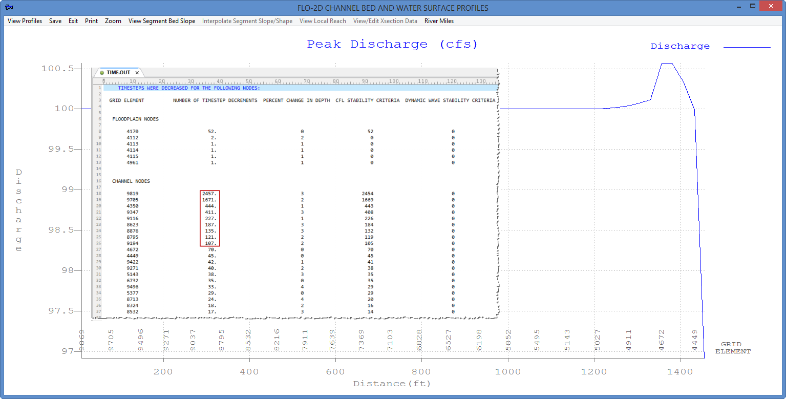
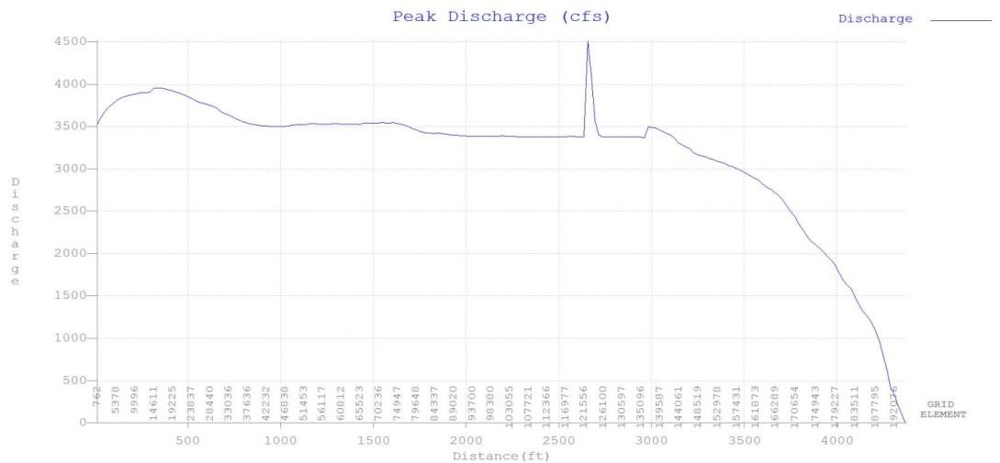
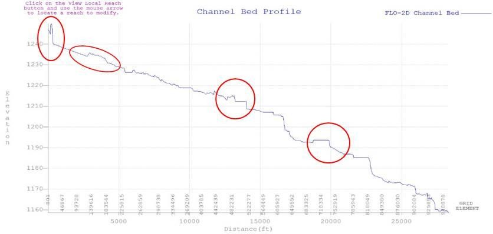
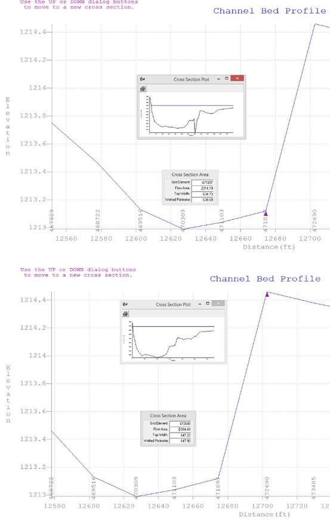
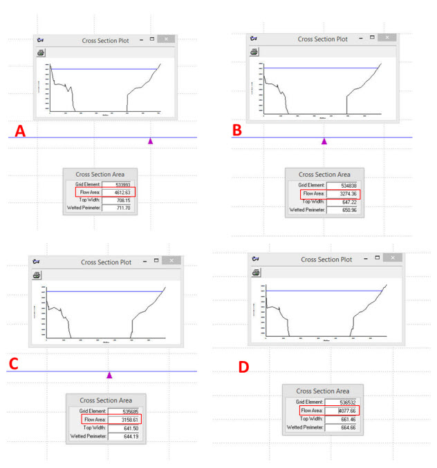
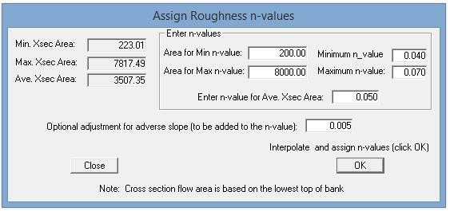

.. vim: syntax=rst

Chapter 3 - Troubleshooting
============================

Channel Troubleshooting
-----------------------

When a FLO-2D model simulation is complete, the first check for accuracy should be the volume conservation reported in SUMMARY.OUT and CHVOLUME.OUT.
If the model did not conserve channel volume, then the error needs to be isolated to a short reach of channel to determine the issues.
Initially, the other components that interact with the channel can be turned off such as rainfall, infiltration, and hydraulic structures.
This can be done one component at time or all together at once.
If the volume conservation error persists, then it may be necessary to turn off the channel segments or tributaries one at a time to isolate the
problem.
First make copies of the affected data files and then remove any inflow and outflow nodes to the segment.
The removal of any channel elements (segments or tributaries) from the CHAN.DAT file would require that the XSEC.DAT and CHANBANK.DAT files also be
modified by eliminating the corresponding cross sections and right banks.
Another method for isolating a portion of the channel is to establish a new temporary inflow and outflow node in a short reach of channel (Figure 69).

.. image:: img/Chapter3/Chapte002.jpg
  :class: bordered-image

*Figure 69.
Isolate a Short Portion of the Channel.*

Fixing a volume conservation error could entail adjusting the channel cross sections, reviewing the bank elevations, adjusting the hydraulic
structures rating tables or eliminating other component conflicts.
In general, volume conservation errors are the result of data errors and are usually identified in the ERROR.CHK file.
They can also result from improper geometry resulting rapid variations in cross sectional area and/or slope and roughness coefficients.

For FLO-2D models using the 1-D channel component, most of the timestep decrements reported in the TIME.OUT file are attributed to the channel
elements.
The top few channel elements listed in the TIME.OUT file may also have surging associated with them which can be discerned by plotting the maximum
discharge in PROFILES (Figure 70), reviewing CHANMAX.OUT or VELTIMEC.OUT.
The most sensitive model scenario is a wide channel with small grid elements where the channel left and right banks are separate by ten or more grid
elements.
In this situation, the channel element conveyance capacity is relatively small because the channel length is short compared to the channel width.

*Figure 70.
TIME.OUT and Profiles - Peak Discharge.*

For example, a channel on the order of 800 ft wide was simulated on a grid system of 20 ft elements in Phoenix.
Between the left and right bank elements, there were 40 or more elements (Figure 71).
Each channel element was 20 ft to 28 ft long.
For discharges over 10,000 cfs, this resulted in a large discharge flux with relatively small volume storage.
Very small timesteps, less than 0.5 seconds were required to maintain numerical stability.
To avoid small timesteps with such a large channel, it is necessary to select larger grid elements when generating the grid system.
The choice of the grid element size has to be based on the project priority; either accurate channel flood routing or predicting the floodplain
inundation in detail.

.. image:: img/Chapter3/Chapte004.jpg
  :class: bordered-image

*Figure 71.
Wide Large Channel Assigned to a Small Grid System.*

To compute smoother hydraulics between two channel grid elements the options are to adjust the bed slope, the cross section flow area or the roughness
values.
Abrupt changes in cross sections geometry from one channel element to another should be avoided.
The channel flow area should make a gradual transition from a wide, shallow cross section to a narrow deep cross section occur over several channel
grid elements.
Adjust the channel geometry so that the maximum change in flow area between channel elements is less than 25%.

To improve the channel component performance, the following steps should be taken:

Review PROFILES peak discharge plots or the output files CHANMAX.OUT or VELTIMEC.OUT.
Look for any channel elements with numerical surging (note spike – Figure 72).

*Figure 72.
Channel Numerical Instability – Peak Discharge vs Channel Distance.*

Review and adjust the bed slope with the PROFILES program.
Adverse bed slopes are acceptable, but flat beds, spikes and other inconsistences should be reviewed (Figure 73 – red ovals).
In a highly modified or constructed urban environment, this channel profile may be appropriate, but it should be edited if necessary to achieve a
stable more realistic model.

*Figure 73.
Review the Channel Bed Slope for Irregularities.*

Reduce the variability between channel element cross section flow areas.
Avoid abrupt cross section transitions between channel elements.
Adjust the channel cross section geometry in the PROFILES program.
Figure 74 A and B shows the change in channel shape between two contiguous channel elements with the same approximate bankfull flow area.

*Figure 74 A and B.
Change in Channel Geometry between Two Contiguous Channel Elements.*]

Figure 75 A - D show four consecutive channel elements with a bankfull flow area that varies from 4,600 ft\ :sup:`2` to 3,300 ft\ :sup:`2` to 3,250
ft\ :sup:`2` back to 4,100 ft\ :sup:`2`.
This is about a 33% change in bankfull conveyance capacity.

*Figure 75.
A-D Change in Bankfull Flow Area between Four Consecutive Channel Elements.*

For the entire channel segment, the flow area varies from 223 ft\ :sup:`2` to 7,817 ft\ :sup:`2` with an average cross section flow area of 3,507 ft\
:sup:`2` as displayed in the PROFILES program n-value interpolation dialog box (**Error! Reference source not found.**).
For a channel that should have approximately the same conveyance capacity, this is too much variation in the flow area.
This indicates that each cross section in the model needs to be reviewed.

To improve numerical stability, increase the roughness in wide, shallow cross sections and decrease the roughness in narrow deep channel grid elements.
Review the channel element roughness variation upstream and downstream of channel elements with spikes in discharge (Figure 76).

*Figure 76.
Variable n-value System Profiles.*

Select a longer channel length within the channel grid element to allow more storage (Increase the lengths in the red outline in Table 5.
The maximum length should be less than 1.5 times the grid element side.

**Table 5.
CHAN.DAT File with Channel Lengths Highlighted**

.. raw:: html

    <pre>
    N 801 0.04 20.23 1 N 1723 0.04 20.33 2
    N 2646 0.04 20 3
    N 3569 0.04 20 4
    N 4492 0.04 20.04 5
    N 5416 0.04 20.05 6
    N 6340 0.04 20.53 7 N 7264 0.04 20 8
    N 8188 0.04 20 9 N 9111 0.04 20 10
    N 10034 0.04 20 11
    N 10957 0.06 20.59 12
    </pre>

.. raw:: html

     

Small timesteps are the result of exceeding the numerical stability criteria (Courant criteria).
The change in channel flow depth for a timestep may be too large.
The primary reason for a slow flood simulation is that the discharge flux is too high for the selected grid element size (channel element conveyance
capacity).
Selecting a grid element size in proportion to the channel flow area and anticipated peak discharge is the most appropriate way to avoid a very slow
model.

