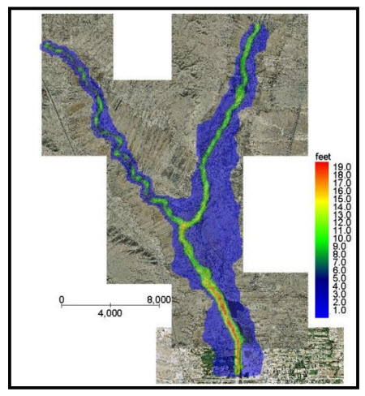
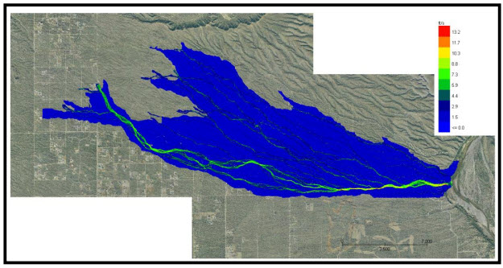
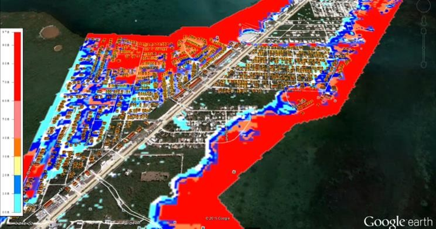
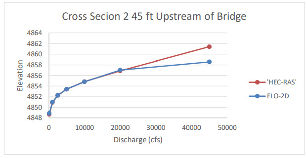
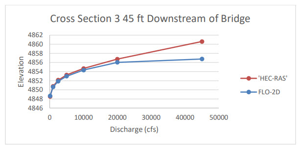
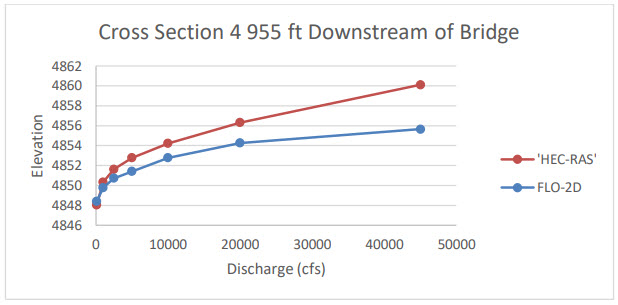
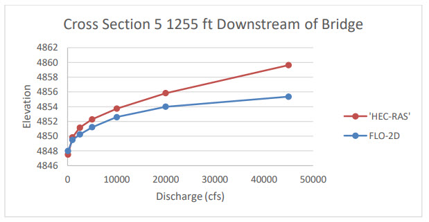
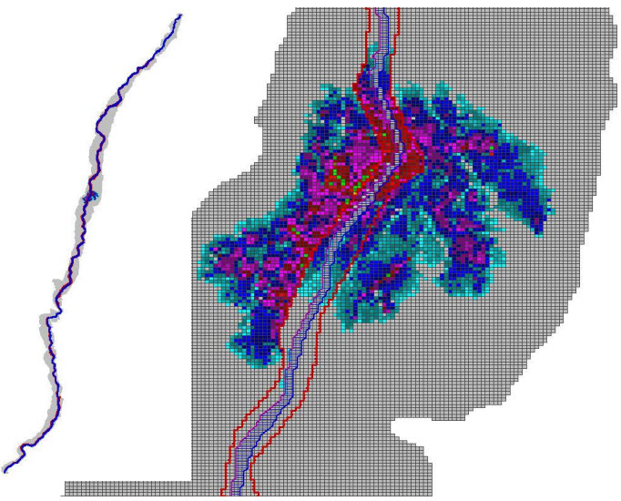

.. vim: syntax=rst

Chapter 5. FLO-2D PROJECT APPLICATIONS
======================================

The FLO-2D website (`www.flo-2d.com) <http://www.flo-2d.com/>`__ has numerous webinars, video animations of predicted flooding, PowerPoint
presentations and various documents that highlight FLO-2D model project applications.
The five primary projects applications of the FLO-2D model are river projects, unconfined floodplain and alluvial fans models, watershed and
rainfall/runoff analyses, urban and storm drain simulations, and coastal flooding.

River Applications
------------------

Simulating river flow is one of the more common applications of the FLO-2D model (Figure 127).
The key to simulating river flooding is correctly assessing the relationship between the flood volume in the channel and the volume distributed on the
floodplain.
There are several key factors that help to define an accurate relationship between channel volume and geometry.
The surveyed channel cross sections should be appropriately spaced to facilitate transitions between wide and narrow cross sections in the model.
The channel volume is dependent on a good estimate of the total channel length (sum of the channel element lengths).
This length should be compared to channel centerline distance of model project reach.
Finally, predicted water surface elevations are based on the channel roughness values and calibrating the model roughness with known discharges and
surveyed water surfaces will finalize the channel flood routing accuracy.

*Figure 127.
Middle Rio Grande and Rio Chama Confluence Model.*

When preparing a channel simulation, the available cross sections are distributed to the various channel elements based on reaches with similar
geomorphic features.
The bed elevation is then adjusted between channel elements with surveyed cross sections.
The n-values are estimated from knowledge of the bed material, bed forms, vegetation or channel planform.
The n-values may also serve to correct any mismatched channel flow area and slope.
Roughness values can also be adjusted by specifying a maximum Froude number.
Using this approach, the relationship between the channel flow area, bed slope and n-value can be adjusted to better represent the physical system,
calibrate the water surface elevations, eliminate any numerical surging, and speed-up the simulation.

The two most important FLO-2D results are the channel hydrograph at a downstream location and the floodplain area of inundation.
Typically, if the area of inundation is correct, then the channel flow depths and water surface elevations will be relatively accurate.
Replicating the channel hydrograph and the floodplain inundation while conserving volume is a good indication that the volume distribution between the
channel and the floodplain is reasonable.

Flood routing details related to channel flow include simulating hydraulic structures, levees, infiltration, and sediment transport.
Hydraulic structures may include bridges, culverts, weirs, diversions or any other channel hydraulic control.
Levees are usually setback from the river on the floodplain but can control the water surface in the channel if the flood is confined.
Channel infiltration is based solely on the hydraulic conductivity and represents average bed and bank seepage conditions.
Bed scour or deposition associated with a mobile analysis is non-uniformly distributed on the channel cross section.
Mudflows can also be routed in channels.

Unconfined Floodplain and Alluvial Fan Flooding
-----------------------------------------------

The primary focus of an unconfined flood simulation is how the volume is distributed over the floodplain surface.
The flood volume controls the area of inundation (Figure 128).
FLO-2D can simulate an unconfined floodwave progression over a dry flow domain without specifying any boundary criteria.
No hot starts or prescribed water surface elevations are required.

Important flood routing details include topography, rainfall spatial variation in infiltration and roughness, flow obstructions, levees, hydraulic
structures, streets.
The timing of the floodwave progression over the floodplain can be improved with rills and gullies.
Street flow may control shallow flooding distribution in urban areas.
Buildings and walls that obstruct flow paths and or eliminate floodplain storage.
The levee routine can be used to simulate berms, elevated roadway or railroad embankments or other topographic features to confine the flow on the
floodplain.
Hydraulic conveyance facilities such as culverts may control local water surface elevations.
Spatially variable rainfall may inundate areas outside the primary flood path.
It is possible to model detention basins using either the grid element elevation or levees to define the basin storage area.
An appropriate grid element size should be selected to generate enough interior elements to adequately simulate the basin.

*Figure 128.
Unconfined Alluvial Fan Flooding*

Watershed Rainfall Runoff Simulation
------------------------------------

FLO-2D can used as a watershed model to predict rainfall runoff using one of three infiltration loss methods.
The model can generate a flood hydrograph at a point of concentration as inflow to a downstream flood model.
Rainfall runoff can result in sheet flow or concentrated in rills and gullies using the multiple channel component which will reduce the travel time
associated with sheet flow.
It is possible to simulate rainfall while routing a flood overland and have the rainfall occur directly of the water surface without abstraction.
Spatially variable rainfall distribution using real time rain gage or NEXRAD data can also be modeled.
The GDS will reformat the rain gage data for real time storm runoff and flood simulation.
Basin water course depressions created in the data based because of the lack of DTM data on the channel bed can be smoothed out with the GDS smoothing
tool.
This will eliminate potential flood storage associated with the artificial depressions.

Using the FLO-2D model to cover the watershed and urban areas avoids the need to create separate models with generated hydrographs from the upper
basin constitute the inflow to the urban model.
The watershed-urban interface will be more accurate as a single model since the inflow will not all be concentrated at a few points.
Runoff will occur as sheet flow all along the interface.

The watershed can also be a source of sediment supply for the urban project area for either sediment transport modeling or mud and debris flows.
Sediment supply for conventional bedload and suspended analysis can be generated in the upper basin by simply applying one of the eleven sediment
transport formulas.
For mudflows there are two methods for loading the hydrograph with sediment.
A sediment concentration by volume is assigned to a discretized time interval of the inflow hydrograph.
A second method is to load the inflow hydrograph with a volume of sediment.
In this manner, spatially differential sediment loading in a watershed channel can be simulated.
Once the hydrograph is bulked with sediment, the mudflow is routed as a water and sediment continuum over the hydrograph.
The bulked sediment hydrograph is tracked through system conserving volume for both water and sediment.
Flow cessation and flow dilution are possible outcomes of the mudflow routing.

Urban Flooding
--------------

One of the primary applications of the FLO-2D model is urban flood hazard delineation.
It is the most robust and detailed urban flood model available with the capability to model buildings, street flow, walls and berms, storm drains,
hydraulic structures (culverts, bridges and weirs), rainfall, infiltration, building roof runoff, building collapses and LID components.
Area drainage master plans in the Phoenix area are being completed with FLO-2D using grid systems on the order of 1.8 million elements.
Urban grid element size is typically 20 ft, however, ten foot elements have been used with high resolution topographic data bases (Figure 129).

.. image:: img/Chapter5/Chapte011.jpg

*Figure 129.
Urban flooding with Street Flow and Building Obstruction (1 million 10 ft elements)*

A critical component of the urban flood model is the storm drain.
The FLO-2D storm drain component is fully integrated with the surface water system including channels and detention basins (Figure 130).
The detail in FLO-2D surface water and storm drain interface exceeds that of any other storm drain model.
The FLO-2D model computes the storm drain inlet discharge based on the inlet geometry and the water surface elevation using weir and orifice control.
The user can select from five types of storm drain inlets.
The inlet and outfall exchange with the surface water (including return flow) are based on the water surface head not just the rim elevation.
Figure 130 shows velocity vector and flow depth results in an urban area with the integrated storm drain system.
Typically, the storm drain capacity is minor compared to the 100-year flood volume, the relations between return period flooding and the storm drain
effectiveness can be tested for the more frequent events.

.. image:: img/Chapter5/Chapte002.jpg

*Figure 130.
Urban Model with Streets, Buildings and Storm Drains*

.. image:: img/Chapter5/Chapte003.jpg

*Figure 131.
Urban Model Results with Storm Drains*

Coastal Flooding
----------------

FLO-2D can predict accurate ocean hurricane surge flooding for sea level scenarios including spatially variable hurricane rainfall.
Storm surge inundation in urban areas requires detailed modeling of features coastal berms, walls, buildings, streets and channels.
The impact on coastal urban storm drain systems with ocean outfalls from combined sea level rise and storm surge can be simulated with a FLO2D model.
Urban coastal flooding is controlled by:

    - Volume of ocean water coming inland, flood volume and volume conservation
    - Sediment bulking (add 20% volume)
    - Flood mitigation – sea walls and levees
    - Loss of storage due to buildings
    - Street flow to urban outlying areas
    - Channel flow and storage
    - Loss of storm drain capacity with sea level rise

To simulate storm surges a time-stage relationship at the shoreline grid elements is required.
This table can include high tides as a well as multiple surge waves.
A time-stage relationship (Table 15) can also be used to simulate a short duration tsunami event.
A typical time-stage relationship is shown below.

*Table 15.
Stage Time Relationship.*

.. list-table::
   :widths: 50 50
   :header-rows: 0

   * - **Time (hrs)**
     - **Stage (ft)**

   * - 0.0
     - 0.43

   * - 5.0
     - 0.75

   * - 11.0
     - 1.29

   * - 16.0
     - 6.63

   * - 24.0
     - 0.38

   * - 36.0
     - 0.62

In addition to the time-stage relationship, the model features that may define a coastal flood model are:

    - Rainfall
    - Streets
    - Storm drain system
    - Levees or flood walls
    - Estuary channels and drainage canals
    - Roughness
    - Hydraulic structures (culverts and bridges)
    - Buildings

A FLO-2D storm surge model was prepared for the Florida Keys using the ocean time-stage relationship associated with 2005 Hurricane Wilma (

Figure 132).

Using these area of inundation results, the products associated with coastal flood models include:

    - Prediction of the overland progression of the hurricane surge through urban area.
    - Risk/hazard assessment on urban development and infrastructure (storm drain system).
    - Estimate groundwater level rise and its impact on drainage and utilities.
    - Automatically estimate storm surge damage and mitigation costs.

*Figure 132.
Hurricane Wilma 2005 Predicted Storm Surge in the Florida Keys*

Model Results – What Constitutes a Successful Flood Simulation?
---------------------------------------------------------------

When a FLO-2D simulation is completed, how do you know if the simulation was successful or accurate? There are three keys to a successful project
application:

    - Volume conservation
    - Area of inundation
    - Maximum velocities and numerical surging

Volume must be conserved for both the overland flow and channel flow.
If the storage plus outflow volume was not conserved on the order of 0.0001 percent or better of the inflow volume, then it will be necessary to
conduct a detailed review and determine where the volume conservation error occurred.

If the volume was conserved, then the area of inundation can be quickly reviewed in either MAXPLOT or MAPPER Pro programs.
If the area of inundation seems reasonable and the flood appears to have progressed completely through the system, then the maximum velocities in the
channel, on the floodplain or in the streets should be reviewed for numerical surging.
There are numerous webinars and

Power Point presentations on project review and troubleshooting at the FLO-2D website.
The Data Input Manual has discussions on troubleshooting numerical surging and how to resolve it with applications of the limiting Froude number.

Once the FLO-2D flood simulation is providing reasonable results, you can fine tune the model and speed it up.
Review the TIME.OUT file to determine which channel, floodplain or street elements are causing the most timestep reductions.
Model speed may not be critical if the simulation is accurate with respect to volume conservation, discharge surging and area of inundation.

FLO-2D Bridge Routine Comparison with HEC-RAS
---------------------------------------------

The objective of the FLO-2D bridge routine is to compute the discharge through the bridge based on the physical configuration and features of the
bridge.
The component enables the user to compute the bridge discharge without using an external program to generate a stage-discharge rating curve or table
as required in the past for the FLO-2D model.
Three classes of flow regime are computed: Free surface flow for discharge below the bridge low chord; Pressure flow when the discharge is above the
low chord but below the bridge deck; and Combined pressure and weir flow as the discharge goes over the bridge.
The pressure flow and weir flow computations are relatively straight forward.
The pressure flow will be either sluice gate flow or orifice flow, whichever is smaller.
The free surface flow is more complex with a number of multiplicative coefficients that represent the various bridge features and flow conditions.
The bridge discharge is shared between two grid elements (channel or floodplain) that do not have to be contiguous.

Most bridge design and flood conveyance analysis have been performed with a 1-D HEC-RAS model where a discharge (peak Q) is prescribed and the water
surface elevation is computed.
In a twodimensional flood routing model the opposite is required, the upstream and downstream flow depths and water surface elevations are known and
the discharge through the bridge is computed.
Matching HEC-RAS or other models with bridge components may not be exact because of the computational approach (e.g. solution to the 1-D energy
equation vs flood routing with the full-dynamic wave momentum equation) and because the FLO-2D bridge routine has more detail for both free surface
flow and pressure flow.
Ultimately, the bridge flow control with coefficient adjustments, however, should be provide a suitable correlation between the models.
In reality, unless there is an opportunity to calibrate the bridge coefficients to a field data set, it should not be assumed that the HEC-RAS or
other bridge routines are necessarily more accurate.

The objective in applying the FLO-2D bridge routine is not to provide a detailed flow field through bridge and predict scour around piers but rather
to accurately assess the relationship between upstream/downstream water surface elevations of the two grid elements linked by the bridge and compute
the discharge passing between them.
In this manner, the flow can be assessed as onedimensional with no variation in water surface elevation in the bridge channel cross section.
The average flow velocity through the bridge is depth integrated.
The primary result of the FLO-2D bridge routine for unsteady flow is to assess the deviation from the approximate normal depth flow condition through
the bridge that results in an upstream backwater effect.
This will enable the accurate analysis of bridge constricted floodplain and river reaches that exhibit non-uniform and unsteady flow conditions.
For additional description and details of the FLO-2D bridge routine refer the White Paper ‘Bridge Hydraulics Component’.

Bridge Flow Modeling
^^^^^^^^^^^^^^^^^^^^

There are three basic flow conditions through a bridge: free surface flow, pressure flow and pressure flow plus deck overtopping flow.
Pressure flow, which occurs when the deck or superstructure is submerged, is defined as either sluice gate or orifice flow.
Flow through a bridge constriction is a function of the upstream headwater and downstream tailwater elevations (water surface slope), the extent of
the constriction (cross section variation), the bridge geometry (flow area, wetted perimeter, low chord, etc.) and various site factors such as
vegetation encroachment, bed scour, and riprap.
The flow may be subcritical or supercritical although supercritical flow may limited to a bridge with a concrete apron or bedrock substrate.
Subcritical flow is the most prevalent flow regime as bridge constrictions typically reduce upstream velocities and cause backwater effects as opposed
to flow acceleration through the bridge.

Free surface flow is the most common flow since the bridge is designed to pass a selected design flood below the bridge soffit.
Sluice gate flow occurs when the upstream opening is submerged but the downstream water surface elevation is below the low chord.
For this case, the discharge thru the bridge depends on the upstream water surface elevation and the bridge geometry and the downstream water surface
elevation is irrelevant.
The transition between sluice gate flow and orifice flow is unique to the bridge and maybe temporally variable with scour, deposition or debris
blockage.
Sluice gate flow may persist until the upstream flow depth is 1.5 times or greater that the depth to the low chord.

Once the bridge inlet has been permanently submerged, a rapid increase in upstream water surface may occur resulting in submergence of both the
upstream and downstream openings and the bridge cross section flowing full.
This is defined as drowned orifice flow and can only happen when both upstream and downstream water surface elevations exceed the 1.1 times the height
of the bridge opening.
Since the downstream water prevents the efficient flow thru the bridge, upstream flooding can quickly ensue.
In this case, the discharge control is a combination of the structure features and channel characteristics.

When the flow begins to overtop the bridge, the discharge is the sum of the pressure flow plus the deck overflow.
This is typically modeled as broadcrested weir flow with a coefficient in the range of 2.65 to 3.21.
If the bridge has guard rails or debris, the selected weir coefficient should be conservatively low.
Typically, overtopping flow is shallow, but for a long bridge the overflow discharge can be significant.
An assumption of weir flow to represent over deck discharge can only be an approximation because of a number of factors that are not limited to:

    - Tailwater submergence;
    - Variable deck elevation;
    - Unsteady flow conditions;
    - Guardrail supports causing blockage and spatially variable flow;
    - Debris blockage.

The bridge discharge computations will be performed inside the FLO-2D routing algorithm for the floodplain and 1-D channel components in conjunction
with the existing hydraulic structure routine.
The model will identify the flow condition, compute the appropriate discharge and exchange the discharge volume between the inflow and outflow nodes.
For details on the computation methods and equations for free surface, pressure flow and weir flow refer the companion White Paper on the FLO-2D
‘Bridge Hydraulics Component’.

A Comparison of Bridge Flow Modeling between FLO-2D and HEC-RAS
^^^^^^^^^^^^^^^^^^^^^^^^^^^^^^^^^^^^^^^^^^^^^^^^^^^^^^^^^^^^^^^

Model Development
'''''''''''''''''

A FLO-2D model of the Middle Rio Grande valley was prepared for the Corps of Engineers in the early 2000’s from Cochiti Dam to Elephant Butte
Reservoir in New Mexico (~ 170 miles).
This model was expanded and enhanced with smaller grid elements (250 ft), more spatial levee detail and was calibrated with field data during a 2005
prescribed release of the outlet works capacity.
The data collection included discharge measurements, water surface elevation surveys, field reconnaissance of floodplain inundation, and flown aerial
imagery.
The model was then applied to 30 years of historical spring releases to support the application of the Corps’ Upper Rio Grande Water Operation Model.
The Rio Grande FLO-2D model is still in use today.
Riada Engineering and Wolf Engineering collaborated on developing this Rio Grande FLO-2D model for the Corps.

All the Middle Rio Grande bridges and diversions were modeled with rating tables.
The rating tables were generated with HEC-RAS using 2 to 3 cross sections upstream and downstream of the bridge.
The HEC-RAS bridge models were obtained and reviewed to locate a bridge that could be simulated for all three types of flow with the primary emphasis
on the free surface and pressure flow.
The original HECRAS model was applied for discharges up to 20,000 cfs.
The maximum outlet discharge from Cochiti Dam is only 7,000 cfs without spillway release.
The pre-history Rio Grande prior to management experienced flows in excess of 100,000 cfs, but since Cochiti Dam is a flood control facility,
discharges over 7,000 cfs depend on tributary inflows.
A discharge of 20,000 cfs will not overtop any of the bridges in the Middle Rio Grande.
All the bridges were reviewed, and the Los Lunas Bridge was selected to review the computed discharge hydraulics with both HEC-RAS and FLO-2D models
(Figure 133 and Figure 134).

.. image:: img/Chapter5/Chapte005.jpg

*Figure 133.
Plan View of the Los Lunas Bridge.*

.. image:: img/Chapter5/Chapte006.jpg

*Figure 134.
View Downstream through Los Lunas Bridge (Wolf Engineering).*

                                                                            Figure 2

The Los Lunas Bridge spans a most of the Rio Grande active floodplain between the levees and has 16 sets of bridge pilings as shown in Figure
2. The HEC-RAS model of the bridge include 2 upstream cross sections and 3 downstream cross sections (Figure 135).
The bridge deck is about 90 ft wide.

.. image:: img/Chapter5/Chapte007.jpg

*Figure 135.
HEC-RAS Cross Sections and Stationing (Wolf Engineering).*

The bridge geometry and cross section plots are shown in Figure 136 with the blocked areas due to the approach roadway and bridge decking.
Both the deck soffit and roadway are curved with a difference of 1 ft between the minimum and maximum elevations.
The low chord and weir were represented by an average elevation.
The split channel with the island can be viewed in bridge cross section and in Figure 133.

.. image:: img/Chapter5/Chapte008.jpg

*Figure 136.
Los Lunas HEC-RAS Bridge*

The original FLO-2D model rating table had 40 stage-discharge pairs ranging from 10 to 20,000 cfs.
For this comparison, the HEC-RAS Los Lunas bridge model was run with only 7 discharges ranging from 100 cfs to 45,000 cfs (Figure 137).
The vertical lines in the active channel area below the bridge soffit are the rows of piles.
At 45,000 cfs the bridge deck was barely overtopped in the HEC-RAS model (blues horizontal lines in Figure 5).
The seven steady flow discharges used in the two models were:

            100 cfs 1,000 cfs 2,500 cfs 5,000 cfs, 10,000 cfs, 20,000 cfs, 45,000 cfs

*Figure 137.
Los Lunas Bridge HEC-RAS Water Surface Elevations.*

The FLO-2D was run with the seven discharges assigned to an inflow channel element about 16 channel elements upstream of the bridge.
Outflow nodes were assigned to a channel element about 9 channel elements downstream of the bridge and to the channel element just upstream of the
inflow node.
The inflow hydrograph to achieve steady was assigned as follows:

.. raw:: html

    <pre>
            Time (hrs)     Q (cfs)
            0.0            0.0
            2.0           1,000
            100.          1,000
    </pre>

The FLO-2D model was run for a simulation time of 6 hrs which was sufficient to achieve steady discharge at the bridge.
The model was also setup with the following data and assumptions:

    - Identical channel n-values (0.032);
    - Spatially variable overbank FLO-2D n-values that did not match the HEC-RAS model;
    - The upstream channel and bridge cross sections in the HEC-RAS model;
    - The rest of the channel cross sections were the original ones in the FLO-2D model;
    - Type 1 bridge configuration with no abutment or embankment slopes (vertical);
    - Average low chord and deck elevations as determined from Figure 4;
    - Deck length, bridge opening, and bridge width were determining from the HEC-RAS cross section;
    - Pile width was the sum of the 16 sets of individual pile widths;
    - No flow angle of attach with the bridge;
    - No coefficient variation for Froude number which ranges from 0.2 to 0.3;
    - No assignment for overall free surface flow discharge coefficient (to be computed).

Model Comparison Results
^^^^^^^^^^^^^^^^^^^^^^^^

The focus of comparing the HEC-RAS and FLO-2D models for the seven discharges is the predicted water surface elevations which, if equivalent, would
indicate that the model hydraulics (depth, velocity, flow area) match well.
The most important comparison are the model’s predicted upstream backwater elevations.
The HEC-RAS computed water surfaces elevations are shown in Figure 5.
The FLO-2D predicted water surface elevations were extracted from the CHANMAX.OUT file but could also be read from the HYCHAN.OUT file.
The BRIDGE_DISCHARGE.OUT and HYDROSTRUCT.OUT files verified that the steady state discharges matched exactly for those flows which were less than the
channel conveyance capacity of about 5,000 cfs.
The only FLO-2D model revisions were:

    - Adjustments were made to several channel element Mannings n-values.
      These n-value revisions were less than 0.005.
    - Outflow nodes were added upstream and downstream of the bridge to having to use the entire Rio Grande model.

No attempt was made to accommodate the HEC-RAS model 1-D constraints with respect to the floodplain conditions including roadway approach, levee
overtopping, or flow upstream or downstream past the outflow nodes.
The following FLO-2D limitations were noted with respect to the overbank floodplain discharge:

    - Floodplain storage was not filled to match the HEC-RAS 1-D steady flow inundation.
      No floodplain outflow nodes were assigned, and floodplain flow bypassed the channel outflow nodes both upstream and downstream.\
    - Overbank flow upstream re-entered the channel and flowed upstream in the channel.
    - Downstream overbank flow bypassed the outflow node and re-entered the channel.

Of the three flow regimes, free surface flow, pressure flow and weir flow plus pressure flow, the most critical comparison is for the free surface
flow regime water surface elevation because this computation is the most complex and detailed.
It is also the most frequent flow through the bridge and should include the bridge design flow.
Most bridges are not constructed to convey the design discharge as pressure or weir flow.
It should be noted that the pressure flow and weir flow involve a single equation and calibration is relatively straight forward with only a
coefficient adjustment.
Conversely, predicting free surface flow requires a number of combined coefficients that represent various features of the bridge or specific flow
conditions.

The comparison with the HEC-RAS stages for the discharges ranging from 100 cfs to 45,000 cfs for the five cross sections upstream and downstream of
Los Lunas Bridge are shown in Figure 138.
Pressure flow begins at about 18,000 cfs.
Figure 139 and Figure 140 indicate that the FLO-2D predicted stage upstream of the bridge at and below the low chord matches the HEC-RAS stage exactly.
This upstream reach with the backwater effect was the most critical aspect of the comparison.
For flows greater than the low chord HEC-RAS predicts a higher stage because FLO-2D cannot fill the overbank floodplain storage area to HEC-RAS level
because the discharge overtops the levees and flows beyond the cross sections both upstream and downstream (Figure 143).
The FLO-2D model could be manipulated to confine the 45,000 cfs with a longer duration inflow hydrograph and spatial constraints and floodplain
outflow nodes, but the sole purpose of this effort would be to match the over deck flow stage.
At this discharge, however, since the channel conveyance capacity is only about 5,000 cfs, most of the stage would reflect the floodplain conditions
not the bridge.

.. image:: img/Chapter5/Chapte012.jpg

*Figure 138.
Los Lunas Bridge Stage-Discharge Relationship Cross Section 1.*

*Figure 139.
Los Lunas Bridge Stage-Discharge Relationship Cross Section 2.*

*Figure 140.
Los Lunas Bridge Stage-Discharge Relationship Cross Section 3.*

*Figure 141.
Los Lunas Bridge Stage-Discharge Relationship Cross Section 4.*

*Figure 142.
Los Lunas Bridge Stage-Discharge Relationship Cross Section 5.*

Downstream of the bridge, the FLO-2D and HEC-RAS stages do not match very well, particularly at the higher flows.
This is because the FLO-2D model outflow node water surface elevation did not match the HEC-RAS water surface near cross section 5.
The FLO-2D channel outflow node pulls down the inchannel water surface, but much of the water is also overbank on the floodplain at that location.
Since the downstream water surface elevations were not important and did not affect the upstream stagedischarge, the additional effort required to
match the model downstream stages was not considered.

*Figure 143.
FLO-2D Maximum Depth for a Discharge of 45,000 cfs.*

Discussion
^^^^^^^^^^

The objective of the applying the FLO-2D and HEC-RAS bridge routines to the Los Lunas Bridge reach of the Rio Grande is to compare the prediction of
the stage for various discharges.
The HEC-RAS bridge routine involves an energy equation solution for a 1-D steady discharge step backwater condition and FLO-2D provides a 2-D full
dynamic wave momentum equation model solution for routing flood flows.
HEC-RAS presumes that the discharge covers the entire floodplain with a single water surface elevation and FLO-2D has a channel floodplain interface
to spatially distribute the flow in 2-dimensions on the floodplain.
The focus of the comparison of the two models was on the bridge and upstream cross section water surface elevations due to the backwater effects.

The FLO-2D model matched the HEC-RAS predicted stages for all the upstream water surface elevations below the low chord of the bridge.
For higher discharges, the FLO-2D model under predicted the HECRAS stages because the floodplain area of inundation was not filled.
The FLO-2D duration was too short and the floodplain attributes in terms of the levee and spatial extent of the flooding were different from the 1-D
HEC-RAS model.
In the FLO-2D model, most of the discharge over 5,000 cfs was on the floodplain and the flow moved past the inflow and outflow nodes both upstream and
downstream as shown in Figure 7.
It was also noted that the FLO-2D channel outflow conditions did not match the HEC-RAS model downstream boundary conditions, but this was less
important than the floodplain flow bypassing the channel outflow node.

Matching HEC-RAS or other models with bridge components may not be exact because of the differences computational approach and because of the FLO-2D
spatially variability of the floodplain flow distribution.
Ultimately, the bridge free surface flow control with coefficient adjustments, however, provided a suitable correlation between the models.

The FLO-2D bridge routine enables the user to compute the discharge through bridges without using an external program to generate a stage-discharge
rating curve or table.
The routine will compute the discharge for three classes of flow regime, free surface flow for discharge below the bridge low chord, pressure flow
when the discharge is above the low chord but below the bridge deck and combined pressure and weir flow as the discharge goes over the bridge.
The pressure flow and weir flow computations are relatively straight forward.
The free surface flow is more complex with a number of multiplicative coefficients that represent the various features of the bridge and their effects
on the flow.
The pressure flow will be either sluice gate flow or orifice flow, whichever is smaller.
There may not be a smooth transition between the two types of flow representation and some adjustment of the coefficients may be necessary.
An adjustment factor to raise or lower the computed sluice gate or orifice coefficient is available as data input parameter.
The user has complete control of all the coefficients utilized in the bridge routine for all flow regimes.

