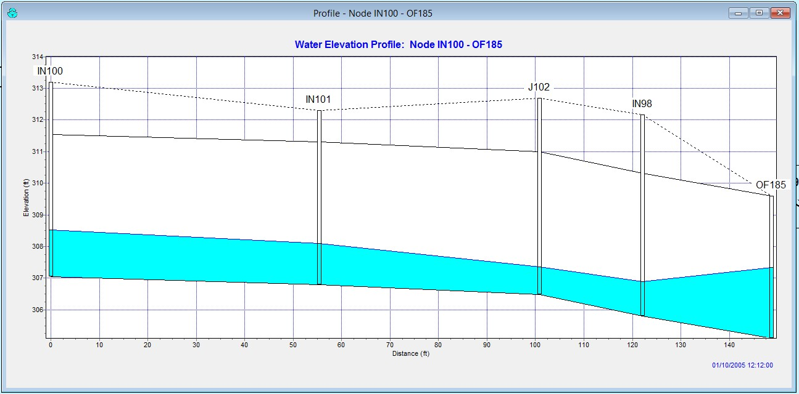
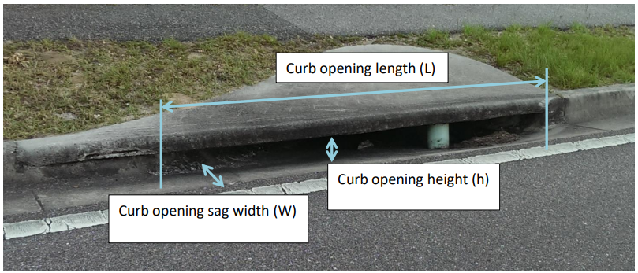

.. vim: syntax=rst

Chapter 2
==========

FLO-2D Storm Drain Features
------------------------------

Overview of Inlets and Outfalls
^^^^^^^^^^^^^^^^^^^^^^^^^^^^^^^^

FLO-2D storm drain component exchanges discharge between the surface water and the closed conduit system through a series of objects that are
representations of the physical components in a storm drain system, primarily inlets and outfalls.
The flow exchange can occur bi-directionally capturing surface water runoff when the conduits have capacity and returning flow to the surface water
when the pipe system capacity is exceeded.
The storm drain system is represented by links and nodes where the links are the closed conduits and nodes are junctions and outfalls as shown in
Figure 24.

*Figure 24.
Surface and Closed Conduit Flow Exchange.*

Nodes represent several features of a storm drain system.
One type of node is the inlet which constitutes an inflow point to the pipe system from the surface water.
A junction can represent the connection between two pipes with a change of slope or geometry, in this case the junction is not an inlet because it is
not connected to the surface water system.
The water surface elevation is determined at each junction for each computational timestep based on the junction geometry and the flow hydraulics.
Figure 25 is a profile of closed conduit system with three inlets, one junction and one outfall.
The figure displays a peak water surface elevation for the 10 year return period storm.

*Figure 25.
Profile of Typical Closed Conduit System*

Inlets are nodes that collect surface water from the FLO-2D grid element.
Only one inlet can be assigned to one FLO-2D grid cell.
Storm drain inlets are depicted by the QGIS and GDS as blue in Figure 26 and Figure 27.

*Figure 26.
Storm Drain System Represented in the GDS Graphic Display.
Inlets are blue and junctions are green.*

.. image:: img/Chapter2/Chapte003.jpg

*Figure 27.
Storm Drain System Represented in the QGIS Graphic Display.
Inlets are blue and outfalls are green.*

Outfalls are nodes located at the terminus of a pipe network and discharge flow out the storm drain system.
A variety of outfall boundary conditions can be assigned including a fixed stage elevation, critical or normal flow depth, tidal stages, tide gates,
timed controlled gates and time varying stage.
The outfall can have return discharge to the FLO-2D surface water in channel, street or floodplains elements.
If the outfall discharges to a channel element, the downstream boundary is the channel water depth.
If the outfall discharge is returned to the surface water, the water surface is the downstream boundary condition with an assigned “free” condition.
An outfall to a retention basin is shown in Figure 28.
The boundary condition for this outfall would vary with the basin water surface.
In Figure 29 the pipe outfall discharges into a channel and may have a potential backwater condition.

.. image:: img/Chapter2/Chapte004.jpg

*Figure 28.
Outfall Discharge Retention Basin*

.. image:: img/Chapter2/Chapte018.png

*Figure 29.
GDS Image of Storm Drain System with Outfall OF185 Discharging to a Channel*

Storm Drain Inlets
~~~~~~~~~~~~~~~~~~~

FLO-2D can simulate 5 types of inlet geometries.
Three of them are based on the Hydraulic Design Series No.
4 (HDS4) (Johnson and Fred, 1984).
Inlets are designated as one of four types: (1) curb-opening inlets, (2) grate inlets, (3) slotted drains and (4) combination inlets.
For curb and grate inlets, the inlet geometry is assigned, and the discharge is computed using either weir or orifice equations when there is
available storm drain capacity.
For slotted drains, combination inlets and other non-typical inlets, a rating table must be generated with discharge as a function of headwater depth
(Figure 30 and Figure 31).

.. image:: img/Chapter2/Chapte005.jpg

*Figure 30.
Combination Curb Opening Inlet with Sag and a Grate*

.. image:: img/Chapter2/Chapte006.jpg

*Figure 31.
Combination of a Curb Opening at Grade with a Grate*

The manhole is a special inlet type that represents a service access point to the storm drain system.
Manholes are modeled as inlets with an additional surcharge depth that represents the equivalent pressure required to displace the cover.
When the surcharge depth is exceeded, the manhole is popped, and the manhole behaves as an inlet type 3.

Inlet Types
~~~~~~~~~~~~~

*Type 1 - Curb Opening Inlet at Grade*

The following are the input parameters for a Type 1 inlet (Figure 32):

    - Weir coefficient: 2.85 - 3.30 (suggested 3.00 English, 1.6 metric)
    - Curb opening length (L)
    - Curb opening height (h)

.. image:: img/Chapter2/Chapte019.png

*Figure 32.
Curb Opening at Grade (Type 1 inlet)*

The discharge is based on the flow depth in the FLO-2D grid cell and the inlet geometry:

    - The inlet opening height (h), referred to as “Height” column 7 of the SWMMFLO.DAT.
    - The inlet opening length (L) specified as “Length”, column 5 of the SWMMFLO.DAT.

The discharge is calculated using the weir and orifice equations as follows:

    1. If h ≤ H < 1.4h, then:

        If Q\ :sub:`w` ≤ Q\ :sub:`o`, discharge= Q\ :sub:`w` Weir Equation Controls

        If Q\ :sub:`w` > Q\ :sub:`o`, discharge= Q\ :sub:`o` Orifice Equation Controls

    2. If H < h, discharge= Q\ :sub:`w`

    3. If H ≥ 1.4h, discharge= Q\ :sub:`o`

*Type 2 - Curb Opening Inlet with Sag*

The following are the input parameters for a Type 2 inlet (Figure 33):

    - Weir coefficient: 2.30 (1.25 metric)
    - Curb opening length (L)
    - Curb opening height (h)
    - Curb opening sag width (W)

*Figure 33.
Curb Opening with Sag (Type 2 Inlet, Johnson and Fred, 1984)*

Conservatively, the weir or orifice discharge, whichever is smaller, is used for the curb opening with sag.
The inlet elevation is assumed to be equivalent to the grid element elevation.
For weir flow (Johnson and Fred, 1984):

.. math::
    :label:

    Q_w = C(L + 1.8W)H^m

where:

   Q\ :sub:`w` = weir flow rate at depth H

   C = weir coefficient, ‘Inlet Weir Coefficient.’ field in SWMMFLO.DAT L = curb opening length, ‘Length’ field in SWMMFLO.DAT.

   W = curb opening sag width, ‘Width’ field in SWMMFLO.DAT.

   H = FLO-2D inlet element flow depth m = 1.5 exponent for an horizontal weir (hardcoded)

Orifice flow can have two potential sag inlet conditions (Johnson and Fred, 1984):

    If :math:`h \geq H`, then:

    .. math::
       :label:

       Q_{o} = C_{d}A\sqrt{2gH}

    If :math:`h < H`, then:

    .. math::
       :label:

       Q_{o} = C_{d}A\sqrt{2g\left( H - \frac{h}{2} \right)}

    where:

           Q\ :sub:`o` = orifice flow rate at depth H

           C\ :sub:`d` = discharge coefficient hardcoded to 0.67

           A = orifice area Area= L x h g = gravitational acceleration

           H = FLO-2D grid element water depth that contains the inlet structure.

           h = curb opening height of the orifice.

Type 2 inlet discharge is determined from the following criteria:

   If h ≤ H < 1.4h, then:

    If Q\ :sub:`w` ≤ Q\ :sub:`o`, discharge= Q\ :sub:`w`

    If Q\ :sub:`w` > Q\ :sub:`o`, discharge= Q\ :sub:`o`

       If H < h, discharge= Q\ :sub:`w`

       If H ≥ 1.4h, discharge= Q\ :sub:`o`

*Type 3 - Grate (Gutter) Inlet with/without Sag*

The following are the input parameters for a Type 3 inlet (Figure 34):

    - Weir coefficient: 2.85 - 3.30 (suggested 3.00 English, 1.6 metric)
    - Grate perimeter (not including curb side)
    - Grate open area
    - Grate sag height (zero for at grade)

.. note:: Orifice flow coefficient = 0.67 (hardcoded) for all cases.

.. image:: img/Chapter2/Chapte008.jpg

*Figure 34.
Grate Inlet in a Street (Type 3 Inlet, Johnson and Fred, 1984)*

The smaller of two discharges (weir or orifice) calculated for a grate (gutter) inlet with/without sag is applied for the inlet discharge computation
(Johnson and Fred, 1984):

*Weir Flow:*

If :math:`H \leq h`, then:

.. math::
   :label:

   Q_w = CPH^m

If :math:`H > h`, then:

.. math::
   :label:

   Q_w = CP\left( H + \frac{h}{2} \right)^m

where:

    Q\ :sub:`w` = weir flow rate at depth H

    C  = weir coefficient, ‘Inlet Weir Coeff.’ field in SWMMFLO.DAT

    P  = Grate perimeter ‘Perimeter’ field in SWMMFLO.DAT

    H  = FLO-2D inlet element flow depth

    m  = 1.5 horizontal weir exponent (hardcoded).

    h = sag height from the ‘Sag Height’ field of SWMMFLO.DAT.

Orifice Flow:
^^^^^^^^^^^^^

If :math:`H \leq h`, then:

    .. math::
       :label:

       Q_o = \ C_dA\sqrt{2gH}

If :math:`H > h`, then:

    .. math::
       :label:

       Q_{o} = \ C_{d}A\sqrt{2g\left( H + \frac{h}{2} \right)}

    where:

        :math:`Q_{o}` = orifice discharge at depth H

        C\ :sub:`d` = discharge coefficient (hardcoded to 0.67)

        A = orifice area ‘Area’ field in SWMMFLO.DAT

        g = gravitational acceleration

        H = FLO-2D inlet element flow depth

        h = sag height from the ‘Sag Height’ field of SWMMFLO.DAT.

The discharge is determined using the following criteria for Type 3:

   If :math:`0.75 \leq H < 1.8`, then:

        If :math:`Q_{w} \leq Q_{o}`, discharge= :math:`Q_{w}`

        If :math:`Q_{w} > Q_{o}`, discharge= :math:`Q_{o}`

   If :math:`H < 0.75`, discharge= :math:`Q_{w}`

   If :math:`H \geq 1.8`, discharge= :math:`Q_{o}`

*Type 4 – Unique Inlet with Stage-Discharge Rating Table*

Inlets that cannot be represented by Types 1, 2 or 3 can have an inflow discharge defined by a rating table.
Some storm drain inlets may include entrance types similar to that of a culvert with a vertical opening (Figure 35.).
In this case the rim elevation would be ignored as the flows are exchanged based on the invert elevation.

.. image:: img/Chapter2/Chapte010.jpg

*Figure 35.
Storm Drain Vertical Inlet with a Culvert Entrance*

The following are the input parameters for a Type 4 inlet that are entered in the SWMMFLORT.DAT file:

Stage (depth) above inlet (ft or m) Discharge (cfs or cms)

.. note:: The stage-discharge data is assigned in pairs with the first pair being: 0.0.

*Type 5 – Manhole*

Manholes are a special case of inlets.
Storm drains under high pressure during flooding can result in the manhole covers being popped off (Figure 36.
and Figure 37).
The FLO-2D storm drain component can simulate covers popping through the application of a surcharge depth.
Once the manhole cover has been popped, it remains off and the manhole becomes a Type 3 inlet.

.. image:: img/Chapter2/Chapte011.jpg

*Figure 36.
Popped Manhole Cover (source: istock)*

The required manhole input parameters are:

    - Weir coefficient: 2.85 - 3.30 (suggested 3.00 English, 1.6 metric).
    - Manhole perimeter (manhole cover shapes can vary).
    - Manhole flow area (ft\ :sup:`2` or m\ :sup:`2`).
    - Surcharge depth (ft or m).

A manhole is assumed to be level without sag and column 7 in the SWMMFLO.DAT is used to define the surcharge depth (ft or m).
The surcharge depth can be estimated by the user as the equivalent depth that the pressure has to overcome to pop the cover.
The pressure force must exceed the manhole cover weight represented as the equivalent weight of the volume of water that is above the manhole rim
elevation.
Manhole covers are typically circular but can be found in other shapes.

The water depth (head) that represents the manhole cover weight can be estimated by:

    .. math::
       :label:

       d_{s} = \frac{w_{m}}{A_{m}\gamma_{w}}

    where:

        d\ :sub:`s` = surcharge depth that pops the manhole cover

        w\ :sub:`m` = weight of the manhole cover

        A\ :sub:`m` = area of the circular manhole opening (πD\ :sup:`2`/4)

        γ\ :sub:`w` = clear water density 62.4 lb/ft\ :sup:`3` (1000 kg/m\ :sup:`3`)

.. image:: img/Chapter2/Chapte012.jpg

*Figure 37.
Popped Manhole Cover with Pressure Head (Source: istock)*

To calculate the surcharge depth for manhole cover shown in Figure 36.
, the observed head of water is approximately 1.0 feet (0.3 meter).
The manhole cover weight and diameter must be known.
Assuming a diameter of 2 ft (0.61 m) and a weight of 100 pounds, what surcharge depth d\ :sub:`s` had to be exceeded to pop the cover?

Solution:

   :math:`w_{m}` = 100 lb (45.4 kg)

   :math:`A_{m}` = (:math:`\frac{\pi(2ft)^{2}}{4}`) = 3.14 ft\ :sup:`2` (0.29 m\ :sup:`2`)

   :math:`d_{s} = \frac{w_{m}}{A_{m}\gamma_{w}}` = :math:`\frac{100lb}{3.14\ {ft}^{2}\ 62.4\ lb/ft3}` ≈ :math:`\frac{45.4\ kg}{0.29\ m^{2}\ 1000\ kg/m3}\
   ` ≈ 0.5 ft (0.16 m)

Table 4 presents some suggested surcharge depths.

   **Table 4.
   Manhole Cover Surcharge Depths**

.. list-table::
   :widths: 50 50
   :header-rows: 0

   * - **Manhole Cover Representative Weight**
     - **Surcharge Depth (ft)  (assuming 2 ft diameter)**

   * - 85 to 300 lb manhole cover unbolted
     - 0.4 to 1.5

   * - 100 lb to 150 lb rubber cover with plastic bolts
     - 0.5 to 0.75

   * - 2,400 lb parked car with one wheel on coverunbolted (~600 lb + 300 lb)
     - 4.6 or greater

   * - 5,000 lb steel bolted manhole cover (est.)
     - 25.5 or greater

Storm Drain Outfalls
''''''''''''''''''''

A variety of outfall conditions are available.
For the outfall to discharge back to the surface water, the boundary condition must be set to ‘free’ in the the WMM.inp file and the ‘allow discharge’
switch set ON in the SWMMOUTF.DAT file.
Flow into the outfall can occur based on the water surface elevation but may be restricted by a tide gate assignment.
Normal, fixed, tidal or time series type of SWMM outfalls will discharge the flow off the storm drain system.
In Figure 38, the outfall has a free flow condition but when the river is high, the outfall may be submerged.
The location and elevation of the outfall can be assigned in the QGIS.

.. image:: img/Chapter2/Chapte013.jpg

*Figure 38.
Storm Drain Free Outfall Condition (source: istock)*

During the simulation FLO-2D compares the downstream water surface elevations with the storm drain pressure head to control the flow in or out of the
outlet.
This may result in backwater pressure on the pipe network.
In the case of ponded flow as in detention or retention basins, the outfall might be submerged but still have sufficient pressure to discharge out of
the storm drain network (Figure 39).
When the retention basin water surface is high enough, water can enter the outfall and flow upstream in the pipe.

.. image:: img/Chapter2/Chapte014.jpg

*Figure 39.
Outfall Discharging into a Retention Basin*

The discharge at the outfall is controlled as follows:

   If storm drain pressure head > WSE, then outfall discharges to the surface water cell

   If storm drain pressure head < WSE, then there is no outfall discharge and the outfall node depth = WSE – outfall invert elevation.

Tide gates can be assigned in the SWMM.inp file to stop the flow from going into the storm drain system through the outfall.
Flow could leave the storm drain system but not enter it.

Storm drain outfalls should be assigned to the channel left bank element to discharge to the channel.
If the outfall coordinates in the SWMM.inp file are the left bank channel element coordinates then the GDS will automatically assign the outfall node
to the left bank element.
The SWMMOUTF.OUT file can be reviewed to ensure that the outfall is correctly paired to the left bank element.
If the coordinates in the SWMM.inp are not the left channel element coordinates, then the grid element number in the SWMMOUTF.DAT can be replaced with
channel left bank element number (Figure 40).
The outfall coordinates in the SWMM.inp file do not need to be modified since they will not affect the storm drain results calculations.

Typically, the outfall invert elevation would be assigned to the channel element thalweg elevation.
Assignment of the outfall to the right bank elevation, or channel interior elements would generate an error message.
If the outfall invert elevation is lower than the thalweg elevation (underground), then the storm drain would be assumed to be underwater with an
initial tailwater depth.

If the outfall invert elevation is lower than the thalweg or floodplain elevation (underground outfall) but the switch OUTF_FLO2DVOL in the
SWMMOUTF.DAT is equal to 2 instead of 1,then the storm drain outfall would be connected to the surface layer but no initial underwater tailwater depth
condition is imposed, and the outfall discharge to the surface based on the comparison between PH with the FLO-2D water Surface Elevation.
Outfall is assumed to be located at ground elevation.

.. image:: img/Chapter2/Chapte015.jpg

*Figure 40.
Outfall Location with Respect the Channel Left Bank Elements.*

Elevations and Datum
''''''''''''''''''''

The elevation and location of the inlets and outfalls are required to exchange flow with the surface water.
The floodplain water surface elevation is compared to the storm drain pressure head based on a common reference such as the inlet rim elevation, inlet
invert elevation (Vertical Type 4 Inlets) or the outfall invert elevation.
It is possible that the elevations of the closed conduit system may have a different datum than that applied to the FLO-2D surface topography.
The elevation of each inlet rim and outfall invert should be reviewed especially for unique conditions such as combination inlets (Figure 41).

.. image:: img/Chapter2/Chapte016.jpg

*Figure 41.
Diagram of a Combination Inlet Rim Elevation.*

For curb opening inlets at grade (Type 1), curb opening inlets with sag (Type 2), grates with or without sag (Type 3) and manholes (Type 5), the
FLO-2D model computes the rim elevation at the node by adding the maximum depth in the SWMM.inp file to the invert elevation.
The model compares the rim elevation with the grid element elevation and reports the differences in the FPRIMELEV.OUT.
If the rim elevation and floodplain elevations are different, the model reassigns the floodplain elevation to the rim elevation based on the
assumption that the rim elevation was surveyed and the grid element elevation was interpolated.
The model uses the rim elevation as the reference to determine the water surface elevation and inlet flow depth.

A Type 4 inlet with a defined rating table can represent any inlet not defined by Types 1 thru 3.

The rating table reference elevation must correlate with the inlet rim or invert elevation.
If the Type 4 inlet is a horizontal inlet (feature = 0 in the SWMMFLO.DAT file), then the floodplain elevation is automatically reset to the rim
elevation.
Typically, inlets have horizontal inlets, but some inlets such as culverts have vertical openings.
For vertical inlets, the water surface elevations are compared at the node, but the rim elevation is ignored.
Vertical inlets have some unique constraints:

    1. For an inlet on a channel (channel flow is discharging to the storm drain pipe), the invert elevation should be set to the channel bed elevation.
       If the Type 4 inlet is a vertical inlet and it is located in a channel cell, the ‘Feature’ column has to be equal to 1 in the SWMMFLO.DAT file and the
       floodplain elevation is not modified.

    2. For a floodplain swale where the flow is discharging to a storm drain pipe or culvert, the floodplain grid element elevation should match the pipe
       invert elevation.
       If the Type 4 inlet is a vertical inlet and it is located in a floodplain cell, the ‘Feature’ column has to be equal to 1 in the SWMMFLO.DAT file and
       the floodplain elevation equal to the pipe invert elevation otherwise the floodplain elevation is modified at runtime.

    3. The ‘Feature’ column in the GDS inlet dialog window has three options:

       1. - default, no flapgate, no vertical inlet opening

       2. - vertical inlet opening

          a. Channel pipe inlet invert elevation = channel bed elevation

          b. Floodplain grid element elevation = pipe invert elevation 2 - flapgate (outfall)

    4. Revised floodplain elevations are not changed in the FPLAIN.DAT file.
       These modifications are only implemented at runtime.
       For permanent floodplain revisions, the user must adjust the elevations in FPLAIN.DAT to match the modifications in FPRIMELEV.OUT.
       Rim elevations for the inlets located in channel or street cells are not checked and must be verified by the user.

    5. Unique inlet conditions such as those with unusual shape openings are simulated with a rating table.

All runtime changes in the floodplain elevation are reported in FPRIMELEV.OUT and Stormdrain_error.chk files.
They are reported to the FPLAIN_SDElev.RGH and TOPO_SDElev.RGH TOPO_SDElev.RGH files and the FPLAIN.DAT AND TOPO.DAT files can be replaced by renaming the \*.RGH files to apply the storm drain
elevation adjustments to the next simulation.

Conduit Offsets
'''''''''''''''

The swmm.inp file uses offset heights to connect the conduits to the nodes.
The inlet and outlet offsets can be zero if there is no offset or any height above zero to set the offset.

.. image:: img/Chapter2/Chapte017.png

*Figure 42.
Offsets in a Pipe System.
Blue rectangles are the nodes that connect pipes.*

Pipe 1 and pipe 2 show the offsets in the pipe system.
Pipe 3 shows no offset in Figure 42.
An inlet offset and an outlet offset can be defined at each pipe in the SWMM.INP data file.
An offset is the depth of conduit invert above node invert at inlet begin or start.