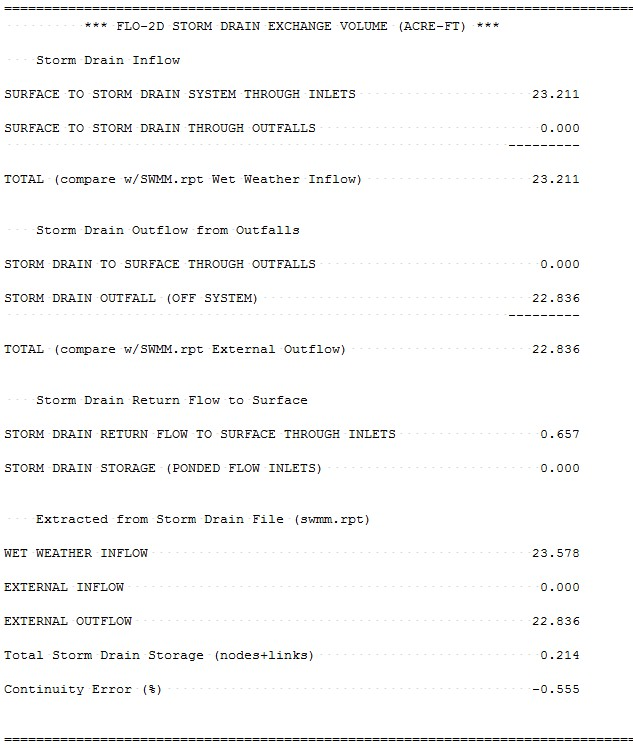
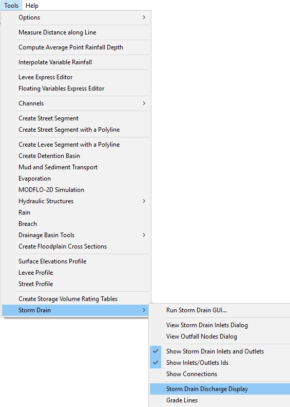
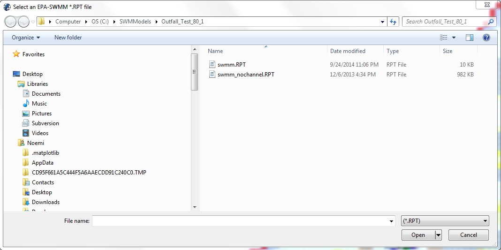
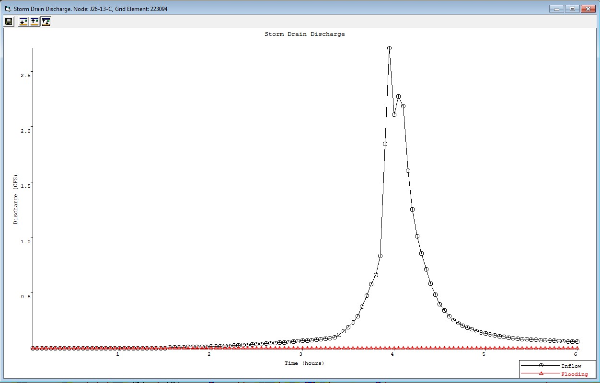
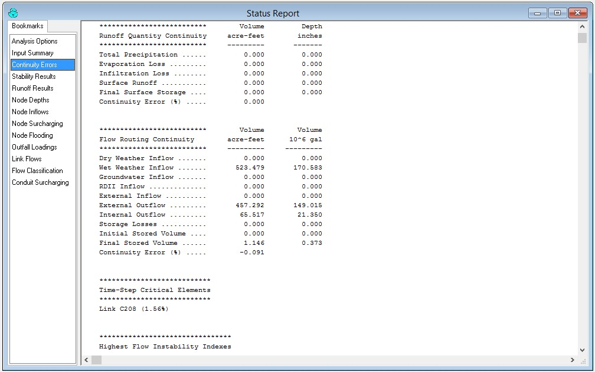
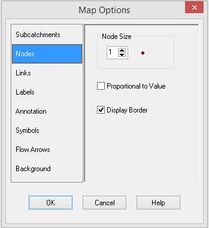
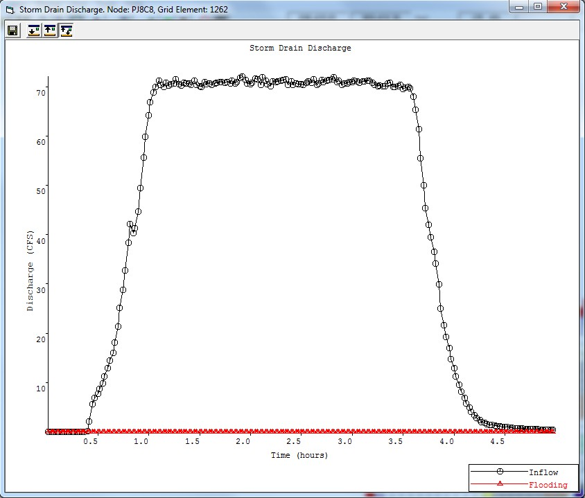
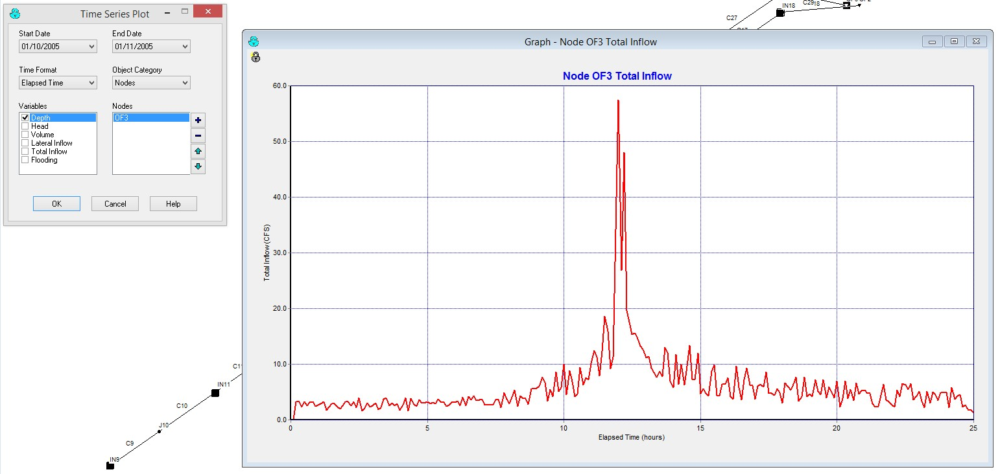

.. vim: syntax=rst

Chapter 6
==============

Reviewing Storm Drain Model Results
^^^^^^^^^^^^^^^^^^^^^^^^^^^^^^^^^^^

Introduction
''''''''''''

After a FLO-2D storm drain model is complete, the results can be reviewed with both the FLO2D GDS program and the SWMM GUI.
The GDS displays the storm drain inflow and return flow hydrographs, the water surface head on the storm drain inlet and outlet, and the hydraulic and
energy grade lines of the storm drain system.
The GDS can be used to import the shapefiles for surface water velocity results, surface water flow depths and channel results from a given simulation
generated in Mapper Pro or Mapper ++.
The GDS creates the storm drain inflow discharges without loading the FLO-2D project, go to Tools \| Storm Drain \| Storm Drain Discharge Display \|
from external .RPT.
The GDS load the results from the selected \*.RPT files and creates the Storm Drain Discharge plot for all Storm Drain Features in the system.
The plots are saved to a subfolder (StormDrainDischarge MM-DD-YYYY) in the project folder.
With the SWMM GUI the user can access the results from the various storm drain objects.
A FLO-2D storm drain simulation will generate the following files in Table 19.

*Table 19.
FLO-2D Storm Drain Simulation Files**

.. list-table::
   :widths: 50 50
   :header-rows: 0

   * - **Input Files**
     - **Output Files**

   * - SWMM.ini
     - SWMM.RPT

   * - SWMM.rain
     - SWMM.OUT

   * - SWMM.inp
     - SWMMOUTFIN.OUT

   * - SWMMFLO.DAT
     - SWMMQIN.OUT

   * - SWMMFLORT.DAT
     - FPRIMELEV.OUT

   * - SWMMOUTF.DAT
     - SD ManholePopUp.OUT/ ManholePop.OUT

   * -
     - UndergOUTFALLS.CHK

   * -
     - STORMDRAIN_ERROR.CHK

Viewing Results in the GDS
''''''''''''''''''''''''''

FLO-2D provides a variety of post-processing tools that include Mapper, PROFILES, HYDROG,

MAXPLOT, and QGIS plug-in programs like crayfish.
The Mapper Pro and Mapper ++ read FLO-

2D output and generate grid element plots, contours, shaded contours and shapefiles.
The shapefiles can be imported to a GIS environment.
These GIS tools complement the GDS capabilities of displaying FLO-2D output.
The GDS has the ability to customize different GIS layer views.
The Crayfish plugin provide functionalities to plot graphs using the FLO-2D maximum results and temporal results in QGIS including animations.
Crayfish plugin can be installed from the QGIS plugin repository A possible approach to reviewing a storm drain simulation is outlined.

Step 1.
Review the SUMMARY.OUT File

After a FLO-2D simulation is completed, the SUMMARY.OUT file can be reviewed with an ASCII text editor program.
A FLO-2D model has been successfully completed if the termination time and date is reported at the end of the SUMMARY.OUT:

.. image:: img/Chapter6/Chapte002.jpg

Volume exchange and conservation between the surface water and storm drain is reported in the SUMMARY.OUT file as shown below.

*Storm Drain Inflow:* Reports the volume that represents inflow to the storm drain through the inlets and outfalls.

*Storm Drain Outflow from Outfalls:* Total volume of outfalls that discharge to the FLO-2D surface water and off the system.

*Storm Drain Return Flow to Surface:* Return flow to the surface water through the inlets as pressure flow.

Step 2.
View the Surface Water Data and Results in the GDS

Open the GDS and load the project as shown in Figure 58.
The components displayed in this image are the building area reduction factors (ARF-values) and the storm drain features.
The storm drain features and parameters can be edited in the GDS while viewing the project (see the GDS manual).
Alternatively, the project could be opened in the FLO-2D QGIS plug-in.

.. image:: img/Chapter6/Chapte021.jpg

*Figure 58
Typical GDS Storm Drain Project*

Step 3.
Import Shapefiles from Mapper (Optional)

If the output data was plotted in Mapper, the automatically generated shapefiles can be imported into the GDS or QGIS plug-in.
The FLO-2D model maximum depths and velocities and other output can be imported as shapefiles to view the flooding with the various model components
including the storm drain.
The layer properties for each shapefile can be modified in the layers menu.
A 10-year return period area of inundation is shown in Figure 59.
The flooding is shown in the streets and is being captured by the storm drain system.

.. image:: img/Chapter6/Chapte004.jpg

*Figure 59.
Maximum Flow Depth Shapefile in the GDS with Storm Drain Components*

Step 4.
Display the Storm Drain Results in the GDS

The GDS can display the storm drain inlet discharge hydrograph including the return flow (pressure flow) to the surface water.
GDS will plot the water surface head on the storm drain inlet and outlet and the hydraulic and energy grade lines.
Click Tools \| Storm Drain \| Storm Drain Discharge Display (Figure 60) to view results plots.

*Figure 60.
Storm Drain Display Menu Options*

Select the SWMM.RPT output file from the project folder to display results (Figure 61), then click on the individual inlet/junction to generate the
plots.

*Figure 61.
Dialog to select the SWMM.RPT Output File*

Figure 62 to Figure 65 displays an inlet hydrograph, return flow, water surface head and energy grade line as displayed by the GDS.

*Figure 62.
Display of Storm Drain Node Inflow Discharge*

.. image:: img/Chapter6/Chapte008.jpg

*Figure 63.
Display of Storm Drain Inflow and Return Flow Hydrograph*

.. image:: img/Chapter6/Chapte009.jpg

*Figure 64.
Display of Water Surface Head on the Storm Drain Inlet*

.. image:: img/Chapter6/Chapte010.jpg

*Figure 65.
Display of the Energy Grade Line on a Storm Drain Conduit*

Viewing the Storm Drain Output in the SWMM GUI
''''''''''''''''''''''''''''''''''''''''''''''

The SWMM GUI creates the storm drain data input files and graphically displays the results.
A FLO-2D storm drain simulation will generate output files that are compatible with the SWMM GUI.
To view the output, first make sure that the following files are present in the project folder:

    - SWMM.ini
    - SWMM.inp
    - SWMM.rain
    - SWMM.RPT
    - SWMM.OUT

The SWMM.RPT file reports the storm drain output data in ASCII format and can be read with any ASCII editor.
The SWMM.OUT file is a binary output file with results reported temporally and spatially that can be read by the SWMM GUI.

SWMM.ini

The storm drain results are not automatically loaded into the SWMM GUI.
To load the results, navigate to the project folder directory and open the SWMM.ini file using an ASCII text editor.
The user needs to set ‘Saved = 1” and “Current = 1” as highlighted in Figure 66.

.. image:: img/Chapter6/Chapte011.jpg

*Figure 66.
SWMM.ini File with Required Data to View the Results in the SWMM GUI*

View the Storm Drain Results

Open the SWMM GUI and navigate to the project folder.
Open the SWMM.inp file from the File|Open menu.
This will access the model output and enable the GUI to display the results as shown in Figure 67.
The SWMM GUI has controls to label and color code the results in a variety of configurations.

.. image:: img/Chapter6/Chapte012.jpg

*Figure 67.
Example Storm Drain Model in the SWMM GUI*

The SWMM GUI has some tools that can assist in the review of the storm drain output.
The SWMM manual should be used referenced when using the SWMM GUI.
The GUI environment is shown in Figure 68 consisting of a main menu, tool bars, study area, and working area.
These attributes and some of the options are explained briefly.

File Menu

    **Open:** Opens an existing project

    **Reopen:** Opens recently used projects

    **Save:** Saves the current project

   **Save As:** Saves the project under a different name

.. image:: img/Chapter6/Chapte022.jpg

*Figure 68.
SWMM GUI Environment*

Edit Menu

    **Select Object:** Select an object on the map

    **Find Object:** Locates a specific object by name in the map

    **Find Text:** Locates specific text in a status report

    **Group Edit:** Edits a property for the group of objects within selected region

View Menu

    **Dimensions:** Sets reference coordinates and distance units for a study area

    **Backdrop:** Allows a background image to be added, positioned and viewed.

    **Query:** Highlights objects that meet specific criteria

    **Objects:** Toggles display of classes of objects

    **Legends:** Controls display of the map legends **Toolbars:** Toggles display of tool bars

Project Menu

    **Defaults:** Edits a project’s default properties

Report Menu

   **Status:** Displays a status report for the last simulation.

The Bookmark feature enables quick review of the SWMM.RPT file sections (Figure 69).

*Figure 69.
Bookmark Interface that Facilitates a Review the SWMM.RPT File*

    **Graph:** Command that displays simulation results in graphical form (Figure 70.
    Graph: Time Series).

.. image:: img/Chapter6/Chapte014.jpg

*Figure 70.
Graph: Time Series**

    **Table:** Displays simulation results in tabular form\ **.**

Tools Menu – Commands that Provide Control Detail

    **Program Preferences:** Sets program preferences, such as font sizes, deletions, number of decimal places displayed, etc.

    **Map Control Display Options:** Sets appearance options for the Map, such as object size, annotation, flow direction arrows, and background colors
    (Figure 71).

*Figure 71.
Map Options*

Help Menu

    **Help Topics:** Displays the Help system’s Table of Contents

    **How Do I:** Displays a list of the most common operations

    **Tutorial:** Presents a short tutorial introducing the user to the EPA SWMM

Study Area Map

    This map is a working environment with of storm drain system.

Toolbars

    Provide shortcuts to common operations and includes the standard toolbar.

Map Toolbar and Object Toolbar

    Data/map browser provides access to all the data objects in a project and controls the mapping themes and time periods viewed on the study area map.

Status Bar

   **Auto-length**: Indicates whether the automatic computation of conduit lengths.
   It is recommended that the auto-length be turn ‘off” if the data is imported from a GIS database.

   **Offsets**: Indicate whether the positions of links above the invert of their connecting nodes are expressed as depth above the invert or as an
   offset elevation.
   The FLO-2D component is configured for the depth.

   **Flow units**: English or metric.
   The previously entered data is not automatically adjusted for the unit system if the system is changed.

    **Zoom level:** Zoom level percentage.

    **XY location**: Mouse cursor coordinates.

Data Browser

The data browser has three sections (Figure 72).

    - A tree box that lists all the storm drain categories of data objects;
    - Edit buttons;
    - A list of individual objects in the selected category.

.. image:: img/Chapter6/Chapte024.jpg

*Figure 72.
SWMM GUI Data Browser Panel*

Map Browser

The map browser consists of three panels that control the results display (Figure 73).

    - Themes Panel selects variables according to color on the map.
    - Time Period Panel indicates a specific output interval to display results on the map.
    - Animator Panel controls the animation of the temporal output and profile plots.

.. image:: img/Chapter6/Chapte025.jpg

*Figure 73.
Map Browser, Time Output Interval to View Results and Animator Controls*

Output Display
''''''''''''''

There are a number of options to analyze the output files with the GDS and the SWMM GUI.
The following figures show a few of the options to display the results.
Figure 74 shows the inlet discharge computed by FLO-2D.
This figure is plotted in the GDS and shows the exchanged flow between the surface water and the storm drain system.
The plot represents the volume that is returned from the storm drain system to the surface water under pressure.
This occurs when the there is no more capacity in the system.

*Figure 74.
Storm Drain Discharge Reported in SWMMQIN.OUT (Plotted in the GDS)*

Figure 75 shows the time series of an outfall depth.
Other variables are plotted as a time series by the SWMM GUI.
Outfall discharge may be computer as flow off the storm drain system or as return flow to the FLO-2D surface water.

*Figure 75.
Time Series Plots of Depth, Head, Inflow and Return Flow in the SWMM GUI.*

Figure 76.
displays the flow in a series of connected pipes.
A number of hydrographs from various locations in the storm drain can be plotted on a single graph.
Combined hydrograph plots are helpful to determine the volume distribution and to review the timing of the flood wave progression throughout the storm
drain system.

.. image:: img/Chapter6/Chapte018.jpg

*Figure 76.
Hydrographs for Each Link in the Storm Drain System*

The conduit flow depth profile at the peak discharge is shown in Figure 77.
This profile can be animated using the map panel options.
This tool will display the flow progression through the pipe system.

.. image:: img/Chapter6/Chapte019.jpg

*Figure 77.
A Conduit Depth Profile*

The storm drain system results can be colored and animated with the mapper tools.
The SWMM.RPT file can be reviewed using the status report command in the report menu.
The use of colors and labels enables a dynamic visual display of the flow distribution (Figure 78).

.. image:: img/Chapter6/Chapte020.jpg

*Figure 78.
The Display of the Storm Drain System with the Map Settings*
