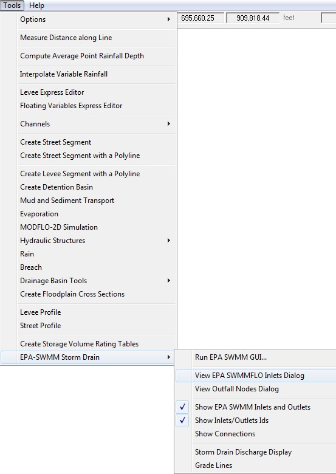
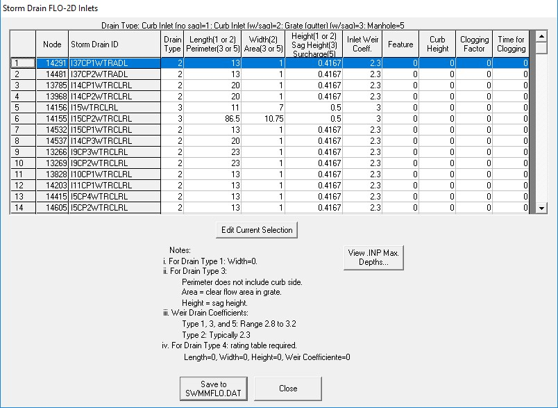
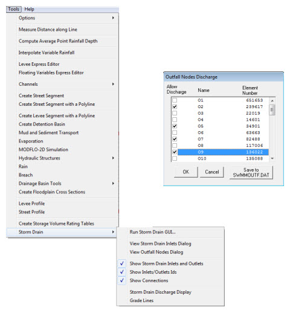

.. vim: syntax=rst

Chapter 7
==========

Porting a SWMM Model to the FLO-2D Storm Drain System
^^^^^^^^^^^^^^^^^^^^^^^^^^^^^^^^^^^^^^^^^^^^^^^^^^^^^

Introduction
''''''''''''

This chapter describes the porting procedure to modify and adapt the input data for a ‘standalone’ EPA SWMM Version 5.0.022 to the FLO-2D Pro storm
drain model.
The SWMM engine has been modified and integrated into the FLO-2D Pro model.
The FLO-2D storm drain model is a distinctly new model that is superior to the original EPA SWMM model.
The following data file revisions are required to convert an existing ‘stand-alone’ SWMM model to a FLO-2D storm drain model.

Porting SWMM Data Files to a FLO-2D Storm Drain Model
'''''''''''''''''''''''''''''''''''''''''''''''''''''

The modifications that have to be made to the SWMM.inp file are discussed.

Rain gages

Rain gages are not required in the FLO-2D Storm Drain Model.

Subcatchments

Subcatchments are not required in the FLO-2D Storm Drain Model.

Inlets

For junctions to function as inlets they must have an ID that starts with ‘I’.
The required data for inlets are (Figure 79):

    - Name (field): Starts with the character ‘I’.
    - X-coordinate and Y-coordinate: It is required to have a spatial reference to pair FLO-2D and the ‘stand-alone’ SWMM system.
    - Invert Elevation and Maximum Depth (fields):

      - The invert elevation and maximum depth can be edited manually in the SWMM GUI or in the QGIS plug-in.
        Open the FLO-2D surface model in QGIS, go to the Storm Drain Editor and Import SWMM.inp file, then add the data.
        o The maximum depth and the invert elevation are used to determine the rim elevation.
      - The rim elevation is compared with the FLO-2D grid element elevations.
        o These comparisons are listed in the FPRIMELEV.OUT file.
        o Ideally the elevations in the \*.inp file should match those of the grid system.

.. image:: img/Chapter7/Chapte006.jpg

*Figure 79.
SWMM GUI Junction Dialog Box Showing the Required Data*

Outfalls

Outfalls are terminal nodes in the drainage system used to define final downstream boundaries.
Only a single link can be connected to an outfall node.
The required data includes (Figure 80):

    - Name (field)
    - X- and Y-coordinate: It is required to have a spatial reference to pair FLO-2D and the ‘stand-alone’ SWMM system.
    - Invert Elevation:

      - An outfall that returns flows to a channel has to be assigned to the left bank.
      - An option to have an underground (underwater representing ponded flow) outfall was added in the FLO-2D storm drain.
        o This elevation can be lower than the grid element and is not reported in the FPRIMELEV.OUT file.

    - The outfall can discharge off the model.
    - Outfall Type (Figure 80):

      - Set to ‘FREE’ to exchange flow with the FLO-2D surface water system.
        o Other types such as NORMAL, FIXED, TIDAL or TIME SERIES can be assigned but the flows will not be exchanged with the surface water but will debouch
        the flow off the storm drain system.

    - Tide gate: Set to ‘NO’ for the outfalls to exchange flows with the surface water.

.. image:: img/Chapter7/Chapte007.jpg

*Figure 80.
SWMM GUI Outfall Dialog Box.*

SWMM.ini

This file contains information about the model global settings and output and is saved by the QGIS plug-in and by the SWMM GUI.
To enable the display of the FLO-2D storm drain results in the SWMM GUI the user must set the following lines as follows:

    [Results]

    Saved=1

    Current=1

SWMMFLO.DAT

This file contains the inlet geometry as well as the names/numbers that identify the paired inlet with the FLO-2D grid cells.
It is created from the SWMM.inp file by the QGIS plug-in or by the GDS.
To use the SWMM.inp to create the SWMMFLO.DAT, the following SWMM components have to be removed from file:

    - Hydrologic processes such as time-varying rainfall, rainfall interception, evaporation, depression storage, groundwater percolation, snow accumulation
      and standing water surface.
    - Watershed processes such as infiltration trenches, streets, and swales.
    - Surface flood simulation features such as canals, culverts and bridges.
      FLO-2D engine performs all the surface flood routing.

After the SWMM.inp file has been edited, the storm drain command can be called from the GDS (Figure 81.),
QGIS plug-in can also be used to create the Storm Drain data files, review FLO-2D Plugin User’s Manual for more details.

*Figure 81.
GDS Storm Drain Commands*

The FLO-2D Graphical User Interface (GUI) then locates and reads the SWMM.inp file (Figure 82.)
and loads the SWMM inlet nodes and associates them with a FLO-2D grid element as shown in Figure 83.
At this point the storm drain geometry can be entered in the GUI.

.. image:: img/Chapter7/Chapte003.jpg

*Figure 82.
Reading the SWMM.inp File in the GDS.*

*Figure 83.
GDS dialog Inlet Geometry Data*

SWMMOUTF.DAT

In the SWMMOUTF.DAT file the “Allow Discharge” switch can be selected to enable outfall discharge to the FLO-2D surface water system.
The FLO-2D GUI reads the outfall nodes from the SWMM.inp file, paired the outfalls with the grid element and creates the data file.

GDS opens the dialog box to set the switch ‘ON’ or ‘OFF’ for each outfall node and saves the data.
If the ‘OFF’ option is selected, the outfall node is treated as a regular outfall in SWMM discharging flow off the pipe network system.
To create this file, run the GDS and go to Tools \| Storm Drain \| View Outfall Nodes Dialog command (Figure 84.).
The dialog can then be used to turn ‘ON’ or ‘OFF’ the outfall nodes and save the SWMMOUTF.DAT file.

*Figure 84.
GDS Outfall Dialog Box Command*

Simulation Options

The following simulation options have to be selected:

    - The “FLOW_UNITS” must match those of the FLO-2D model (English or Metric);
    - The remaining storm drain parameters should be selected in accordance with the SWMM User’s Manual (Figure 85).

.. image:: img/Chapter7/Chapte005.jpg

*Figure 85.
SWMM Dialog with the General Tab Selections*