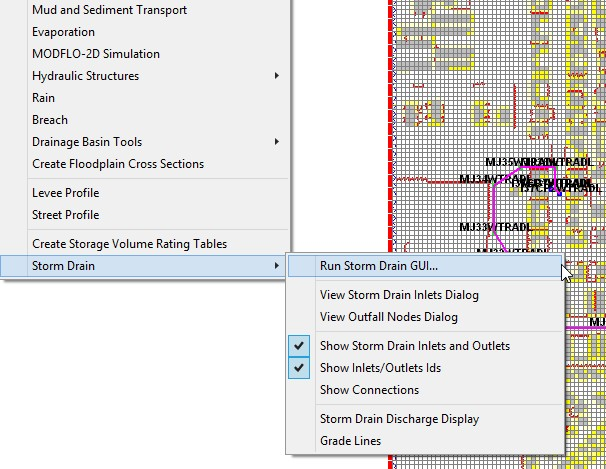
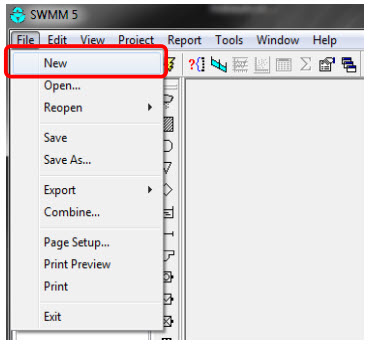
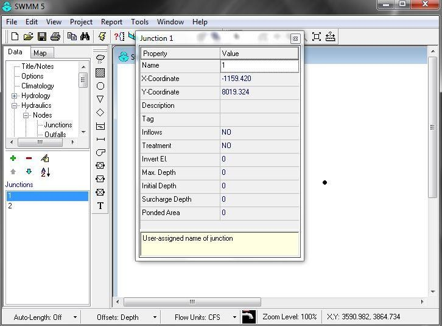
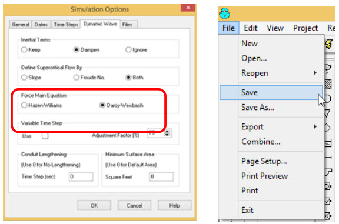
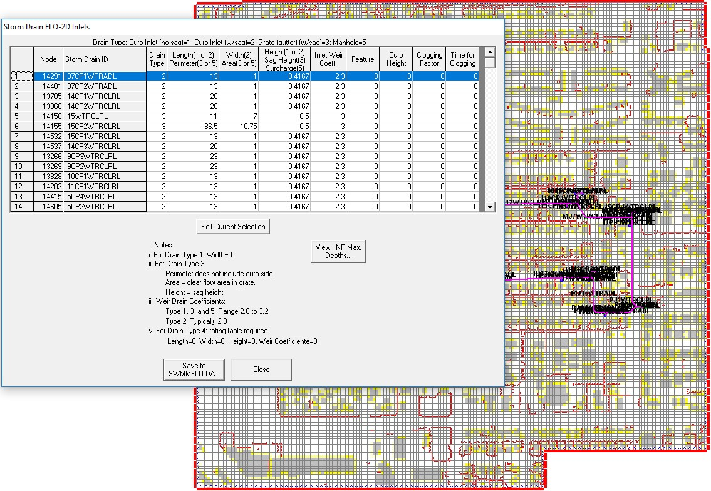
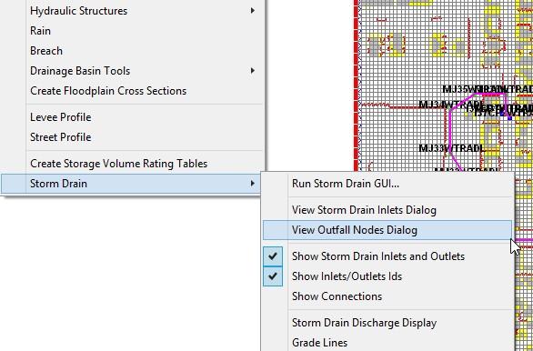

.. vim: syntax=rst

CHAPTER 8
==========

FLO-2D Storm Drain Example
^^^^^^^^^^^^^^^^^^^^^^^^^^

Two storm drain examples are provided with the FLO-2D installation.
Lesson 16 demonstrates the procedure to set up the storm drain features using the SWMM GUI and the GDS.
QGIS Lesson 3 show how to create a storm drain system using shapefiles, review the Workshop Lessons QGIS FLO-2D manual for details.
The following tutorial outlines the steps to run the Storm Drain project in GDS.

To create a FLO-2D Storm Drain model the following tasks are performed:

    1. Create or open an existing FLO-2D model project;
    2. Open the SWMM GUI from the GDS and develop the SWMM.inp data file.
       There are other GUIs that can be used to create the \*.inp file.
    3. Close the SWMM GUI and view the storm drain network in the GDS;
    4. Generate the SWMMFLO.DAT file with the storm drain inlet data;
    5. Create the SWMMOUTF.DAT using the Outfall Node Discharge Option;
    6. Run the FLO-2D storm drain model.

Data Required
'''''''''''''

Storm drain data includes inlet geometry, conduit sizes, and inlet/outlet locations.
After the FLO-2D surface water model is prepared, the storm drain data can be created.
The steps are:

**Create or open a FLO-2D model**

1. Open the GDS and locate the project folder.
2. Import any aerial images to visualize the location of the storm drain system.

**Open the SWMM GUI**

3. From the GDS open SWMM GUI (Figure 86).
   It is possible to open the GUI directly by calling EPA SWMM 5.0 from the Windows search bar.

*Figure 86.
GDS Open Storm Drain GUI**

**Create SWMM.inp file**

4. If there is an existing ‘stand-alone’ storm drain model for this project, the user can port it to the FLO-2D model using the previous Chapter 7
   guidelines.
   To view the storm drain model in the SWMM GUI, find the SWMM.inp file in the FLO-2D project folder as shown in Figure 87.

.. image:: img/Chapter8/Chapte003.jpg

*Figure 87.
SWMM GUI*

5. To create a new storm drain system, go to File|New\| (Figure 88).
   Some of the instructions are discussed below.

*Figure 88.
Open a New Project*

6. Use the Junction Button to add junctions in the project workspace (Figure 89).

.. image:: img/Chapter8/Chapte016.jpg

*Figure 89.
Assign a Junction*

7. To add junction data, change the cursor to a pointer and double click on each junction (Figure 90).

*Figure 90.
Junction Properties*

The coordinate data for each storm drain component must be entered.
Using a shapefile with the storm drain feature attributes is the preferred method, but the SWMM GUI does not have the option to import shapefiles.
There are several options to enter this data:

    - Import an image and click on the approximate location of the storm drain.
    - Enter the coordinates manually in the Figure 90 dialog box.
    - Use third party software such as Autodesk Storm and Sanitary Analysis, or Arc Map.
      An open source program (inpPINS) is available from Geospatial Software Lab that will generate the SWMM.inp file based on shapefiles.

The links are:

   The open source GIS for software:

   *http://www.mapwindow.org/downloads/index.php?show_details=62*

   The free domain inp.PINS software:

   *https://sites.google.com/site/inppins/*

8. Select the Connect Junctions button to add a conduit (Figure 91).

.. image:: img/Chapter8/Chapte013.jpg

*Figure 91.
Create a Conduit*

9. To add conduit data, change the cursor to pointer and double click on each conduit to open the data dialog box (Figure 92.).

.. image:: img/Chapter8/Chapte005.jpg

*Figure 92.
Edit the Conduit Data*

It is recommended to keep the names of the various Storm Drain components simple and consistent with names such as I1, I2, I3, ...
for inlets, IM1, IM2, IM3, ...
for manholes, J1, J2, J3, … for junctions.
Use O = outlets, C = pipe conduits, etc.

10. The Simulation Options|Dates are setup automatically by the FLO-2D Storm Drain model using the SIMUL time assignment in the CONT.DAT file.

11. Go to Simulation Options|Dynamic Wave and set up the Force Main Equation by selection either Hazen-Williams or Darcy-Weisbach and save the project
    (Figure 93).

*Figure 93.
Simulation Options - Dynamic Wave*

Create SWMMFLO.DAT file

12. Open the GDS FLO-2D inlet geometry dialog box (Figure 94.).

.. image:: img/Chapter8/Chapte006.jpg

*Figure 94.
Storm Drain GDS Menus*

13. Input the SWMMFLO.DAT file storm drain inlet geometry (Figure 95.).

*Figure 95.
Storm Drain Inlet Dialog GDS*

14. Inlets to channel grid elements must be assigned to left bank channel element listed in CHAN.DAT and the SWMMFLO.DAT file must be updated.

15. View the Storm Drain storm drain system in the GDS.
    Inlets are displayed as blue cells and junctions as green cells.
    Pipe are displayed as a magenta polyline.

16. The inlet inflow discharge and the flooding are reported in SWMMQIN.OUT.

**Create SWMMOUTF.DAT file**

17. View the Outfall nodes dialog to create the SWMMOUTF.DAT file (Figure 96.).
    This dialog reads the outfall nodes from the SWMM.inp file.
    The user has to select “Allow Discharge” to enable outfall discharge to the FLO-2D grid (Figure 97.).
    If that option is ‘off’, the outfall node will discharge flow off pipe system.

*Figure 96.
GDS Storm Drain Menu - View Dialog*

.. image:: img/Chapter8/Chapte015.jpg

*Figure 97.
Outfall Node Discharge*

18. Outfall Discharge to FLO-2D is reported in the SWMMOUTFIN.OUT file.

Run FLO-2D storm drain model

19. Run the project from GDS (Figure 98).

.. image:: img/Chapter8/Chapte009.jpg

*Figure 98.
FLO-2D Control Variables.**

**Review FLO-2D storm drain model results**

20. The storm drain results are reported in the SWMM.RPT file (ASCII) and SWMM.OUT file (Binary).
    Results can be used to create plots in the GDS and in the SWMM GUI.
