.. vim: syntax=rst

GDS Manual PRO 2021
=====================

Introduction
-------------

The *FLO-2D* Grid Developer System (*GDS*) is a GIS integrated software tool used to facilitate the creation of all required data to run the *FLO-2D*
model.
GDS simplifies construction of the finite difference grid system and allows graphical editing of its attributes and components.
The *GDS* will overlay the grid system on a digital terrain map or a Digital Terrain Model (DTM) set of points and will interpolate and assign
elevations to the grid elements.
It will establish geographical boundaries, import background images and photos, and it will automatically generate the data files required to run the
model.

*GDS* can also run the *FLO-2D* model once the data files have been created.
One of primary functions of the *GDS* is to graphically edit grid elements attributes such as streets, flow obstructions, levees, rainfall,
evaporation, infiltration, channels, hydraulic structures, sediment transport and mud flow parameters, detention basins, and n-values interactively
using mouse point and click events.
The data is validated to minimize common input errors.
For GIS integration GDS makes extensive use of ESRI MapObjects© Version 2.4 GIS software controls.

1.1 GDS Functionality
---------------------

The *GDS* system can perform the following functions: **Interactive Data Entry**

    - Interactive graphical editing of channels, streets, multiple channels, levees and buildings and other grid element attributes.
    - Input detention basins parameters.
    - Assign attributes to group of user selected grid elements
    - Assign reservoir or pounded water elevation for an initial condition on a portion of the grid system.
    - Select Channel Confluences (channel elements sharing discharge).
      Including tributary elements that can be contiguous to either a left or right bank main channel element.
    - Assign spatially and temporally variable rainfall data.
    - Edit levee attributes using the Levee Express Editor.

**Import Data**

    - Import HEC-1 hydrographs.
    - Import DTM points in ASCII format.
    - Import Shape files.

**Data Processing**

    - Automatic generation of finite difference grid and selection of computation area from user defined polygons.
    - Compute spatially variable Green-Ampt infiltration parameters using soil and land use shape files.
    - Compute spatially variable Manning’s n-values using shape files.
    - Convert *HEC-RAS* cross section data to *FLO-2D* channel cross section data format.
    - Compute lengths for channel segments.
    - Create the files to run a *FLO-2D* simulation

.. raw:: html

    <pre>
        CONT.DAT        HYSTRUC.DAT
        TOLER.DAT       STREET.DAT
        INFLOW.DAT      ARF.DAT
        OUTFLOW.DAT     MULT.DAT
        RAIN.DAT        SED.DAT
        INFIL.DAT       LEVEE.DAT
        EVAPOR.DAT      FPXSEC.DAT
        CHAN.DAT        BREACH.DAT
        CHANBANK.DAT    FPLAIN.DAT
        XSEC.DAT        CADPTS.DAT.
        TOPO.DAT        M.DAT
        SWMMFLO.DAT     SUPPLEMENT.DAT
    </pre>

**Data Display and Visualization**

    - Display components.
    - Show channel extension directions.
    - Display interpolated elevation map.
    - Display n-Manning’s map.
    - Display street and levee profiles.
    - Display grid element numbers, elevations and Manning’s n coefficients on the grid system.
    - Zoom and pan.

**GIS integration**

    - Import ESRI shape file format data such as land use, soil types, Manning roughness coefficients and FP Limiting Froude numbers.
    - Import ESRI ArcInfo ASCII grid files containing terrain elevations and NOAA rainfall data.
    - Import multiple geo-referenced aerial photos in various graphic formats such as TIFF, BMP, JPG, MrSID and others as background the grid system.
    - Customize multiple layer display and layer properties.

1.2 New Tools and Enhancements
------------------------------

**Watershed Delineation**

    - Calculate watershed courses.
    - Find the watershed for a given cell.
    - Drainage basin smoothing.
    - Find lowest cell.

**Culvert Equations**

    - Define culvert equations.

**Channels**

    - Define channel confluences,

**Storm Drain Interface**

    - Interface FLO-2D with Storm Drain at runtime.
    - Define catch basins in GDS.

**Interpolation**

    - Interpolate spatially variable limiting Froude numbers from shape files.

**Visualization**

    - Polyline data drawn and recorded when channels, streets or levees are created.
    - STORM DRAIN interface elements.
    - Cross section numbers plotted.
    - Lowest cells in the grid system plotted.
    - Cells without cross sections plotted.
    - Reservoir water elevations plotted.
    - Grid element curve numbers displayed as text.
    - Supplement.dat file restores images, shape files and polylines to project when opened.

There are a number of *GDS* tutorials with examples to help you learn the various commands, features and tools.
These tutorials are available on the *FLO-2D* installation.
There are also example projects provided to work through with the tutorials.

1.3 Data Requirements
---------------------

*GDS* data are introduced through Windows dialog boxes and are stored in files for later retrieval.
User input data is validated to avoid out-of-range values.
Default or recommended values are frequently displayed when the dialog boxes open.
The *GDS* may require or use the following data:

    - Terrain elevation data represented as random topographic points (DTM);
    - Terrain elevation data in ASCII grid files;
    - Study region limits (coordinates);
    - Manning’s roughness (n-value) shape files;
    - Soil shape files and tables;
    - Land use shape files and tables;
    - Image files in any of the following format: BMP, JPG, ArcInfo INFO Grid, GeoTIFF TIFF with a Geo header, Image Catalogs, JPEG, MrSID, TIFF, JPEG, BMP;
    - Rainfall gage data in ASCII grid files;
    - Flood inflow hydrographs.

.. important:: For the GDS system to function properly, the MS-Windows environment decimal symbol must be set to decimal point “.” And the digit
   grouping symbol to comma”,”. Set these options in the Control Panel/Regional and Language Options/Regional Options/Formats/Additional settings/Numbers// dialog box:

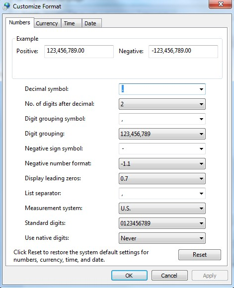

**Mouse Button Commands**
~~~~~~~~~~~~~~~~~~~~~~~~~

**2.1 Left Button actions (one-click)**

Zoom-in on the working region by selecting a rectangular area for a zoom view.
Click the left mouse button to position the cursor on one the vertices of the desired area and drag the mouse to the opposite vertex.
The rectangle appears to outline the selected zoom area.

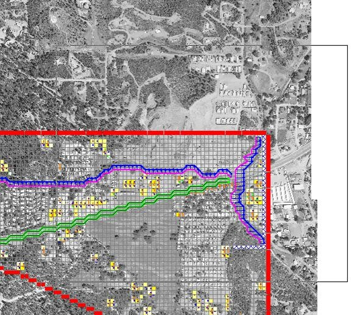

When the button is released, the selected rectangular area is magnified to the full screen.

.. image:: img/GDS004.jpg

Clicking on a street or channel segment will display a submenu that allows editing, modifying or deleting the segment.

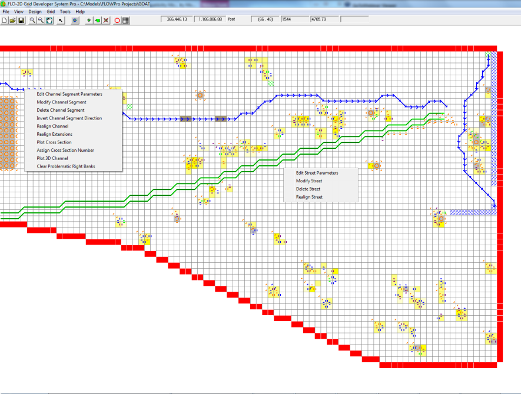

**2.2 Left Button actions (double-click)**

After the grid system has been created and the grid element elevations assigned, double-click any grid element to display the following dialog box:

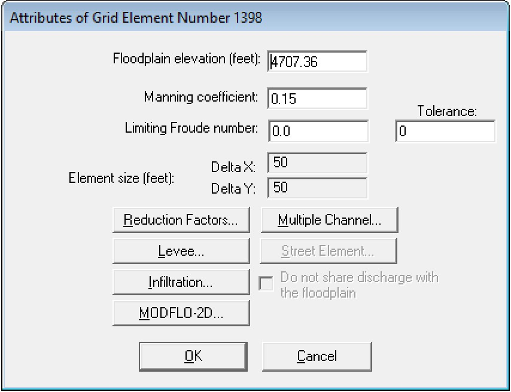

This dialog box is used to edit elevation, n-value, limiting Froude number, and tolerance for any grid element.
There are buttons to edit the grid element attributes such as levees, infiltration, streets, etc.

**2.3 Right Button actions**

After the grid system has been created and the grid element elevations assigned, you can right-click a grid element to display the following short cut
menu:

.. image:: img/GDS007.jpg

Clicking In/Out Condition for Element … and the inflow/outflow dialog box is displayed.
The input description for the FLO-2D inflow or outflow data is explained in chapter 5.

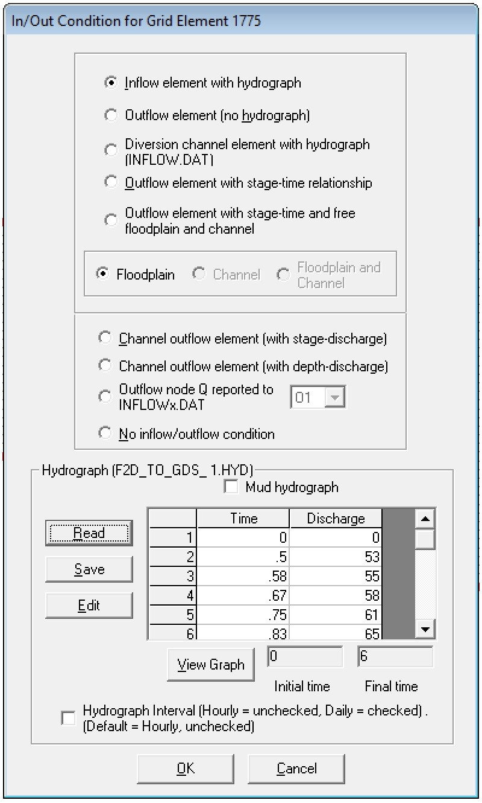

Click Create Reservoir Water Elevation for Element …

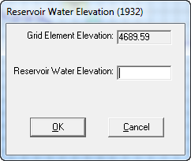

This dialog box allows the user to define a reservoir.
The reservoir is defined by clicking an element within the banks of the reservoir and setting a water surface elevation.
At runtime, the FLO.EXE will find each element that is lower than the water surface elevation and fill it to that specified elevation.

**Toolbar and Menus**
~~~~~~~~~~~~~~~~~~~~~

This section describes the *GDS* commands in the information toolbar and main Menu.

**3.1 Toolbar**

.. image:: img/GDS010.jpg

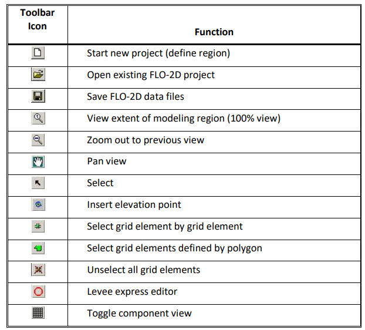

**3.2 File Menu Commands:**

3.2.1 Define Working Region (File Menu)

This command creates a new project.
The user is prompted for the coordinates that define the project working region.

.. important:: Only one project can open at a time in a single GDS execution.
   If there is a project open when this command is selected, the GDS will prompt you to save the current project.
   It is OK to open more than one GDS at a time.

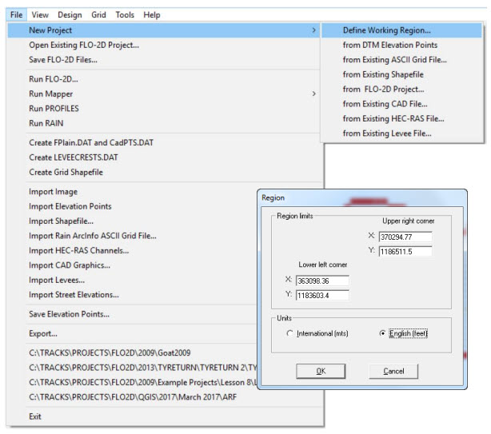

The following table explains the required variables:

.. list-table::
   :widths: 50 50
   :header-rows: 0

   * - **OPTION**
     - **DESCRIPTION**

   * - X (Upper RightCorner)
     - The X coordinate of the upper right hand corner that defines the working region.

   * - Y (Upper RightCorner)
     - The Y coordinate of the upper right hand corner that defines the working region.

   * - X (Lower LeftCorner)
     - The X coordinate of the lower left hand corner that defines the working region.

   * - Y (Lower LeftCorner)
     - The Y coordinate of the lower left hand corner that defines the working region.

3.2.2 New Project/from DTM Elevation Points (File Menu)

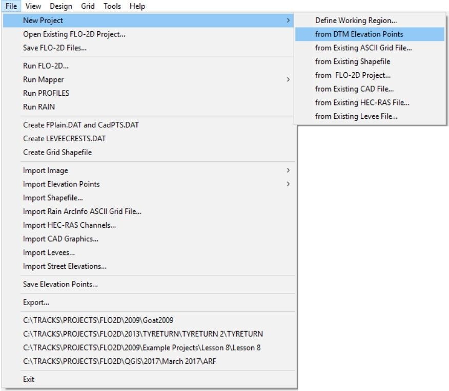

A new project is created by importing the DTM elevation points from an existing file.
To import the DTM (\*.PTS) file click this command in the *File* menu and chose the correct filename in your project subdirectory.
The working region is automatically scaled from the minimum and maximum point coordinates.

3.2.3 New Project/from Existing ArcInfo ASCII Grid File...
(File Menu)

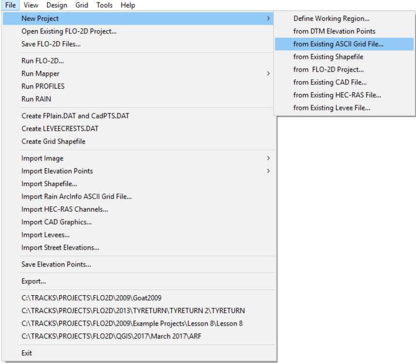

Using this command, a new project is created by importing the terrain elevation points from an existing ArcInfo ASCII grid file.
The format of these files is as follows:

.. raw:: html

    <pre>
                ncols /* Number of columns in the grid */
                nrows /* Number of rows in the grid */
                xllcorner x /* Lower left x coordinate of grid */
                yllcorner y /* Lower left x coordinate of grid */
                cellsize size /* Grid cell size */
                NODATRA_value NODATA /* value of an empty grid cell */
                z11 z12 z13 ... z1ncols /* values of row 1 */
                z21 z22 z23 ... z2ncols /* values of row 2 */
                …
                …
                znrows1 znrows2 znrows3 ... znrowsncols /* values of last row*/
    </pre>

Rows are read from north to south.
For example:

.. raw:: html

    <pre>
                ncols 388
                nrows 461
                xllcorner 674070.85270015
                yllcorner 1000118.1562353
                cellsize 100
                NODATA_value -9999
                2477.259 2480.868 2486.877 2486.877 2487.308 2490.641 2493.438 2493.438
                2493.438. . .
    </pre>

The project area is automatically scaled from the minimum and maximum point coordinates.
To import the ArcInfo ASCII Grid File (\*.ASC) file click this command in the *File* menu and choose the correct filename in your project
subdirectory.

3.2.4 New Project/from Existing Shapefile… (File Menu)

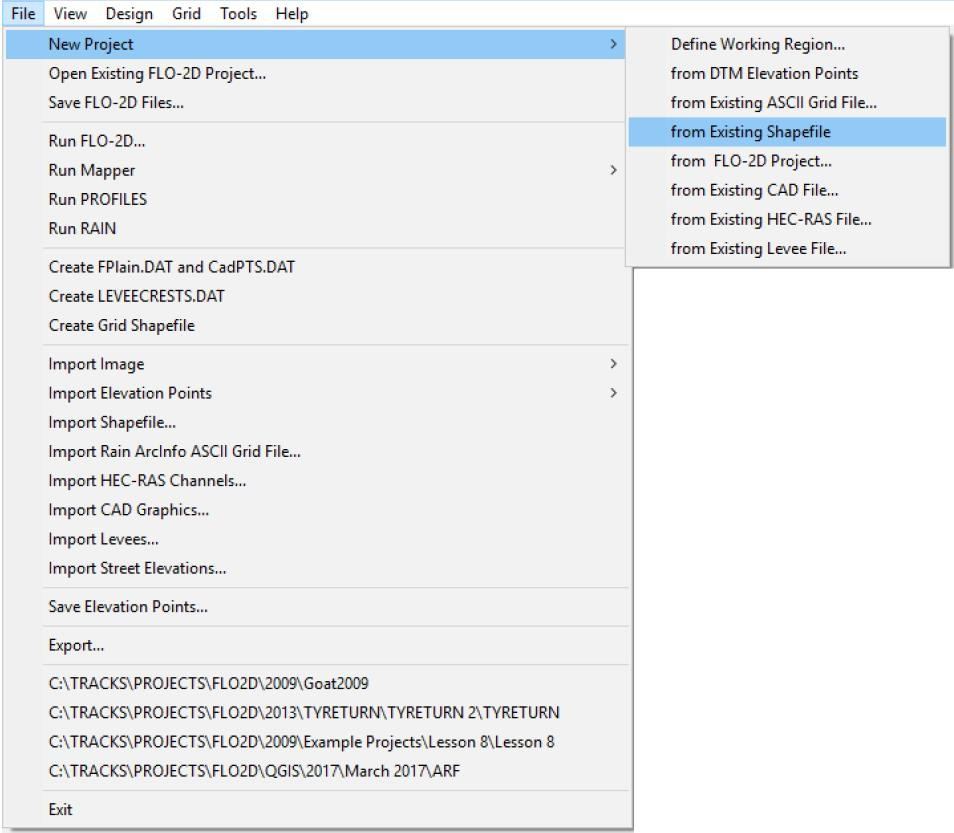

A new project can be created by importing an ESRI *PointZ* Shape file.
The working region is automatically scaled from coordinate data in the shape file.

.. important:: GDS is only able to extract data from PointZ shape files, not from polygon or line shape files.
   Polygon and Polyline shape files can be converted into PointZ shape files.

3.2.5 New Project/from FLO-2D Project … (File Menu)

.. image:: img/GDS027.jpg

A new project grid system can be created by importing an existing *FLO-2D* project.
The working region and the *FLO-2D* grid are automatically scaled from the minimum and maximum coordinate points.
To use this option, click this command in the *File* menu and chose the FPLAIN.DAT file in your project subdirectory.
The CONT.DAT data file must exist in the subdirectory.
An existing project may have various components that have already been developed such as channels, streets, levees, etc.
The components that you want to import can be identified in the FLO-2D Components dialog box.

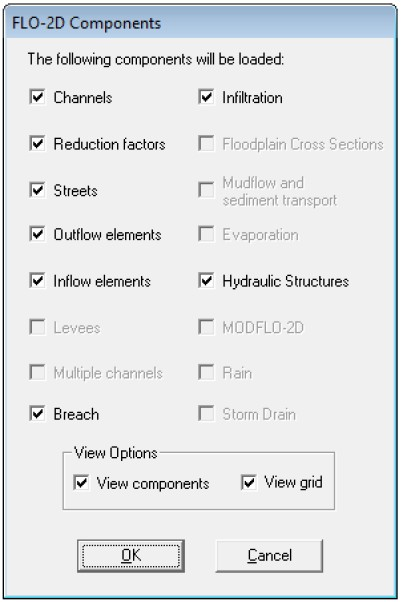

Only existing components will be available, otherwise the corresponding check boxes will be grayed out.
Existing component data (such as reduction factors or levees) can be graphically edited by simply clicking on the grid element with the left mouse
button.
A dialog box will appear so that you can select the component for editing.
This editing procedure is different from the procedure creating new components such as streets or channels.

If the user unchecks the component or unchecks “View Components”, the component will not be loaded and cannot be edited or saved.
The save button will overwrite the unloaded component data file.

3.2.6 New Project/from Existing CAD File (File Menu)

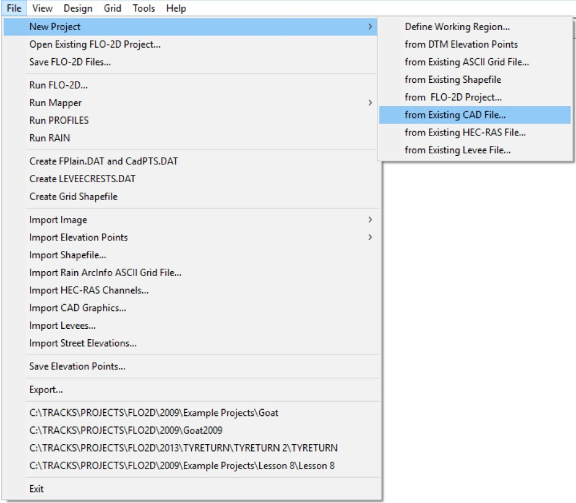

This option provides a way to start a *GDS* project by importing a DXF or DWG CAD file.
The working region and *FLO-2D* grid system are automatically scaled from the existing CAD file extents.

3.2.7 New Project/from Existing HEC-RAS .PRJ File (File Menu)

Use this option to import it to start a *FLO-2D* project when you have a Geo-referenced *HEC-RAS* project file (\*.prj) that includes channel reaches.
The working region and *FLO-2D* grid system are automatically scaled from the existing HEC\ *-RAS* project file extents.

.. image:: img/GDS030.jpg

3.2.8 New Project/from Existing Levee File (File Menu)

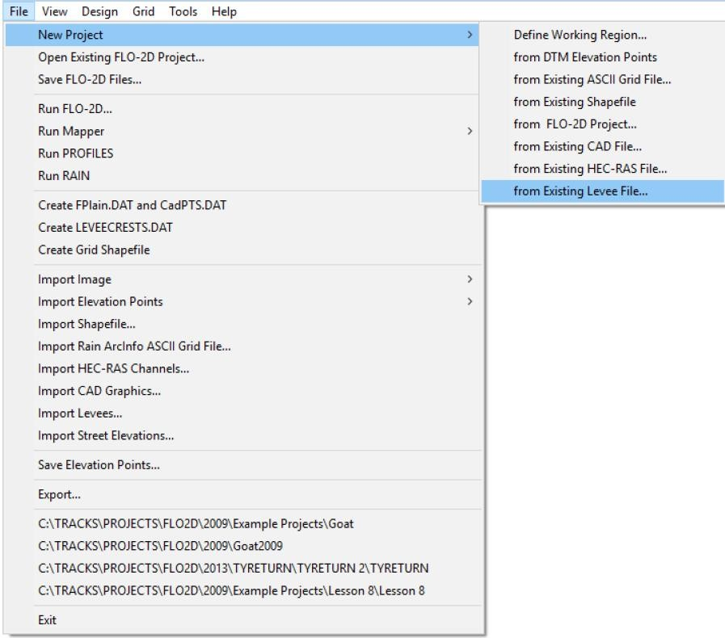

The levee file consists of sequences of polylines points defined by their coordinates and elevation, separated by commas or spaces (with empty
newlines between the polylines):

.. raw:: html

    <pre>
    364440 1186051 4765
    364817 1185937 4750
    365157 1185930 4742

    363190 1186215 4800
    363320 1185891 4789
    363710 1185875 4769

    367261.53 1185897.38 4705.00
    367274.59 1185885.00 4705.00
    367289.69 1185872.63 4705.00
    367304.13 1185866.50 4705.00
    367322.69 1185866.50 4705.00
    367339.16 1185865.75 4705.00
    </pre>

3.2.9 Open Existing FLO-2D Project … (File Menu)

Use this command to load the existing FLO-2D project from the data files.
The FPLAIN.DAT file is a reference file that the GDS and Mapper++ use to locate the .DAT and .OUT files.

3.2.10 Save FLO-2D Files (File Menu)

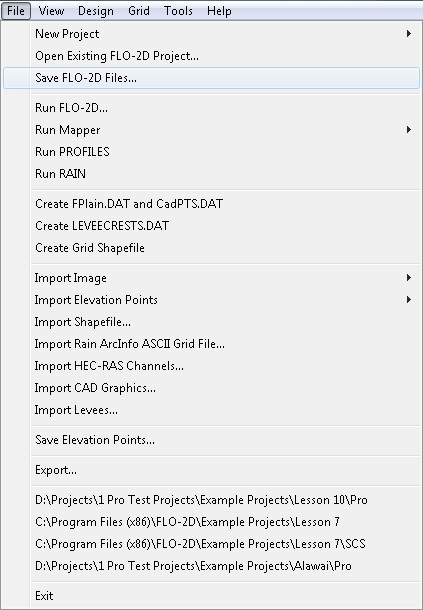

This command is used to save the *FLO-2D* data files for use with the *FLO-2D* model.

.. important:: In order to save a project using this command, the Control Variables must be set.

3.2.11 Run FLO-2D… (File Menu)

.. image:: img/GDS033.jpg

Use this command to run the *FLO-2D* model from the *GDS*.
Click Run *FLO-2D,* the following dialog box will be displayed:

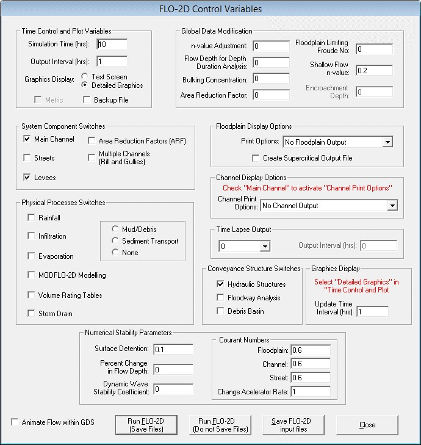

In this dialog box, the control parameters can be selected for a *FLO-2D* simulation.
To start a basic overland flood simulation, the user must input the project simulation time (SIMUL) and the output interval (TOUT) in the Time Control
and Plot Variables frame.
Also check *Detailed Graphics* to display flood graphics during the model run.
To start the model, click the *Run FLO2D* button.
To save the *FLO-2D* input files (.DAT files) without running the model click the *Save FLO-2D input files* button.

Check the *Animate* Flow *within GDS* to plot animated flow depth while the model is running.
This feature displays the animated flooding over background aerial photos.
The *FLO-2D* simulation may be slowed down due to the graphic display of the aerial photo.
If only simple animation is required without background images, unselect the check button (as shown above) and the model simulation will run faster.

3.2.12 Run Mapper (File Menu)

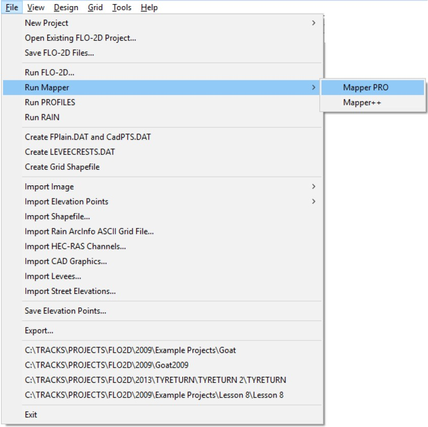

This command initiates the *Mapper PRO or Mapper++* post-processor programs to create flood post production mapping.
Detailed instructions of the *Mapper* programs are presented in the separate manuals.

3.2.13 Run PROFILES (File Menu)

Use this command to run the PROFILES program, used to interpolate channel cross sections and slopes.

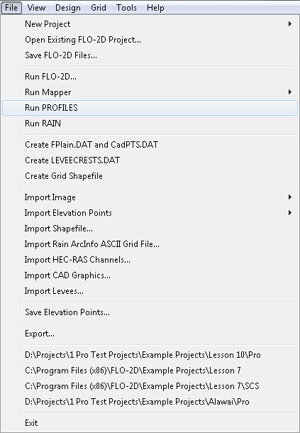

3.2.14 Run RAIN (File Menu)

Use this command to run the RAIN program.

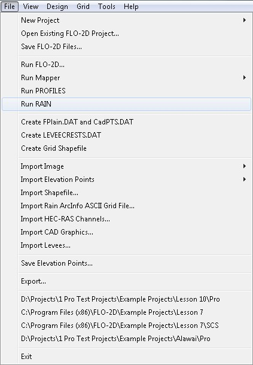

3.2.15 Create FPLAIN.DAT and CADPTS.DAT Files (File Menu)

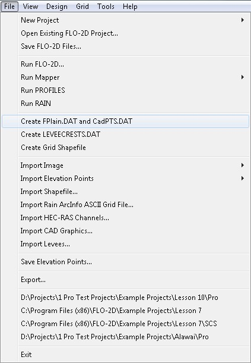

This is an optional command to create only FPLAIN.DAT and CADPTS.DAT files required by *FLO-2D*.
These two topographic files are then created separately without the other required *FLO-2D* files.
This is procedure is appropriate when creating a grid system in segments for later compilation.

3.2.16 Create LEVEECRESTS.DAT (File Menu)

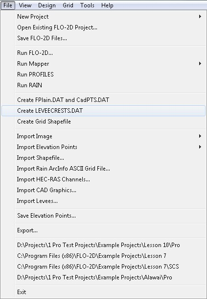

This file is used to verify levee length data.
The command exports levee and WFR stations and calculates a length to the station for the levee segment along a polyline.

.. raw:: html

    <pre>
        An example of LEVEECRESTS.DAT:
        Node   Station   Z        X             Y
        627    00.00     69.638   2226721.750   13565007.000
        582    35.59     69.957   2226849.000   13565100.000
        582    66.71     70.142   2226976.250   13565153.000
        582    97.76     70.194   2227029.000   13565280.000
    </pre>

First the levee polyline is imported ("File.
Import Levees...") and the levees are created.
Then the user selects the command: "File.
Create LEVEECRESTS.DAT" and the station calculation compares the length of the polyline (Poly_Length) and the total length of the levees
(Levees_Length) to determine a WRF value to match the lengths:

.. math::
   :label:

   \mathrm{WRF\_value}
   = 1 - \min\!\left( 1,\ \frac{\mathrm{Poly\_Length}(i)}{\mathrm{Levees\_Length}(i)} \right)

The stations (second column in LEVEECRESTS.DAT are then calculated from the distance from one levee center to the next levee center by multiplying it
by the WRF_value.

3.2.17 Create Grid Shapefile (File Menu)

.. image:: img/GDS040.jpg

This option will create a shape file of the computational domain.
It will only include the numbered grid elements.
The shapefile is saved in these three files.
mgrid.shp, mgrid.shx and mgrid.dbf.

3.2.18 Import Image/Individual Image (File Menu)

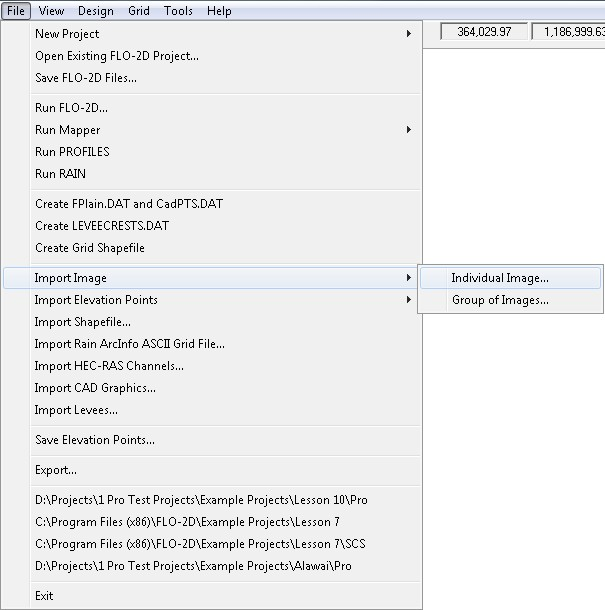

Use this command to import individual images such as aerial photos.
Images are selected one by one or multiple images at a time Shift-clicking or Crtl-clicking the image files.

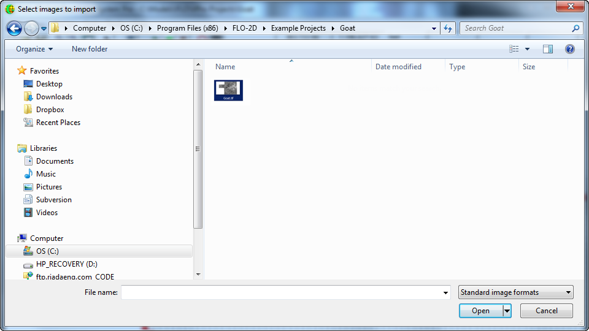

Import images that have been created in following formats:

.. raw:: html

   <table style="border-collapse: collapse; width: 100%; border:1px solid #000;">
     <thead>
       <tr>
         <th style="border:1px solid #000; padding:4px;">File Type</th>
         <th style="border:1px solid #000; padding:4px;">Description</th>
         <th style="border:1px solid #000; padding:4px;">Common Extensions</th>
       </tr>
     </thead>
     <tbody>
       <tr>
         <td style="padding:4px;">ARC/INFO Grid</td>
         <td style="padding:4px;">ArcInfo GRID files</td>
         <td style="padding:4px;">*.asc, *.prj</td>
       </tr>
       <tr>
         <td style="padding:4px;">ADRG</td>
         <td style="padding:4px;">Digitized Raster Graphic</td>
         <td style="padding:4px;">*.img, *.ovr, *.arc</td>
       </tr>
       <tr>
         <td style="padding:4px;">ASRP/USRP</td>
         <td style="padding:4px;">DIGEST ASRP, a NATO Military format</td>
         <td style="padding:4px;">*.img, *.ovr, *</td>
       </tr>
       <tr>
         <td style="padding:4px;">BIL</td>
         <td style="padding:4px;">Band interleaved by line multiband images</td>
         <td style="padding:4px;">*.bil</td>
       </tr>
       <tr>
         <td style="padding:4px;">BIP</td>
         <td style="padding:4px;">Band interleaved by pixel multiband images</td>
         <td style="padding:4px;">*.bip</td>
       </tr>
       <tr>
         <td style="padding:4px;">BMP</td>
         <td style="padding:4px;">Windows bitmap</td>
         <td style="padding:4px;">*.bmp, *.dib</td>
       </tr>
       <tr>
         <td style="padding:4px;">BSQ</td>
         <td style="padding:4px;">Band sequential multiband images</td>
         <td style="padding:4px;">*.bsq</td>
       </tr>
       <tr>
         <td style="padding:4px;">CADRG</td>
         <td style="padding:4px;">Compressed Arc Digitized Raster Graphics</td>
         <td style="padding:4px;">*.*, *</td>
       </tr>
       <tr>
         <td style="padding:4px;">CIB</td>
         <td style="padding:4px;">Controlled Image Base</td>
         <td style="padding:4px;">*.tif</td>
       </tr>
       <tr>
         <td style="padding:4px;">CRP</td>
         <td style="padding:4px;">Compressed Raster Product (Military)</td>
         <td style="padding:4px;">*.gis, *.lan</td>
       </tr>
       <tr>
         <td style="padding:4px;">ERDAS/IMAGINE</td>
         <td style="padding:4px;">TIFF with a Geo header</td>
         <td style="padding:4px;">*.tif, *.tfw, *.tiff</td>
       </tr>
       <tr>
         <td style="padding:4px;">GeoTIFF</td>
         <td style="padding:4px;">TIFF with geographic tags</td>
         <td style="padding:4px;">*.tif</td>
       </tr>
       <tr>
         <td style="padding:4px;">GIF</td>
         <td style="padding:4px;">Graphics Interchange Format</td>
         <td style="padding:4px;">*.gif</td>
       </tr>
       <tr>
         <td style="padding:4px;">Image Catalogs</td>
         <td style="padding:4px;">Image catalog (collection of images)</td>
         <td style="padding:4px;">*.*</td>
       </tr>
       <tr>
         <td style="padding:4px;">IMPELL RLC</td>
         <td style="padding:4px;">Run-length compressed files</td>
         <td style="padding:4px;">*.rlc</td>
       </tr>
       <tr>
         <td style="padding:4px;">JPEG</td>
         <td style="padding:4px;">JPEG</td>
         <td style="padding:4px;">*.jpg, *.jpeg</td>
       </tr>
       <tr>
         <td style="padding:4px;">MrSID</td>
         <td style="padding:4px;">Multi-Resolution Seamless Image Database</td>
         <td style="padding:4px;">*.sid</td>
       </tr>
       <tr>
         <td style="padding:4px;">NITF</td>
         <td style="padding:4px;">National Imagery Transfer Format</td>
         <td style="padding:4px;">*.ntf</td>
       </tr>
       <tr>
         <td style="padding:4px;">Sun raster file</td>
         <td style="padding:4px;">Sun raster image</td>
         <td style="padding:4px;">*.rs, *.ras, *.sun</td>
       </tr>
       <tr>
         <td style="padding:4px;">SVF</td>
         <td style="padding:4px;">Single Variable File</td>
         <td style="padding:4px;">*.svf</td>
       </tr>
       <tr>
         <td style="padding:4px;">TIFF</td>
         <td style="padding:4px;">Tagged Image File Format</td>
         <td style="padding:4px;">*.tif, *.tiff</td>
       </tr>
     </tbody>
   </table>

To correctly place the image or photo in a geo-referenced frame, it must be accompanied by a world
file that contains geo-reference data. This world file has an extension depending on the
image and file type and according to the table below. For example, an image with a file name
myimage.bmp, must have a world file associated with it named myimage.bmpw or myimage.bpw

+-------------------+-------------------------+
| File Extension    | World File Extension    |
+===================+=========================+
| bmp               | bmpw or bpw             |
| jpg; jpeg         | jpgw or jgw             |
| tif; tff; tiff    | tfw                     |
| gis               | gsw                     |
| lan               | lnw                     |
| bil               | blw                     |
| bip               | bpw                     |
| bsq               | bqw                     |
| sid               | sdw                     |
| sun               | snw                     |
| rs; ras           | rsw                     |
| rlc               | rcw                     |
+-------------------+-------------------------+

The world file has the following general format:

.. raw:: html

    <pre>
    Line 1:      This line has the dimension of a pixel in map units in the x-direction.
    Lines 2, 3:  These lines are the rotation terms (Not used in this release).
    Line 4:      This value is always negative because the image space is top-down whereas the
                 map space is bottom-up.
    Line 5:      This line has the translation term; x-Origin (x-coordinate of the center of the
                 upper left pixel).
    Line 6:      This line has the translation term; y-Origin (y-coordinate of the center of the
                 upper left pixel).
    </pre>

An example world file format is:

.. raw:: html

    <pre>
    20
    0
    0
    -20
    637510
    1032490
    </pre>

3.2.19 Import Image/Group of Images (File Menu)

.. image:: img/GDS043.jpg

This command allows importing of several image files contained in a given subdirectory and part of an image catalog.
First draw a polygon on the working region and then select an image catalog file.

.. image:: img/GDS044.jpg

The catalog file may be in DBASE or ASCII format and has the following format:

.. raw:: html

   <table style="border-collapse: collapse; width: 100%; border:1px solid #000;">
     <thead>
       <tr>
         <th style="border:1px solid #000; padding:4px; text-align:left;">Image</th>
         <th style="border:1px solid #000; padding:4px;">Xmin</th>
         <th style="border:1px solid #000; padding:4px;">Ymin</th>
         <th style="border:1px solid #000; padding:4px;">Xmax</th>
         <th style="border:1px solid #000; padding:4px;">Ymax</th>
       </tr>
     </thead>
     <tbody>
       <tr>
         <td style="padding:4px; text-align:left;">
           C:\Projects\MaricopaCounty\Data\ 6401030-5.TIF
         </td>
         <td style="padding:4px;">640000</td>
         <td style="padding:4px;">1000000</td>
         <td style="padding:4px;">670000</td>
         <td style="padding:4px;">1400000</td>
       </tr>
       <tr>
         <td style="padding:4px; text-align:left;">
           C:\Projects\MaricopaCounty\Data\ 6401035-5.TIF
         </td>
         <td style="padding:4px;">660000</td>
         <td style="padding:4px;">1300000</td>
         <td style="padding:4px;">770000</td>
         <td style="padding:4px;">1500000</td>
       </tr>
       <tr>
         <td style="padding:4px; text-align:left;">
           \\Agua\IMF\Publico IMF\ 6401055-5.TIF
         </td>
         <td style="padding:4px;">630000</td>
         <td style="padding:4px;">1300000</td>
         <td style="padding:4px;">750000</td>
         <td style="padding:4px;">1510000</td>
       </tr>
     </tbody>
   </table>

The first column is the file name including its path and the following four columns are the image coordinate limits.
The *GDS* will find all images from the catalog that are contained within or intersected by the user defined polygon and will retrieve the
corresponding images.

3.2.20 Import Elevation Points/ DTM Points… (File Menu)

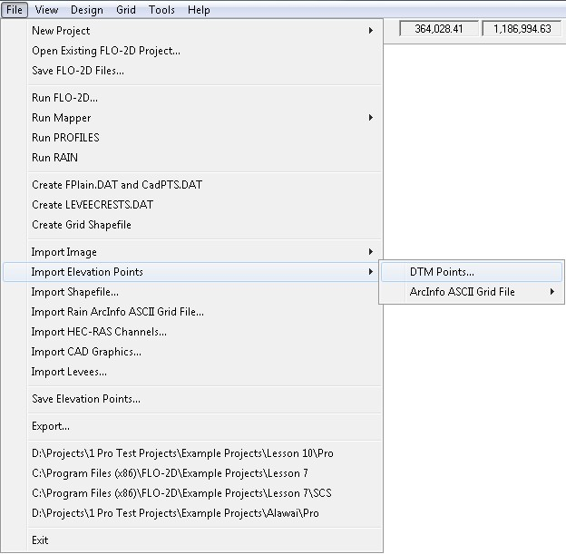

This command imports DTM elevation points from an existing file.
Several data files can be imported and the new points are appended to the existing data points.
The user can also mix or combine DTM points with points from ArcInfo ASCII grid files.

3.2.21 Individual ArcInfo ASCII Grid File (File Menu)

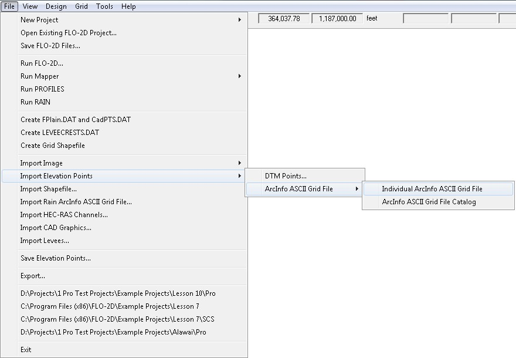

Use this command to import ArcInfo ASCII grid files.
The user may import several grid files.
Any new points are added to the existing data.
You may also mix or combine ArcInfo ASCII data with DTM points.

3.2.22 ArcInfo ASCII Grid File Catalog (File Menu)

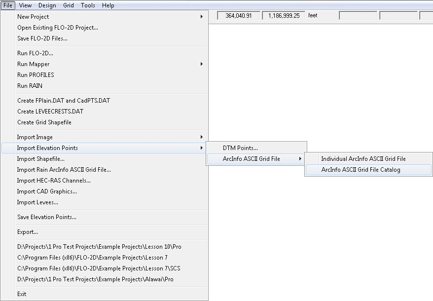

With this command you can import several ArcInfo ASCII grid files stored in any subdirectory.
First draw a polygon on the working region, then select a catalog file.
The catalog file may be in DBASE or ASCII format and has the following format:

.. raw:: html

   <table style="border-collapse: collapse; width: 100%; border:1px solid #000;">
     <thead>
       <tr>
         <th style="border:1px solid #000; padding:4px; text-align:left;">ASCII Grid File</th>
         <th style="border:1px solid #000; padding:4px;">Xmin</th>
         <th style="border:1px solid #000; padding:4px;">Ymin</th>
         <th style="border:1px solid #000; padding:4px;">Xmax</th>
         <th style="border:1px solid #000; padding:4px;">Ymax</th>
       </tr>
     </thead>

     <tbody>
       <tr>
         <td style="padding:4px; text-align:left;">
           C:\Projects\MaricopaCounty\Data\grd2375-100.asc
         </td>
         <td style="padding:4px;">640000</td>
         <td style="padding:4px;">1000000</td>
         <td style="padding:4px;">670000</td>
         <td style="padding:4px;">1400000</td>
       </tr>

       <tr>
         <td style="padding:4px; text-align:left;">
           C:\Projects\MaricopaCounty\Data\grd2376-100.asc
         </td>
         <td style="padding:4px;">500000</td>
         <td style="padding:4px;">1000000</td>
         <td style="padding:4px;">900000</td>
         <td style="padding:4px;">1500000</td>
       </tr>

       <tr>
         <td style="padding:4px; text-align:left;">
           \\Agua\IMF\Publico IMF\grd2476-100.asc
         </td>
         <td style="padding:4px;">510000</td>
         <td style="padding:4px;">1000000</td>
         <td style="padding:4px;">740000</td>
         <td style="padding:4px;">1510000</td>
       </tr>
     </tbody>
   </table>

The first column is the file name including the path name.
The following four columns are the coordinate data limits in each file.
The *GDS* will automatically find all data files that are contained within or intersected by the user defined polygon and will retrieve/display the
corresponding files.
Grid files generally contain a large number of points and loading may take several minutes, but once loaded, the points are quickly displayed.
If the display time becomes too long for a given large data point set, you can use the *Esc* key to stop the display process.

3.2.23 Import Shape File (File Menu)

This command will import ESRI shape files.

3.2.24 Import Rain ArcInfo ASCII Grid File (File Menu)

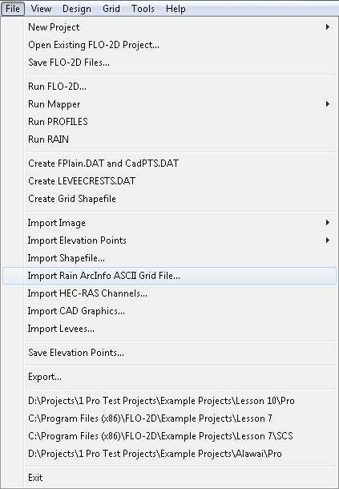

An ASCII grid file can be imported as a *FLO-2D* grid system or used to delineate other boundaries such as a rainfall gage grid system.

3.2.25 Import HEC-RAS Channels… (File Menu)

This command allows importing channel reaches from geo-referenced *HEC-RAS* project.

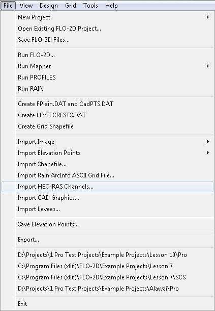

3.2.26 Import CAD Graphic … (File Menu)

Use this command to import DXF or DWG CAD files.

.. image:: img/GDS051.jpg

3.2.27 Import Levees...(File Menu)

.. image:: img/GDS052.jpg

.. image:: img/GDS053.png

Use this command to import levee polyline vertices in the form of xyz space or coma delimited text file.
The file extension is \*.xyz.

3.2.28 Save Elevation Points (File Menu)

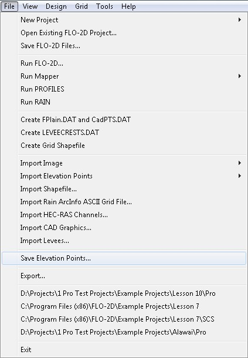

After deleting any DTM points or adding points from multiple files, this command will save the remaining points to a single file.

3.2.29 Export… (File Menu)

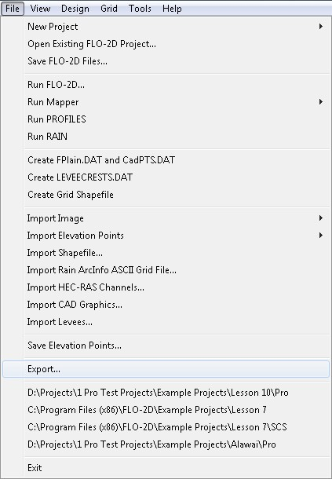

Use this command to export the current screen view to one of various image formats.
Click the *Export Command* and the following dialog box appears:

.. image:: img/GDS056.png

Choose an image export format such as Bitmap, JPEG, etc and adjust the scale factor of the image to obtain better print quality.
When you click the Export button, input the image file name and select the directory to save the image as shown in the following file dialog box:

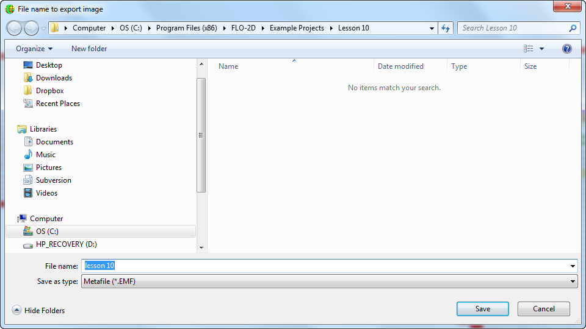

3.2.30 Open Recent Projects (File Menu)

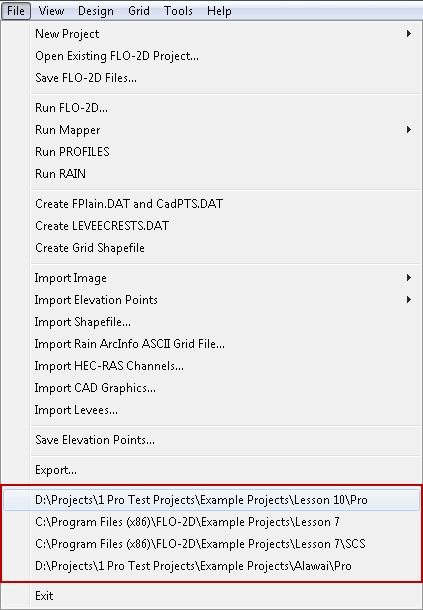

This command allows the user to open recently opened projects.

3.2.31 Exit (File Menu)

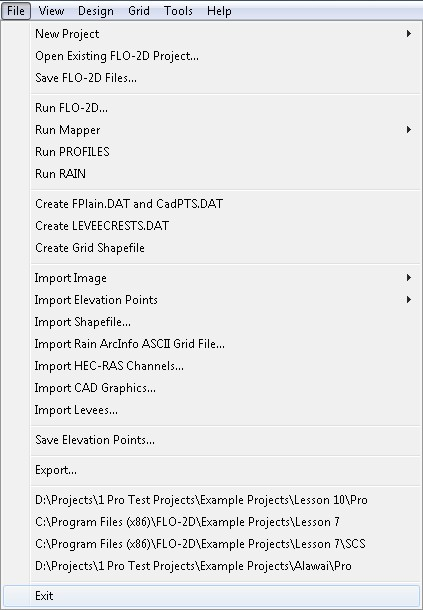

This command ends the *GDS* session.
The *GDS* will prompt the user to save the current project.

**3.3 View Menu Commands:**

3.3.1 View All (View Menu)

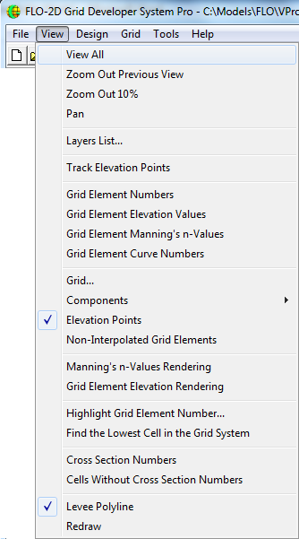

.. |view_all_icon| image:: img/GDS061.jpg
   :height: 14px

Use the *View All command* or click the View All |view_all_icon| icon to return the working region to its original full size.
To Zoom-in (increase the magnification), click in the working region and drag the mouse to outline the area of interest.

3.3.2 Zoom Out Previous View (View Menu)

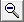

Use the *Zoom Out* *Previous View* command or click the Zoom Out Previous View Button |zoom_out_previous_view_icon| to return to the previous zoom extent

3.3.3 Zoom Out 10% (View Menu)

Use the Zoom Out 10% View command to reduce the current view 10% in size.

3.3.4 Pan (View Menu)

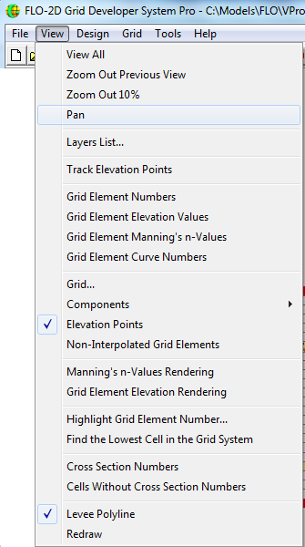

.. |pan_icon| image:: img/GDS066.jpg
   :height: 14px

Use the *Pan* command or use the *Pan* Toolbar icon |pan_icon| to move around within the working region view.
Click and drag the mouse to pan around.

.. |select_icon| image:: img/GDS066.jpg
   :height: 14px

Use the *View All* command (or toolbar icon) to return to a full view of the working region or click the Select icon |select_icon| to exit the pan mode.

3.3.5 Layers List (View Menu)

.. image:: img/GDS067.png

This command opens the Layer dialog box.

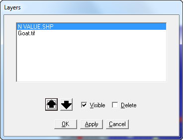

.. |up_arrow_icon| image:: img/image74.jpg
   :height: 14px

Layers may be visible or invisible.
Change the layer visible status by checking the *Visible* check box.
In the example above there are two active layers.
Use the |up_arrow_icon| and |down_arrow_icon| icons to highlight and move between the various layers.
Click the *Apply* button to accept the changes.
Delete any layer by checking the *Delete* check box and then clicking the *Apply* button.
After any modifications to the layers, click Apply prior to clicking OK.

To enter the Layer Properties Dialog box double click an active layer.
The following dialog appears:

.. image:: img/GDS069.png

This dialog box allows the user to modify layer colors, transparency, number of classes or divisions, add point captions, font styles, etc.
Use the *Adv label* option to add labels to DTM points in the Elevation layer.

Click the *Apply* button and then the *Close* button to accept the changes.

3.3.6 Track Elevation Points (View Menu)

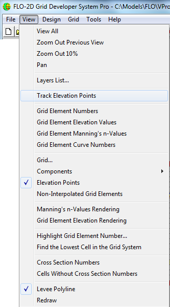

.. |individual_terrain_elevation_icon| image:: img/GDS071.jpg
   :height: 14px

This command queries individual terrain elevation points and displays the data for the selected point in the toolbar point elevation box.
The mouse cursor changes to the inquiry mode to show that this option is active\ |individual_terrain_elevation_icon|.

.. image:: img/GDS072.jpg

3.3.7 Grid Element #’s, Elevations, and n-values and Curve Numbers (View Menu)

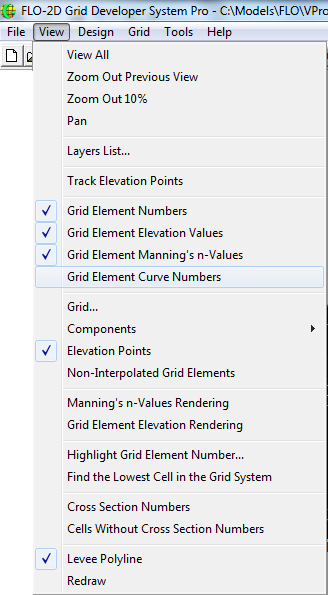

Use these commands to display grid element numbers, elevations, Manning’s n-values or Curve Numbers inside the grid elements.
Each command can be toggled and used jointly to display three values.
Note that if the grid system is large, the numbers may not fit into the elements.
Zoom in to enlarge the view and to clearly see the element numbers.
In each element, the first number is the grid element number, the second is the terrain elevation and the third the Manning’s n value.
Manning's n-value and the SCS curve number are selected separately.

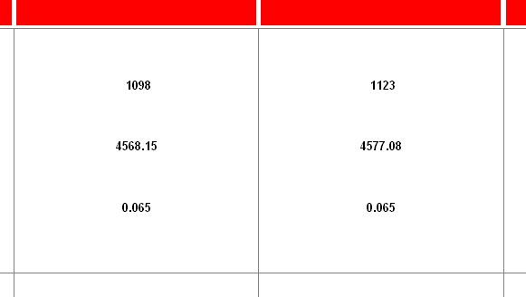

3.3.8 Grid... (View Menu)

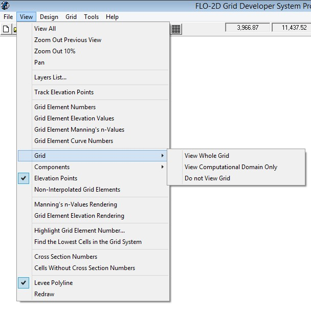

This command customizes the grid display.

3.3.9 View Components (View Menu)

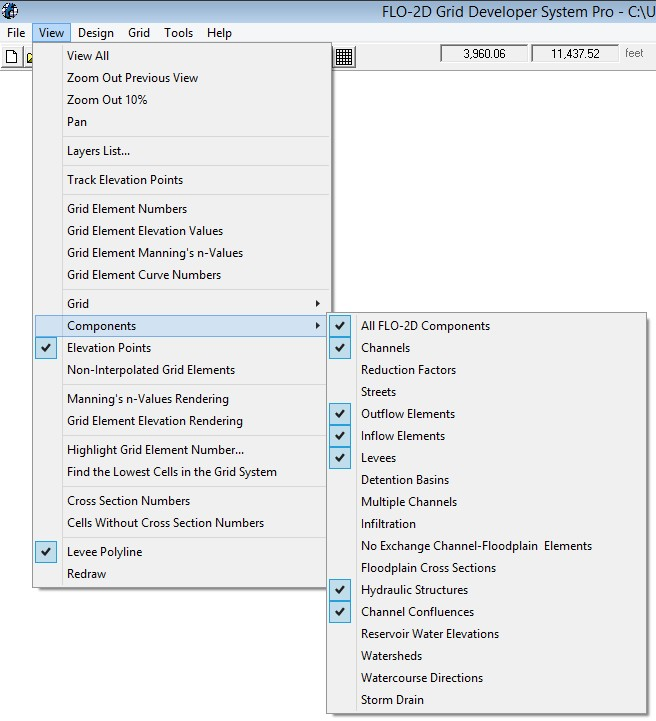

These commands enable the user to view or hide *FLO-2D* components.
The component view can be toggled on or off in any combination.
These are some example views of the different *FLO-2D* components as represented in *GDS*:

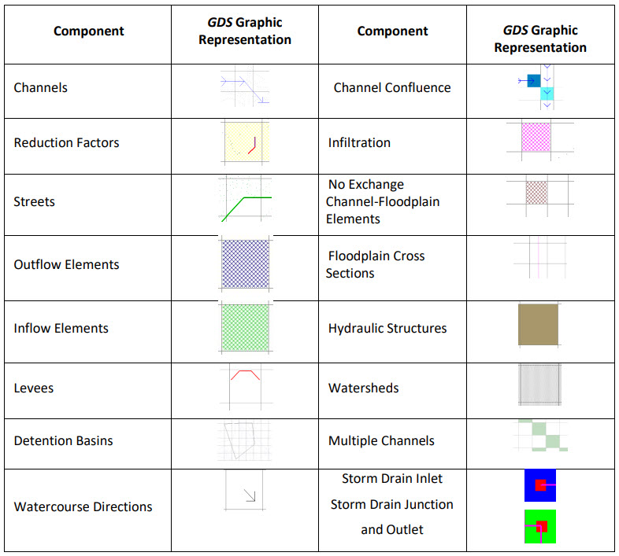

3.3.10 View Elevation Points (View Menu)

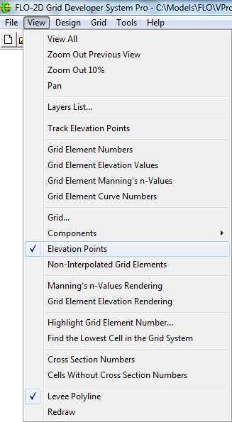

Displays elevation points assigning colors as a function of elevation.

3.3.11 Non-Interpolated Grid Elements (View Menu)

Displays non-interpolated grid elements.
These elements remained un-interpolated they did not have DTM elevation points within the grid element space during interpolation.
The user chose not to interpolate the elevation of grid elements that did not have any DTM points within the grid element space.

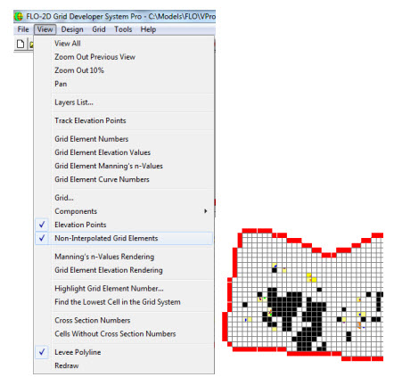

3.3.12 Manning’s n Values Rendering (View Menu)

Plots colored hatched pattern on the elements according to the Manning’s n value.

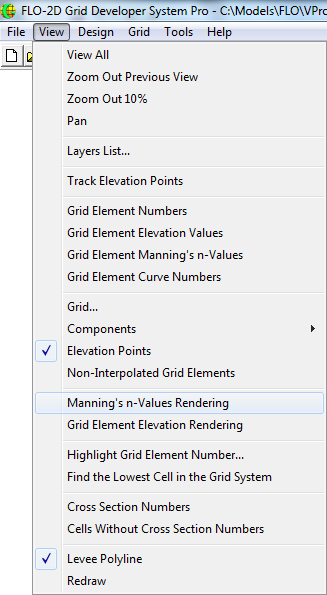

3.3.13 Grid Element Elevation Rendering (View Menu)

.. image:: img/GDS273.jpg

Plots colored solid or hatched grid elements according to the elevations.

3.3.14 Highlight Grid Element Number… (View Menu)

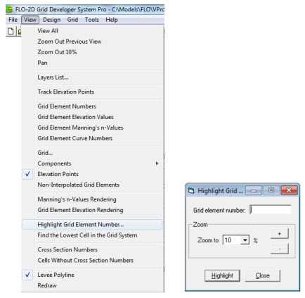

Enter a grid element number in the following dialog box to locate it in the *FLO-2D* grid.
When you click the *Highlight* button, the grid element will blink to identify it.
Note that if the selected element number is not in the current view, you may have to zoom out to see it.

Use the “Zoom to” dropdown list to zoom in or zoom out.
Or the “+” and “-“ buttons.

3.3.15 Find the Lowest Cell in the Grid System (View Menu)

This command colors the 4th lowest grid elements.

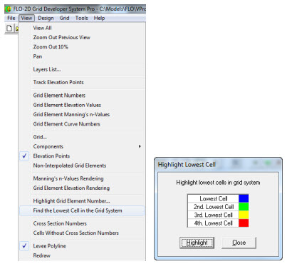

3.3.16 Cross Section Numbers… (View Menu)

This command displays cross section numbers for Natural Channels.

.. image:: img/GDS276.jpg

3.3.17 Cells without Cross Section Numbers… (View Menu)

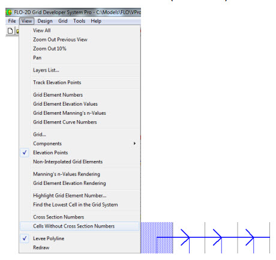

This command displays natural channel grid elements that do not have any assigned cross section.
The grid elements without cross sections assigned are highlighted in blue.

3.3.18 Levee Polyline (View Menu)

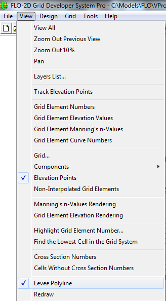

Use this command to view the polylines that were produced when the levee data was imported or created along a polyline.

3.3.19 Redraw (View Menu)

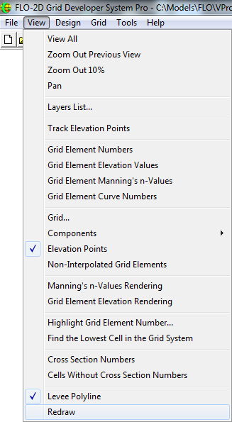

Use this command to redraw the visible objects in the working region.

**3.4 Design Menu Commands:**

3.4.1 Elevation Points/Insert (Design Menu)

.. image:: img/GDS098.jpg

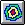

Use this command (or the |elev_insert_icon| icon) to insert elevation data at selected points within the working region.
To use this tool:

    1. Select the *Elevation Points/Insert* command (Design menu) or the toolbar icon |elev_insert_icon| and click the left mouse button.
    2. A dialog box appears for the elevation entry in feet or meters.
       Click *‘OK’* to accept the value.

    .. image:: img/GDS100.png

    3. Click a point within the working region to assign this elevation data.
    4. Repeat step 3 as many times as needed.

3.4.2 Elevation Points/Create Elevation Points Layer (Design Menu)

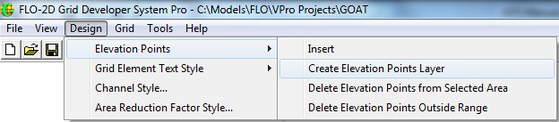

To optimize display times, *GDS* does not automatically create the Elevation points layer.
Use this command to create the elevation point layer.

3.4.3 Elevation Points/Delete Elevation Points from Selected Area (Design Menu)

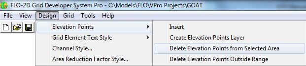

This command deletes elevation data points within the working region.
To use this tool:

    1. Select the *Elevation Points/* *Delete Elevation Points from Selected Area* command (Design menu).
    2. Click OK, draw the polygon and select yes to delete the points within the polygon.

    .. image:: img/GDS281.jpg

    3. To save the edited DTM points file, click the Save Elevation Points command (File Menu)

3.4.4 Elevation Points/Delete Elevation Points Outside Range (Design Menu)

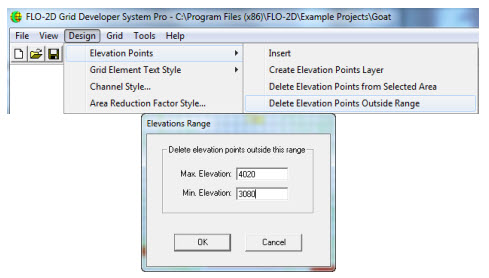

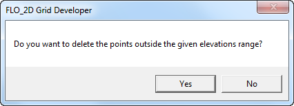

Deletes elevation data points outside a specified range.

3.4.5 Grid Element Text Style (Design Menu)

.. image:: img/GDS284.jpg

Use these commands to edit the text styles for the grid element number, elevation, or Manning’s n-value.
Set the relative position of the number in the square grid element (upper, middle or down positions).
The Font Properties… button is used to change, font type, style, size, etc.

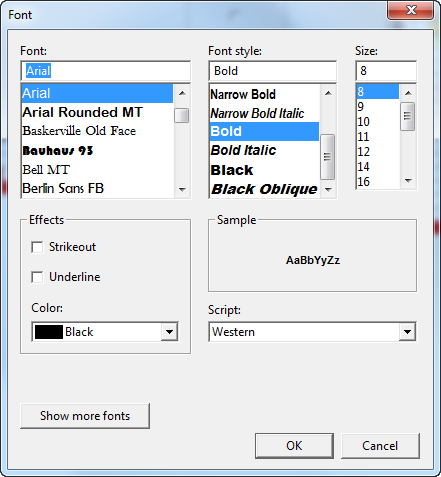

3.4.6 Channel Style (Design Menu)

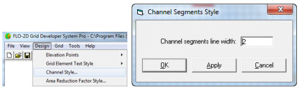

Use this command will change the line width used to represent channels.
The *GDS* displays this dialog box to set the line width.
Click *Apply* and then ‘\ *OK’* to change to the selected channel line width display

3.4.7 Area Reduction Factor Style (Design Menu)

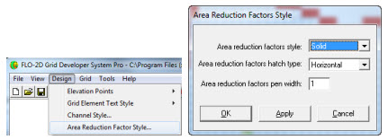

To change the display of area reduction factor in a grid element chose from Solid, Hollow (with boundary display of different pen widths) or Hatched
rendering with various hatching options.
Click *Apply* and then ‘\ *OK’* to change to the selected style.

**3.5 Grid Menu Commands:**

3.5.1 Create Grid (Grid Menu)

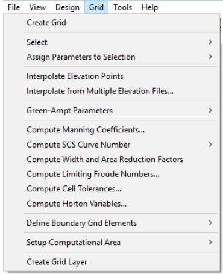

Command to create the grid system template of square elements for the *FLO-2D* model.
To use the *Create Grid* command:

    1. Select the *Create Grid* command (Grid menu).
    2. A dialog box appears requesting the square grid element size or side length (ft or m):

    .. image:: img/GDS106.png

    3. Select *‘OK’* to accept the value.
    4. The *GDS* system will automatically overlay a grid template that is centered in the working region.
       The grid elements will be centered on each node.

3.5.2 Select/Grid Element (Grid Menu)

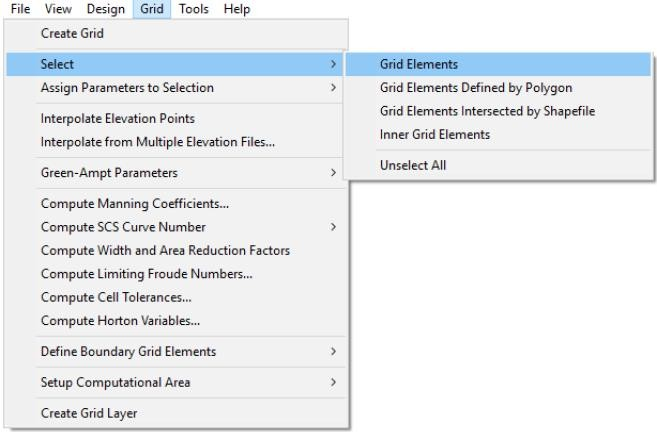

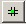

Use this command (or the |select_one_or_more_grid_elements_icon| icon in the tool bar) to select one or more grid elements.
With the *Assign Parameters to Selection* command, assign attribute values to the selected grid elements.
To use the *Select / Grid element* command:

    1. Choose the *Select/Grid element* command (Grid menu).
    2. The cursor changes to a cross.
    3. Click the grid element/s to select them.
    4. Repeat step 3 for each selected element.

To unselect previously selected elements, click them again.
To select a group of elements, press the *Shift* key simultaneously with the left mouse button and drag the mouse pointer over the desired elements.
To unselect a group of elements press the *Control* key and the left mouse button, then drag the mouse pointer over the elements you want to unselect.
When dragging the mouse over the grid elements, they are painted to indicate your selection.
After a grid element or group of elements is selected, use the *Assign Parameters to Selection* command to assign various attributes to the selected
elements.

3.5.3 Select/Grid Elements Defined by Polygon (Grid Menu)

.. image:: img/GDS287.jpg

.. |select_all_grid_elements_inside_polygon_icon| image:: img/GDS109.jpg
   :height: 14px

This command (or the |select_all_grid_elements_inside_polygon_icon| icon in the tool bar) will select all the grid elements within a user defined polygon.
Attributes can then be assigned to the selected elements using the *Assign Parameters to Selection* command.
It may be necessary to create a grid layer first.

3.5.4 Select/Grid Elements Intersected by Shapefile (Grid Menu)

.. image:: img/GDS110.jpg

Use this command to allow the use an imported polylines shapefile to intersect the grid domain to select grid elements.
The shapefile should have been previously imported using the command “File.
Import Shapefile…”

3.5.5 Select/Inner Grid Elements (Grid Menu)

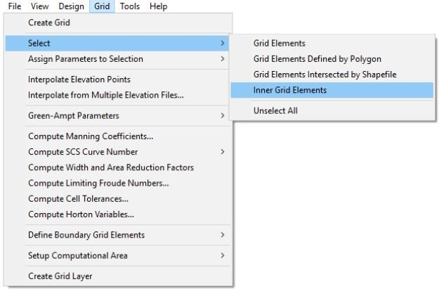

This command will select all the grid elements within the computational domain and hatch them with diagonal lines.
Use the *Assign Parameters to Selection* command to assign various attributes to the selected elements.

3.5.6 Select/Unselect All (Grid Menu)

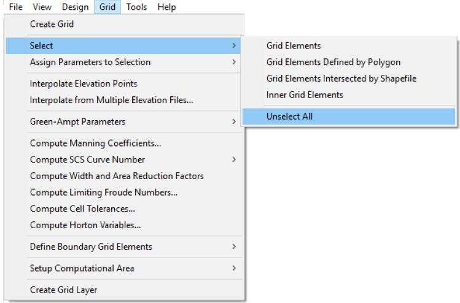

.. |unselect_all_grid_elements_icon| image:: img/GDS113.jpg
   :height: 14px

This command will unselect all the elements previously selected with the *Select* command.
The toolbar icon |unselect_all_grid_elements_icon| will also perform this function.

3.5.7 Assign Parameters to Selection/Elevations (Grid Menu)

Assign an elevation to selected grid elements.
Enter an elevation value or enter a distance to raise or lower the elevation.
Use positive numbers to raise the elevation and negative numbers to lower the elevation.
Click *‘OK’* to change the elevation to the selected elements.

3.5.8 Assign Parameters to Selection/Manning’s Coefficient (Grid Menu)

.. image:: img/GDS289.jpg

A Manning’s roughness coefficient (n-value) is assigned to the grid elements previously selected with the *Select* command.
A dialog box appears prompting you to enter the n-value:

3.5.9 Assign Parameters to Selection/Area and With Reduction Factors (Grid Menu)

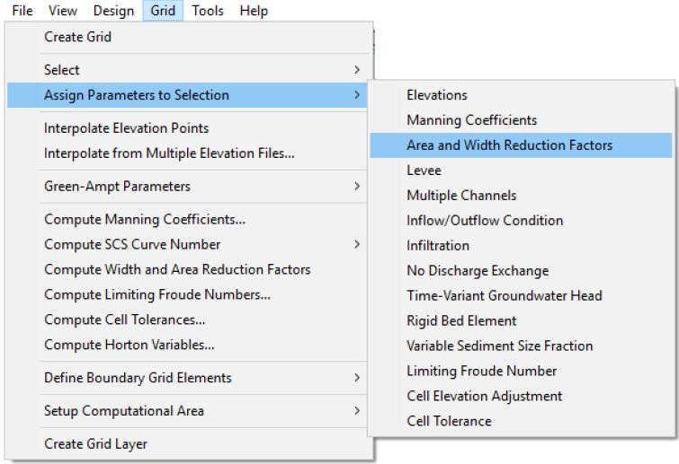

This command is used to assign area and width reduction attributes to the selected grid elements.
A dialog box appears prompting the user to enter the Area Reduction Factor (ARF) and the Width Reduction (WRF) factors:

.. image:: img/GDS115.jpg

After clicking *‘OK’*, the assigned ARF and WRF values will appear graphically as follows:

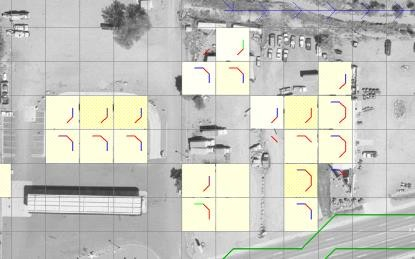

The colored cells indicate varying levels of storage loss (ARF values).
The colored lines reflect the varying levels of flow direction blockage (WRF values).
Eight potential flow directions for each grid element can be assigned to identify complete blockage.
It should be noted that each grid element can share discharge in eight directions.

3.5.10 Assign Parameters to Selection/Levee (Grid Menu)

.. image:: img/GDS117.jpg

Use this command to assign levee and levee failure parameters to the selected grid elements.
A dialog box will appear with the grid element floodplain elevation across the levee in that flow direction for reference.
Click a check box to set up a levee for each selected direction.
A text box will appear just below each direction to input the levee crest elevation.
Note that the levee crest must be higher than the grid element elevation and the elevation of the grid element in the cut off direction.
Redundant levee cut off directions will not be accepted by the GDS or the FLO-2D model.
This dialog box can also be used to edit the grid element elevation.

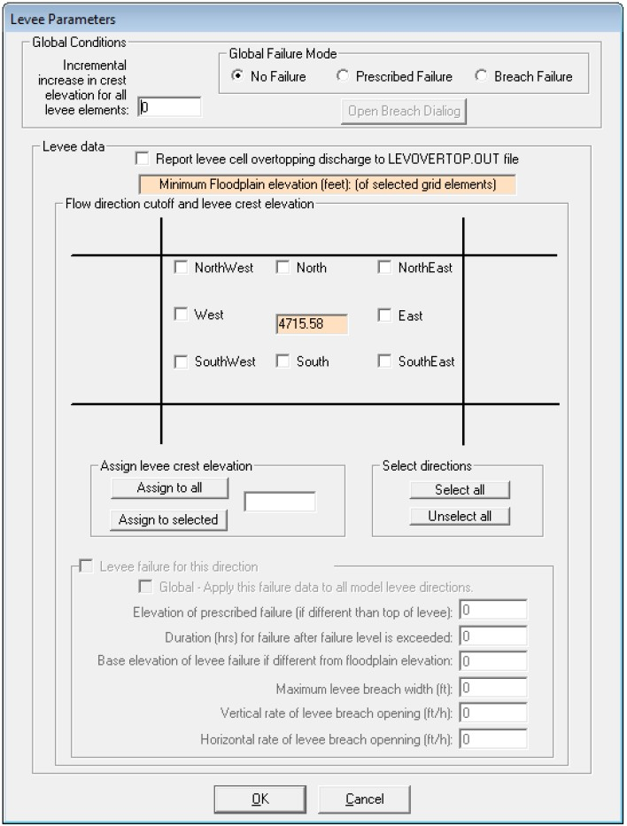

Each data entry is described below:

Incremental increase in crest elevation for all the levee nodes (RAISLEV)
^^^^^^^^^^^^^^^^^^^^^^^^^^^^^^^^^^^^^^^^^^^^^^^^^^^^^^^^^^^^^^^^^^^^^^^^^

Global incremental increase in levee crest elevation (ft or m) for all the levee grid elements.

    *Global Failure Mode* provides two modes of failure:

        *Prescribed failure* used to provide predetermined breach data in the bottom part of the dialog or

        *Breach* *failure* where the model simulates the breach erosion from overtopping or piping.
        In this case, breach parameters should be entered clicking the Open Breach Dialog button.

Flow direction cutoff direction
^^^^^^^^^^^^^^^^^^^^^^^^^^^^^^^

Check buttons to define the flow direction (of the 8 possible overland flow directions) that will be cutoff by a levee.

*Levee Crest Elevation* (LEVELEV)

Elevation (ft or m) of the top of the levee.

*Assign to all* button |assign_to_all_icon|

Assigns the cutoff flow direction and levee crest elevation to all selected grid elements.

Levee failure for this direction |assign_levee_input_parameters_icon|

Enables input parameters to be assigned for levee prescribed failure modeling for the selected direction.

Elevation of prescribed failure
^^^^^^^^^^^^^^^^^^^^^^^^^^^^^^^

Assign the maximum water surface elevation at failure (FAILEVEL) if is different than the levee crest (LEVELEV).
This enables the levee to fail prior to being overtopped.
Set the FAILEVEL variable to zero to simulate levee failure when it is overtopped.

Duration (hrs) for failure after failure level is exceeded (FAILTIME)
^^^^^^^^^^^^^^^^^^^^^^^^^^^^^^^^^^^^^^^^^^^^^^^^^^^^^^^^^^^^^^^^^^^^^

Duration in hours until levee failure after the FAILEVEL elevation is exceeded by the flow depth.
Set this variable to zero if the level fails immediately when overtopped or when FAILEVEL is exceeded.

Base elevation of levee failure if different from floodplain elevation (LEVBASE)
^^^^^^^^^^^^^^^^^^^^^^^^^^^^^^^^^^^^^^^^^^^^^^^^^^^^^^^^^^^^^^^^^^^^^^^^^^^^^^^^

The final elevation of the levee after failure is completed.
This enables the levee to fail to an elevation that is different from the floodplain elevation.
Set this variable to zero if levee failure results in the complete levee failure to the floodplain elevation.

Initial levee breach width (FAILWIDTH)
^^^^^^^^^^^^^^^^^^^^^^^^^^^^^^^^^^^^^^

The initial flow width (ft or m) of levee failure.
This flow width relates to one of the eight flow directions and should be less than the length of an octagon side (length of the side of a grid
element x 0.4142).

*Vertical rate of levee breach opening* (FAILRATE)

The rate of vertical levee failure (ft/hr or m/hr).

Horizontal rate of levee breach opening (FAILWIDRATE)
^^^^^^^^^^^^^^^^^^^^^^^^^^^^^^^^^^^^^^^^^^^^^^^^^^^^^

The rate at which the levee breach widens (ft/hr or m/hr).
The breach stops increasing if the breach exceeds the grid element width for that direction.

3.5.11 Assign Parameters to Selection/Multiple Channels (Grid Menu)

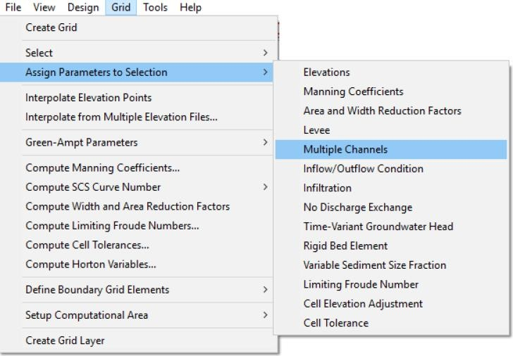

This command is used to define multiple channels that simulate rill and gully flow on the floodplain.
For this component, concentrated rill and gully flow (flow in rectangular channel) rather than overland sheet flow will be simulated to route the flow
between designated floodplain grid elements.
The following dialog box is used to input the multiple channel data:

3.5.12 Assign Parameters to Selection/Inflow/Outflow Condition (Grid Menu)

.. image:: img/GDS122.png

Use this command to define inflow and outflow elements in selected grid elements.
The In/Out Condition dialog box allows editing these boundary conditions:

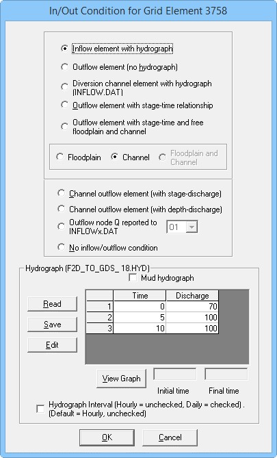

3.5.12.1 Setting inflow nodes
'''''''''''''''''''''''''''''

Clicking the first radio button will assign an inflow hydrograph to a grid element.
If there is a channel in the selected element, you can assign the hydrograph to either the channel or the floodplain.
When the user selects the radio button *‘Inflow element with hydrograph’,* the ‘\ *Hydrograph’* data group is activated.
The “\ *Read*\ ” button displays a dialog box to import a hydrograph with HEC-1, Tape21, HYD or ASCII files formats:

.. image:: img/GDS124.png

The HEC-1 file option will display all the hydrographs at basin concentration points in a Corps of Engineers HEC-1 hydrologic model output file.
The user can select an inflow hydrograph from the HEC-1 file:

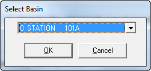

After selecting the HEC-1 hydrograph and clicking *‘OK’*, the hydrograph data are loaded into the

*Hydrograph* group table in the above dialog box.
\*.HYD files are ASCII files generated by the *GDS* to save the hydrograph data.
They are created with the “\ *Save Table*\ ” button.
The first line contains the initial and final time of the hydrograph selected with the “Select Time Interval” button.
The time and discharge discretized hydrograph pairs follow in two columns of data.
These files can be used to:

    - Recover the hydrographs when a project is read from a TOP file;
    - Redefine the project area when the INFLOW.DAT becomes obsolete because the grid element numbers change.
      The \*.HYD files enable the hydrographs to be recovered for assignment to new grid elements.
    - \*.HYD files permanently store hydrographs that could be imported to other projects or grid elements in the same project.

The “\ *Edit*\ ” button can be used to edit hydrograph values, insert rows, delete rows, or sort rows in ascending order (time column).
This button a displays an editor dialog box:

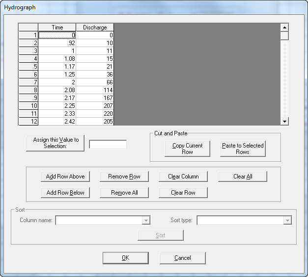

The “\ *View Graph*\ ” button of the above *In/Out Condition* dialog box plots the hydrograph in the following window:

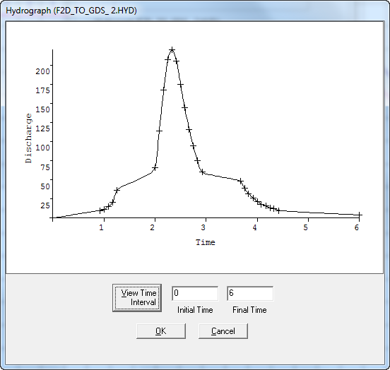

The user may select the initial and final time for the inflow hydrograph.
For example, selecting *Initial Time* = 10.0 hours and *Final Time* = 16.0 will redefine the hydrograph limits and in this eliminate a number of
unnecessary zero values on the rising and falling limbs of the hydrograph.

Inflow grid elements with assigned hydrographs are displayed in *GDS* with a distinct color for identification.
When the user selects “\ *No Inflow/Outflow condition*\ ” and clicks *‘OK’*, the grid element recovers its original color to indicate the absence of
an inflow or outflow node.
Inflow nodes and the linked hydrographs will be written to the INFLOW.DAT file.
Outflow nodes are assigned though the option “\ *Outflow element (no hydrograph)*\ ”.
The list of outflow nodes will be written to the OUTFLOW.DAT file.

Initial Assignment of Hydrographs
^^^^^^^^^^^^^^^^^^^^^^^^^^^^^^^^^

The initial assignment of hydrographs to inflow nodes has three options:

    1. *Project is created from FLO-2D project* (*GDS* command “\ *File.
       New Project from FLO-2D Project*\ ”).
       In this case INFLOW.DAT is used by the *GDS* system to assign hydrographs to pre-selected grid elements.

    2. All other methods of creating a project.
       The user will be required to create the grid system and then later right-click the selected inflow nodes to assign hydrographs as described above.

*3.5.12.2 Setting outflow nodes* These are the options for outflow nodes:

*3.5.12.3 Outflow element (no hydrograph):*

    .. image:: img/GDS128.jpg

    - Line ‘O’ for floodplain
    - Line ‘K’ for Channel
    - An element containing an outflow node must have a lower elevation than the contiguous upstream elements.
        - Floodplain element elevation will be reset to 0.1 ft lower than the lowest contiguous upstream element if the outflow node elevation is initially
          higher. This change occurs automatically at runtime.
        - Channel elements will generate an error in the GDS and when the engine is executed.
          An error report is written to the error.chk file and the channel bed elevation must be manually adjusted.

For this outflow assignment, the outflow nodes discharge all the inflow to them off the grid system using an approximate normal depth flow condition.
The outflow node is essentially a sink.

*3.5.12.4 Outflow element with hydrograph (diversion):*

    .. image:: img/GDS129.jpg

    - This diversion data is written to the INFLOW.DAT file.
    - This option is for Channels only.
    - The grayed-out appearance for FP and FP/Channel, indicating that those 2 commands are unavailable
    - This option is used to account for irrigation or any other kind of diversion from a channel in a Time / Discharge (cfs or cms) relationship.
    - If the discharge in the channel does not meet the level of the discharge in the diversion hydrograph, the element will divert all of the water it can
      take.
    - Any water that exceeds the diversion hydrograph will continue downstream.

*3.5.12.5* Outflow element with stage-time relationship\ *:*

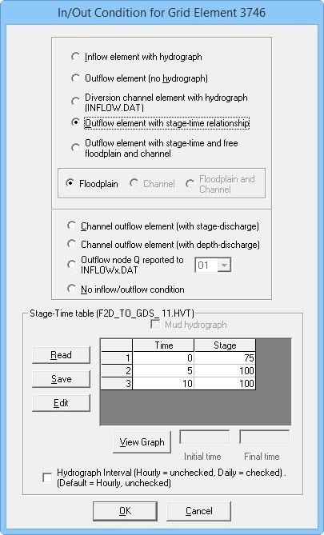

This option is for Channel and Floodplain.

    - The grayed-out appearance for FP/Channel, indicating that command is unavailable
    - No ‘O’ or ‘K’ lines (type 1)
    - Only ‘N’ lines for stage-time relationship.
    - FP and channel elements will be different only on the third column of the ‘N’ lines, the identifier will be different:

          o N Grid Cell FP_ID=0
          o N Grid Cell Channel_ID=1

    - Use this type of outflow when the downstream stage will add water to the modeling surface as.

          o Tsunamis
          o Storm stage
          o Downstream flooding stage. i.e. Mississippi River

    - The initial stage for each grid element should start at near ground elevation and ramp up to avoid volume conservation errors.
    - If the stage is lower than the grid element elevation, it is reset to the grid element elevation at runtime until the time that it goes above the grid
      element elevation.

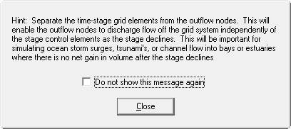

Use this water surface control to simulate flooding from storm surges/tsunamis or any type of water surface elevation control such as tidal effects or
time variable backwater conditions.
For example, it is possible to model the flooding in a coastal area produced by storm surges generated by tropical storms, hurricanes or tsunamis
where the ocean stage's rise and fall has a limited duration.
This condition can be assigned to nodes along the coastal boundary to simulate ocean flooding in an urban area.
The grid element with a stage-time relationship does not have to be along the red boundary.

*3.5.12.6 Outflow element with stage-time and free floodplain and channel:*

.. image:: img/GDS267.jpg

This option is for Channel or Floodplain.

    - Grey out appearance for FP/Channel, indicating that
      command is unavailable
    - Redundant ‘O’ or ‘K’ lines are needed depending on if
      the element is a FP cell or a channel cell.
    - ‘N’ lines for stage-time relationship are needed.
    - FP and channel elements will be different on the third
      column of ‘N’ Line, the identifier will be different:

        - N Grid Cell FP_ID=0
        - N Grid Cell Channel_ID=1
    - Use this configuration when a water surface elevation
      along a boundary needs to be held like with Flood
      Insurance Mapping.
    - The initial stage for each grid element should start at
      near ground elevation and ramp up to avoid volume
      conservation errors.
    - If the stage is lower than the grid element elevation, it is
      reset to the grid element elevation at runtime until the
      time that it goes above the grid element elevation.

.. image:: img/GDS268.jpg

This outflow condition is a combination of the stage-time relationship and normal depth outflow node for the either the floodplain or channel.
In this case, the water surface elevation is held along the boundary by the stage-time relationship.
Anything higher than the stage leaves the system through the same outflow node.
The main difference between this outflow condition and the previous one is that it will not add water to the upstream grid system.
The water is held at the node.

*3.5.12.7 Channel outflow element (with stage-discharge):*

This option is for channel outflow where a stage discharge relationship is known.

    - Assign this outflow node to a gaged channel element at the end of a project or a bridge at the end of a project.
    - Multiple curves can be used and a curve is valid up to the given depth.
      That is why it is called a Max Depth.
    - ‘H’ lines for discharge curve relationship are needed.
          o Max Depth o Coefficient
          o Exponent

Use this option to assign a stage-discharge relationship to the channel.
In this case, the channel outflow discharge will be controlled by assigned stage discharge pairs to simulate a weir, culvert or other water surface
hydraulic control.

*3.5.12.8 Channel outflow element (with depth-discharge):*

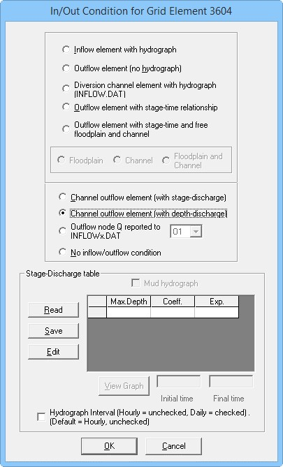

This option does not work.
I believe it was supposed to be used to fill in the time / discharge method for a channel element with a known time / discharge data set.
If a user needs to use the Time Discharge method, it is best to review the Data Input Manual.

Set it up in the OUTFLOW.DAT file as follows using a text editor.
It is space delimited and all characters are capitalized.

.. raw:: html

    <pre>
    K 1007
    T 0.0 0.00
    T 3.0 50.35
    T 5.0 157.67
    T 10.0 366.58
    </pre>

*3.5.12.9 Outflow node Q reported to INFLOWx.DAT:*

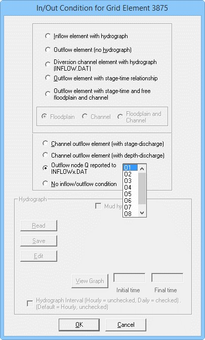

This option is used for capturing the discharge from an upstream model.

    - See Lesson 13 for a tutorial on how to use this method.
    - All flow captured by the outflow node will be written to a corresponding INFLOWx.DAT file.
    - The two grid systems must overlap at the boundary to set the data up correctly.

Use this option to assign a stage-discharge relationship to the channel.
In this case, the channel outflow discharge will be controlled by assigned stage discharge pairs to simulate a weir, culvert or other water surface
hydraulic control.

3.5.12.10 No Outflow Condition

.. image:: img/GDS135.jpg

Use this option to clear the In/Out condition from any element.
Select the elements with either an inflow or outflow condition and click the radio button.
Click OK to delete the data from the INFLOW.DAT and OUTFLOW.DAT files.

3.5.13 Parameters to Selection/Infiltration (Grid Menu)

.. image:: img/GDS136.jpg

Use this option to assign infiltration data to the selected grid elements in the following dialog box:

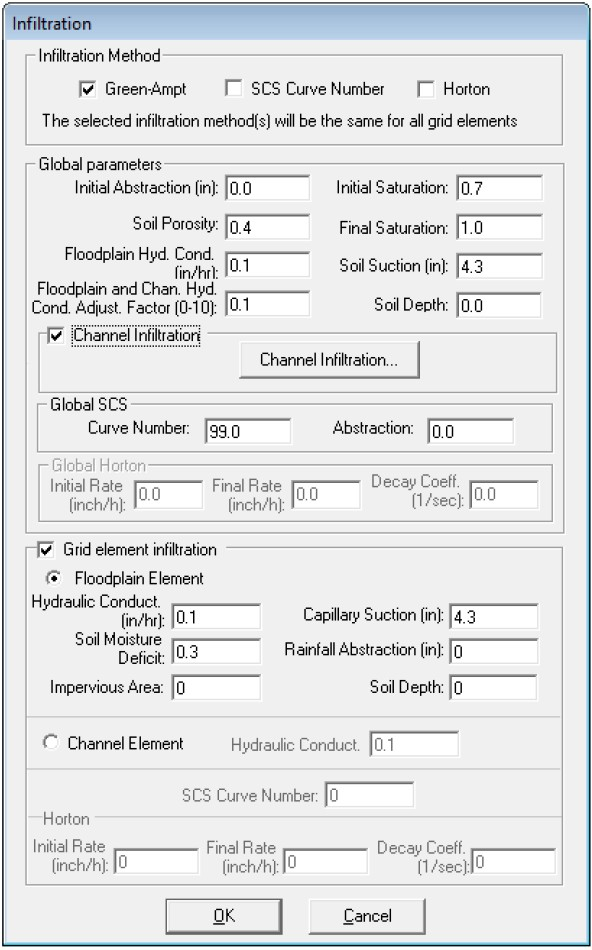

3.5.14 Parameters to Selection/No Discharge Exchange (Grid Menu)

.. image:: img/GDS290.jpg

Identify channel elements that will not exchange discharge with the floodplain (e.g.

channel culvert or enclosed channel where no floodplain inflow can occur).

3.5.15 Assign Parameters to Selection/Time-Variant Groundwater Head (Grid Menu)

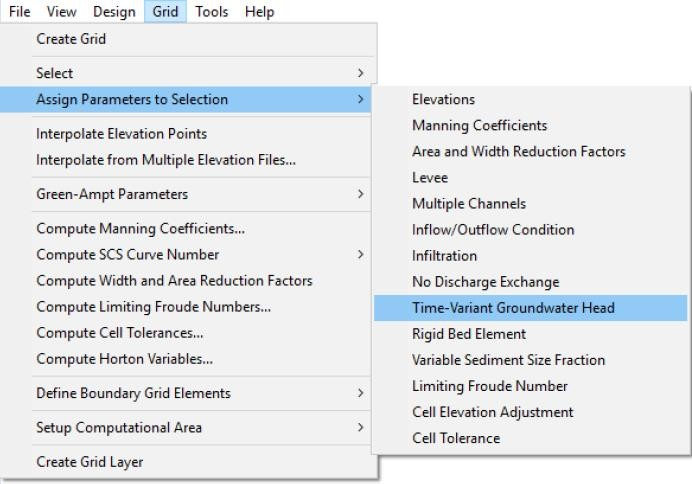

Use this command when using the *MODFLOW* groundwater flow model link to impose a time series of groundwater head at the selected nodes.

3.5.16 Parameters to Selection/Rigid Bed Element (Grid Menu)

.. image:: img/GDS139.jpg

Setup elements that do not scour during the sediment transport simulation.

3.5.17 Assign Parameters to Selection/Variable Sediment Size Fraction (Grid Menu)

.. image:: img/GDS291.jpg

This command requires the definition of transport equations.
See “Tools.
Mud and Sediment Transport”

3.5.18 Assign Parameters to Selection/Limiting Froude Number (Grid Menu)

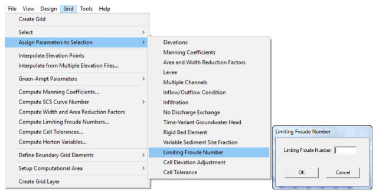

Use this command to setup spatially variable limiting Froude numbers.

3.5.19 Assign Parameters to Selection/Cell Elevation Adjustment (Grid Menu)

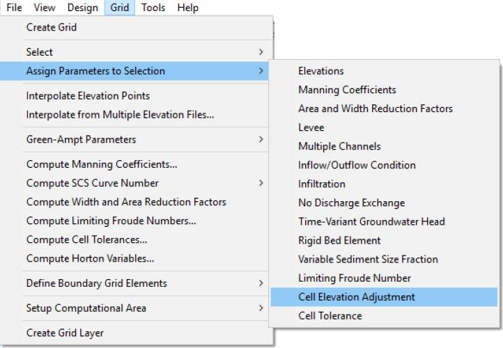

Use this command to adjust elevations for the selected cells and their neighbors:

.. image:: img/GDS141.jpg

3.5.20 Assign Parameters to Selection/Cell Tolerance (Grid Menu)

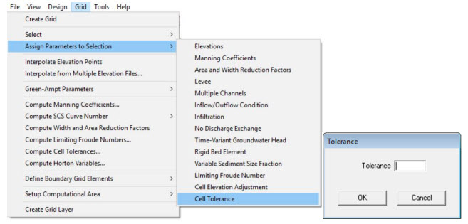

Assign cell tolerances to the selected cells.

3.5.21 Interpolate Elevation Points (Grid Menu)

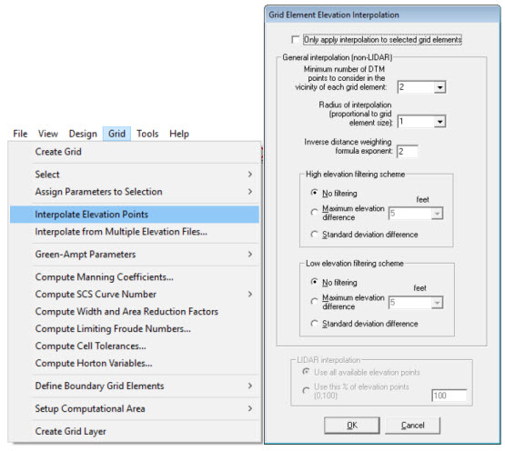

Use this command to interpolate and assign all the grid element elevations in the computational domain.
The interpolated elevations are based on the imported DTM points or the elevation points that are added to the working region.
The interpolation options are selected in the *Options/Interpolation* command of the *Tools* menu.
The following table describes the interpolation method.

.. |idw_eq| image:: img/idw_equation.jpg
   :height: 1.2em
   :align: middle

.. list-table::
   :widths: 50 50
   :header-rows: 0

   * - **Option**
     - **Description**

   * - Minimum number of DTMpoints to consider in the vicinity of each

       grid element
     - To calculate the interpolated elevation that will represent each

       grid element, the algorithm analyzes at least the minimum number

       of points closest to the grid element node.

   * - Radius of interpolation(proportional to grid element size)
     - This radius defines a circle around each grid element node based

       on a multiple of the grid elements side.

       Only DTM or assigned elevation points inside this radius are

       considered in the interpolation process.

       If no elevations point exists, the circle is automatically enlarged

       until at least the minimum number of points is found.

   * - Inverse distance weighting formula exponent
     - This is “n” in the Inverse Distance Weighting Formula:

       |idw_eq|

       Where Z¯ is the interpolated grid element elevation, Z\ :sub:`j` is

       the elevation of DTM point :sub:`j`, r\ :sub:`ij` is the distance from

       the DTM point :sub:`j` to center of grid element :sub:`i` and NDTM is the

       total number of DTM points.

   * - No filtering (High or LowElevations)
     - No filtering is performed on the elevation points.

   * - Maximum elevation difference (High or Low Elevations)
     - For this option, the algorithm calculates a mean elevation using all

       the DTM and assigned elevation points within the interpolation radius.

       All those points that exceed the selected maximum elevation difference

       higher (or lower in the case of Low Elevation filter) than the mean are

       discarded and the mean elevation is recomputed and assigned to the grid element.

   * - Standard deviationdifference(High or Low Elevations)
     - The interpolation algorithm calculates the standard deviation of DTM point

       elevations and then neglects all those points whose elevations are higher

       (or lower in the case of the Low Elevation filter) than the standard

       deviation to determine the mean elevation to represent the grid element.

3.5.22 Interpolate Elevation Points from Multiple Elevation Files...
(Grid Menu)

Use this command to interpolate and assign grid element elevations in the computational domain.
The interpolated elevations are based on the imported LIDAR ASCII file.
The interpolation options are selected in the *Options/Interpolation* command of the *Tools* menu.

Previous versions of the FLO-2D Grid Developer System (GDS) provided a method to interpolate terrain elevations that required importing all points.
The original procedure was not able to process more than about 15 million points due to limitations on the development tools used to create GDS.
To circumvent this limitation and allow the processing of virtually unlimited number of elevation point data, FLO-2D Software has developed a new
method that does not require importing the points and significantly extends the model interpolation capability.
This section of the manual summarizes the functionality of the new tool and provides simple instructions how to use it.

Data requirements
^^^^^^^^^^^^^^^^^

The new interpolation tool reads data files in any of the following data ASCII formats.

1. Space or comma delimited ASCII files, 3 data values per line.
   These files contain three values on each line as follows:

   X_Coordinate Y_Coordinate Elevation

.. raw:: html

    <pre>
        Example of space delimited file:
    369941.27 1183607.125 4654.71
    369946.27 1183608.125 4654.50
    369951.27 1183609.125 4654.29
    </pre>

.. raw:: html

    <pre>
        Example of comma delimited file:
    369941.27 , 1183607.125 , 4654.71
    369946.27 , 1183608.125 , 4654.50
    369951.27 , 1183609.125 , 4654.29
    </pre>

2. Space or comma delimited ASCII files, 5 data values per line.
   These files contain five values on each line as follows:

   ID X_Coordinate Y_Coordinate Elevation Value

For this file format only the point coordinates and elevation value is used.
The first column (ID) and last column (Value) are ignored.

.. raw:: html

    <pre>
        Example of space delimited file:
    X1 369941.27 1183607.125 4654.71 777
    X2 369946.27 1183608.125 4654.50 717
    X3 369951.27 1183609.125 4654.29 282
    </pre>

.. raw:: html

    <pre>
        Example of comma delimited file:
    X1,369941.27,1183607.125,4654.71,777
    X2,369946.27,1183608.125,4654.50,717
    X3,369951.27,1183609.125,4654.29, 282
    </pre>

3. List of elevation data files ELEVFILES.DAT:

This optional file contains the list of files including path and name.
It needs to be created by the user with any text editor program and facilitates handling hundreds or thousands of files which may be difficult to
select using a standard MS-Windows file handling dialog box.
Users may mix any of the supported formats, i.e., some files may be 3 column space delimited, and others five columns comma delimited, etc.
All files must have.TXT extension.

.. raw:: html

    <pre>
        Example of ELEVFILES.DAT file:
    C:\\Tracks\\PROJECTS\\FLO2D\\2009\\Goat2009\\dtm1.TXT
    C:\\Tracks\\PROJECTS\\FLO2D\\2009\\Goat2009\\dtm2.TXT
    C:\\Tracks\\PROJECTS\\FLO2D\\2009\\Goat2009\\dtm 5 columns1.TXT
    C:\\Tracks\\PROJECTS\\FLO2D\\2009\\Goat2009\\dtm 5 columns2.TXT
    </pre>

.. note:: All elevation ASCII files, regardless of their format must have extension .TXT.

User instructions
^^^^^^^^^^^^^^^^^

It is required that the user creates a FLO-2D grid and computational boundary prior to interpolation.
To interpolate use the Interpolate from Multiple Elevation Files… from the GDS Grid menu.

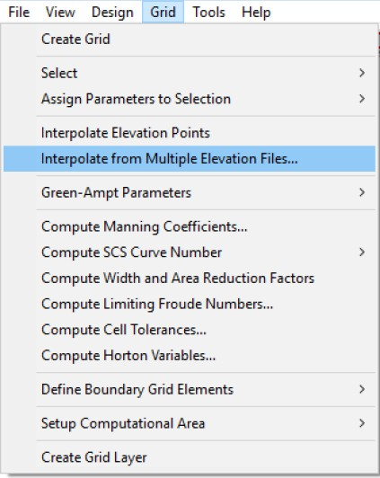

That command will bring up a file selection dialog:

.. image:: img/GDS143.jpg

There are two options:

    1. Users can select an ELEVFILES.DAT file, if available, and import the list of elevation files in the format discussed in the previous section or
    2. Users can select the actual elevation data files.
       It is necessary to change the default file extension to .TXT to select a group of ASCII elevation files.

For either option, clicking Open, displays the interpolation dialog box:

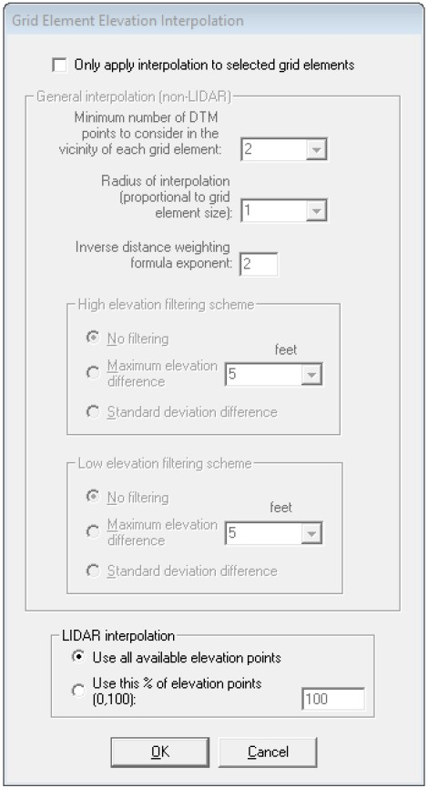

There are two LiDAR interpolation options to choose from.
The default is *Use all available elevation points*, which will compute the interpolated elevations using all points within each grid element.
Selecting the *Use this % of elevation points* will calculate the elevation using the assigned subset of points on each grid element.
The % is a global value based on the average number of elevation points per grid element.

Interpolation method
^^^^^^^^^^^^^^^^^^^^

If the user selects Use all available elevation points option, the GDS will compute the grid element elevation using the elevation average of all
points on the element.
The GDS does not import or display the elevation points, but instead reads one point at a time, determines the grid element where the point is located
and computes the average elevation.
A similar procedure is followed if the user selects a subset of points but GDS will calculate the elevation using the indicated percentage of points
on the element.

If no elevation points are found on an element or if the number of points is less than the specified percentage, a tag value of -9999 will be assigned
to that element.
Also the element will be highlighted in black as shown:

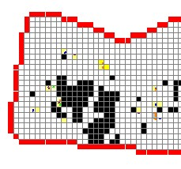

If there is at least one element without a calculated elevation, a dialog box will be displayed presenting three options to assign elevations to those
grid elements:

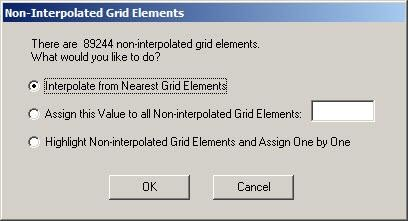

The Interpolate from Nearest Grid Elements option will compute an elevation by assessing the elevation data in the neighboring 8 grid elements and
averaging the point elevations (-9999 values are not used).
The algorithm initiates from the periphery of a cluster of non-interpolated grid elements and proceeds to the interior of the cluster ensuring that at
the end of the procedure all grid elements will be assigned an elevation.

The user can assign a value to all -9999 grid elements using Assign this Value to all Noninterpolated Grid Elements.
The third option will leave all un-interpolated elements with the 9999 tag.
The user will need to double click and assign a desired elevation for each one.

.. important:: The GDS will initiate a FLO-2D model simulation if there are elements with the -9999 tag.
   The new Non-Interpolated Grid Elements command on the View menu turns on or off the black unassigned grid elements.*

3.5.23 Compute Green-Ampt Parameters (Grid Menu)

.. image:: img/GDS147.jpg

This command is the starting point for the Green-Ampt parameter calculations.
There are several steps that have to be completed in a prescribed sequence.
The final result is the creation of the INFIL.DAT file containing the Green-Ampt infiltration parameters.
To initiate this procedure, you have to load a landuse shape file and a soil shape file and the corresponding soil and landuse tables must be
available.
In addition, the *FLO-2D* grid system data files must exist.
The general procedure is as follows:

    1. Load the land use shape file and table.
    2. Load the soil shape file and table.
    3. For each grid element compute hydraulic conductivity (*XKSAT)* average.
    4. View the landuse and soil interface.

.. math::
   :label:

   \overline{XKSAT}
   = ALOG\!\left(
       \frac{\sum A_i\, \log(XKSAT_i)}{A_{GE}}
     \right)

Where:

   *XKSAT\ i* is obtained from the soil table and

   *A\ i* is subarea intercepted by the grid element from the 3\ :sup:`rd` column of the landuse table and *A\ GE* the grid element area.

    5. For each grid element, compute wetting front capillary suction PSIF according to the following regressions as a function of *XKSAT* (Generated from
       Figure 4.3 of the Maricopa County Drainage Design Manual, Volume I).

.. raw:: html

   <table style="border-collapse: collapse; width: 100%; border:1px solid #000;">
     <thead>
       <tr>
         <th style="border:1px solid #000; padding:4px;">XKSAT (in/hr)</th>
         <th style="border:1px solid #000; padding:4px;">PSIF (in)</th>
       </tr>
     </thead>

     <tbody>
       <tr>
         <td style="padding:4px; text-align:center;">
           0.01 &le; XKSAT &le; 1.2
         </td>
         <td style="padding:4px; text-align:center;">
           PSIF = EXP(0.9813 - 0.439 * Ln(XKSAT) + 0.0051 (Ln(xksat))2 + 0.0060 (Ln(XKSAT))3)
         </td>
       </tr>
     </tbody>
   </table>

6. For each grid element, compute volumetric soil moisture deficiency *(DTHETA)* according to the following table.
   The specific table used for DTHETA depends on the *saturation* field of the soil table (6th column).

Saturation = DRY

.. raw:: html

   <table style="border-collapse: collapse; width: 100%; border:1px solid #000; margin-bottom:10px;">
     <thead>
       <tr>
         <th style="border:1px solid #000; padding:4px;">XKSAT (in/hr)</th>
         <th style="border:1px solid #000; padding:4px;">DTHETA DRY</th>
       </tr>
     </thead>

     <tbody>
       <tr>
         <td style="padding:4px; text-align:center;">0.01 &le; XKSAT &le; 0.15</td>
         <td style="padding:4px; text-align:center;">DTHETA = EXP(-0.2394 + 0.3616&nbsp;Ln(XKSAT))</td>
       </tr>

       <tr>
         <td style="padding:4px; text-align:center;">0.15 &lt; XKSAT &le; 0.25</td>
         <td style="padding:4px; text-align:center;">DTHETA = EXP(-1.4122 - 0.2614&nbsp;Ln(XKSAT))</td>
       </tr>

       <tr>
         <td style="padding:4px; text-align:center;">0.25 &lt; XKSAT &le; 1.2</td>
         <td style="padding:4px; text-align:center;">DTHETA = 0.35</td>
       </tr>
     </tbody>
   </table>

   
Saturation = NORMAL

Saturation = NORMAL

.. raw:: html

   <table style="border-collapse: collapse; width: 100%; border:1px solid #000; margin-bottom:10px;">
     <thead>
       <tr>
         <th style="border:1px solid #000; padding:4px;">XKSAT (in/hr)</th>
         <th style="border:1px solid #000; padding:4px;">DTHETA NORMAL</th>
       </tr>
     </thead>

     <tbody>
       <tr>
         <td style="padding:4px; text-align:center;">0.01 &le; XKSAT &le; 0.02</td>
         <td style="padding:4px; text-align:center;">DTHETA = EXP(1.6094 + Ln(XKSAT))</td>
       </tr>

       <tr>
         <td style="padding:4px; text-align:center;">0.02 &lt; XKSAT &le; 0.04</td>
         <td style="padding:4px; text-align:center;">DTHETA = EXP(-0.0142 + 0.5850&nbsp;Ln(XKSAT))</td>
       </tr>

       <tr>
         <td style="padding:4px; text-align:center;">0.04 &lt; XKSAT &le; 0.1</td>
         <td style="padding:4px; text-align:center;">DTHETA = 0.15</td>
       </tr>

       <tr>
         <td style="padding:4px; text-align:center;">0.1 &lt; XKSAT &le; 0.15</td>
         <td style="padding:4px; text-align:center;">DTHETA = EXP(1.0038 + 1.2599&nbsp;Ln(XKSAT))</td>
       </tr>

       <tr>
         <td style="padding:4px; text-align:center;">0.15 &lt; XKSAT &le; 0.4</td>
         <td style="padding:4px; text-align:center;">DTHETA = 0.25</td>
       </tr>

       <tr>
         <td style="padding:4px; text-align:center;">0.4 &lt; XKSAT &le; 1.2</td>
         <td style="padding:4px; text-align:center;">DTHETA = EXP(-1.2342 + 0.1660&nbsp;Ln(XKSAT))</td>
       </tr>
     </tbody>
   </table>

   
Saturation = WET or SATURATED

Saturation = WET or SATURATED

.. raw:: html

   <table style="border-collapse: collapse; width: 60%; border:1px solid #000; margin-top:10px;">
     <tbody>
       <tr>
         <td style="padding:6px; text-align:center;">
           <strong>DTHETA = 0 for all XKSAT</strong>
         </td>
       </tr>
     </tbody>
   </table>

7. Adjust *XKSAT* (computed in step No.
   1) as a function of the vegetation cover VC from the 5th field of the landuse table when XSAT < 0.4 in/hr.
   This requires a computation of the ratio the hydraulic conductivity for the vegetative cover to the bare ground hydraulic conductivity (C\ :sub:`K`):

.. math::
   :label:

   C_k = \frac{VC_k - 10}{90} + 1

.. math::
   :label:

   XKSATC = XKSAT \sum_{k} P_k\, C_k

Where:

    P\ :sub:`k` is the percentage of the area within the grid element corresponding to C\ :sub:`k` and XKSATC for each grid element is written to the
    INFIL.DAT file.

8. For each grid element compute the initial abstraction *IABSTR*:

.. math::
    :label:

    IABSTR = \left( \frac{\sum{A_i (IA_i)}}{A_{GE}} \right)

Where:

   *IA\ i* is the initial abstraction in the subarea *A\ i* intercepted by the element and is based on the 3\ :sup:`rd` column of the landuse table;

   The intercepted subareas are computed using the land use shape file and *IABSTR* is added to the INFIL.DAT file for each element.

Compute effective impervious area (%) for each grid element *(RTIMP)*.

.. math::
    :label:

    RTIMP\_1 = \left( \frac{\sum{A_i (RTIMPS \cdot EFF)_i}}{A_{GE}} \right)

Where:

   *Ai* is determined from the soil shape file;

   *A\ GE* is the grid element area, effective impervious area *EFF* is obtained from the 5\ :sup:`th` column of the soil table and

   *RIMPS* is the percent rock outcrop obtained from the 4\ :sup:`th` column of the soil table.

.. math::
    :label:

    RTIMP = RTIMP\_1 + \left( \frac{\sum{A_i (RTIMPL)_i}}{A_{GE}} \right)

Where:

   *Ai* is obtained from land use shape file and

   *A\ GE* is the grid element area and *RTIMPL* is obtained from the 4\ :sup:`th` column of the land use table.

The steps to complete Green-Ampt parameter computation are as follows.
Open the Compute Green Ampt Parameters Dialog box as it was shown above.

Load the land use shape file and table and select the field as shown:

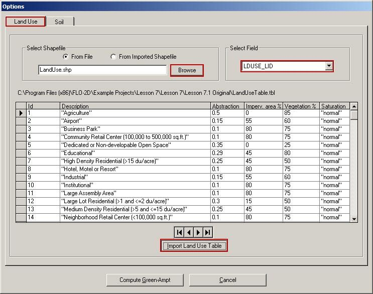

.. image:: img/GDS149.jpg

Load the soil shape file and table and select the field as shown:

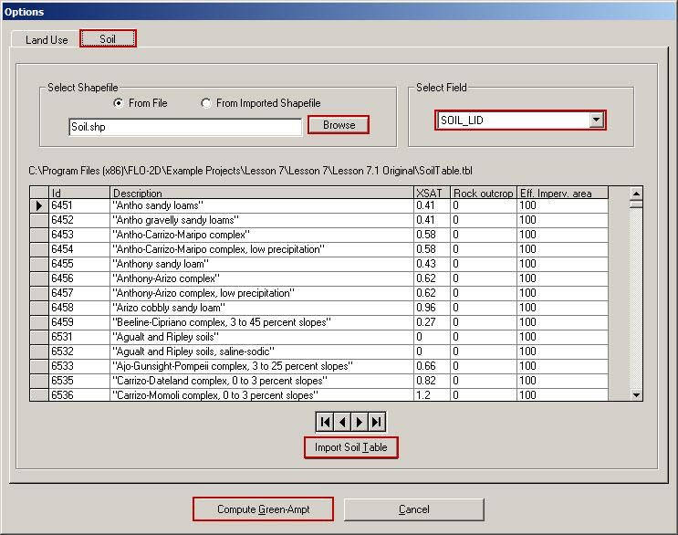

Click *‘Compute Green-Ampt’* to compute.
This procedure may take several minutes depending on the number of grid elements and the number of landuse polygons.

.. image:: img/GDS151.jpg

Next you can view the polygon intersections.

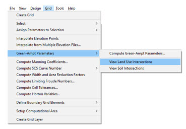

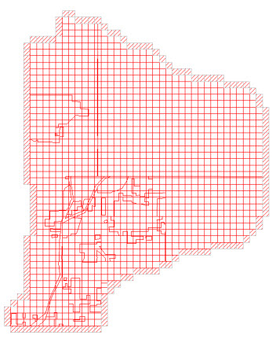

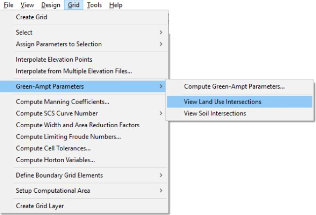

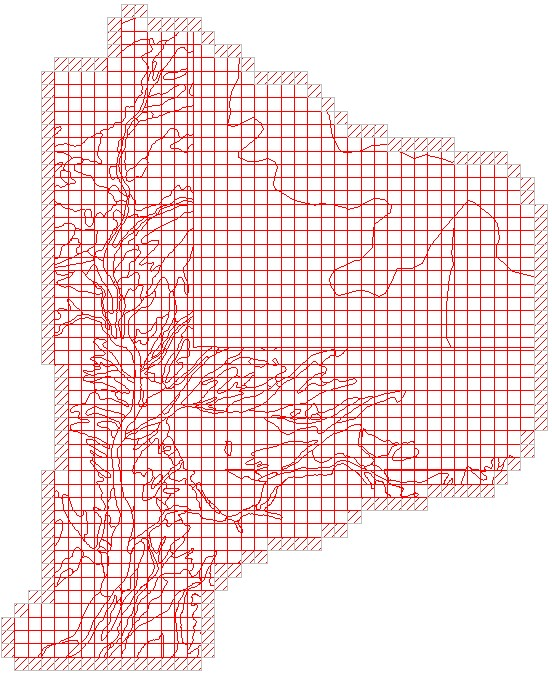

3.5.24 Compute Manning Coefficients… (Grid Menu)

.. image:: img/GDS154.jpg

This command will compute the Manning’s n-values based on the information in a roughness shape file.
With a project open, first import a Manning’s n-value shape file using the *Import Shape File* command on the File menu.
When you click the *Compute Manning Coefficients* command, the following dialog box appears:

.. image:: img/GDS155.png

Select the Manning shape file name (MANNING.SHP in this case) and the Manning coefficient field (N_VALUE in this case) and click *‘OK’* to calculate
Manning coefficients for each grid element.
Please note that the n-value data will be written to the FPNVALUE.DAT when the FLO2D files have been saved.

3.5.25 Compute SCS Curve Number … (Grid Menu)

This command will compute the Curve Number for each grid element based on information contained in shape files.

The SCS runoff curve number loss method is a function of the total rainfall depth and the empirical curve number parameter which ranges from 1 to 100
and is a function of hydrologic soil type, land use and treatment, surface condition and antecedent moisture condition.
The method was developed on 24 hour hydrograph data on mild slope eastern rural watersheds in the United States although runoff curve numbers have
been calibrated or estimated for urban areas, agricultural lands and semi-arid range lands.
The SCS CN method does not account for variation in rainfall intensity.
The method was developed for predicting rainfall runoff from ungaged watersheds and its attractiveness lies in its simplicity.
For large basins (especially semiarid basins), the method tends to over predict runoff using the standard curve number tables which has unique or
variable infiltration characteristics such as channels (Ponce, 1989).

Assigning Curve Numbers to Grid Elements
^^^^^^^^^^^^^^^^^^^^^^^^^^^^^^^^^^^^^^^^

The general procedure is to assign curve numbers in the *GDS* and then run the *FLO-2D* model with the infiltration component “turned on” and the
infiltration switch set the SCS-CN option.
The following options are available to assign curve numbers to grid elements:

    1. Select area using a polygon and assigning a CN number.
       In this case the CN's are assumed known.
    2. Import a CN polygon shape file and intercept the shape file polygons with the grid elements and interpolate the weighted average computed CN’s.
       In this case the CN numbers are known.
    3. Import three polygon shape files for hydrologic soil group (HSG), land cover, and impervious cover and the *GDS* will incept, interpolate and compute
       the CN’s for each grid element based on the Pima County procedure.
       In this case the CN are not known

Determining CN’s Using the Pima County Method
^^^^^^^^^^^^^^^^^^^^^^^^^^^^^^^^^^^^^^^^^^^^^

*GDS* uses the Pima County Method to determine the CN’s using polygon shape files (SF) for soil, land cover and impervious cover.
Using this shape file data with the accompany attribute tables, the polygon intersection with the grid element are determined to assign a hydrologic
soil group, percent cover density and impervious area for each grid element.
Then the CN’s are computed using various formulas depending on soil groups and the results are written to the *FLO-2D* INFIL.DAT file.
The following procedure is applied:

    1. Import soil, land cover and impervious cover shape files to the *GDS* graphical project environment.
    2. Select the ID for the HSG from Soil shape file (landsoil.shp).
       The attribute may have both soil and group and the percentage for each group (e.g. B31%C69%Desert Brush).
       For each polygon the following attribute information is required:

       a. Cover type (e.g. Desert Brush)
       b. Soil group (e.g. B and C)
       c. Percentage of soil groups (B=35% and C = 69%).
          If only the group is given (e.g. B) then assume 100%.

    3. Select ID for Cover density percentage from land cover shape file (land.shp).
    4. Select ID for impervious areas from impervious cover shape file (imperv.shp)
    5. Determine polygon intersections with each grid element for each SF (soil, land cover and impervious cover) and determine the area weighed average of
       each variable:

    .. math::
        :label:

        Var = \frac{\sum A_i Var_i}{A_{GE}}

    Where:

       *Var\ i* is the current variable from the shape file; *A\ i* is subarea intercepted by the grid element and

       *A\ GE* the grid element area.

       At the end of this process each grid element has been assigned:

            a. HSG from Soil shape file.
            b. Cover density percentage CD.
            c. Impervious area.

    6. Use formulas in Table 1 to determine CN using CD and the corresponding soil group (e.g. CN = (CN soil B \* (B%) + CN soil C \* (C%) + %impervious\*
       99)/100) where: CN for impervious area is 99 and areas for each soil group within a grid element need to be adjusted depending on the impervious area:
       B% = B%(in SF) \* (100-%impervious), etc.
    7. Write CN results to the INFIL.DAT.

To determine CN’s, functional relationships were derived from Figure D-1 of the Pima County Hydrology Procedures (Appendix D) reproduced here:

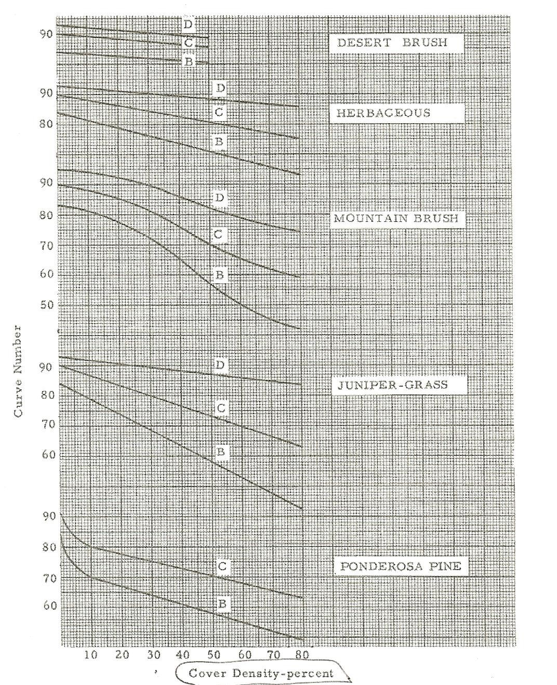

Figure D-1 of Pima County Hydrologic Procedures Relating CN to Hydrologic Soil Cover and Density

These relationships are summarized in the following table.

Table 1: Relationships for Evaluating the CN Based on Hydrologic Soil Cover and Cover Density

.. list-table::
   :widths: 12 12 12 12 12 12 12 12
   :header-rows: 0

   * - **HSC**
     -
     -
     - **Cover density (CD) Range**
     - **Formula**
     - **A**
     - **B**
     - **C**

   * - **DESERT BUSH**
     -
     -
     -
     -
     -
     -
     -

   * -
     -
     - **D**
     - 0-50
     - CN = A \* CD + B
     - -0.08
     - 93
     -

   * -
     -
     - **C**
     - 0-50
     - CN = A \* CD + B
     - -0.08
     - 90
     -

   * -
     -
     - **B**
     - 0-50
     - CN = A \* CD + B
     - -0.07
     - 84
     -

   * - **HERBACEOUS**
     -
     -
     -
     -
     -
     -
     -

   * -
     -
     - **D**
     - 0-80
     - CN = A \* CD + B
     - -0.0875
     - 93
     -

   * -
     -
     - **C**
     - 0-80
     - CN = A \* CD + B
     - -0.1875
     - 90
     -

   * -
     -
     - **B**
     - 0-80
     - CN = A \* CD + B
     - -0.2625
     - 84
     -

   * - **MONTAIN BRUSH**
     -
     -
     -
     -
     -
     -
     -

   * -
     -
     - **D**
     - 0-80
     - CN = A \* CD^2 + B \* CD + C
     - -0.0013
     - -0.1737
     - 95

   * -
     -
     - **C**
     - 0-80
     - CN = A \* CD^2 + B \* CD + C
     - -0.0014
     - -0.2942
     - 90

   * -
     -
     - **B**
     - 0-80
     - CN = A \* CD^2 + B \* CD + C
     - -0.0025
     - -0.3522
     - 83

   * - **JUNIPER-GRASS**
     -
     -
     -
     -
     -
     -
     -

   * -
     -
     - **D**
     - 0-80
     - CN = A \* CD + B
     - -0.1125
     - 93
     -

   * -
     -
     - **C**
     - 0-80
     - CN = A \* CD + B
     - -0.34375
     - 90.5
     -

   * -
     -
     - **B**
     - 0-80
     - CN = A \* CD + B
     - -0.525
     - 84
     -

   * -
     -
     -
     -
     -
     -
     -
     -

   * - **PONDEROSAPINE**
     -
     -
     -
     -
     -
     -
     -

   * -
     -
     - **C**
     - 0-10
     - CN = A \* CD^2 + B \* CD + C
     - 0.08
     - -1.9
     - 91

   * -
     -
     -
     - 10-80
     - CN = A \* CD + B
     - -0.242857
     - 82.42857
     -

   * -
     -
     - **B**
     - 0-10
     - CN = A \* CD^2 + B \* CD + C
     - 0.1
     - -2.4
     - 84

   * -
     -
     -
     - 10-80
     - CN = A \* CD + B
     - -0.3
     - 73
     -

   * -
     -
     -
     -
     -
     -
     -
     -

   * - **Legend**
     -
     -
     -
     -
     -
     -
     -

   * -
     - HSC
     - Hydrologic
     - Soil Cover
     -
     -
     -
     -

   * -
     - CN
     - Curve Numb
     - r
     -
     -
     -
     -

   * -
     - CD
     - Cover Dens
     - ty (%)
     -
     -
     -
     -

   * -
     - A, B
     - Constants
     -
     -
     -
     -
     -

For each soil group, a different formula was developed that calculates CN from the Cover

Density (CD).
For straight line segments a linear equation was used to represent that soil cover.
For curved segments of the Excel curve fitting routines to determine the best-fit coefficients to represent the soil cover.
Errors were estimated for each formula.
Table 2 summarizes the validation and errors for each soil group set of formulas:

In the *GDS* *Grid* menu there is a new command titled: *Compute SCS Curve Number*.
This has two options: From *Single Shape File…* and *From Multiple Shape Files*.

.. image:: img/GDS157.jpg

Assignment of CN’s Based on a Single Shape File
^^^^^^^^^^^^^^^^^^^^^^^^^^^^^^^^^^^^^^^^^^^^^^^

Using this option, the *GDS* will determine the CN for each grid element based on a user provided polygon shape file that contains a CN for each
polygon.
First import the shape file using the *Import Shape File…* command in the *GDS* *File* menu.

Then use the *Grid/Compute SCS Curve Number/From Single Shape File…* command

In the dialog box, select the Curve Number Shape file (LANDSOIL.SHP in this example) and the Curve Number Field (CurveNum in this example):

.. image:: img/GDS158.png

*GDS* will intersect the shape file polygons with the grid elements and determine the area weighted average value for each grid element.

Computation of CN’s Base on a Multiple Shape Files

This option computes the CN’s based on the method explained in above sections.
It is necessary to import three polygon shape files for HSG, Land cover, and Impervious cover.
After these shape file have been imported using the *Import Shape File…* command in the *GDS* *File* menu, then use the *Grid/Compute SCS Curve
Number/From Multiple Shape Files* command

The following dialog box will be displayed:

    .. image:: img/GDS159.png

    1. Select the Hydrologic Soil Group Shape File and soil group field (landsoil.shp and LandSoil respectively in this example).

    2. Select the Land Cover Shape File and land cover attribute field (land.shp and cov_dens respectively in this example).

    3. Select the Impervious Area Shape File and impervious ID filed (Imperv.shp and IMP respectively in this example).

    4. Click OK.

*GDS* will intersect the shape files polygons with the grid elements and determine the area weighted average value for each grid element, based on the
derived formulas previously discussed.
Double-clicking on any grid element the new Infiltration dialog box will display the CN calculated for that element.
*GDS* will create the new INFIL.DAT data file with the new CN’s for all grid elements.

*FLO-2D* Infiltration Computation Using the SCS Curve Number Method *GDS* will create the new INFIL.DAT data file with the CN for all grid elements.

3.5.26 Compute Width and Area Reduction Factors … (Grid Menu)

.. image:: img/GDS297.jpg

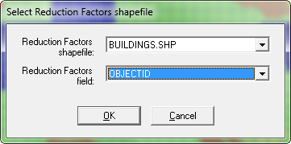

This command will compute the ARF and WRF factors from a polygon shape file of the buildings.
The correction factor is a percentage and each ARF or WRF variable that is computed will be reduced by a multiplicative percentage factor.

GDS ARF-WRF assignment from Shape Files

Loss of flood storage due to buildings and other urban features can be graphically assigned through the Grid Developer System (GDS) using individual
or polygon grid element selection.
A new GDS procedure permits the automatic assignment of Area Reduction Factors (ARF) and Width Reduction Factors (WRF) from a polygon Shape File.
The GDS will compute ARFs and WRFs assuming the polygons fully block the grid element corresponding surface areas, but also allows for global
adjustments of either ARFs or WRFs based on user defined blockage percentages (fractions).
This document summarizes the functionality of the new tool and provides instructions how to use it.

Data requirements

The ARF-WRF assignment tool requires the following data:

    1. FLO-2D data files for a basic overland flood simulation and
    2. A polygon Shape File where each polygon represents a building or obstruction to the flow Computation Method

Computation Method

For each grid element (cell), the GDS finds all Shape File polygon intersections with the cell.
The following figure shows an example where three polygons (building polygons) intersect a cell defining three areas A, B and C:

.. image:: img/GDS161.png

Area Reduction Factor

To calculate the Area Reduction Factor for this cell GDS performs the following operations:

.. math::
   :label:

   Total\_Intersected\_Area = AreaA + AreaB + AreaC

.. math::
   :label:

   Area\_Reduction\_Factor = \frac{Total\_Intersected\_Area}{Cell\_Area}

Where AreaA is the intersected area of polygon A with the cell, and AreaB and AreaC are defined accordingly.
Cell_Area is the Grid Element area.

Width Reduction Factor

To calculate the Width Reduction Factor for this cell the GDS performs the following operations:

The grid element or cell is divided into 9 subcells.
Each subcell is intersected with the polygons on the cell.
For example in the following configuration the SE WRF is computed based on the yellow area of the polygon:

.. image:: img/GDS298.jpg

The shaded AreaSE is used to calculate the SE WRF as follows:

.. math::
   :label:

   SE\ Width\ Reduction\ Factor = \frac{AreaSE}{Area\_of\_SubCell}

This algorithm accounts for the effect of width reduction factor even when the building or polygon is not intersecting the actual SE element side.

3.5.27 Compute Limiting Froude Numbers … (Grid Menu)

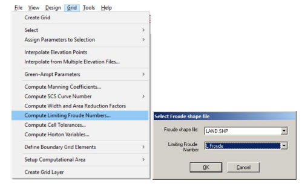

This command will compute the limiting Froude number for each grid element based on information contained in shape files.

3.5.28 Compute Cell Tolerances… (Grid Menu)

.. image:: img/GDS300.jpg

This command will compute cell tolerances for each selected grid element based on information contained in shape files.

3.5.29 Compute Horton Variables… (Grid Menu)

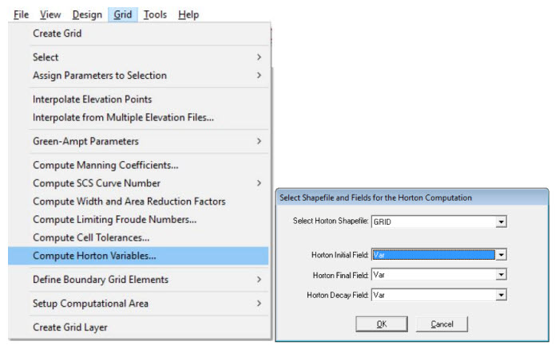

This command will compute and assign Horton values to cells intersected by the shapefile polygons based on the information contained in the variables
selected in the shapefiles.

3.5.30 Define Boundary Grid Elements/Element by Element (Grid Menu)

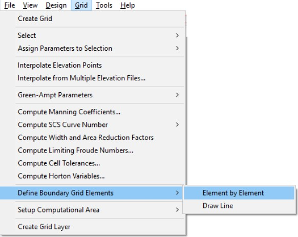

Use this command to mark or edit the grid elements that will constitute the computational domain boundary.
These boundary grid elements are not used in a *FLO-2D* model flood simulation and are not included in either the FPLAIN.DAT, TOPO.DAT or CADPTS.DAT
files.
To use the *Define Boundary Grid Elements* command:

    1. Select the *Define Boundary Grid Elements* *(Element by Element)* command (Grid menu).
       The mouse pointer changes to a cross.
    2. Select the boundary grid elements.
       The grid element color will change to red.
    3. Repeat step 2 as many times as needed to select or edit boundary grid elements.

To undo this operation simply click again on a previously marked grid element.
To mark a group of grid elements press the **Shift** key and the left mouse button and then drag the mouse pointer over the desired grid elements.
To deselect any group of grid elements, press the **Ctrl** key and with the left mouse button depressed, drag the mouse pointer over the grid elements
you want to unmark.

3.5.31 Define Boundary Grid Elements/ Draw Line (Grid Menu)

The boundary grid elements can also be identified by drawing a line around the computation domain.
This command automates the process of defining the boundary elements.
After the boundary grid elements have been marked with the line, they can be edited with the *Define Boundary Grid Elements/Element by Element*
command.

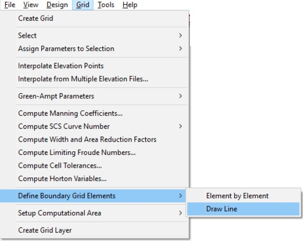

Select this command after the grid system has been generated.
When you click *Draw Line*, the following dialog box appears:

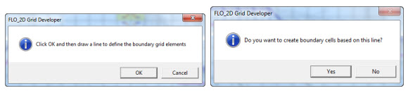

Click *‘OK’* and proceed to draw a polyline with a series of left mouse button clicks.
Complete the polyline by doubling clicking on the final vertex and then click *‘Yes’* in the following dialog box to generate the boundary elements.

3.5.32 Setup Computational Area/Click Inside Modeling Area (Grid Menu)

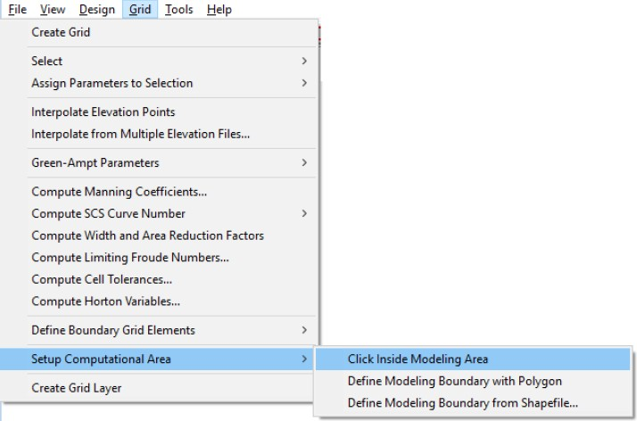

Use this command to select the computational domain.
Once the flow domain is outlined with a closed boundary, identify computational domain (potential flow surface).

    1. Choose the *Setup Computational Area* command.
       The cursor changes to a cross.
    2. Click any grid element inside the closed area of the computational domain.
       If the computational domain area is closed, an acceptance message appears.
       If the boundary elements do not completely enclose an area, you will be informed that the area is still open.
       Additional boundary grid elements must then be marked to completely close the computational domain.

If the boundary is edited, the computational domain can be re-generated by clicking on an interior grid element within the domain using the *Click
Inside Modeling Area* command.
This command will erase any interpolated data.

3.5.33 Setup Computational Area/ Define Modeling Boundary with Polygon (Grid Menu)

The computational domain can be defined by drawing a polygon to identify the boundary cells.

.. image:: img/GDS165.jpg

3.5.34 Setup Computational Area/ Define Modeling Boundary from Shapefile…(Grid Menu)

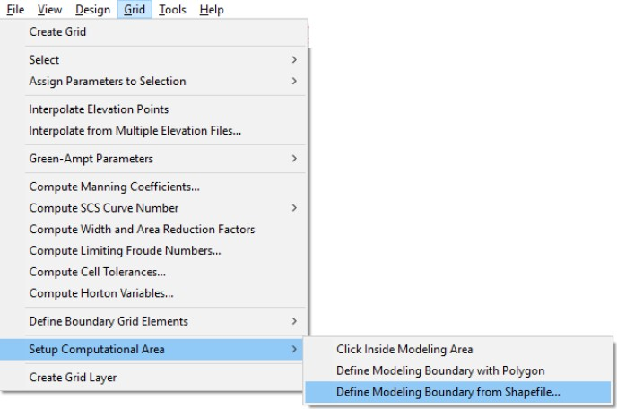

A polygon from an imported shapefile can be used to define the boundary.

3.5.35 Create Grid Layer (Grid Menu)

.. image:: img/GDS167.jpg

This command will create the grid layer.
When loading an existing *FLO-2D* project the grid layer is not created.
Some component editor functions require the grid layer and a message will prompt the user to create this layer.
Use this command to create the grid layer and continue with grid element attribute editing.

**3.6** **Tools Menu Commands:**

3.6.1. Options…/Interpolation… (Tools Menu)

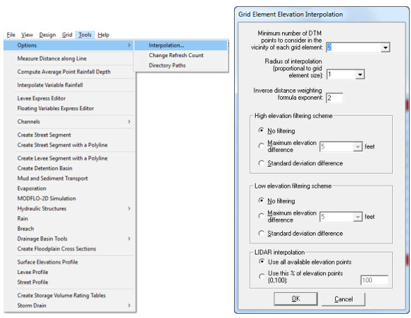

This command defines the various options that control the interpolation process.
When command is selected, a dialog box appears to adjust the various interpolation parameters:

Dialog Box Options:

.. list-table::
   :widths: 50 50
   :header-rows: 0

   * - Option
     - Description

   * - Minimum number of DTM points to

       consider in the vicinity of each grid element

     - To calculate an interpolated elevation from random DTM points that

       will represent each grid element, the algorithm will use at least this

       minimum number of DTM points closest to the grid element center.

   * - Radius of interpolation (proportional to grid element size)
     - The radius defines a circle around each grid element node that is

       multiple of the element size. Only the DTM points inside the radius

       are interpolated. If an insufficient number of elevation points are

       within the circle, it is expanded until at least the minimum number of

       points is found.

   * - Inverse distance weighting formula exponent

     - This is “n” in the Inverse Distance Weighting Formula:

       :math:`\bar{Z} = \frac{\sum_{j=1}^{NDTM} Z_j \frac{1}{r_{ij}^{n}}}{\sum_{j=1}^{NDTM} r_{ij}^{n}`

       Where Z¯ is the interpolated grid element elevation, Z\ :sub:`j`

       is the elevation of DTM point :sub:`j`,

       r\ :sub:`ij` is the distance from the DTM point :sub:`j` to center of grid

       element :sub:`i` and NDTM is the total number of DTM points.

   * - No filtering (High or Low Elevations)
     - No filtering is performed on the elevation points.

   * - Maximum elevation difference (For either High or Low Elevations)

     - For this option, the algorithm calculates a mean elevation using all the

       DTM and any assigned elevation points within the interpolation

       radius. All those points that exceed the selected maximum elevation

       difference either higher or lower than the mean are discarded and the

       mean elevation is recomputed and assigned to the grid element.

   * - Standard deviation difference (For Either High or Low Elevations)

     - The algorithm first calculates the DTM point elevation standard

       deviation and then neglects all those points whose elevations are

       higher (or lower) than the standard deviation when recalculating grid

       element mean elevation.

3.6.2. Options…/Change Refresh Count (Tools Menu)

.. image:: img/GDS306.jpg

Use this command to speed up the redraw (refresh) rate for large projects.
The refresh rate specifies how often the screen is updated when drawing maps.
If there are 1000 vertices to draw and the refresh rate is 500, then the screen will be refreshed twice.
A higher refresh rate results in faster draw times while a lower rate results a smoother draw appearance.
A dialog box will appear prompting you to input a value for the refresh rate of the map or image:

3.6.3. Options…/Directory Paths (Tools Menu)

.. image:: img/GDS168.jpg

This command may be used to edit the default directories used by the *FLO-2D* model.
The following dialog box appears:

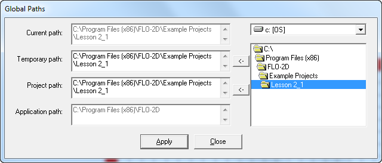

Input the desired new directory paths and then click *Apply*.

3.6.4. Measure Distance along Line (Tools Menu)

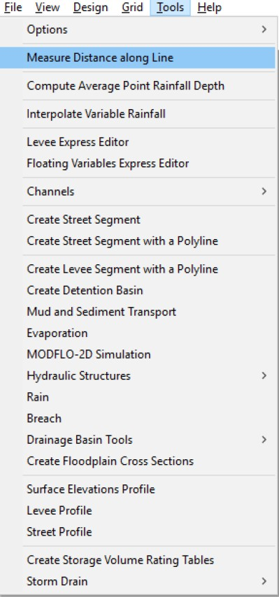

.. image:: img/GDS171.png

This tool computes the distance along a user-input polyline.
After clicking on the *Measure Distance along Line Command,* draw a polyline using the mouse and double click at the end point of the polyline.
*GDS* will display the length of the polyline as shown below:

3.6.5. Compute Average Point Rainfall Depth (Tools Menu)

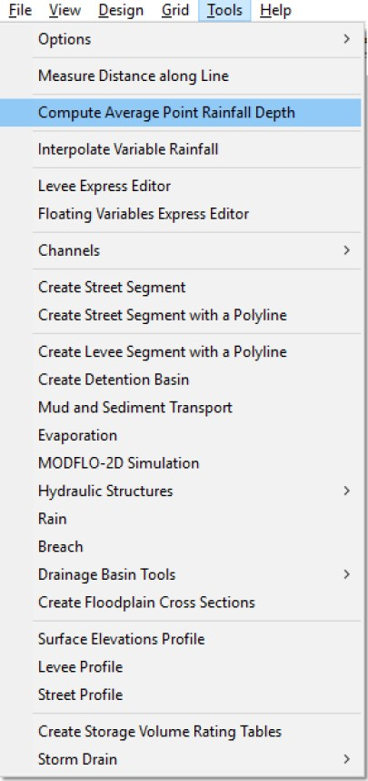

Use this command to compute Total Point Rainfall Depth (RTT in RAIN.DAT file).
*Note: It is required that a RAIN.DAT file exist in the project folder.* An ArcInfo ASCII grid file with rainfall data must be previously imported to
the *GDS*.
The format of this file is the standard ASCII grid with the values corresponding to rainfall depths.
The points will be displayed on the screen.
To compute the average of the grid rainfall depth, draw a polygon and then only the rainfall points inside the polygon will be used in the
calculation.

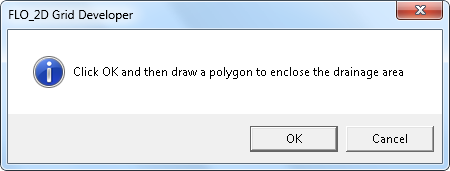

The following figure displays a *FLO-2D* grid system boundary, the ASCII rainfall point depth grid and the drawn polygon to compute that average
rainfall depth over the *FLO-2D* grid system.

.. image:: img/GDS174.jpg

To compute the average rainfall depth, choose the appropriate ArcInfo grid file from the file list in the following dialog box:

.. image:: img/GDS175.png

The following message will identify the number of grid points used to compute the average rainfall depth RTT value.
The RAIN.DAT file RTT value will be updated.

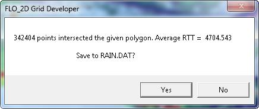

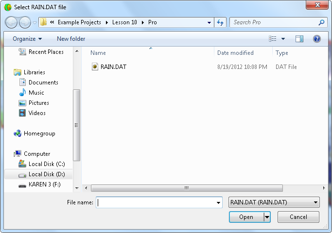

3.6.6 Interpolate Variable Rainfall (Tools Menu)

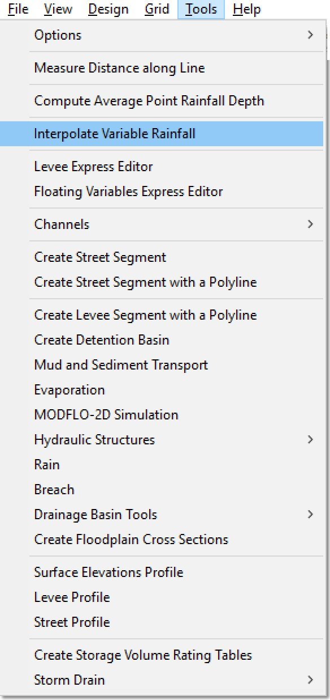

This command will interpolate temporal rainfall for each *FLO-2D* grid element, based on spatially varied rainfall data in an ArcInfo ASCII grid file
format.
A file must be prepared that contains the storm beginning and ending dates and times, time interval of the rainfall data files (in minutes), number of
reporting storm time intervals (one rainfall data file per interval) and the file name and location.
Each subsequent rainfall data file will list the rainfall depth at a rain gage grid location (i.e.
rainfall grid not the *FLO-2D* grid system) at that specific time.
For example:

.. raw:: html

    <pre>
    15 72 6/12/2002 13:00 6/12/2002 14:00 60 2
    C:\\Models\\FLO2D_2002\\Maricopa2002\\Raindata2\\rain13h.dat
    C:\\Models\\FLO2D_2002\\Maricopa2002\\Raindata2\\rain14h.dat
    </pre>

In this case, the beginning date of the storm is 6/12/2002 and the storm beginning time is 13:00 hours.
The storm ending date and time is 6/12/2002 and 14:00 hours.
The time interval between rainfall data files is 60 minutes and there are two rain grid files in the list.
The rainfall file format is the standard ArcInfo ASCII grid with the values corresponding to rainfall depths.
Each file corresponds to a rainfall depth at a specific time for the rainfall grid system.
The rainfall grid file (e.g. NEXRAD data) is prepared outside the *FLO-2D* software system.
This file may be based on the rainfall gage distribution.
This rainfall distribution over the rainfall grid has to be transformed into spatially varied rainfall assigned to grid elements in the *FLO-2D* grid
system.
This is accomplished using the variable rainfall interpolation algorithm in the *GDS* program.
Once the ArcInfo ASCII file is read, the following dialog box permits adjustment of rainfall grid interpolation parameters.

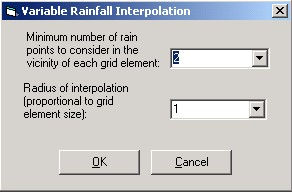

.. list-table::
   :widths: 50 50
   :header-rows: 0

   * - Option
     - Description

   * - Minimum number of rain grid points to

       consider in the vicinity of each grid

       element.

     - To calculate the interpolated rainfall depth for each FLO-2D

       grid element, the algorithm uses at least this minimum number

       of points closest to the grid element.

   * - Radius of interpolation (proportional to

       grid element size).

     - This radius defines a circle around each grid element based on

       a multiple of the grid elements size. Only rainfall grid points

       inside this radius are considered in the interpolation process. If

       the number of rainfall grid points is insufficient, then the circle

       is automatically enlarged until at least the minimum number of

       points is found.

After the interpolation is complete, choose the RAINCELL.DAT file location to save results.
The RAINCELL.DAT file is then used by the *FLO-2D* model to simulate the rainstorm.
The IREALRAIN variable switch in the *FLO-2D* RAIN.DAT file has to be set to 1 ‘on’ to simulate a real-time storm using the RAINCELL.DAT file.

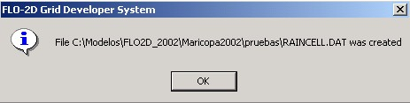

The format of the RAINCELL.DAT is as follows:

    Line 1: Beginning date and time, ending date and time, time interval (in minutes) and number of time intervals.

    Line 2: Grid element number and the total rainfall depth at that time.
    This line is repeated for each *FLO-2D* grid element.

Successive rainfall data for the entire grid system follows for the number of time-interval groups.
For the example above, there would be two sets of rainfall data for the entire grid system.

.. raw:: html

    <pre>
        60 2 6/12/2002 1:00:00 PM 6/12/2002 2:00:00 PM
        1     1.8538
        2     1.8537
         .      .
        1234   2.272
        1235   2.2709
        1      1.4794
        2      1.4791
         .       .
        1234   1.6294
        1235   1.6286
    </pre>

In this above example the beginning date is 6/12/2002 the beginning time 1:00 PM, the ending date 6/12/2002 and the ending time 2:00 PM.
The time interval between files is 60 minutes, there are two time intervals and 1235 grid elements.
The rainfall depth for grid element number 1 at time 1:00 PM is 1.8538 in.
Successive grid element rainfall depths follow.
For the second time interval, the rainfall depth for the first grid element is 1.4794 in and the rest of the grid elements follow.
If the grid system has been prepared in International Units (meters), then the rainfall data file should be prepared in mm.

3.6.7 Levee Express Editor (Tools Menu)

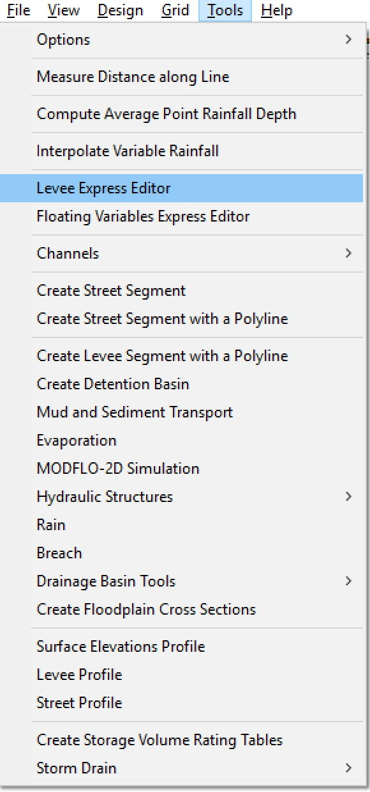

The Levee Express Editor facilitates assigning levee attributes for individual grid elements.
You can use the Levee Express Editor to create or edit a levee.
This tool will help you to assign levee crest elevations directly from the DTM point data base, if the DTM points are dense enough to represent the
levee crest.
If a number of DTM points fall on the top of the levee, the average of the five highest DTM points can be used to represent the levee crest.

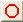

When you click this command or on the toolbar icon |levee_floating_dialogue_icon| for an existing levee the following floating dialog appears:

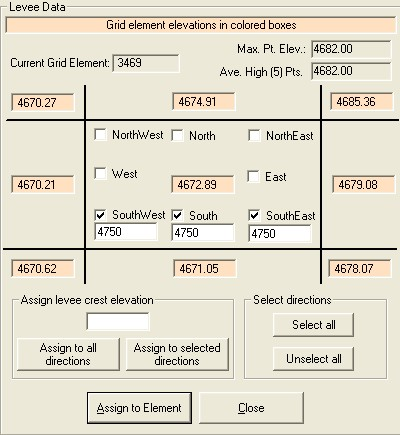

When you double click a grid element that has a levee, the dialog will show the Maximum Point elevation of the DTM points inside the element, the
average of the highest 5 DTM points in the element and the surrounding grid element elevations.
Use the text boxes and the *Assign to Element* button to assign the levee crest elevations.
Compare the Maximum Point Elevation (Max.
Pt.
Elev.) and the Average of the Five Highest Points (Ave.
High (5) Pts.) with the upstream and downstream assigned levee crest elevations to assign the levee crest elevation for the given grid element.

3.6.8 Floating Variables Express Editor (Tools Menu)

.. image:: img/GDS184.jpg

This command opens the Floating Variables Express Editor that allows interactive editing of Area and Width Reduction Factors (ARF,WRF), Infiltration
parameters and Multiple Channel Data.
While the dialog remains open, the user can double click any element so that the data corresponding to the active tab will be loaded and can be
edited.

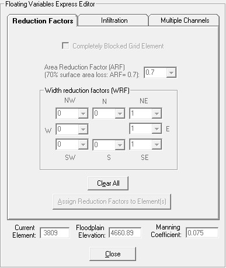

3.6.9 Create Channel Segment with a Polyline (Tools Menu)

.. image:: img/GDS186.jpg

This command creates the channel network in an existing *FLO-2D* grid system using a polyline as described below:

    1. On the Tool menu click Create Channel Segment with a Polyline.
    2. The mouse pointer changes to a cross.
    3. Click the first (upstream) grid element of the segment and then just draw a polyline using clicks.
       Use a background image to locate the channel with respect to the grid system.
       Channel elements are joined by arrows to visualize the channel location:

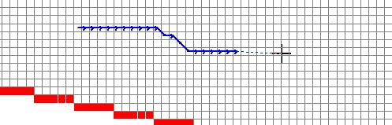

Click apply to accept the new channel segment.

.. image:: img/GDS188.jpg

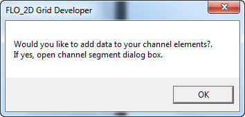

To edit channel geometry parameters, click a channel segment.
A submenu appears with several options:

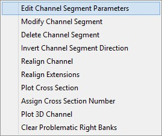

Select *Edit Channel Segment Parameters* and to display the Channel Segment dialog box:

.. image:: img/GDS191.png

The channel data is governed by the following rules (refer to the CHAN.DAT file description in the *FLO-2D* Data Input Manual for more detailed
discussion):

    1. *Maximum Froude Number*: Set the channel roughness to a reasonable n-value and then set the FROUDC variable to an appropriate value (e.g. 0.95 to
       ensure subcritical flow).
       *FLO-2D* will adjust the roughness values according to the limiting Froude number criteria.
    2. *Roughness adjustment coefficient*: This coefficient is used for depth variable Manning’s n-values.
       This value can range from 0.00 to 0.4.
    3. *Compute scour/deposition with sediment transport routine*: This is a check box to compute sediment transport in the channel segment.
       Checked the box if sediment transport is to be computed.
       In addition, ISED must be turned “On” in CONT.DAT.

    .. |initial_flow_icon| image:: img/GDS192.jpg
       :height: 14px

    4. *Initial flow depth*: When the *initial flow depth for all channel nodes* is > 0, an initial depth is specified for all the channel elements in that
       segment.
       Checking the *Initial Flow* check box |initial_flow_icon| requires assigning starting and ending water surface elevations for the channel segment beginning
       with element *1\ st node* and ending with element *last node.*

       .. image:: img/GDS307.jpg

       Interpolated water surface elevations are assigned to the channel elements in that segment based on the channel length.
    5. Each row in the “Channel Geometry” table corresponds to a channel grid element.
    6. The “Geometry Regression Relationships” data table is enabled only when a variable geometry channel element of type “V” is selected in the “Channel
       Geometry” table.
    7. Depending on the channel element data base some columns may be disabled.
    8. The editing of channel element data in each segment is achieved by pressing the “Edit” button.
       Interact with the table in the following dialog window to edit the channel element data (node, extension direction, roughness and length):

Additional channel data instruction comments can be found in the CHAN.DAT file descriptions.
A few comments are highlighted here:

    - Dividing the channel into segments may simplify reviewing the results.
      Organize the channel segments and elements from upstream to downstream with the inflow grid element being the first grid element in the file or
      segment.
    - The key to channel routing is to balance the relationship between the slope, flow area and roughness.
      Channel routing is more stable if surveyed cross section data is used.
      Review the PROFILES program instructions for cross section and channel bed slope interpolation.
    - If channel geometry is being simulated with regression relationships (SHAPE = ‘V’), then the area (A) versus depth (d) power relationships (A = ad\
      :sup:`b`) coefficients (a) and exponents (b) must be specified.
      Similar relationships are required for wetted perimeter and top width.
      If two power relationships are used to represent a natural cross section, then the maximum depth (*Depth for 2\ nd relationship variable*) to which the first relationship applies must be specified.
      Some rules for applying the second variable area channel geometry relationships follow:

        i.   The second regression applies when the flow depth is greater than *Depth for 2\ nd relationship variable*, but does not include the lower flow area.
             The two variable area cross section relationships are unique and separate.
             The total cross section flow area is the sum of the lower flow and upper (second relationship) flow areas.
             The channel top width is computed directly from the second relationship.
             The area, wetted perimeter and top width are evaluated using the upper flow depth given by: (total depth - *Depth for 2\ nd relationship variable*).
             To analyze the upper channel geometry using the XSEC program, only the cross section coordinates above the *Depth for 2\ nd relationship variable* are
             used.
        ii.  Channel geometry relationships apply only to flow depths that are less than the channel depth (lower than the top of bank).
             When the flow depth exceeds the top of bank, then the channel geometry above bank is evaluated as a rectangle.
        iii. Abrupt transitions between contiguous channel elements should be avoided unless they actually exist.
        iv.  A preprocessor program XSEC is available in the *FLO-2D* subdirectory to determine the regression coefficient and exponents.

            - Channel elements that are contiguous but do not share discharge (e.g. parallel channels) must be identified with the NOFLO1 and NOFLO2 variables.
              List each pair of contiguous channel elements only once.
            - Channel elements that will not share discharge will the floodplain have to be identified by the NOEXCHANGE parameter.
            - To improve the timing of the floodwave progress through the system, a depth variable roughness can be assigned on a reach basis.
              The basic equation for the channel element roughness n\ :sub:`d` as function of flow depth is:

.. math::
   :label:

   n_d = n_b\, r_c\, e^{-\left( r2\ depth / dmax \right)}

where:

   n\ :sub:`b` = bankfull discharge roughness depth = flow depth dmax = bankfull flow depth

   r2 = roughness adjustment coefficient prescribed by the user (range:
   0. to 0.4) r\ :sub:`c` = 1./e\ :sup:`-r2`

This equation prescribes that the variable depth channel roughness is equal to the bankfull roughness at bankfull discharge.
If the user assigns a roughness adjustment coefficient r2 for a given reach, the roughness will increase with a decrease in flow depth.
A higher coefficient increases the roughness.

To modify the channel elements in the channel segment, select the *Modify Channel Segment* Command:

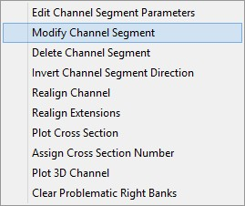

To modify the channel, click and drag the mouse from the last element in the channel segment.

To delete an entire selected channel segment, select the *Delete Channel Segment* command:

.. image:: img/GDS194.jpg

If the channel segment has assigned inflow hydrographs the following warning will appear:

.. image:: img/GDS195.png

If you select Yes, you will need to click the inflow node(s) that was assigned to the segment and reassigned to the floodplain instead.

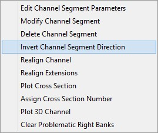

Click to reverse the channel direction.

.. image:: img/GDS197.jpg

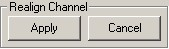

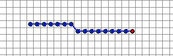

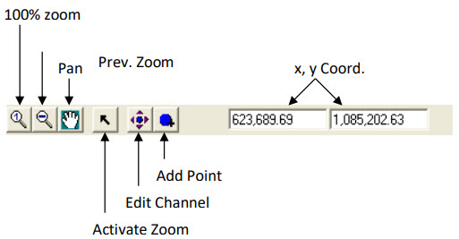

Realign left bank channel elements by clicking and dragging the blue dots.
The zoom, pan and edit features are also available with this tool.

.. image:: img/GDS310.jpg

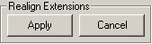

To Realign the right bank elements use the Realign Extensions tool.
It has the same capabilities as the realign channel tool.

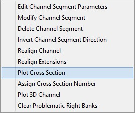

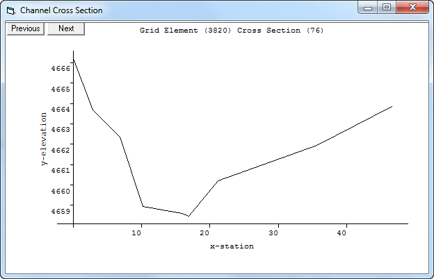

To see a plot of the cross section associated with each channel element.
Click the Plot Cross Section option.

.. image:: img/GDS311.jpg

Use this tool to assign cross sections to specified channel elements.
The prev and next button is used to select the channel element and the drop down box is used to select the cross section.

.. image:: img/GDS203.jpg

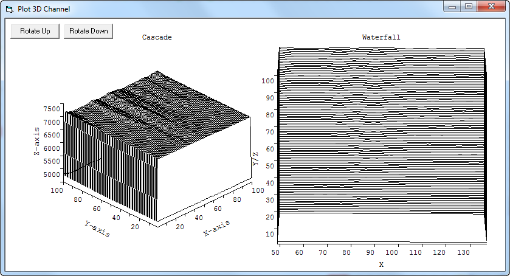

Click 3-D Plot to see a 3-D graphic of the channel segment.
This tool helps with cross section data quality control.

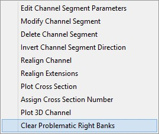

Click Clear Problematic Right Banks to delete right bank assignments that will cause an error in the model.
The banks must be reassigned.

3.6.10 Select Channel Confluences (Tools Menu)

Instead of assigning those channel elements that are contiguous but do not share discharge (NOFLOC’s), FLO-2D Pro version model assigns channel
connections that share discharge from upstream to downstream.

Channel confluences are defined to share flow by assigning connections between cells and the selection of those connections should observe the
following general rules:

    - Confluences on a given channel element will be possible as an upstream, downstream or tributary/split connection
    - A tributary/split channel element should be the last channel element listed on the particular channel segment and must be contiguous to the main
      channel.
      In cannot be separated by one or more floodplain elements from the main channel.
    - The tributary element can also be contiguous to either a left or right bank main channel element, if that is the case the connection will be defined
      between the tributary/split channel element and the main channel right bank element (respectively).
      FLO-2D model will find the left bank channel element at model runtime.

Connections for the channel confluences can be assigned opening the following dialog box that will list Tributary/Split Channel data entry field
column and Main Channel data entry field column:

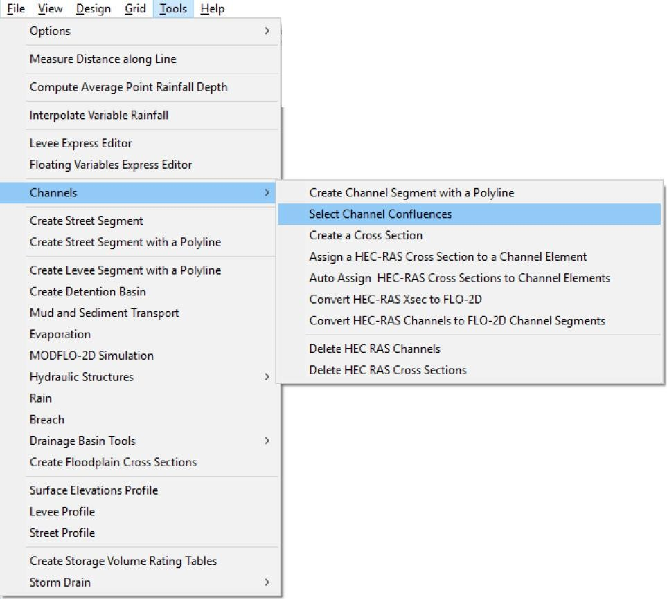

User can select, add, delete or modify channel confluence elements using the options available on the following dialog:

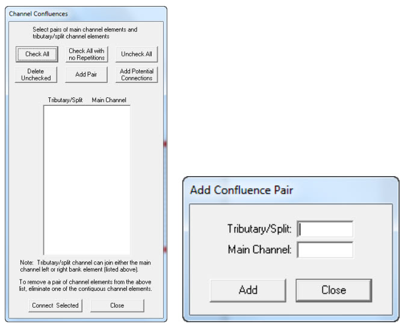

3.6.11 Create a Cross Section (Tools Menu)

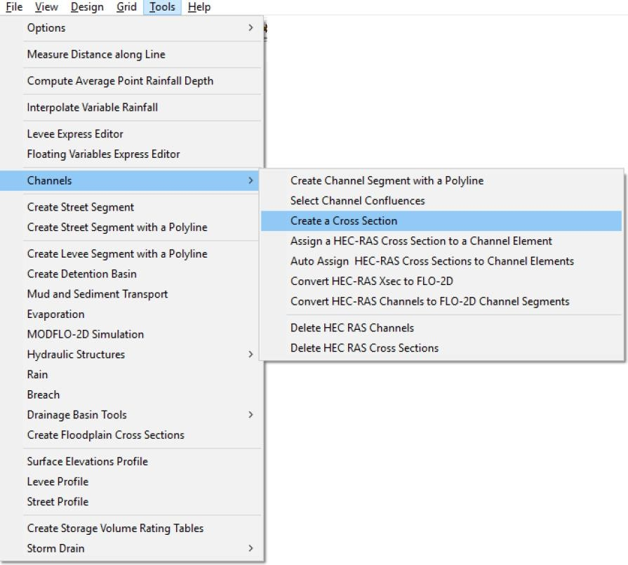

Use this tool to cut a cross section from elevation data.
Elevation data must be loaded.
Click Tools/Channels/Create a Cross Section.
Create an elevation layer if necessary and then click and draw a line to define a cross section.

.. image:: img/GDS313.jpg

Then assign the cross section to the N – natural channel.
The red arrows point out the cross section as seen by the small black dotted line.
The green arrow shows the channel element the cross section is assigned to.
Repeat the process along the channel where ever a cross section is needed.
Depending on the data, the cross sections might need adjustments.

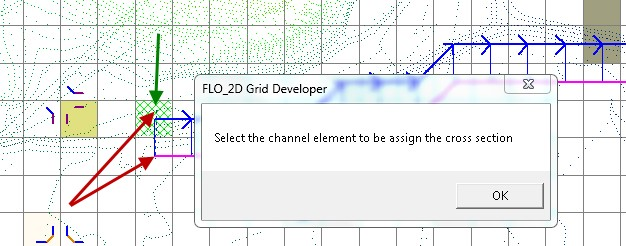

The following dialog allows the user to select a cross section number and name, determine the number of station / elevation pairs and to assign the
write-to text file.

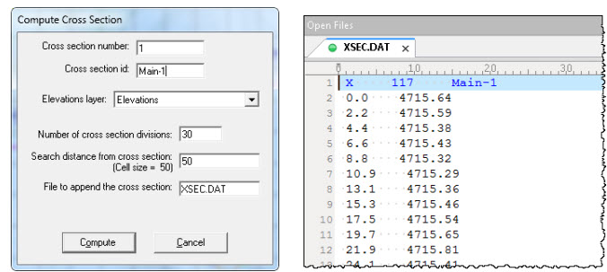

All data is appended to the xsec.dat file.
Start with a blank xsec.dat file.

3.6.12 Assign a HEC-RAS Cross Section to a Channel Element (Tools Menu)

.. image:: img/GDS209.jpg

Use the File menu to import a HEC-RAS cross section.
To manually assign a HEC-RAS cross section to a channel element, select the tool menu feature.
Then select a HEC-RAS cross section and a channel element.
Repeat the process until complete.

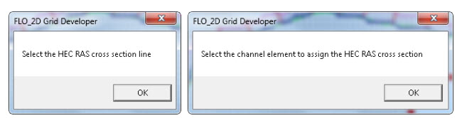

3.6.13 Auto Assign HEC-RAS Cross Section to Channel Elements (Tools Menu)

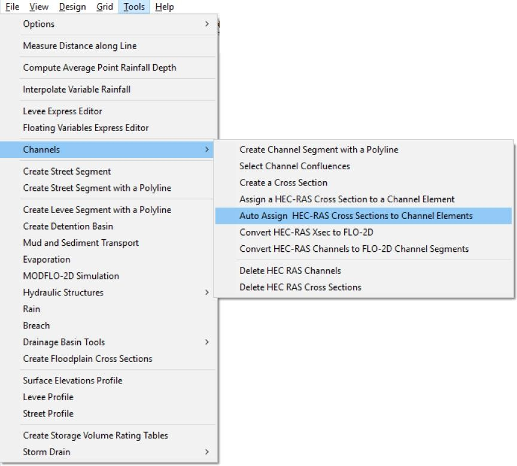

This feature will automatically assign the cross sections from HEC-RAS to the FLO-2D Channel.

3.6.14 Convert HEC-RAS Xsec to FLO-2D (Tools Menu)

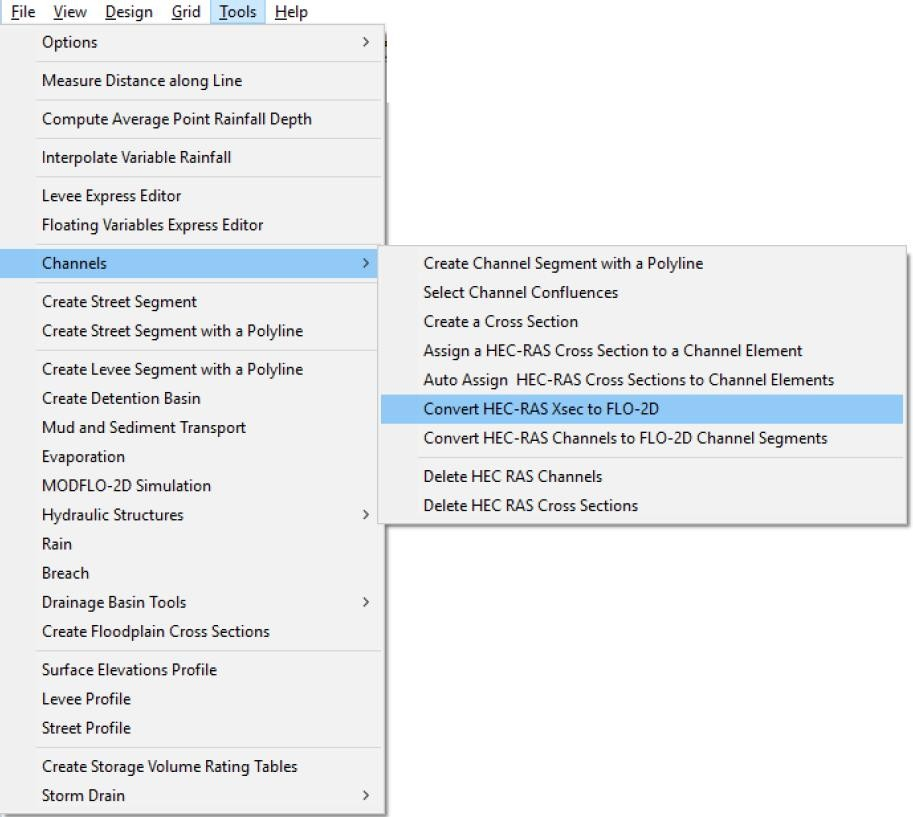

This feature will read cross section data available in *HEC-RAS* format, convert it to *FLO2D* format and save it to XSEC.DAT files.
The *GDS* reads the *HEC-RAS* file, locates the cross section key words, extracts the x, y, z data from each cross section and reformat the cross
section data for the XSEC.DAT file.
When this process is completed, another file dialog box appears to let the user select the location of the output XSEC.DAT file.

3.6.15 Convert HEC-RAS Channels to FLO-2D Channel Segments (Tools Menu)

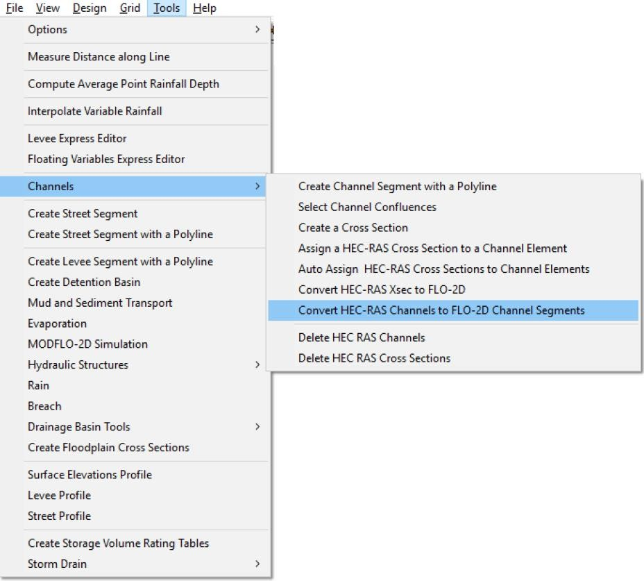

This feature will convert the HEC-RAS reaches to FLO-2D channel segments.

3.6.16 Delete HEC-RAS Channels (Tools Menu)

.. image:: img/GDS213.jpg

This feature is used to delete HEC-RAS channel from the grid system.

3.6.17 Delete HEC-RAS Cross Sections (Tools Menu)

.. image:: img/GDS214.jpg

Use this option to delete HEC-RAS cross sections that are not needed.

3.6.18 Create Street Segment (Tools Menu)

.. image:: img/GDS215.jpg

This command enables the creation of the streets in an existing *FLO-2D* grid system using point and click tools as described below:

    1. On the *Tool menu* click *Create Street Segment.*
    2. The mouse pointer changes to a cross.
    3. To add a new grid element to the street, click first grid element of the street segment.
       Then while holding the left mouse button down, the system selects street elements as the user moves over the grid system.
       A background map or aerial photograph image can be used to locate the streets.
       The streets are identified by green elements and with a solid continuous line when been generated in the *GDS*.

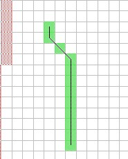

As the street development progresses from one grid element to the next, only the eight adjacent elements can be accessed (see above figure).
When the mouse pointer is located near the center of the next element to be selected, a solid line arrow will appear to indicate that the element will
be added to the street.
The user can backup the pointer over the segment to unselect street grid elements.
No mouse clicks are necessary, it is only necessary to move the mouse pointer over the desired elements.
To finish the street element selection, the user double-clicks with the left mouse button.

The street data assignment is not complete until the user assigns the street flow direction, street widths and n-values in the street editor dialog
box.
When the user clicks on an existing street, the street line will be colored in red and the following options appear:

.. image:: img/GDS217.jpg

To edit the street data, select *Edit Street Parameters* to display the Street Parameters dialog box:

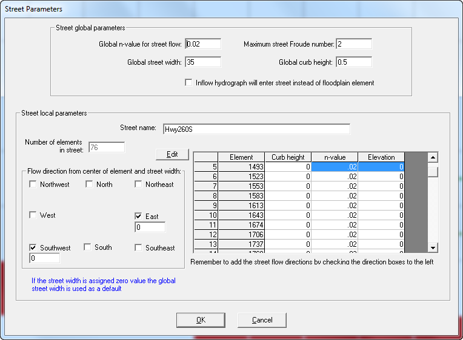

The Street Parameter dialog box can also be accessed by left mouse button click a grid element with streets and clicking on the *Street Element*
button.
The street flow directions in the lower left of the dialog box are required data and must be assigned after completing the Create Street Option above
(Task 3 above).
Instructions for entering street follow:

    1.  *Global n-value for street flow* - Global n-value that is assigned to all the street elements.

    2.  *Maximum Street Froude number -* When the computed Froude number for the street flow exceeds this limiting street Froude number, the n-value is
       increased by 0.001 for that street element.

    3.  *Global street width* - Global assignment of street width (ft or m) for all street elements.
       This street width is superseded by individual street widths if the individual street width is greater than zero (see *Flow direction from center of
       node and street width* check boxes).

    4.  *Global curb height* - Global street curb height (ft or m).
       If the street curb height is exceeded by the flow depth, overland flow will result in the grid element containing the street.
       This value is used to assign a street curb height globally to all street elements.

    5.  *Inflow hydrograph will enter the streets rather than floodplain node* - Check this box to have the inflow hydrograph enter the street rather than
       the floodplain portion of the grid element.

    6.  *Curb height* - Optional curb height (ft or m) for an individual street element that supersedes the *global curb height*.

    7.  *Elevation* - Optional individual street element elevation (ft or m).
       This elevation will supersede the floodplain grid element elevation.
       If this value is zero, the model will assign the street elevation as grid element floodplain elevation minus the curb height.

    8.  *N-value* - Optional street n-value for the individual street segments within a given grid element.
       This value supersedes the *Global n-value for street flow*.
       If individual street nvalue is zero, the global value will be assigned to the grid element street segment.

    9. *Street name* - Character name of the street.
       Up to 15 characters can be used.
       The street name is not used in the *FLO-2D* model.

    10. *Flow direction from center of node and street width* - Streets emanate from the center of the grid element in a star pattern of eight potential flow
        directions as show below.

.. image:: img/GDS219.jpg

When a given flow direction box is checked, a text box appears direct below the *flow direction check box* to input the optional grid element street
width for that street flow direction ISTDIR:

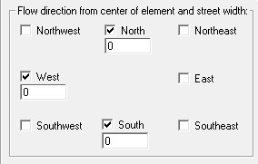

By setting the text box to zero, the *Global street width* will be assigned to that street segment.

Additional street data instruction comments can be found in the STREET.DAT file descriptions later in the manual.
A few comments are highlighted here.

    - Drawing the street outline with the Create Street Option does not complete the data assignment.
      You must click the street and add the global street parameters, street flow directions and individual street element parameters if they are different
      from the global parameters.
    - The street depth, width and n-values can be assigned globally for all the street grid elements.
      The street depth, width and elevation can also be assigned for individual grid elements in the street local data form by setting these values greater
      than zero.
    - If the street elevation is different from the representative grid elevation assigned in the FPLAIN.DAT file, it should be specified in the Street
      Local Form otherwise the street elevation will be the floodplain elevation minus the curb height.
      These elevations are then used to determine the street slope.
    - The street width should be less than the side of the grid element.
      The overall floodplain surface area of the grid minus the streets surface area must be at least 5% of the original surface area (grid element width
      squared).
      If the street surface area consumes the entire grid element surface area, consider leaving out the smaller, less significant streets, reducing the
      street widths or transferring one street to a neighboring grid element.

The street is assumed to extend from the center of the grid element to the grid element boundary in the eight flow directions.
A street that crosses the entire grid element is assigned two street sections and directions.

3.6.19 Create Street Segment with a Polyline (Tools Menu)

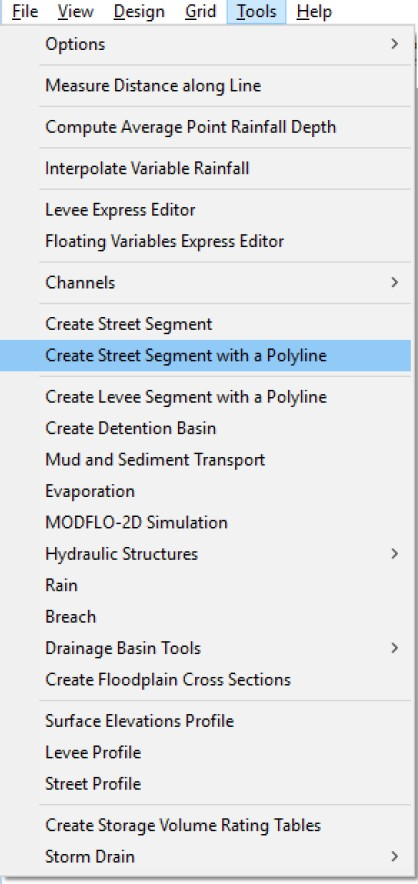

With this command you can create a street segment using simple mouse point and clicks.
First click *Create Street Segment with a Polyline* command; the cursor will change to a cross and as you click the mouse, the street segment will be
progressively created.
To complete the segment, double-click.

3.6.20 Create Levee Segment with a Polyline (Tools Menu)

.. image:: img/GDS222.jpg

With this command you can create a levee segment using simple mouse point and clicks.
First click *Create Levee Segment with a Polyline* command; the cursor will change to a cross and as you click the mouse, the levee segment will be
progressively created.
To complete the segment, double-click.

3.6.21 Create Detention Basin (Tools Menu)

This command will help to design detention basins for flood mitigation.
The detention basin is created by adjusting the grid element topography to reflect the detention basin depression.
No special *FLO-2D* components or data are necessary to utilize the detention basin feature.

.. image:: img/GDS223.jpg

The procedure to create a detention basin depression in the grid system topography is as follows:

1. The user selects the *Create Detention Basin* Command.

2. The system displays the following message:

.. image:: img/GDS224.png

3. The user draws the polygon that defines the detention basin perimeter.
   The polygon is closed by double clicking on the last vertex of the polygon.

4. The *GDS* will then request for the detention basin volume (ft\ :sup:`3` or m\ :sup:`3`):

.. image:: img/GDS225.png

5. Input the desired volume and click *‘OK’*.
   The system will subtract a uniform depth (*Detention basin height*) from all the elements included in the detention basin polygon until the detention
   basin volume is matched.
   The floodplain element elevations are lowered to account for the *Detention basin volume*.

If the user clicks on the detention basin polygons, the following menu appears:

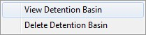

When you click *View Detention Basin* the following message is displayed:

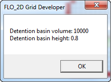

3.6.22 Mud and Sediment Transport (Tools Menu)

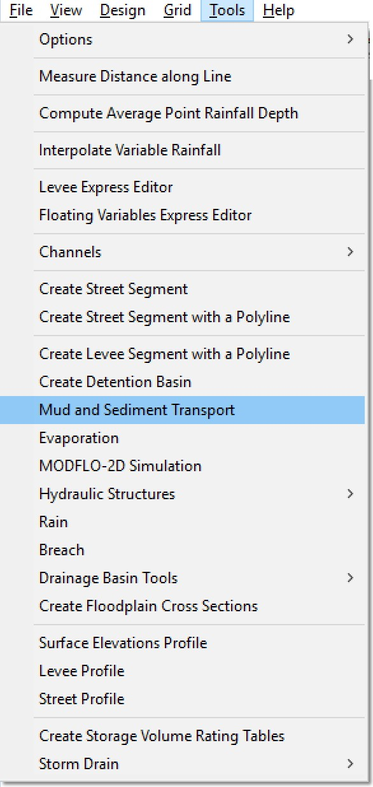

This command allows entering mud flow or sediment transport data using the following dialog box.

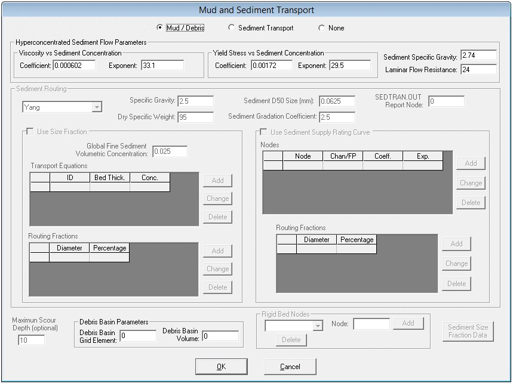

3.6.23 Evaporation (Tools Menu)

.. image:: img/GDS317.jpg

3.6.24 MODFLO-2D Simulation (Tools Menu)

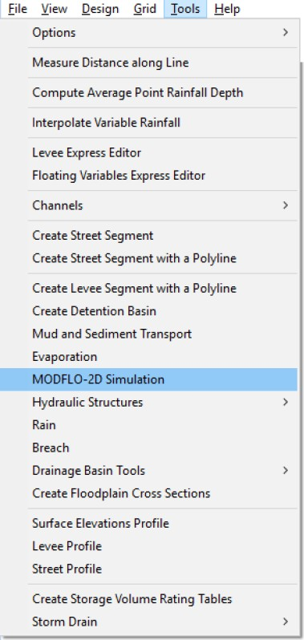

This command allows entering data to simulate surface and groundwater flow using the *MODFLOW* integration.
There following tabbed dialog box provides input fields for a subset of *MODFLOW* data.
A separate manual explain in full the capabilities of the *FLO-2D* *MODFLOW* link, also called *MODFLO*-2D.

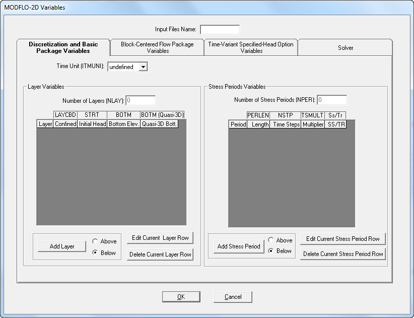

3.6.25 Hydraulic Structures (Tools Menu)

.. image:: img/GDS232.jpg

The Hydraulic Structures command allows entering data required to simulate culverts, bridges and any other hydraulic structure that can be represented
with a rating table or rating curve.

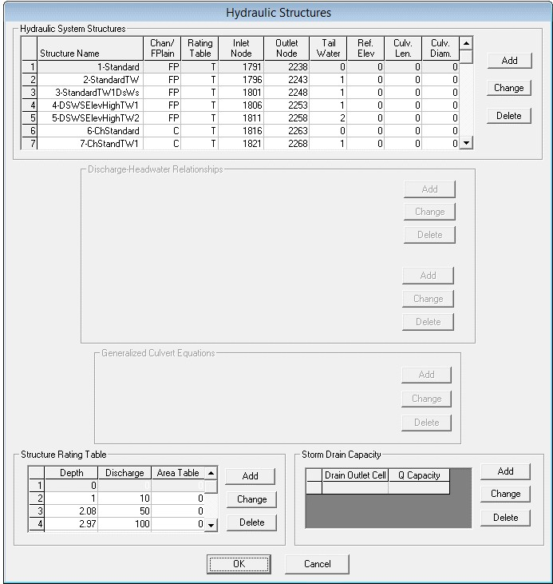

3.6.26 Rain (Tools Menu)

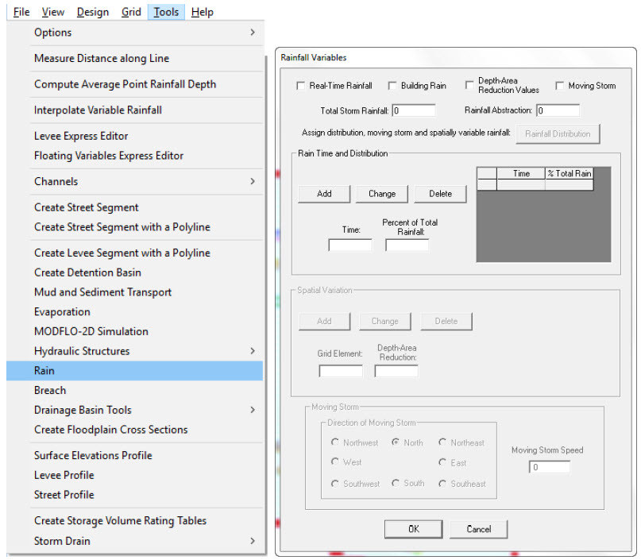

The Rain command allows entering data to simulate rainfall input over the FLO-2D grid.

3.6.27 Breach (Tools Menu)

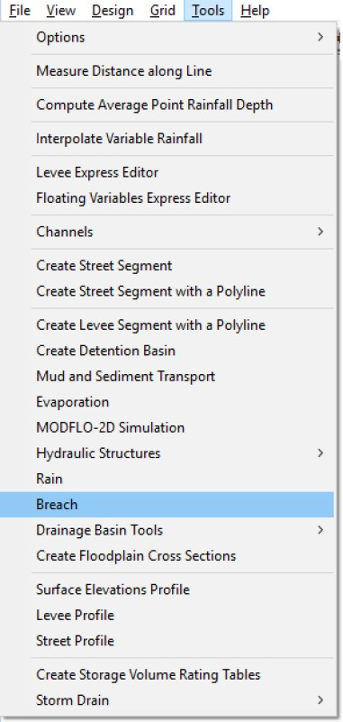

This command is used to enter levee breach data for the computed breach option.

Global Breach Data

Global breach data is used to input the dam or levee geometry and soil data in order to simulate an NWS Breach erosion condition.
The model uses the global data along points of a levee or dam that meet a specific depth or time to breach criteria.

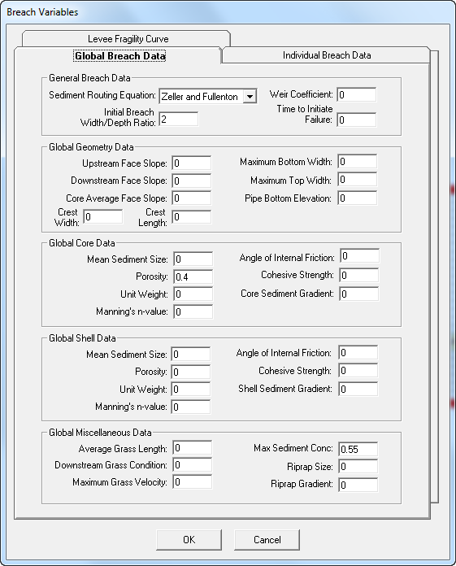

Individual Breach Data

Individual breach data is used to input the dam or levee geometry and soil data in order to simulate an NWS Breach erosion condition at a
predetermined location.
The model uses the breach data assigned to a specific location to breach at a specified elevation or time.

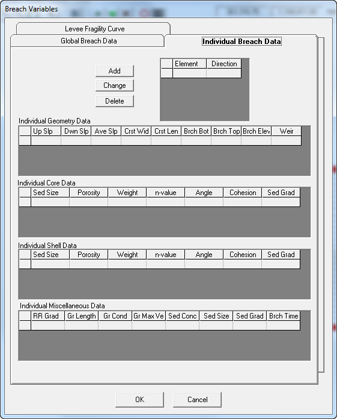

Levee Fragility Curve Data

Levee fragility curves are used to determine a levee breach location based on data entered spatially along a levee profile.
The fragility data is based on the existing levee condition and will activate a failure via erosional breach or prescribed failure once a certain
depth criteria is met.

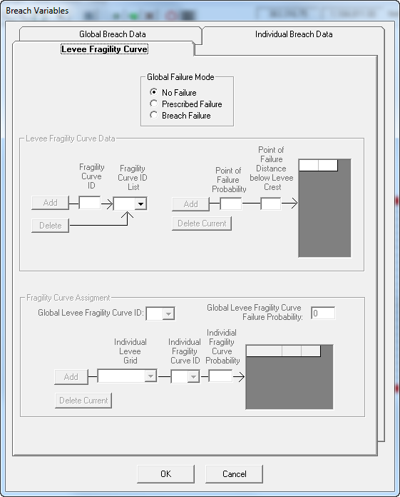

3.6.28 Drainage Basin Tools (Tools Menu)

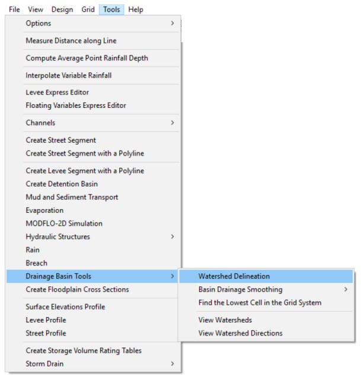

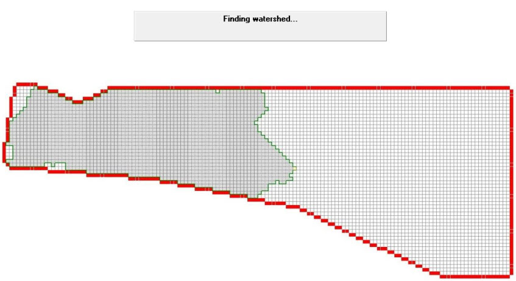

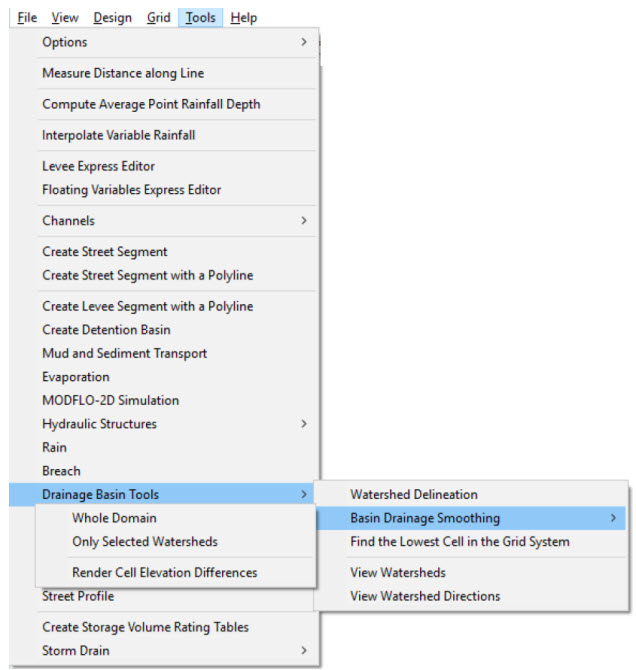

.. image:: img/GDS324.jpg

.. image:: img/GDS325.jpg

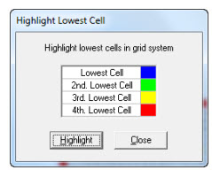

.. image:: img/GDS327.jpg

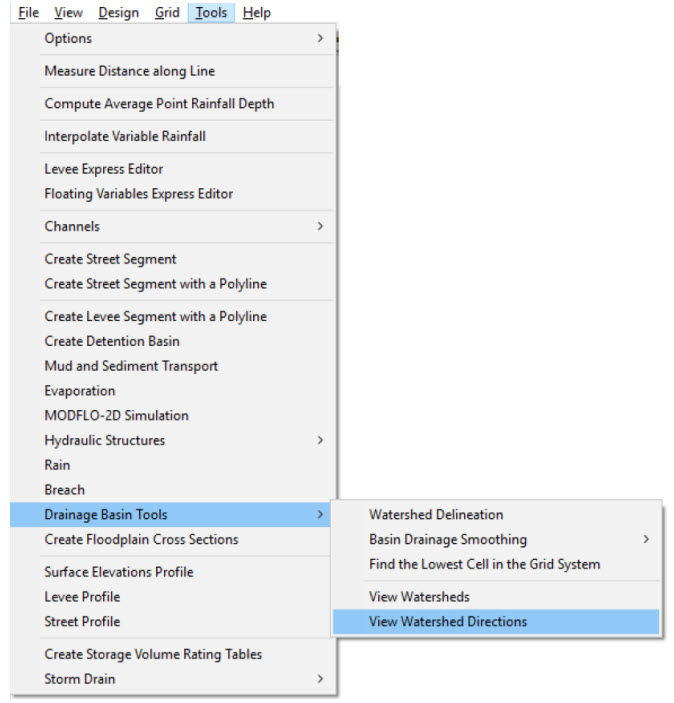

3.6.29 Create Floodplain Cross Sections (Tools Menu)

.. image:: img/GDS244.jpg

This command will enable selection of grid elements for a floodplain cross section so that the *FLO-2D* model will calculate a hydrograph and compile
hydraulic results for the flow across the cross section.
You can create the cross section in an existing *FLO-2D* grid using point and click tools as described below:

1. On the *Tool menu* click *Create Floodplain Cross Sections.*

2. The mouse pointer changes to a cross.

3. Locate and position the mouse over the first grid element in a line of grid elements that will constitute the cross section.
   Click his first grid element of the cross section and then while holding the left mouse button down select the cross section grid elements as you move
   the mouse over the grid system.
   Cross section elements are joined by lines to visualize the cross section location.
   As the cross section development progresses from one element to the next, only the eight adjacent elements can be accessed.
   When the mouse pointer is near the center of the next element to be selected, a solid arrow appears to indicate that that element is the next one in
   the segment.
   The user can backup the pointer over the segment to unselect channel grid elements.
   No clicks are necessary, the users only needs to sweep the pointer over the desired elements.
   The cross section is completed when the user double-clicks with the left mouse button.

.. image:: img/GDS245.jpg

4. Cross sections must be consists of grid elements in a continuous straight line and can only be in the four directions as indicated below:

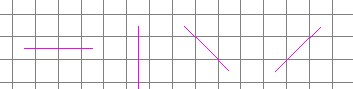

To edit the floodplain cross section grid elements, click a cross section.
A short-cut menu appears with three options as shown:

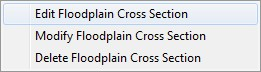

Select *Edit Floodplain Cross Section* to display the floodplain cross section dialog box:

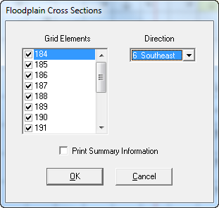

In the left data table are the grid elements that form the cross section.
In the right data table of the dialog box, select the direction for discharge calculation.
The cross section discharge will be computed for the selected flow direction that is perpendicular to the line of cross section grid elements.
The model will create three output files:

CROSSQ.OUT - This file contains the element grid hydrographs for each of the floodplain elements in the cross section.
The time and discharge are listed for each output interval.

CROSSMAX.OUT - This file lists the maximum discharge, maximum flow depth and time of occurrence for each grid element specified in the cross section
analysis.

HYCROSS.OUT - The output interval time, top width, depth, velocity and discharge are listed for each cross section.
The discharge passing the cross section of grid elements is compiled as a hydrograph.
The cross section maximum discharge and the individual grid elements are written to the CROSSMAX.OUT file.

3.6.30 Surface Elevations Profile (Tools Menu)

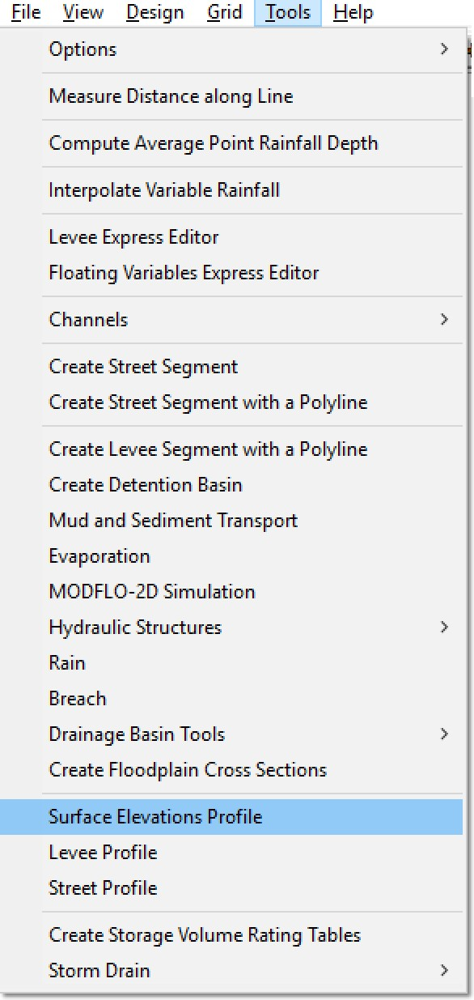

3.6.31 Levee Profile (Tools Menu)

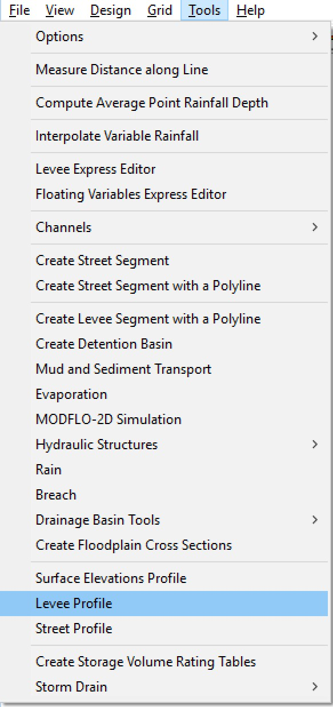

This tool will display levee crest elevation profile of a selected levee segment along with the corresponding grid element ground elevations.
To activate this tool, click the command *Levee Profile* and then click one of the grid elements that contain a levee.
*GDS* will determine the continuity of the levee and change the levee color to dark green to identify the selected elements as shown in the figure
below.

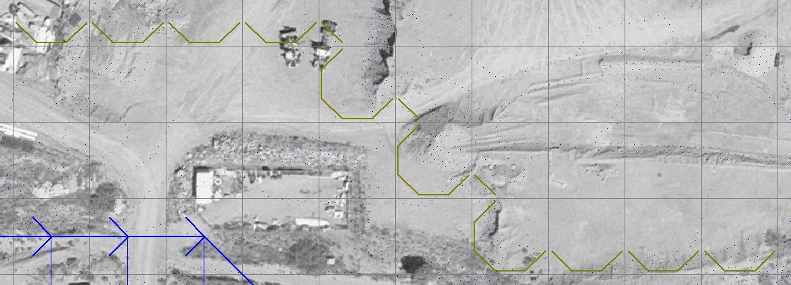

Then *GDS* will display the levee profile as shown in the following plot:

.. image:: img/GDS252.png

Using this *Formatting* Menu on the tool bar, the *GDS* will display the following dialog box so that you can customize the plot including the minimum
and maximum elevations (Y-axis), legend position and angle of labels.

.. image:: img/GDS253.png

3.6.32 Street Profile (Tools Menu)

.. image:: img/GDS329.jpg

This command will create a street and ground elevation profile.
To access this tool, click the *Street Profile* Command and click any street element.
The *GDS* will display the street profile as shown:

.. image:: img/GDS254.jpg

Similar to the *Levee Profile Command*, use the *Formatting* command on the tool bar to display the following dialog box to customize the plot
including the minimum and maximum elevations (Y-axis), Legend position and angle of labels.

3.6.33 Create Storage Volume Rating Tables (Tools Menu)

This tool will create storage volume rating tables to keep watershed depression storage defined by the DTM points data.
The depression storage accuracy can be retained by generating a depth-volume storage rating table for each selected grid element.

To activate this tool, click the command *Create Storage Volume Rating Tables* and then click on *Compute Rating Curves*.
*GDS* will calculate the rating tables and generate an outrc.dat file that contains the potential storage for each cell.

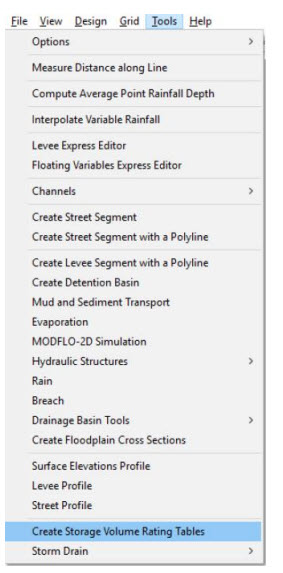

.. image:: img/GDS331.jpg

3.6.34 Storm Drain (Tools Menu)

FLO-2D will compute the surface water depth at prescribed grid elements with storm drains and will compute the discharge inflow to the storm drain
based input storm drain geometry.
The Storm Drain model 5.1 will then compute the pipe network flows and potential return flow to the surface water.
To activate this tool, click the command *Storm Drain.
GDS* will allow you to enter, modify and view the Inlets as well as run EPA SWMM GUI 5.0 using the following dialogs:

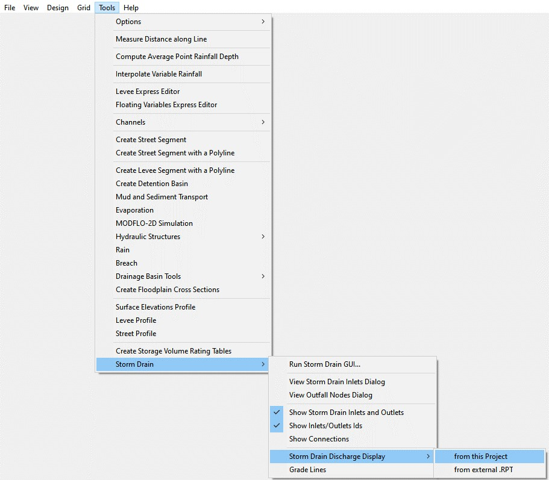

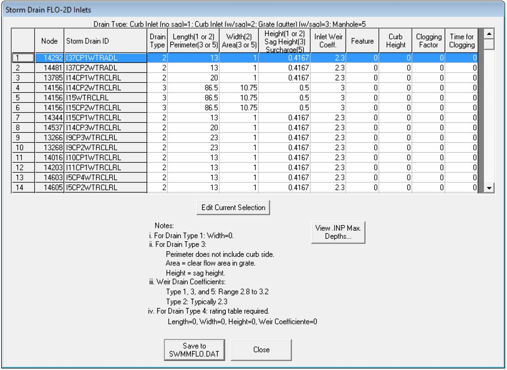

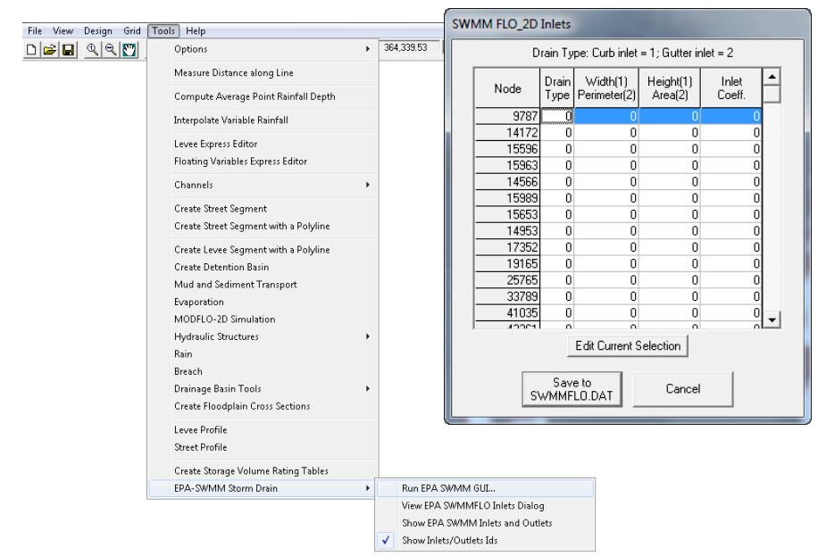

This command will open the EPA SWMM 5.0 program.
Create a .inp file and save it to the project folder.
Then use the Control Panel to load make the SWMMFLO.DAT file.

3.6.34.1 Run Storm Drain GUI… (Tools Menu/Storm Drain)

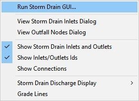

This option runs the EPA SWMM GUI 5.0.
It the link is not working copy the Epaswmm5.exe file from the EPA SWMM 5.0 folder to the FLO-2D Pro folder.

3.6.34.2 View Storm Drain Inlets Dialog (Tools Menu)

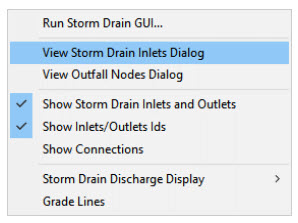

.. image:: img/GDS337.jpg

This option loads the contents of the SWMMFLO.DAT file to be edited.
The inlets can be edited here and the max depths can be edited here or in the swmm.inp.

.. image:: img/GDS338.jpg

3.6.34.3 View Outfall Nodes Dialog (Tools Menu/Storm Drain)

.. image:: img/GDS339.jpg

This option generates the data written to the SWMMOUTF.DAT file.

3.6.34.4 Storm Drain Display Option (Tools Menu/Storm Drain)

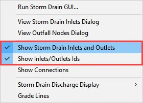

These options define how the storm drain system appears on the GDS display window.

3.6.34.5 Storm Drain Discharge Display (Tools Menu/Storm Drain)

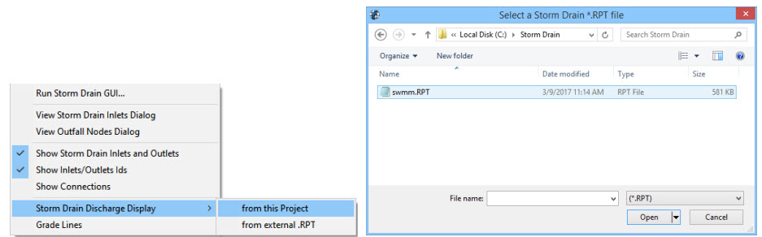

This option allows the user to review the inlet discharge hydrographs or print them to \*.jpg image files.
Choose from this project to display on screen or from external project to save all projects to file.

.. image:: img/GDS340.jpg

3.6.34.6 Grade Lines (Tools Menu/Storm Drain)

.. image:: img/GDS342.jpg

This option allows the user to review the grade lines for the conduits.

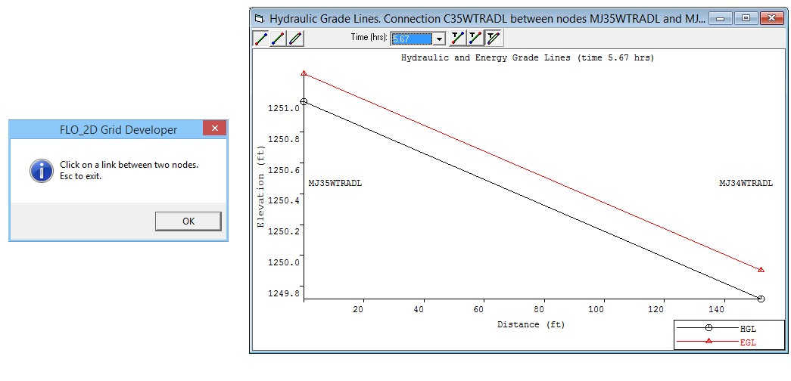

**4.7 Contents (Help Menu)**

.. image:: img/GDS263.jpg

The Help Contents Command accesses a .pdf version of this manual.
The FLO-2D Software links to the website and the About… opens the welcome message.
The welcome message shows the activation status and alerts a user if the subscription needs to be renewed.

.. image:: img/GDS264.jpg