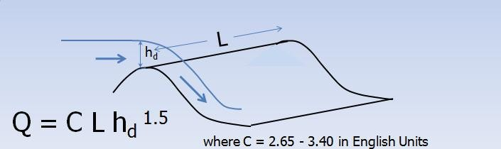
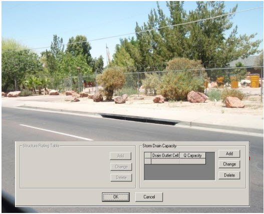
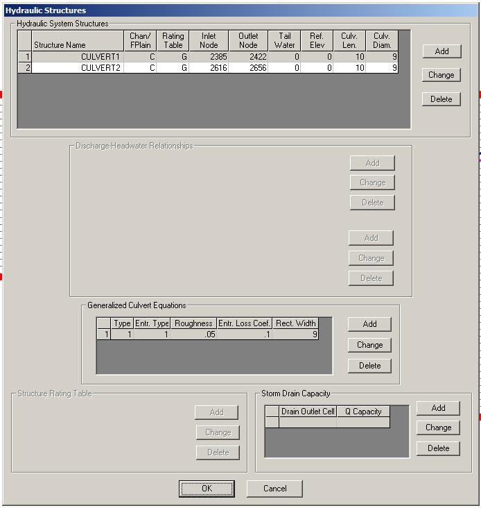

.. vim: syntax=rst

FLO-2D Hydraulic Structure Guidelines
======================================

Overview
---------

Hydraulic structures can include bridges, culverts, weirs, spillways, pumps or any facility that controls the water surface elevation and whose
discharge can be specifying by a rating curve or tables, or generalized culvert equations.
Backwater effects upstream of bridges or culverts as well as blockage of a culvert or overtopping of a bridge can be simulated.
A hydraulic structure can control the discharge between either contiguous channel or floodplain grid elements or cells that may be separated by
several grid elements.
For example, a culvert under an interstate highway may span several grid elements.
In addition, flow can be exchanged between a floodplain element and channel element.
A hydraulic structure rating curve equation specifies discharge as a function of the headwater depth h:

.. math::
    :label:

    Q = a h^b

where: (a) is a regression coefficient and (b) is a regression exponent.

More than one power regression relationship may be used for a hydraulic structure by specifying the maximum depth for which the relationship is valid.
For example, one depth relationship can represent normal flow through a bridge and a second relationship can be used to simulate blockage with a zero
coefficient for the height of the bridge low chord.
Flow can also reverse and go upstream through a hydraulic structure.
Hydraulic structures may include:

    - Broadcrested weir such as a berm or embankment (Figure 1);
    - Sharp crested weir such as a wall;
    - Channel side retention basin control weirs;
    - Spillways or outlet works from a dam (e.g. Ogee Weir);
    - Culverts;
    - Bridges;
    - Detention basin pumps;
    - Highway dip crossings;
    - Pumps

*Figure 1.
Broadcrested Weir Equation for Modeling Hydraulic Structure Flow Over an Embankment*

By specifying a hydraulic structure rating table, the model interpolates between the depth and discharge increments to calculate the discharge.
A typical rating curve will start with zero depth and zero discharge and increase in non-uniform increments to the maximum expected discharge or
higher.
In general, the rating table will be more accurate than the regression equation if the curve is nonlinear on a log-log plot of the depth and discharge.
The rating table must be based on a reference elevation (Figure 2).
Flow blockage by debris can be simulated by setting the discharge equal to zero corresponding to a prescribed depth.
This blockage option may useful in simulating worst case mud and debris flow scenarios where bridges or culverts are located on alluvial fans.
Blockage forces all the discharge to flow overland on the fan or floodplain surface.

.. image:: img/Hydrau003.jpg

*Figure 2.
Levees are Depicted in Red and the River in Blue in the GDS Program*

For a simplified storm drain system, multiple inflow nodes can be assigned to the same outflow element.
This will enable the cumulative storm drain discharge at the outlet to be assessed without conduit flow routing.
It is possible to assign a limiting conveyance capacity for the outlet node (Figure 3).
This will curtail the inflow in subsequent downstream inlets.
Once the conveyance capacity is exceeded, the discharge to the remaining downstream inlet nodes is zero.

*Figure 3.
Multiple Storm Drain Inlets to a Single Outlet with a Conveyance Capacity Limit*

Generalized equations for inlet and outlet control for round or rectangular culverts are available in the Pro model.
The culvert discharge will be computed using equations based on experimental and theoretical results from the U.S.
Department of Transportation procedures (Hydraulic Design of Highway Culverts; Publication Number FHWA-NHI-01-0260 revised May, 2005).
This approach will replace the original model rating table or curve methods.
The equations include options for box and pipe culverts and take into account different entrance types for box culverts (wingall flare 30 to 75
degrees, wingall flare 90 or 15 degrees and wingall flare 0 degrees) and three entrance types for pipe culverts (square edge with headwall, socket end
with headwall and socket end projecting).
The highlights of this new component are:

    - Computes discharge through box or circular pipe culverts for various entrance conditions.
    - Computes both inlet and outlet control and the transition between them.
    - No rating curves or tables required.

The data required for the generalized culvert equations include (Figure 4):

    - Length
    - Diameter
    - Rectangular Width
    - Type – Box or Pipe
    - Entrance Type (3)
    - Entrance Loss Coefficient
    - Roughness

*Figure 4.
GDS Dialog Box for Entering the Generalized Culvert Data*

Hydraulic structures may be used to allow flow to go through a levee.
This might simulate a drainage hole in a block wall or a culvert through a highway embankment.
The use of hydraulic structure in contiguous grid elements separated by a levee will preclude the discharge overtopping the levee or wall and the
rating table or curve should represent flow through the structure and over the embankment.
When the levee or wall fails the hydraulic structure flow is terminated and the flow between the contiguous grid elements is base on the levee breach.
If the breach failure is instantaneous, the hydraulic structure flow is ceased and the flow reverts to overland flow.

Guidelines
-----------

Hydraulic structures pass flow across a grid element boundary and can connect two floodplain elements, two channel elements or a floodplain to channel
element combination.
The inflow and outflow elements of the hydraulic structure do not have to be contiguous.
For example, several floodplain elements representing a highway embankment can separate the inflow and outflow cells of a culvert.
If a two channel elements are joined by a hydraulic structure that are not contiguous, the intevening channel elements should no longer be designated
as channel elements in the CHAN.DAT file.
In this case the XSEC.DAT and CHANBANK.DAT should also be edited to remove the extra channel elements.
For the floodplain (inflow) to channel (outflow) hydraulic connection, the channel element (left bank) must be listed in the CHAN.DAT file.
It doesn't matter if the inflow element is on the opposite of the river.

It is recommended that hydraulic structure inflow and outflow nodes be assigned to grid elements away from the project outflow nodes or grid system
boundary to avoid water surface control or flow containment issues.
It is also suggested that streets and ARF/WRF values be removed or left out of the inflow and outflow hydraulic structure elements.
An warning or error message will be generated in the ERROR.CHK file if the conflicts are encountered.

Most hydraulic structures represent a hydraulic control.
The flow is constricted through the structure or the entrance effects are less efficient than the normal depth flow reaching the structure from
upstream.
The flow decelerates through the structure and creates a backwater effect.
This generally occurs over the entire range of flow to bankfull discharge.
What can go wrong with a hydraulic structure rating table? When the hydraulic structure has a mismatched upstream depth or stage with the discharge
through the structure this can cause surging in the either the inflow or outflow structure nodes.
It is rare when a structure accelerates flow though it, but some steep box culverts or bridges with concrete aprons may result in higher velocities
than those approaching the structure.
In most cases, however, a rating table that accelerates flow through the structure is the result of low roughness or friction factors assigned to
generate the table, lack of entrance coefficients, or inappropriate slope.
When a rate table accelerates flow through hydraulic structure in the model, it pulls down the inflow node the water surface and conversely increases
the outflow node storage.
This changes the relationship between the headwater and tailwater can result in numerical surging through the structure (Figure 5).

.. image:: img/Hydrau005.jpg

*Figure 5.
Hydraulic Structure Numerical Surging*

It is possible to completely evacuate the hydraulic structure inflow node if the rating table poorly matches the upstream flow conditions at shallow
depths.
This occurs when the user is primarily interested in the 100-year event or bankfull discharges and neglets to assign sufficient detail to the lower
portion of the rating table.
In the following table, the user may be interested in discharges over 20,000 cfs, but what is the discharge at one foot?

.. image:: img/Hydrau006.jpg

*Table 1.
Stage Discharge Relationship for a Bridge*

The discharge at 1 ft in the above table is 1,000 cfs.
In almost any natural river channel, it is impossible to have discharge of 1,000 cfs with a depth of 1 ft above the thalweg.
Typically the flow velocity would be on the order of 1 to 2 fps which would mean that the channel width would have to be 500 to 1,000 ft wide at 1 ft
of depth.
It is more reasonable for the discharge to be 100 to 300 cfs at one ft deep.
More detail is necessary in the rating table so that numerically the water surface is not pulled down to accelerate the flow through the bridge.

Backwater, tidal control, river confluence and ponding downstream of hydraulic structures create a unique problem for numerical models.
Hydraulic structure stage discharge tools and manuals such as HEC-RAS, culvert tables and other references establish discharge as a function of
headwater depth or stage based on the assumption of steady, uniform flow.
Flow conditions can significantly deviate steady flow when routing a flood event.
The tailwater might be influenced by ocean levels or flood backwater effects from river constrictions.
Two flow conditions that might will alter the floodwave routing are submergence and upstream flow.
If it is reasonable certain that there is no potential for upstream flow, set the parameter

INOUTCONT = 0 in Line S of HYSTRUC.DAT.
In this case, the discharge Q is evaluate by the upstream headwater depth H\ :sub:`w` regardless if the tailwater T\ :sub:`w` surface exceeds the
headwater surface elevation (Figure 6).
A pump is also a hydraulic structure that may produce a discharge for a given stage.

.. image:: img/Hydrau007.jpg

*Figure 6.
If INOUTCONT = 0, the Discharge Q is a Function of the Headwater Depth H\ :sub:`w` Regardless of the* Tailwater T\ :sub:`w`

If a structure spans more than one channel element in a channel segment as shown in Figure 6 above, split the channel into two segments and assign the
inlet node at the end of the first segment and the outlet node at the start of the second segment.
As the tailwater increases in relation to the headwater, backwater or submergence may ensue and eventually flow may go upstream through a hydraulic
structure (Figure 7).
The effects of the relationship between the structure headwater and tailwater is controlled by the

INOUTCONT parameter (0, 1, or 2) in the HYSTRUC.DAT file (Table 1).
If INOUTCONT =2, headwater depth H\ :sub:`w` and tailwater T\ :sub:`w` can switch with submergence to allow flow to go upstream.
The INOUTCONT parameter does not apply to the generalized culvert equations.

**Table 1.
Hydraulic Structure Rating Table Options**

.. list-table::
   :widths: 50 50
   :header-rows: 0

   * - **Control**
     - **Significance**

   * - INOUTCONT = 0
     - Simulates downstream flow through a structure or pump flow where the discharge

       is solely a function of the headwater depth Hw.

   * - INOUTCONT = 1
     - Adjusts the rating table with a submergence factor as the tailwater approaches the headwater.

       As tailwater water surface approaches the upstream headwater surface elevation.

       No upstream flow through the| structure is permitted.

       The potential submergence is given by Q = Q \* SUBFACTOR; where SUBFACTOR is computed by

       the model based on HY-8 submergence| criteria as defined by (initially the SUBFACTOR = 1.0)

           IF DELTA > 0.975, SUBFACTOR = SUBFACTOR – 0.01

           IF DELTA < 0.975, SUBFACTOR = SUBFACTOR + 0.015

           IF DELTA > 1, SUBFACTOR = SUBFACTOR - 0.01\* DELTA

   * - INOUTCONT = 2
     - Upstream flow through the structure is computed with the rating table adjustment

       when the tailwater surface exceeds the headwater surface.

       The headwater depth Hw and tailwater Tw can switch with submergence to allow flow to go upstream.

       For upstream discharge through| the bridge or culvert, the outflow node must have

       upstream flow into it from the downstream channel element.

   * - INOUTCONT = 1, 2
     - For bridges joining contiguous grid elements, the rating table is turned off

       for flow depths less than one foot or when the SUBFACTOR is less than 0.02.

       This would occur for inflow and outflow WSEL that are nearly equilibrated.

Modeling Pumps
---------------

The hydraulic structure rating table can be applied to simulate pump discharge by entering the stage (head) discharge relationship that is usually
included with the pump manual.
The head will be based on the invert elevation of the pump inlet that may be assigned to reference elevation in the S-Line of the HYSTRUC.DAT file.
Generally, the pump will operate according to the stage-discharge relationship regardless of the tailwater condition or the higher elevation ground
elevation of the outfall (outflow node).
To simulate a pump, set INOUTCONT = 0 to model the discharge solely as function of the inflow node stage.

Numerical Instability
-----------------------

Hydraulic structures create an artificial control on the water surface elevation.
This may cause a mismatch of the depth and discharge over a range flows resulting in surging upstream or downstream of the structure.
Numerical instability can result in volume conservation problems, hydraulic structure discharge surging and slow simulation times.
Most of the following hydraulic structure modeling problems and data issues are now checked automatically by the model and are listed in the ERROR.CHK
at the termination of a simulation.
At the outset, it might be expedient to run the model for a very short simulation time (SIMUL = 0.01 hr, TOUT = 0.01 hr).
The model will start and stop in a minute or so and the ERROR.CHK file can be reviewed.
This will allow the user to address any significant issues before proceeding with model development.

Virtually all the hydraulic structure runtime problems stem from a poor match of the rating table with the upstream flow conditions.
This is primarily due to the underestimated roughness through the structure when developing the rating table using outside software such as culvert
program or the HEC-RAS bridge routine based on a steady flow assumptions for both the headwater and tailwater conditions.
When the tailwater elevation deviates from the expected headwater-discharge condition in the rating table, instability may ensue if the flow
accelerates through the structure or if the tailwater varies with large fluctuations of the discharge.
High maximum velocities (VELTIMEFP.OUT), rapidly varying discharges (HYDROSTRUCT.OUT), high or variable maximum water surface elevations are all
evidence of numerical surging.

Hydraulic Structure Troubleshooting
------------------------------------

General – Warning and Error Messages

Hydraulic structures can be a source of channel numerical instability when the rating curve or table discharge does not match the upstream flow.
This occurs more frequently for low flow conditions.
While FLO-2D can accurately replicate backwater effects, accelerating flow through a hydraulic structure is uncommon and will typically only occur
with a concrete apron or channel.
A rating curve or table that accelerates the flow through the bridge or culvert will pull down the water surface elevation in the inlet node.
This will cause surging as the inlet node headwater drops until the discharge through the structure is low enough that the upstream flow will
replenish the volume in the inlet node and start the surge cycle again.

Warning Messages are written to the ERROR.CHK file for the following structure issues:

    - Adverse slope between the structure inlet and outlet nodes;
    - Inlet or outlet nodes that also contain levee, streets or ARF’s;
    - Rating tables with a non-zero first pair of stage-discharge values (must be 0.and 0.);
    - The rate of increase in the rating table values is unreasonably high.

Error Messages are written to the ERROR.CHK file for the following conditions:

    - Reference elevation is lower than the inflow or outflow grid elevations.
    - Grid system Inflow or outflow nodes are also assigned as hydraulic structures.
    - Assignment of a channel element to more than one hydraulic structure inlet node.
    - Rating table must have increasing stage and Q.

The most frequent problem with application of the hydraulic structure routine is a rating table that is mismatched with an upstream flow condition.
This occurs when the discharge through the structure defined by the rating curve or table is greater than the upstream inflow to the structure.
This condition distorts the upstream water surface primarily by accelerating flow through the structure and pulling down the inlet headwater.
Review the HYDROSTRUCT.OUT and HYCHAN.OUT files (use HYDROG program) for surging.
High maximum velocities (VELTIMEC.OUT), rapidly varying discharges (HYDROSTRUCT.OUT), high or variable maximum water surface elevations are all
evidence of numerical surging.

If surging is noted in the hydraulic structure hydrograph or the channel hydrographs near the inlet, the rating table or curve will probably need
adjustment.
The following conditions should be reviewed:

    - Shallow flows less than 1 ft in depth with velocity > 5 fps.
      Warning message
    - Downstream WSEL > upstream WSEL with INOUTCONT < 2 (potential upstream flow thru the structure).
      Warning message.

Rating table adjusted with SUBFACTOR.
Warning message and revised table values are written to **REVISED_RATING_TABLE.OUT** file.
The revisions listed in this file can be used to adjust the hydraulic structure rating table prior to the next simulation.
Table 2 is a list of possible hydraulic structure issues and fixes.

.. raw:: html

   <table style="border-collapse: collapse; width: 100%;">
     <caption><strong>Table 2. Hydraulic Structure Troubleshooting</strong></caption>
     <thead>
       <tr>
         <th style="border: 1px solid #000; padding: 4px;">Task</th>
         <th style="border: 1px solid #000; padding: 4px;">Model Data or Flow Condition</th>
       </tr>
     </thead>
     <tbody>
       <!-- Hydraulic Structure Data -->
       <tr>
         <td style="border: 1px solid #000; padding: 4px;" rowspan="11">
           Hydraulic Structure Data
         </td>
         <td style="border: 1px solid #000; padding: 4px;">
           Adverse slope from inflow to outflow node. Adjust the floodplain or channel elevations.
           This is a warning message in ERROR.CHK.
         </td>
       </tr>
       <tr>
         <td style="border: 1px solid #000; padding: 4px;">
           Reference elevation is lower than the inlet or outlet generates an error message.
         </td>
       </tr>
       <tr>
         <td style="border: 1px solid #000; padding: 4px;">
           Model checks if the inflow or outflow node is a channel element when assigned to a
           channel. This creates an error message.
         </td>
       </tr>
       <tr>
         <td style="border: 1px solid #000; padding: 4px;">
           The model identifies if the hydraulic structures are contiguous and the discharge is
           shared only by the rating table or curve.
         </td>
       </tr>
       <tr>
         <td style="border: 1px solid #000; padding: 4px;">
           Notification is made if the hydraulic structures have levee, streets or ARF values in
           either the inflow or outflow elements.
         </td>
       </tr>
       <tr>
         <td style="border: 1px solid #000; padding: 4px;">
           The model recognizes the need for long culvert data if it is missing.
         </td>
       </tr>
       <tr>
         <td style="border: 1px solid #000; padding: 4px;">
           An error message appears for the assignment of a grid element to more than one inflow node.
         </td>
       </tr>
       <tr>
         <td style="border: 1px solid #000; padding: 4px;">
           The hydraulic structure rating table must have increasing stage with increasing discharge.
           This generates an error message.
         </td>
       </tr>
       <tr>
         <td style="border: 1px solid #000; padding: 4px;">
           The first pair of rating table data must be stage = 0 and discharge = 0.
           This creates a warning message.
         </td>
       </tr>
       <tr>
         <td style="border: 1px solid #000; padding: 4px;">
           An error message is reported for multiple outflow nodes without a corresponding D-line.
         </td>
       </tr>
       <tr>
         <td style="border: 1px solid #000; padding: 4px;">
           A warning message will indicate if the rate of increase in the rating table is unreasonable.
         </td>
       </tr>

       <!-- Hydraulic Structure Discharge Instability Issues -->
       <tr>
         <td style="border: 1px solid #000; padding: 4px;" rowspan="4">
           Hydraulic Structure Discharge Instability Issues
         </td>
         <td style="border: 1px solid #000; padding: 4px;">
           Discharge surging is noted in the HYDROSTRUCT.OUT file. Rating table or curve needs adjustment.
         </td>
       </tr>
       <tr>
         <td style="border: 1px solid #000; padding: 4px;">
           For shallow flows, a warning message is written to ERROR.CHK if the rating table discharge
           is unreasonable. For flow depths less than 1 ft, the velocity is greater than 5 fps.
         </td>
       </tr>
       <tr>
         <td style="border: 1px solid #000; padding: 4px;">
           A warning message is generated if the downstream water surface becomes higher than the
           upstream inflow node water surface with INOUTCONT = 0, indicating that there is potential
           for upstream flow through the structure.
         </td>
       </tr>
       <tr>
         <td style="border: 1px solid #000; padding: 4px;">
           If the rating table is adjusted using the SUBFACTOR for submergence, a warning message
           indicates the modification was made to better match the flow conditions. A message is written
           that indicates that the revised table values were written to the REVISED_RATING_TABLE.OUT file.
         </td>
       </tr>

       <!-- Combined Hydraulic Structure and Levee Breach -->
       <tr>
         <td style="border: 1px solid #000; padding: 4px;" rowspan="8">
           Combined Hydraulic Structure and Levee Breach
         </td>
         <td style="border: 1px solid #000; padding: 4px;">
           Hydraulic structures may be used to allow flow to go through a levee connecting contiguous
           grid elements. This might simulate a drainage hole in a block wall or a culvert through a
           highway embankment. While the levee or wall is intact, the flow is based on the hydraulic
           structure rating table or curve which includes the flow over the embankment. If the rating
           table is poorly matched with the upstream inflow conditions, surging may ensue. The rating
           table or curve must be modified.
         </td>
       </tr>
       <tr>
         <td style="border: 1px solid #000; padding: 4px;">
            If the levee or wall failures, the hydraulic structure rating table or curve flow is bypassed, and breach
            flow will be computed. Numerical surging should be added by increasing the n-values or adjusting
            the topography since the broadcrested weir equation is used to compute the discharge
         </td>
       </tr>
       <tr>
         <td style="border: 1px solid #000; padding: 4px;">
            If the levee or wall fails instantaneously (collapses or topples), the hydraulic structure flow is
            terminated and the flow is computed as overland flow, not breach flow. If numerical surging is
            observed increase the n-values or review the topography.
         </td>
       </tr>
       <tr>
         <td style="border: 1px solid #000; padding: 4px;">
            If the combine hydraulic structure and levee (or levee breaching) is causing either volume
            conservation or numerical instability, follow this protocal: 
                • Turn off the hydraulic structures in CONT.DAT and run the model until the problem occurred. 
                • Turn off the levees in CONT.DAT and run the model only until the time that the problem surfaced. 
                • If the problem is in the hydraulic structures, isolate the structures that appear to be the problem.
         </td>
       </tr>
       <tr>
         <td style="border: 1px solid #000; padding: 4px;">
            To isolate a hydraulic structure, put a simple inflow hydrograph (for steady flow) several grid
            elements upstream of the structure. Put a line of outflow elements downstream of the structure
            and turn off all the other inflow hydrographs and rainfall. Make sure that the steady flow discharge
            through the structure matches the assigned stage or depth.
         </td>
       </tr>
       <tr>
         <td style="border: 1px solid #000; padding: 4px;">
            If the instabilty issue cannot be resolved, it may be possible to move the hydraulic structure to the
            next grid element without a loss of accuracy or mapping resolution for the maximum water surface
            elevation. It might also be possible to eliminate the levee and replace it with WRF value.
         </td>
       </tr>
       <tr>
         <td style="border: 1px solid #000; padding: 4px;">
            The model automatically adjusts the hydraulic structure rating table and writes the revised table
            pairs to an output file. If instability persists, review the revised rating table and make further
            adjustments. Typically the instability is related to the lower flows and there are insufficient rating
            table pairs to define the rating table for the lower discharges. Review the HYDROSTRUCT.OUT file to
            determine if there is numerical instability in the rating table or curve.
         </td>
       </tr>
       <tr>
         <td style="border: 1px solid #000; padding: 4px;">
            Downstream ponding or time-stage water surface controls may result in upstream flow through
            structure. Set the INOUTCONT = 1 in the HYSTRUC.DAT file to allow upstream flow.
         </td>
       </tr>
     </tbody>
   </table>

