.. vim: syntax=rst

Levee Dam and Wall Breach Guidelines
=====================================

Levee Overview
---------------
The FLO-2D levee component confines flow on the floodplain surface by blocking one or more of the eight flow directions.
The FLO-2D model conserves volume and this includes volume stored by the levee component and water routed through a levee breach.
The terms dam and levee are earthen embankments that are used interchangeably in this document when discussing breach failure.
Levees may represent river levees, highway or railroad embankments, berms, drainage canal spoil piles, urban floodwalls, highway sound walls,
neighborhood or lot privacy walls, or any horizontal feature that will obstruct the flood flow.
In FLO-2D levees are designated as blockage of one of more of the grid element boundaries (Figure 1).
Levees connect the sides of contiguous floodplain elements.
If a levee runs through the center of a grid element, the GDS positions the levee to one or more of the eight grid element boundaries.
A levee crest elevation is assigned for each of the grid element flow directions.
The crest elevations are used by the model to predict levee overtopping.
Levee overtopping will not cause levee failure unless the failure or breach option is invoked.
When the predicted water surface exceeds the assigned levee crest elevation plus a 0.1 ft (0.03 m) tolerance value, the discharge over the levee is
computed using the broad-crested weir flow equation.

Levees are treated by the model as zero width walls with respect to the area that they occupy.
For those extremely wide levees that can potentially affect the floodplain storage volume, grid element area reduction factors (ARF-values) can be
assigned to simulate the reduction on cell storage area.
ARF-values should be assigned to the storage side of the levee.
Generally, ARF assignments for levee width is not necessary as the storage volume associated with the levee is negligible compared to the flood
volume.

The GDS and FLO-2D engine check to ensure that the levee crest elevations are higher than the corresponding floodplain grid element elevations.
If the levee crest elevations DTM points effect the grid element interpolation, the floodplain elevations may need to review and adjusted with respect
to floodplain elevations in the vicinity.

Hydraulic structures may be used to allow flow to pass through a levee (see the companion Hydraulic Structure Guidelines).
Examples are a drainage hole in a block wall or a culvert through a highway embankment.
The use of a hydraulic structure in contiguous grid elements separated by a levee requires that the levee overtopping discharge is represented by the
hydraulic structure rating table for that flow direction.
The other levee side assignments in the grid element with the hydraulic structure can be overtopped as in the case of a long railroad embankment.
When the levee or wall fails using the prescribed rate of failure controls, the hydraulic structure flow is terminated and the flow between the
contiguous grid elements is based on the levee breach hydraulic calculations.
If the levee failure is instantaneous, the hydraulic structure flow is also terminated and the model reverts to overland flow calculations.

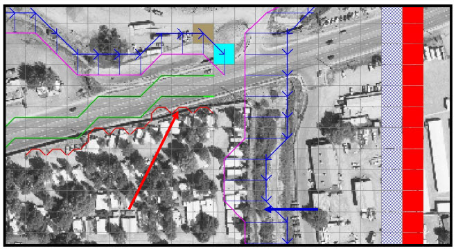

*Figure 1.
Levees are Displayed in Red and the Channel in Blue in the GDS Program.*

Levee and Dam Breach Failure
-----------------------------

General
-------

FLO-2D can simulate levee and dam breach failures.
This may encompass the gradual erosion of a dam or levee or the instantaneous collapse of a flood wall.
Dam and levee breaches are time dependent and nonlinear phenomena that vary with the non-homogenous embankment materials.
The breach process is a complex interaction of hydrodynamics, geotechnical slope stability failure and sediment transport (hyperconcentrated sediment
flow).
Ultimately, the discharge volume through a breach is primarily a function of the rate of breach expansion and initial breach mechanism is not as
important to the downstream area of flood inundation.

There are two failure modes: 1) Prescribed failure using vertical and horizontal rates of breach expansion; 2) Predicted breach erosion of earthen
embankments using sediment transport capacity equations.
Prescribed failure is defined a levee or dam breach that is computed using uniform expansion rate in vertical and horizontal from a one foot wide
breach to a full breach opening.
If the rates of failure are set to zero, the levee or wall can failure instantaneously.

The FLO-2D model can automatically access the location of the initial levee breach based on computed flood routing hydraulics.
The breach computational timestep is controlled by the flood routing routine in the model.
FLO-2D computes the breach widening, the discharge through the breach, the change in upstream storage, the tailwater and backwater effects, and the
downstream flood inundation.
The model generates output data for analyzing the dam or levee failure in time or space that includes the time of breach or overtopping, the breach
hydrograph, peak discharge through the breach, sediment erosion volume and extent, and breach parameters as a function of time.
Additional output files that define the breach hazard include the time-to-peak, the timeto-one foot flow depth and time-to-two foot flow depth.
These results can be mapped to aid in determining evacuation or emergency access routes.
Examples of area of inundation mapping from a levee and dam breach are shown in Figure 2 and Figure 3.

.. image:: img/Levee023.jpg

*Figure 2.
Example of Levee Breach Urban Flooding*

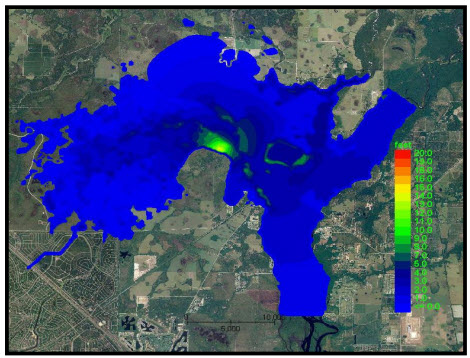

*Figure 3.
Example of a Proposed Domestic Water Supply Reservoir Breach Failure.*

Prescribed Levee and Dam Failure
--------------------------------

For the prescribed levee failure routine, the breach can enlarge vertically and horizontally or fail instantaneously.
The initial breach width is hardcoded in the model to 1 ft (0.3 m).
This initial breach width extends from the breach invert to the crest.
Rates of breach expansion (ft/hr or m/hr) can be specified for both the horizontal and vertical failure modes.
Breach discharge is based on the breach width and the difference in water surface elevations on each side of the levee.
A final levee base elevation that is higher than the floodplain elevation can also be specified.
The levee failure can occur for the entire grid element width for a given flow direction and then the breach can grow to contiguous levee elements.
The prescribed levee breach can be assigned to globally predict the location of the failure anywhere in the grid system based on the computed water
surface elevation.
Additional breach failure variables such as initial failure elevation if different from overtopping failure and duration of saturation before failure
can be assigned to add detail to multiple levee failure locations.
The highlights of spatially variable levee failure are:

    - Levee failure can occur anywhere on the grid system based on overtopping or the water surface elevation reaching a specified distance below the crest
      elevation for an assigned duration.
    - Multiple levee breaches can occur and expand in various locations simultaneously.
    - Levee breach expansion with prescribed horizontal or vertical rates.
    - Failure can occur from either side of the levee (river side and land side).
    - Based on water surface elevation, flow through the levee breach can occur in either direction.
      As landside ponding equilibrates with the river water surface elevation, the beach flow may alternate directions.
    - Levees may overtop or breach into detention basins or channel retention facilities.
      Basin pumps then can be integrated with FLO-2D levee breach analyses.
    - By setting the prescribed breach failure rates equal to zero, an instantaneous collapse of the levee or wall can be simulated for a specified maximum
      width or the side width of the grid element.

Unless the levee or wall failure is instantaneous, the failure mechanism, initial breach width and the first thirty minutes or so of breach widening
are generally inconsequential to the downstream flooding.
The failure mechanism (piping, slope stability failure, overtopping, rodent boroughs, etc.) is important to the geotechnical engineer concerned with
dam slope stability, but the flood volume associated with the first moments of the breach are generally negligible compared to the eventual flood
volume on the landside of the levee.
Until the breach discharge reaches some reasonable magnitude relative to the peak discharge, the type of breach failure and the initial breach
geometry and width can be ignored.

Once the levee breach is initiated, the breach widens vertically and horizontally based on prescribed uniform rates of expansion.
The range of typical levee breach growth rates might be 1 to 10 ft/hr in the vertical and 10 to 50 ft/hr in the horizontal.
These values can be higher for a large embankment dam.
The horizontal breach rate will automatically decrease.
When the vertical breach reaches the levee base elevation the maximum breach shear stress (τ\ :sub:`max`) is computed.
Subsequently the horizontal breach rate (HBR) for the time step is set equal to the originally assigned horizontal breach rate (HBR\ :sub:`orig`)
times the ratio of the computed shear stress for the time step to the maximum shear stress:

.. math::
   :label:

   HBR = HBR_{orig}\left( \frac{\tau_{calc}} {\tau_{\max}} \right)

This will slow the rate of breach widening as the flow depth and velocity decrease or as the tailwater to headwater equilibrates.
A typical rate of breach width decrease is shown in Figure 4.

.. image:: img/Levee002.jpg

*Figure 4.
Prescribed Breach Horizontal Rate Decrease with Decreasing Shear Stress.*

Levee and Dam Predicted Breach Erosion
--------------------------------------

The breach erosion component was added to the FLO-2D model to predict a realistic assessment of a levee or dam failure in concert with the downstream
flooding.
The National Weather Service (NWS) BREACH model by Fread (1988) served as the template for the FLO-2D breach erosion component.
The BREACH model source code was obtained from the NWS website and then extensively revised to expand and enhance the breach model and correct some
code errors in the original model.
The primary hydraulic mechanisms of dam or levee breach failure are overtopping, piping and slope stability failure by sliding, slumping or collapse.
These physical processes were simulated in the original NWS model and were retained in the FLO-2D model.
In FLO-2D a dam or levee breach can fail as follows:

    - Overtopping and development of a breach channel on the downstream face of the dam or levee; • Piping failure;
    - Piping failure and roof collapse and development into a breach channel;
    - Breach channel enlargement through side slope slumping;
    - Breach enlargement by wedge collapse.

The user has the option to specify the breach element and elevation or to assign global parameters and the model will locate the initial levee breach
failure element based on the water surface elevation and duration of inundation.
During a flood simulation, water can pond against the levee or dam until the water surface elevation is higher than the structure, overtops it and
develops a breach channel.
The user can also assign a prescribed breach elevation or a distance below the crest elevation as the breach elevation.
When the water surface elevation exceeds the breach elevation for a given duration, piping is initiated.
If the pipe roof collapses, then the discharge is computed through the resultant breach channel.
A description of the breach enlargement routine is presented in the following sections.

Water routed through the breach is accounted by the volume conservation routines in the FLO-2D model that tracks the storage volume along with the
discharge in and out of every grid element according to the FLO-2D timesteps.
These timesteps are significantly smaller (5 to 10 times smaller) than the timesteps used in the original NWS BREACH model.
The breach component also assesses the sediment volume conservation and the breach water discharge is bulked by the sediment eroded during the breach
failure.
Routing water through the breach continues until the water surface elevation no longer exceeds the breach bottom elevation or until all the ponded
water is gone.

One of the reasons for selecting the NWS BREACH model for the FLO-2D model template is that the program had sufficient geotechnical detail to
mathematically represent the physical process of dam breach failure.
As a result, the FLO-2D breach model includes the following features:

    - The embankment can have an impervious core and a non-cohesive shell with different materials;
    - Embankment material properties include sediment size, specific weight, cohesive strength, internal friction angle, porosity and Manning’s n-value;
    - Breach channel initiation through piping failure;
    - Enlargement of the breach through sudden structural collapse or slope instability;
    - Riprap material or grass on the downstream face;
    - Sediment transport for different size sediment in the embankment core or shell.

The following assumptions are hardcoded into the FLO-2D breach model:

    - Initial breach width to depth ratio (BRATIO) – if the assigned breach width to depth ratio is 0.0 (in the BREACH.DAT file), then BRATIO = 2.
    - The initial piping width is assumed to be 1.0ft (0.30m).
    - The minimum and maximum Manning’s n-values permitted for the breach flow resistance are 0.02 and 0.25, respectively.
    - The pipe outlet at the toe of the dam or levee is the downstream grid element floodplain elevation plus 1 ft (0.3 m).
    - After the specified breach initiation condition is reached, the breach discharge is computed if the upstream water surface elevation exceeds the
      upstream breach pipe or channel bottom elevation plus a tolerance value of 0.1 ft or 0.3 m.
    - If the specified initial breach elevation in the BREACH.DAT file is less than 10.0 ft (3.0 m), then the initial piping breach elevation is assumed to
      be the dam or levee crest elevation minus the assigned breach elevation (Initial Breach Elevation = Levee Crest – BRBOTTOMEL).

Pipe Breach
-----------

If the user specifies a breach elevation, pipe flow will be initiated when the upstream water surface exceeds the specified pipe invert elevation.
The pipe breach discharge is computed as weir flow with a user specified weir coefficient.
The discharge is then used to compute velocity and depth as Darcy-Weisbach flow in a rectangular pipe.
Using the pipe hydraulics and the embankment material parameters, sediment transport capacity is computed using a modified Meyer-Peter Muller (MPM-
Smart) bedload equation (Fread, 1988) or one of eight other sediment transport capacity equations available in the FLO-2D model.
See the FLO-2D Data Input Manual for the complete list of sediment transport equations.
The sediment discharge is assumed to erode uniformly from the walls, bed and the roof of the pipe (Figure 5).
When the pipe opening height is larger than the height of the material remaining in the embankment above the pipe, the roof of the pipe collapses and
channel flow ensues through the breach.

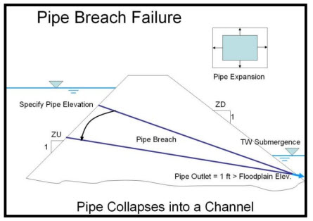

*Figure 5.
Pipe Breach Failure.*

Overtopping and Channel Breach
------------------------------

Channel flow through the breach can occur if the pipe roof collapse or if the flow overtops the dam or levee.
The channel discharge is calculated by the broadcrested weir equation and similar to the pipe failure, the eroded sediment volume is uniformly removed
from the bed and sides of the rectangular channel (Figure 6).
As the channel breach width and height increases, the slope stability is checked.
If the stability criteria are exceeded, the sides of the channel slump into the flow and the rectangular breach transitions to a trapezoidal channel.
The breach continues to widen until the top width of the channel equals the specified maximum width of failure, the dam crest length or the available
connected levee grids.

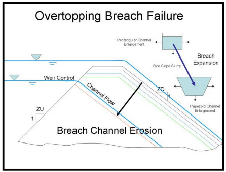

*Figure 6.
Overtopping and Channel Breach Erosion.*

Dam Collapse
------------

Breach enlargement is also possible through a sudden collapse of the upper portion of the dam.
The collapse would consist of a wedge shaped mass of embankment material.
This collapse or blow-out is caused by the water pressure on the upstream side of the wedge which eventually exceeds the shear forces of friction and
cohesion that resist sliding.
When the dam collapse occurs, it is assumed that the breach enlargement ceases until all the wedge material is transported downstream.
A flow chart of the basic computation scheme for the breach component is shown in Figure 7.

.. image:: img/Levee003.png

*Figure 7.
Breach Schematic Flow Chart.*

Levee Overtopping without Failure
------------------------------------

Levee overtopping can occur without breach failure.
Floodplain features such as roadway or railroad embankments, concrete walls and levees with riprap can be overtopped without erosion or failing.
The discharge from levee overtopping is shared between two cells with the levee assignment on the border between them.
In Figure 8, the levee crest width is L\ :sub:`r`, the headwater depth is H\ :sub:`r`, the tailwater depth is h\ :sub:`t`, the ratio of tailwater to
headwater is given by d\ :sub:`t`/d\ :sub:`h` based on the highest grid element floodplain elevation.

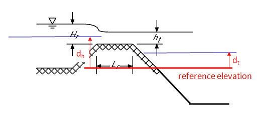

*Figure 8.
Levee Overtopping Definition.*

The flow can occur in either direction and the discharge Q is computed using the conventional broad-crested weir equation:

.. math::
    :label:

    Q = CLH_d^{1.5}

where:

    C is the broadcrested weir coefficient (3.09 in English units, average typical coefficient for the broadcrested weir);

    L is the length of the levee crest

    H\ :sub:`d` is the headwater on the levee (Figure 9).The headwater depth must exceed a tolerance value = 0.1 ft (0.3 m) for discharge to occur.
    This is to accommodate non-uniform crest elevations and minute discharges that will not impact the flooding.
    Typically, if the flow is greater than about 0.1 ft, the discharge will be significant.

Submergence
-----------

The levee weir coefficient is variable as a function of the headwater based on the U.S.
Department of

Transportation criteria (Hydraulic Design of Highway Culverts; Publication Number FHWA-HIF-12-026 revised 2012) as shown in Figure 9.
If ratio of the tailwater to the headwater above the crest is greater than 0.8, the discharge is reduced by a submergence factor (Figure 10).
If the water surface elevation on both sides of the levee is greater than 3 ft (1 m) above the crest, the discharge exchange is based on the overland
flow routing routine.
These modifications to the broadcrested weir equation may the discharge transitions more gradual and reduce the potential for numerical stability.

.. image:: img/Levee005.jpg

*Figure 9.
Schematic of the Levee Overtopping Flow.*

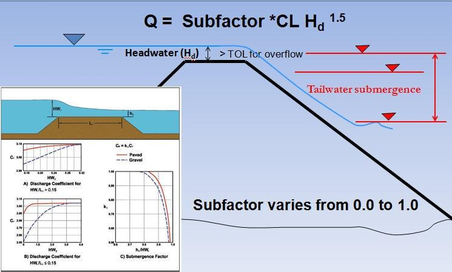

*Figure 10.
Levee Overtopping Tailwater Submergence.*

Prescribed Levee Breach Input Data
-----------------------------------

The prescribed breach failure is recommended over the breach erosion failure because the physical process of sediment scour in hyperconcentrated
sediment flows is poorly understood and simplistically mathematically represented.
The prescribed levee failure is shown schematically in Figure 11.

.. image:: img/Levee007.jpg

*Figure 11.
Prescribed Levee Failure Definition.*

The prescribed breach failure data can be entered in the GDS (select the grid cell and go to *Grid|Assign Parameters to selection|Levee*) as shown in
Figure 12.
The required data includes:

    - Elevation of the prescribed failure if different from the levee crest
    - Duration of saturation prior to breach initiation
    - Breach base elevation if different from the floodplain elevation
    - Maximum breach width
    - Vertical and horizontal rates of breach expansion

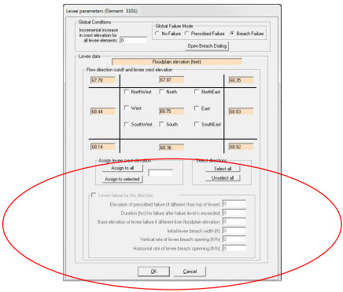

*Figure 12.
GDS Prescribed Breach Dialog Box.*

Maximum
~~~~~~~

Levee breaches can be located based on the water surface elevation.
Multiple failure can occur simultaneously in the levee system.
The levee failure will initiate when the water surface exceeds an assigned elevation for a given duration.
The duration of inundation or saturation is based on the cumulative time above the prescribed levee elevation (Figure 13).

.. image:: img/Levee008.jpg

*Figure 13.
Prescribed Levee Breach Initiates When the Assigned Duration is Exceeded.*

During a prescribed levee breach simulation, there are a number of data variables that may be assigned to control the levee overtopping and breach
discharges for a range of flows and failure conditions.
Table 1 outlines the potential controls.

*Table 1.
Prescribed Breach Failure Controls and Guidelines*

.. raw:: html

   <table style="border-collapse: collapse; width: 100%;">
     <caption><strong>Prescribed Breach Failure Controls and Guidelines</strong></caption>
     <thead>
       <tr>
         <th style="border: 1px solid #000; padding: 4px;">Levee Data</th>
         <th style="border: 1px solid #000; padding: 4px;">Model Data or Flow Condition</th>
       </tr>
     </thead>
     <tbody>
       <tr>
         <td style="border: 1px solid #000; padding: 4px;" rowspan="9">
           Levee Data  
           Levee is defined by grid element, 
           flow direction blocked by the 
           levee and levee crest elevation.
         </td>
         <td style="border: 1px solid #000; padding: 4px;">
           Model checks to make sure the crest elevation is higher than the grid element
           elevation on both sides of the levee.
         </td>
       </tr>
       <tr>
         <td style="border: 1px solid #000; padding: 4px;">
           Model checks if the levee is on the grid system domain boundary with no grid
           element on the other side of the levee. A warning message is generated.
         </td>
       </tr>
       <tr>
         <td style="border: 1px solid #000; padding: 4px;">
           The levee must continuous without breaks. No flow leakage thru the levee
           system. Requires review of output.
         </td>
       </tr>
       <tr>
         <td style="border: 1px solid #000; padding: 4px;">
           Model checks if the levee is assigned to outflow nodes. This will generate an
           error message.
         </td>
       </tr>
       <tr>
         <td style="border: 1px solid #000; padding: 4px;">
           The model generates a warning message for levees assigned to hydraulic
           structure inflow or outflow nodes.
         </td>
       </tr>
       <tr>
         <td style="border: 1px solid #000; padding: 4px;">
           If 3-D polyline point data is used to assign the levee, WRF values are
           automatically assigned to levee element sides to match the actual levee length.
         </td>
       </tr>
       <tr>
         <td style="border: 1px solid #000; padding: 4px;">
           User should check floodplain elevations on each side of the levee to represent
           ground elevations. Interpolated ground elevations may be higher due to the
           DTM points on the levee crest.
         </td>
       </tr>
       <tr>
         <td style="border: 1px solid #000; padding: 4px;">
           Set ILEVFAIL = 0, no levee failure 
           Set ILEVFAIL = 1, prescribed levee failure, 
           Set ILEVFAIL = 2, for breach erosion failure.
         </td>
       </tr>
       <tr>
         <td style="border: 1px solid #000; padding: 4px;">
           If prescribed failure levee grid element is negative, the failure data for that
           element is assumed to be global and applies to all the levee elements and
           blocked flow directions. In this case, the failure data needs only to be assigned
           to one element.
         </td>
       </tr>
       <tr>
         <td style="border: 1px solid #000; padding: 4px;" rowspan="9">
           Prescribed Levee Failure Data
         </td>
         <td style="border: 1px solid #000; padding: 4px;">
           Levee breach failure is defined by failure direction, elevation of water surface to
           initiate failure, the duration that the failure elevation is exceeded before
           initiating failure, failure base elevation, maximum breach width, and vertical and
           horizontal rates of breach widening.
         </td>
       </tr>
       <tr>
         <td style="border: 1px solid #000; padding: 4px;">
           The initial breach width = 1.0 ft (0.3 m) is hardwired.
         </td>
       </tr>
       <tr>
         <td style="border: 1px solid #000; padding: 4px;">
           If failure elevation = 0., the levee breach failure begins immediately when
           overtopped. Otherwise, the levee breach is initiated when the water surface
           exceeds the assigned failure elevation by 0.1 ft (0.03 m). If the failure elevation
           is < 10 ft, the failure elevation is the distance below the crest elevation. In this
           case, the failure elevation = crest elevation - failure elevation. If the failure data
           has been globally assigned, the breach initiation can occur for all the grid
           element sides with levees when the water surface exceeds the global failure
           elevation.
         </td>
       </tr>
       <tr>
         <td style="border: 1px solid #000; padding: 4px;">
           If the failure duration time = 0., breach failure initiates immediately.
         </td>
       </tr>
       <tr>
         <td style="border: 1px solid #000; padding: 4px;">
           If the levee is to fail at an appropriate distance below the crest after being
           inundated for a reasonable duration, assign values to both the failure elevation
           and failure duration time.
         </td>
       </tr>
       <tr>
         <td style="border: 1px solid #000; padding: 4px;">
           If the failure base elevation = 0., the final levee breach elevation is equal to the
           floodplain grid element elevation on the opposite side of the levee.
         </td>
       </tr>
       <tr>
         <td style="border: 1px solid #000; padding: 4px;">
           For a progressive levee failure, assign the vertical and horizontal breach rates.
         </td>
       </tr>
       <tr>
         <td style="border: 1px solid #000; padding: 4px;">
           If the vertical and horizontal rates of failure are zero, the levee (wall) fails
           instantaneously for the entire grid element side width.
         </td>
       </tr>
       <tr>
         <td style="border: 1px solid #000; padding: 4px;">
           If the maximum failure width is longer than the grid element side, the breach
           will extend into adjacent grid elements until the maximum failure width is
           equaled or the levee ends. For instantaneous failure, every grid element side
           levee that will collapse must be assigned.
         </td>
       </tr>
       <tr>
         <td style="border: 1px solid #000; padding: 4px;" rowspan="4">
           Levee Overtopping Discharge
         </td>
         <td style="border: 1px solid #000; padding: 4px;">
           The flow depth on the levee crest must exceed a hardcoded tolerance value
           equal to 0.1 ft (0.3 m) to enable the overtopping discharge to be computed.
         </td>
       </tr>
       <tr>
         <td style="border: 1px solid #000; padding: 4px;">
           Flow over the levee is computed using the conventional broadcrested weir
           equation with a variable weir coefficient that depends on the headwater depth.
           The headwater depth depends on whether one or both of the water surface
           elevations are greater than the crest. If the headwater depth > 3ft, then the
           weir coefficient is 3.09. If the headwater depth < 3., the weir coefficient can
           range between 2.5 and 3.09.
         </td>
       </tr>
       <tr>
         <td style="border: 1px solid #000; padding: 4px;">
           If the ratio of the tailwater to the headwater is greater than 0.8, then the
           discharge is multiplied by a submergence factor that is less than 1.0 based on
           the submergence curves (Figure 8).
         </td>
       </tr>
       <tr>
         <td style="border: 1px solid #000; padding: 4px;">
           The overtopping discharge in all possible directions including the peak discharge
           are reported in the LEVOVERTOP.OUT file.
         </td>
       </tr>
       <tr>
         <td style="border: 1px solid #000; padding: 4px;" rowspan="7">
           Levee Breach Discharge
         </td>
         <td style="border: 1px solid #000; padding: 4px;">
           The flow depth on the levee breach must exceed a tolerance value of 0.1 ft (0.3
           m) for the breach discharge to be computed. The flow depth is based on the
           highest water surface and the levee breach elevation.
         </td>
       </tr>
       <tr>
         <td style="border: 1px solid #000; padding: 4px;">
          Breach discharge is computed with a broadcrested weir equation with a variable
          coefficient that depends on the headwater depth above the breach elevation.
          The headwater depth depends on whether one or both of the water surface
          elevations are greater than the breach elevation. If the headwater depth > 3 ft,
          then the levee weir coefficient = 3.09. If the headwater depth < 3., the weir
          coefficient can range between 2.5 and 3.09.
         </td>
       </tr>
       <tr>
         <td style="border: 1px solid #000; padding: 4px;">
           If the ratio of the tailwater to the headwater above the breach elevation is
           greater than 0.8, then the discharge is multiplied by a submergence factor that
           is less than 1.0 based on the submergence curves.
         </td>
       </tr>
       <tr>
         <td style="border: 1px solid #000; padding: 4px;">
           If the levee (wall) fails instantaneously to the levee base elevation, the flow is
           computed by the overland flow routine using the side width of the grid system.
         </td>
       </tr>
       <tr>
         <td style="border: 1px solid #000; padding: 4px;">
           If the levee breach progressively widens and extends to other contiguous levee
           element sides, the discharge is based on the computed breach width using the
           horizontal breach rate.
         </td>
       </tr>
       <tr>
         <td style="border: 1px solid #000; padding: 4px;">
           When the vertical breach has reached the levee base elevation, the maximum
           shear stress on the breach is computed. Subsequently the original horizontal
           breach rate is reduced by the ratio of the current shear stress to the maximum
           shear stress on the breach (Figure 12).
         </td>
       </tr>
       <tr>
         <td style="border: 1px solid #000; padding: 4px;">
           The breach discharge and breach geometry is reported in the LEVEE.OUT file.
         </td>
       </tr>
     </tbody>
   </table>

Urban Wall Failure (Collapse)
-------------------------------------

Simulating flood confinement by urban walls in the FLO-2D model is accomplished with the levee component by blocking one or more of the eight flow
directions.
In an urban environment, levees may represent floodwalls, highway sound walls, or neighborhood or residential lot privacy walls.
These features obstruct flood flow and result in detention storage.
Walls are treated by the FLO-2D model as zero width displacing negligible flood storage.
For wide walls that could potentially affect the floodplain storage volume, grid element area reduction factors (ARF-values) can be assigned to
simulate the reduction of cell storage area.
Wall failure or collapse is simulated by FLO-2D (Figure 14).

Walls block one of more of the grid element boundaries (Figure 15) and can connect with the sides of contiguous floodplain elements.
If a wall runs through the center of a grid element, the wall is positioned to several of the eight grid element boundaries.
A wall crest elevation is assigned for each of the blocked grid element flow directions with potential for flow overtopping.
The failure elevation can be assigned to predict wall collapse.
Overtopping will not cause collapse unless the wall failure option is invoked.
When the predicted water surface exceeds the assigned levee crest elevation, the discharge over the wall is computed using the broad-crested weir flow
equation.

The QGIS and the GDS preprocessor programs and the FLO-2D model all check the data to ensure that the wall crest elevations are higher than the
corresponding floodplain grid element elevations.
In some cases, the floodplain elevations may need to be reviewed and adjusted with respect to wall crest elevations and other neighbor grid element
elevations.

Hydraulic structures may be used to allow flow to pass through or under a wall (see Hydraulic Structure Guidelines).
A drainage hole in a block wall or a culvert under a wall are examples of combined wall and hydraulic structure components.
The use of a hydraulic structure in contiguous grid elements separated by a wall requires that both the discharge under and through the wall is
represented by the hydraulic structure rating table for that flow direction.
When the wall fails instantaneously, the hydraulic structure flow is also terminated, and the model reverts to overland flow calculations.

.. image:: img/Levee009.jpg

*Figure 14.
Wall Collapse. (FCDMC, 2018)*

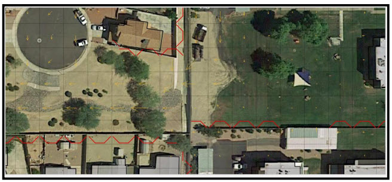

*Figure 15.
Walls are Displayed by the Thin Red Lines.*

Wall Failure Modes
------------------

There are two failure modes for walls and levees: 1) Prescribed failure using vertical and horizontal rates of breach expansion; 2) Predicted breach
erosion of earthen embankments using sediment transport capacity equations.
For wall collapse, the prescribed failure mode is the only tool that is used.
Although beach expansion with a vertical and horizontal rate of failure is possible, an instantaneous wall failure is typically the only method
applied (failure rates are set to zero).
When instantaneous wall failure is simulated, the entire side of the grid element with the wall is opened to allow flow through it.

The FLO-2D model can automatically predict the location of the wall failure using a global failure assignment and the computed flood routing
hydraulics.
Once the wall has been predicted to fail, FLO-2D computes the discharge through the breach, the change in upstream storage, the tailwater and
backwater effects, and the downstream flood inundation.
The model generates output data for analyzing the wall failure in time or space that includes the time of failure or overtopping, the breach
hydrograph, and peak discharge through the breach.
The breach discharge is based on the breach width and the difference in water surface elevations on each side of the wall.
A final base elevation that is higher than the floodplain elevation can also be specified.
Additional wall failure variables such as initial failure elevation if different from overtopping failure and duration of saturation before failure
can be assigned to add detail to multiple levee failure locations.
Wall failure highlights are:

    - Wall failure can occur anywhere on the grid system based on overtopping or if the water surface elevation reaches a specified distance below the crest
      elevation.
    - Multiple wall failure can occur in various locations simultaneously.
    - Wall failure expansion can be based on prescribed horizontal or vertical rates.
    - Failure can occur from either side of the wall.
    - Based on water surface elevation, flow through the breach can occur in either direction.
      As ponding equilibrates on each side of the wall, flow through the wall may alternate directions.
    - By setting the breach failure rates equal to zero, an instantaneous collapse of the wall will be simulated for a specified maximum width or the side
      width of the grid element.

Wall Overtopping without Failure
--------------------------------

Concrete or block walls can be overtopped without failing.
Overtopping discharge is shared between two cells with the wall assignment on their border.
In Figure 16 the overtopping discharge Q is computed using the conventional broad-crested weir equation:

.. math::
    :label:

    Q = CLH_d^{1.5}

.. image:: img/Levee010.jpg

*Figure 16.
Levee Overtopping Definition.*

where C is the broadcrested weir coefficient (3.09 in English units, typical coefficient for the broadcrested weir); L is the length of the wall crest
(side of the grid element) and H\ :sub:`d` is the headwater on the wall.
The headwater depth must exceed a tolerance value = 0.1 ft (0.3 m) for discharge to occur.
This is to accommodate non-uniform crest elevations and minor overtopping discharges that will not impact the flood distribution.

The weir coefficient is variable as a function of the headwater based on the U.S.
Department of Transportation criteria (Hydraulic Design of Highway Culverts; Publication Number FHWA-HIF-12-026 revised 2012).
If ratio of the tailwater to the headwater above the crest is greater than 0.8, the discharge is reduced by a submergence factor (Figure 17).
When the water surface elevation on both sides of the wall is greater than 3 ft (1 m) above the crest, the discharge exchange is based on the overland
flow routing routine.
These modifications make the discharge transition more gradual and reduce the potential for numerical stability.

.. image:: img/Levee011.jpg

*Figure 17.
Levee Overtopping Tailwater Submergence.*

Wall Collapse
-------------

Wall collapse data can be entered in either the QGIS or GDS (Figure 18 in red box).
The required data includes:

    - Failure side (1 of 8 flow directions)
    - Global failure – failure criteria applies to all wall elements and directions o (negative failure grid element in LEVEE.DAT)
    - Failure elevation if different from the levee crest (0 = failure at overtopping)
    - Cumulative duration at failure elevation (allows saturation; set to zero)
    - Fail to base elevation if different from the floodplain elevation
    - Maximum failure width (default to grid element side)
    - Vertical and horizontal rates of breach expansion (0 = instantaneous collapse)

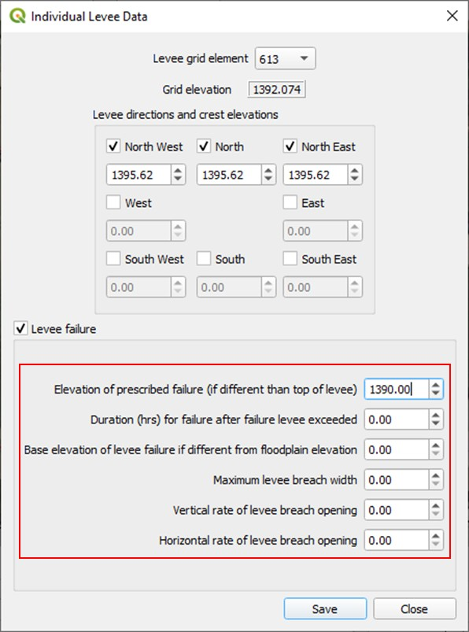

*Figure 18.
QGIS Prescribed Wall Breach Dialog Box.*

Failure will initiate when the water surface exceeds an assigned elevation and duration.
The failure criteria can be defined using the grid element elevation + a fail height as shown in Figure 19.
Wall Collapse Height.
(FCDMC).

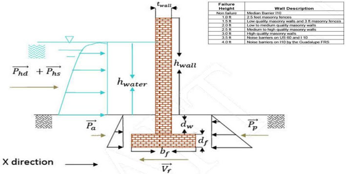

*Figure 19.
Wall Collapse Height. (FCDMC)*

Wall Failure Guidelines
-----------------------

The following table presents the wall failure guidelines, controls and data checks.

*Table 2.
Wall Failure Guidelines*

.. raw:: html

   <table style="border-collapse: collapse; width: 100%;">
     <caption><strong>Wall Failure Guidelines</strong></caption>
     <thead>
       <tr>
         <th style="border: 1px solid #000; padding: 4px;">Wall Data</th>
         <th style="border: 1px solid #000; padding: 4px;">Model Data or Flow Condition</th>
       </tr>
     </thead>
     <tbody>

       <!-- WALL DATA BLOCK 1 -->
       <tr>
         <td style="border: 1px solid #000; padding: 4px;" rowspan="11">
           Wall is defined 
           by grid 
           element, flow 
           direction 
           blocked by the 
           levee and levee 
           crest elevation
         </td>
         <td style="border: 1px solid #000; padding: 4px;">
           Model checks to make sure the crest elevation is higher than the grid element
           elevation on both sides of the levee.
         </td>
       </tr>

       <tr>
         <td style="border: 1px solid #000; padding: 4px;">
           Model checks if the wall is on the grid system domain boundary with no grid element
           on the other side of the levee. A warning message is generated.
         </td>
       </tr>

       <tr>
         <td style="border: 1px solid #000; padding: 4px;">
           The wall must be continuous without breaks. No flow leakage thru the levee system.
           Requires review of output.
         </td>
       </tr>

       <tr>
         <td style="border: 1px solid #000; padding: 4px;">
           If the ground elevations on each side of the wall are different by more than 0.5 ft,
           the cell with the higher elevation are set to lower grid element elevation.
         </td>
       </tr>

       <tr>
         <td style="border: 1px solid #000; padding: 4px;">
           If the failure elevation is lower than either ground elevation, the failure elevation is
           reset to 3 ft above the lowest ground elevation.
         </td>
       </tr>

       <tr>
         <td style="border: 1px solid #000; padding: 4px;">
           Model checks if the wall is assigned to outflow nodes. This will generate an error
           message.
         </td>
       </tr>

       <tr>
         <td style="border: 1px solid #000; padding: 4px;">
           A warning message is generated for a wall assigned to hydraulic structure inflow or
           outflow nodes.
         </td>
       </tr>

       <tr>
         <td style="border: 1px solid #000; padding: 4px;">
           If 3-D polyline point data is used to assign the wall, WRF values are automatically
           assigned to element sides to match the actual wall length.
         </td>
       </tr>

       <tr>
         <td style="border: 1px solid #000; padding: 4px;">
           Model checks interpolated floodplain elevations on each side of the wall.
         </td>
       </tr>

       <tr>
         <td style="border: 1px solid #000; padding: 4px;">
           Set ILEVFAIL = 1 for wall failure.
         </td>
       </tr>

       <tr>
         <td style="border: 1px solid #000; padding: 4px;">
           If wall failure grid element is negative, the failure data for that element applies to all
           the wall elements and blocked flow directions. In this case, the global failure data
           needs only to be assigned to one element.
         </td>
       </tr>

       <!-- WALL FAILURE DATA BLOCK -->
       <tr>
         <td style="border: 1px solid #000; padding: 4px;" rowspan="9">
           Prescribed Wall 
           Failure Data
         </td>
         <td style="border: 1px solid #000; padding: 4px;">
           Wall failure is defined by flow direction, water surface elevation to initiate failure,
           cumulative duration that the failure elevation is exceeded before initiating failure
           (typically zero), failure base elevation (typically zero), maximum breach width
           (typically zero), and vertical and horizontal rates of breach widening (typically both
           are zero).
         </td>
       </tr>

       <tr>
         <td style="border: 1px solid #000; padding: 4px;">
           The initial breach width = 1.0 ft (0.3 m) is hardwired.
         </td>
       </tr>

       <tr>
         <td style="border: 1px solid #000; padding: 4px;">
           If failure elevation = 0, the collapse begins immediately when the wall is overtopped.
           Otherwise, the wall failure is initiated when the water surface exceeds the assigned
           failure elevation. If the failure elevation is less than 10 ft (3 m), the failure elevation
           is the distance below the crest elevation. In this case, the failure elevation = crest
           elevation - failure elevation. If the failure data has been globally assigned, the
           breach initiation can occur for all the grid element sides with walls when the water
           surface exceeds the global failure elevation.
         </td>
       </tr>

       <tr>
         <td style="border: 1px solid #000; padding: 4px;">
           If the failure duration time = 0, breach failure initiates immediately.
         </td>
       </tr>

       <tr>
         <td style="border: 1px solid #000; padding: 4px;">
           If the wall is to fail at an appropriate distance below the crest after being inundated
           for a reasonable duration, assign values to both the failure elevation and failure
           duration time.
         </td>
       </tr>

       <tr>
         <td style="border: 1px solid #000; padding: 4px;">
           If the failure base elevation = 0, the final wall failure elevation is equal to the
           floodplain grid element elevation on the opposite side of the wall.
         </td>
       </tr>

       <tr>
         <td style="border: 1px solid #000; padding: 4px;">
           For a progressive wall failure, assign the vertical and horizontal rates.
         </td>
       </tr>
       <tr>
         <td style="border: 1px solid #000; padding: 4px;">
           If the vertical and horizontal rates of failure are zero, the levee (wall) fails
           instantaneously for the entire grid element side width.
         </td>
       </tr>
       <tr>
         <td style="border: 1px solid #000; padding: 4px;">
           If the maximum failure width is longer than the grid element side, the breach
           will extend into adjacent grid elements until the maximum failure width is
           equaled or the wall ends. For instantaneous failure, every grid element side
           levee that will collapse must be assigned.
         </td>
       </tr>

       <!-- WALL OVERTOPPING -->
       <tr>
         <td style="border: 1px solid #000; padding: 4px;" rowspan="4">
           Wall Overtopping Discharge
         </td>
         <td style="border: 1px solid #000; padding: 4px;">
           The flow depth on the wall must exceed a hardcoded tolerance value equal to 0.1 ft
           (0.03 m) to enable the overtopping discharge to be computed.
         </td>
       </tr>

       <tr>
         <td style="border: 1px solid #000; padding: 4px;">
           Flow over the wall is computed using the broadcrested weir equation with a variable
           weir coefficient that depends on the headwater depth. The headwater depth
           depends on whether one or both of the water surface elevations are greater than
           the crest. If the headwater depth &gt; 3 ft (1.0 m), then the weir coefficient is 3.09. If
           the headwater depth &lt; 3 ft (1.0 m), the coefficient can range from 2.5 and 3.09.
         </td>
       </tr>

       <tr>
         <td style="border: 1px solid #000; padding: 4px;">
           If the ratio of the tailwater to the headwater is greater than 0.8, then the discharge is
           multiplied by a submergence factor that is less than 1.0 based on the submergence
           curves (Figure 3).
         </td>
       </tr>

       <tr>
         <td style="border: 1px solid #000; padding: 4px;">
           The overtopping discharge in all possible directions including the peak discharge are
           reported in the LEVOVERTOP.OUT file.
         </td>
       </tr>

       <!-- WALL BREACH -->
       <tr>
         <td style="border: 1px solid #000; padding: 4px;" rowspan="7">
           Wall Breach Discharge
         </td>
         <td style="border: 1px solid #000; padding: 4px;">
           The flow depth on the wall breach must exceed a tolerance value of 0.1 ft (0.03 m)
           for the breach discharge to be computed. The flow depth is based on the highest
           water surface and the wall failure elevation.
         </td>
       </tr>

       <tr>
         <td style="border: 1px solid #000; padding: 4px;">
           Breach discharge is computed with a broadcrested weir equation with a variable
           coefficient that depends on the headwater depth above the breach elevation. The
           headwater depth depends on whether one or both of the water surface elevations
           are greater than the breach elevation. If the headwater depth &gt; 3 ft (1.0 m), then the
           levee weir coefficient = 3.09. If the headwater depth &lt; 3 ft (1.0 m), the
           coefficient can range between 2.5 and 3.09.
         </td>
       </tr>

       <tr>
         <td style="border: 1px solid #000; padding: 4px;">
           If the ratio of the tailwater to headwater above the breach elevation is greater than
           0.8, then the discharge is multiplied by a submergence factor (&gt; 1.0) based on the
           submergence curves.
         </td>
       </tr>

       <tr>
         <td style="border: 1px solid #000; padding: 4px;">
           If the wall fails instantaneously to the base elevation, the flow is computed by the
           overland flow routine using the side width of the grid system.
         </td>
       </tr>

       <tr>
         <td style="border: 1px solid #000; padding: 4px;">
           If the wall breach progressively widens and extends to other contiguous element
           sides, the discharge is based on the computed breach width using the horizontal
           breach rate.
         </td>
       </tr>

       <tr>
         <td style="border: 1px solid #000; padding: 4px;">
           When the vertical breach has reached the wall base elevation, the maximum shear
           stress on the breach is computed. Subsequently the original horizontal breach rate
           is reduced by the ratio of the current shear stress to the maximum shear stress on
           the breach.
         </td>
       </tr>

       <tr>
         <td style="border: 1px solid #000; padding: 4px;">
           The breach discharge and breach geometry is reported in the LEVEE.OUT file.
         </td>
       </tr>
     </tbody>
   </table>

Wall Failure Troubleshooting
----------------------------

Wall failure can often result in a high discharge (high velocities and flow depths) immediately downstream of the wall.
If the discharge through the breach exceeds the upstream flow to the breach and the storage behind the wall is limited, the wall collapse could result
in numerical instability.
Wall failure combined with hydraulic structures or other features can also cause numerical surging by evacuating too volume from the upstream grid
element.
Evidence of numerical surging in wall collapse discharge includes:

    - High maximum velocities and Froude numbers (VELTIMEFP.OUT, SUPER.OUT);
    - Rapidly varying discharges (grid element number_LEVEEFAIL.OUT, or in the floodplain cross section hydrographs);
    - Adverse or variable maximum water surface elevations.

   **Table 2.
   Numerical Surging Troubleshooting**

.. raw:: html

   <table style="border-collapse: collapse; width: 100%;">
     <caption><strong>Numerical Surging Troubleshooting</strong></caption>
     <thead>
       <tr>
         <th style="border: 1px solid #000; padding: 4px;">Condition</th>
         <th style="border: 1px solid #000; padding: 4px;">Resolution</th>
       </tr>
     </thead>
     <tbody>

       <!-- WALL FAILURE HIGH VELOCITIES -->
       <tr>
         <td style="border: 1px solid #000; padding: 4px;" rowspan="5">
           Wall Failure 
           High Velocities
         </td>
         <td style="border: 1px solid #000; padding: 4px;">
           Review the floodplain elevations and n-values on each side of the levee.
           The elevations need to represent the floodplain elevation and not depressions
           associated with channels or elevated topography as a result of levee crest
           elevations. Increase the n-values to reduce unreasonable velocities.
         </td>
       </tr>

       <tr>
         <td style="border: 1px solid #000; padding: 4px;">
           Revise the wall failure parameters (e.g., reduce the wall failure elevation).
         </td>
       </tr>

       <tr>
         <td style="border: 1px solid #000; padding: 4px;">
           Tailwater may be the cause of numerical surging. Most tailwater conditions are
           accounted for in the FLO-2D model. Review the potential tailwater conditions to
           determine if wall failure submergence is appropriate. Increase the n-values
           associated with the downstream elements to reduce high velocities near the
           failure location.
         </td>
       </tr>

       <tr>
         <td style="border: 1px solid #000; padding: 4px;">
           Downstream water surface controls may artificially lower the water surface
           elevation near the breach. This may include outflow node time-stage
           relationships, flow constrictions, hydraulic structure rating tables, tidal affects,
           or main channel flow. Variable downstream controls require specific needs.
         </td>
       </tr>

       <tr>
         <td style="border: 1px solid #000; padding: 4px;">
           Numerical surging or high maximum velocities may be the result of limited storage
           area. Reduce or eliminate surface area reduction (ARF-values) in the wall elements
           which may have very little surface area for storage.
         </td>
       </tr>

       <!-- COMBINED WALL FAILURE + HYDRAULIC STRUCTURE -->
       <tr>
         <td style="border: 1px solid #000; padding: 4px;" rowspan="7">
           Combined Wall 
           Failure and 
           Hydraulic 
           Structure
         </td>
         <td style="border: 1px solid #000; padding: 4px;">
           Hydraulic structures may be used to allow flow to go through a wall connecting
           contiguous grid elements. This might simulate a drainage hole in a block wall or a
           culvert under a wall. While the wall is intact the flow based on the hydraulic
           structure rating table or curve must include the flow over the wall.
           If the rating table is poorly matched with the upstream inflow conditions, surging
           may ensue. The rating table or curve must be modified. Refer to the Hydraulic
           Structure Guidelines document for more details.
         </td>
       </tr>

       <tr>
         <td style="border: 1px solid #000; padding: 4px;">
           If the wall fails instantaneously, the hydraulic structure flow is terminated and the
           flow is computed as overland flow. If numerical surging is observed increase the
           n-values or review the topography.
         </td>
       </tr>

       <tr>
         <td style="border: 1px solid #000; padding: 4px;">
           If the combined hydraulic structure and wall is causing either volume conservation
           error or numerical instability, follow this protocol: 
           1. Turn off the hydraulic structures in CONT.DAT and run the model until the
             problem occurs. 
           2. Turn off the levees in CONT.DAT and run the model only until the time that
             the problem occurs. 
           3. If the problem is in the hydraulic structures, isolate the structures that
             appear to be the problem.
         </td>
       </tr>

       <tr>
         <td style="border: 1px solid #000; padding: 4px;">
           To isolate a hydraulic structure with numerical instability, put a simple inflow
           hydrograph (for steady flow) several grid elements upstream of the structure.
           Put a line of outflow elements downstream of the structure and turn off all the
           other inflow hydrographs and rainfall. Make sure that the steady flow discharge
           through the structure matches the assigned stage or depth.
         </td>
       </tr>

       <tr>
         <td style="border: 1px solid #000; padding: 4px;">
           If the instability issue cannot be resolved, it may be possible to move the hydraulic
           structure to the next grid element without a loss of accuracy or mapping resolution
           for the maximum water surface elevation. It might also be possible to eliminate the
           wall and replace it with WRF value.
         </td>
       </tr>

       <tr>
         <td style="border: 1px solid #000; padding: 4px;">
           The model automatically adjusts the hydraulic structure rating table and writes the
           revised table pairs to an output file. If instability persists, review the revised rating
           table and make further adjustments. Typically, the instability is related to the lower
           flows and there are insufficient rating table pairs to define the rating table for the
           lower discharges. Review the HYDROSTRUCT.OUT file to determine if there is
           numerical instability in the rating table or curve.
         </td>
       </tr>

       <tr>
         <td style="border: 1px solid #000; padding: 4px;">
           Downstream ponding or time-stage water surface controls may result in upstream
           flow through structure. Set the INOUTCONT = 1 in the HYSTRUC.DAT file to allow
           upstream flow.
         </td>
       </tr>

       <!-- WALL OVERTOPPING DISCHARGE -->
       <tr>
         <td style="border: 1px solid #000; padding: 4px;" rowspan="2">
           Wall 
           Overtopping 
           Discharge
         </td>
         <td style="border: 1px solid #000; padding: 4px;">
           The potential for surging associated with overtopping discharges was reduced by: 
           • Adding tailwater submergence criteria; 
           • Reverting to overland flow when the water surfaces are much higher than the crest; 
           • Assigning the appropriate reference elevation to establish headwater and tailwater depths.  
           If surging is observed, check the floodplain elevations for accuracy on each side of the
           wall and increase the n-values in both cells. If there are shallow depths on one side of
           the wall and deep depths on the other with flow over the crest, equilibrating the grid
           element elevations should eliminate surging.
         </td>
       </tr>
     </tbody>
   </table>

The primary data issue with a wall collapse occurs is a wall is assigned along the boundary of two grid elements that are significantly different in
elevation resulting in:

    - Failure elevations that are lower than the ground elevation
    - Wall crest elevations that were less than 3 ft above one or both grid element elevations
    - Failure of walls without a water surface elevation or with only a shallow water surface elevation that is higher than the prescribed failure
      elevation.

Figure 20 illustrates the condition where the water surface may exceed wall failure elevation and failure occurs resulting in evacuation of the
shallow water in Cell B.
This wall failure condition may exist on a hillside or for two grid elements where one of the floodplain elevations may reflect the influence of point
data on the wall crest.
A second issue is that the failure elevation may be assigned at or below the ground elevation of Cell B.
Earlier versions of the FLO-2D model ignored the ground or water surface elevation on the opposite side of the wall that provides support against the
potential static pressure failure.
Error and warning messages were established for these elevation conditions.

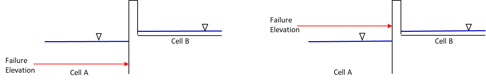

*Figure 20.
Levee or Wall Configuration with Uneven Ground Elevations.*

    - If the ground elevations on each side of the wall are different by more than 0.5 ft, the cell with the higher elevation are set to lower grid element
      elevation.
    - If the failure elevation is lower than either ground elevation, the failure elevation is reset to 3 ft above the lowest ground elevation.

In previous model versions it was assumed that the ground elevation was essentially the same on both sides of the wall, so that when the water surface
reached the failure elevation, the wall would collapse under the static pressure head on one side of the wall.
The wall would then be removed, and the water would flow across the cell boundary based solely on the difference in water surface elevations.
In the current model, failure will ensue when the difference in the water surface elevation is greater than the failure elevation.
The levee/wall failure criteria was simplified as follows:

    - Water surface elevation must be greater than the prescribed levee failure elevation plus a tolerance value of 0.1 ft or 0.03 m.
    - Water surface elevation on the upstream side (storage side) of the levee must be higher than the downstream water surface elevation
    - The water surface elevation minus the ground elevation (flow depth) on the upstream side must be greater than the water surface elevation minus the
      ground elevation (flow depth) on the downstream side of the dam or levee.

The additional criteria that the difference in the water surface elevations across the wall must exceed the failure elevation minus the ground
elevation to assess the wall stability was removed.
It is left up to the user to evaluate or assume that the levee will fail if the prescribed rates of failure are assigned.

The following options are available to assess the relationship between the wall crest elevation, the wall failure elevation and the floodplain ground
elevation:

    - DEPRESSDEPTH (in CONT.DAT) = 0.0 to 10.0 ft; Identifies the wall with a crest elevation lower than DEPRESSDEPTH in LOW_LEVEE_CREST_ELEVATIONS.OUT
      file.
    - DEPRESSDEPTH = -1.0 to - 10.0 ft; Assesses the side of the wall where the crest elevation is assigned to determine if the levee height is lower than
      the DEPRESSDEPTH value.
    - DEPRESSDEPTH = -101.0 to -110.0 ft; Assesses both sides of the wall to determine if the height is lower than DEPRESSDEPTH (1 ft to 10 ft).

Summary
-------

Distribution of shallow unconfined flooding in urban areas is often controlled by block walls that isolate residential lots or entire neighborhoods.
Flow across streets can be restricted by sound walls.
Flood storage behind walls will delay the arrival of the floodwave to downstream areas.
Wall collapse is initiated by static pressure when the water surface elevation exceeds an assigned failure elevation.
Wall failure can be assigned locally to individual grid elements or globally to all the simulated walls.
When walls fail and the flood storage is released, the floodwave surges and initiates more downstream wall failures.
The cascading failures intensifies the frontal wave and peak discharge.

When troubleshooting wall assignment and failure data files, most data checks are automated.
It is important to conduct a visual check for continuous walls.
Breaks or holes in a continuous wall are generally the result of missing a diagonal grid element side assignment.
To check for unreasonable low walls, the

LOW_LEVEE_CREST_ELEVATIONS.OUT file can be reviewed.
The two critical conditions to avoid are wall failure elevations that are lower than the ground elevation on either side of the wall and water surface
elevations that are higher that the wall failure elevation but with insufficient static pressure to collapse the wall.
These conditions are resolved are runtime in the model but should be avoided in the data files.

Predicted Breach Erosion Input Data
-----------------------------------------

The dam breach erosion component provides an opportunity to simulate the physical processes of breach widening through scour.
Nine out of the eleven sediment transport equations in the FLO-2D can be used to compute the breach erosion including:

    - Zeller-Fullerton
    - Yang
    - Engelund & Hansen
    - Ackers & White
    - Laursen
    - MPM-Smart
    - Karim-Kennedy
    - Parker, Klingeman & McLean
    - Van Rijn

See the FLO-2D Reference Manual for a description of each equation.
The different sediment transport capacity equations predict a range of erosion rates that effect the breach discharge hydrograph timing and peak.
The sediment transport equations available for the breach routine are generally based on steady state, subcritical flow, and low sediment
concentration and usually applicable for a specific range of sediment size and flow properties.
The conditions for which a given sediment transport equation was derived will probably be violated at some point during the dam or levee breach.
The selection of an appropriate sediment equation is based on professional judgment and some model testing.

The default equation is the Meyer-Peter and Muller bedload equation as modified by Smart (1984) for steep channels.
This is the equation in the NWS Breach model.
The sediment transport capacity Q\ :sub:`s` is a function of sediment gradation, wetted perimeter, hydraulic radius, roughness, critical shear stress,
and slope.
The equation in the NWS Breach model was corrected in the FLO-2D model.
The most important parameter in the equation is the slope term.
The sediment transport is sensitive to the slope which is raised to a power S\ :sup:`1.1`.
The steep slope generates sediment concentration in the hyper-concentrated flow range which results in a fast breach.
To maximize the breach rate, assign the pipe inlet near the maximum water surface (Figure 4).
A brief description of the pipe breach erosion computational sequence follows:

    - If upstream water surface > pipe elevation – piping failure initiates;
    - User specifies initial pipe elevation with outlet fixed 1 ft above downstream embankment toe.
      This enables the steepest slope, which should approximate the most conservative case.
      The erosion pivots around the embankment toe;
    - With pipe enlargement or collapse – channel breach flow ensues;
    - For both pipe and channel breach flow, the discharge is controlled by weir or pipe flow, and the hydraulics computed by open channel flow;
    - Tailwater submergence is evaluated as previously discussed;
    - Sediment scour volume is computed based on the selected equation;
    - The model removes the eroded sediment volume from the pipe geometry uniformly to widen the breach;
    - Weir flow versus pipe flow is based on the head of the weir.
      If the head is greater than 1.5 times the pipe diameter, then pipe flow is computed using the Darcy-Weisbach equation with a pipe friction factor
      computed from the user selected n-value.
    - The pipe flow routine checks for laminar-turbulent flow using Reynold’s number and uses the appropriate flow regime equation to compute the velocity.

Channel flow will occur if the dam or levee is overtopped or if the pipe roof collapses (Figure 5).
The channel breach computational sequence is outlined as follows:

    - For the overtopped condition, breach discharge initiates as channel flow using the broadcrested weir equation through a hardcoded width of 1.0 ft and
      the downstream face slope;
    - The overtopping channel breach flow combines with any overtopping discharge over the levee or dam grid element side with the breach;
    - The channel breach discharge is predicted by weir flow and the channel hydraulics down the steep slope are computed as open channel flow using Manning’s equation;
    - The sediment scour volume is removed uniformly from the bottom and sides of the channel to widen the breach;
    - The breach geometry transitions to a trapezoidal channel when the side slopes collapse;
    - The breach scour will eventually include erosion of the upstream face;
    - The breach channel slope erodes parallel to the downstream face.

The FLO-2D breach erosion component integrates breach discharge with two-dimensional downstream flooding.
The erosion is based on the breach flow hydraulics, the reservoir water surface and tailwater elevations.
The breach erosion computations use the FLO-2D timestep and the model conserves water and sediment volumes.
Sediment conservation was implemented for both pipe and channel scour computations.
If the volume of eroded sediment does not match the breach hole volume, the breach pipe or channel geometry is adjusted to account for the difference.
The downstream breach flood hydrograph is automatically bulked (BF) for the levee or dam sediment concentration by volume C\ :sub:`v`:

.. math::
   :label:

   BF = \frac{1}{\,1 - C_{v}\,}

Breach Erosion Parameter Sensitivity
------------------------------------

The primary breach erosion parameters are:

    - Embankment geometry – side slopes, crest width and length
    - Pipe breach elevation and width/depth ratio
    - Embankment sediment size: core, shell and riprap material
    - Embankment sediment parameters – unit weight, porosity, cohesive strength
    - Roughness n-values for shell and core
    - Grass on downstream face

The data can be entered in the GDS as shown in Figure 21.
The breach erosion parameter data can be entered for either a global levee failure or for specific levee grid element(s) representing.

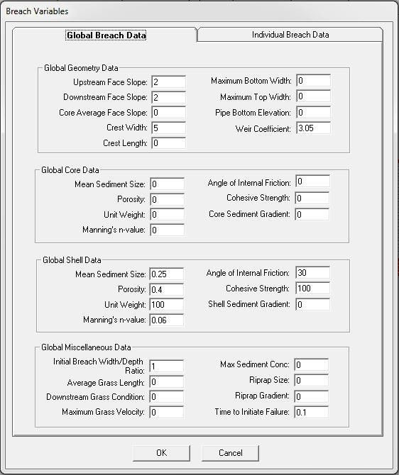

*Figure 21.
GDS Dialog Box for Entering the Breach Erosion Data.*

The objective of the levee or dam breach erosion component is to create a fast expanding breach resulting in a high peak discharge and a rapid
reservoir evacuation.
The worst case scenario is to have a wide breach with a high head on the weir that will result in a front loaded, steep rising breach hydrograph.
The selection of the sediment transport equation is a key to the rate of breach growth.
Those equations that are a function of slope, velocity or shear stress will generate the highest sediment scour.
The maximum sediment concentration C\ :sub:`vmax` predicted by the equation will directly impact the development of the breach frontal wave.
The breach velocity down the pipe or channel is a function of the assigned roughness n-value and slope and this affects the sediment discharge.
Other parameters that can affect the breach erosion include:

    - Critical shear stress (Cv) which is a function of cohesive strength and the plasticity index of the embankment materials.
      The critical shear stress varies with clay content.
    - Embankment cohesive strength is used in the computation of channel side slope slump and dam wedge collapse and blow out.
      This parameter is an important variable for the rate of increase in breach width.
    - Sediment gradient D\ :sub:`90`/D\ :sub:`30`:Q\ :sub:`s` ~ (D\ :sub:`90`/D\ :sub:`30`)\ :sup:`0.2`

The breach parameter sensitivity is outlined in the following table:

*Table 3.
Breach Parameter Sensitivity.*

.. image:: img/Levee015.jpg

Breach Modeling Approach
------------------------

The following steps are recommended for developing a FLO-2D dam breach simulation:

    - Select a grid elements size that results in a peak discharge divided the surface area of one grid element **less than 10 cfs/sq ft.
      (or 3 cms/sq m)**.
      Roughly estimate dam breach peak discharge before establishing the grid system.
    - Using the GDS or QGIS levee editor, assign the dam embankment crest.
      Tie the levee elements representing the crest to the grid elements representing the canyon walls.
      **Assign the embankment (levee elements) to the grid elements representing the reservoir elements so that the levee element is filled with reservoir
      water.** Straight line levees are easier to work with than diagonal levees.
    - Assign the starting water surface to one reservoir element.
      Run the model for a short during to determine if there is any leakage outside the reservoir by plotting the maximum flow depths in MAXPLOT, Mapper or
      QGIS.
    - After the first FLO-2D simulation, rename TOPO_RES.BAC to TOPO.DAT and MANNINGS_N_RES.BAC to MANNINGS_N.DAT and delete FPLAIN.DAT to assign the dead
      pool to the reservoir topography.
      FPLAIN.DAT will be recreated automatically on the next model run.
    - Assign outflow nodes across the canyon or dam breach potential flow area near the dam.
      This will allow shorter simulation times while testing the dam breach parameters.
    - Downstream grid element n-values should be assigned in the range from 0.1 to 0.2 representing the severe turbulence for the first 1000 ft (300 m) or
      more below the dam.
    - Reservoir grid element n-values will be automatically assigning a value of 0.25 when the reservoir starting water surface option is used regardless of
      the initial n-value assignment.
      Higher n-values can be assigned.
      If a reservoir starting water surface is not assigned than it is recommended that the reservoir elements be manually assigned n-values of 0.25 or
      higher.
    - The grid element that is selected for the initial breach should be assigned a floodplain elevation that represents the dam foundation.
      No breach erosion will occur below this elevation.
    - The dam grid elements (levee elements) that will fail during the breach and one row of grid elements upstream should be assigned the same elevation to
      reduce the potential for numerical instability.
      The same approach can be used for the downstream elements below the dam, but they can be lower than the dam foundation in a successive series of three
      to five rows of elements.
    - Assign realistic values to the dam parameters representing field or design dam geometry and embankment material.
      The following parameters requires some engineering judgment:

          - Weir coefficient: 2.65 to 3.05 Higher values will result in a higher peak discharge which may be more conservative in terms of assessing the flood
            hazard.
          - Initial Breach Width to Depth Ratio (BRATIO): 0.5 to 4.0.
            Suggested value is 2.0.
            For the purpose of initial pipe geometry, this parameter is inconsequential, but it is also used to distribution the breach erosion scour to the bed
            and sides of the breach trapezoidal channel.
            A higher value of BRATIO will widen faster and reduce the vertical erosion of the bed.
          - The maximum sediment concentration by volume should assigned a value of 0.5 or 0.55 which will limit the initial breach sediment concentration to that
            representing a viscous mudflow.
          - The dam core and shell n-values can be assigned in the range from 0.065 to 0.25.
            These values affect the breach pipe and channel hydraulics and low n-values can result in very fast erosion.
            The breach turbulence and steep slope require high n-values to avoid unrealistic scour.
          - If the specified initial breach elevation in the BREACH.DAT file is less than 10.0 ft (3.0 m), then the initial piping breach elevation is assumed to
            be the dam or levee crest elevation minus the assigned breach elevation (Initial Breach Elevation = Levee Crest – BRBOTTOMEL).

    - Note that the breach discharge is computed if the upstream water surface elevation exceeds the upstream breach pipe or channel bottom elevation plus
      the tolerance value (TOL ~ 0.1 ft or 0.3 m).

The corresponding output data from the BREACH.OUT file for the dam breach hydrograph shown in Figure 22 is presented in the following table with the
maximum sediment concentration by volume outlined in red.

 .. image:: img/Levee016.jpg

*Figure 22.
Example of the Large Dam Breach Hydrograph.*

*Table 4.
Breach Output File Example.*

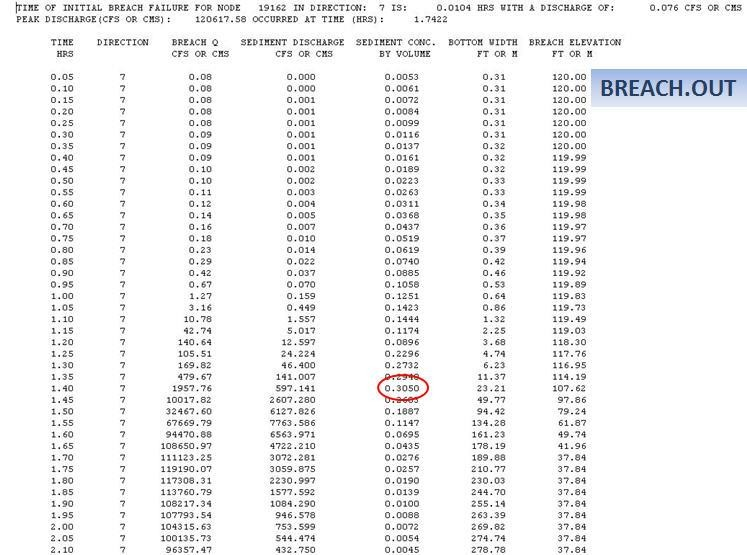

Reservoir Routing
------------------------

Deep water slow velocity movement in reservoir, detention basins or other ponded features in a twodimension model represents a unique condition for
flood routing.
The FLO-2D model routes surface water using the Manning’s equation to represent the open channel flow friction slope.
This assumes that the flow condition approaches steady, uniform flow with a turbulent velocity profiles (Figure 23 left) which is obviously not the
case for ponded flow.
Ponded flow is essentially frictionless flow with a velocity profile that may be in one direction near the bed and another direction near the surface
(Figure 23 right).
Average depth integrated velocities are likely to be less than 1 fps (0.30 mps).

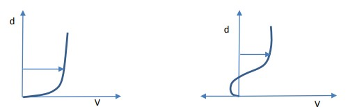

*Figure 23.
Logarithm Velocity and Ponded Velocity Profile*

In flow through a reservoir, the momentum terms are negligibly small and the water surface slope is also small and this leads to numerical instability
in the routing algorithm solution to the free surface open channel flow equations.
If a small flow resistance value is assigned as Manning’s n-value and the depth is large, a large velocity could be computed even with a very mild
slope because of the depth raised to the 2/3 power in Manning’s friction slope equation.
One approach to this dilemma is to use a high unrealistic n-value that would force a low velocity computation.
Using a simplified diffusive wave approximation to the full dynamic wave equation (no momentum terms) or one without a friction slope term to predict
flow velocity results in radical variation in the flow direction, water surface elevation and the velocity.
The objective is compute an average velocity of less than 1.0 fps (0.3 mps) for ponded on the order 20 ft (6.73 m) or greater when the difference in
the water surface elevation is on the order of 0.1 ft (0.03 m) or less representing near equilibrium conditions.
In the FLO-2D model, the ponded conditions arise when the depth is equal to or exceeds the grid element side length.

A New Friction Slope Equation
-----------------------------

Typically, reservoir routing is done by applying a diffusive wave method such as Muskingum-Cunge (kinematic wave) requiring rating tables, cross
section data and slope.
Initially reservoir draining was simulated using high n-values with the existing FLO-2D momentum equation to have a representative depth-averaged grid
element velocity.
This approach, however, still generated unreasonably high velocities for very deep reservoirs (>100 ft – 30 m).
To effective model the slow velocities in reservoirs, a new friction slope equation was developed that kept the same form as Manning’s equation for
velocity V but applied a flow depth d variable exponent b that was a function of both depth and slope.

.. math::
   :label:

   V = \frac{1.486}{n}\, d^{b} S_f^{0.5} \quad \text{(English units)}

where:

    V = flow velocity d = flow depth

    n = Manning’s friction coefficient S\ :sub:`f` = friction slope b = exponent = f(depth, S\ :sub:`f`) b = 0.4973 – 0.000543 \* d – 30.71 S\ :sub:`f`

       a1, b1, c1 = coefficients given in the following table:

*Table 5.
Muskingum – Cunge Variable Definitions.*

.. raw:: html

   <table style="border-collapse: collapse; width: 100%; text-align: center;">
     <caption><strong>Muskingum – Cunge Variable Definitions</strong></caption>
     <thead>
       <tr style="background-color: #d0d0d0;">
         <th style="border: 1px solid #000; padding: 4px;">d/side</th>
         <th style="border: 1px solid #000; padding: 4px;">Sf</th>
         <th style="border: 1px solid #000; padding: 4px;">B</th>
         <th style="border: 1px solid #000; padding: 4px;">a1</th>
         <th style="border: 1px solid #000; padding: 4px;">b1</th>
         <th style="border: 1px solid #000; padding: 4px;">c1</th>
       </tr>
     </thead>

     <tbody>

       <tr>
         <td style="border: 1px solid #000; padding: 4px;">&lt; 1.0</td>
         <td style="border: 1px solid #000; padding: 4px;">&lt; 0.000001</td>
         <td style="border: 1px solid #000; padding: 4px;"></td>
         <td style="border: 1px solid #000; padding: 4px;"></td>
         <td style="border: 1px solid #000; padding: 4px;">V = 0.</td>
         <td style="border: 1px solid #000; padding: 4px;"></td>
       </tr>

       <tr>
         <td style="border: 1px solid #000; padding: 4px;"></td>
         <td style="border: 1px solid #000; padding: 4px;">&gt; 0.000001</td>
         <td style="border: 1px solid #000; padding: 4px;">0.45</td>
         <td style="border: 1px solid #000; padding: 4px;">0.</td>
         <td style="border: 1px solid #000; padding: 4px;">0.</td>
         <td style="border: 1px solid #000; padding: 4px;">0.</td>
       </tr>

       <tr>
         <td style="border: 1px solid #000; padding: 4px;">&gt; 1.0</td>
         <td style="border: 1px solid #000; padding: 4px;">&lt; 0.000001</td>
         <td style="border: 1px solid #000; padding: 4px;"></td>
         <td style="border: 1px solid #000; padding: 4px;"></td>
         <td style="border: 1px solid #000; padding: 4px;">V = 0.</td>
         <td style="border: 1px solid #000; padding: 4px;></td>
       </tr>

       <tr>
         <td style="border: 1px solid #000; padding: 4px;"></td>
         <td style="border: 1px solid #000; padding: 4px;">0.000001 &lt; Sf &lt; 0.0002</td>
         <td style="border: 1px solid #000; padding: 4px;">1.55</td>
         <td style="border: 1px solid #000; padding: 4px;">0.5</td>
         <td style="border: 1px solid #000; padding: 4px;">0.0004</td>
         <td style="border: 1px solid #000; padding: 4px;">1.0</td>
       </tr>

       <tr>
         <td style="border: 1px solid #000; padding: 4px;"></td>
         <td style="border: 1px solid #000; padding: 4px;">0.0002 &lt; Sf &lt; 0.01</td>
         <td style="border: 1px solid #000; padding: 4px;">1.55</td>
         <td style="border: 1px solid #000; padding: 4px;">0.5</td>
         <td style="border: 1px solid #000; padding: 4px;">0.0004</td>
         <td style="border: 1px solid #000; padding: 4px;">30.</td>
       </tr>

       <tr>
         <td style="border: 1px solid #000; padding: 4px;"></td>
         <td style="border: 1px solid #000; padding: 4px;">0.01 &lt; Sf &lt; 0.1</td>
         <td style="border: 1px solid #000; padding: 4px;">1.25</td>
         <td style="border: 1px solid #000; padding: 4px;">-0.5</td>
         <td style="border: 1px solid #000; padding: 4px;">-0.0004</td>
         <td style="border: 1px solid #000; padding: 4px;">-30.</td>
       </tr>

       <tr>
         <td style="border: 1px solid #000; padding: 4px;"></td>
         <td style="border: 1px solid #000; padding: 4px;">Sf &gt; 0.10</td>
         <td style="border: 1px solid #000; padding: 4px;">0.667</td>
         <td style="border: 1px solid #000; padding: 4px;">0.</td>
         <td style="border: 1px solid #000; padding: 4px;">0.</td>
         <td style="border: 1px solid #000; padding: 4px;">0.</td>
       </tr>
     </tbody>
   </table>

Applying this equation in its slightly different forms in different depth and friction slope regimes will predict reasonable flow velocities where
both grid elements sharing flow are reservoir elements with a starting water surface elevation and the average depth between the grid elements is
greater than the grid element side.

Starting Reservoir Water Surface Elevation and n-value Assignment
-----------------------------------------------------------------

A reservoir can be simulated at the outset of a FLO-2D simulation.
To assign a starting reservoir water surface, select a grid element inside the reservoir using the GDS and right click with the mouse to enter an
elevation (Figure 24).
This can also be accomplished by opening an INFLOW.DAT file in an ASCII format text editor and assign an R-line with a grid element number and
starting water surface elevation: R 3565 1435.00 0.25

.. image:: img/Levee019.jpg

*Figure 24.
Reservoir Starting Water Surface Elevation Assignment.*

When the model starts, it will assign this elevation to every contiguous grid element with a ground elevation that is less than the starting water
surface elevation in an expanding sequence.
The model will also automatically assign an initial n-value of 0.25 each reservoir grid element.
At the start of the simulation, the reservoir will have a flat-water surface elevation and zero water surface slope.
This is a relatively stable condition and the ensuing reservoir drainage or filling will occur without numerical instability.

Reservoir Dead Pool
-------------------

Some reservoir storage (Figure 25) may have been excavated below ground level with embankments above ground.
This may be the case for domestic water supply reservoirs.
If the dam foundation or lowest beach elevation is higher that a portion of the reservoir bed elevation, then some water will be left in the reservoir
after draining.
FLO-2D automatically addresses this condition by assigning all the grid elements with an elevation below the foundation as dead pool elements when it
assigns the starting water surface elevation and flow depth.
The user can make the dead pool elevation the reservoir bed elevation a permanent revision by renaming the data files TOPO_RES.BAC to TOPO.DAT and
MANNINGS_N_RES.BAC to MANNINGS_N.DAT and deleting FPLAIN.DAT after the first model run.
The FPLAIN.DAT file will be regenerated with the next simulation.
The reservoir flow depth for these elements for the reservoir routing is the water surface elevation minus the dead pool elevation.
The dead pool represents permanent storage that does not contribute to downstream flooding.

.. image:: img/Levee030.jpg

*Figure 25.
Reservoir Starting Water Surface Elevation Node Shown in Blue-Green.*

Filling a Basin or Reservoir during the Simulation
--------------------------------------------------

When a detention basin or other storage facility is filled during a flood simulation, the grid element water surface can be variable and relatively
large velocities may be reported.
To initiate the above revision to the Manning’s regression equation, simply assign n-value greater than 0.250 to the potentially ponded area,
detention basin or reservoir.
These guidelines will help make the basin filling simulation more computationally stable:

    - Assign high n-values (~0.100 to 0.200) to the storage basin site using RESERVOIRN parameter line R in INFLOW.DAT.
    - Slow the model down using a smaller Courant number for the floodplain.
      Decrease the Courant number in 0.10 increments to a minimum of 0.05
    - Assign spatially variable limiting Froude numbers in the basin elements.
      Use a small limiting Froude of 0.2 or lower to automatically adjust the n-values.
      Review and accept the new n-values in ROUGH.OUT at the end of the simulation.

While applying the DEPTOL stability parameter may improve the model stability, a lower Courant number should be enough to ensure consistently low
velocities in the reservoir.
If computed high velocities persist in the basin, increase the n-values and set the DEPTOL parameter.
At the end of the simulation, if the basin has stored water without inflow or outflow, the grid element water surfaces should be relatively flat.

Levee Breach Numerical Instability
--------------------------------------

Levee and dam breaches often result in a very high discharge, velocity and flow depth.
It is important when the focus of the project is the levee or dam breach inundation to select an appropriate grid size.
The key is balance computer runtimes with adequate hazard mapping resolution.
Since the breach discharge is typical large, it is not necessary to have small grid elements for accurate mapping.
To select an appropriate grid element size, the estimated peak discharge Q\ :sub:`peak` divided by the surface area of one grid element A\ :sub:`surf`
should be less than 10 cfs/ft\ :sup:`2` (Q\ :sub:`peak`/A\ :sub:`surf`\ < 10.0).
Most numerical instability issues can be eliminate with an appropriate selection of the grid element size compared to the computation timestep.

The levee breach routine can cause numerical instability if the discharge through the breach exceeds the upstream flow to the breach.
This occurs because the breach discharge is based on a broadcrested weir equation and this may not match the normal depth flow arriving to the breach.
Inappropriate assignment of floodplain elevations or n-values on each side of the levee can also contribute to potential surging.
Combined levee breach with hydraulic structures or other features can also cause numerical surging by evacuating too volume from the upstream grid
element.
Evidence of numerical surging in breach discharge includes:

    - High maximum velocities (VELTIMEFP.OUT);
    - Rapidly varying discharges (BREACH.OUT, LEVEE.OUT, or in the floodplain cross section hydrographs);
    - High or variable maximum water surface elevations.

Table 6. Numerical Surging Troubleshooting

.. list-table::
   :widths: 50 50
   :header-rows: 0

   * -
     - **Numerical Surging Troubleshooting**

   * - **Condition**
     - **Resolution**

   * - Levee BreachHigh Velocities
     - Review the floodplain elevations and n-values on each side of the levee.
       The elevations need to represent the floodplain elevation and not depressions associated with channels or elevated topography as a result of levee
       crest elevations.
       Increase the n-values to reduce unreasonable velocities.
       ------------------------------------------------------------------- Revise the breach parameters.
       Reduce the vertical and horizontal breach rates or modify the breach erosion variables.
       ------------------------------------------------------------------- Tailwater may the cause of numerical surging.
       Most tailwater conditions are accounted for in the FLO-2D model.
       Review the potential tailwater conditions to determine if breach submergence is appropriate.
       Increase the n-values associated with the downstream elements to reduce high velocities near the breach.
       ------------------------------------------------------------------- Downstream water surface controls may artificially lower the water surface
       elevation near the breach.
       This may include outflow node time-stage relationships, flow constrictions, hydraulic structure rating tables, tidal affects or main channel flow.
       Variable downstream controls require specific needs.
       ------------------------------------------------------------------- Numerical surging or high maximum velocities may be the result of limited storage
       area.
       Reduce or eliminate surface area reduction (ARF-values) in the levee elements which may leave very little surface area for storage.

   * - CombinedHydraulicStructure andLevee Breach
     - Hydraulic structures may be used to allow flow to go through a levee connecting contiguous grid elements.
       This might simulate a drainage hole in a block wall or a culvert through a highway embankment.
       While the levee or wall is intact the flow based on the hydraulic structure rating table or curve must include the flow over the embankment.
       If the rating table is poorly matched with the upstream inflow conditions, surging may ensue.
       The rating table or curve must be modified.
       Refer to the companion Hydraulic Structure Guidelines document for more details.
       ------------------------------------------------------------------- If the levee or wall containing the hydraulic structure is breached (not an
       instantaneous failure), the hydraulic structure flow is terminated and breach flow is computed.
       Numerical surging should be addressed by increasing nvalues or adjusting the topography.
       See the above section.
       ------------------------------------------------------------------- If the levee or wall fails instantaneously (collapses or topples), the hydraulic
       structure flow is terminated and the flow is computed as overland flow, not breach flow.
       If numerical surging is observed increase the n-values or review the topography.
       ------------------------------------------------------------------- If the combined hydraulic structure and levee (or levee breaching) routine is
       causing either volume conservation error or numerical instability, follow this protocol:  4.
       Turn off the hydraulic structures in CONT.DAT and run the model until the problem occurs.
       5.
       Turn off the levees in CONT.DAT and run the model only until the time that the problem occurs.
       6.
       If the problem is in the hydraulic structures, isolate the structures that appear to be the problem.

   * -
     - 40                                     |

   * -
     - To isolate a hydraulic structure with numerical instability, put a simple inflow hydrograph (for steady flow) several grid elements upstream of the
       structure.
       Put a line of outflow elements downstream of the structure and turn off all the other inflow hydrographs and rainfall.
       Make sure that the steady flow discharge through the structure matches the assigned stage or depth.

   * -
     - If the instability issue cannot be resolved, it may be possible to move the ------------------------------------------------- hydraulic structure to
       the next grid element without a loss of accuracy or  mapping resolution for the maximum water surface elevation.
       It might also be possible to eliminate the levee and replace it with WRF value.
       ------------------------------------------------- The model automatically adjusts the hydraulic structure rating table and writes the revised table
       pairs to an output file.
       If instability persists, review the revised rating table and make further adjustments.
       Typically the instability is related to the lower flows and there are insufficient rating table pairs to define the rating table for the lower
       discharges.
       Review the HYDROSTRUCT.OUT file to determine if there is numerical instability in the rating table or curve.
       ------------------------------------------------- Downstream ponding or time-stage water surface controls may result in upstream flow through
       structure.
       Set the INOUTCONT = 1 in the HYSTRUC.DAT file to allow upstream flow.

   * - LeveeOvertoppingDischarge
     - Revision to the model that have been incorporated to reduce or eliminate surging associated with overtopping discharges include:  - Adding tailwater
       submergence criteria;  - Reverting to overland flow when the water surfaces are much higher than the crest;  - Assigning the appropriate reference
       elevation to establish headwater and tailwater depths.
       ..
       If surging as observed by high velocities, rapidly varying depths or large variation in water surface elevation in ponded conditions, check the
       floodplain elevations for accuracy on each side of the levee, and increase the n-values in both cells.
       If there are shallow depths on one side of the levee and deep depths on the other with flow over the crest, equilibrating the grid element elevations
       should eliminate surging.
       ------------------------------------------------- Some numerical surging can be eliminated by forcing smaller timesteps.
       Reduce the floodplain Courant number.
       If ponding is associated with surging flow, and reducing the Courant number and increasing n-values doesn’t alleviate the problem, use a DEPTOL = 0.05
       or 0.10 in TOLER.DAT to force smaller timesteps.

   * - Time StageLevee Breaches
     - Time-stage elements that control the water surface elevation near a levee system are generally not a problem.
       Numerical instability are usually associated with the time-stage elements by have the water surface stage be less than ground elevation or having
       contiguous time-stage elements with non-uniform ground elevations.
       ------------------------------------------------- If the ponded water contained by the levee has a highly variable water surface elevation (in a
       reservoir scenario or from the time-stage ocean simulation), slow down the timesteps (use a smaller Courant number), varying the n-values or adjust
       the topography to make it more uniform.
       ------------------------------------------------- Review the LEVEE.OUT file for surging.
       High velocities can be eliminated with increasing n-values.
       Some high velocities may be associated with the initial levee or dam failure.

Dam Breach Floodwave Reporting for Hazard Mapping
-----------------------------------------------------------------

To address the California Office of Emergency Services requirements for dam breach area of inundation and hazard maps, the following output data is
generated during a FLO-2D model simulation.
FLO-2D is a twodimensional flood routing model that doesn’t use 1-D floodplain cross sections as is the case for HEC-RAS models.
Each grid element has a unique flow depth and 8-directions of flow velocity for each computation timestep.
For that reason, hazard map preparation may require a unique depiction of some of the floodwave characteristics.

Flood Wave Output
-----------------

To facilitate mapping the CalEMA floodwave parameters, an output file (FLOODWAVETIME.OUT) is generated by FLO-2D at the end of the flood simulation.
This file has the following format:

*Node X-coord Y-coord Floodwave Arrival Time Flood Time Peak Time Deflood Time Max WS*

Each grid element is assigned a specific value of the above parameters at the end of the simulation.
The maximum values are tracked during the simulation on a computational timestep basis.
The following parameter definitions are used:

*Floodwave Arrival Time:* Time in hours from when the breach discharge exceeds 0.01 cfs or cms to when the floodplain grid element flow depth exceeds
1.0 ft or 0.3 m.
If the grid element has a channel assignment, the time when the channel flow depth becomes one foot higher than the base flow (when breach discharge >
0.01 cfs or cms) is reported.

*Flood Time:* Time (hours) from when the breach discharge exceeds 0.01 (cfs or cms) to when a given grid element flow depth exceeds 2.0 ft or 0.67 m
on the floodplain.
If the grid element has a channel assignment, the time to when the flow exceeds the lowest top of bank is reported.

*Peak Time:* Time (hours) from when the breach discharge exceeds 0.01 (cfs or cms) to when a given grid element flow depth reaches a maximum depth.
If the grid element has a channel assignment, the time to when the channel flow reaches a maximum depth is reported.

*Deflood Time:* The time elapsed from the initial failure of the dam until the grid elements returns to its preflood water elevation (0.1 ft) prior to
failure.
The dam breach initialization is based on the first incremental change in flow depth greater than the tolerance value (TOL).

*Max WS:* The maximum water surface for a given floodplain grid element is reported.
If a channel is assigned to the grid element, the maximum water surface for either the channel or the floodplain is reported.

Floodplain Cross Section
------------------------

The peak discharge for a selected floodplain cross section or for each channel element is reported in

HYCROSS.OUT or HYCHAN.OUT respectively.
The floodplain maximum width is available only for assigned FLO2D floodplain cross sections in the HYCROSS.OUT file.

When a floodplain grid element has the channel left bank assigned to it (in the CHAN.DAT file), the model compares the various output parameters for
the floodplain or channel and selects the appropriate value.
For example, the maximum water surface of the channel or floodplain for that grid element is reported.

The parameters in FLOODWAVETIME.OUT can be easily mapped by simply deleting the header line and selecting the first three columns (grid element
x-coord y-coord) and any other column and pasting to another file using Excel®, TextPad® or UltraEdit® programs.
Conversely, a copy of the original file can be made, and the unnecessary columns deleted.
The remaining file can then be renamed to DEPFP.OUT and plotted in Mapper or Maxplot post-processor programs as line contour or shaded contour maps.
An alternative method to create the parameter maps is to import the resulting file to GIS or CADD program.

If no levee or dam breach is simulated with the FLO-2D model, the FLOODWAVETIME.OUT file is still populated with output data with a start time related
to the commencement of the flood model (hour 0.0).

Levee Fragility Curves
-----------------------

Introduction Levee fragility curves can be used in the Central Valley flood studies to develop flood hazard maps with the FLO-2D model.
An algorithm using the Corps’ levee fragility curves has been coded in the FLO-2D model to automatically predict levee breach failure anywhere in the
levee system.
This FLO-2D levee failure component with fragility curves represents a linkage between a geotechnical risk model and prediction of the water surface
elevations with a flood routing model.
It is a link between levee geotechnical performance and flood routing hydraulics.
It also implicitly defines levee risk of failure for hazard mapping.
Background Levee core and shell material may vary significantly in levee systems especially where older levee reaches do not conform to existing
construction standards.
As a result, levee failure is difficult to predict in both time and space.
Levees often fail before the flood waters reach the levee crest elevation due to geotechnical flaws that initiate piping.
Often a piping failure may expand to a complete breach in a relatively short period of time while the flood is still rising.
The Corps of Engineers use a levee failure risk model that incorporates the probability of levee geotechnical failure as function of flood water
surface elevation.
This model is known as a levee fragility curve (Figure 26).

.. image:: img/Levee020.jpg

*Figure 26.
Example of Levee Fragility Curves for Typical Sacramento River Basin Levees. (From the Corps of Engineers, Comprehensive Study, 2002)*

The levee fragility curves specify the relationship between the probability of levee failure and the water surface elevation (or likely failure stage)
below the levee crest.
The elevation corresponding to a 50% failure probability can be selected as the likely failure point and can be used to initiate levee failures in the
Corps hydraulic models.
In the FLO-2D model, the levee breach failure may include piping, slope stability and under seepage.
The fragility curves are based on a geotechnical investigation of the existing levee system involving construction methods, levee soil composition,
foundation conditions, and other factors.
At the present time, existing Central Valley fragility curves are based primarily on engineering judgment and represent a qualitative approach to
evaluating levee integrity.
Future fragility curves can be based on levee geotechnical investigations including field inspection, in situ (borings), and laboratory testing.
The extent of in-situ testing and laboratory testing (cohesive strength, compaction and other tests) will determine the reliability of the fragility
curves.

The levee fragility curves are read directly by the FLO-2D model in a discretized rating table format for a set of curves as shown below.
The first column is the curve reference name; the second column is the probability of failure (x-axis Figure 1); and third column is the distance
below the levee crest in feet or meters (y-axis).

.. raw:: html

    <pre>
    FS1 0.03 6.0
    FS1 0.15 3.5
    FS1 0.50 2.5
    FS1 0.85 1.0
    FS1 0.95 0.0
    FS2 0.03 9.0
    FS2 0.15 5.5
    FS2 0.50 4.0
    FS2 0.85 2.0
    FS2 0.98 0.0
    FS3 0.03 12.0
    FS3 0.15 9.0
    FS3 0.50 6.5
    FS3 0.85 4.0
    FS3 1.00 0.0
    FS4 0.15 15.0
    FS4 0.50 9.0
    FS4 0.85 6.0
    FS4 1.00 0.0
    </pre>

Application of the Levee Fragility Curves in the FLO-2D Model
---------------------------------------------------------------

The California Department of Water Resources (DWR) can apply the levee fragility curves in the Central Valley Floodplain Evaluation and Delineation
project to delineate and map potential flood hazards.
FLO-2D was uniquely suited to utilizing the levee fragility curves.
It has a levee breach erosion component that can initiate breaching anywhere in the levee system based on water surface elevation.
This component conceptually emulates the National Weather Service Breach Model but has numerous improvements.
A piping failure can initiate anywhere in the levee system that water surface reaches a prescribed distance below the crest.
Through the physical process of sediment transport, the pipe breach will expand to a channel breach and collapse as the levee erodes.
When combined with the user assigned fragility curves, the model can locate the levee failure anywhere based on a user selected probability of failure.
When these fragility curves are applied with the FLO-2D flood routing model using the levee breach erosion component, levee failure location and time
of occurrence can be predicted.
The following levee fragility curve data is assigned by the user in the FLO-2D model:

Global Levee Data: Line ID, Fragility Curve ID, Probability of Failure (eg.
0.50) Individual Levee Data: Line ID, Grid Element, Fragility Curve ID, Probability of Failure

Example:

.. raw:: html

    <pre>
    C FS3 0.5
    P 3450 FS1 0.5
    P 3558 FS1 0.9
    P 3559 FS2 0.7
    P 3669 FS3 0.5
    P 3670 FS4 0.5
    </pre>

This data assignment enables the user to specify either global fragility curve data for the entire levee system or individual levee grid elements or
reaches of levee fragility curves in the FLO-2D model in a spatially variable analysis.

FLO-2D Fragility Curve Modeling Results
----------------------]-----------------

When the levee fragility curves are applied to a levee system, the results show that the levee breach can occur anywhere in the system at varying
times depending of the selection of the fragility curve and the prescribe probability of failure.
The FLO-2D levee breach model initiates piping when the predicted unconfined flood water reached the prescribed elevation for a defined duration.
The pipe erosion expands to a breach channel when the pipe roof collapses and escalates to a full breach when breach the channel side slopes collapse.
The breach expands in the FLO-2D model until the rate of sediment transport from the breach decreases.
Figure 2 shows a FLO-2D simulation of levee breaching in progressing at two locations at the same time based on variable assignment of the levee
fragility curves.
In this figure, the levee embankment extends from the red FLO-2D grid system boundary to the urban area in the center of the image in Figure 27.
FLO-2D Levee Breach Simulation in Progress Using Levee Fragility Curves (Right: Levee Simultaneously Breaching in 2 Locations; Left:
Levee Breaches Expanding)

.. image:: img/Levee021.jpg

*Figure 27.
FLO-2D Levee Breach Simulation in Progress Using Levee Fragility Curves.
(Right: Levee Simultaneously Breaching in 2 Locations; Left: Levee Breach Expanding.)*

Benefits of Using the Levee Fragility Curves for Flood Hazard Mapping
---------------------------------------------------------------------

The levee fragility curves define the relationship between geotechnical and flood hazard as well as identify the levee risk associated with potential
levee failure.
A series of FLO-2D simulations with different failure probability assignments (eg.
10%, 50% and 90%) will identify the area of inundation associated with the geotechnical confidence of the levee.
The area of inundation will be much greater if the likely failure point was assumed to be 10% than 50%.
The area of predicted area inundation could be evaluated for flood damages and assigned risk.
The assignment of the different levels of failure probability will result in different locations of the levee breach.
Through volume conservation in the FLO-2D model, the flooding through a levee breach in one location may reduce the potential for complete levee
breaches or even breach initiation elsewhere in the levee system where the levee may be weak.
By assigning different levee fragility curves and levee failure probability in the levee system, different areas of inundation will be predicted.
The FLO-2D fragility curve method combines flood risk, geotechnical levee characteristics and flood routing hydraulics for a spatial assessment of
levee failure corresponding with the actual floodwave progression.
This represents a significant step in accurate hazard mapping.

References
-----------

Fread, D.L., 1998.
“Breach: An Erosional Model for Earthen Dam Failures,” National Weather Service, NOAA, Silver Spring, Maryland.

Smart, G.M., 1984.
“Sediment Transport Formula for Steep Channels,” J.
of Hydraulic Engineering, ASCE, 110(3), 267-275.

U.S.
Department of Transportation, Federal Highway Administration, 2012.
"Hydraulic Design of Highway Culverts," Pub.
No.
FHWA-HIF-12-026, National Technical Information Service, Springfield, VA.

U.S.
Army Corps of Engineers, 2002.
“Sacramento and San Juaquin River Basins Comprehensive Study,” Appendix E Risk Analysis.
Published by The Reclamation Board State of California and the U.S.
Army Corps of Engineers, Sacramento District, Sacramento, California.