.. vim: syntax=rst

Chapter 4. MODEL COMPONENTS
===========================

Model Features
-------------------

The primary FLO-2D flood routing features and attributes are:

    - Floodwave attenuation can be analyzed with hydrograph routing.
    - Overland flow on unconfined surfaces is modeled in eight directions.
    - Floodplain flows can be simulated over complex topography and roughness including split flow, shallow flow and flow in multiple channels.
    - Channel, street and overland flow and the flow exchange is calculated.
    - Channel flow is routed with either a rectangular, trapezoidal, or natural cross-section data.
    - The flow regime can vary between subcritical and supercritical.
    - Flow over adverse slopes and backwater effects can be simulated.
    - Rainfall, infiltration losses and runoff on the alluvial fan or floodplain can be modeled.
    - Bed scour and deposition can be modeled using one of eleven sediment transport equations.
    - Viscous mudflows can be simulated.
    - The effects of flow obstructions such as buildings, walls and levees that limit storage or modify flow paths can be modeled.
    - The outflow from bridges and culverts is estimated by user defined rating curves.
    - The number of floodplain and channel elements is unlimited.
    - The exchange of surface water and storm drain flows can be simulated.
    - The exchange of surface water and groundwater can be simulated using a runtime interface with the MODFLOW groundwater model.
    - Dam and levee breach can be simulated with either a prescribe breach rate or breach erosion.

Data file preparation and computer run times vary according to the number and size of the grid elements, the inflow discharge flux and the duration of
the inflow flood hydrograph being simulated.
Most flood simulations can be accurately performed with square grid elements ranging from 20 ft (8 m) to 500 ft (130 m).
Projects have been undertaken with grid elements as small as 10 ft (3 m).
It is important to balance the project detail and the number of model components applied with the mapping resolution and anticipated level of accuracy
in the results.
It is often more valuable from a project perspective to have a model that runs quickly enabling many simulation scenarios to be performed from which
the user can learn about how the flood project responds to mitigation or sensitivity.
Model component selection should focus on those physical features that will significantly affect the volume distribution and area of inundation.
A brief description of the FLO-2D components follows.

Overland Flow
------------------

The simplest FLO-2D model is overland flow on an alluvial fan or floodplain.
Typical overland flow as reflects the water surface elevation, roughness and 8-direction flow path.
The floodplain element attributes can be modified to add detail to the predicted area of inundation.
The grid element surface storage area or flow path can be adjusted for buildings or other obstructions.
Using the area reduction factors (ARFs), a grid element can be completely removed from receiving any inflow.
Any of the eight flow directions can be partially or completely blocked to represent flow obstruction.
Rainfall and infiltration losses can add or subtract from the flow volume on the floodplain surface.
Overland flow components are shown in a flow chart in Figure 34.

Overland flow velocities and depths vary with topography and the grid element roughness.
Spatial variation in floodplain roughness can be assigned through the GDS pre-processor program.
The assignment of overland flow roughness must account for vegetation, surface irregularity, non-uniform, and unsteady flow.
It is also a function of flow depth.
Typical overland flow roughness values (Manning’s n coefficients) are shown in Table 3.

*Table 3.
Overland Flow Manning's n Roughness Values.\ :sup:`1`*

a\ :sup:`1`

.. raw:: html

   <table border="1" cellspacing="0" cellpadding="6" style="border-collapse: collapse; width: 100%;">
     <thead>
       <tr>
         <th style="text-align: left;">Surface</th>
         <th style="text-align: left;">n-value</th>
       </tr>
     </thead>
     <tbody>
       <tr><td>Dense turf</td><td>0.17 - 0.80</td></tr>
       <tr><td>Bermuda and dense grass, dense vegetation</td><td>0.17 - 0.48</td></tr>
       <tr><td>Shrubs and forest litter, pasture</td><td>0.30 - 0.40</td></tr>
       <tr><td>Average grass cover</td><td>0.20 - 0.40</td></tr>
       <tr><td>Poor grass cover on rough surface</td><td>0.20 - 0.30</td></tr>
       <tr><td>Short prairie grass</td><td>0.10 - 0.20</td></tr>
       <tr><td>Sparse vegetation</td><td>0.05 - 0.13</td></tr>

       <tr><td colspan="2"><strong>Sparse rangeland with debris</strong></td></tr>
       <tr><td>&nbsp;&nbsp;&nbsp;0% cover</td><td>0.09 - 0.34</td></tr>
       <tr><td>&nbsp;&nbsp;&nbsp;20% cover</td><td>0.05 - 0.25</td></tr>

       <tr><td colspan="2"><strong>Plowed or tilled fields</strong></td></tr>
       <tr><td>&nbsp;&nbsp;&nbsp;Fallow - no residue</td><td>0.008 - 0.012</td></tr>
       <tr><td>&nbsp;&nbsp;&nbsp;Conventional tillage</td><td>0.06 - 0.22</td></tr>
       <tr><td>&nbsp;&nbsp;&nbsp;Chisel plow</td><td>0.06 - 0.16</td></tr>
       <tr><td>&nbsp;&nbsp;&nbsp;Fall disking</td><td>0.30 - 0.50</td></tr>
       <tr><td>&nbsp;&nbsp;&nbsp;No till - no residue</td><td>0.04 - 0.10</td></tr>
       <tr><td>&nbsp;&nbsp;&nbsp;No till (20 - 40% residue cover)</td><td>0.07 - 0.17</td></tr>
       <tr><td>&nbsp;&nbsp;&nbsp;No till (60 - 100% residue cover)</td><td>0.17 - 0.47</td></tr>

       <tr><td>Open ground with debris</td><td>0.10 - 0.20</td></tr>
       <tr><td>Shallow flow on asphalt or concrete (0.25&quot; to 1.0&quot;)</td><td>0.10 - 0.15</td></tr>
       <tr><td>Fallow fields</td><td>0.08 - 0.12</td></tr>
       <tr><td>Open ground, no debris</td><td>0.04 - 0.10</td></tr>
    </tbody>
   </table>

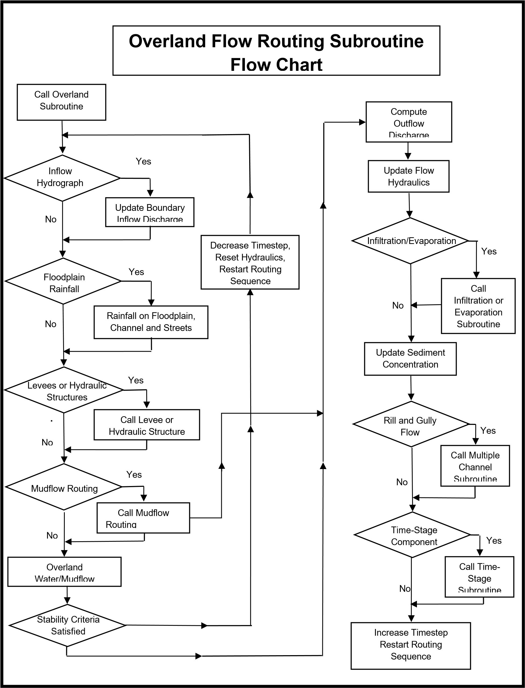

*Figure 34.
Overland Flow Routing Subroutine Flow Chart.*

Streets serving as conveyance features are important for distributing the flow to other project areas.
Streets can be modeled either as 1-D rectangular channels or as impervious grid elements with low n-values.
If the two or more grid elements fit inside a street because the grid elements are 10 ft square or less, then assigning appropriate elevations and
n-values to the grid elements will enable street flow.
These street elements can be assigned with shape files either with QGIS plug-in tool or with the GDS (Figure 35).
To make the floodplain elements represent the street:

    - Assign n-values in an acceptable range for street irregularities, breaks-in-slope, unsteady and non-uniform flow (0.02 to 0.035);

    - Select a spatially variable limiting Froude number in the range from 1.5 to 2.5;

    - Review and adjust the street profile.

To adjust the street profile, there are two GDS tools: 1) Interpolate elevations downslope and for the street crown.
It will also assign minimum curb elevations to the floodplain elevations outside the street.
2) Draw a polyline and interpolate the elevations using the profile tool.
For more street editing options and details see the GDS manual or the street editing white paper.

.. image:: img/Chapter4/Chapte100.png

*Figure 35.
Editing Grid Elements to Represent Streets.*

Some of the floodplain or watershed depression storage defined by the DTM point data set is lost in the upscale averaging of the discretized FLO-2D
grid surface.
This depression storage accuracy can be retained by generating a depth-volume storage rating table for each grid element.
The GDS will automatically create the rating table if there are sufficient DTM points for a rating table (e.g. a threshold of 20 points or more are
required depending on the topographic setting of the domain).
An OUTRC.DAT file lists the potential storage for each cell.
The algorithm divides the grid element in subcells where the storage volume is calculated as a function of the stage above the lowest DTM point
(Figure 36).
At runtime the FLO-2D model will compute a flow depth based on the storage volume from the rating table.
As the cell depression volume fills and eventually spills to other grid elements, the storage retention is infiltrated.
The unique attributes of this routine to improve shallow flow runoff are:

    - At runtime, the flow depth is based on the stage-volume rating table until the cell is filled.

    - A minimum number of DTM points within each grid element are required to assign the storage rating table; otherwise the model uses the TOL value for
      the depression storage.

    - The rating table is created only for those grid cells that do not contain a street or channel or that have an area reduction factor (ARF) less than
      0.5.

    - If a grid element has a rating table, the cell elevation will be equal to the lowest DTM point used in the calculation of the rating table.

For a complete discussion of this grid element rating table stage-volume tool, refer to the GDS manual.

.. image:: img/Chapter4/Chapte049.png

*Figure 36.
Stage-Volume Rating Table for Assigning Flow Depths.*

Some FLO-2D projects have been modeled using grid elements inside of the channel.
In this case, the channel component is not used and instead the FLO-2D grid system is draped over the channel portion of the topography.
While these projects have been conducted with some success, there are several modeling concerns that should be addressed.
The FLO-2D model was developed to be able to exchange 1-D channel overbank discharge with the floodplain grid elements.
For this reason, the model works well on large flood events and large grid elements.
When small grid elements are used inside of a channel with confined flow and large discharges and flow depths, the model may run slow.
In addition, there will be zero water surface slope between some grid elements.
It should be noted that the application of the Manning’s equation for uniform open channel flow to compute the friction slope is no longer valid as
the depth average velocity approaches zero (ponded flow condition).
The resulting water surface elevations can be accurately predicted but will display some variation across the channel.

Channel Flow
-----------------

The full channel guidelines are in the Manuals folder.
Channel flow is simulated as one-dimensional in the downstream direction.
Average flow hydraulics of velocity and depth define the discharge between channel grid elements.
Secondary currents, dispersion and super elevation in channel bends are not modeled with the 1-D channel component.
The governing equations of continuity and momentum were presented in Section 2.1.

River channel flow is simulated with either rectangular or trapezoidal or surveyed cross-sections and is routed with the dynamic wave momentum
equation.
The channels are represented in the CHAN.DAT by a grid element, cross-section geometry that defines the relationship between the thalweg elevation and
the bank elevations, average cross-section roughness, and the length of channel within the grid element.
Channel slope is computed as the difference between the channel element thalweg elevation divided by the half the sum of the channel lengths within
the channel elements.
Channel elements must be contiguous to be able to share discharge.
A tributary confluence is assigned by select the two channel element pairs (tributary and main channel) in the CHAN.DAT file.

The channel width can be larger than the grid element and may encompass several elements (Figure 37).
If the channel width is greater than the grid element width, the model extends the channel into neighboring grid elements.
A channel may be 1,000 ft (300 m) wide and the grid element only 300 ft (100 m) square.
The model also makes sure that there is sufficient floodplain surface area after assigning the right bank.
The channel interacts with the bank elements to share discharge to the floodplain.
Each bank can have a unique elevation.
If the two bank elevations are different in the CHAN.DAT file, the model automatically splits the channel into two elements even if the channel would
fit into one grid element.

.. image:: img/Chapter4/Chapte001.png

*Figure 37.
Channel Extension Over Several Grid Elements.*

There are three options for establishing the bank elevation in relationship to the channel bed elevation (thalweg) and the floodplain elevation in the
CHAN.DAT file:

    1. The channel grid element bed elevation is determined by subtracting the assigned channel thalweg depth from the floodplain elevation.
       This is appropriate for rectangular and trapezoidal cross-sections.

    2. A bank elevation is assigned in the CHAN.DAT file and the channel bed elevation is computed by subtracting the channel depth from the lowest bank
       elevation.
       This is appropriated for rectangular and trapezoidal cross-sections.

    3. A surveyed cross-section data set is assigned in XSEC.DAT and the model automatically assigns the top-of-bank elevation.

When using cross-section data for the channel geometry, option 3 should be applied.

In river simulations, the important components include channel routing, the channel-floodplain interaction, hydraulic structures, and levees.
These components are described in more detail in the following sections.
The basic procedure for creating a FLO-2D river simulation is as follows:

*Select Channel Cross-sections.* Surveyed river cross-sections should be spaced to represent a uniform river reach that may encompass several channel
elements, say 5 to 10 elements.
Georeferenced surveyed cross-section station and elevation data can be entered directly into the model data files or the data can be defined by
setting the highest bank to an arbitrary elevation.
For channel design purposes, a rectangular or trapezoidal cross-section may be selected.
To use surveyed cross-section data, an XSEC.DAT file must be created with all cross-section station and elevation data.
The cross-sections are then assigned to a channel element in the CHAN.DAT.
The relationship between the flow depth and channel geometry (flow area and wetted perimeter) is based on an interpolation of depth and flow area
between vertical slices that constitute a channel geometry rating table for each cross-section.
The cross-section data in the XSEC.DAT file can be automatically assigned from HEC-RAS file using the GDS.
*Locate the Channel Element with Respect to the Grid System.* Using the GDS and an aerial photo, the channels can be assigned to a grid element.
For channel flow to occur through a reach of river, the channel elements must be neighbors.

*Adjust the Channel Bed Slope and Interpolate the Cross-sections.* Each channel element is assigned a cross-section in the CHAN.DAT file.
Typically, there are only a few cross-sections and many channel elements, so each cross-section will be assigned to several channel elements.
When the cross-sections have all been assigned the channel profile looks like a staircase because the channel elements with the same cross-section
have identical bed elevations.
The channel slope and cross-section shape can then be interpolated by using a command in the GDS, QGIS Plug-in or in the PROFILES program that adjusts
and assigns a cross-section with a linear bed slope for each channel element.
The cross-section interpolation is based a weighted flow area adjustment to achieve a more uniform rate of change in the flow area.

The user has several other options for setting up the channel data file including grouping the channel elements into segments, specifying initial flow
depths, identifying contiguous channel elements that do not share discharge, assigning limiting Froude numbers and depth variable nvalue adjustments.

Channel-Floodplain Interface
--------------------------------

Channel flow is exchanged with the floodplain grid elements in a separate routine after the channel, street and floodplain flow subroutines have been
completed (see the Flow Chart in Figure 3).
When the channel conveyance capacity is exceeded, an overbank discharge is computed.
If the channel flow is less than bankfull discharge and there is no flow on the floodplain, then the channel-floodplain interface routine is not
called.
The channel-floodplain flow exchange is limited by the available exchange volume in the channel or by the available storage volume on the floodplain.
The interface routine is internal to the model and there are no data requirements for its application.
This subroutine also computes the flow exchange between the street and the floodplain.

The channel-floodplain exchange is computed for each channel bank element and is based on the potential water surface elevation difference between the
channel and the floodplain grid element containing either channel bank (Figure 2).
The velocity of either the channel overbank or the return flow to the channel is computed using the diffusive wave momentum equation.
It is assumed that the overbank flow velocity is relatively small and thus the acceleration terms are negligible.
For return flow to the channel, if the channel water surface is less than the bank elevation, the bank elevation is used to compute the return flow
velocity.
Overbank discharge or return flow to the channel is computed using the floodplain assigned roughness.
The overland flow can enter a previously dry channel.

Levees
----------

The FLO-2D levee component confines flow on the floodplain surface by blocking one of the eight flow directions.
Levees are designated at the grid element boundaries (Figure 38).
If a levee runs through the center of a grid element, the model levee position is represented by one or more of the eight grid element boundaries.
Levees often follow the boundaries along a series of consecutive elements.
A levee crest elevation can be assigned for each of the eight flow directions in each grid element.
The model will predict levee overtopping.
When the flow depth exceeds the levee height, the discharge over the levee is computed using the broad crested weir flow equation.
Weir flow occurs until the tailwater depth is 85% of the headwater depth above and then at higher flows, the water is exchanged across the levees
using the difference in water surface elevation.
Levee overtopping will not cause levee failure unless the failure or breach option is invoked.

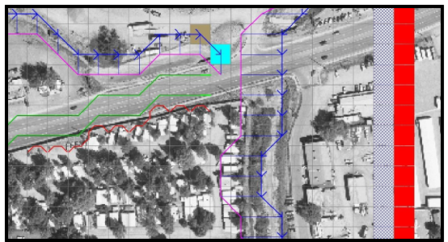

*Figure 38.
Levees are Depicted in Red and the River in Blue in the GDS Program.*

The levee output files include LEVEE.OUT, LEVOVERTOP.OUT and LEVEEDEFIC.OUT.
LEVEE.OUT contains the levee elements that failed.
Failure width, failure elevation, discharge from the levee breach and the time of failure occurrence are listed.
A discharge hydrograph overtopping the levee element is reported in LEVOVERTOP.OUT.
The discharge is combined for all the levee directions that are being overtopped.
Finally, the LEVEEDIFIC.OUT file lists the levee elements with loss of freeboard during the flood event.
Five levels of freeboard deficit are reported:

    1. = freeboard > 3 ft (0.9 m)

    2. = 2 ft (0.6 m) < freeboard < 3 ft (0.9 m)

    3. = 1 ft (0.3 m) < freeboard < 2 ft (0.6 m)

    4. = freeboard < 1 ft (0.3 m)

    5. = levee is overtopped by flow.

The levee deficit can be displayed graphically in both MAPPER Pro and MAXPLOT (Figure 39).

.. image:: img/Chapter4/Chapte003.png

*Figure 39.
Levee Freeboard Deficit Plot Using MAXPLOT.*

Levee and Dam Breach Failures
---------------------------------

Breach Options

There are two FLO-2D user defined dam and levee breach options to predict the breach hydrograph: 1) Breach erosion (Figure 40); and 2) Prescribed
failure rates (Figure 41).
The prescribed breach method uses assigned vertical and horizontal failure rates.
The breach erosion option predicts the physical process of sediment scour of the breach opening.
In both breach methods, the breach computational timestep is the flood routing timestep.
FLO-2D computes the discharge through the breach, the change in upstream storage, the tailwater and backwater effects, and the downstream flood
routing.
Each failure option generates a series of output files to analyze the dam breach.
The model reports the time of breach or overtopping, the breach hydrograph, peak discharge through the breach, and breach parameters as a function of
time.
Additional output files to define the dam failure flood hazard include the timeto-flow-depth output files that report the time to the maximum flow
depth, the time to onefoot flow depth and time to two-foot flow depth which are useful for delineating evacuation and emergency access routes.
The model reports the time of breach or overtopping, the breach hydrograph, peak discharge through the breach, and breach parameters as a function of
time.
Additional output files that define the breach hazard include the time-to-flow-depth output files that report the time to the maximum flow depth, the
time to one-foot flow depth and time to two-foot flow depth, and deflood time which are useful for delineating evacuation routes.

.. image:: img/Chapter4/Chapte102.png

*Figure 40.
Example of Levee Breach Urban Flooding.*

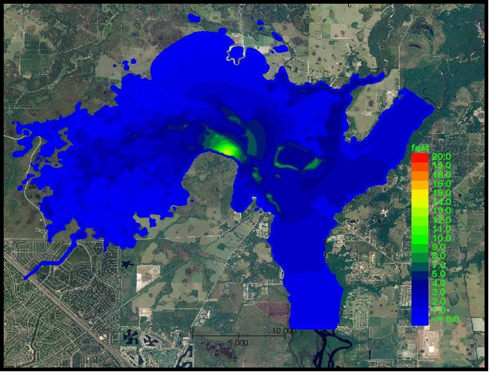

*Figure 41.
Example of a Proposed Domestic Water Supply Reservoir Breach Failure.*

Prescribed Breach

For the prescribed levee failure routine, the breach can enlarge vertically or horizontally.
The initial breach width and depth is hardwired as 1 ft (0.3 m).
Rates of breach expansion (ft/hr or m/hr) can be specified for both the horizontal and vertical failure modes.
Breach discharge is based on the breach width and the difference in water surface elevations on each side of the levee.
A final levee base elevation that is higher than the floodplain elevation can also be specified.
The levee failure can occur for the entire grid element width for a given flow direction and then the breach can grow to contiguous levee elements.
The prescribed levee breach can be assigned to globally predict levee failure anywhere in the grid system based on the computed water surface
elevation.
Additional breach failure variables such as initial failure elevation if different from overtopping failure and duration of saturation before failure
can be assigned to add detail to multiple levee failure locations.
For prescribed breaches you can:

    - Determine the location of levee failure anywhere in the levee system based on overtopping or based on the water surface elevation reaching a
      prescribed elevation or distance below the crest elevation for an assigned duration.

    - Initiate multiple levee breach failures in various locations that proceed simultaneously.

    - Levee failure proceeds with prescribed vertical and horizontal erosion rates that will slow based on the breach shear stress.

Erosion Breach

The breach erosion component was added to the FLO-2D model to combine the downstream unconfined flood routing with a realistic physical process-based
assessment of the dam failure.
The basis for the FLO-2D model was National Weather Service BREACH model developed by Fread in 1988.
More information on the breach model development is available in the FLO-2D Reference Manual.
In FLO-2D, a dam can fail as follows:

    - Overtopping and development of a breach channel;

    - Piping failure;

    - Piping failure and roof collapse and development into a breach channel;

    - Breach channel enlargement through side slope slumping;

    - Breach enlargement by wedge collapse.

The user has the option to specify the breach element and breach elevation or to assign global parameters and the model will locate breach failure
element based on the water surface elevation and duration of inundation.
During an inflow flood simulation, the reservoir fills until the water surface elevation is higher than the crest and overtops it initiating a breach
channel.
The user can also assign a prescribed breach elevation.
If the water elevation exceeds the breach elevation for a given duration, piping is initiated (with or without an inflow flood).
Once the pipe roof collapses, then the discharge is computed through the ensuing breach channel.

If the user specifies a breach elevation, then piping will be initiated first.
The breach discharge is computed as weir flow with a user specified weir coefficient.
The discharge is then used to compute velocity and depth in a rectangular pipe.
Using the pipe hydraulics and dam embankment material data, sediment transport capacity is computed using one of nine other sediment transport
capacity equations in the FLO-2D model.
Sediment is uniformly eroded from the walls, bed, and roof of the pipe (Figure 42).
When the pipe height is larger than the material remaining in the embankment above, the roof of the pipe collapses and breach channel flow ensues.
The channel discharge is also calculated by the weir equation and like the pipe failure the walls and bed of the rectangular channel are scoured.
As the channel width and depth increases, the slope stability is checked and if the stability criteria are exceeded, the sides of the channel slump
and the rectangular breach transitions to a trapezoidal channel (Figure 43).
The scour of the trapezoidal bed and sides can be non-uniform and controlled by user input.
The breach continues to widen, and the breach width will expand to other grid elements if necessary.

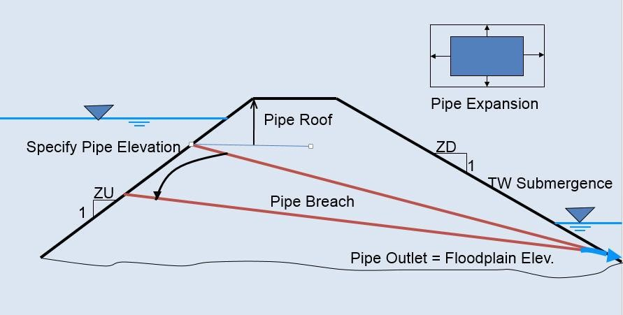

*Figure 42.
Dam Breach Piping Failure.*

.. image:: img/Chapter4/Chapte005.jpg

*Figure 43.
Dam Breach Channel Development.*

The dam geometry parameters (Figure 44) associated with a breach erosion failure are:

    - Crest Elevation

    - Starting Water Surface Elevation (or depth below crest) (ft or m)

    - Cumulative Duration of Inundation at Specified Elevation Prior to Breach Initiation (hr)

    - Maximum Breach Width (ft or m)

    - Prescribed Initial Pipe Elevation (ft or m)

    - Tailwater Elevation (ft or m)

    - Foundation or Base Elevation for Vertical Breach Cessation (ft or m) These parameters are defined in Figure 44.

        Crest Elevation

        Starting Water Surface

        Prescribed Pipe

        Dam Foundation

        Tailwater Elevation

        Maximum Breach Width

.. image:: img/Chapter4/Chapte104.png

*Figure 44.
Breach Failure Geometry. (Teton Dam Failure 1976 USBR).*

Reservoir water is discharged through the breach and downstream by the FLO-2D routing algorithms using volume conservation that tracks the storage
along with the discharge in and out of every grid element based on the computational timesteps.
Sediment eroded from the dam is also conserved and matched to the breach hole size conservation and the water discharge through the breach is bulked
by the eroded sediment.
Routing water through the breach continues until the water surface elevation no longer exceeds the prescribed breach bottom elevation or until all the
reservoir water is gone.
Tailwater submergence of the weir flow will reduce the breach discharge.

A comprehensive guide to modeling the breach of levees, dams and walls is outlined in the manual Levee, Dam, and Wall Breach Guidelines (FLO-2D,
2018).

Hydraulic Structures
------------------------

The full hydraulic structures guidelines are in the Handouts folder.
Hydraulic structures are simulated by specifying either discharge rating curves or rating tables.
Hydraulic structures can include bridges, culverts, weirs, spillways or any hydraulic facility that controls conveyance and whose discharge can be
specified by a rating curve or tables.
Backwater effects upstream of bridges or culverts as well as blockage of a culvert or overtopping of a bridge can be simulated.
A hydraulic structure can control the discharge between channel or floodplain grid elements that do not have to be contiguous but may be separated by
several grid elements.
For example, a culvert under an interstate highway may span several grid elements.

A hydraulic structure rating curve equation specifies discharge as a function of the headwater depth h:

                    Q = a h\ :sup:`b`

where: (a) is a regression coefficient and (b) is a regression exponent.

More than one power regression relationship may be used for a hydraulic structure by specifying the maximum depth for which the relationship is valid.
For example, one depth relationship can represent culvert inlet control and a second relationship can be used for the outlet control.
In the case of bridge flow, blockage can be simulated with a second regression that has a zero coefficient for the height of the bridge low chord.

By specifying a hydraulic structure rating table, the model interpolates between the depth and discharge increments to calculate the discharge.
A typical rating curve will start with zero depth and zero discharge and increase in non-uniform increments to the maximum expected discharge or
higher.
The rating table may be more accurate than the regression relationship if the regression is nonlinear on a log-log plot of the depth and discharge.
Flow blockage by debris can be simulated by setting the discharge equal to zero corresponding to a prescribed depth.
This blockage option may useful in simulating worst case mud and debris flow scenarios where bridges or culverts are located on alluvial fans.
Simulating blockage of a channel bridge or culvert can force all the discharge to flow overland.

In a simplified storm drain approach, multiple inflow nodes can be assigned to the same outflow element.
This will enable the cumulative storm drain discharge at the outlet to be assessed without conduit flow routing.
It is possible to assign a limiting conveyance capacity for the outlet node and this will limit the inlet discharge in a successive downstream inflow
to the conduit.
When the conveyance capacity is exceeded, the discharge in the first inlet to exceed the capacity and the inflow to the remaining downstream inlet
nodes is zero.
The actual storm drain component engine should be used for a detailed analysis of a storm drain system (see the Storm Drain Section below).
Refer to the White Paper Guidelines on Hydraulic Structures for additional details including pump simulation.

Generalized culvert equations for inlet and outlet control are available for the hydraulic structures.
Equations to compute culvert discharge for round and rectangular culverts by evaluating inlet and outlet control have been implemented.
The culvert discharge will be computed using equations based on experimental and theoretical results from the U.S.
Department of Transportation procedures (Hydraulic Design of Highway Culverts; Publication Number FHWA-NHI-01-0260 revised May 2005) and these can
replace the FLO-2D model rating table or curve methods.
The equations include options for box and pipe culverts and will consider different entrance types for box culverts (wing wall flare 30 to 75 degrees,
wing wall flare 90 or 15 degrees and wing wall flare 0 degrees) and three entrance types for pipe culverts (square edge with headwall, socket end with
headwall and socket end projecting).
The highlights of this component are:

    - Computes discharge through box or circular pipe culverts for various entrance conditions.

    - Computes both inlet and outlet control and the transition between them.

    - No rating curves or tables required.

Storm Drain Modeling
------------------------

The full storm drain guidelines are available in the Manuals folder.
The FLO-2D surface water model has a dynamic exchange with the storm drain system.
FLO-2D will compute the surface water depth or elevations at storm drain cells and will compute the discharge inflow to the storm drain system based
on inlet geometry and water surface head.
The storm drain engine will then route the flow in the pipe network and compute potential return flow to the surface water system (Figure 45).
Storm drain engine was originally based on the EPA SWMM Model 5.0, but through extensive code enhancements, the FLO-2D storm drain engine represents a
completely new model.
The general approach to the applying the storm drain component is:

    - Storm Drain GUI interface (SWMM GUI) is called by the GDS to locate and develop the storm drain system.

    - GDS automatically develops the required SWMMFLO.DAT based on the SWMM.inp data file.

    - User defines the storm drain geometry in the GDS dialog box.

.. image:: img/Chapter4/Chapte105.png

*Figure 45.
Storm Drain Layout in the GDS with a Background Image.*

The surface water routing model and storm drain model share the same computational timestep.
FLO-2D is the host model, and computes inlet discharge based on the type of inlet and either weir or orifice flow.
The storm drain model accepts the inlet discharge and performs the conduit routing and the potential return flow to the surface water through either
inlets, outfalls or popped manhole covers.

The FLO-2D Storm Drain Guidelines manual is a companion reference document that describes the model integration and explains the data input.
The basic storm drain model development procedure is:

    i.   Develop and run a basic FLO-2D overland flow model.

    ii.  Open the GDS and call the Storm Drain model GUI (SWMM GUI).

    iii. Develop a storm drain network with the provided SWMM GUI or one of any number of other associated external SWMM software GUIs.
    iv.  GDS automatically creates the required FLO-2D interface data file when the GUI is closed and sets the storm drain switch to “ON”.

    v.   Assign the storm drain inlet geometry and coefficients in the GDS dialog box.

    vi.  Run FLO-2D model with the storm drain component.
    vii. Review the results in the SWMM.rpt file and graphically in the SWMM GUI.

    viii. Add other FLO-2D model components and details such as channels, buildings and levees.

Street Flow
---------------

Street flow as shallow flow in rectangular channels with a curb height using the same routing algorithm as for the 1-D rectangular channels.
The flow direction, street width and roughness are specified for each street section within an element.
Street and overland flow exchanges are computed in the channel-floodplain flow exchange subroutine.
When the curb height is exceeded, the discharge to floodplain portion of the grid element is computed.
Return flow to the streets is also simulated.

Streets are assumed to emanate from the center of the grid element to the boundary in the eight flow directions (Figure 46).
An east-west street across a grid element would be assigned two street sections.
Each section has a length of one-half the grid element side or diagonal.
A grid element may contain one or more streets and the streets may intersect.
Street roughness values, street widths, elevations and curb heights can be modified on a grid element or street section basis in the GDS program.

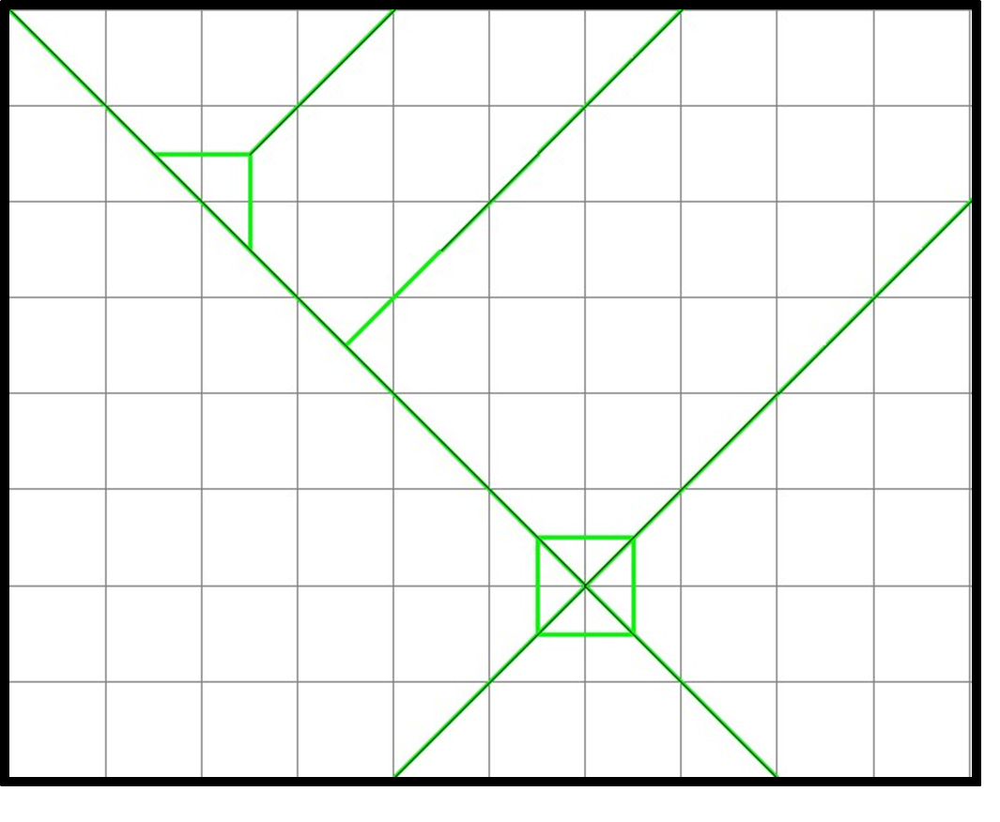

*Figure 46.
Streets Depicted in Green in the GDS Program.*

Floodplain Storage Modification and Flow Obstruction
---------------------------------------------------------

One of the unique features the FLO-2D model is its ability to simulate flow conditions associated with flow obstructions or loss of flood storage.
Area reduction factors (ARFs) and width reduction factors (WRFs) are coefficients that modify the individual grid element surface area storage and
flow width.
ARFs can be used to reduce the flood volume storage on grid elements due to buildings or topography.
WRFs can be assigned to any of the eight flow directions in a grid element and can partially or completely obstruct flow paths in all eight directions
simulating floodwalls, buildings or berms.

These factors can greatly enhance the detail of the flood simulation through an urban area.
Area reduction factors are specified as a percentage of the total grid element surface area (less than or equal to 1.0).
Width reduction factors are specified as a percentage of the grid element side (less than or equal to 1.0).
For example, a wall might obstruct 40% of the flow width of a grid element side and a building could cover 75% of the same grid element.

It is usually sufficient to estimate the area or width reduction on a map by visual inspection without measurement.
Visualizing the area or width reduction can be facilitated by plotting the grid system over an imported image in the GDS to locate the buildings and
obstructions with respect to the grid system (Figure 47).
The easiest method to assign ARF and WRF factors is to interpolate GIS shapefiles of buildings or other features automatically in the GDS or QGIS.
It is possible to specify individual grid elements that are totally blocked from receiving any flow in the ARF.DAT file (gray elements in Figure 48).

It is possible to specify individual grid elements that are totally blocked from receiving any flow in the ARF.DAT file (yellow elements in Figure 49).
These totally blocked cells do not require any WRF value assignment.
To avoid having grid elements with small or negligible surface area (almost totally blocked), any cells with assigned ARF that leave only a small
percentage of the grid element are reset at model runtime to ARF = 1 (blocked) according to criteria outlined in Table 4.

*Table 4.
Maximum Allowable ARF Values.*

.. list-table::
   :widths: 50 50
   :header-rows: 0

   * - **Grid Element Size (ft)**
     - **Max ARF**

   * - Cell Side > 50
     - 0.95

   * - 20 < Cell Side < 50
     - 0.90

   * - 20 > Cell Side
     - 0.85

A grid element of 10 ft will thereby have at least 15 square ft of surface area.

.. image:: img/Chapter4/Chapte006.jpg

*Figure 47.
ARF Assignments for Buildings with Walls, Storm Drain and Background Image.*

.. image:: img/Chapter4/Chapte007.jpg

*Figure 48.
Color Depiction of ARF and WRF Factors.*

Two building options are rainfall runoff from building roofs and building collapse.
Rainfall can collect on building roofs using levees to represent parapet walls and be routed to downspouts represented by hydraulic structure rating
curves (Figure 49 and Figure 50).

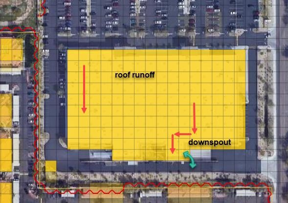

*Figure 49.
Roof Rainfall Runoff Routed to a Downspout.*

.. image:: img/Chapter4/Chapte009.jpg

*Figure 50.
Roof Downspout and Parapet Walls for Roof Storage.*

A conservative approach is taken to predict the potential collapse of buildings.
Based on vulnerability curves of depth versus velocity (Figure 51), when the computed threshold depth is exceeded by flood flow depth associated with
a predicted velocity, the building area reduction factor ARF value is reset to zero enabling the flow to go through the grid element and fill it with
flood storage.
The building collapse routine is triggered by assigning grid element building vulnerability curves in BUILDING_COLLAPSE.DAT or by assigning a negative
ARF values for either a totally blocked or partially blocked grid element.

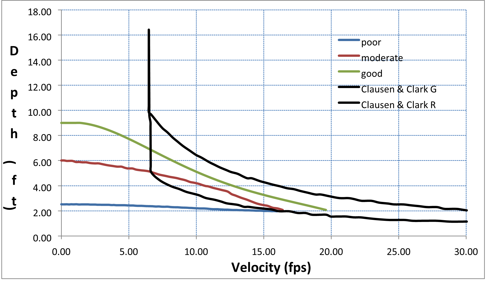

*Figure 51.
Building Collapse Vulnerability Curves.*

Rainfall Runoff
--------------------

Rainfall runoff can be routed to the channel system and then the river flood hydraulics can be computed in the same flood simulation.
The watershed hydrology and the river routing can also be modeled separately with FLO-2D.
Rainfall on the alluvial fan or floodplain can make a significant contribution to the total flood volume.
Some fan or floodplain surface areas are similar in size to the upstream watershed areas.
In these cases, the excess rainfall may be equivalent to the volume of the inflow hydrograph from the upstream watershed.
The fan rainfall/runoff may precede or lag the arrival of the floodwave from the upstream watershed.

The storm rainfall is discretized as a cumulative percent of the total.
This discretization of the storm hyetograph is established through local rainfall data, the NOAA Atlas or through regional drainage criteria that
defines storm duration, intensity, and distribution.
The rainfall can be uniform or spatially variable over the grid system.
Often in a FLO-2D simulation the first upstream flood inflow hydrograph timestep corresponds to the first rainfall incremental timestep.
By altering the storm time distribution on the fan or floodplain, the rainfall can lag or precede the rainfall in the upstream basin depending on the
direction of the storm movement over the basin.
The storm can also have a different total rainfall than that occurring in the upstream basin.

There are several options to simulate variable rainfall including a moving storm, spatially variable depth area reduction assignment, or even grid-
based rain gage data from an actual storm event.
Storms can be spatially varied over the grid system with areas of intense or light rainfall.
Storms can also move over the grid system by assigning storm speed and direction.
A rainfall distribution can be selected from several predefined distributions.

Historical storms can be assigned to the entire grid system.
If calibrated or adjusted NextGeneration Radar (NEXRAD) data is available, the NEXRAD pixel rainfall for a given time interval can be automatically
interpolated to the FLO-2D grid system using the GDS.
Each grid element will be assigned a rainfall total for the NEXRAD time interval, and the rainfall is then interpolated by the model for each
computational timestep.
The result is spatially and temporally variable rainfall-runoff from the grid system.
An example of the application of NEXRAD rainfall on an alluvial fan and watershed near Tucson, Arizona is shown in Figure 52.

You can accomplish the same result with gridded network data from a system of rain gages.
After the GDS interpolation, each FLO-2D grid element will have a rainfall hyetograph to represent the storm.
This is the ultimate temporal and spatial discretization of a storm event, and the resulting flood replication has proven to be very accurate.

As previously discussed, runoff from building roofs is another rainfall feature.
Setting IRAINBUILDING = 1 in RAIN.DAT will enable the rainfall on the surface area reduced portion of the grid element identified as a building (area
reduction factor - ARF value) to be contributed to the surface water on a grid element (Figure 52).
The roof runoff in dense urban areas can constitute a significant percentage of the total storm volume when it is added directly to the ground surface
volume.
The building ARF values are in addition to the RTIMP impervious surface infiltration assignment.

.. image:: img/Chapter4/Chapte107.png

*Figure 52.
Flooding Replicated from NEXRAD Data near Tucson, Arizona.*

Infiltration and Abstraction
---------------------------------

Precipitation losses, abstraction (interception) and infiltration are simulated in the FLO-2D model.
Infiltration is simulated using either the Green-Ampt infiltration model, the SCS curve number method, or the Horton model.
The infiltration parameters can be globally assigned or have grid system spatial variation.
Typically, unique hydraulic conductivity and soil suction values for each grid element define the spatially variation.
No infiltration is calculated for assigned streets, buildings or impervious surfaces in the grid elements.
Channel infiltration can also be simulated.
Although channel bed and bank seepage are usually only minor portion of the total infiltration losses in the system, it can affect the floodwave
progression in an ephemeral channel.
The surface area of a natural channel is used to approximate the wetted perimeter to compute the infiltration volume.

Abstraction

Precipitation losses, initial abstraction (interception and depression storage) and infiltration, are simulated in the FLO-2D model.
The initial abstraction is filled prior to simulating infiltration and typical initial abstraction values are presented in Table 5.
Surface depression storage (TOL parameter in TOLER.DAT) is an initial loss (a portion of the initial abstraction) from the potential surface flow.
This is the volume of water stored in small surface depressions (puddles) that does not become part of the overland runoff or infiltration.
The assignment of initial abstraction should consider the depression storage represented by the TOL value and be appropriately reduced.
The TOL parameter can be spatially variable with a unique value assigned to each grid element.

*Table 5.
Initial Abstraction.*

.. list-table::
   :widths: 50 50
   :header-rows: 0

   * - Surface Cover
     - Abstraction (inches)

   * - Natural\ :sup:`1`

       Desert and rangeland

       Hillslopes Sonoran desert

       Mountain with vegetation

     - 0.35

       0.15

       0.25

   * - Developed – Residential\ :sup:`1`

       Lawns

       Desert landscape

       Pavement

     - 0.20

       0.10

       0.05

   * - Agricultural fields and pasture
     - 0.50

   * - Conifers\ :sup:`2`
     - 0.01 - 0.36

   * - Hardwoods\ :sup:`2`
     - 0.001 - 0.08

   * - Shrubs\ :sup:`2`
     - 0.01 - 0.08

   * - Grass\ :sup:`2`
     - 0.04 - 0.06

   * - Forest floor\ :sup:`2`
     - 0.02 - 0.44

   * - :sup:`1`\ Maricopa County Drainage Design Manual, 1992.

       :sup:`2`\ W.
       T.Fullerton, Masters Thesis, CSU, 1983.
     -

Green-Ampt Infiltration

The Green-Ampt (1911) equation was selected to compute infiltration losses in the FLO-2D model because it is sensitive to rainfall intensity.
When the rainfall exceeds the potential infiltration, then runoff is generated.
The infiltration continues after the rainfall has ceased until all the available water has runoff or has been infiltrated.
The Green-Ampt equation is based on the following assumptions:

    - Air displacement from the soil has a negligible effect on the infiltration process;

    - Infiltration is a vertical process represented by a distinct piston wetting front;

    - Soil compaction due to raindrop impact is insignificant;

    - Hysteresis effects of the saturation and desaturation process are negligible;

    - Flow depth has limited effect on the infiltration processes.

A derivation of the Green-Ampt infiltration method can be found in Fullerton (1983).
To utilize the Green-Ampt model, hydraulic conductivity, soil suction, volumetric moisture deficiency, soil storage depth and the percent impervious
area must be specified.

Typical hydraulic conductivity, porosity and soil suction parameters are presented in Table 6 and Table 7.

*Table 6.
Green-Ampt Infiltration - Hydraulic Conductivity and Porosity.*

.. list-table::
   :widths: 40 15 15 15 15
   :header-rows: 0

   * - Classification
     - (in/hr)\ :sup:`1`
     - (in/hr)\ :sup:`2`
     - (in/hr)\ :sup:`3`
     - Porosity\ :sup:`4`

   * - sand and loamy
     - 1.20
     - 1.21 - 4.14
     - 2.41 - 8.27
     - 0.437sand

   * - sandy loam
     - 0.40
     - 0.51
     - 1.02
     - 0.437

   * - loam
     - 0.25
     - 0.26
     - 0.52
     - 0.463

   * - silty loam
     - 0.15
     - 0.14
     - 0.27
     - 0.501

   * - silt
     - 0.10
     -
     -
     -

   * - sandy clay loam
     - 0.06
     - 0.09
     - 0.17
     - 0.398

   * - clay loam
     - 0.04
     - 0.05
     - 0.09
     - 0.464

   * - silty clay loam
     - 0.04
     - 0.03
     - 0.06
     - 0.471

   * - sandy clay
     - 0.02
     - 0.03
     - 0.05
     - 0.430

   * - silty clay
     - 0.02
     - 0.02
     - 0.04
     - 0.479

   * - clay
     - 0.01
     - 0.01
     - 0.02
     - 0.475

   * - very slow
     -
     -
     - < 0.06\ :sup:`3`
     -

   * - slow
     -
     -
     - 0.06-.20\ :sup:`3`
     -

   * - moderately slow
     -
     -
     - 0.20-0.63\ :sup:`3`
     -

   * - moderate
     -
     -
     - 0.63-2.0\ :sup:`3`
     -

   * - rapid
     -
     -
     - 2.0-6.3\ :sup:`3`
     -

   * - very rapid
     -
     -
     - > 6.3\ :sup:`3`
     -

   * - :sup:`1`\ Maricopa County Drainage Design Manual, 1992.

       :sup:`2`\ James, et.al., Water Resources Bulletin Vol.28, 1992.

       :sup:`3`\ W.T. Fullerton, Masters Thesis, CSU, 1983.

       :sup:`4`\ COE Technical Engineering and Design Guide, No.19, 1997
     -
     -
     -
     -

*Table 7.
Green-Ampt Infiltration - Soil Suction.*

.. list-table::
   :widths: 40 20 20 20
   :header-rows: 0

   * - Classification
     - (in)\ :sup:`1`
     - (in)\ :sup:`2`
     - (in)\ :sup:`3`

   * - sand and loamy sand
     - 2.4
     - 1.9-2.4
     -

   * - sandy loam
     - 4.3
     - 4.3
     -

   * - Loam
     - 3.5
     - 3.5
     -

   * - silty loam
     - 6.6
     - 6.6
     -

   * - Silt
     - 7.5
     -
     -

   * - sandy clay loam
     - 8.6
     - 8.6
     -

   * - clay loam
     - 8.2
     - 8.2
     -

   * - silty clay loam
     - 10.8
     - 10.8
     -

   * - sandy clay
     - 9.4
     - 9.4
     -

   * - silty clay
     - 11.5
     - 11.5
     -

   * - Clay
     - 12.4
     - 12.5
     -

   * - Nickel gravel-sand loam
     -
     -
     - 2.0 - 4.5

   * - Ida silt loam
     -
     -
     - 2.0 - 3.5

   * - Poudre fine sand
     -
     -
     - 2.0 - 4.5

   * - Plainfield sand
     -
     -
     - 3.5 - 5.0

   * - Yolo light clay
     -
     -
     - 5.5 - 10.0

   * - Columbia sandy loam
     -
     -
     - 8.0 - 9.5

   * - Guelph loam
     -
     -
     - 8.0 - 13.0

   * - Muren fine clay
     -
     -
     - 15.0 - 20.0

   * - :sup:`1`\ Maricopa County Drainage Design Manual, 1992.

       :sup:`2`\ James, W.P., Warinner, J., Reedy, M., Water Resources Bulletin Vol.28,1992.

       :sup:`3`\ W.T. Fullerton, Masters Thesis, CSU, 1983.

     -
     -
     -

The volumetric moisture deficiency is evaluated as the difference between the initial and final soil saturation conditions (See Table 8).
Depression storage is an initial loss from the surface flow (TOL value).
This is the amount of water stored in small surface depressions that does not become part of the overland runoff or infiltration.

*Table 8.
Green-Ampt Infiltration Volumetric Moisture Deficiency.*

.. list-table::
   :widths: 50 25 25
   :header-rows: 0

   * - Classification
     - Dry (% Diff)
     - Normal (% Diff)

   * - sand and loamy sand\ :sup:`1`
     - 35
     - 30

   * - sandy loam
     - 35
     - 25

   * - loam
     - 35
     - 25

   * - silty loam
     - 40
     - 25

   * - silt
     - 35
     - 15

   * - sandy clay loam
     - 25
     - 15

   * - clay loam
     - 25
     - 15

   * - silty clay loam
     - 30
     - 15

   * - sandy clay
     - 20
     - 10

   * - silty clay
     - 20
     - 10

   * - Clay
     - 15
     - 5

   * - :sup:`1`\ Maricopa County Drainage Design Manual, 1992.
     -
     -

Infiltration Depth Limitation
~~~~~~~~~~~~~~~~~~~~~~~~~~~~~

An optional infiltration soil depth storage limit can be assigned globally (last parameter in line 1 of the INFIL.DAT file) or as a spatially variable
parameter for each grid element.
When the wetting front reaches the storage depth limitation for a floodplain grid element, the infiltration is ceased.
This infiltration volume limit can be quickly filled in an alluvial fan distributary channel or in other areas of concentrated flow resulting in
increased runoff.
It can also affect the time to peak discharge.
For channels, the infiltration is not stopped, but when the waterfront reaches the infiltration storage depth, the hydraulic conductivity is reduced
exponentially.
In this case, the infiltration is assumed to continue under a saturated condition that feeds the groundwater system.
The limiting soil depth is assigned as the soil depth below the ground surface.
The actual available storage is the soil depth times the porosity times the soil moisture deficit.
In other words, a portion of available pore space is occupied by the moisture in the soil at the start of the simulation.
As an example, the user may define a storage depth limit of 10 ft with a porosity of 40 percent (or 0.40) and a soil moisture deficient of 30% (0.30).
The available volumetric storage in the soil for this case is 1.2 ft per square foot of surface area (10 x 0.4 x 0.3).
If instead the volumetric soil moisture deficit (12% or 0.12) is given, the result is the same 1.2 ft.
This represents a solid depth of water that can be infiltrated.
Once this accumulated water depth (1.2 ft) is infiltrated, the infiltration stops for that grid element.
The spatially variable soil depth limit by grid element is assigned as the last parameter in line F of INFIL.DAT.

Channel Infiltration
~~~~~~~~~~~~~~~~~~~~

For channel infiltration, the surface area of a natural channel is used to approximate the wetted perimeter to compute the infiltration volume.
In addition to the depth limit for saturated hydraulic conductivity, an exponential decrement of the hydraulic conductivity can be applied for long
duration flow losses such as irrigation releases from dams.
Instead of stopping the infiltration when the wetting front reaches the limiting 2 infiltration depth, the hydraulic conductivity is reduced
exponentially using the same form as the Horton equation described below.
The time is referenced to when the wetting front reaches the assigned limiting depth and the decay coefficient is hardwired to a value of 0.00005
which enables the final hydraulic conductivity to be reaches in about 16 hours after the wetting front reaches the limiting soil depth.
The global limiting depth in line 1 of INFIL.DAT must be assigned and Line R for each channel reach must have the initial and final hydraulic
conductivity and the limiting soil depth.

SCS Curve Number Infiltration

The SCS runoff curve number (CN) loss method is a function of the total rainfall depth and the empirical curve number parameter which ranges from 1 to
100.
The SCS rainfall loss is a function of hydrologic soil type, land use and treatment, surface condition and antecedent moisture condition.
The method was developed on 24-hour hydrograph data on mild slope eastern rural watersheds in the United States.
Runoff curve numbers have been calibrated or estimated for a wide range of urban areas, agricultural lands, and semi-arid range lands.
The SCS CN method does not account for variation in rainfall intensity.
It was developed for predicting rainfall runoff from ungauged watersheds and its attractiveness lies in its simplicity.

For large basins (especially semi-arid basins) which have unique or variable infiltration characteristics such as channels, the CN method tends to
over-predict runoff (Ponce, 1989).

The SCS curve number parameters can be assigned graphically with the FLO-2D Plugin for QGIS to allow for spatially variable rainfall runoff.
Shape files can used to interpolate SCS-CNs from ground cover and soil attributes.
The SCS-CN method can be combined with the Green-Ampt infiltration method to compute both rainfall-runoff and overland flow transmission losses.
For this case, the SCS-CN method will be applied to grid elements with rainfall occurring and the Green-Ampt method will compute infiltration for grid
elements that do not have rainfall during the timestep.
This will enable transmission losses to be computed with Green-Ampt on alluvial fans and floodplains while the SCS-CN method is used to compute the
rainfall loss in the watershed basin.

Horton Infiltration

The Horton infiltration method is promoted by several agencies including the Urban Drainage and Flood Control District (UDFCD) in Denver, Colorado.
The UDFCD Drainage Criteria Manual (2008) suggests that the model represents a reasonable balance between simplicity and infiltration processes in
urban watersheds where the runoff is not sensitive to soil parameters.
This Horton equation is defined by:

   *f = f\ o + (f\ i - f\ o) e\ -at*

where:

     *f* = infiltration rate at any time *t* after the rainfall begins (in/hr) *f\ i* = initial infiltration rate (in/hr) *f\ o* = final infiltration rate
     (in/hr) *a* = decay coefficient (1/seconds)

     *t* = time from the rainfall initiation (seconds)

This equation simulates initial high infiltration early in the storm and decays to a steady rate with soil saturation.
The parameters depend on soil conditions and vegetative cover.
The UDFCD (2008) has recommended Horton parameters based on the NRCS hydrologic soil groups (Table 9).

*Table 9.
Horton Infiltration Parameters.*

.. image:: img/Chapter4/Chapte109.png

Evaporation
----------------

Open water surface evaporation losses for long duration floods in large river systems can be simulated.
This component was implemented for the 173-mile Middle Rio Grande model from Cochiti Dam to Elephant Butte Reservoir in New Mexico.
The open water surface evaporation computation is based on a total monthly evaporation that is prorated for the number of flood days in the given
month.
The user must input the total monthly evaporation in inches or mm for each month along with the presumed diurnal hourly percentage of the daily
evaporation and the clock time at the start of the flood simulation.
The total evaporation is then computed by summing the wetted surface area on both the floodplain and channel grid elements for each timestep.
The floodplain wetted surface area excludes the area defined by ARF area reduction factors.
The evaporation loss does not include evapotranspiration from floodplain vegetation.
The total evaporation loss is reported in the SUMMARY.OUT file and should be compared with the infiltration loss for reasonableness.

Overland Multiple Channel Flow
-----------------------------------

The purpose of the multiple channel flow component is to simulate the overland flow in rills and gullies rather than as overland sheet flow for
floodplain routing (Figure 53).
Surface water is often conveyed in small channels and simulating rill and gully flow concentrates the discharge with higher depths and velocities to
improve the model runoff timing.
This may be especially important in urban areas where small drainage channels and swales exist.
In the multiple channel routine, overland sheet flow within the grid element is routed to the multiple channel and then the flow between the grid
elements is computed as rill and gully flow.
No overland sheet flow is exchanged between grid elements if both elements have assigned multiple channels.
The gully geometry is defined by a maximum depth, width and flow roughness.
The multiple channel attributes can be spatially variable on the grid system and can be assigned or edited graphically with the GDS or QGIS programs.

.. image:: img/Chapter4/Chapte010.jpg

*Figure 53.
Gully on an Alluvial Fan where Overland Sheet Flow is Minimal.*

If the gully flow exceeds the specified gully depth, the multiple channels can be expanded by a user specified incremental width.
This channel widening process assumes these gullies are alluvial channels and will widen to accept more flow as the flow reaches bankfull discharge.
There is no gully overbank discharge to the overland surface area within the grid element.
The gully will continue to widen until the gully width exceeds the width of the grid element, then the flow routing between grid elements will revert
to sheet flow.
This enables the grid element to be overwhelmed by large flood flows.
If no incremental width is assigned, the flow depth just continues to increase vertically in the channel because there is no overbank out of channel
flow exchange with the floodplain.
During the falling limb of the hydrograph when the flow depth is less than 1 ft (0.3 m), the gully width will decrease to confine the discharge until
the original width is again attained.
The user can assign the range of slope where the multiple channel widening is computed.
There is also a channel avulsion routine that will force the multiple channel to take a new path when the flow exceeds the bankfull depth.
The primarily features of the multiple channel routine are:

    - Improves the runoff timing compare to overland sheet flow;

    - Shallow rectangular channels;

    - Channel bed slope is based on grid element topography;

    - Multiple channel widths can expand to accept more discharge to simulate alluvial fan channels.

To assign multiple channels in the graphic editor programs, simply draw a polyline and select width, depth, and n-values.
There is no required order of the channels or grid elements in the MULT.DAT file, but it simplifies editing if the multiple channel elements are
listed in order in downstream direction.
The maximum flow depth results of a rainfall watershed model with multiple channels.
Typically, multiple channels are assigned when observed in aerial photography at the outfalls of subasins as shown in Figure 54.

.. image:: img/Chapter4/Chapte011.jpg

*Figure 54.
Maximum Flow Depth with Multiple Channel Flow Shown as Dark Blue and Red.*

If multiple channels convey the flow to 1-D channels or rivers, then the multiple channel should terminate before the channel bank element and have
the multiple channel bed elevation in the terminating node (cell elevation – multiple channel depth) be higher than the cell elevation and the bank
elevation in the channel bank element.
If necessary, use an adjust to the width and depth as the multiple channel approaches the 1-D channel over several multiple channel elements to
simulate the multiple channel becoming wider and shallower on the flat river floodplain.

Sediment Transport – Total Load
------------------------------------

When a channel rigid bed analysis is performed, any potential cross-section changes associated with sediment transport are assumed to have a
negligible effect on the predicted water surface.
The volume of storage in the channel associated with scour or deposition is relatively small compared to the entire flood volume.
This is a reasonable assumption for large river floods on the order of a 100-year flood.
For large rivers, the change in flow area associated with scour or deposition will have negligible effect on the water surface elevation for flows
exceeding the bankfull discharge.
On steep alluvial fans, several feet of scour or deposition will usually have a minimal effect on the flow paths of large flood events.
For fan small flood events, the potential effects of channel incision, avulsion, blockage, bank or levee failure and sediment deposition on the flow
path should be considered.

To address mobile bed issues, FLO-2D has a sediment transport component that can compute sediment scour or deposition.
Within a grid element, sediment transport capacity is computed for either channel, street or overland flow based on the flow hydraulics.
The sediment transport capacity is then compared with the sediment supply and the resulting sediment excess or deficit is uniformly distributed over
the grid element potential flow surface using the bed porosity based on the dry weight of sediment.
For surveyed channel cross-sections, a nonuniform sediment distribution relationship is used.
There are eleven sediment transport capacity equations that can be applied in the FLO-2D.
Each sediment transport formula was derived from unique river or flume conditions and the user is encouraged to research the applicability of a
selected equation for a particular project.
Sediment routing by size fraction and armoring are also options.
Sediment continuity is tracked on a grid element basis.

During a FLO-2D flood simulation, the sediment transport capacity is based on the predicted flow hydraulics between floodplain or channel elements,
but the sediment transport computation is uncoupled from the flow hydraulics.
Initially the flow hydraulics are computed for all the floodplain and channel elements for the given time step and then the sediment transport is
computed based on the flow hydraulics for that timestep.
This assumes that the change in channel geometry resulting from deposition or scour will not have a significant effect on the average flow hydraulics
for that timestep.
If the scour or deposition is less than 0.10 ft (0.3 m), the sediment storage volume is not distributed on the bed but is accumulated.
Generally, it takes several timesteps (~1 to10 seconds) to accumulate enough sediment so that the resulting deposition or scour will exceed 0.10 ft
(0.03 m).
This justifies the uncoupled sediment transport approach used in FLO-2D.

Sediment routing by size fraction requires a sediment size distribution.
A geometric mean sediment diameter is estimated for each sediment interval represented as a percentage of the total sediment sample.
Generally, a six or more sediment sizes and the corresponding percentages are determined from a sieve analysis.
Each size fraction is routed in the model and the volumes in the bed (floodplain, channel or street) are tracked.
Initial sediment size fractions can be specified on a grid element basis for an alluvial fan or watershed surface to compute spatially variable
sediment transport.
Different areas of the grid system can be assigned different bed sediment size distributions by groups.
The variation in size fraction distribution is then tracked over the floodplain or fan surface.
The sediment supply to a river reach can also be entered in sediment size fractions.
An example of sediment data for routing by size fraction is presented in Table 10.

*Table 10.
Sediment Size Fraction.*

.. list-table::
   :widths: 50 50
   :header-rows: 0

   * - Sediment Diameter (mm)
     - Percent Finer

   * - 0.074
     - 0.058

   * - 0.149
     - 0.099

   * - 0.297
     - 0.156

   * - 0.59
     - 0.230

   * - 1.19
     - 0.336

   * - 2.38
     - 0.492

   * - 4.76
     - 0.693

   * - 9.53
     - 0.808

   * - 19.05
     - 0.913

   * - 38.10
     - 1.000

Bed armoring is automatically computed for sediment routing by size fraction.
There are no switches to initiate armoring.
The armoring process occurs when the upper bed layers of sediment become coarser as the finer sediment is transported out of the bed.
An armor layer is complete when the coarse bed material covers the bed and protects the fine sediment below it.
To assess armoring, the FLO-2D model tracks the sediment size distribution and volumes in an exchange layer defined by three times the D\ :sub:`90`
grain size of the bed material (Yang, 1996; O’Brien, 1984).
The potential armor layer is evaluated for each timestep by grid element when the volume of each size fraction in the exchange layer is assessed
(Figure 55).

.. image:: img/Chapter4/Chapte012.png

*Figure 55.
Sediment Transport Bed Exchange Layer.*

Sediment Supply

There are two options for computing the sediment supply to a given project.
The first option is to calculate a sediment supply discharge Q\ :sub:`s` rating curve in the form of:

            Q\ :sub:`s` = a Q\ :sub:`w`\ :sup:`b`

where:

     Q\ :sub:`w` is the water discharge,

     a is a coefficient and

     b is an exponent.

This equation is typically derived from a known stream gaging station that is recording suspended sediment load.
This data sediment load base is usually limited to large rivers and is not available for alluvial fan or watershed overland flow.

The second method is to compute the sediment supply at a FLO-2D model inflow node using one of the applicable sediment transport capacity equations
(out of the 11 available equations in the FLO-2D model).
In this case the sediment transport capacity out of the inflow node constitutes the sediment supply to the contiguous downstream channel or floodplain
node.
When the channel or floodplain inflow node sediment transport capacity represents the sediment supply to the model, the FLO-2D model does not permit
scour or deposition in the inflow node (Figure 56).
The inflow node will have an assigned water inflow hydrograph.
To avoid excessive scour downstream of the inflow node additional rigid grid elements can be assigned (R-lines in the SED.DAT file).
These may be positioned for an alluvial fan simulation so that sediment transport equilibrium is achieved at or near the apex.

.. image:: img/Chapter4/Chapte013.png

*Figure 56.
Inflow Node Locations.*

The size fraction percentage is tracked separately in the exchange layer and the rest of the channel bed.
When the exchange layer has less than 33% of the original exchange layer volume, the exchange layer is replenished with sediment from the rest of the
floodplain or channel bed using the initial bed material size distribution.
This effectively creates an armor layer that is 2 times the D\ :sub:`90` size of the bed material.
As sediment is removed from the exchange layer, the bed coarsens, and the size fraction percentage is recomputed.
If all smaller sediment size fractions in the exchange layer are removed leaving only the coarse size fraction that the flow cannot transport and the
exchange layer thickness is greater than 33% of the original exchange layer thickness, then the bed is armored and no sediment is removed from the bed
for that timestep.
Sediment deposition can still occur on an armored bed if the supply of a given size fraction to the element exceeds the sediment transport capacity
out of the element.
The user can specific the total depth of the channel bed available for sediment transport.
Sediment scour is limited for adverse slopes to essentially the average reach slope.

FLO-2D calculates the sediment transport capacity using each equation for each grid element and timestep.
The user selects only one equation for use in the flood simulation but can designate one floodplain or channel element to view the sediment transport
capacity results for all the equations based on the output interval.
The computed sediment transport capacity for each of the eleven equations can then be compared by output interval in the SEDTRAN.OUT file.
Using this file, the range of sediment transport capacity and those equations that appear to be overestimating or underestimated the sediment load can
be determined.

Each sediment transport equation is briefly described in the following paragraphs.
The user is encouraged to further research which equation is most appropriate for the channel morphology or hydraulics or a specific project.
When reviewing the SEDTRANS.OUT file, it might be observed that generally the Ackers-White and Engelund-Hansen equations compute the highest sediment
transport capacity; Yang and Zeller-Fullerton result in a moderate sediment transport quantity; and Laursen and Toffaleti calculate the lowest
sediment transport capacity.
This correlation however varies according to project conditions.
A brief discussion of each sediment transport equation in the FLO-2D model follows:

**Ackers-White Method**\ *.* Ackers and White (1973) expressed sediment transport in terms of dimensionless parameters, based on Bagnold’s stream
power concept.
They proposed that only a portion of the bed shear stress is effective in moving coarse sediment.
Conversely for fine sediment, the total bed shear stress contributes to the suspended sediment transport.
The series of dimensionless parameters are required include a mobility number, representative sediment number and sediment transport function.
The various coefficients were determined by best-fit curves of laboratory data involving sediment size greater than 0.04 mm and Froude numbers less
than 0.8.
The condition for coarse sediment incipient motion agrees well with Sheild’s criteria.
The Ackers-White approach tends to overestimate the fine sand transport (Julien, 1995).

**Engelund-Hansen Method**\ *.* Bagnold’s stream power concept was applied with the similarity principle to derive a sediment transport function.
The method involves the energy slope, velocity, bed shear stress, median particle diameter, specific weight of sediment and water, and gravitational
acceleration.
In accordance with the similarity principle, the method should be applied only to flow over dune bed forms, but Engelund and Hansen (1967) determined
that it could be effectively used in both dune bed forms and upper regime sediment transport (plane bed) for particle sizes greater than 0.15 mm.

**Karim-Kennedy Equation**\ *.* The simplified Karim-Kennedy equation (F.
Karim, 1998) is used in the FLO-2D model.
It is a nonlinear multiple regression equation based on velocity, bed form, sediment size and friction factor using many river flume data sets.
The data includes sediment sizes ranging from 0.08 mm to 0.40 mm (river) and 0.18 mm to 29 mm (flume), slope ranging from 0.0008 to 0.0017 (river) and
0.00032 to 0.0243 (flume) and sediment concentrations by volume up to 50,000 ppm.
This equation is suggested for non-uniform riverbed conditions for typical large sand and gravel bed rivers.
It will yield results similar to Laursen’s and Toffaleti’s equations.

**Laursen’s Transport Function**\ *.* The Laursen (1958) formula was developed for sediments with a specific gravity of 2.65 and had good agreement
with field data from small rivers such as the Niobrara River near Cody, Nebraska.
For larger rivers the correlation between measured data and predicted sediment transport was poor (Graf, 1971).
This set of equations involved a functional relationship between the flow hydraulics and sediment discharge.
The bed shear stress arises from the application of the Manning-Strickler formula.
The relationship between shear velocity and sediment particle fall velocity was based on flume data for sediment sizes less than 0.2 mm.
The shear velocity and fall velocity ratio expresses the effectiveness of the turbulence in mixing suspended sediments.
The critical tractive force in the sediment concentration equation is given by the Shields diagram.

**MPM-Smart Equation**\ *.* This is a modified Meyer-Peter-Mueller (MPM) sediment transport equation (Smart, 1984) for steep channels ranging from 3%
to 20%.
The original MPM equation underestimated sediment transport capacity because of deficiencies in the roughness values.
This equation can be used for sediment sizes greater than 0.4 mm.
It was modified to incorporate the effects of nonuniform sediment distributions.
It will generate sediment transport rates approaching Englund-Hansen on steep slopes.

**MPM-Woo Relationship**\ *.* For computing the bed material load in steep sloped, sand bed channels such as arroyos, washes and alluvial fans,
Mussetter, et al.
(1994) linked Woo’s relationship for computing the suspended sediment concentration with the Meyer-PeterMueller bedload equation.
Woo et al.
(1988) developed an equation to account for the variation in fluid properties associated with high sediment concentration.
By estimating the bed material transport capacity for a range of hydraulic and bed conditions typical of the Albuquerque, New Mexico area, Mussetter
et al.
(1994) derived a multiple regression relationship to compute the bed material load as a function of velocity, depth, slope, sediment size and
concentration of fine sediment.
The equation requires estimates of exponents and a coefficient and is applicable for velocities up to 20 fps (6 mps), a bed slope < 0.04, a D\
:sub:`50` < 4.0 mm, and a sediment concentration of less than 60,000 ppm.
This equation provides a method for estimating high bed material load in steep, sand bed channels that are beyond the hydraulic conditions for which
the other sediment transport equations may be applicable.

**Parker, Klingeman and McLean (1982)**\ *.* This equation was derived primarily for gravel or sandy bed material load.
It was based on Milhous (1973, 1982) sediment transport measurements at Oak Creek, Oregon.
At low flows the equation generates sediment load that is entirely bedload.
For higher flows approaching bankfull discharge, the predicted bed material load is presumed to be mixed suspended and bedload for the smaller
sediment size fractions.
The substrate based equation predicts individual size fraction transport rates for channel width average conditions which are then summed to get a
total bed load.

**Toffeleti Approach**\ *.* Toffaleti (1969) develop a procedure to calculate the total sediment load by estimating the unmeasured load.
Following the Einstein approach, the bed material load is given by the sum of the bedload discharge and the suspended load in three separate zones.

Toffaleti computed the bedload concentration from his empirical equation for the lower-zone suspended load discharge and then computed the bedload.
The Toffaleti approach requires the average velocity in the water column, hydraulic radius, water temperature, stream width, D\ :sub:`65` sediment
size, energy slope and settling velocity.
Simons and Senturk (1976) reported that Toffaleti’s total load estimated compared well with 339 river and 282 laboratory data sets.
This equation has several empirical and poorly defined coefficients that may give poor results for highly variable conditions.

**Van Rijn**\ *.* This equation predicts the total sediment discharge assuming a parabolic distribution of suspended sediment in the lower half of the
flow and a uniform distribution in the upper half of the flow.
The uniform sediment distribution in upper flow portion is based on the maximum value of the parabolic in the from the lower flow.
The bedload discharge and suspended load is computed separately and added together to derive the total sediment load.
For a discussion between measured and predicted data for the equation using laboratory and field tests revealing see T.W.
Strum (2001).

**Yang Method**\ *.* Yang (1973) determined that the total sediment concentration was a function of the potential energy dissipation per unit weight
of water (stream power) and the stream power was expressed as a function of velocity and slope.
In this equation, the total sediment concentration is expressed as a series of dimensionless regression relationships.
The equations were based on measured field and flume data with sediment particles ranging from 0.137 mm to 1.71 mm and flows depths from 0.037 ft to
49.9 ft.
Most of the data was limited to medium to coarse sands and flow depths less than 3 ft (Julien, 1995).
Yang’s equations in the FLO-2D model can be applied to sand and gravel.

**Zeller-Fullerton Equation**\ *.* Zeller-Fullerton is a multiple regression sediment transport equation for a range of channel bed and alluvial
floodplain conditions.
This empirical equation is a computer-generated solution of the Meyer-Peter, Muller bed-load equation combined with Einstein’s suspended load to
generate a bed material load (Zeller and Fullerton, 1983).
For a range of bed material from 0.1 mm to 5.0 mm and a gradation coefficient from 1.0 to 4.0, Julien (1995) reported that this equation should be
accurate with 10% of the combined Meyer-Peter Muller and Einstein equations.
The Zeller-Fullerton equation assumes that all sediment sizes are available for transport (no armoring).
The original Einstein method is assumed to work best when the bedload constitutes a significant portion of the total load (Yang, 1996).

In summary, Yang (1996) made several recommendations for the application of total load sediment transport formulas in the absence of measured data.
These recommendations for natural rivers are slightly edited and presented below:

    - Use Zeller and Fullerton equation when the bedload is a significant portion of the total load.

    - Use Toffaleti’s method or the Karim-Kennedy equation for large sand-bed rivers.

    - Use Yang’s equation for sand and gravel transport in natural rivers.

    - Use Ackers-White or Engelund-Hansen for subcritical flow in lower sediment transport regime.

    - Use Laursen’s formula for shallow rivers with silt and fine sand.

    - Use MPM-Woo’s or MPM-Smart for steep slope, arroyo sand bed channels and alluvial fans.

Yang (1996) reported that ASCE ranked the equations (not including Toffaleti, MPM-Woo, Karin-Kennedy) in 1982 based on 40 field tests and 165 flume
measurements in terms of the best overall predictions as follows with Yang ranking the highest: Yang, Laursen, Ackers-White, Engelund-Hansen, and
combined Meyer-Peter, Muller and Einstein.

It is important to note that in applying these equations, the wash load is not included in the computations.
The wash load should be subtracted from any field data before comparing the field measurements with the predicted sediment transport results from the
equations.
It is also important to recognize if the field measurements are sediment supply limited.
If this is the case, any comparison with the sediment transport capacity equations would be inappropriate.

There are two other sediment transport options available in the FLO-2D model; assignment of rigid bed element and a limitation on the scour depth.
Rigid bed element can be used would simulate a concrete apron in a channel below a culvert outlet, channel bed rock or a concrete lined channel reach.
The scour depth limitation is a control that can be invoked for sediment routing.

Mud and Debris Flow Simulation
-----------------------------------

Very viscous, hyperconcentrated sediment flows are generally referred to as either mud or debris flows.
Mudflows are non-homogeneous, nonNewtonian, transient flood events whose fluid properties change significantly as they flow down steep watershed
channels or across alluvial fans.
Mudflow behavior is a function of the fluid matrix properties, channel geometry, slope, and roughness.
The fluid matrix consists of water and fine sediments.
At sufficiently high concentrations, the fine sediments alter the properties of the fluid including density, viscosity, and yield stress.

There are several important sediment concentration relationships that help to define the nature of hyperconcentrated sediment flows.
These relationships relate the sediment concentration by volume, sediment concentration by weight, the sediment density, the mudflow mixture density,
and the bulking factor.
When examining parameters related to mudflows, it is important to identify the sediment concentration as a measure of weight or volume.
The sediment concentration by volume C\ :sub:`v` is given by:

        C\ :sub:`v` = volume of the sediment/(volume of water plus sediment)

C\ :sub:`v` is related to the sediment concentration by weight C\ :sub:`w` by:

                                             C\ :sub:`v` = C\ :sub:`w`\ γ/ {γ\ :sub:`s` - C\ :sub:`w`\ (γ\ :sub:`s` - γ)}

where γ = specific weight of the water and γ\ :sub:`s` = specific weight of the sediment.
The sediment concentration can also be expressed in parts per million (ppm) by multiplying the concentration by weight C\ :sub:`w` by 10\ :sup:`6`.
The specific weight of the mudflow mixture γ\ :sub:`m` is a function of the sediment concentration by volume:

                                             γ\ :sub:`m` = γ + C\ :sub:`v`\ (γ\ :sub:`s` - γ)

Similarly the density of the mudflow mixture ρ\ :sub:`m` is given by:

                                             ρ\ :sub:`m` = ρ + C\ :sub:`v` (ρ\ :sub:`s` - ρ)

          and

                                             ρ\ :sub:`m` = γ\ :sub:`m` /g

where g is gravitational acceleration.
Finally, the total mixture volume of water and sediment can be determined by multiplying the water volume by the bulking factor.
The bulking factor is simply:

                                            BF = 1/(1 - C\ :sub:`v`)

The bulking factor is 2.0 for a sediment concentration by volume of 50%.
A sediment concentration of 7% by volume for a conventional river bedload and suspended results in a bulking factor of 1.075 indicating that the flood
volume is 7.5% greater than if the flood was only water.

These basic relationships will be valuable when analyzing mudflow simulations.
Most mudflow studies require estimates of the sediment concentration by volume and the bulking factor to describe the magnitude of the event.
Average and peak sediment concentrations for the flood hydrograph are important variables for mitigation design.

The full range of sediment flows span from water flooding to mud floods, mudflows and landslides.
The distinction between these flood events depends on sediment concentration measured either by weight or volume (Figure 57).
Sediment concentration by volume expressed as a percentage is the most used measure.
Table 11 lists the four different categories of hyperconcentrated sediment flows and their dominant flow characteristics.
This Table 11 was developed from the laboratory data using actual mudflow deposits.
Some variation in the delineation of the different flow classifications should be expected based on the sample geology.

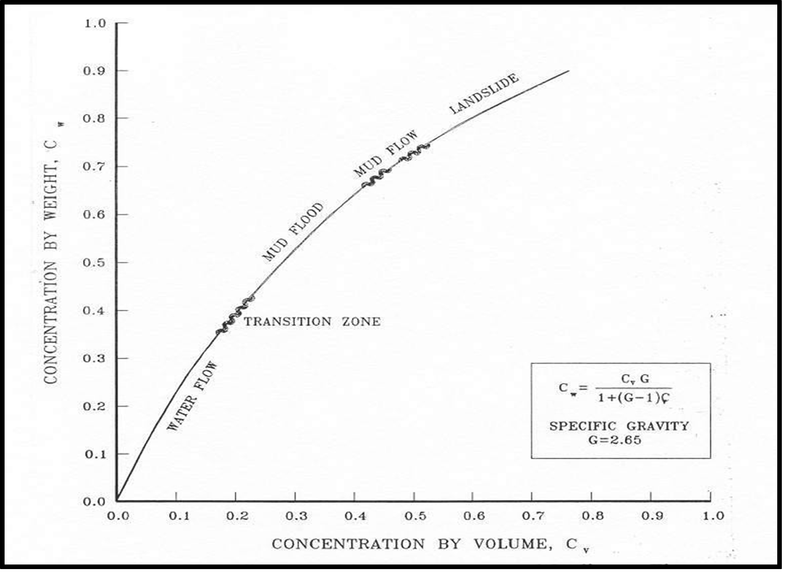

*Figure 57.
Classification of Hyperconcentrated Sediment Flows.*

Initial attempts to simulate debris flows were accomplished with one-dimensional flow routing models.
DeLeon and Jeppson (1982) modeled laminar water flows with enhanced friction factors.
Spatially varied, steady-state Newtonian flow was assumed, and flow cessation could not be simulated.
Schamber and MacArthur (1985) created a one-dimensional finite element model for mudflows using the Bingham rheological model to evaluate the shear
stresses of a nonNewtonian fluid.
O'Brien (1986) designed a one-dimensional mudflow model for watershed channels that also utilized the Bingham model.
In 1986, MacArthur and Schamber presented a two-dimensional finite element model for application to simplified overland topography (Corps, 1988).
The fluid properties were modeled as a Bingham fluid whose shear stress is a function of the fluid viscosity and yield strength.

*Table 11.
Mudflow Behavior as a Function of Sediment Concentration.*

.. image:: img/Chapter4/Chapte111.png

Takahashi and Tsujimoto (1985) proposed a two-dimensional finite difference model for debris flows based a dilatant fluid model coupled with Coulomb
flow resistance.
The dilatant fluid model was derived from Bagnold's dispersive stress theory (1954) that describes the stress resulting from the collision of sediment
particles.
Later, Takahashi and Nakagawa (1989) modified the debris flow model to include turbulence.

O'Brien and Julien (1988), Julien and Lan (1991), and Major and Pierson (1992) investigated mudflows with high concentrations of fine sediment in the
fluid matrix.
These studies showed that mudflows behave as Bingham fluids with low shear rates (<10 s\ :sup:`-1`).
In fluid matrices with low sediment concentrations, turbulent stresses dominate in the core flow.
High concentrations of non-cohesive particles combined with low concentrations of fine particles are required to generate dispersive stress.
The quadratic shear stress model proposed by O'Brien and Julien (1985) describes the continuum of flow regimes from viscous to turbulent/dispersive
flow.

Hyperconcentrated sediment flows involve the complex interaction of fluid and sediment processes including turbulence, viscous shear, fluid-sediment
particle momentum exchange, and sediment particle collision.
Sediment particles can collide, grind, and rotate in their movement past each other.
Fine sediment cohesion controls the nonNewtonian behavior of the fluid matrix.
This cohesion contributes to the yield stress τ\ :sub:`y` which must be exceeded by an applied stress to initiate fluid motion.
By combining the yield stress and viscous stress components, the well-known Bingham rheological model is prescribed.

For large rates of shear such as might occur on steep alluvial fans (10 s\ :sup:`-1` to 50 s\ :sup:`-1`), turbulent stresses may be generated.
In turbulent flow an additional shear stress component, the dispersive stress, can arise from the collision of sediment particles.
Dispersive stress occurs when non-cohesive sediment particles dominate the flow and the percentage of cohesive fine sediment (silts and clays) is
small.
With increasing high concentrations of fine sediment, fluid turbulence and particle impact will be suppressed, and viscous flow will occur.
Sediment concentration in each flood event can vary dramatically and as a result viscous and turbulent stresses may alternately dominate, producing
flow surges.

FLO-2D routes mudflows as a fluid continuum by predicting viscous fluid motion as function of sediment concentration.
A quadratic rheologic model for predicting viscous and yield stresses as function of sediment concentration is employed and sediment continuity is
observed.
As sediment concentration changes for a given grid element, dilution effects, mudflow cessation and the remobilization of deposits are simulated.
Mudflows are dominated by viscous and dispersive stresses and constitute a very different phenomenon than those processes of suspended sediment load
and bedload in conventional sediment transport.
In should be noted that the sediment transport and mudflow components **cannot** be used together in a FLO-2D simulation.

The shear stress in hyperconcentrated sediment flows, including those described as debris flows, mudflows, and mud floods, can be calculated from the
summation of five shear stress components.
The total shear stress τ depends on the cohesive yield stress τ\ :sub:`c`, the Mohr-Coulomb shear :math:`\tau_{mc}`, the
viscous shear stress :math:`\tau_v` (:math:`\eta\, \dv/dy`), the turbulent shear stress :math:`\tau_t`, and the
dispersive shear stress :math:`\tau_d`.

.. math::

   \tau = \tau_c + \tau_{mc} + \tau_v + \tau_l + \tau_d

When written in terms of shear rates :math:`\left(\dfrac{dv}{dy}\right)`, the following quadratic rheological model can be defined (O’Brien and Julien, 1985):

.. math::

   \tau = \tau_y + \eta \left( \frac{dv}{dy} \right) + C \left( \frac{dv}{dy} \right)^{2}

where

.. math::

   C = \rho_m \, l^{2} + f\!\left( \rho_m,\, C_v \right) d_s^{2}

and

.. math::

   \tau_y = \tau_c + \tau_{mc}

In these equations η is the dynamic viscosity; τ\ :sub:`c` is the cohesive yield strength; the Mohr Coulomb stress τ\ :sub:`mc` = p\ :sub:`s`\ tanφ
depends on the intergranular pressure p\ :sub:`s` and the angle of repose φ of the material; C denotes the inertial shear stress coefficient, which
depends on the mass density of the mixture ρ\ :sub:`m`, the Prandtl mixing length l, the sediment size d\ :sub:`s` and a function of the volumetric
sediment concentration C\ :sub:`v`.
Bagnold (1954) defined the functional relationship f(ρ\ :sub:`m`, C\ :sub:`v`) in the above equation as:

.. math::

   f(\rho_m, C_v) = a_i\, \rho_m \left[ \left( \frac{C^{*}}{C_v} \right)^{1/3} - 1 \right]

where :math:`a_i` (∼ :math:`0.01`) is an empirical coefficient and :math:`C^{*}` is the maximum static volume concentration for the sediment particles. It should be noted that Takahashi (1979) found that the coefficient :math:`a_i` may vary over several orders of magnitude. Egashira et al. (1989) revised this relationship and suggested the following:

.. math::

   f(\rho_s, C_v) =
   \left( \frac{\pi}{12} \right)^{1/3}
   \left( \frac{6}{\pi} \right)^{1/3}
   \sin^{2}\!\alpha_I \,
   \rho_s \left( 1 - e_n^{2} \right) C_v^{1/3}

where the energy restitution coefficient e\ :sub:`n` after impact ranges 0.70 < e\ :sub:`n` < 0.85 for sands, α\ :sub:`I` is the average particle
impact angle and ρ\ :sub:`s` is the mass density of sediment particles.

The first two stress terms in the above quadratic rheological model are referred to as the Bingham shear stresses (Figure 58).
The sum of the yield stress and viscous stress define the total shear stress of a cohesive mudflow in a viscous flow regime.
The last term is the sum of the dispersive and turbulent shear stresses and defines an inertial flow regime for a mud flood.
This term is a function of the square of the velocity gradient.
A discussion of these stresses and their role in hyperconcentrated sediment flows can be found in Julien and O'Brien (1987, 1993).

A mudflow model that incorporates only the Bingham stresses and ignores the inertial stresses assumes that the simulated flow is dominated by viscous
stresses.
This assumption is not universally appropriate because all mud floods and some mudflows are very turbulent with velocities as high as 25 fps (8 m/s).
Even mudflows with concentrations up to 40% by volume can be highly turbulent (O'Brien, 1986).
Depending on the fluid matrix properties, the viscosity and yield stresses for high sediment concentrations can still be relatively small compared to
the turbulent stresses.
If the flow is controlled primarily by the viscous stress, it will result in lower velocities.
Conversely, if the viscosity and yield stresses are small, the turbulent stress will dominate, and the velocities will be higher.

To delineate the role of turbulent and dispersive forces in sand and water mixtures, Hashimoto (1997) developed simplified criteria involving only
flow depth d and sediment size D\ :sub:`i`.
When d/D\ :sub:`i` < 30, the intergranular forces are dominant.
If d/D\ :sub:`i` > 100, inertial forces dominate.
In the range 30 < d/D\ :sub:`i` < 100 both forces play an important role in the momentum exchange.
It should be noted that sediment concentration is a critical factor that is not accounted for in this criterion.

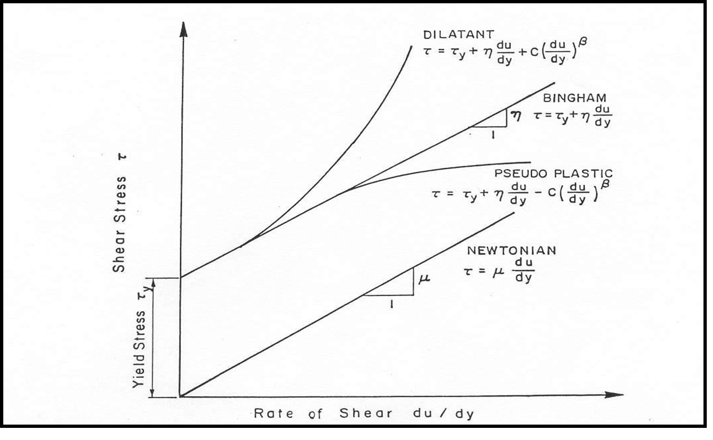

*Figure 58.
Shear Stress as a Function of Shear Rate for Fluid Deformation Models.*

To define all the shear stress terms for use in the FLO-2D model, the following approach was taken.
By analogy, from the work of Meyer-Peter and Müller (1948) and Einstein (1950), the shear stress relationship is depth integrated and rewritten in the
following form as a dimensionless slope:

                                                        *S f = S y + S v + S t d*

where the total friction slope S\ :sub:`f` is the sum of the yield slope S\ :sub:`y`, the viscous slope S\ :sub:`v`, and the turbulent-dispersive
slope S\ :sub:`td`.
The viscous and turbulent-dispersive slope terms are written in terms of depth- averaged velocity V.
The viscous slope can be written as:

.. math::

   S_v = \frac{K\, \eta}{8\, \gamma_m} \frac{V}{h^{2}}

where γ\ :sub:`m` is the specific weight of the sediment mixture.
The resistance parameter K for laminar flow equals 24 for smooth wide rectangular channels but increases significantly (~ 50,000) with roughness and
irregular cross-section geometry.

In Table 12 for Kentucky Blue Grass with a slope of 0.01, K was estimated at 10,000 (Chen, 1976).
A value of K = 2,285 was calibrated on the Rudd Creek, Utah mudflow for a residential area and has been used effectively for most urban studies.
For laminar and transitional flows, turbulence is suppressed and the laminar flow resistance parameter K becomes important.
In the FLO-2D model if K = 0 in the SED.DAT file, the value of K is automatically computed from the Manning’s n-value.

*Table 12.
Resistance Parameters for LaminarFlow.\ 1*

.. list-table::
   :widths: 50 50
   :header-rows: 0

   * - Surface
     - Range of K

   * - Concrete/asphalt
     - 24 -108

   * - Bare sand
     - 30 - 120

   * - Graded surface
     - 90 - 400

   * - Bare clay - loam soil, eroded
     - 100 - 500

   * - Sparse vegetation
     - 1,000 - 4,000

   * - Short prairie grass
     - 3,000 - 10,000

   * - Bluegrass sod
     - 7,000 - 50,000

   * - :sup:`1` Woolhiser (1975)
     -

The flow resistance n\ :sub:`td` of the turbulent and dispersive shear stress components are combined into an equivalent Manning’s n-value for the
flow:

.. math::

   S_{td} = \frac{n_{td}^{2}\, V^{2}}{h^{4/3}}

At very high concentrations, the dispersive stress arising from sediment particle contact increases the flow resistance n\ :sub:`td` by transferring
more momentum flux to the boundary.
To estimate this increase in flow resistance, the conventional turbulent flow resistance n-value n\ :sub:`t` is increased by an exponential function
of the sediment concentration C\ :sub:`v`:

.. math::

   n_{td} = n_t \, b \, e^{m C_v}

where: n\ :sub:`t` is the turbulent n-value and b is a coefficient (0.0538) and m is an exponent (6.0896).
This equation was based on unpublished paper by Julien and O’Brien (1998) that relates the dispersive and turbulent resistance in hyperconcentrated
sediment flows as function of the ratio of the flow depth to the sediment grain size.
The friction slope components can then be combined in the following form:

.. math::

   S_f = \frac{\tau_y}{\gamma_m\, h}
         + \frac{K\, \eta\, V}{8\, \gamma_m\, h^{2}}
         + \frac{n_{td}^{2}\, V^{2}}{h^{4/3}}

A quadratic equation solution to the friction slope equation has been formulated in the FLO-2D model to estimate the velocity for use in the momentum
equation.
The estimated velocity represents the flow velocity computed across the floodplain or channel element boundary using the average flow depth between
the elements.
Reasonable values of K and Manning’s nvalue can be assumed for the channel and overland flow resistance.
The specific weight of the fluid matrix γ\ :sub:`m`, yield stress τ\ :sub:`y` and viscosity η vary principally with sediment concentration.
Unless a rheological analysis of the mudflow site material is available, the following empirical relationships can be used to compute viscosity and
yield stress:

.. math::

   \tau_y = \alpha_2 \, e^{\beta_2 C_v}

and

.. math::

   \eta = \alpha_1 \, e^{\beta_1 C_v}

where α\ :sub:`i` and β\ :sub:`i` are empirical coefficients defined by laboratory experiment (O'Brien and Julien, 1988).
The viscosity (poises) and yield stress (dynes/cm\ :sup:`2`) are shown to be exponential functions of the volumetric sediment concentration C\
:sub:`v` of silts and clays (and in some cases, fine sands) and do not include larger clastic material rafted along with the flow (Table 13 and Figure
59 and Figure 60).

*Table 13.
Yield Stress and Viscosity as a Function of Sediment Concentration.*

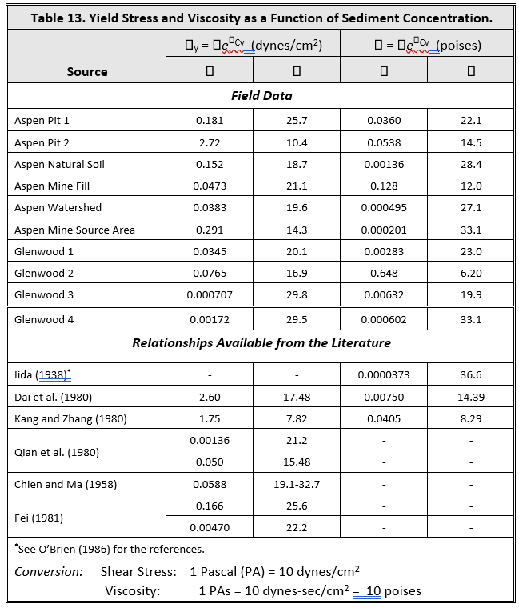

.. image:: img/Chapter4/Chapte115.png

*Figure 59.
Dynamic Viscosity of Mudflow Samples versus Volumetric Concentration.*

.. image:: img/Chapter4/Chapte116.png

*Figure 60.
Yield Stress of Mudflow Samples versus Volumetric Concentration.*

The viscosity of the fluid matrix is also a function of the type and percentage of silts and clays and the fluid temperature.
Very viscous mudflows have high sediment concentrations and correspondingly high yield stresses and may result in laminar flow although laminar flows
in nature are extremely rare.
Less viscous flows (mud floods) are always turbulent.

For a mudflow event, the average sediment concentration generally ranges between 20% and

35% by volume with peak concentrations approaching 50% (Table 13 and Figure 59 and Figure 60).
Large flood events such as the 100-year flood may contain too much water to produce a viscous mudflow event.
Smaller rainfall events such as the 10-year or 25-year return period storm may have a greater propensity to create viscous mudflows.
Most watersheds with a history of mudflow events and will gradually develop a sediment supply in the channel bed such that small storms may generate
mudflow surges.
Most rainfall induced mudflows follow a pattern of flood response.
Initially clear water flows from the basin rainfall-runoff may arrive at the fan apex.
This may be followed by a surge or frontal wave of mud and debris (40 to 50% concentration by volume).
When the peak arrives, the average sediment concentration generally decreases to the range of 30 to 40% by volume.
On the falling limb of the hydrograph, surges of higher sediment concentration may occur.

To simulate mudflows with the FLO-2D model, the MUD switch in the CONT.DAT must be turned on (MUD = 1) and the viscosity and yield stress variables in
SED.DAT file must be specified (Line M).
It is recommended that the viscosity and yield stress exponents and coefficients from Table 9 be selected for inclusion in the SED.DAT file.
The field sample Glenwood 4, for example, creates a very viscous mudflow.
A volumetric sediment concentration or a sediment volume must then be assigned to the water discharge for a timestep in the discretized inflow
hydrograph in the INFLOW.DAT file.
The inflow sediment volume may represent channel scour, bank erosion or hillslope failure.
The incremental sediment volume is tracked through the routing simulation and reported as a total sediment volume in the summary volume conservation
tables.
This total sediment volume should be reviewed to determine if it is a reasonable sediment supply or yield from the watershed.

When routing the mud flood or mudflow over an alluvial fan or floodplain, the FLO-2D model preserves continuity for both the water and sediment.
For every grid element and timestep, the change in the water and sediment volumes and the corresponding change in sediment concentration are computed.
At the end of the simulation, the model reports on the amount of water and sediment removed from the study area (outflow) and the amount and location
of the water and sediment remaining on the fan or in the channel (storage).
The areal extent of mudflow inundation and the maximum flow depths and velocities are a function of the available sediment volume and concentration
which can be varied in the FLO-2D simulations.
For further discussion on model hyperconcentrated sediment flows, refer to the FLO-2D white paper document *“Simulating Mudflows Guidelines”*.

Specific Energy, Impact and Static Pressure
------------------------------------------------

For overland flow, the specific energy, impact pressure and static pressure are computed and reported to a file on an output interval basis.
MAPPER Pro and MAXPLOT can graphically display these parameters with spatial variability.

The specific energy is computed by adding the flow depth velocity head (V\ :sup:`2`/2g) to the flow depth.
The maximum specific energy is reported to the file SPECENERGY.OUT by grid element.

The impact pressure P\ :sub:`i` for a floodplain grid element is reported as a force per unit length (impact pressure x flow depth).
The user can then multiply the impact pressure by the structure length within the grid element to get a maximum impact force on the structure.
Impact force is a function of fluid density, structure materials, angle of impact, and several other variables.
To conservatively estimate the impact pressure, the equation for water taken from Deng (1996):

.. math::

   P_i = k\, \rho_f\, V^{2}

where P\ :sub:`i` is the impact pressure, coefficient k is 1.28 for both English and SI units, ρ\ :sub:`f` = water density and V is the maximum
velocity regardless of direction.
For hyperconcentrated sediment flows such as mud floods and mudflows, the fluid density ρ\ :sub:`f` and coefficient k is a function of sediment
concentration by volume.
The coefficient k is based on a regressed relationship as a function of sediment concentration from the data presented in Deng (1996).
This relationship is given by,

.. math::

   k = 1.261\, e^{C_w}

where Cw = sediment concentration by weight.
The impact pressure is reported in the file IMPACT.OUT.

The static pressure P\ :sub:`s` for each grid element is also expressed as a force per unit length.
It is given by the maximum flow depth to the center of gravity ĥ times the specific weight of the fluid.
The static pressure is then multiplied by the flow depth to compute the static force per unit length of structure (assumes surface area A = l x d).
The maximum static pressure is written to the STATICPRESS.OUT file.

.. math::

   P_s = \gamma\, \hat{h}

Floodway Delineation
-------------------------

The floodplain management concept of the floodway delineation is to reserve an unobstructed area of flood conveyance passage while allowing for
potential utilization of the floodplain.
In the United States FEMA procedures outline a method for designating a floodway using the Corps of Engineers HEC-RAS model.
Floodway boundaries are designed to accommodate a 100yr flood within acceptable limits.
The floodplain areas that can be eliminated from potential flood storage without violating the floodway criteria can be considered for potential
development.
The general guidelines for floodway delineation are:

    - The floodway is based on the 100-yr flood.

    - The floodplain is divided into floodway and floodway fringe zones.
      It is generally assumed that all the flood conveyance in the floodway fringe is eliminated.

    - The floodway will pass the 100-yr flood without raising the water surface elevation more than 1 ft (0.3 m) above the maximum floodplain water surface.

    - The floodway is determined by means of equal reduction of conveyance on both sides of the channel.

The above guidelines are convenient artifacts of the single discharge, steady flow HEC-RAS model but do not reflect reality.
Flooding in the floodway fringe is never eliminated.
If development is allowed in the floodway or along the floodway fringe, flood volume will be forced into other areas of the floodway fringe or
downstream even if the water surface is raised less than 1 ft.
Furthermore, the assumption that equal reduction of conveyance on both sides of the channels is also not true because floodplain water surface
elevations are always different on each side of the river.
Equal conveyance reduction is an oversimplification related to steady flow, uniform water surface in HEC-RAS results.
In the Rio Grande floodplain for example, the measured water surface may be several feet higher on one side of the river than the other and even
several feet higher at the riverbank than near the levee over a 1,000 ft (300 m) from the river.

The HEC-RAS procedure to delineate a floodway to apply encroachment criteria using one or more options and make reasonable adjustments until
acceptable results are obtained both from a flood hydraulics standpoint and from a floodplain management perspective.
Floodway determination is difficult for several flooding conditions including streams with a mild slope and large floodplain; rivers with split flow
or levee overflow; alluvial fans with unconfined flooding and mobile boundaries; high velocity channels; and developed floodplain areas with
ineffective flow areas.
One of primary concerns is that the floodway encroachment procedure using HECRAS ignores the effects of floodwave attenuation and potential increase
in water surface elevation in the downstream floodway fringe zone.
Physically constricting the conveyance flow area with a floodway would have the effect of forcing more flood volume downstream.
Using a single discharge model to delineate a floodway can underestimate the potential impacts of increased downstream flooding as development
encroaches on the upstream floodplain fringe.
The application of an encroachment depth will also increase the channel conveyance and storage.
This may offset some of the volume getting forced downstream by the floodway encroachment.

The floodway routine in the FLO-2D model is automated.
Since FLO-2D is a flood routing model, the floodway component can address all the physical process issues associated with the HEC-RAS floodway
encroachment scheme.
To delineate a floodway for a FLO-2D flood simulation, first it is necessary to complete a base flood simulation to define the water surface for the
existing conditions.
An output file (FLOODWAY.OUT) is generated that lists the maximum water surface elevations for each floodplain grid element.
The user then sets the floodway switch in the CONT.DAT to “on” and assigns the encroachment depth (ENCROACH in CONT.DAT).
Typically, one foot (0.3 m) is assigned as the encroachment depth.
The FLO-2D floodway simulation is then run.
At runtime, the model will add the encroachment depth to the maximum water surface elevation in the FLOODWAY.OUT file to compute an encroachment water
surface elevation for a given grid element that must be exceeded in order for the model to exchange the discharge with other grid elements.
As the overbank flooding ensues, the model confines the flood to those floodplain grid elements whose encroachment water surface elevation is not
exceeded.
This forces more water volume downstream increasing the floodplain inundation in response to the upstream confined floodway conveyance.
The result is a mapped area of the floodway and floodway fringe that reflects the redistribution of the flood volume in the system.
The procedure for performing the floodway simulation is as follows:

    - Complete a base run FLO-2D floodwall simulation.

    - Set IFLOODWAY = 1 or “on” and ENCROACH = ~ 1 ft (0.3 m) in CONT.DAT.

    - Run the floodway simulation with FLO-2D.

The FLO-2D floodway rules for sharing discharge are:

    1. The FLO-2D Model defines floodway elements as floodplain elements with flow depth > ENCROACH value in the base run.
       Channel bank elements are automatically assigned as floodway elements.

    2. If the two floodplain elements sharing discharge are non-floodway elements, flow is shared between the elements (allows for rainfall runoff).

    3. If both floodplain elements are floodway elements, then flow is shared between them.

    4. If one floodplain element is a floodway element and the other is not, flow is not shared until the predicted water surface exceeds the base flood
       simulation maximum water surface elevation plus the ENCROACH value.
       When this occurs, the non-floodway element is re-assigned to be a floodway element.

In this manner, the flow first fills the floodway element until the maximum water surface plus the encroachment depth is exceeded.
Then the flow spills over into other floodplain grid elements.
The floodway is expanded automatically away from the channel banks or the center of the unconfined conveyance area as the floodway elements are filled.
The floodway schematic flow chart is shown in Figure 61 and an example of a floodway delineation for overland flow without a channel is shown in
Figure 62.
Figure 63 shows a floodway delineation for a flooding from a small channel.
Using MAPPER Pro, the floodway can be displayed a shaded contour, a contour line plot, or as a single contour outline only the floodway area.

The primary objective in creating the FLO-2D floodway routine was to automate the floodway routine and remove the subjectivity that is necessary with
the HEC-RAS floodway delineation.
Nevertheless, some judgment may still be required when delineating the final floodway boundary.

.. image:: img/Chapter4/Chapte117.png

*Figure 61.
Floodway Schematic Flow Chart.*

.. image:: img/Chapter4/Chapte014.jpg

*Figure 62.
Flood Delineation Comparison*

.. image:: img/Chapter4/Chapte015.jpg

*Figure 63.
Floodway Delineation Comparison.*

Groundwater – Surface Water Modeling
-----------------------------------------

The FLO-2D flood routing model is linked with the USGS MODFLOW-2005 Groundwater Flow Process (GWF) package to simulate integrated surface – subsurface
water exchange which can occur in any direction, as unsteady and spatially distributed flow.
The models are fully coupled allowing groundwater recharge and river recharge from groundwater simultaneously.
At any time in the simulation, water may be infiltrating from the surface water to the groundwater on one portion of the project while on other areas
the opposite may occur.
The model timesteps are synchronized as follows:

    - The MODFLOW simulation is divided into a series of stress periods during which specific parameters (e.g. variable heads) are constant.

    - Each stress period, in turn, is divided into a series of computational timesteps.

    - FLO-2D model timesteps are smaller than the MODFLOW model timesteps, so several FLO-2D computational sweeps are performed to match the MODFLOW model
      simulation time.

Infiltrated floodplain water predicted by FLO-2D is exchanged to the groundwater cells below.

If the groundwater is lower than the channel bed elevation, the infiltration volume is passed to the corresponding MODFLOW grid element.
If the groundwater is higher than the channel water surface elevation, the exchange flow will enter the river.

The GDS creates the data for the integration of the models.
It will generate a subset of the required variables for groundwater simulation (Figure 64).
Refer the MODFLO-2D manual for more details.

*Figure 64.
GDS Data Entry for a MODFLOW Groundwater Simulation.*

Building Collapse
----------------------

In the FLO-2D model, the loss of flood storage due to buildings is simulated with area reduction factors (ARF values) that reduce the surface area of
a grid element (percentage).
A grid element may be totally blocked (ARF = 1) or partially blocked (ARF < 1).
A group of grid elements together may constitute a large building such as a school or mall (Figure 65 a and b).
In Figure 65 the grey grid elements represent total blockage while the yellow elements are partially blocked.
The flood flow will go around a totally blocked building.

.. image:: img/Chapter4/Chapte119.png

*Figure 65.
Buildings with a FLO-2D Grid System and ARF Values Representing Buildings.*

During a flood event or a mud/debris flow, it is possible that a building could collapse and be removed.
There are number of ways for this to happen.
The flood dynamic forces or static pressure could simply knock the structure over, push it off the foundation, or rip it apart.
Scour and erosion could undermine the structure resulting a collapse into the flow.
Large rocks could impact the structure.
The integrity of the building structure could be compromised by getting wet.
In any case, the flooding could destroy the building and allow the flow to go through the previously occupied grid element(s).

To predict the collapse of the building during flooding vulnerability curves can be applied.
An approach to predicting building collapse was undertaken by Pilotti, et al.
(2016) that is like the Bureau of Reclamation (BOR, 1988) application of vulnerability curves for people, vehicles and structures.
Pilotti (2016) considered a masonry building constructed with materials such as brick or stone bound together by mortar.
These types of building walls have low tensile strength and support the roof or upper story load.
During a flood the collapse of a wall can result in the entire destruction of the building.

Building Vulnerability

Pilotti et al. (2016) provides a rigorous mathematical formulation of the approach which includes the computation of the dynamic forces and pressures on a building
cell, the axial loading, the maximum bending moment and the resistive forces.
The final product is a set of vulnerability curves based on a maximum depth for a given velocity above which the building will fail (Figure 66).
This method is similar to BOR (1988) vulnerability curves for mobile homes and buildings with a foundation (Figure 67 and Figure 68).
Other building types and potential failure mechanisms could be considered to generate a series of vulnerability curves.

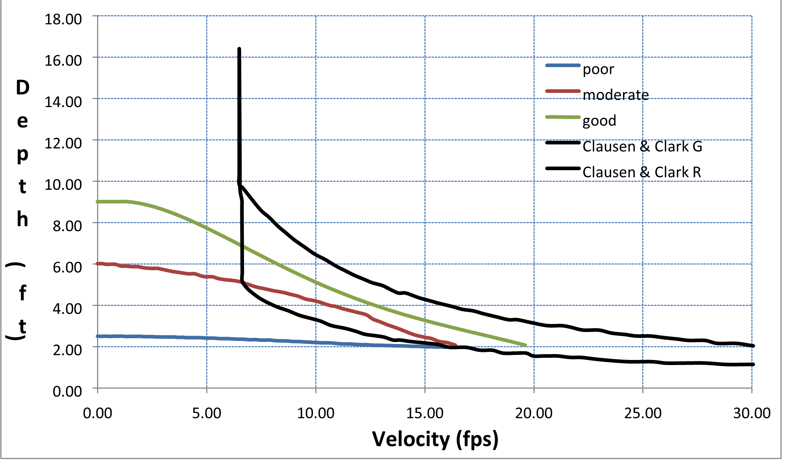

*Figure 66.
Vulnerability Curves. (Pilotti et al., 2016).*

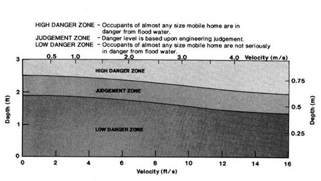

*Figure 67.
Vulnerability Curve for Mobile Homes (BOR, 1988).*

.. image:: img/Chapter4/Chapte018.jpg

*Figure 68.
Vulnerability Curves for Buildings with a Foundation (BOR, 1988).*

In the work of Pilotti et al (2016), a conservative approach was taken to generate the depth for a given flood velocity that would cause the building
to collapse.
This line is expressed as a polynomial equation with depth as a function of velocity which predicts the maximum flow depth (threshold depth) above
which the building is presumed to fail (Figure 69).

.. image:: img/Chapter4/Chapte019.png

*Figure 69.
Vulnerability Curve for a Masonry Building (Pilotti et al., 2016).*

Plotting all three vulnerability curves (including the 2 BOR curves) on the same graph reveals that a masonry building is predicted to be less
susceptible to collapse (Figure 70).
The three vulnerability curves have been interpreted as poor or highly susceptible to flood collapse (mobile homes), moderate for buildings with
foundations, and good for building with more substantial construction.
A fourth curve (Clausen & Clark, 1990) was recommended by Pilotti et al.
(2016) (Figure 70 black lines).
According to Clausen & Clark (1990) building collapse is not predicted for a velocity less than 6 fps.
The Clausen & Clark black lines in Figure 70 constitute a range of hydraulic values depending on construction materials and methods, but only the
lower curve is applied in the FLO-2D model.

*Figure 70.
Vulnerability Curves for Building Subject to Collapse.*

The vulnerability curves for the BOR mobile homes and buildings with foundations were regressed by digitizing Figure 67 for the delineation between
the High Danger and the

Judgment Zones.
These curves should be considered as general guidelines for the potential for a building to collapse during a flood event.
More research could define a series of vulnerability curves for different types of construction.

Implementation of the Building Collapse in the FLO-2D Model

The polynomial equations relating the threshold depth for a building collapse as function of velocity for the four vulnerability curves shown in
Figure 68 has been implemented in the FLO2D model.
There are two methods for initiating the building collapse routine: 1) Create the BUILDING_COLLAPSE.DAT file consisting of the grid element; and 2)
Assigning negative ARF values.
In the first method, the vulnerability curves (1-poor, 2-moderate, 3-good and 4-Clausen

& Clark upper curve) from Figure 68 includes a global curve and spatial variable curve assignments.
In the file, Line 1 is a global vulnerability curve assignment which is superseded by the individual grid element vulnerability curves.
If a building consists of multiple grid elements, each element must have a vulnerability curve assignment to collapse the entire building.
The global vulnerability curve value could be zero.
A portion of a typical BUILDING_COLLAPSE.DAT file is follows:

 0            Global Vulnerability Curve

 2

 6756 1

 6756 1             Grid element vulnerability curve (poor)

 6756 2             Grid element vulnerability curve (moderate)

 6756 3             Grid element vulnerability curve (good)

 6756 4             Grid element Clausen and Clark

Assigning a nonzero value to the global vulnerability curve would initiate potential building failure for any of the buildings in the model.

The building collapse routine can also be activated by assigning a negative value to a completely blocked ARF value or to partially blocked ARF values
as shown in the list below from an ARF.DAT file.
The grid elements in red are assigned a negative value to assess the potential for collapse.
This can be done in the FLO-2D graphical editor QGIS.
For this case, the upper Clausen & Clark (1990) is applied.

   ARF.DAT File Example

   T 1450

   T 1451

   T -1452

   T -1453

   T 1454

   T 2502

   T 3818

   T -3861

   T -4435

   T 4766

   46 0.10 0.00 0.50 0.00 0.00 0.00 0.50 0.00 0.00

   68.0.00 0.00 0.00 0.00 0.00 0.00 0.00 0.00 0.50

   69.0.30 0.00 0.00 0.00 0.50 0.00 0.00 0.00 0.00

   119.0.40 0.50 0.70 0.00 0.00 1.00 0.00 0.00 0.00

   120.0.00 0.00 0.00 0.50 0.00 0.00 1.00 0.00 0.00

   142.0.20 0.20 0.00 0.00 0.70 0.00 0.00 0.00 1.00

   143.0.00 0.00 0.00 0.20 0.00 0.00 0.00 1.00 0.00

   161.-0.50 0.00 0.00 0.00 0.00 0.00 0.00 0.00 0.00

   162.-0.50 0.70 0.20 0.00 0.00 1.00 0.00 0.00 0.00

   163.-0.10 0.00 0.00 0.70 0.00 0.00 1.00 0.00 0.00

   182 0.30 0.00 0.00 0.00 0.00 0.00 0.00 0.00 0.00

   185 0.00 0.00 0.00 0.00 0.20 0.00 0.00 0.00 1.00

A portion of building or the entire building can be assigned the collapse trigger (negative ARF value).
For a complete collapse of the building that encompasses several elements, all the designated building cells must be assigned a negative ARF value.
When the flow depth exceeds the tolerance value (TOL), the predicted flow velocity upstream of the building is used in the building collapse equation
to predict the threshold collapse depth.
In Figure 71, the building (shown in red) encompasses the entire grid element, and the flooding is coming from the North direction (top of the page).
The velocity used to compute the building collapse threshold depth is shown by the red arrow as the velocity from grid element 222 to grid element 221.
If the flood flow depth exceeds the threshold depth for grid element 221, the ARF value in the building element is reset to zero (ARF = 0.0) for the
next computational timestep and the flow can go through the building element.
The negative ARF values in the ARF.DAT file can be combined during the same simulation with those in the BUILDING_COLLAPSE.DAT file.

.. image:: img/Chapter4/Chapte020.jpg

*Figure 71.
Building (red square) is Flooded from the North Direction.*

A conservative approach is taken to predict the potential collapse of buildings.
Based on vulnerability curves of depth versus velocity, when the computed threshold depth is exceeded by flood flow depth associated with a predicted
velocity, the building area reduction factor ARF value is reset to zero enabling the flow to go through the grid element and fill it with flood
storage.
The building collapse routine is triggered by assigning grid element building vulnerability curves in BUILDING_COLLAPSE.DAT or by assigning a negative
ARF values for either a totally blocked or partially blocked grid element.
In the future other building vulnerability curves to cover an expanded matrix of building types can be considered.

Predicting Alluvial Fan Channel Avulsion
---------------------------------------------

Avulsion of alluvial fan channels depicts the rapid abandonment of one channel and the formation of a new channel with a steeper slope.
Fuller (2012) defines avulsion as the process by which flow is diverted from an existing channel to a new water course.
Channel avulsion is generally in response to two factors: 1) Sediment deposition or channel aggradation; and 2) Availability of a steeper slope in an
alternative downslope direction (Schumm, 1977).
Channel avulsion can also occur with the headcutting of an incised channel (sometimes referred to as channel piracy).
A more extensive discussion of alluvial channel avulsion is presented in Fuller (2012).

Channel avulsion involves complex sediment transport processes that are difficult to predict with a flood routing model.
The physical process of sediment scour and deposition by size fraction is impossible to predict with any accuracy on a channel reach basis, in part,
because of the unknown volumes of different sediment sizes in the upstream watershed.
Alluvial fan channel avulsion is often associated with hyperconcentrated sediment flows (mud and debris flow) frontal waves and surges.
These frontal waves, surges, or just high concentrations of coarse sediment deposit in channel at constrictions, break-in-slopes, or other channel
variations and partially fill or plug the channel, forcing the flow overbank and initiating the scour or incision of a new channel down a steeper
slope.

The area of inundation for alluvial fan flooding has been predicted by the FEMA FAN probabilistic model (FEMA, 2003) using an avulsion method
modification.
This is a simplistic model that has several limitations and is not recommended for studies or mapping where a realistic evaluation of the potential
area of inundation or fan flood hydraulics is required.
This model, however, has been used by FEMA to generate Flood Insurance Study (FIS) maps with alluvial fan flood hazard zones.

The Flood Control District of Maricopa County (FCDMC) requested a simplified avulsion routine be implemented in the FLO-2D model.
Several FLO-2D model enhancements have been supported by the FCDMC.
It was proposed that alluvial fan avulsion routine be developed for the FLO-2D model to assess the channel conveyance capacity on the area of
inundation.
The FCDMC outlined a methodology to guide the channel avulsion development.

FCDMC Simplified Channel Avulsion Approach

The FCDMC proposed simplified channel avulsion analysis was presented as having three parts.
Part 1 was the channel overtopping assessment; Part 2 was the channel avulsion assessment and Part 3 was to delineate the flood hazard associated with
the channel avulsion.
To summarize FCDMC channel avulsion concept, the focus is to simulate channels from a fan apex area that have the potential to overtop and avulse at
predicted locations resulting an altered area of inundation.
FCDMC provide the following brief outline to accomplish this.

The FCDMC delineated different distributary channels starting with the primary or feeder channel at an alluvial fan apex (Figure 72).
The first part of the analysis is to identify the locations for channel overtopping along the feeder channel and the first-level branch channels for
100-year flood where the point of avulsion is the first-level bifurcation point.
The FLO-2D model will be used to estimate the channel overtopping locations.

.. image:: img/Chapter4/Chapte021.png

*Figure 72.
Alluvial Fan Distributary Channel Definition for Avulsion Analysis (from FCDMC, 2014).*

In the conceptual outline, FCDMC acknowledges the dependency of channel avulsion on sediment deposition indicating major channel avulsion usually
occurs during a large flood after previous small floods fill the channel with sediment deposits on the order of 1 to 2 ft.
Often sediment deposition has propensity to occur in bends, upstream of constrictions or break-inslope, or in the presence of obstructions or
increased roughness.
While the role of sediment transport in channel avulsion is understood and could be simulated with the FLO-2D model, the FCDMC proposed to undertake a
simpler approach to avoid the complexity associated with predicting sediment deposition.
FCDMC avulsion model concept was to:

    a. Build a 25-ft or smaller grid system for the 100-year flood and run the model where the grid element size would essentially constitute the channel
       cross-section.

    b. Modify the channel topography (cross-section) to account for the sediment deposition.

    c. Run the FLO-2D model and identify the channel overtopping locations.

    d. Predict the peak discharge at each overtopping location.
       This would provide the basis for the secondary channel.

To estimate the channel width and depth based on the peak discharge, FCDMC propose to apply channel width and depth estimates based on empirical
regime theory shown in Figure 73 and Figure 74 (USACE, 1994).
FCDMC indicates that if the channel depth is greater than or equal to 2 feet, then the newly formed channel is a major channel avulsion and the area
of inundation is an active alluvial fan area.
By assigning a representative sediment size fraction for the alluvial fan and the estimated peak discharge, Figure 73 and Figure 74 (provided FCDMC),
can be used to estimate the channel width and depth.

.. image:: img/Chapter4/Chapte022.png

*Figure 73.
Channel Forming Depth versus Channel Forming Discharge (from USACE, 1994).*

.. image:: img/Chapter4/Chapte023.jpg

*Figure 74.
Channel Forming or Bank Full Discharge (from USACE, 1994).*

The final task is to assess the area of inundation.
It was observed by FCDMC that since the newly formed channel caused by avulsion will impact a new area of the fan, further channel avulsion downstream
may occur downstream, and this may require several model iterations to delineate the entire fan area of inundation.

Implementing the FCDMC Channel Avulsion Approach into FLO-2D

Concepts and Assumptions
~~~~~~~~~~~~~~~~~~~~~~~~~~~~~

The original recommendation was to use small FLO-2D grid elements to represent the channel.
This approach has several limitations:

    - The premise of channel avulsions is based on a loss of channel conveyance capacity.

    - The channel will have unique width to depth ratios and roughness which would be obscured by the uniform floodplain elements.

    - Overbank flooding cannot be simply assessed using depressed floodplain elements because of the multi-directional flow.

The proposed avulsion method is based on computed widths and depths from Figure 73 and Figure 74 or the avulsed channels that cannot be simply
represented by the floodplain element geometry.
Using the floodplain elements on steep slopes does not limit the unconfined flow in the FLO-2D model to a singular direction because the upstream
element water surface elevation may exceed the downstream cell elevations allowing the flow to distribute to all the downstream contiguous elements.
It was apparent that to mimic channel avulsion, it is necessary to simulate channel flow in the FLO-2D model.
It is fortunate, however, that the FLO2D model has a distributary channel component referred to as “multiple channels”.

The purpose of the multiple channel flow component is to simulate the overland flow in small channels rather than as overland sheet flow.
Overland flow is often conveyed in small channels, even though they occupy only a fraction of the potential flow area.
This is referred to as rill and gully flow.
Schumm, et al.
1984, distinguish between rills and gullies as follows.
Rills are an ephemeral small (smallest) channel formed by runoff and may be seasonal in nature and the result of overland flow.
A gully is relatively deep channel formed by recent erosion where no previously defined channel existed.
On alluvial fans, these two types of channels typically form the distributary system downstream of the fan apex and can have the same physical
processes associated with avulsion, albeit to different scales.
These channels should be distinguished from the entrenched or incised primary channel near the fan apex leading out of the watershed canyon mouth.

Simulating rill and gully distribute flow concentrates the discharge and may improve the timing of the runoff routing.
The multiple channel routine calculates overland flow as sheet flow within the grid element and flow between the grid elements is computed as rill and
gully flow.
No overland sheet flow is exchanged between grid elements if both elements have assigned multiple channels.
The gully geometry is defined by a maximum depth, width, and flow roughness.
The multiple channel attributes can be spatially variable on the grid system and can be edited with the GDS program.

If the gully flow exceeds the specified gully depth, the multiple channel can be expanded by a specified incremental width.
This channel widening process assumes these gullies are alluvial channels and will widen to accept more flow as the flow reaches bankfull discharge.
There is no gully overbank discharge to the overland surface area within the grid element.
The gully will continue to widen until the gully width exceeds the width of the grid element, then the flow routing between grid elements will revert
to sheet flow.
This enables the grid element to be overwhelmed by flood flows.
During the falling limb of the hydrograph when the flow depth is less than 1 ft (0.3 m), the gully width will decrease to confine the discharge until
the original width is again attained.
The user can assign the range of slope where the multiple channel widening is computed.

Low Impact Development (LID) Modeling
------------------------------------------

Low impact development (LID) flood retention can be assessed with the FLO-2D model using a sink volume assignment or a spatially variable tolerance
value (TOL) on individual cells.
Sink volume is runoff or flood storage that never leaves the grid element and is assigned in the LID_VOLUME.DAT file by the user in ft\ :sup:`3` or m\
:sup:`3`.
Until the sink volume is filled there is **no flow** depth on the grid element.
The TOL parameter was originally designed to represent a flow depth below which no discharge is shared between two grid elements.
The primary difference between the two methods is that the TOL approach leaves a flow depth whereas the sink volume method does not.
For a large flood event, typically a TOL value of 0.1 ft (0.03 m) is assigned so that there is no exchange discharge for negligible depths.
For hydrology models, the TOL parameter represents the physical process of depression storage.
Depression storage TOL is a shallow depth that remains on the grid system after the rainfall had ceased and is a portion of the initial abstraction
(depression storage + interception) that must be filled for runoff to initiate.
The initial abstraction cannot be more than the TOL value.

The concept of LID is that a new residential or commercial site development would be required to design flood retention storage into the site
construction.
This may include bioretention, green roofs, rain gardens, permeable pavement, drainage disconnection, swales, and on-site storage (Figure 75).
Sink volume or TOL values would be assigned to represent the composite LID techniques on a given grid element (Figure 76).
Depending on the site development, multiple grid elements may represent an individual house lot or a commercial parking lot.
Different grid elements may represent different LID techniques.
The volume of on-site retention storage can be directly assigned in the LID_VOLUME.DAT file or assessed by multiplying the lot surface area by the
retained flow depth (TOL value).

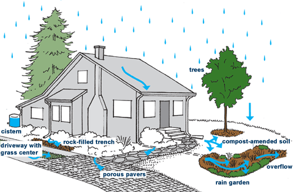

*Figure 75.
Low Impact Development Water Retention.*

(Seattle Public Utilities, Rainwise Program,

http://www.seattle.gov/util/MyServices/DrainageSewer/Projects/GreenStormwaterInfrastructure/Rain Wise)

.. image:: img/Chapter4/Chapte025.jpg

*Figure 76.
FLO-2D Grid Element LID Concept – Spatially Variable TOL Elements (brown).*

(http://www.lowimpactdevelopment.org)

FLO-2D Model LID Tools

*LID Sink Volume Method*
The sink volume can be evaluated by the flood retention feature (e.g., pond or cistern volume).
The volume may be dictated by site development specification or regulation.
In any case, once the flood retention volume is known, it can be assigned directly to the grid element or divided over several grid elements.
No overland flow in or out of the LID cell will occur until the sink volume is exceeded.
Either rainfall or flood inflow to the grid element will fill the sink volume.

The sink volume can be assigned in the QGIS using a shapefile or polygon to select a cell or cells.
The volume (ft\ :sup:`3` or m\ :sup:`3`) is saved in a LID_VOLUME.DAT file in the following format:

Grid Element     Volume

14821            60.0

14822            70.0

14823            70.0

17601            40.0

17602            40.0

18258            100.0

18325            100.0

The LID Volume method is assigned in QGIS using the Tol Spatial Tool.
In this case, the volume per grid element must be calculated.
Any grid element with a centroid inside a TOL Spatial polygon will be added to the data file.
LID_VOLUME.DAT is the required data file so if QGIS writes the data to TOL_SPATIAL.DAT, rename that file.

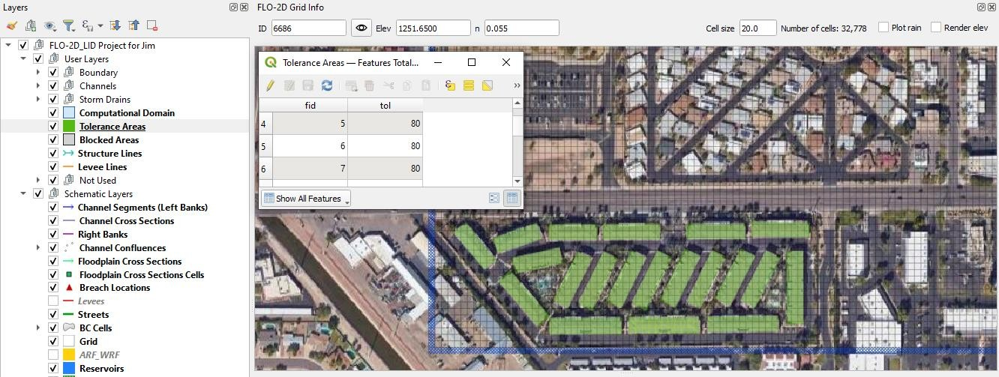

*Figure 77.
LID Volume Tool.*

*TOL Spatial Method*

The primary difference in the LID spatially TOL spatial method is that the surface storage is represented with a depth instead of a volume.
It also has a water surface that contiguous grid element must consider when establishing flow patterns and discharge exchange.
It may cause flow to go around an LID element instead of through it.

There has been no change in how the TOL value is applied in the model code.
The TOL depression storage must be filled before flow is exchanged with a neighbor grid element (Figure 78).
Flow depth less than or equal to the TOL value will remain on the grid element after the simulation is complete.
The typical range for TOL when used for depression storage only is:

0.004 < TOL <= 0.1

The range for spatially variable TOL assignment when LID is added to depression storage for flow depths that may reach 5.0 ft (1.5 m) or higher.

.. image:: img/Chapter4/Chapte027.png

*Figure 78.
Global TOL.*

The global assignment of the TOL value (TOLGLOBAL) is still required in the first line (first parameter) in the TOLER.DAT.
At the start of a FLO-2D model, the TOLGLOBAL value is assigned to all the grid elements.
This value is superseded by the spatially variable TOL(i) assignment for each grid element listed in the file TOLSPATIAL.DAT (Figure 79).
This file has the same format as the LID_VOLUME.DAT file.

.. image:: img/Chapter4/Chapte028.jpg

*Figure 79.
Spatially Variable TOL Value Format in TOLSPATIAL.DAT.*

The grid element TOL values can be assigned by polygon selection (Figure 80) by shape file polygon in the QGIS.
The data is saved to TOLSPATIAL.DAT file with grid element number and a TOL value in the two columns (Figure 79).
If there are multiple LID techniques being applied to a given element, then guidelines or a reference table could be developed to assess a composite
LID TOL value.

.. image:: img/Chapter4/Chapte029.jpg

*Figure 80.
FLO-2D Plugin Spatially Variable TOL Assignment.*

Test Case and Results
~~~~~~~~~~~~~~~~~~~~~~~~~~~~~

A FLO-2D model project was created with four areas of sink storage volume.
The model has 4 inches of total rainfall distributed in a 2 hr storm.
displays areas of retention with the volume (ft3) identified.
This is volume that simulated flow into a cistern or pervious pavement or was stored in a garden pond.

.. image:: img/Chapter4/Chapte030.jpg

*Figure 81.
LID Retention Volume and Depth Grid Elements.*

The FLO-2D graphic display of rainfall on grid are shown on Figure 82 - Figure 84.
The early results show no depth on grid for the LID cases.

.. image:: img/Chapter4/Chapte031.jpg

*Figure 82.
Early Rainfall No LID.*

.. image:: img/Chapter4/Chapte032.jpg

*Figure 83.
Early Rainfall with LID Volume.*

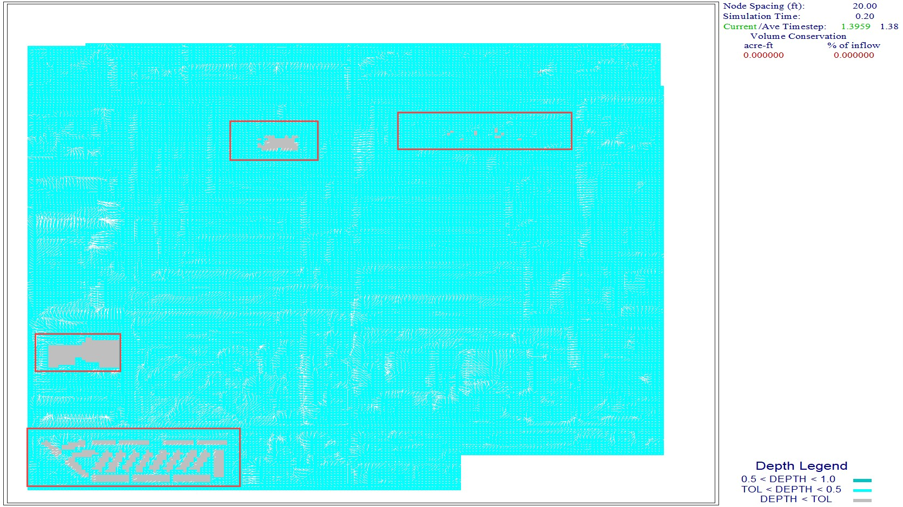

*Figure 84.
Early Rainfall with TOL Spatial Depth.*

The SUMMARY.OUT (Figure 85) file reveals that about 1.4 acre-ft were retained in LID storage out of a total of 73.6 acre-ft of rainfall volume on the
project area.
It is also noted that the TOL volume changed for the TOL Spatial Volume.

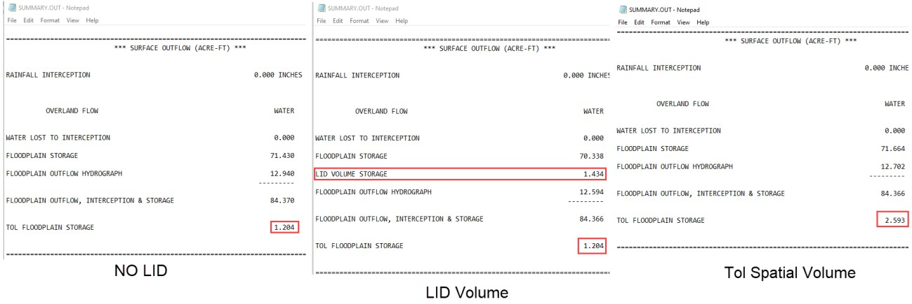

*Figure 85.
Examples of SUMMARY.OUT File Test Cases.*

Two methods for analyzing LID designs are available in the FLO-2D model: 1) A storage retention volume method; and 2) A surface retention depth method
using spatially variable TOL values.
Both methods are activated by a data file with the same format: LID_VOLUME.DAT and TOLSPATIAL.DAT respectively.
No other triggers, switches or data modifications are necessary.

The primary difference between the two methods is that the volume retention represents a sink, and the surface storage method inputs the volume as a
flow depth and water surface elevation that is assimilated during the flood routing.
The surface storage method may result in flow going around the LID element if the water surface is high.
This method might be used for surface features that create ponding and the user may need to convert volume storage to a flow depth by dividing by the
surface area.
Both methods would have to be tested to determine the impacts on infiltration, storm drain capacity or downstream flooding.

Building Rainfall Runoff
-----------------------------

Building Runoff

It is a FLO-2D model option to simulate rainfall runoff from buildings.
Buildings are represented by Area Reduction Factors (ARFs) and Width Reduction Factors (WRFs) in the FLO2D model.
ARF values remove surface area from potential water storage on a grid element.
WRF values block flow directions between contiguous grid elements.
The WRF values are not utilized in estimating rainfall runoff from buildings.
Figure 86 displays buildings on a FLO-2D model with 25 ft grid elements.
In this figure, the buildings may occupy a portion of a grid element, the entire grid element, or multiple grid elements.
The ARF and WRF values can be assigned automatically using shape file interpolation with the FLO-2D Plugin.

.. image:: img/Chapter4/Chapte035.jpg

*Figure 86.
Buildings on a 25 ft Grid System (red lines indicate walls represented as levees).*

There are two options to simulating rainfall runoff from buildings.
For the first option, the user assigns the building ARF values.
The building may be completely blocked (ARF =1.) or partially blocked (ARF < 1.).
When the rainfall occurs on a grid element with a partial ARF value, the rainfall on the entire grid element (including the portion with the assigned
building ARF value) is accumulated on the remaining grid element surface area not covered by the building.
The building portion of grid element surface area is considered impervious and sheds rainfall but does not store water.
This accumulated rainfall depth (> TOL value) is then available for routing to contiguous grid elements.
If the grid element surface area is totally blocked and has no storage (ARF = 1.), then there is no rainfall runoff from this grid element.
In this case, it is assumed that the rainfall goes to the building downspout, into the storm drain system and off the model.
For this option: IRAINBUILDING = 0 (RAIN.DAT file, line 1, second variable).

For the second option, the rainfall on completely blocked cells constitutes runoff from the building to the surface area.
Rainfall on the totally blocked grid elements (ARF = 1) is assumed to be routed through the building drain system to the surface area.
The rainfall is accumulated on the grid element surface area and is passed to contiguous grid elements within the building and is then exchanged with
cells outside the building as runoff.
Figure 87 shows the same buildings in Figure 86 represented by the ARF values.
The gray grid elements are completely blocked (ARF =1) and the yellow elements are partially blocked (ARF < 1).
The rainfall on an interior grid element (e.g. red block of elements in Figure 87), is routed to the building boundary based on grid element elevation
(ground topography) and roughness (Manning’s nvalue).
This option is assumed to be representative of the shallow flow on a building roof being routed through the building’s drainage system to the
downspout.
The user can control the drainage direction by adjusting the grid element elevations inside the building.
This option requires that IRAINBUILDING = 1 in the RAIN.DAT file (line 1, second variable) be assigned.
Totally blocked elements are gray (ARF = 1) and Partially Blocked elements are in varying shades of yellow.

.. image:: img/Chapter4/Chapte127.png

*Figure 87.
Assigned ARF Values to the Buildings.*

There are several assumptions for the rainfall runoff from the buildings:

    - When IRAINBUILDING = 1, the rainfall runoff will only be routed between completely blocked elements within the building.

    - The routing is based on the internal building topography (grid element elevation).

    - The flow roughness (Manning’s n-value) for the completely blocked buildings is 0.03 (hard coded in the model).

    - Based on the eight potential flow directions, the flow width for a blocked element (ARF = 1) is 0.41412 \* grid element side (i.e.
      WRF = 0.).

    - The flow from inside the building to outside of the building is based on a hard-coded head difference in the water surface elevation of 0.5 ft (0.15
      m).
      The actual water surface and ground elevations across the building walls are ignored in the flow computation.

    - The flow can only be exchanged from inside to outside the building.
      No flow is permitted from outside to inside the building.

    - The flow depth must exceed a TOL = 0.0042 for flow to be exchanged between interior building elements.
      This represents ponded water storage and is hard coded in the model.

The following example project (Figure 88) has a large building on a steep alluvial fan slope to the north (top of the page).
To simulate runoff from the building to the fan surface IRAINBUILDING = 1.

.. image:: img/Chapter4/Chapte036.jpg

*Figure 88.
Location of a Large Building.*

The rainfall results in flooding on the alluvial fan with the floodwave moving from south to north (towards the top of the page).
The building is in a swale and takes a direct hit from the flooding.
Figure 89 shows the flooding (maximum depths - dark blue grid elements) piling up on the upstream side of the building (south side of the building)
and flowing to the west to get around the building.
Along the building south wall, the predicted interior maximum depths are less than the tolerance value (gray cells).

.. image:: img/Chapter4/Chapte128.png

*Figure 89.
Maximum Flow Depths Inside the Building.*

The rainfall runoff flows inside the building to reach the north wall and is debouched from the building.
The building is outlined in red.
Figure 90 shows the maximum velocities on the alluvial fan and indicates that the flow is moving inside the building.
The flow is routed in the building interior based on the topography and roughness until it reaches the north side and then crosses to the outside of
the building (Figure 91).
This example illustrates that the flooding outside the building will progress around the building and the rainfall runoff on the building roof leaves
the building.
It possible for the flow to leave the building in any direction.
The building is outlined in red.

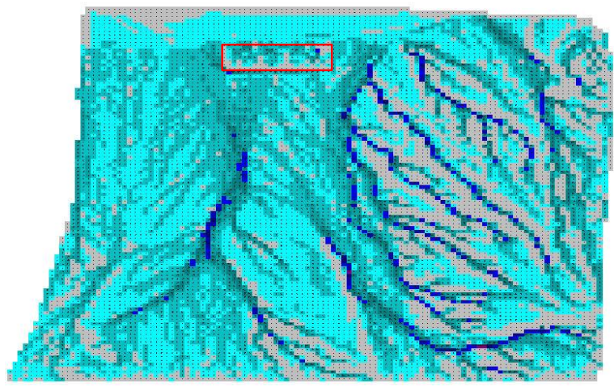

*Figure 90.
Maximum Flow Velocities on the Alluvial Fan.*

.. image:: img/Chapter4/Chapte130.png

*Figure 91.
Maximum Flow Velocities.*

Downspout

The building location selected for this project is shown in Figure 92.
The red lines in these figures are levees and represent a parapet wall surrounding the entire building roof.
On the project building, the levee elements encompass the blocked building (ARF = 1) elements.
The completely blocked elements represent the building roof.
The roof grid element elevations are usually assigned a ground elevation.
These building elevations can be edited to represent the roof.
The roof elements can be selected together and assigned a uniform elevation representing a flat roof (Figure 92).
The parapet wall is simulated by selecting the appropriate grid elements and assigning the levee grid element direction and crest (wall elevation) as
shown in the Figure 94 levee edit dialog box.
Attention must be paid to the selection of all the potential levee obstruction flow directions to completely contain the rainfall storage on the
building roof.
The parapet wall is shown as the red levee in Figure 92 representing the roof boundary.
The roof elevation was assigned as approximately 20 ft higher than the ground elevation.
This data is enough to simulate rainfall storage on a flat roof.
This is one of the test simulations.

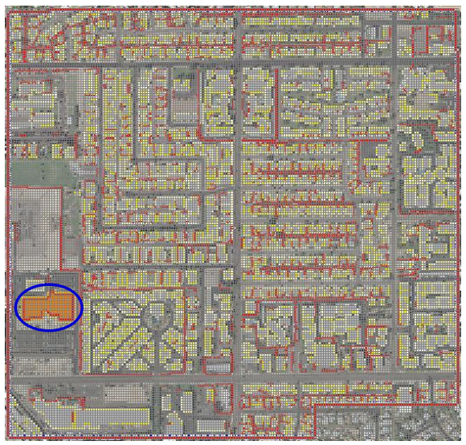

*Figure 92.
Project Building Location (in blue oval).*

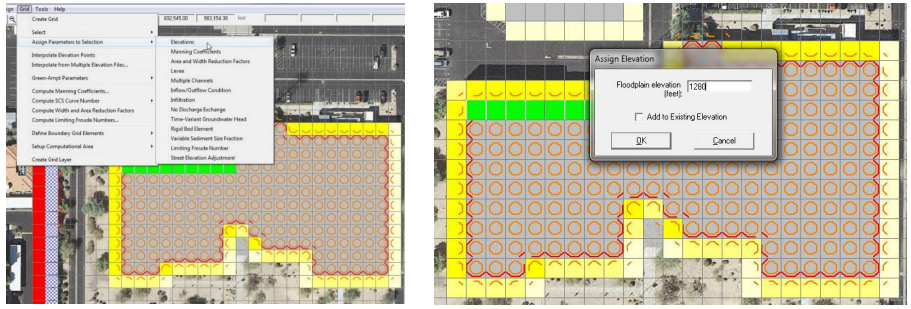

*Figure 93.
Building Roof Element Elevation Editing.*

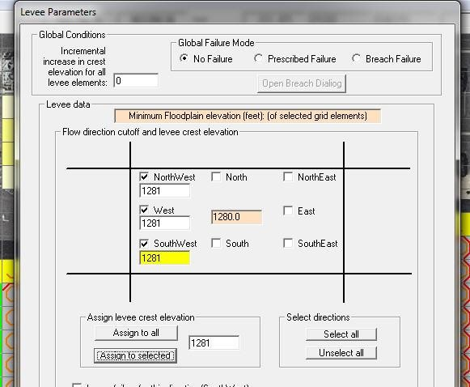

*Figure 94.
Grid Element Levee Crest Elevation Editing.*

Adjust Roof Slope
~~~~~~~~~~~~~~~~~~~~~~~~~~~~~

A sloped roof can be established by modifying the roof elevations.
Individual grid element elevations can be edited by double clicking a given cell and using the elevation field (Figure 95).
Grid element elevations can be reset in corners and along the roof borders to establish some cornerstone elevations for further editing.

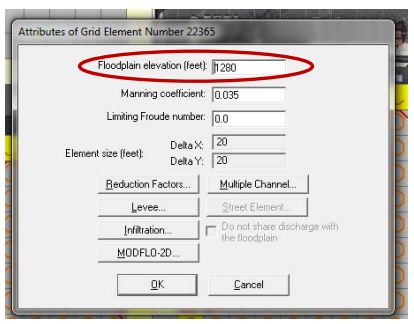

*Figure 95.
Grid Element Elevation Editing.*

To establish a sloped roof, select a line of grid elements between two cornerstone elements with known roof elevations, then choose the street
elevation editor (Figure 96).

.. image:: img/Chapter4/Chapte038.jpg

*Figure 96.
Roof Element Elevation Editing Command.*

Select the *Elevation Adjustments Tab* shown in Figure 97 below.
This will activate a dialog box window which will enable a linear slope interpolation between the two selected cornerstone elements (Figure 98).
Figure 99 displays the roof element elevations prior to interpolation.

.. image:: img/Chapter4/Chapte039.jpg

*Figure 97.
Roof Element Elevation Editing Tab.*

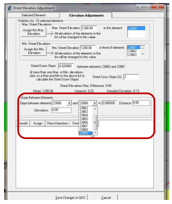

*Figure 98.
Selecting the Two Cornerstone Grid Elements to Interpolate the Roof Slope.*

.. image:: img/Chapter4/Chapte040.jpg

*Figure 99.
Graphic Display of the Roof Element Elevations Between the Two Cornerstone Cells.*

The *Assign* button will complete the interpolation of the roof cell elevations between the cornerstone elements and save the results as shown in
Figure 100.

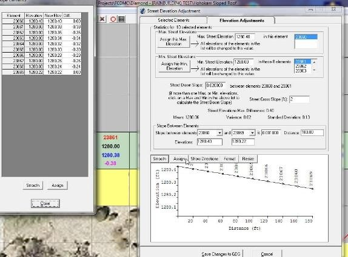

*Figure 100.
Completed Roof Element Elevation Slope Interpolation.*

Downspout Hydraulics
~~~~~~~~~~~~~~~~~~~~~~~~~~~~~

The downspout discharge can be simulated as a hydraulic structure identifying the inlet node on the roof and the outlet node on the ground and
assigning an inlet control rating table.
The inlet control rating table can be based on orifice flow using the equation:

Q = C \* A \* (2.*g*DEPTH)\ :sup:`0.5`

where:

    C = coefficient that ranges from 0.62 to 0.72

    A = flow area of the opening

    g = acceleration due to gravity (32.2 fps or 9.81 m/s)

    DEPTH = flow depth on orifice (cell flow depth)

The hydraulic structure data file is organized as follows:

HYSTRUC.DAT file example

S Downspoutname 0 1 22365 21991 0 0 0 0

 T     0     0

 T     0.25 1.0

 T     0.5  2.0

 T     1    3.5

 T     5    5.5

In the S-line above, the data includes a downspout name, floodplain or channel element (floodplain = 0), rating curve or table (rating table = 1),
inlet and outlet cell number, and 4 additional controls that not required.
The rating table assignment should begin with zero depth and zero discharge and the remaining T-lines are depth and discharge can be based on the
above orifice equation.
This data can be entered graphically in the GDS.

.. image:: img/Chapter4/Chapte042.jpg

*Figure 101.
Downspout Hydraulic Structure as Brown Elements in the Upper Right Corner.*

The hydraulic structure editor dialog window for the downspout inlet and outlets shown in Figure 101 is displayed in Figure 102.
Note that the downspout inlet and outlet elements do not have to be contiguous.
Any number of downspouts can be simulated in any location on the building roof.

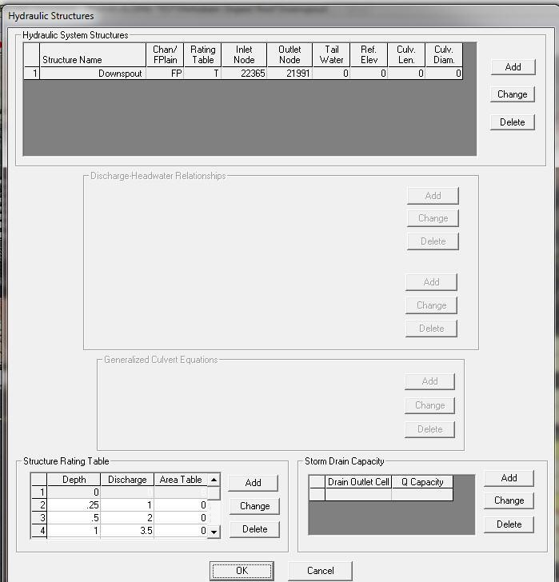

*Figure 102.
Hydraulic Structure Dialog Box with Entered Downspout Data.*

Verification Testing of the Building Roof Runoff Enhancements
~~~~~~~~~~~~~~~~~~~~~~~~~~~~~~~~~~~~~~~~~~~~~~~~~~~~~~~~~~~~~~~~~~~~~~~~~~~~~~~~~~~~~~~

The building runoff enhancements were tested in two projects.
Since both projects showed an identical response on different scales, only the results of the small scale, more detailed project will be presented.
Several tests were developed to verify the roof runoff computations.
These include:

    - Rainfall accumulation on a flat roof

    - Rainfall runoff movement on sloped roof

    - Parapet wall overtopping

    - Downspout discharge to the ground

In the first test, three inches of rain is applied to the project in two hours.
The project has buildings, walls, infiltration and storm drains.
To focus on the building with the assigned downspout, the storm drain component was turned off.
Only the building discussed in this document will be reviewed.
The simulation was terminated after the rainfall ended after two hours.
The flat roof elevation was 1280.00 and after 2 hours, the computed final roof flow depths results in a uniform water surface elevation of 1280.25 on
all the elements since there is no outlet (Figure 103) using the FLO-2D Maxplot map program).

The sloped roof test is designed to predict the rainfall runoff flow to the downspout.
The downspout is in grid element 22365 (upper right corner of the building NE) and the entire roof slopes to this location.
Most of the roof has a slope of 0.001 or 0.02 ft per 20 ft grid element.

The slope in the final few grid elements in the NE corner of the roof are a little steeper.
In this case, the parapet walls are one foot high and since the maximum water surface elevation does not exceed 1281, there is no flow overtopping the
parapet walls.
The maximum water surface elevation is shown in Figure 104.
Note that all the roof maximum water surface elevations are equal, but the maximum flow depths vary with the roof elevation and the deepest depth is
predicted at the downspout element.
The downspout outlet element 21990 has the same water surface elevation and small depth in both simulations.

.. image:: img/Chapter4/Chapte044.png

*Figure 103.
Total Rainfall (3 inches) Accumulated on a Flat Roof.*

Cells 22365 and 21990 will be the downspout inlet and outlet respectively

.. image:: img/Chapter4/Chapte135.png

*Figure 104.
Maximum Flow Depth and Water Surface Elevation on a Sloped Roof.*

(Compare the Inlet and Outlet Maximum WS Elevations)

In the third simulation, the parapet wall was lowered by 0.75 ft to 1280.25 in the LEVEE.DAT file for the downspout inlet grid element 22365.
During the simulation the maximum water surface elevation exceeds the parapet wall elevation for the downspout inlet element (22365 NE flow direction
5) and overtops the wall (Figure 105).
Compare this grid element maximum water surface elevation and flow depth in Figure 104 and note that they are lower because the parapet wall is
overtopped and some rainfall storage is discharged to the ground.
Any number of parapet wall cells (levee elements and the blocked direction) can be overtopped.

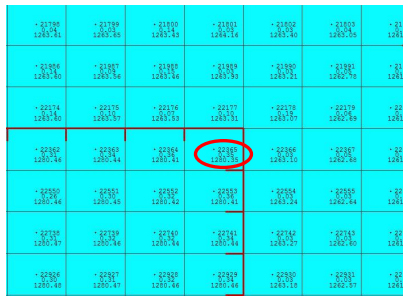

*Figure 105.
Maximum Flow Depth (Sloped Roof with Parapet wall Being Overtopped).*

The overtopping discharge is reported below from the file LEVOVERTOP.OUT.
The discharge is reported as negative representing flow out of the grid element.

LEVEE OVERTOPPING DISCHARGE (CFS OR CMS): POSITIVE DISCHARGE REPRESENTS INFLOW TO NODE

LEVEE ELEMENTS WITH NO OVERTOP DISCHARGE ARE NOT REPORTED

DISCHARGE IS REPORTED BY DIRECTION

GRID ELEMENT TIME TOTAL DISCHARGE N E S W NE SE SW NW

22365  3.30 -0.02 0.00 0.00 0.00 0.00 -0.02 0.00 0.00 0.00

       3.40 -0.06 0.00 0.00 0.00 0.00 -0.06 0.00 0.00 0.00

       3.50 -0.09 0.00 0.00 0.00 0.00 -0.09 0.00 0.00 0.00

       3.60 -0.17 0.00 0.00 0.00 0.00 -0.17 0.00 0.00 0.00

       3.70 -0.23 0.00 0.00 0.00 0.00 -0.23 0.00 0.00 0.00

       3.80 -0.36 0.00 0.00 0.00 0.00 -0.36 0.00 0.00 0.00

       3.90 -0.54 0.00 0.00 0.00 0.00 -0.54 0.00 0.00 0.00

       4.00 -0.70 0.00 0.00 0.00 0.00 -0.70 0.00 0.00 0.00

       4.10 -0.69 0.00 0.00 0.00 0.00 -0.69 0.00 0.00 0.00

       4.20 -0.72 0.00 0.00 0.00 0.00 -0.72 0.00 0.00 0.00

       4.30 -0.74 0.00 0.00 0.00 0.00 -0.74 0.00 0.00 0.00

       4.40 -0.75 0.00 0.00 0.00 0.00 -0.75 0.00 0.00 0.00

       4.50 -0.75 0.00 0.00 0.00 0.00 -0.75 0.00 0.00 0.00

       4.60 -0.75 0.00 0.00 0.00 0.00 -0.75 0.00 0.00 0.00

       4.70 -0.76 0.00 0.00 0.00 0.00 -0.76 0.00 0.00 0.00

       4.80 -0.78 0.00 0.00 0.00 0.00 -0.78 0.00 0.00 0.00

       4.90 -0.78 0.00 0.00 0.00 0.00 -0.78 0.00 0.00 0.00

PEAK Q    4.92  -0.79

       5.00 -0.78 0.00 0.00 0.00 0.00 -0.78 0.00 0.00 0.00

       5.10 -0.77 0.00 0.00 0.00 0.00 -0.77 0.00 0.00 0.00

       5.20 -0.74 0.00 0.00 0.00 0.00 -0.74 0.00 0.00 0.00

       5.30 -0.72 0.00 0.00 0.00 0.00 -0.72 0.00 0.00 0.00

       5.40 -0.72 0.00 0.00 0.00 0.00 -0.72 0.00 0.00 0.00

       5.50 -0.72 0.00 0.00 0.00 0.00 -0.72 0.00 0.00 0.00

       5.60 -0.70 0.00 0.00 0.00 0.00 -0.70 0.00 0.00 0.00

       5.70 -0.72 0.00 0.00 0.00 0.00 -0.72 0.00 0.00 0.00

       5.80 -0.68 0.00 0.00 0.00 0.00 -0.68 0.00 0.00 0.00

       5.90 -0.66 0.00 0.00 0.00 0.00 -0.66 0.00 0.00 0.00

       6.00 -0.65 0.00 0.00 0.00 0.00 -0.65 0.00 0.00 0.00

The final test simulation combines the sloped roof with a downspout in grid element 22365.
The inlet (red oval) maximum water surface is lowered by the downspout water discharge as shown in Figure 106.
The downspout outlet element 21990 (blue oval) has an increased maximum water surface when compared with Figure 104 and Figure 105.

.. image:: img/Chapter4/Chapte137.png

*Figure 106.
Maximum Flow Depth and Water Surface Elevation.
(Sloped Roof with a Downspout).*

The discharge out of the downspout is reported below from the HYDROSTRUCT.OUT file.

STRUCTURE OUTFLOW DISCHARGE

INFLOW AND OUTFLOW DISCHARGE MAY BE DIFFERENT IF STRUCTURE IS A LONG CULVERT OR IF OUTFLOW

COMBINES MULTIPLE CULVERTS

               OUTFLOW DISCHARGE IS REPORTED AS NEGATIVE

   FLOODPLAIN GRID ELEMENTS TIME (HRS) DISCHARGE (CFS OR CMS)

THE MAXIMUM DISCHARGE FOR: Downspout STRUCTURE NO.1 IS: 0.94 AT TIME: 4.91

            INFLOW NODE: 22365 OUTFLOW NODE: 21990

    0.10 0.00 0.00

    0.20 0.00 0.00

    0.30 0.00 0.00

    0.40 0.00 0.00

    0.50 0.00 0.00

    0.60 0.00 0.00

    0.70 0.00 0.00

    0.80 0.00 0.00

    0.90 0.00 0.00

    1.00 0.00 0.00

    1.10 0.00 0.00

    1.20 0.00 0.00

    1.30 0.00 0.00

    1.40 0.00 0.00

    1.50 0.00 0.00

    1.60 0.00 0.00

    1.70 0.04 -0.04

    1.80 0.07 -0.07

    1.90 0.08 -0.08

    2.00 0.10 -0.10

    2.10 0.13 -0.13

    2.20 0.14 -0.14

    2.30 0.14 -0.14

    2.40 0.15 -0.15

    2.50 0.15 -0.15

    2.60 0.16 -0.16

    2.70 0.16 -0.16

    2.80 0.17 -0.17

    2.90 0.16 -0.16

    3.00 0.16 -0.16

    3.10 0.16 -0.16

    3.20 0.17 -0.17

    3.30 0.17 -0.17

    3.40 0.22 -0.22

    3.50 0.27 -0.27

    3.60 0.34 -0.34

    3.70 0.46 -0.46

    3.80 0.51 -0.51

    3.90 0.64 -0.64

    4.00 0.76 -0.76

    4.10 0.83 -0.83

    4.20 0.86 -0.86

    4.30 0.89 -0.89

    4.40 0.91 -0.91

    4.50 0.91 -0.91

    4.60 0.91 -0.91

    4.70 0.92 -0.92

    4.80 0.93 -0.93

    4.90 0.94 -0.94

    5.00 0.94 -0.94

    5.10 0.93 -0.93

    5.20 0.91 -0.91

    5.30 0.88 -0.88

    5.40 0.87 -0.87

    5.50 0.86 -0.86

    5.60 0.86 -0.86

    5.70 0.85 -0.85

    5.80 0.85 -0.85

    5.90 0.82 -0.82

    6.00 0.79 -0.79

The FLO-2D model simulation of rainfall runoff from building roofs has been modified to allow parapet walls (levees) to store rainfall water, enable
the parapet walls to be overtopped and discharge storm off the roof through a downspout.
The FLO-2D code was edited to create these enhancements and a new executable program was compiled.
The primary revisions involved allowing component interaction with the completely blocked grid elements representing the buildings (ARF = 1).
The three new tools were tested extensively with a flat and sloped roof to validate that:

    - Rainfall was accurately predicted to accumulate on a flat roof;

    - Rainfall runoff was predicted to flow to the lowest cell on a slope roof;

    - Rainfall runoff flowed to the lowest roof cell and overtopped a low parapet wall;

    - Roof storage was discharged through a downspout located at the lowest roof cell.

There are no required data file revisions to use these new building rainfall tools.

Gutter Tool
----------------

The street gutters are designed to convey shallow flow during storm runoff less than or equal to the design discharge without traffic interruption.
Typical curb and gutter cross-sections have a triangular shape created by the cross slope associated with the street or road crown.
Gutter cross slopes can range from flat to 8%.
For the FLO-2D street routing, the triangular shape is assumed to have a 2 percent straight cross slope.
The gutter flow will be exchanged with other upstream and downstream street gutter elements, the sidewalk (which is part of street gutter element),
and other street elements (not having a gutter).
Floodplain flow is exchange with the gutter elements through the sidewalk.
The Dept.
of Transportation Urban Drainage Design Manual (revised 2013) presents a gutter flow capacity equation that is used for computing flow in triangular
channels.
DOT Equation 4.2 is given as:

        Q = (Ku/n) Sx1.67 SL0.5 T2.67

where:

    K\ :sub:`u` = 0.56 in English units n = Manning’s roughness

    Q = discharge (cfs)

    T = flow top width (ft) = d/S\ :sub:`x` where d = flow depth at the curb

    S\ :sub:`x` = cross slope (ft/ft)

    S\ :sub:`L` = street longitudinal slope (ft/ft)

This DOT equation is Mannings equation for normal flow depth (steady, uniform flow) with an additional coefficient of 0.188:

        Q = VA = (1.486/n) d\ :sup:`0.67` S\ :sub:`L`\ :sup:`0.5` A (0.188)

where:

    A = flow area = 0.5 d T (ft\ :sup:`2`) area of a triangle

The 0.188 coefficient accounts for the hydraulic radius of a wide channel where the top width is more than 40 times the flow depth.
This coefficient (~ 5 x n-value) is analogous to the shallow flow n-value in FLO-2D for flow depths less than 0.5 ft.
For a street n-value of 0.02, the (0.188) coefficient would be equivalent to applying a 0.1 shallow flow n-value (SHALLOWN).

Gutter Flow

Street gutter flow is defined in the Figure 107 where h = curb height.

.. image:: img/Chapter4/Chapte045.png

*Figure 107.
Gutter Diagram.*

The gutter flow can be shared in all eight flow directions (Figure 108):

.. image:: img/Chapter4/Chapte046.png

*Figure 108.
Street and Gutter Flow Diagram.*

The street elements are floodplain elements with appropriate elevations and n-values to represent street flow.
The discharge exchange can occur between street elements, between street and floodplain elements (outside the street), between gutter elements and
street elements or between gutter elements and floodplain elements.
To share flow between gutter elements and floodplain elements, the flow must first overtop the curb and be exchanged with the sidewalk.
The sidewalk is at least 10% of the side of the grid element.
If the assigned street width is greater than 0.9 times the grid element side, then the width is limited to 0.9 times the side.
When the flow depth exceeds the curb height and the water surface elevation on the sidewalk, the flow is shared from the gutter element to the
sidewalk.
If the water surface elevation on the sidewalk exceeds the TOL value and is higher than the gutter water surface elevation, then the flow is shared
from the sidewalk to the gutter.
The flow is shared between the gutter element and the contiguous floodplain elements using the floodplain flow depth and the gutter element sidewalk
flow depth.

Flow from the gutter to the sidewalk inside the gutter element is depicted in Figure 109.

   Gutter WSE = FPE + d;

   Sidewalk elevation = FPE + H

.. image:: img/Chapter4/Chapte047.png

*Figure 109.
Flow Distribution Street to Sidewalk.*

Flow from the sidewalk to the gutter inside the gutter element Sidewalk is depicted in Figure 110.

    WSE = FPE + h + FPD; Gutter WSE = FPE + d

.. image:: img/Chapter4/Chapte048.png

*Figure 110.
Flow Distribution Sidewalk to Street.*

**Results:**

In the following example (Figure 111) the gutter elements are displayed in brown.
The gutter elements are only assigned to the north side of the street in a single line along one street running east to west.
Approximately two-thirds of the length of the street, the street is shift one row to the north.
The inflow element is at the start of the street on the left side (green element).
The inflow discharge is initial zero cfs, increases to 10 cfs in 0.1 hrs and steady at 10 cfs for the 1 hr flow simulation.
No rainfall or infiltration are simulated.
Buildings and walls are simulated.

.. image:: img/Chapter4/Chapte049.jpg

*Figure 111.
Gutter Elements with Storm Drain.*

The gutter flow maximum depth results shown below indicate that with the gutter the flow is confined to the street elements and the volume is further
distributed downstream.
The flow has less spreading between the street and floodplain elements along the street with the gutter flow.

The results without the gutter are shown Figure 112:

.. image:: img/Chapter4/Chapte050.jpg

*Figure 112.
Flow Depth without Gutter*

The gutter flow results are displayed in the Figure 113.

.. image:: img/Chapter4/Chapte051.jpg

*Figure 113.
Flow Depth with Gutter.*

Bridge Routine
-------------------

Many bridge hydraulic analyses are conducted using steady state peak flow conditions where the objective is to predict the maximum water surface
elevation profile upstream of the bridge and through the bridge.
Typically, most bridge design and flood conveyance analyses have been performed with HEC-2 or HEC-RAS where a prescribed discharge (peak Q) is
presumed and the water surface elevation is computed.
In a two-dimensional flood routing model, the opposite is required; the upstream and downstream flow depths and water surface elevations are known and
the discharge through the bridge is computed.
In a FLO-2D flood simulation, the focus is to predict the discharge between two grid elements and to spatially distribute the flood volume.
As such, the bridge component is a link between two grid elements (channel or floodplain) and the discharge through the bridge is computed by
representing the various physical features of the bridge that constrict the flow (see Figure 114).

.. image:: img/Chapter4/Chapte052.jpg

*Figure 114.
Constricted Flow through a Bridge (Tom Imbrigiotta, USGS).*

The head loss or energy loss through a bridge (referred to as the afflux) is generated from three primary sources:

    - Flow expansion from the bridge downstream;

    - Flow resistance associated with surface friction (piers, abutments and soffit when submerged) and other roughness conditions included, but not limited
      to, bed forms, vegetation, non-uniform flow (scour holes and piers);

    - Flow contraction by the bridge configuration.

The energy loss attributed to flow expansion is presumed to be about twice the contraction energy loss (Hamill, 1999).
It should be noted, however, that uniform flow in the river reach upstream of the bridge is the exception rather than the conventionally assumed
condition which complicates the prediction of the water surface profile that is associated with the head loss.

The objective in applying the bridge routine in FLO-2D is not to provide a detailed flow field through the bridge and predict scour around piers, but
rather to accurately assess the relationship between upstream/downstream water surface elevations of the two grid elements linked by the bridge, and
to compute the discharge passing between them.
In this manner, the flow can be assessed as one-dimensional with no variation in water surface elevation in the bridge cross-section.
The average flow velocity through the bridge is depth integrated.
The FLO-2D model does not support a grid system draped over the bridge cross-section and the flow field around bridge piers is not computed.
Scour holes are not predicted since the water volume stored in the scour holes is negligible compared to the volume of water passing through bridge.
The primary result of the FLO-2D bridge routine for unsteady flow is to assess the deviation from the approximate normal depth flow condition through
the bridge that results in an upstream backwater effect.
This will enable the accurate analysis of bridge constricted floodplain and river reaches that exhibit non-uniform and unsteady flow conditions
(Figure 115).

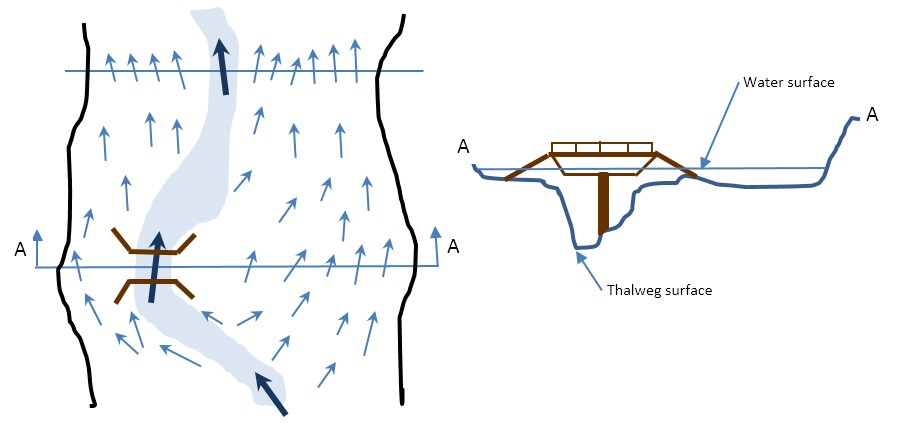

*Figure 115.
Unsteady Non-Uniform Flow through a Bridge Constriction.*

Bridge Flow

There are three basic flow conditions through a bridge: free surface flow, pressure flow and pressure flow plus deck overtopping flow.
Pressure flow, which occurs when the deck or superstructure is submerged, is defined as either sluice gate or orifice flow.
Flow through a bridge constriction is a function of the upstream headwater and downstream tailwater elevations (water surface slope), the extent of
the constriction (cross-section variation), the bridge geometry (flow area, wetted perimeter, low chord, etc.) and various site factors such as
vegetation encroachment, bed scour, and riprap.
Similar bridges at different locations experience different flow conditions for the same discharge.
The flow may be subcritical or supercritical, although supercritical flow may be limited to a bridge with a concrete apron or bedrock substrate.
Subcritical flow is the most prevalent flow regime as bridge constrictions typically reduce upstream velocities and cause backwater effects as opposed
to flow acceleration through the bridge.
Five types of subcritical bridge flow are shown in Figure 116 though Figure 120 where the flow depth at the bridge Y\ :sub:`z` required to submerge
the bridge opening is greater than about 1.1 \* Z (distance from the bed to the bridge low chord) (Chow, 1959 and Hamill, 1999).

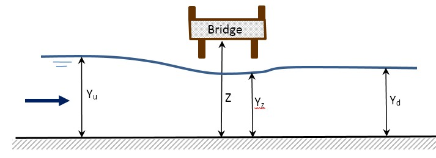

*Figure 116.
Type 1 Flow: Free surface, subcritical flow*

        (Z > Yu > Yd).

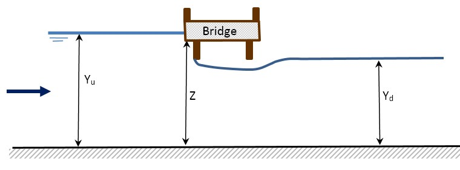

*Figure 117.
Type 2 Flow: Inlet submerged, outlet free surface, partially full, sluice gate flow*

        (Yu > Z > Yd).

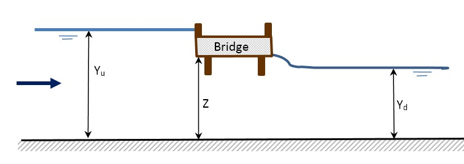

*Figure 118.
Type 3 Flow: Inlet submerged, outlet submerged, opening full, sluice gate-orifice transition flow* (Yu > Z > Yd).

.. image:: img/Chapter4/Chapte057.jpg

*Figure 119.
Type 4 Flow: Inlet submerged, outlet submerged, orifice flow*

        (Yu > Yd > Z).

.. image:: img/Chapter4/Chapte058.jpg

*Figure 120.
Type 5 Flow: Inlet submerged, outlet submerged, deck overflow*

        (Yu > Yd > Z).

Type 1 flow is the most common flow in terms of frequency since the bridge is designed to pass a selected design flood event.
The design flood may have a backwater condition extending some distance upstream.
Sluice gate flow (Type 2) occurs when the upstream opening is submerged, but the downstream water surface elevation is below the bridge soffit.
For this case, the discharge through the bridge depends on the upstream water surface elevation and the bridge geometry and the downstream water
surface elevation is irrelevant.
The submergence of the upstream opening may be sporadic until the upstream flow depth (Y\ :sub:`u`) is ten percent greater than the bridge low chord
elevation.
As the water surface level approaches the low chord, the discharge becomes highly turbulent and fluctuates rapidly, alternating between free surface
flow and pressure flow (Type 3 flow as shown in Figure 121).
The transition between sluice gate flow and orifice flow is unique to the bridge and may be temporally variable with scour, deposition or debris
blockage.
Based on project applications, sluice gate flow may persist until the upstream flow depth is 1.5 times or greater than the depth to the low chord.

.. image:: img/Chapter4/Chapte059.jpg

*Figure 121.
Pressure Flow with the Water Surface above the Low Chord Elevation*

(M. Huard, USGS).

Once the bridge inlet has been permanently submerged, a rapid increase in upstream water surface may occur resulting in submergence of both the
upstream and downstream openings and the bridge cross-section flowing full.
This is defined as drowned orifice flow (Type 4) and can only happen when both upstream and downstream water surface elevations exceed 1.1 times Z
(height of the bridge opening).
Since the downstream water prevents efficient flow through the bridge, upstream flooding can quickly ensue.
In this case, the discharge control is a combination of the bridge structure and the channel characteristics.

When the flow begins to overtop the bridge, the discharge is the sum of the pressure flow plus the deck overflow (Type 5 flow, Figure 5).
This is typically modeled as broadcrested weir flow with a coefficient in the range of 2.65 to 3.21.
If the bridge has guard rails or debris, the selected weir coefficient should be conservatively low.
Typically, overtopping flow is shallow, but for a long bridge the overflow discharge can be significant.
An assumption of weir flow to represent overdeck discharge can only be an approximation because of several factors that are not limited to:

    - Tailwater submergence;

    - Variable deck elevation;

    - Unsteady flow conditions;

    - Guardrail supports causing blockage and spatially variable flow; • Debris blockage.

.. image:: img/Chapter4/Chapte060.jpg

*Figure 122.
Bridge Deck Overflow with Guardrail*

(Llano River Bridge Collapse, CBS Austin).

Bridge Flow Modeling

The FLO-2D modeling approach and equations for the different types of bridge flow are discussed in this section.
The objective is to compute the bridge discharge that will consist of either:

    - Free surface flow

    - Pressure flow

    - Weir flow (overtopping) plus pressure flow

The effect of submergence from rising downstream tailwater is also determine by the FLO-2D model.

The bridge discharge computations will be performed inside the FLO-2D routing algorithm for the floodplain and 1-D channel components in conjunction
with the existing hydraulic structure routine.
The full dynamic wave momentum equation is applied to route flow between any two contiguous floodplain or channel grid elements.
The velocity (and hence the discharge) is computed at one of eight floodplain flow directional boundaries between two cells.
Prior to the bridge routine, the discharge for the bridge (or any hydraulic structure) located between two cells was computed only with a rating curve
or table.
The hydraulic structure inflow and outflow elements do not have to be contiguous (Figure 123).
In the bridge flow modeling component, the free surface flow, pressure flow and deck overflow will replace the rating curve or table.
The model will identify the flow condition, compute the appropriate discharge and exchange the discharge volume between the inflow and outflow nodes.
s previously discussed, the flow discharge is controlled by the upstream headwater in the inflow node, the channel and bridge geometry and roughness,
and tailwater water elevation in the outflow node.
In the case where a bridge is located on the floodplain (such as a wash) spanning several elements, an inflow and outflow node (or multiple nodes) are
still assigned, and the two bridge cross-sections are required.

.. image:: img/Chapter4/Chapte061.jpg

*Figure 123.
FLO-2D Model Bridge Inflow and Outflow Elements Separated Grid Elements.*

Free Surface Flow
~~~~~~~~~~~~~~~~~~~~~~~~~~~~~
The most frequent discharge through a bridge is subcritical low flow or free surface flow.
Typically, the bridge constricts the channel with abutments and piers, has higher flow resistance, and increases the wetted perimeter resulting in a
departure from upstream normal flow depth condition (backwater effect.
The method to evaluate the discharge is referred to as the 1950’s USGS method based on extensive laboratory and field tests as presented in Chow
(1959) and Hamill (1999).
This procedure was originally documented in Chow (1959) and is widely applied for subcritical flow in a solution of the energy and continuity
equations.
Various bridge configurations are considered in the method which includes piers, wingwalls, flow skew, entrance effects, submergence and two cross-
sections.
The upstream cross-section should be located beyond the influence of the bridge (Xsec 1 in Figure 124).
Cross-section 2 should be located at the bridge minimum cross-section flow area (Xsec 2 in Figure 124).
The USGS method assumes that the bridge constriction is a discharge-stage control given by an equation in which the discharge is expressed as a
function of the flow area, head loss across the bridge (∆h in Figure 124), and a coefficient of contraction as discussed below.
The complete derivation of the free surface (flow below the low chord) equation can be reviewed in either Hamill (1999) or Chow (1959).

The subcritical discharge Q through constrictions equation is given in Chow’s (1959) book *Open* *Channel Flow* (p.
479, Eqn 17-15) as:

        Q = C A\ :sub:`2` {2g (∆h – h\ :sub:`f` + α\ :sub:`1` V\ :sub:`1`\ :sup:`2`/2g)}\ :sup:`0.5`

where:

    A\ :sub:`2` = flow area at cross-section 2 (Figure 124 downstream end of bridge)

    ∆h = y\ :sub:`1` – y\ :sub:`2` y\ :sub:`1` depth upstream of bridge – y\ :sub:`2` depth at downstream end of bridge

    h\ :sub:`f` = frictional loss

    α\ :sub:`1` = energy coefficient at cross-section 1

    V\ :sub:`1` = depth averaged velocity at cross-section 1

    g = gravitational acceleration

    C = C\ :sub:`c` / (α\ :sub:`2` + k\ :sub:`e` + k\ :sub:`p`)\ :sup:`0.5`;

    C\ :sub:`c` = coefficient of contraction,

    α\ :sub:`2` = energy coefficient at cross-section 2,

    k\ :sub:`e` = eddy loss coefficient,

    k\ :sub:`p` = non-hydrostatic pressure coefficient

The terms can be combined and expanded to yield Eqn 17-20 in Chow (1959, p.490) in English units:

        Q = 8.02 C A\ :sub:`2` (∆h/β)\ :sup:`0.5` (1)

where:

        β = 1 - α\ :sub:`1` C\ :sup:`2` (A\ :sub:`2` /A\ :sub:`1`)\ :sup:`2` + 2gC\ :sup:`2` (A\ :sub:`2`/K\ :sub:`2`)\ :sup:`2` (L\ :sub:`B` +L\ :sub:`1-2`K\ :sub:`2`/K\ :sub:`1`);

    L\ :sub:`B` = length of contracted reach

    L\ :sub:`1-2` = length of the reach from cross-section 1 to cross-section 2 (Figure 124)

    K\ :sub:`1` and K\ :sub:`2` = conveyance at cross-sections 1 and 2; K\ :sub:`1` = 1.486/n A\ :sub:`1` R\ :sub:`1`\ :sup:`0.67`; K\ :sub:`2` = 1.486/n
    A\ :sub:`2` R\ :sub:`2`\ 0.67

    n = Manning’s n-value through the contracted reach

    A\ :sub:`1`, R\ :sub:`1` and A\ :sub:`2`, R\ :sub:`2` are the cross-section flow areas and hydraulic radiuses respectively (Figure 124).

.. image:: img/Chapter4/Chapte138.png

*Figure 124.
Conceptual Bridge Plan and Profile with River Cross-sections.*

To apply this free surface flow equation, the type of bridge opening (one of four) must be selected, and the bridge parameters and coefficients must
be determined.
The USGS figures for the four bridge types used to determine the coefficients are presented in the Appendix as reproduced from Hamill (1999).
The relationships between the bridge parameters in Appendix figures that are used to evaluate the coefficients are hardcoded into the FLO-2D model in
tabular form for linear interpolation.
Conceptually, the role of the bridge coefficients is to represent a resistance to flow that will decrease the discharge like the Manning’s n roughness
coefficient with the exception that a decrease in the bridge coefficients will have the same effect as an increase in the Manning’s n-value.

The USGS bridge discharge method embodies several assumptions both theoretically and practically to simplify the required data.
The following assumptions have been acknowledged as potentially limiting the accuracy of the modeling approach.

    i. Two cross-sections will be used to represent the bridge.
       If there is no 1-D FLO-2D channel, the cross-sections still required data (BRIDGE_XSEC.DAT file).
       For a 1-D channel, the bridge cross-sections can be represented by existing channel cross-sections with the first cross-section being the bridge
       inflow node channel cross-section.
       This cross-section should represent essentially normal depth upstream of the bridge (beyond backwater effects).
       The length between the two cross-sections (UPLENGTH12 – L\ :sub:`1-2` in Figure 124) can be adjusted and can be longer than a grid element side length
       if the cell size is too short to extend to the normal flow depth conditions.

    ii. The bridge flow will be exchanged between the upstream inflow and downstream outflow elements (INFLONOD or OUTFLONOD in HYSTRUC.DAT file) for either
        the channel or floodplain.
        Conceptually the bridge will be located between these two elements and share discharge between them.
        The inflow and outflow nodes don’t have to be contiguous.
        The bridge cross-section will constitute the boundary between these elements.

    iii. If there is widespread floodplain flooding, the upstream cross-section should be limited to the 1-D channel top of banks.
         For a bridge on the floodplain with no channel, the cross-section should be limited to a perceived channel width or the bridge opening width.
         The cross-section should not encompass the entire valley floodplain.
    iv. The flow depth at the bridge is defined by the upstream inflow element water surface elevation and the bridge cross-section thalweg in cross-section 2
        (Figure 124).
        This is not entirely accurate, since the water surface will vary from the upstream cross-section to the bridge cross-section, but water surface
        elevation at the bridge is not computed directly by the model.
        Given the potential of backwater effects, however, the impact of the variable water surface elevation on the flow depth will not be significant.

    v.   The water surface head difference will be assessed from the upstream inflow node headwater and the downstream outflow node tailwater.

    vi.  The bridge will assume to have the same constriction coefficients and losses regardless of whether the flow is upstream or downstream.

    vii. A velocity coefficient of α\ :sub:`1` = 1.3 is assumed and hardcoded for natural streams from Chow (1959, p.
         28) representing an average of lower values (α\ :sub:`1` ~ 1.1) for large uniform prismatic and higher values for small nonuniform natural channels
         (ranging up to 1.5).

Sluice Gate Flow
~~~~~~~~~~~~~~~~~~~~~~~~~~~~~

Once the water surface level reaches the low chord or soffit of the bridge, the water surface control switches from the channel to the bridge and the
discharge mimics a sluice gate flow (Figure 3b).
In general, sluice gate flow applies only when the water level is on the upstream bridge face, but the highly turbulent transition to orifice flow is
obscure with potential for drowning the downstream opening (Figure 3c).
In a stage-discharge plot, the free surface channel flow and the bridge flow rapidly diverge as the water surface approaches the soffit (Figure 125).
The difference between the two water surfaces is the afflux.
The bridge flow in this figure is concave upwards above the soffit.
Sluice gate discharge Q\ :sub:`p` (pressure flow) is described by the equation:

        Q\ :sub:`p` = CA\ :sub:`b` (2g ∆H)\ :sup:`0.5`

where:

C = coefficient of discharge (0.3 to 0.6 dimensionless, Figure 125)

A\ :sub:`b` = cross-section flow area through the bridge opening

g = gravitational acceleration

∆H = energy gradient from upstream to tailwater elevation Y\ :sub:`c` given by (see Figure 117):

                Y\ :sub:`u` – Y + V\ :sub:`u`\ :sup:`2`/2g

.. image:: img/Chapter4/Chapte062.jpg

*Figure 125.
Stage-Discharge Variation between Free Surface Flow and Bridge Flow (Hamill, 1999; p.53).*

For subcritical flow the velocity head term V\ :sub:`u`\ :sup:`2`/2g (including the velocity coefficient) can be ignored and lowest flow depth Y
through the bridge will vary from approximately Z/2 to the downstream tailwater elevation (Figure 117 and Figure 118).
Figure 126 indicates a range of 0.27 to 0.50 for the sluice gate coefficient as a function of the low chord submergence, however, Hamill (1999, Figure
2.11, p.55) indicates that the coefficient can approach 0.6 depending on the bridge configuration.

.. image:: img/Chapter4/Chapte063.jpg

*Figure 126.
Sluice Gate Discharge Coefficient as Function of the Low Chord Submergence (FHA, 2012).*

An important aspect of sluice gate flow is that there is a transition between sluice gate flow and free surface flow and again between sluice gate
flow and drowned orifice flow (discussed below).
These transitions are unique for each channel and bridge site.
There may also be a hysteresis effect between the rising and recession limbs of the hydrograph.
Factors that contribute to the variability in the transition flow zone (establishment of submergence) are numerous but can include an inclined bridge
low chord.
Ideally, the transition from free surface flow to sluice gate flow as noted in the literature, extends to a submergence level of Y\ :sub:`u`/Z = 1.1,
but practically it may be as high as Y\ :sub:`u`/Z = 1.5 depending on the bridge configuration and its hydraulic performance.

It should be mentioned that the above sluice gate equation (Hamill, 1999), differs from the vertical sluice gate discharge equation which is also
occasionally applied to bridge flow.
For the vertical sluice gate case, the assumed discharge is a function of the square root of the difference between upstream uniform flow depth and
some percentage of the gate opening.
Oskuyi and Salmasi (2012) presented a vertical sluice gate coefficient relationship with limited variability over a range of flows:

            C = 0.445 (Y\ :sub:`u`/Z)\ :sup:`0.122`

which is plotted as the green line in Figure 126.
The FHA curve in Figure 126 has a regressed relationship of:

            C = 0.341 (Y\ :sub:`u`/Z)\ :sup:`0.931`

with a correlation coefficient R\ :sup:`2` = 0.61.
This equation is used in the FLO-2D model.

Orifice Flow
~~~~~~~~~~~~~~~~~~~~~~~~~~~~~

Orifice flow is defined by a pressure flow condition through the bridge where both the upstream and downstream water surface elevations are above the
low chord (Y\ :sub:`u` > Z, Y\ :sub:`d` > Z) indicating a drowned opening (Figure 3d).
The orifice equation for discharge is:

        Q\ :sub:`p` = CA\ :sub:`b` (2g ∆H)\ :sup:`0.5` (3)

where:

    C = Coefficient of discharge

    A\ :sub:`b` = Bridge opening cross-section flow area

    ∆H = difference between the energy gradient elevation upstream and tailwater downstream

In this equation, which is similar to the sluice gate equation, ∆H is given by the difference in the headwater Y\ :sub:`u` and tailwater Y\ :sub:`d`
plus the velocity head V\ :sub:`u`\ :sup:`2`/2g, which again is assumed to be negligible for subcritical flow (at least when considering the
variability of the coefficient).
The orifice coefficient of discharge C, as determined by experiment, ranges from 0.7 to 0.9 (USCOE HEC, 1995).
A value of 0.8 is recommended for a typical two- to four-lane concrete girder bridge coefficient (Hoggan, 1989; p.
401).
Hamill (1999) plots data from actual bridge flow and other sources to demonstrate the variation of the coefficient of discharge with submergence
(Figure 127).

.. image:: img/Chapter4/Chapte064.jpg

*Figure 127.
Orifice Coefficient of Discharge as Function of Low Chord Submergence (Hamill, 1999).*

The regressed relationship of the data in Figure 127 for Y\ :sub:`u`/Z > 1.25 is given by:

        C = 0.80 (Y\ :sub:`u`/Z)\ :sup:`-0.184`

This equation is used in the FLO-2D model and results in a coefficient variability in the range of 0.7 to 0.8.
This is compared with the sluice gate flow discharge coefficient, which ranges from about 0.4 to 0.5 as shown in Figure 126.

Pressure Flow Plus Weir Flow
~~~~~~~~~~~~~~~~~~~~~~~~~~~~~

Once the flow is above the deck, then the total discharge through bridge Q\ :sub:`T` is the sum of the pressure flow (sluice gate or orifice flow)
plus the weir flow over the bridge deck:

        Q\ :sub:`T` = Q\ :sub:`p` + Q\ :sub:`w`

Broadcrested weir flow is generally used to represent flow over a bridge deck as given by:

            Q\ :sub:`w` = C L\ :sub:`c` ∆H\ :sup:`1.5`

where:

    C = Broadcrested weir discharge coefficient which varies from 2.6 to 3.1

    ∆H = energy grade line between headwater and roadway crest elevation (or railing) or tailwater L\ :sub:`c` = crest length

Broadcrested weir flow representing bridge overflow is usually justified because flow across the crest (roadway) is considered broad and the flow
depth on the bridge is shallow.
When combined with the pressure flow, the overtopping flow will result in equal energy loss.
If the tailwater drowns out the weir control, then a submergence factor in the FLO-2D hydraulic structure routine will be applied to the discharge.
Submergence generally becomes an issue when the tailwater depth divided by the headwater depth approaches 0.80.
Since a bridge deck is not an ideal smooth broadcrested weir, a lower coefficient of discharge in the range of 2.6 to 2.8 is suggested (FHA, 2012).
Some consideration should be given to the deck railing configuration.
Is the deck railing segmented and spanning the entire bridge? Does it have multiple rails or is it solid? Are there walkways that are elevated above
the road bed? Is the bridge deck inclined, sloping from one side to the other? Can debris collect on the deck railing? All these possible flow
conditions will decrease the broadcrested weir coefficient.

It is important to note the difference between the weir coefficient C and a discharge coefficient C\ :sub:`q`.
The weir coefficient is a lumped parameter that is based on the weir’s characteristics and includes the discharge coefficient.

        C = 2/3 C\ :sub:`q` (2g)\ :sup:`0.5`

The discharge coefficient C\ :sub:`q` is same in both English and SI (metric) units and is dimensionless.
The weir coefficient, however, is not dimensionless since it is a function of the gravitational acceleration g (ft/s\ :sup:`2` or m/s\ :sup:`2`).
To convert from English to metric, multiply the weir coefficient C by 0.552.

Modeling Bridge Flow with FLO-2D

The bridge flow routine in FLO-2D is called by the hydraulic structures component which establishes the inflow and outflow nodes, the headwater,
tailwater and submergence conditions, and the components for discharge exchange (floodplain to floodplain, channel to channel, floodplain to channel,
or channel to floodplain).
The rating curve and table data that is normally assigned for FLO-2D bridge flow is not required.
As previously mentioned, the bridge inflow and outflow nodes do not have to be contiguous in the grid system.
They can be separated by several grid elements to represent a four-lane highway bridge.
In the FLO-2D model, the discharge is routed to the inflow node to determine the headwater and flow depth conditions.
Then the free surface, pressure flow or weir flow equations compute the bridge discharge to the outflow node, which is then routed to the downstream
elements by the model’s routing algorithm.

Data Requirements and Parameter Definition
~~~~~~~~~~~~~~~~~~~~~~~~~~~~~~~~~~~~~~~~~~~~~~~~~~~~~~~~~~

Two lines of data in the HYSTRUC.DAT file (B-lines) and two cross-sections are required for each bridge being simulated.
The original S-Line in HYSTRUC.DAT identifies the bridge inflow and outflow nodes and its association with the either the channel or the floodplain.
The rating curve or table switch in the S-Line is set to 3 (ICURVTABLE(i) =3) to define a bridge analysis for that structure.
The S-Line is then followed by two B-lines where (i) is the bridge number in HYSTRUC.DAT.

The first B-line of data in the HYSTRUC.DAT file provides the user with the opportunity to directly assign the free surface low flow discharge
coefficients.
The second B-line includes the various bridge parameters such as low chord, deck length, pier width, etc.

1) **B IBTYPE(i), COEFFP(i), C_PRIME_USER(i), KF_COEF(i), KWW_COEF(i), KPHI_COEF(i), KY_COEF(i), KX_COEF(i), KJ_COEF(i)**

2) **B BOPENING(i), BLENGTH(i), BN_VALUE(i), UPLENGTH12(i), LOWCHORD(i), DECKHT(i), DECKLENGTH(i), PIERWIDTH(i), SLUICECOEFADJ(i),**

   **ORIFICECOEFADJ(i), COEFFWEIRB(i), WINGWALL_ANGLE(i), PHI_ANGLE(i), LBTOEABUT(i), RBTOEABUT(i)**

A. typical HYSTRUCT.DAT file for a bridge would be as follows:

     S Name 0 3 631 625 1 0.0 0 0

     B 1 0.0.0.0.1.1.1.1.

     B. 15.40. 0.05 40.1378.00 1380.00 22.00 0.0.0.50 3.05 0.0.1376.5 1377.2

These parameters are defined in Table 14 and are used to compute the coefficients for free surface flow presented in the Appendix.
The Appendix figure showing the relationships with the bridge configuration are used to interpolate the free surface coefficients from the data
entered in Line B-2.
All the Appendix figures were digitized and are hardcoded into the model.

**Table 14.
Bridge Parameters (B-Lines in HYSTRUC.DAT)**

.. list-table::
   :widths: 10 10 10 70
   :header-rows: 0

   * - VARIABLE
     - FMT
     - RANGE
     - DESCRIPTION

   * - STRUCHAR
     - c
     - B
     - Character identifier for the bridge

       routine

   * - IBTYPE
     - i
     - 1 – 4
     - Type of bridge configuration (see

       Appendix figures)

   * - COEFF\*
     - r
     - 0.1 - 1.0
     - Overall bridge discharge coefficient –

       assigned or computed (default = 0.)

   * - C_PRIME_USER\*
     - r
     - 0.5 - 1.0
     - Baseline bridge discharge coefficient

       to be adjusted with detail coefficients

   * - KF_COEF\*
     - r
     - 0.9 - 1.1
     - Froude number coefficient – assigned

       or computed (= 0.)

   * - KWW_COEF\*
     - r
     - 1.0 - 1.13
     - Wingwall coefficient – assigned or

       computed (= 0.)

   * - KPHI_COEF\*
     - r
     - 0.7 - 1.0
     - Flow angle with bridge coefficient –

       assigned or computed (= 0.)

   * - KY_COEF\*
     - r
     - 0.85 - 1.0
     - Coefficient associated with sloping

       embankments and vertical abutments (= 0.)

   * - KX_COEF\*
     - r
     - 1.0 - 1.13
     - Coefficient associated with sloping

       abutments – assigned or computed (= 0.)

   * - KJ_COEF\*
     - r
     - 0.6 - 1.0
     - Coefficient associated with pier and

       piles – assigned or computer (= 0.)

   * - BOPENING
     - r
     - 0.0 - ∞
     - Bridge opening width (ft or m).
       See Figure
       7.

   * - BLENGTH
     - r
     - 0.0 - ∞
     - Bridge length from upstream edge

       to downstream abutment (ft or m)

   * - BN_VALUE
     - r
     - 0.030 - 0.200
     - Bridge reach n-value (typical channel

       n-value for the bridge cross-section)

   * - UPLENGTH12
     - r
     - 0.0 - ∞
     - Distance to upstream cross-section

       unaffected by bridge backwater (ft or m)

   * - LOWCHORD
     - r
     - 0.0 - ∞
     - Average elevation of the low chord

       (ft or m).

   * - DECKHT
     - r
     - 0.0 - ∞
     - Average elevation of the top of the deck

       railing for overtop flow (ft or m)

   * - DECKLENGTH
     - r
     - 0.0 - ∞
     - Deck weir length (ft or m).

   * - PIERWIDTH
     - r
     - 0.0 - ∞
     - Combined pier or pile cross-section

       width (flow blockage width in ft or m)

   * - SLUICECOEFADJ
     - r
     - 0.0 - 2.0
     - Adjustment factor to raise or lower the

       sluice gate coefficient which is 0.33

       for Y\ :sub:`u`/Z = 1.0

   * - ORIFICECOEFADJ
     - r
     - 0.0 - 2.0
     - Adjustment factor to raise or lower

       the orifice flow coefficient which

       is 0.80 for Y\ :sub:`u`/Z = 1.0

   * - COEFFWEIRB
     - r
     - 2.65 - 3.21
     - Weir coefficient for flow over the bridge

       deck.
       For metric: COEFFWIERB x 0.552

   * - WINGWALL_ANGLE
     - r
     - 30⁰ - 60⁰
     - Angle the wingwall makes with the

       abutment perpendicular to the flow

   * - PHI_ANGLE
     - r
     - 0⁰ - 45⁰
     - Angle the flow makes with the bridge

       alignment perpendicular to the flow

   * - LBTOEABUT
     - r
     - ELEVATION
     - Toe elevation of the left abutment

       (ft or m)

   * - RBTOEABUT
     - r
     - ELEVATION
     - Toe elevation of the right abutment

       (ft or m)

   * -
     -
     -
     -

   * - \* If the coefficient is assigned

       1.0, that bridge coefficient is either

       not important or has no effect.
     -
     -
     -

The two cross-sections are located: 1) Upstream of the bridge where essentially normal depth occurs (upstream of the bridge backwater effects); and 2)
At the bridge to reflect the channel contraction and low chord.
The cross-section data is listed in the BRIDGE_XSEC.DAT file.
The two required bridge cross-sections are shown in Figure 124.
This data is necessary regardless of whether there are 1-D channel cross-sections or no surveyed cross-sections associated with a bridge on the
floodplain.
The bridge cross-section can be located anywhere in the bridge that defines the bridge contraction.
The upstream cross-section is located by the distance L\ :sub:`1-2` (Figure 124).
The pier or pile widths are not entered in the cross-section data.
The sum of all the pier or pile widths (PIERWIDTH) is entered in the B-line data in HYSTRUC.DAT (Table 1).
The cross-section data is entered in the BRIDGE_XSEC.DAT file in the ASCII format below (data separated by spaces).
In line 1, X indicates the start of a new bridge cross-section and the number 631 is bridge inflow node grid element number.
The remaining lines are station from the left top of bank, upstream bed elevation at the given station, and the bridge station bed elevation.

 X   631

   0.00 1380.00 1385.00

   0.60 1378.70 1378.46

   5.00 1377.00 1376.96

   5.50 1376.85 1376.68

   6.00 1376.75 1376.46

   12.65 1376.70 1376.46

   15.85 1376.78 1376.51

   18.95 1377.20 1377.00

   20.65 1378.15 1377.26

   22.00 1378.70 1378.44

   22.10 1380.00 1385.00

The bridge cross-section is referenced to the upstream cross-section stations.
The bridge cross-section contraction corresponds to the abutments or channel bank elevations under the bridge deck.
The low chord data (LOWCHORD) represents the average low elevation of the deck structure and the deck elevation (DECKHT) represents the average
elevation of deck (typically the railing).
The bridge deck may be inclined from one side of the channel to the other (not level) and judgment may be necessary to select low chord or deck
elevations to represent the initiation of full pressure flow under the bridge or full weir flow over the bridge.

To get started, use bridge as-builts or design drawings and survey the bridge cross-sections or digitally extract them from topographic data in a GIS
or CADD program.
The FLO-2D QGIS Plugin can be used.
Enter the bridge configuration data using an ASCII file editor or using the QGIS graphical interface.
The older GDS will not have a bridge editor function.

To assist in understanding the free surface bridge flow routine, some specific detailed comments are provided:

Notes on the bridge configuration data:

i.   ITYPE = 1-4 bridge configurations representing the type of constriction I through IV depending on abutment type shown in the Appendix figures.
     The bridge type will be used to assign the various coefficients.
     Refer also to Figures 17-16 through 17-23 beginning on page 480 of Chow (1959) or Figure 4.4 through 4.13 beginning on page 113 of Hamill (1999).
     These two sets of figures are essentially the same but Hamill (1999) has a little more detail in some of the figures and for that reason, Hamill’s
     (1999) figures has been reproduced in the Appendix.

ii.  The various coefficients are estimated from a linear interpolation between two points on the lines representing the bridge parameters and coefficient
     data in the Appendix plots.
     Typically, the lines in Appendix figures were divided into 8 to 12 segments to generate the digital data set.

iii. The bridge opening (BOPENING) is the width of the contracted cross-section between the top of banks.

iv.  L\ :sub:`1-2` = distance upstream of the surveyed constricted cross-section (UPLENGTH12).
     This cross-section should be located upstream of the backwater effects of the bridge (up to several lengths of the bridge opening width).

v.   Refer to the Appendix figures for parameter definition such as the radius of the leading edge of the Type I abutment, length of the wingwall chamfer
     for various three chamfer angles (30\ :sup:`o`, 45\ :sup:`o` and 60\ :sup:`o`), angle of bridge with respect to the flow, and angle of wingwall.

Comments on the bridge coefficients:

The general discharge coefficient for bridge contraction C (COEF) is proposed to account for eddy loss associated with contraction, nonuniform
distribution of the velocity, and nonhydrostatic pressure distribution all contributed to the afflux.
The discharge coefficient is defined as:

        C = C’ K\ :sub:`i`

where:

       C’ (C_PRIME_USER) is the standard value of the coefficient of discharge for given bridge type of constriction.

       K\ :sub:`i` are various multiplicative coefficients used to adjust the value of C’ to account for nonstandard conditions involving the Froude number,
       entrance rounding, abutment chamfer, flow angularity, side depths, side slopes, bridge submergence, and piers.

Most of the coefficients represent a loss of energy or increase flow resistance through the bridge, but a couple of the coefficients for a particular
stage or bridge configuration can result in more efficient flow and the coefficient can be greater than 1.0 such as for the Froude number and angle of
the wingwall.

To derive the various discharge coefficients, the bridge opening ratio m must be determined where = W\ :sub:`b`/B and W\ :sub:`b` is the contracted
cross-section width and B is the upstream channel cross-section width for a prismatic channel.
For a non-prismatic channel, the bridge opening ratio represents the percentage of the flow that can be conveyed through the bridge cross-section
without contraction.
In this case, the opening ratio represents a ratio of the discharge conveyance through the two cross-sections and the FLO-2D model performs this
computation.

Some notes on the various bridge coefficients for free surface flow are listed below.
The user has an option to assign the coefficients (K\ :sub:`i` > 0.01) or have the model compute the coefficients (K\ :sub:`i` = 0.0).
If K\ :sub:`i` = 1.0, then this bridge feature and its coefficient has no effect on the bridge flow.

    K\ :sub:`F` (KF-COEF) = coefficient based on the effect of Froude number K\ :sub:`F` = f(F\ :sub:`b`).
    The Froude number at the bridge is computed for Type 1 or Type IV bridges (see Appendix Figures) using the discharge, flow area and depth, F\ :sub:`b`
    = Q/A\ :sub:`b` (g y\ :sub:`b`)\ :sup:`0.5`.
    No additional data is required.

    K\ :sub:`r` = coefficient of entrance rounding for Type I only.
    Percent of contraction m and r/b are required where r = radius of the corner and b = contracted bridge width, Appendix Figure A.1c.

    K\ :sub:`w` (KWW_COEF)= coefficient of wingwall chamfer for Type 1 only.
    Contraction percentage m and w/b for three possible chamfer angles are required where w is the chamfer length and b = contracted bridge opening.
    Appendix Figure A.2.

    K\ :sub:`Φ` (KPHI_COEF)= coefficient of bridge angle of attack to flow Φ based on the bridge contraction m for all types of bridge configurations
    shown in the Appendix Figures.

    K\ :sub:`y` (KY_COEF)= coefficient of side flow depths on each vertical abutment (a and b) for (y\ :sub:`a` + y\ :sub:`b`)/2b, where y\ :sub:`a` and
    y\ :sub:`b` are the flow depths above the toe of each abutment (at different elevations) only for Type II bridge configurations Appendix Figure A.3.

    K\ :sub:`x` (KX_COEF)= coefficient of the abutment upstream slope as a function of the ratio of the distance to upstream water surface x from bridge
    deck to the bridge contraction width b.
    The K\ :sub:`x` coefficient for different values x/b and deck widths (L) for Type III abutments are shown in Appendix Figures A.5, A.6 and A.7.

    K\ :sub:`θ` = coefficient for wingwall angle θ to the approach flow as a function of the bridge opening ratio m for Type IV bridges.
    Appendix Figures A.8 and A.9.

    K\ :sub:`j` (KJ_COEF)= coefficient for reduced flow area associated with bridge piers and piles for all Types of bridge configurations as a function
    of the bridge opening ratio m and the ratio of the contracted flow area due to the piers and piles (Appendix Figure A.10).

Two coefficients proposed by Chow (1959) and Hamill (1999) are not used in the bridge analysis.

    K\ :sub:`e` = coefficient for eccentricity ratio (different abutment extension lengths into the flow).
    As recommended by Hamill (1999), the effect of the eccentricity on the discharge is generally small and can be ignored.

    K\ :sub:`t` = coefficient of submergence.
    Tailwater submergence is already accounted for in the existing hydraulic structure routine and will be automatically applied with the bridge routine.

The coefficients have minimum and maximum limits based the Appendix figures.

Discharge Computations

The free surface flow routine appears to be minutely detailed and overly complicated.
The free surface flow is not as important as the pressure and weir flow, especially if the free surface flow is not overbank.
If the flow is less than bankfull then a poor estimate of the bridge hydraulics would only result in 0.5 ft (0.16 m) error or so in the channel water
surface elevation and the actual discharge would be about the same as the upstream flow.
Even though Manning’s equation only applies to steady, uniform flow conditions (which are not generally encountered at a bridge contraction),
adjusting the Manning’s n-value to represent the bridge hydraulics would undoubtedly provide a reasonably accurate bridge discharge up to the low
chord.
If the bridge discharge coefficients could be correlated with appropriate increases in the Manning’s nvalue, the free surface flow data requirements
could be greatly simplified.

To perform the free surface flow, pressure flow and weir flow discharge calculations, the water surface elevations upstream and downstream predicted
by the FLO-2D model routing algorithms are used.
This data enables the upstream, bridge and downstream flow depths to be computed.
Some adjustments to the flow depth and head across the bridge are made for certain conditions:

    - The head at the bridge is interpolated based on the distance between the upstream cross-sections and bridge.

    - If the head exceeds the flow depth, the head is set to the flow depth.

    - If the tailwater is higher than the headwater and the upstream water surface elevation is higher than the low chord, the head is computed as the
      difference between the upstream water surface elevation and the low chord.

Based on the respective flow depths, the upstream and bridge cross-section channel geometry is computed including flow area, top width, wetted
perimeter and hydraulic radius.
Using the bridge configuration, channel geometry, and bridge opening ratio, the various free surface flow discharge coefficient adjustments (displayed
in the Appendix) are computed resulting in an overall bridge discharge coefficient.
Manning’s n-values are adjusted for flow depth using the FLO-2D n-value modification method expressed as an exponential relationship of bankfull depth.
The discharge through the bridge as free surface flow is then computed using Eqn (1).

Once the bridge flow water surface exceeds the low chord elevation, the discharges from the sluice gate flow equation (2) and the orifice flow
equation (3) are computed.
If both the upstream and downstream water surface elevations are greater than the low chord and if the depth to low chord height ratio exceeds 1.125,
then the orifice discharge is used to represent the pressure flow.
For the same upstream and downstream flow depth, if the bridge flow depth divided by low chord height is less than 1.125, the minimum of the sluice
gate flow or the orifice flow discharge is applied to represent the pressure flow.
For any other condition where the upstream water surface elevation exceeds the low chord, orifice flow is computed.
Finally, when the upstream water surface elevation exceeds the deck height, the orifice pressure flow and deck weir flow is combined to represent the
discharge past the bridge.
The objective is to have a smooth transition between the applications of the three discharge equations.
For all conditions, it is assumed that the flow will not accelerate through the bridge (in other words, there will be some backwater effects).
If the bridge discharge is greater than the upstream grid element discharge, the bridge discharge is set equal to the upstream discharge.
If it is possible that the flow will accelerate through the bridge as in the case of a concrete apron, then the bridge should be simulated as a closed
culvert using the FLO-2D generalized culvert equations routine.

Summary

The objective of the FLO-2D bridge routine is to compute the discharge through the bridge based on the physical configuration and features of the
bridge.
The bridge discharge is shared between two grid elements (channel or floodplain) that do not have to be contiguous and whose flow hydraulics (depth
and water surface) are computed by the FLO-2D routing algorithm.
Bridge discharge is defined by 1-D flow in the cross-sections upstream and through the bridge.
No two-dimensional flow field velocities in the bridge cross-section are predicted by the model, so no flow patterns around the piers or scour hole
depths can be simulated.
The focus of the bridge routine is to relate the bridge discharge to the flow volume in the upstream and downstream channel elements or to the
floodplain overbank flow.

The FLO-2D bridge routine enables the user to compute the discharge through bridges without using an external program to generate a stage-discharge
rating curve or table.
The routine will compute the discharge for three classes of flow regime, free surface flow for discharge below the bridge low chord, pressure flow
when the discharge is above the low chord but below the bridge deck and combined pressure and weir flow as the discharge goes over the bridge.
The pressure flow and weir flow computations are relatively straight forward.
The free surface flow is more complex with a number of multiplicative coefficients that represent various features of the bridge and their effects on
the flow.
The pressure flow will be either sluice gate flow or orifice flow, whichever is smaller.
There may not be a smooth transition between the two types of flow representation and some adjustment of the coefficients may be necessary.
An adjustment factor to raise or lower the computed sluice gate or orifice coefficient is available as a data input parameter.
The user has complete control of all the coefficients utilized in the bridge routine for all flow regimes.

Matching HEC-RAS or other models with bridge components may not be exact because of the computational approach (e.g. solution to the 1-D energy
equation vs flood routing with the fulldynamic wave momentum equation) and because the FLO-2D bridge routine has more detail for both free surface
flow and pressure flow.
Ultimately, the bridge flow control with coefficient adjustments, however, should provide a suitable correlation between the models.
Unless there is an opportunity to calibrate the bridge coefficients to a field data set, it should not be assumed that the HEC-RAS or other bridge
routines are necessarily more accurate.
A primary focus of the bridge routine application should be to achieve numerical stability for the bridge flow over a wide range of unsteady, non-
uniform discharges.
