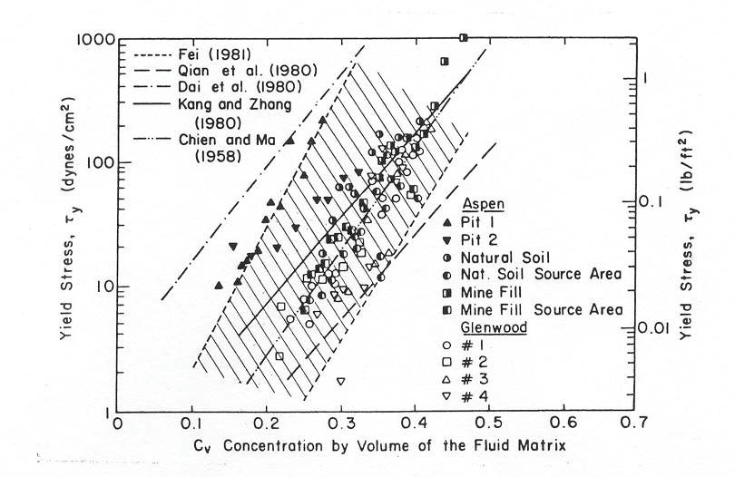

.. vim: syntax=rst

Simulating Mudflow Guidelines
==============================

Introduction
-------------

There is a continuum in the physics of flowing water and sediment that ranges from clear water flow to landslides and despite our best efforts to
characterize, classify and catalog different types of flow events, the delineation between fluid flow and soil mass movement is not definitive.
An attempt to delineate between hyperconcentrated sediment flows and mass wasting processes was initiated by the National Research Council Committee
on Methodologies for Predicting Mud Flows (NRC, 1982).
The Committee proposed four categories: water floods, mud floods, mudflows, and landslides.
This classification convention is followed in this document.
This discussion will attempt to distinguish between hyperconcentrated sediment flows that behave as fluids and mass wasting processes such as
landslides, earthflows, slow creeping soil masses or rotation or slippage failure of soils.
The scientific community has widely adopted the term ‘debris flow’ to describe the full range of hyperconcentrated sediment flows.
The use of this term is discouraged because of it is non-descriptive and provides little insight into the physical processes of a given flow event.
The term ‘debris flows’ does not infer either a water flood, viscous mudflow, a dispersive or granular flows, but is ubiquitously applied to all of
them.
In a humorous sense, ‘debris flow’ does effectively describe the flow of cars, refrigerators, trash and dead cows, all of which can be found in a
urban flood event (Johnson, 1970).

If a water and sediment mixture deforms continuously when subjected to shear stress, it is fluid and its motion can be described by the physics of
fluids.
Fluid motion is considered to be Newtonian when the shear stress is a linear function of the shear rate or nonNewtonian when viscous behavior is
nonlinear and is more complex.
NonNewtonian fluids may be divided into three categories:

    - Fluids with a non-linear relationship between shear stress and shear rate;
    - Fluids in which the shear stress not only depends on shear rate but is also a function of the time of shearing;
    - Fluids that are viscoelastic and exhibit characteristics of both elastic solids and viscous fluids.

Sediment particle motion that exhibits pore water pressure or significant dispersive stress falls into the category of bulk solids movement as either
landslides or granular flows and should not be considered as fluid motion.
Savage (1979) defined a bulk solid motion as an assemblage of discrete solids dispersed in a fluid such that the solid particles are in contact with
their neighbors.
In bulk solid flows, he indicated that the solid phase is dominant and motion is governed by particle cohesion, friction and collisions.
When water is added to a collection of sediment particles, the transition from solid particle motion (rolling, tumbling, sliding and colliding) to
fluid motion can be very gradual.
The existence or persistence of a pore water pressure is a clear indicator that solids motion still dominates.
Pore water pressure in a flow of granular material means that a portion of the overburden load is carried by both the fluid phase and the solids phase.
It also means that the fluid cannot escape through the interstices or that the upward motion of fluid through the solid particles is relatively minor.
The distinction between a fluid flow and a granular flow is important when formulating the equations of motion and considering whether the fluid
turbulent and viscous stresses dominate or whether the dispersive stress and particle friction terms dominate.

The distinction between fluid motion and solids motion takes on more significance when considering flow initiation or cessation.
An assemblage of solids with very little water will cease motion when a change in slope occurs whereas a fluid will continue to flow downslope on
relatively flat gradients as a function of both momentum and water surface slope.
This leads to a simple, but often ignored conclusion, the area of inundation by granular flows is almost entirely dependent on the volume of available
material, whereas the area on inundation by the fluid flow is dependent on the flow characteristics as well as the volume.
The following discussion considers the fluid motion of hyperconcentrated sediment flows referred to as mudflows or mud floods.

Flow Classification
---------------------

The vast majority of hyperconcentrated sediment flows that occur worldwide fall within a range of about 20 to 55 percent concentration by volume and
most are associated with rainfall runoff.
A small percentage of these flows are initiated by snow melt runoff and an even smaller number are associated with dam breaks, landslides and
volcanoes.
Almost all hyperconcentrated sediment flows are fully turbulent, unsteady and nonuniform and are characterized by surging, flow cessation, blockage
and roll waves.
The terms mudflow, mud flood, water flood and granular or dispersive flow are applied to classify the full range of hyperconcentrated sediment flows.
Hyperconcentrated sediment flows are defined as flood events with sediment concentrations that exceed 20% by volume.
Flows with sediment concentrations less than 20% by volume are essentially water floods with high bedload and suspended loads where the bedload may be
affected by the high concentration of suspended load (i.e.
fine sediment wash load).

With increasing sediment concentration, a water flood will evolve into a mud flood (see Table1).

The general range of sediment concentration in mud flood is 20% to 40 - 45% by volume.
Mud floods may be difficult to discern from water floods and they look very similar in flow behavior as noted in Table 1, but the fluid properties of
mud floods are definitively different from water floods with much higher viscosity and density.
Table 1 lists the four different categories of hyperconcentrated sediment flows and present their flow characteristics.
This table was developed from the laboratory data using actual mudflow deposits from Glenwood Springs, Colorado.
Some variation in the delineation of the different categories of flow events should be expected on the basis of the watershed geology.

Very viscous, hyperconcentrated sediment flows are generally referred to mudflows.
Mudflows are nonhomogeneous, nonNewtonian, transient flood events whose fluid properties change significantly as they flow down steep watershed
channels or across alluvial fans.
A mudflow will consist of a fine sediment fluid matrix that can support boulder transport.
Its behavior is a function of the fluid matrix properties, channel geometry, slope and roughness.
The fine sediment concentration (silt, clay and fine sands in the fluid matrix) controls the properties of the fluid including viscosity, density and
yield stress.
The dominant property of a mudflow is the high viscosity which will result in slow velocities; much slower than water floods on the same slope.
High fluid matrix density can increase the buoyancy of large sediment particles from gravel to boulders which generally are just along for the ride,
often being transported near the flow surface.
The yield stress, is a measure of the internal fluid resistance to flow and will effect both flow initiation and cessation.
]

  .. raw:: html

   <table style="border-collapse: collapse; width: 100%;">

     <caption><strong>Table 1. Mudflow Behavior as a Function of Sediment Concentration</strong></caption>

     <!-- HEADER ROW 1 -->
     <tr>
       <th style="border:1px solid #000; padding:4px;" rowspan="2"> </th>
       <th style="border:1px solid #000; padding:4px;" colspan="2">Sediment Concentration</th>
       <th style="border:1px solid #000; padding:4px;" rowspan="2">Flow Characteristics</th>
     </tr>

     <!-- HEADER ROW 2 -->
     <tr>
       <th style="border:1px solid #000; padding:4px;">by Volume</th>
       <th style="border:1px solid #000; padding:4px;">by Weight</th>
     </tr>

     <!-- LANDSLIDE (rowspan example) -->
     <tr>
       <td style="border:1px solid #000; padding:4px;" rowspan="2">
         Landslide
       </td>
       <td style="border:1px solid #000; padding:4px;">0.65 - 0.80</td>
       <td style="border:1px solid #000; padding:4px;">0.83 - 0.91</td>
       <td style="border:1px solid #000; padding:4px;">
         Will not flow; failure by block sliding
       </td>
     </tr>
     <tr>
       <td style="border:1px solid #000; padding:4px;">0.55 - 0.65</td>
       <td style="border:1px solid #000; padding:4px;">0.76 - 0.83</td>
       <td style="border:1px solid #000; padding:4px;">
         Block sliding failure with internal deformation
       </td>
     </tr>

     <!-- MUDFLOW (two-row example) -->
     <tr>
       <td style="border:1px solid #000; padding:4px;" rowspan="2">
         Mudflow
       </td>
       <td style="border:1px solid #000; padding:4px;">0.48 - 0.55</td>
       <td style="border:1px solid #000; padding:4px;">0.72 - 0.76</td>
       <td style="border:1px solid #000; padding:4px;">
         Flow evident; cohesive; slow creep
       </td>
     </tr>
     <tr>
       <td style="border:1px solid #000; padding:4px;">0.45 - 0.48</td>
       <td style="border:1px solid #000; padding:4px;">0.69 - 0.72</td>
       <td style="border:1px solid #000; padding:4px;">
         Flow on level surface; some mixing
       </td>
     </tr>

     <!-- MUDFLOOD (one-row example for structure) -->
     <tr>
       <td style="border:1px solid #000; padding:4px;" rowspan="3">
         Mud Flood
       </td>
       <td style="border:1px solid #000; padding:4px;">0.40 - 0.45</td>
       <td style="border:1px solid #000; padding:4px;">0.65 - 0.69</td>
       <td style="border:1px solid #000; padding:4px;">
         Flow mixes easily; large-particle setting
       </td>
     </tr>
     <tr>
       <td style="border:1px solid #000; padding:4px;">0.35 - 0.40</td>
       <td style="border:1px solid #000; padding:4px;">0.59 - 0.65</td>
       <td style="border:1px solid #000; padding:4px;">
         Marked settling of gravels and cobbles
       </td>
     </tr>
     <tr>
       <td style="border:1px solid #000; padding:4px;">0.30 - 0.35</td>
       <td style="border:1px solid #000; padding:4px;">0.54 - 0.59</td>
       <td style="border:1px solid #000; padding:4px;">
         Water separates; waves travel easily
       </td>
     </tr>

     <!-- WATER FLOOD -->
     <tr>
       <td style="border:1px solid #000; padding:4px;">
         Water Flood
       </td>
       <td style="border:1px solid #000; padding:4px;">&lt; 0.20</td>
       <td style="border:1px solid #000; padding:4px;">&lt; 0.41</td>
       <td style="border:1px solid #000; padding:4px;">
         Water flood with suspended load
       </td>
     </tr>

   </table>

Granular flows are unique flow phenomena comprising principally of non-cohesive sediment particles with only a limited water volume.
Granular flows are also referred to as dispersive flows because particle momentum is transferred by collision similar to billiard ball contact.
The fluid matrix (water and fine sediment) is squeezed between the particles and acts as a lubricating fluid.
Granular flows in nature are relatively rare.
It requires mobilizing noncohesive sediment on steep slopes, where generally the two conditions are mutually exclusive.
It is difficult to generate a large volume of poorly consolidated sediment because failures occur frequently on steep slopes.
Granular flows will result in very steep deposits, short runout distances and relatively small volume events.

Landslides are soil mass movements which is characterized by block sliding failures.
As the landslides morph into mudflows, internal deformation becomes more prominent.
Landslides require an initial failure surface and a factor of safety that has been reduced to one.

Fluid Property Definitions
----------------------------

There are several important sediment concentration relationships that help to define the nature of hyperconcentrated sediment flows.
These relationships relate the sediment concentration by volume, sediment concentration by weight, the sediment density, the mudflow mixture density
and the bulking factor.
When examining parameters related to mudflows, it is important to identify the reported sediment concentration either by weight or by volume.
The sediment concentration by volume C\ :sub:`v` is given by:

.. math::
    :label:

    C_v = \frac {volume \, of \, the \, sediment}{volume \, of \, water \, plus \, sediment}

and C\ :sub:`v` is related to the sediment concentration by weight C\ :sub:`w` by:

.. math::
   :label:

   C_v = \frac{C_w\gamma}{\gamma_s - C_w (\gamma_s - \gamma)}

where γ = specific weight of the water and γs = specific weight of the sediment.
The sediment concentration can also be expressed in parts per million (ppm) by dividing the concentration by weight C\ :sub:`w` by 10\ :sup:`6`.
The specific weight of the mudflow mixture :sub:`γm` is a function of the sediment concentration by volume:

.. math::
   :label:

   \gamma_m = \gamma + C_v \left( \gamma_s - \gamma \right)

Similarly the density of the mudflow mixture ρm is given by:

.. math::
   :label:

    \rho_m = \rho + C_v \left( \rho_s - \rho \right)

and

.. math::
   :label:

   \rho_m = \frac{\gamma_m}{g}

where g is gravitational acceleration.
Finally, the volume of the total mixture of water and sediment in a mudflow can be determined by multiplying the water volume by the bulking factor.
The bulking factor is simply:

.. math::
   :label:

   BF = \frac{1}{1 - C_v}

It is apparent that the bulking factor is 2.0 for a sediment concentration by volume of 50%.
Even small volumes of sediment in a flood increase the total flood volume.
A concentration of 7% by volume for a conventional river bedload and suspended results in a bulking factor of 1.075 indicating that the flood volume
is 7.5% greater than if the flood was considered to be only water.

These basic relationships will be valuable when analyzing mudflow simulations.
Most mudflow studies require estimates of the sediment concentration by volume and the bulking factor to describe the magnitude of the event.
Average and peak sediment concentrations for the flood hydrograph are important variables for mitigation design.
Based on the previous discussion, hyperconcentrated sediment flows can be classified as either water flooding, mud floods, mudflows or landslides.
The distinction between these flood events depends on sediment concentration measured either by weight or volume (Figure 1).

.. image:: img/Simula002.jpg

*Figure 1.
Classification of Hyperconcentrated Sediment Flows*

Physical Processes of Hyperconcentrated Sediment Flows
----------------------------------------------------------

Hyperconcentrated sediment flows involve the complex interaction of fluid and sediment processes such as turbulence, viscous shear, fluid-sediment
particle momentum exchange, and sediment particle collision.
Sediment particles can collide, grind, and rotate in their movement past each other.
The rheology of water and sediment mixtures is analyzed from measurements of shear at various rates of angular deformation (shear rate or strain).
Fluids with low sediment concentrations exhibit a linear stress-strain relationship with an intercept at the origin.
These are referred to as Newtonian fluids.
The fluid viscosity of the mixture, defined as the slope of the stress-strain relationship, increases with sediment concentration (Thomas, 1963;
Happel and Brenner, 1965).
With increasing sediment concentrations, the fluid matrix can resist shear stress without motion resulting from the shear strength or yield stress
:sub:`τy` provided by cohesion between sediment particles.
This yield stress which must be exceeded by an applied stress in order to initiate fluid motion.
A fluid matrix with a finite yield stress is a non-Newtonian fluid.
The fluid matrix refers to a poorly sorted suspended mixture of fine sediment (< 0.1 mm which is primarily clays and silts, but fine sands may be
included).
The dispersive effects of the sand-sized sediment are minor compared to the cohesive properties of the clay and silt.
Coarse sediment (gravels, cobbles and boulders) do not appreciable influence the fluid properties of the flow matrix and should be ignored in the
analysis of the fluid matrix sediment concentration.
A water-sediment mixture can behave as a non-Newtonian fluid at relatively low sediment concentrations if the proportion of fine sediment particles is
sufficiently high.

By combining the yield stress and viscous stress components, the well-known Bingham rheological model is prescribed that will be discussed later in
more detail.
O'Brien and Julien (1988), Julien and Lan (1991), and Major and Pierson (1992) investigated hyperconcentrated sediment flows with high concentrations
of fine sediment in the fluid matrix.
These studies indicated that mudflows behave as Bingham fluids with low shear rates (<10 s\ :sup:`-1`).
It should be noted that typical shear rates of hyperconcentrated sediment flows in open channel flows are on the order of 5-50 s\ :sup:`-1` (O’Brien
and Julien, 1988).
Thus viscometer measurements and fluid matrix properties should be evaluated at low shear rates to avoid slippage problems and to obtain results that
can be applied in flood routing models.

In fluid matrices with low concentrations of fine sediment, turbulent stresses dominate in the flow core.
High concentrations of non-cohesive particles combined with low concentrations of fine particles are required to generate dispersive stresses.
The quadratic shear stress model proposed by O'Brien and Julien (1985) describes the continuum of flow regimes from viscous to turbulent/dispersive
flow.
It is a quadratic rheologic model that includes viscous and yield stresses as a function of sediment concentration.
For large rates of shear such as might occur on steep alluvial fans (10 s\ :sup:`-1` to 50 s\ :sup:`-1`), turbulent and dispersive shear stresses may
be generated.
In turbulent flow, dispersive stress can arise from the collision of sediment particles.
Dispersive stress occurs when non-cohesive sediment particles dominate the flow and the percentage of cohesive fine sediment (silts and clays) is
small.
With increasing high concentrations of fine sediment, fluid turbulence and particle impact will be suppressed and the flow will gradually approach
being laminar.
Sediment concentration in a given flood event can vary dramatically and as a result viscous and turbulent stresses may alternately dominate, producing
flow surges.

The shear stress in hyperconcentrated sediment flows can be determined from the summation of the five shear stress components.
The total shear stress τ depends on the cohesive yield stress τc, the Mohr-Coulomb shear τmc, the viscous shear stress τv (η dv/dy), the turbulent
shear stress τt, and the dispersive shear stress τd.

.. math::
   :label:

   \tau = \tau_c + \tau_{mc} + \tau_v + \tau_t + \tau_d

When written in terms of the shear rate (dv/dy) the following quadratic rheological model can be defined (O'Brien and Julien, 1985):

.. math::
   :label:

   \tau = \tau_y
          + \eta \left( \frac{dv}{dy} \right)
          + C \left( \frac{dv}{dy} \right)^{2}

where

.. math::
   :label:

   \tau_y = \tau_c + \tau_{mc}

and

.. math::
   :label:

   C = \rho_m\, l^{2} + f(\rho_m, C_v)\, d_s^{2}

In these equations, η is the dynamic viscosity; τ\ :sub:`c` is the cohesive yield strength; the Mohr Coulomb stress τmc = pstanφ depends on the
intergranular pressure ps and the angle of repose φ of the material; C denotes the inertial shear stress coefficient, which depends on the mass
density of the mixture ρ\ :sub:`m`, the Prandtl mixing length l, the sediment size d\ :sub:`s` and a function of the volumetric sediment concentration
Cv.
Bagnold (1954) defined the function relationship f(ρm, Cv) as: where a\ :sub:`i` (~ 0.01) is an empirical coefficient and C\ :sub:`\*` is the maximum
static volume concentration for the sediment particles.

.. math::
   :label:

   f(\rho_m, C_v)
   = a_i\,\rho_m
     \left[
       \left( \frac{C_*}{C_v} \right)^{1/3}
       - 1
     \right]^{-2}

It should be noted that Takahashi (1979) found that the coefficient a\ :sub:`i` may vary over several orders of magnitude.
Egashira et al.
(1989) revised this relationship and suggested the following:

.. math::
   :label:

   f(\rho_s, C_v)
   = \frac{\pi}{12}
     \left( \frac{6}{\pi} \right)^{1/3}
     \sin^2 \alpha_I\,
     \rho_s \left( 1 - e_n^{2} \right)\,
     C_v^{1/3}

where the energy restitution coefficient e\ :sub:`n` after impact ranges 0.70 < e\ :sub:`n` < 0.85 for sands, α\ :sub:`I` is the average particle
impact angle and ρs is the mass density of sediment particles.

The first two shear stress terms in the quadratic rheological model are referred to as the Bingham shear stresses (Figure 2).
The sum of the yield stress and viscous stress define the total shear stress of a cohesive mudflow in a viscous flow regime.
The last term is the sum of the dispersive and turbulent shear stresses and defines an inertial flow regime for a mud flood.
This term is a function of the square of the velocity gradient.
A discussion of these stresses and their role in hyperconcentrated sediment flows can be found in Julien and O'Brien (1987, 1993).

.. image:: img/Simula003.jpg

*Figure 2.
Shear Stress as a Function of Shear Rate for Fluid Deformation Models*

A mudflow model that incorporates only the Bingham stresses and ignores the inertial stresses assumes that the simulated mudflow is viscous.
This assumption is not universally appropriate because all mud floods and some mudflows are turbulent with velocities as high as 25 fps (8 m/s).
Even mudflows with concentrations up to 40% by volume can be turbulent (O'Brien, 1986).
Depending on the fluid matrix properties, the viscosity and yield stresses for high sediment concentrations can still be relatively small compared to
the turbulent stresses.
If the flow is controlled primarily by the viscous stress, it will result in lower velocities.
Conversely, if the viscosity and yield stresses are small, the turbulent stress will dominate and the velocities will be higher.

To delineate the role turbulent and dispersive forces in water and non-cohesive sediment mixtures, Hashimoto (1997) developed simplified criteria
involving only flow depth d and sediment size D\ :sub:`i`.
When d/D\ :sub:`i` < 30, the intergranular forces are dominant.
If d/D\ :sub:`i` > 100, inertial forces dominate.
In the range 30 < d/D\ :sub:`i` < 100 both forces play an important role in momentum exchange.
It should be noted, however, that sediment concentration is a critical factor that is not accounted for in this criteria.

To define the all the shear stress terms for use in the FLO-2D model, the following approach was taken.
By analogy, from the work of Meyer-Peter and Müller (1948) and Einstein (1950), the shear stress relationship is depth integrated and rewritten in the
following form as a dimensionless slope:

.. math::
   :label:

   S_f = S_y + S_v + S_{td}

where the total friction slope S\ :sub:`f` is the sum of the yield slope S\ :sub:`y`, the viscous slope S\ :sub:`v`, and the turbulent-dispersive
slope S\ :sub:`td`.
The viscous and turbulent-dispersive slope terms are written in terms of depth-averaged velocity V.
The viscous slope can be written as:

.. math::
   :label:

   S_v = \frac{K\,\eta}{8\,\gamma_m}\,\frac{V}{h^{2}}

where γ\ :sub:`m` is the specific weight of the sediment mixture.

The resistance parameter K for laminar flow equals 24 for smooth wide rectangular channels but increases significantly (~ 50,000) with roughness and
irregular cross section geometry.
In Table 2 for Kentucky Blue Grass with a slope of 0.01, K was estimated at 10,000 (Chen, 1976).
A value of K = 2,285 was calibrated on the Rudd Creek, Utah mudflow for a residential area and has been used effectively for most urban studies.
For laminar and transitional flows, turbulence is suppressed and the laminar flow resistance parameter K becomes important.

*Table 2.
Resistance Parameters for LaminarFlow*\ :sup:`1`

.. list-table::
   :widths: 50 50
   :header-rows: 0

   * - Surface
     - Range of K

   * - Concrete/asphalt
     - 24 -108

   * - Bare sand
     - 30 - 120

   * - Graded surface
     - 90 - 400

   * - Bare clay - loam soil, eroded
     - 100 - 500

   * - Sparse vegetation
     - 1,000 - 4,000

   * - Short prairie grass
     - 3,000 - 10,000

   * - Bluegrass sod
     - 7,000 - 50,000

   * - :sup:`1` Woolhiser (1975)
     -

The flow resistance n\ :sub:`td` of the turbulent and dispersive shear stress components are combined into an equivalent Manning’s n-value for the
flow:

.. math::
   :label:

   S_{td} = \frac{n_{td}^{2}\, V^{2}}{h^{4/3}}

At very high concentrations, the dispersive stress arising from sediment particle contact increases the flow resistance n\ :sub:`td` by transferring
more momentum flux to the boundary.
To estimate this increase in flow resistance, the conventional turbulent flow resistance n-value n\ :sub:`t` is increased by an exponential function
of the sediment concentration C\ :sub:`v`.

.. math::
   :label:

   n_{td} = n_t\, b\, e^{m\, C_v}

where: n\ :sub:`t` is the turbulent n-value, b is a coefficient (0.0538) and m is an exponent (6.0896).
This equation was based on unpublished paper by Julien and O’Brien (1998) that relates the dispersive and turbulent resistance in hyperconcentrated
sediment flows as function of the ratio of the flow depth to the sediment grain size.

The friction slope components can then be combined in the following form:

.. math::
   :label:

   S_f
   = \frac{\tau_y}{\gamma_m\, h}
     + \frac{K\, \eta\, V}{8\, \gamma_m\, h^{2}}
     + \frac{n_{td}^{2}\, V^{2}}{h^{4/3}}

A quadratic equation solution to the above friction slope equation has been formulated in the FLO-2D model to estimate the velocity for use in the
momentum equation.
The estimated velocity represents the flow velocity computed across each grid or channel element boundary using the average flow depth between the
elements.
Reasonable values of K and Manning’s nvalue can be assumed for the channel and overland flow resistance.
The specific weight of the fluid matrix γm, yield stress τy and viscosity η vary principally with sediment concentration.
Unless a rheological analysis of the mudflow site depositional material is available, the following empirical relationships can be used to compute
viscosity and yield stress: and

.. math::
   :label:

   \eta = \alpha_1\, e^{\beta_1\, C_v}

.. math::
   :label:

   \tau_y = \alpha_2\, e^{\beta_2\, C_v}

where α\ :sub:`i` and β\ :sub:`i` are empirical coefficients defined by laboratory experiment (O'Brien and Julien, 1988).
The viscosity and yield stress are shown to be functions of the volumetric sediment concentration C\ :sub:`v` of silts, clays and in some cases, fine
sands and do not include larger clastic material rafted along with the flow (Table 3 and Figs.
3 and 4).
The viscosity of the fluid matrix is also a function of the percent and type of silts and clays and fluid temperature.
Very viscous mudflows have high sediment concentrations and correspondingly high yield stresses and may result in laminar flow although laminar flows
in nature are extremely rare.
Less viscous flows (mud floods) are always turbulent.

.. raw:: html

   <table style="border-collapse: collapse; width: 100%;">
     <caption><strong>Table 3. Yield Stress and Viscosity as a Function of Sediment Concentration</strong></caption>

     <thead>
       <tr>
         <th style="border:1px solid #000; padding:4px;" rowspan="3">Source</th>
         <th style="border:1px solid #000; padding:4px;" colspan="2">
           τy = α eβ Cv
         </th>
         <th style="border:1px solid #000; padding:4px;" colspan="2">
           η = α eβ Cv
         </th>
       </tr>
       <tr>
         <th style="border:1px solid #000; padding:4px;">α</th>
         <th style="border:1px solid #000; padding:4px;">β</th>
         <th style="border:1px solid #000; padding:4px;">α</th>
         <th style="border:1px solid #000; padding:4px;">β</th>
       </tr>
       <tr>
         <th style="border:1px solid #000; padding:4px;" colspan="4">Field Data</th>
       </tr>
     </thead>

     <tbody>
       <!-- Field data rows -->
       <tr>
         <td style="border:1px solid #000; padding:4px;">Aspen Pit 1</td>
         <td style="border:1px solid #000; padding:4px;">0.181</td>
         <td style="border:1px solid #000; padding:4px;">25.7</td>
         <td style="border:1px solid #000; padding:4px;">0.0360</td>
         <td style="border:1px solid #000; padding:4px;">22.1</td>
       </tr>
       <tr>
         <td style="border:1px solid #000; padding:4px;">Aspen Pit 2</td>
         <td style="border:1px solid #000; padding:4px;">2.72</td>
         <td style="border:1px solid #000; padding:4px;">10.4</td>
         <td style="border:1px solid #000; padding:4px;">0.0538</td>
         <td style="border:1px solid #000; padding:4px;">14.5</td>
       </tr>
       <tr>
         <td style="border:1px solid #000; padding:4px;">Aspen Natural Soil</td>
         <td style="border:1px solid #000; padding:4px;">0.152</td>
         <td style="border:1px solid #000; padding:4px;">18.7</td>
         <td style="border:1px solid #000; padding:4px;">0.00136</td>
         <td style="border:1px solid #000; padding:4px;">28.4</td>
       </tr>
       <tr>
         <td style="border:1px solid #000; padding:4px;">Aspen Mine Fill</td>
         <td style="border:1px solid #000; padding:4px;">0.0473</td>
         <td style="border:1px solid #000; padding:4px;">21.1</td>
         <td style="border:1px solid #000; padding:4px;">0.128</td>
         <td style="border:1px solid #000; padding:4px;">12.0</td>
       </tr>
       <tr>
         <td style="border:1px solid #000; padding:4px;">Aspen Watershed</td>
         <td style="border:1px solid #000; padding:4px;">0.0383</td>
         <td style="border:1px solid #000; padding:4px;">19.7</td>
         <td style="border:1px solid #000; padding:4px;">0.000495</td>
         <td style="border:1px solid #000; padding:4px;">27.1</td>
       </tr>
       <tr>
         <td style="border:1px solid #000; padding:4px;">Aspen Mine Source Area</td>
         <td style="border:1px solid #000; padding:4px;">0.291</td>
         <td style="border:1px solid #000; padding:4px;">14.3</td>
         <td style="border:1px solid #000; padding:4px;">0.000201</td>
         <td style="border:1px solid #000; padding:4px;">33.1</td>
       </tr>
       <tr>
         <td style="border:1px solid #000; padding:4px;">Glenwood 1</td>
         <td style="border:1px solid #000; padding:4px;">0.0345</td>
         <td style="border:1px solid #000; padding:4px;">20.1</td>
         <td style="border:1px solid #000; padding:4px;">0.00283</td>
         <td style="border:1px solid #000; padding:4px;">23.0</td>
       </tr>
       <tr>
         <td style="border:1px solid #000; padding:4px;">Glenwood 2</td>
         <td style="border:1px solid #000; padding:4px;">0.0765</td>
         <td style="border:1px solid #000; padding:4px;">16.9</td>
         <td style="border:1px solid #000; padding:4px;">0.648</td>
         <td style="border:1px solid #000; padding:4px;">8.2</td>
       </tr>
       <tr>
         <td style="border:1px solid #000; padding:4px;">Glenwood 3</td>
         <td style="border:1px solid #000; padding:4px;">0.000707</td>
         <td style="border:1px solid #000; padding:4px;">29.8</td>
         <td style="border:1px solid #000; padding:4px;">0.00632</td>
         <td style="border:1px solid #000; padding:4px;">19.9</td>
       </tr>
       <tr>
         <td style="border:1px solid #000; padding:4px;">Glenwood 4</td>
         <td style="border:1px solid #000; padding:4px;">0.00172</td>
         <td style="border:1px solid #000; padding:4px;">29.5</td>
         <td style="border:1px solid #000; padding:4px;">0.000602</td>
         <td style="border:1px solid #000; padding:4px;">33.1</td>
       </tr>

       <!-- Divider row -->
       <tr>
         <td style="border:1px solid #000; padding:4px; text-align:center;" colspan="5">
           Relationships Available from the Literature
         </td>
       </tr>

       <!-- Literature rows -->
       <tr>
         <td style="border:1px solid #000; padding:4px;">Iida (1938)*</td>
         <td style="border:1px solid #000; padding:4px;">-</td>
         <td style="border:1px solid #000; padding:4px;">-</td>
         <td style="border:1px solid #000; padding:4px;">0.0000373</td>
         <td style="border:1px solid #000; padding:4px;">36.6</td>
       </tr>
       <tr>
         <td style="border:1px solid #000; padding:4px;">Dai et al. (1980)</td>
         <td style="border:1px solid #000; padding:4px;">2.60</td>
         <td style="border:1px solid #000; padding:4px;">17.48</td>
         <td style="border:1px solid #000; padding:4px;">0.00750</td>
         <td style="border:1px solid #000; padding:4px;">14.39</td>
       </tr>
       <tr>
         <td style="border:1px solid #000; padding:4px;">Kang and Zhang (1980)</td>
         <td style="border:1px solid #000; padding:4px;">1.75</td>
         <td style="border:1px solid #000; padding:4px;">7.82</td>
         <td style="border:1px solid #000; padding:4px;">0.0458</td>
         <td style="border:1px solid #000; padding:4px;">8.29</td>
       </tr>
       <tr>
         <td style="border:1px solid #000; padding:4px;">Qian et al. (1980)</td>
         <td style="border:1px solid #000; padding:4px;">0.00136</td>
         <td style="border:1px solid #000; padding:4px;">21.2</td>
         <td style="border:1px solid #000; padding:4px;">-</td>
         <td style="border:1px solid #000; padding:4px;">-</td>
       </tr>
       <tr>
         <td style="border:1px solid #000; padding:4px;">Chien and Ma (1958)</td>
         <td style="border:1px solid #000; padding:4px;">0.0588</td>
         <td style="border:1px solid #000; padding:4px;">19.1–32.7</td>
         <td style="border:1px solid #000; padding:4px;">-</td>
         <td style="border:1px solid #000; padding:4px;">-</td>
       </tr>
       <tr>
         <td style="border:1px solid #000; padding:4px;">Fei (1981)</td>
         <td style="border:1px solid #000; padding:4px;">0.166</td>
         <td style="border:1px solid #000; padding:4px;">25.6</td>
         <td style="border:1px solid #000; padding:4px;">-</td>
         <td style="border:1px solid #000; padding:4px;">-</td>
       </tr>

       <!-- Footnote row -->
       <tr>
         <td style="border:1px solid #000; padding:4px;" colspan="5">
           <em>*See O'Brien (1986) for the references.</em>
         </td>
       </tr>

     </tbody>
   </table>

*Conversion:* Shear Stress: 1 Pascal (PA) = 10 dynes/cm\ :sup:`2`

Viscosity: 1 PAs = 10 dynes-sec/cm\ :sup:`2` = 10 poises

For a mudflow event, the average sediment concentration generally ranges between 20% and 35% by volume with peak concentrations approaching 45% (Table
1 and Figure 1).
Large flood events such as the 100-year flood may contain too much water to produce a viscous mudflow event.
Smaller rainfall events such as the 10- or 25-year return period storm may have a greater propensity to create viscous mudflows.
Most watersheds with a history of mudflow events will eventually develop a sediment supply in the channel beds such that even small storms may
generate mudflow surges.
Most mudflows have a distinct pattern of flood evolution.
Initially, clear water flows from the basin rainfall-runoff may arrive at the fan apex.
This may be followed by a surge or frontal wave of mud and debris (40 to 50% concentration by volume).
When the peak arrives, the average sediment concentration generally decreases to the range of 30 to 40% by volume.
On the falling limb of the hydrograph, surges of higher sediment concentration may occur.

If the mudflow was initiated by a landslide, the concentration by volume will probably be relatively uniform throughout the mudflow event.
As the mudflow moves over the alluvial fan, dewatering may occur further increasing the concentration by volume.
Dewatering can occur through infiltration and from the water escaping the mudflow matrix and runoff off the deposit.
In this case, the landslide sediment supply can be assessed from historical scarps in the region.

To simulate mudflows with the FLO-2D model or with any rheologic model, the viscosity and yield stress variables must be specified.
In most cases, local viscosity and yield stress data is not available and variables must be chosen from the Table 3 or some other source.
To simulate a viscous mudflow, it is recommended that the Glenwood 4 viscosity and yield stress variables be assigned.
The variables for this sample will result in a high viscosity and moderate yield stress with high sediment concentrations.
This volumetric sediment concentration can then be assigned to the incremental water discharge for a timestep in the discretized inflow hydrograph.
The inflow sediment volume may represent channel scour, bank erosion or hillslope failure.

When routing the mud flood or mudflow over an alluvial fan or floodplain, the FLO-2D model preserves continuity for both the water and sediment.
For every grid element and timestep, the change in the water and sediment volumes and the corresponding change in sediment concentration are computed.
At the end of the simulation, the model reports on the amount of water and sediment removed from the study area (outflow) and the amount and location
of the water and sediment remaining on the fan or in the channel (storage).
This total sediment volume should be reviewed to determine if this is a reasonable sediment yield for the watershed.
The areal extent of mudflow inundation and the maximum flow depths and velocities are a function of the available sediment.

.. image:: img/Simula004.jpg

*Figure 3.
Dynamic Viscosity of Mudflow Samples Versus Volumetric Concentration*

*Figure 4.
Yield Stress of Mudflow Samples Versus Volumetric Concentration*

Practical Guidelines for Analyzing the Potential for Hyperconcentrated Sediment Flows
---------------------------------------------------------------------------------------
g
There are several simple guidelines that can be checked to determine the potential for a watershed to generate a mudflow.
In addition, modeling hyperconcentrated sediment flows requires reasonable assumptions for the variables that control the physical flows processes.
These variables include the volume of water and sediment, sediment concentration, physical surface conditions, fluid and sediment properties.
These guidelines, variables and how to estimate and apply them will be briefly discussed.

*Watershed inspection*
-----------------------

The first check involves a watershed inspection for loose boulders, debris in the basin channel.
This usually requires an on-ground inspection.
A channel choked with boulders and debris is an indication that recent rain storms are charging the channel with sediment storage and that a mudflow
may loom in the future.
Eroding and undercut banks, sediment storage in the channel bed, and exposed bedrock outcrops on the channel bed are all indicators of the potential
for a mudflow during the next significant rainstorm.
Evidence of past landslides and hillslope failures including scarps, hummocky surfaces, inclined trees, and large bulges should be noted indicating a
probable source for large, rapid sediment loading during extended rainfall periods.
In the upper watershed, aerial photos as well as on the ground inspection may reveal sources areas for overland sediment yield and rill and gully
erosion.
Fire and overgrazing can contribute to increased sediment loading during subsequent infrequent large storms.

*Volume of water and sediment*
------------------------------

The area of inundation, flow depths and velocities are primarily a function of the sediment and water volumes.
Flood hydrology and sediment yield have to be analyzed.
Obviously, there is a big difference in the area inundated by the 25-year return period mudflow event versus the area inundated by 100-year return
period water or mud flood event.

Furthermore, mudflows are usually associated with relatively frequent flood events on the order of the 10-year to 25-year storms because there is
insufficient sediment available in the watershed to create a mudflow for the 100-year return period water volumes.
Extreme flood events will generally behave as a dilute mud flood (O’Brien and Julien, 1997).

Hydrologic models such as HEC-1 or FLO-2D can be used to predict the design storm or various return period rainfall-runoff hydrographs.
The design storm flood hydrograph should be evaluated in terms of a peak discharge per unit area.
Previous local and regional studies should be reviewed when analyzing the design storm.
Typical excess rainfall (or percent loss) estimates should also be examined for the design storm.
Excess rainfall values may range from 25 to 45% or higher depending on the watershed development, soil type, soil moisture conditions, slope,
vegetative cover and impervious area.

The design storm hydrographs can then be bulked with sediment for flood routing over an alluvial fan or river floodplain.
Using FLO-2D, it is possible to add sediment to the hydrograph either as a concentration by volume or as a sediment volume assigned to each increment
of the discretized hydrograph.
FLO-2D conserves volume while routing a flood or mudflow and reports on it.
This is a critical requirement for any flood routing model and the results from models without a volume conservation report should be questioned.
In FLO-2D, the water and sediment volumes (either mudflow or conventional sediment transport) are tracked including inflow and outflow volume, water
losses due to infiltration or evaporation and storage remaining on the floodplain or in the channel.
The routed sediment volume can then be compared with the potential sediment yield in the upstream watershed.
The possible sources of sediment include:

    - Landslides.
    - Hillslope sloughing.
    - Channel bank failure.
    - Channel bed scour.
    - Overland sediment yield (includes rills and gullies).

Various techniques can be employed to predict sediment supply and should be checked with field observations.
If landslide scarps or hillslope failure are evident, it is likely that these sediment loading mechanisms will occur during large infrequent storm
events.
To estimate the channel bed scour, multiple the channel bed width and length by the projected average scour depth.
A similar sediment volume estimate can be made for bank failure using a wedge bank failure shape.
Overland sediment yield can be estimated with methods such as the Modified Universal Soil Loss Equation (MUSLE) or Pacific Southwest Inter-Agency
Committee (PSIAC, 1968) procedure for evaluating sediment yield.
The estimated sediment delivery from the five potential source areas can be compared with the sediment load predicted by the FLO-2D model and reported
in the SUMMARY.OUT file.
If the predicted and estimated sediment yield compare reasonably well and the average sediment concentration matches the expected type of flood event
shown in Table 1, then the overall area of inundation predicted by the model will be relatively accurate.
It should be remembered that a basin can only deliver a given quantity of sediment.
If the estimate sediment yield is compared with less frequent return period flood hydrograph water volumes, it may be noted that the average sediment
concentration for the entire flood event is insufficient to generate a mudflow for very large flood events.
*Sediment concentration*

The ratio of sediment to water governs the ability of the mixture to flow.
The sediment concentration varies throughout the flood event with surging and flow cessation.
The distribution of sediment in the flood hydrograph will control frontal wave celerity and magnitude, flow bulking, surging, recessional limb flow
dilution, and deposit reworking.
The average sediment concentration (ratio of total water and sediment volume) determines whether the flow will pile up at the fan apex or will flow
over significant distance over the alluvial fan.
The highly variable nature of the sediment concentration gives rise to unsteady flow surges throughout the flood event and can never be accurate
replicated with any degree of certainty.
When assigning sediment concentrations to a flood hydrograph the following guidelines are suggested:

    - The average sediment concentration should reflect the estimated water and sediment volumes for the design storm.
    - The sediment volume should not exceed the estimated maximum potential sediment yield observed for the basin.
    - The steep rising limb of the hydrograph should be bulked with the highest sediment concentrations to simulate the frontal wave.
    - The peak discharge should be assigned a sediment concentration slightly less than the frontal wave to account for water dilution.
    - The rising and following limbs of the hydrographs should not have less than 20% sediment concentration by volume.
    - To generate a mudflow the average sediment concentration for the entire hydrograph should be in the range of 25% to 35% by volume with the frontal
      wave peak concentration on the order of 45% to 53% concentration by volume.

The effects of bulking a flood hydrograph with high concentrations of sediment are multifaceted.
In the following figure the 100-year design storm water flood and mudflow are shown for watershed near Colorado Springs, Colorado.
The average sediment concentration is approximately 35% by volume with a peak concentration of 47% by volume.

.. image:: img/Simula006.png

*Figure 5.
Upstream Water and Mudflow Hydrograph*

The hydrographs were routed downstream to outflow point of the basin (about 0.5 miles).
Figure 6 displays the resultant channel outflow hydrographs.
There are several important observations can be highlighted.
The mudflow moves slower than a water flood; the arrival of the peak water discharge occurs 0.08 hours sooner than the mudflow peak.
The mudflow peak discharge at the basin outflow exceeds the bulked peak water discharge for a sediment concentration of 50% by volume (a bulking
factor of two).
This infers that if the peak discharge for a conventional water flood analysis were conservatively bulked by 50% concentration by volume at the basin
outflow, the design mudflow discharge would be significantly underestimated.
This is because the hydrograph shape has been altered by the flood routing resulting in a steeper, slower moving rising limb.
The altered hydrograph shape results in a modified peak discharge that would exceed the bulked water hydrograph.

.. image:: img/Simula007.png

*Figure 6.
Channel Outflow Hydrographs*

*Surface Conditions: Topography, buildings, obstructions, channels and vegetation* Topography effects local flow depth, velocity and deposition (or
scour).
Flow depositional features such as natural levees and berms are primarily a function of topography and flow resistance.
Reduction in slope can induce mudflow cessation or particle settling that will effect sediment concentration.
Buildings and flow obstructions (flood walls) can alter the flow path, or initiate flow cessation.

Fluid and sediment properties
~~~~~~~~~~~~~~~~~~~~~~~~~~~~~

Fluid properties vary with sediment concentration.
Fluid properties such as viscosity, yield stress, and density affect turbulence, flow momentum and energy dissipation.
Sediment particle intergranular collisions, particle collisions with the bed and particle drag reduce the flow momentum through momentum transfer with
the bed.
Particle sliding friction increases fluid resistance to lesser degree.
A flood or mudflow routing model requires the prediction of average velocities and flow depths with a reasonable degree of accuracy to estimate the
area of inundation.
The key to accurate simulation is the selection of the sediment concentration by volume assigned to the flood hydrograph.
A balance should be sought between the assigned sediment concentration and the estimated potential sediment yield.

Guidelines for the Selection of Rheological Parameters
-------------------------------------------------------

Each mudflow alluvial fan or tailings dam area or region has geology and soil conditions that will generate unique rheological fluid properties.
Where resources are available, it is recommended that viscosity and yield stress as function of concentration be analyzed with a viscometer.
For most flood and mudflow hazard delineation projects, it is outside the scope of work or budget to design, fabricate and calibrate a mudflow
viscometer.
Commercially available viscometers that are designed to accommodate asphalt samples with low speeds could be used.
Typically these viscometers cost in the range from $4,000 to $6,000 US (e.g. Brookfield AMETEK…see website:
*https://www.brookfieldengineering.com/products/viscometers*).
It is necessary to collect an undisturbed mudflow sample deposit and dry and sieve it to extract the fluid matrix.

In the absence of in-situ sample data, reasonable assumptions must be made to estimate the rheological properties as a function of sediment
concentration.
Fortunately, a number of researchers performing independent studies have found that the viscosity and yield stress follows an exponential relationship
with sediment concentration by volume (Table 3).
This data as displayed in Figures 3 and 4 follows a relatively narrow band.
The variability of this data is primarily a function of the type and quantity of clay material in the sample.
If rheological laboratory investigations are performed for a project site, the data should fall within the banded range given the diverse range of
data collected worldwide.
If a subjective judgment to select a set of rheological relationships is necessary, one of the following approach is recommended.

A. If mudflow deposit field data of the fluid matrix is collected, this analysis is suggested:

    1. Observe the field post event conditions including deposits and available photos.
       Determine if the mudflows appear to be very viscous or rather dilute.
       Did the flow behave like wet cement or like a mud flood?
    2. Collect undisturbed deposit samples and sieve the samples for the clay-silt/sand split to determine the percentage of fine sediment in the flow
       material.
       Additional soil analyses such as the Plastic Index and Liquid Limit may also be informative.
    3. Starting with a dry deposit sample of the fluid matrix material, re-wet the sample based on accurate measurements of the weight or volume of the
       sediment sample and the added water to determine concentration by volume.
       Record the observations by referencing Table 1.
    4. If it is determined that the flow was very viscous with a moderate yield stress, select a sample from Table 3 that will result in a viscosity and
       yield stress in an appropriate range in Figures 3 and
       4. Glenwood 4 is suggested as a typical type of flow material that will behave like wet cement.
       Similarly, if it is assumed that the flow more resembled a mud flood with limited viscosity and yield stress, select parameters corresponding to a
       sample such as the Aspen Natural Soil.
       Compute the viscosity and yield stress for several different samples for a range of concentrations by volume and compare the results in a table.

B. If no field data is available and only a subjective interpretation of the mudflow fluid properties will be applied, then the following approach is
   recommended.

    1. Observe the field post event conditions including deposits and available photos.
       Determine if the mudflows appear to be very viscous or rather dilute.
       Did the flow behave like wet cement or like a mud flood? Did the flow cease? Are there frontal wave terminal berms or lateral boulder levee deposits?
    2. If the flow was very viscous with a moderate yield stress, select a sample from Table 3 that will result in a viscosity and yield stress in an
       appropriate range in Figures 3 and 4.
       Glenwood 4 is suggested as a typical type of flow material that will behave like wet cement.
       Similarly, if it is assumed that the flow more resembled a mud flood with limited viscosity and yield stress, select parameters corresponding to a
       sample such as the Aspen Natural Soil.
       Compute the viscosity and yield stress for several different samples for a range of concentrations by volume and compare the results in a table.
    3. Run several FLO-2D mudflow simulations with different sample viscosity and yield stress relationship and analyze the ranges of flow hydraulics such as
       area of inundation, maximum depths, maximum velocities, peak discharges, etc.
       Determine the worst case scenario for you project conditions.

Dispersion Stress Considerations
-------------------------------------

For flows with high concentrations of non-cohesive sediment particles and relatively low viscosities and yield stresses, turbulence will dominate and
dispersive stress can play a role in slowing down the velocity.
Granular flows that can be prescribed by the dispersive stress relationship alone require that three simultaneous conditions be satisfied:

    1. The sediment concentration is very high (> 50% by volume).

    2. There are Large velocity gradients typically exceeding 10 s\ :sup:`-1`.

    3. The sediment particles are large in relationship to the flow depth (~ 10% of flow depth).

Julien and Lan (1991) proposed a dimensionless form of the quadratic rheological model:

.. math::
   :label:

   \tau^{*} = 1 + a\, (1 + T_d)\, D_v

where:
    τ\ :sup:`\*` = Dimensionless excess shear stress.
    τ\ :sup:`\*` = (τ - τy)/η (du/dy).
    When τ\ :sup:`\*` = 1, the flow behaves as a Bingham fluid.

    T\ :sub:`d` = Dimensionless turbulent-dispersive ratio.
    T\ :sub:`d` = (ρ\ :sub:`m` l\ :sup:`2`)/(a ρ\ :sub:`s` [λd\ :sub:`s`]\ :sup:`2`).
    When T\ :sub:`d` is large the flow is turbulent and when T\ :sub:`d` is small the flow is dispersive.

    D\ :sub:`v` = Dimensionless dispersive-viscous ration.
    D\ :sub:`v` = (a ρ\ :sub:`s` [λd\ :sub:`s`]\ :sup:`2`)/ η (du/dy).
    When D\ :sub:`v` is large the flow is dispersive and when D\ :sub:`v` is small the flow is viscous.

To apply these relationships the following guidelines are suggested (Julien and O’Brien, 1997):

    - If D\ :sub:`v` < 30, viscous shear stress is dominant and mudflows should be expected.
    - If D\ :sub:`v` > 400 and T\ :sub:`d` > 1, the turbulent shear stress is dominant and mud floods should occur.
    - If D\ :sub:`v` > 400 and T\ :sub:`d` < 1, the dispersive stress is dominant and granular flows are projected.

A transition regime exists when 30 < D\ :sub:`v` < 400 in which all the quadratic rheological equation terms are not negligible.

The turbulent-dispersive ratio T\ :sub:`d` can be rewritten as:

.. math::
   :label:

   T_d = \frac{0.1}{\eta \left( \frac{h}{d_s} \right)}

where h/d\ :sub:`s` is the relative submergence of a sediment particle of grain size d\ :sub:`s`.
This enables the following relationships to be highlighted:

T\ :sub:`d` > 1, the turbulent shear stress is dominant and h/d\ :sub:`s` > 70 (small dispersive stress) T\ :sub:`d` < 1, the turbulent shear stress
is dominant and h/d\ :sub:`s` < 70 (large dispersive stress, high resistance with particle collisions)

By equating the turbulent and dispersive dimensionless terms, a relationship can be derived between a turbulent and dispersive friction factors (Table
4).
In Table 4, when the concentration by volume exceeds 0.531, the dispersive contribution to the hydraulic resistance quickly increases.
This factor can be used to increase the turbulence Manning’s n-value in the quadratic rheologic model when the sediment concentration by volume
exceeds 53%.

.. raw:: html

   <table style="border-collapse: collapse; width: 100%; text-align: center;">
     <caption><strong>Table 4. Dispersive – Turbulent Ratio</strong></caption>

     <thead>
       <tr>
         <th style="border:1px solid #000; padding:4px;">Cv</th>
         <th style="border:1px solid #000; padding:4px;">λ</th>
         <th style="border:1px solid #000; padding:4px;">h/ds</th>
         <th style="border:1px solid #000; padding:4px;">nd / nt</th>
       </tr>
     </thead>

     <tbody>
       <tr>
         <td style="border:1px solid #000; padding:4px;">0.0</td>
         <td style="border:1px solid #000; padding:4px;">0.0</td>
         <td style="border:1px solid #000; padding:4px;">0.0</td>
         <td style="border:1px solid #000; padding:4px;">0.0</td>
       </tr>
       <tr>
         <td style="border:1px solid #000; padding:4px;">0.1</td>
         <td style="border:1px solid #000; padding:4px;">1.2</td>
         <td style="border:1px solid #000; padding:4px;">3.8</td>
         <td style="border:1px solid #000; padding:4px;">0.14</td>
       </tr>
       <tr>
         <td style="border:1px solid #000; padding:4px;">0.2</td>
         <td style="border:1px solid #000; padding:4px;">2.2</td>
         <td style="border:1px solid #000; padding:4px;">7.0</td>
         <td style="border:1px solid #000; padding:4px;">0.20</td>
       </tr>
       <tr>
         <td style="border:1px solid #000; padding:4px;">0.3</td>
         <td style="border:1px solid #000; padding:4px;">3.7</td>
         <td style="border:1px solid #000; padding:4px;">11.7</td>
         <td style="border:1px solid #000; padding:4px;">0.28</td>
       </tr>
       <tr>
         <td style="border:1px solid #000; padding:4px;">0.4</td>
         <td style="border:1px solid #000; padding:4px;">6.5</td>
         <td style="border:1px solid #000; padding:4px;">20.5</td>
         <td style="border:1px solid #000; padding:4px;">0.42</td>
       </tr>
       <tr>
         <td style="border:1px solid #000; padding:4px;">0.5</td>
         <td style="border:1px solid #000; padding:4px;">14.0</td>
         <td style="border:1px solid #000; padding:4px;">44.2</td>
         <td style="border:1px solid #000; padding:4px;">0.75</td>
       </tr>

       <!-- Highlighted Row -->
       <tr>
         <td style="border:1px solid #000; padding:4px; font-weight:bold;">0.531</td>
         <td style="border:1px solid #000; padding:4px;"></td>
         <td style="border:1px solid #000; padding:4px;"></td>
         <td style="border:1px solid #000; padding:4px; font-weight:bold;">1.00</td>
       </tr>

       <tr>
         <td style="border:1px solid #000; padding:4px;">0.55</td>
         <td style="border:1px solid #000; padding:4px;">26.0</td>
         <td style="border:1px solid #000; padding:4px;">83.0</td>
         <td style="border:1px solid #000; padding:4px;">1.25</td>
       </tr>
       <tr>
         <td style="border:1px solid #000; padding:4px;">0.56</td>
         <td style="border:1px solid #000; padding:4px;">31.5</td>
         <td style="border:1px solid #000; padding:4px;">99.8</td>
         <td style="border:1px solid #000; padding:4px;">1.45</td>
       </tr>
       <tr>
         <td style="border:1px solid #000; padding:4px;">0.58</td>
         <td style="border:1px solid #000; padding:4px;">50.8</td>
         <td style="border:1px solid #000; padding:4px;">160.6</td>
         <td style="border:1px solid #000; padding:4px;">2.15</td>
       </tr>
       <tr>
         <td style="border:1px solid #000; padding:4px;">0.60</td>
         <td style="border:1px solid #000; padding:4px;">121.0</td>
         <td style="border:1px solid #000; padding:4px;">382.6</td>
         <td style="border:1px solid #000; padding:4px;">4.60</td>
       </tr>
       <tr>
         <td style="border:1px solid #000; padding:4px;">0.615</td>
         <td style="border:1px solid #000; padding:4px;">∞</td>
         <td style="border:1px solid #000; padding:4px;">∞</td>
         <td style="border:1px solid #000; padding:4px;">∞</td>
       </tr>

       <!-- Footnote row INSIDE the table -->
       <tr>
         <td style="border:1px solid #000; padding:4px; text-align:left;" colspan="4">
           Cv = 0.56&nbsp;&nbsp; Maximum packing factor for spheres 
           Cv = 0.615&nbsp; Bagnold&#8217;s maximum sediment concentration 
           Cv = 0.74&nbsp;&nbsp; Natural soil porosity
         </td>
       </tr>

     </tbody>
   </table>

**References**

Bagnold, R.A., 1954.
"Experiments on a gravity-free dispersion of large solid spheres in a Newtonian fluid under shear," *Proc.
of the Royal Society of London*, Series A, V.
249, 235-297.

Chen, C.L., 1976.
"Urban storm runoff inlet hydrograph study." Prepared for the Dept.
of Transportation, PRWG 106-2, Utah State University, Logan Utah.

Egashira, S., K.
Ashida, H.
Yajima, and J.
Takahama, 1989.
"Constitutive equations of debris flow," Annuals of the Disaster Prevention Research Institute, Kyoto Univ., No.
32B-2, 487-501.

Einstein, H.A., 1950.
"The bed-load function for sediment transportation in open channel flows," USDA Tech.
Bull.
No.
1026.

Happel, J.
and H.
Brenner, 1965.
*Low Reynolds Number Hydrodynamics*.
Prentice-Hall, Englewood Cliffs, NJ.

Hashimoto, H., 1997.
“A comparison between gravity flows of dry sand and sand-water mixtures,” *Recent Developments on Debris Flows*, Springer,
A. Armanini and M.
Michiue (eds.), NY, NY.

Johnson, A., 1970.
*Physical Processes in Geology.* San Francisco: Freeman, Cooper & Co.

Julien, P.Y.
and J.S.
O’Brien, 1997.
On the importance of mud and debris flow Rheology in structural design,” *Proceedings of the First International Conference on Debris-Flow Hazards
Mitigation,* ASCE, NY.

Julien, P.Y.
and J.S.
O’Brien, 1998.
“Dispersive and turbulent stresses in hyperconcentrated
sediment flows,” Unpublished paper.

Julien, P.Y.
and Y.Q.
Lan, 1991.
“On the rheology of hyperconcentrations”, *J.
of Hyd.
Eng*., ASCE, 117(3), 346-353.

Major, J.
and T.C.
Pierson, 1992.
“Debris flow rheology: experimental analysis of finegrained slurries,” *Water Resources Research*, 28(3), 841-857.

National Research Council, 1982.
“Selecting a methodology for delineating mudslide hazard areas for the National Flood Insurance Program.” National Academy of Sciences report by the
advisory Board on the Built Environment, Washington, D.C.

O'Brien, J.S., 1986.
"Physical processes, rheology and modeling of mudflows," Doctoral dissertation, Colorado State University, Fort Collins, Colorado.

O'Brien, J.S.
and P.Y.
Julien, 1985.
"Physical processes of hyperconcentrated sediment flows," Proc.
of the ASCE Specialty Conf.
on the Delineation of Landslides, Floods,
and Debris Flow Hazards in Utah, Utah Water Research Laboratory, Series UWRL/g85/03, 260-279.

O'Brien, J.S.
and P.Y.
Julien, 1987.
Discussion on "Mountain torrent erosion," By K.
Ashida in *Sediment Transport in Gravel-Bed Rivers*, John Wiley & Sons, 537-539.

O'Brien, J.S.
and P.Y.
Julien, 1988.
"Laboratory analysis of mudflow properties," *J.
of Hyd.
Eng.*, ASCE, 114(8), 877-887.

O’Brien, J.S.
and P.Y.
Julien, 1997.
“On the importance of mudflow routing”, *Proceedings of the First International Conference on Debris-Flow Hazards Mitigation,* ASCE, NY.

O'Brien, J.S., P.Y.
Julien and W.T.
Fullerton, 1993.
"Two-dimensional water flood and mudflow simulation," *J.
of Hyd.
Eng*., ASCE, 119(2), 244-259.

Pacific Southwest Inter-Agency Committee, 1968.
“Factors affecting sediment yield and measures for the reduction of erosion and sediment yield,” USDA-NRCS, Denver, CO.

Savage, S.B., 1979.
“Gravity flow of cohesionless granular materials in chutes and channels,” *J.
Fluid Mechanics* 92 (1), 53-96.

Takahashi, T., 1979.
“Debris flow on prismatic open channel flow,” *J.
of the Hyd.
Div*., ASCE, 106(3), 381 - 396.

Thomas, D.G., 1963.
“Non-Newtonian suspensions.
Part I: physical properties and laminar transport characteristics,” Ind.
Eng.
Chem., 55(110, 18-29.

