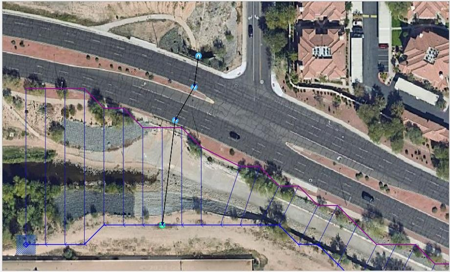
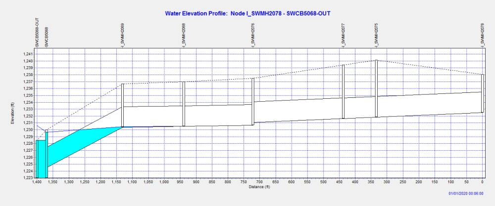
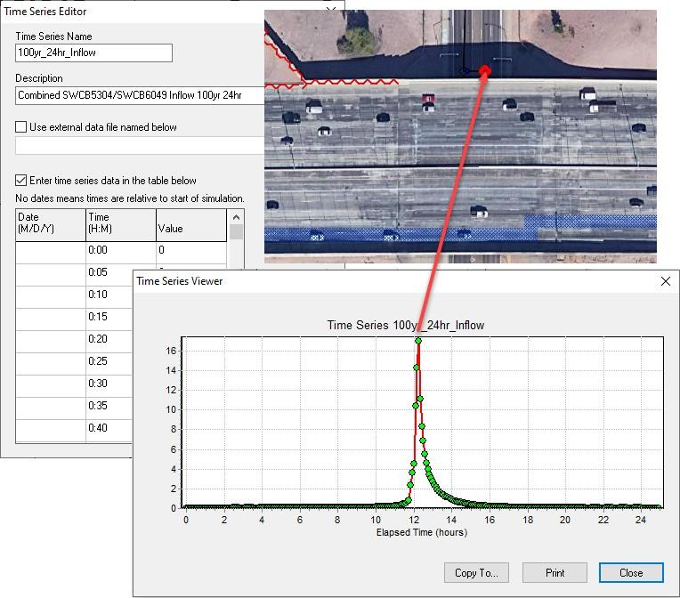
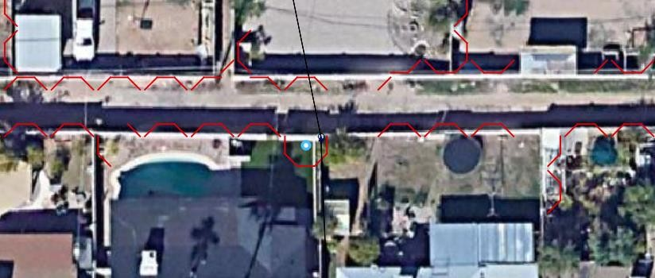

.. vim: syntax=rst

Chapter 4
---------

Guidelines Storm Drain Setup
~~~~~~~~~~~~~~~~~~~~~~~~~~~~

To build a FLO-2D project with a storm drain, it is important to create a functional surface model first.
This includes the following required components:

    - Computational domain

    - Grid elevation and roughness

    - Boundary conditions

    - Channels and culverts

    - Wall and buildings

Once the surface model is ready, the storm drain can be added to the system using the FLO-2D Plugin.
For detailed instructions including tutorials and videos, please refer to the FLO-2D Documentation website.
`https://documentation.flo-2d.com/index.html.
<https://documentation.flo-2d.com/index.html>`__ The Self-Help Kit outlines the process to set up a model and add a storm drain system to it.
Three Storm Drain Lessons and the Coastal Tutorial have storm drain systems.

Specific instructions for creating a storm drain in a FLO-2D urban environment are:

    - A storm drain inlet/outfall should not be assigned to a completely blocked cell (ARF = 1); A reasonable amount of surface area should be available for
      the storm drain feature to interact with the surface water.

    - Higher roughness values can be assigned to floodplain elements with storm drain features (inlet or outfalls) to represent the storm drain flow
      disturbance around the inlet or outfall.
      This would help surface routing numerical stability.

    - Inlet rim elevations should match the floodplain elevation.
      For an inlet rating table, the inlet discharge is zero if the floodplain water surface elevation is less than the inlet rim elevation.

    - Levees and walls may isolate a storm drain feature in the model resulting in oscillating storm drain discharge.
      A review of the inlet/outfall location may be required.

    - Storm drain features should not be assigned to surface water inflow or outflow elements.
      There is an error message generated for this conflict.

Other specific urban guidelines are listed in Table 19.

*Table 19.
FLO-2D Storm Drain Instructional Comments.*

.. list-table::
   :widths: 50 50
   :header-rows: 0

   * -
     - **Guidelines ad Instructional Comments**

   * - WSE is greater than pipe pressure head
     - Inlet discharge is computed by FLO-2D and exchanged with the storm drain system.
       FLO-2D will use

       the grid element water depth (floodplain, channel or street) and the inlet geometry to calculate

       the inlet discharge.
       Horizontal inlets refer to gutter inlets and vertical inlets are culvert or pipe openings to the

       surface.
       Floodplain grid element elevation (FPE) is automatically set to the inlet rim elevation.
       For horizontal inlets changes to FPE are reported to a file named as FPRIMELEV.OUT.
       For vertical inlets:
       - An inlet on a 1-D channel (end of segment) where the channel flow is discharging to the storm

       drain conduit, the invert
       elevation should be equal to the channel bed elevation.
       - If the flow is discharging to a storm drain conduit or culvert in a floodplain swale, the invert

       elevation should be equal to the cell floodplain
       elevation.

       The last column parameter ‘Feature’ in the SWMMFLO.DAT file has three options:

'''
      1.
       - default, no flapgate, no vertical inlet opening

      2.
       - vertical, inlet opening
      3.
       - flapgate (outlet)  ..
       If option 1 is assigned for a vertical inlet opening then there are two cases:

       - The channel pipe inlet invert elevation must be reset to the channel
       bed elevation.
       Automated runtime changes for this case do not occur.
       The user must manually implement the elevation revision.
       - Grid element elevation is reset to the pipe invert elevation at runtime.

       The corrected FPE is not revised in the FPLAIN.DAT file.
       The user must review the  FPRIMELEV.OUT modifications and rename FPLAIN_SDElev.RGH and the  TOPO_SDElev.RGH files to FPLAIN.DAT AND TOPO.DAT files
       respectively to make the elevation changes permanent.
       Rim elevations for the inlets located in channel/street cells must be verified and manually revised by the user.
       ------------------------------------------------------- The discharge and volume that enters the storm drain is based on the inlet geometry and on the
       relationship between the water surface elevation and the storm drain pressure head.
       Storm drain inflow discharge is inlet controlled until the system capacity is reached.

   * -
     - Inlet conditions:  - Curb opening inlet at grade (no sag) INTYPE=1.
       - Curb opening inlet with sag INTYPE= 2.
       - Grate (gutter) inlet with/without sag INTYPE=3.
       - Unique inlet with stage - discharge rating table or data for the generalized culvert equation INTYPE=4.
       - Manhole INTYPE=5.
       Weir/orifice equations are used to calculate the discharge for inlets 1 thru 3 and 5.
       For the rating table option (INTYPE = 4), a relationship between cell flow depth and discharge or the culvert geometry needs to be entered in QGIS.
       An additional file (SWMMFLORT.DAT) is created for these type of inlets.

   * - Storm drainpressure isgreater thanthe WSEL
     - Surcharging or return flow is computed from the storm drain to the surface water.
       ------------------------------------------------------------------------------ Not all return flow or flooding reported in the SWMM.RPT file passes
       from the storm drain to the surface water since the pressure head must be greater than the WSEL.
       ------------------------------------------------------------------------------ Return flow volume is distributed over the grid element surface area as
       an increased incremental flow depth added to the existing cell depth.
       ------------------------------------------------------------------------------ Inflow to storm drain from the surface water is not allowed in this
       case.

   * - WSE isgreater thanthe pressurehead and therimelevation
     - No return flow from the storm drain to the surface water is computed.
       ------------------------------------------------------------------------------ Volume in the inlet node stays in the pipe and the overflow volume is
       set to 0.
       ------------------------------------------------------------------------------ Inflow to the storm drain from surface water is not computed.

   * - Volumeconservation
     - Inflow to the storm drain and return volumes (flooding and outfall volumes) to the surface water are compiled and reported by the FLO-2D model.

   * - Reportingresults
     - The FLO-2D file SWMMQIN.OUT reports the inflow and return flow discharge for each inlet from and to surface.
       This is different from the discharge values reported in the SWMM.RPT file which includes lateral pipe inflow and outflow.
       SWMMOUTFIN.OUT file lists time and discharge pairs for storm drain outfall hydrographs when they discharge back to the surface water.

   * - Detentionbasin outlet
     - Flapgates can be used to stop flow from going into the storm drain system.
       Flow only goes out of the outlet.
       The SWMMFLO.DAT file assigns a switch (FEATURE) that can have one of the following values:  1.
       = default, no flap gate, no vertical inlet opening  2.
       = vertical inlet opening  3.
       = flapgate, controls outlet node discharge  4.
       = turn the computation of the reduction in inlet discharge when drop box capacity is exceeded

   * - FreeOutfalls
     - Any type of SWMM outfall can be assigned to the storm drain model.
       To discharge back to the FLO-2D surface water, the user must set the outfall to type ‘free’.
       Discharge is based on the surface water elevation and storm drain pressure head.
       Outfall discharge will occur if:  If the pressure head > WSEL: Outfall discharges to the FLO-2D grid cell.
       If the pressure head < WSEL: There is no outfall discharge, but depth is equal to WSEL.
       Flow into the outfall depends on tide gate assignment and the WSEL.
       This is available only for the ‘free’ type of outfalls.
       It does not apply to normal, fixed, tidal or time series type of outfalls.

   * -
     - When the outfall is not set up as a free outfall connected to the surface.
       The outfall does not discharge to the surface water.
       For this case, the outfall head is assigned based on the type of outfall node in the SWMM.INP file.
       The following types can be set up:  a.
       FREE: minimum between normal and critical depth.

   * -
     - b.
       | NORMAL: normal depth.

   * -
     - c.
       | FIXED: fixed stage entered in the data.

   * -
     - d.
       | TIDAL: head computed from tide stage curve.

   * -
     - e.
       | TIME SERIES: head computed from the time | series.

   * - Manholes
     - Popping a manhole cover can be simulated.
       The surcharge depth is entered in the SWMMFLO.DAT file.
       The user can define the surcharge depth in the junction properties (SWMM.inp file).
       When the surcharge depth is set to different values in  SWMMFLO.DAT and in the SWMM.inp file, the model uses the surcharge depth from the SWMMFLO.DAT.
       - If Pressure Head + Surcharge Depth < WSEL:  - Cover remains in place.
       - Inflow to the manhole is not allowed.
       - Return flow will not occur.
       - If Pressure Head + Surcharge Depth > WSEL:  - Cover is popped.
       - Surcharge depth is reset to 0.
       - Inflow to the storm drain is permitted.
       - Return flow can occur.

Default Parameters
~~~~~~~~~~~~~~~~~~

The following storm drain parameters are automatically hardwired in the FLO-2D storm drain model.
Those values written to the SWMM.inp file are automatically replaced at the beginning of the FLO-2D simulation according to the following:

    - Runoff Wet Weather (WET_STEP) and Runoff Dry Weather (DRY_STEP) timesteps.
      These watershed routing parameters are not directly used by the FLO-2D storm drain model.

    - Lengthening Step (LENGTHENING_STEP) is set as the routing timestep (ROUTING_STEP) divided by 6.
      This is hardwired in the FLO-2D storm drain code, values from SWMM.inp file will be replaced at the beginning of the FLO-2D simulation.
      This option increases the length of the shorter conduits based on the Courant-Friederick-Levy (CFL) stability criteria.
      The storm drain model bases the new equivalent pipe length on an estimate of the full flow velocity in the conduit as well as on the wave celerity.
      The full area, width and hydraulic radius are unchanged in the modified link, but the length, slope and roughness are altered.

      Length Factor = (Wave Celerity + Full Depth Velocity) \* Timestep/ Pipe Length For a Length Factor > 1:

           New Roughness= Old Roughness /Length Factor**0.5

           New Slope = Old Slope Slope/Length Factor**0.5

    - The routing model (FLOW_ROUTING) for the FLO-2D storm drain component is set as dynamic wave (DYNWAVE) to account for backwater effects, entrance/exit
      losses, flow reversal or pressurized flow.
      If the FLOW_ROUTING from the SWMM.INP is different than dynamic wave (DYNWAVE), FLO-2D will replace the routing model from the SWMM.INP with the
      dynamic wave (DYNWAVE) option.

    - The inertial term (INERTIAL_DAMPING) is set to PARTIAL or dampen (Partial=1).
      The inertial terms in the Saint Venant Equation are reduced for critical flow and ignored for supercritical flow.

    - Report Control Actions and Report Input Summary ([Report] CONTROLS and INPUT) are automatically turned on.

    - “Start Reporting on” variables (START_DATE and START_TIME) in the SWMM GUI is automatically set as Start Analysis on.
      Both the FLO-2D and the storm drain model will start reporting results at the beginning of the simulation.

    - “End Analysis on” variables (END_DATE and END_TIME) in the SWMM GUI are automatically set based on the simulation time entered in FLO-2D (CON.DAT
      file).
      The Storm Drain results (\*.RPT,\*.OUT) are automatically saved when the model simulation runs until completion.
      If the model is stopped before completion, storm drain results are written.

Initial Parameters
~~~~~~~~~~~~~~~~~~

When building the storm drain model, the following data assignments in the SWMM.inp file are recommended:

    1. It is recommended to keep the names of the various storm drain components simple, short, and uniform such as I1, I2, I3… for inlets.
       The number of characters should be less than 25.
       Use O = outlets and C = pipe conduits.
       This will simplify the graphics display of the storm drain components and make it easier to differentiate between inlets, manholes, and outlets.

    2. The END_TIME for the model duration is automatically assigned so that the END_TIME minus the START_TIME is equal to the simulation time SIMUL in the
       FLO-2D model CONT.DAT file.

    3. The ROUTING_STEP is automatically assigned as equal to the FLO-2D Timestep.
       The FLO-2D Timestep is used as the ROUTING_STEP for all conditions including a VARIABLE_STEP equal or different to zero.

.. note:: The WET_STEP and DRY_STEP values are hardcoded to 1 minute.

    4. The REPORT_START_DATE and REPORT_START_TIME are automatically assigned as the start date and time.

    5. The storm drain component reporting time (REPORT_STEP) in SWMM.inp file is recommended to be set up as equal to the FLO-2D output interval (TOUT) in
       the CONT.DAT file.
       Results for the surface water and for the storm drain will be reported with the same output timestep.
       REPORT_STEP is a mixture of hours, minutes, and seconds with the format 00:00:00.
       The unit for TOUT is hours.

Integration of a Storm Drain Network into a Complex Urban Model
~~~~~~~~~~~~~~~~~~~~~~~~~~~~~~~~~~~~~~~~~~~~~~~~~~~~~~~~~~~~~~~

Integrating a storm drain network into an urban model requires an understanding of how the storm drains will interact with the surface flow.
In the FLO-2D model, the most complex interaction occurs between the storm drain features and the 1-D channel component.
The storm drain system interfaces with channels through inlets and outfalls.
An early identification of storm drain database deficiencies can save time and effort on a project.

Storm Drain Inlet – Channel
^^^^^^^^^^^^^^^^^^^^^^^^^^^

After initial set up of the urban project, the following issues related to the storm drain inlet to channel system should be addressed:

    - Inlet locations:

      - Inlets must be inside the FLO-2D computational domain;

      - Inlets cannot be assigned to the interior channel elements;

      - Inlets that pick-up water from the street or overland should not be assigned to the channel left bank elements.

    - Inlet elevations:

      - Channels discharging to a storm drain inlet should have a invert elevation that matches the inlet invert elevation;

      - In most instances, the inlet should be set up as a vertical inlet in the SWMMFLO.DAT file using the Feature switch.

Storm drain inlets should not be assigned to an interior channel element.
If a channel discharges directly to a storm drain conduit inlet, like a culvert inlet, assign the inlet to the channel left bank element.
For this configuration, a vertical Type 4 inlet can be applied (refer to the Storm Drain Manual for details).
**Error! Not a valid bookmark self-reference.** and Figure 40 provide some additional details about setting up the inlet/channel interface.
This system shows that the bed elevation of the channel is equal to the invert elevation of the inlet.

    - Channel Bed Elevation = Bank Elevation – Depth = (299.8 – 3.5) = 296.3 ft

    - Inlet Elevation = 296.3 ft

.. image:: img/Chapter4/Chapte002.jpg

*Figure 39.
Trapezoidal 1-D Channel Discharging to a Storm Drain Inlet*

.. image:: img/Chapter4/Chapte003.png

*Figure 40.
Elevation of a Trapezoidal 1-D Channel Discharging to a Storm Drain Inlet*

Figure 41 shows a storm drain system interfacing with a channel system.
The direction of the storm drain exchange flows are based on the comparison between the water surface elevation and the pressure head which are a
function of the following:

    - Channel bed elevation = inlet invert elevation

    - Channel bank elevation = inlet rim elevation (typical design)

.. image:: img/Chapter4/Chapte004.jpg

*Figure 41.
Complex Interaction between a Storm Drain Conduit and 1-D Channel*

Storm Drain Outfall – Channel
^^^^^^^^^^^^^^^^^^^^^^^^^^^^^

To connect a storm drain outfall to a channel element the following issues should be addressed:

    - Are outfalls set up as a ‘FREE’ condition type?

    - Is the switch to discharge flow back to the surface ‘ON’ in the SWMMOUTF.DAT file?

Figure 42 shows a complex storm drain – channel system where a channel feeds the storm drain as an inlet and flow returns to surface channel
downstream.

.. image:: img/Chapter4/Chapte005.jpg

*Figure 42.
Complex Flow Exchange between a Storm Drain System and 1-D Channel*

Storm drain outfalls are assigned to the channel left bank element.
For most cases, the outfall invert elevation would be assigned to the channel element thalweg elevation.
If the coordinates in the SWMM.inp file are the left bank element channel coordinates, then the QGIS Plugin will automatically assign the outfall node
to the left bank element.
The outfall should be correctly paired to the left bank element in the SWMMOUTF.DAT (Figure 43).

.. image:: img/Chapter4/Chapte006.jpg

*Figure 43.
Typical Configuration of a Storm Drain Outfall Discharging to a Natural Channel*

The Plugin uses coordinates of the different storm drain components from the SWMM.inp file to pair them with the grid elements in the surface layer.
It is usually not necessary for the outfall coordinates in the SWMM.inp to match the left bank channel element coordinate.
The position is within the channel, the outfall will be correlated in the SWMMOUTF.DAT updating the grid element number to the closest left bank
element number (Figure 41).
The user should check every outfall to be sure it is correctly assigned to the appropriate left bank grid.
In this case, the outfall coordinates in the SWMM.inp file do not have to be replaced since the storm drain discharge calculations will not be
affected.

The bank elements in FLO-2D function as both floodplain and channel elements to facilitate the channel to floodplain exchange.
The outfall should not be assigned to the left bank floodplain element.
This causes the elevation to match the grid elevation instead of the channel elevation.
Assignment of the outfall to a right bank element, or a channel interior element will generate an error message.

*Figure 44.
Outfall Nodes Paired to Interior Channel Elements.*

The outfall invert elevation can be less than the channel thalweg elevations (underground), and the storm drain would be assumed to be underwater with
an initial tailwater depth.
The conduit should have a positive slope to the outfall.
This configuration may represent the case for a ponded surface water condition that is assigned as a ground elevation because the ponded water will
not contribute to downstream flooding.
If the outfall invert is underground (underwater), there is an option to assign an artificial head equal to the ground elevation.
It is assigned to the outfall node for the entire simulation.
This artificial head may fill the pipe, but the volume that goes into the pipe is not considered in the FLO-2D volume conservation accounting because
the grid element is dry.
The artificial volume is accounted for in the storm drain model.
When the model runs, inflow may be added to either the outfall grid element or the upstream storm drain network and the flow can go either in or out
of the outfall pipe based on the pressure head (Figure 45).
To account for volume conservation, the storm drain outflow that represents inflow volume to a FLO-2D channel is reported in the CHVOLUME.OUT file.

*Figure 45.
Underground Outfall Condition*

Water will flow in or out of the outfall pipe based on the relationship between the water surface elevation and pipe pressure head.
Water can enter the storm drain when the water surface elevation is greater than the pressure head, but it can evacuate from the storm drain if the
pressure head is above the water surface elevation.
This behavior can introduce oscillations in the system that can be explained as a respond to the surface water and storm drain pressure interaction
(Figure 46).

.. image:: img/Chapter4/Chapte009.jpg

*Figure 46.
Inlet and Outfall Pressure Head Variation Cause Pipe Discharge Oscillations*

Storm Drain Basin
^^^^^^^^^^^^^^^^^

Storm drain basins can be challenging to model because when the basin is full, the system is under pressure and the conduits and nodes feeding the
system will respond to the full basin with flow oscillations.
These oscillations are not numerical instability, they are upstream flow trying to feed the basin that is already full.
For basin modeling early builds required a flapgate.
Build 21 no longer required a flapgate but did show more fluctuations in the flow oscillations at the outfall.
Build 21 also required a grid elevation adjustment at the outfall so that the grid element elevation was adjusted to the invert of the outfall node.
Build 23 does not require a flapgate for basin outfalls or underground outfalls and flow dampening code was added to inlets to help eliminate the flow
oscillations at the full nodes and the inlet nodes connected to full conduits.
A more comprehensive documentation will be presented in Early 2024 on https://documentation.flo-2d.com on an advanced storm drain review lesson.

Storm Drain Boundary
^^^^^^^^^^^^^^^^^^^^

*Inlet*

If the storm drain crosses a boundary and there is inflow that enters the system at this boundary, it can be added as Time Series inflow to a Junction
type node.
Figure 47 shows this example of inflow coming from offsite via a node with a time series.
The invert elevation of the node and length of the conduit can be set to the real value to the feature that is off grid or across the boundary.
The FLO-2D Plugin will show an error if a node is off the grid.
Keep the features on grid but give them the invert and length of the regular system.
These nodes are not set up as inlets and do not exchange water with the grid/surface model.

*Figure 47.
Inflow Boundary at a Node.*

*Outfall*

A standard treatment for a storm drain conduit that crosses a boundary is to treat the outfall as if it has a discharge with no downstream control.
An outfall placed near the boundary is assigned a 0 to the Allow Discharge switch.
This system acts like a sink.
The discharge is reported but no water is returned to the surface model.
In this case, the outfall is Free and Allow Discharge is 0 (do not allow).

.. image:: img/Chapter4/Chapte011.png

*Figure 48.
Standard Outfall at a Boundary.*

Some boundaries can change the control of the flow of a conduit crossing a boundary.
The example in Figure 49 shows an outfall to a dry trapezoidal channel.
The channel is connected to the canal system by a closed gate.
If the gate were opened, there would be a downstream control on this system.

.. image:: img/Chapter4/Chapte012.jpg

*Figure 49.
Boundary Crossing with a Control.*

Sometimes the conduit crossing the system is artificially shortened because the boundary is too close to the node.
This can change the hydraulics of the water moving down the conduit.
Figure 49 could also represent this condition.
In this case, setting the conduit length to the length at the next node and making sure the slope is correct can help ensure the discharge is
correctly represented as the flow that crosses the boundary.

Storm Drain Walls
^^^^^^^^^^^^^^^^^

If a storm drain inlet is near a wall, an adjustment might be needed to ensure that the inlet is on the correct side of the wall.

*Figure 50.
Wall and Inlet Example.*

Storage Unit
^^^^^^^^^^^^

A storage unit can be used with FLO-2D but at this time, it must be set up using the inp file or the EPA SWMM GUI.
Set it up with a Junction Node using the FLO-2D Plugin and then convert it to a storage unit using the EPA SWMM GUI (Figure 51).

.. image:: img/Chapter4/Chapte014.jpg

*Figure 51.
Storage Unit Example.*