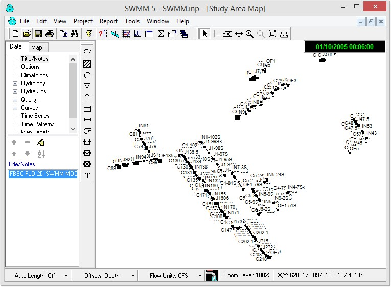
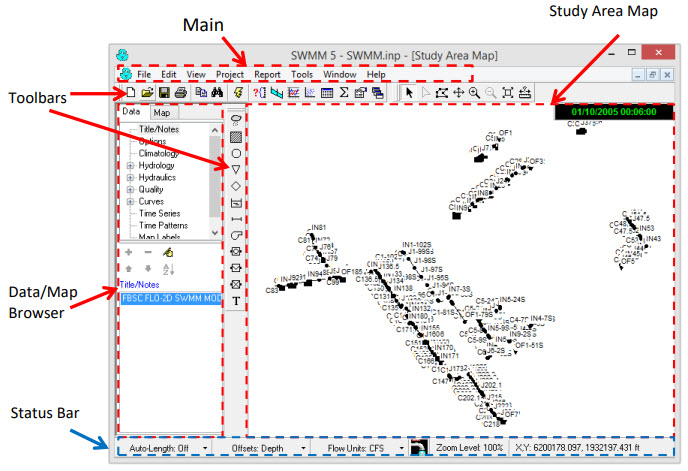
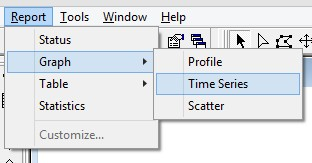
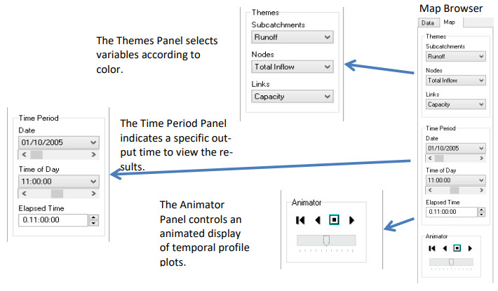

.. vim: syntax=rst

Chapter 6
~~~~~~~~~

Reviewing Storm Drain Model Results
^^^^^^^^^^^^^^^^^^^^^^^^^^^^^^^^^^^

Introduction
''''''''''''

After a FLO-2D storm drain model is complete, the results can be reviewed with both the FLO2D QGIS program and the SWMM GUI.
The QGIS displays the storm drain inflow and return flow hydrographs.
A FLO-2D storm drain simulation will generate the following files in Table 22.
A complete mapping lesson for an advanced FLO-2D Storm Drain model is available in the FLO2D Documentation site (https://documentation.flo-2d.com/).

*Table 22.
FLO-2D Storm Drain Simulation Files*

.. list-table::
   :widths: 50 50
   :header-rows: 0

   * - **Input Files**
     - **Output Files**

   * - SWMM.ini
     - SWMM.RPT

   * - SWMM.rain
     - SWMM.OUT

   * - SWMM.inp
     - SWMMOUTFIN.OUT

   * - SWMMFLO.DAT
     - SWMMQIN.OUT

   * - SWMMFLORT.DAT
     - FPRIMELEV.OUT

   * - SWMMOUTF.DAT
     - SD ManholePopUp.OUT/ ManholePop.OUT

   * - SWMMFLODROPBOX.DAT
     - UndergOUTFALLS.CHK

   * -
     - STORMDRAIN_ERROR.CHK

Step 1.
Review the SUMMARY.OUT File

After a FLO-2D simulation is completed, the SUMMARY.OUT file can be reviewed with an ASCII text editor program.
A FLO-2D model was successfully completed if the termination time and date is reported at the end of the SUMMARY.OUT:

.. image:: img/Chapter6/Chapte002.jpg

Volume exchange and conservation between the surface water and storm drain is reported in the SUMMARY.OUT file as shown below.

.. image:: img/Chapter6/Chapte003.jpg

*Storm Drain Inflow:* Reports the volume that represents inflow to the storm drain through the inlets and outfalls.

*Storm Drain Outflow from Outfalls:* Total volume of outfalls that discharge to the FLO-2D surface water and off the system.

*Storm Drain Return Flow to Surface:* Return flow to the surface water through the inlets as pressure flow.

Step 2.
View the Surface Water Data and Results in QGIS

Open the project in the FLO-2D QGIS plug-in and go to the documentation folder to review the Storm drain advance lesson.

Viewing the Storm Drain Output in the SWMM GUI
''''''''''''''''''''''''''''''''''''''''''''''

The SWMM GUI creates the storm drain data input files and graphically displays the results.
A FLO-2D storm drain simulation will generate output files that are compatible with the SWMM GUI.
To view the output, first make sure that the following files are present in the project folder:

    - SWMM.ini

    - SWMM.inp

    - SWMM.rain

    - SWMM.RPT

    - SWMM.OUT

The SWMM.RPT file reports the storm drain output data in ASCII format and can be read with any ASCII editor.
The SWMM.OUT file is a binary output file with results reported temporally and spatially that can be read by the SWMM GUI.

SWMM.ini

The storm drain results are not automatically loaded into the SWMM GUI.
To load the results, navigate to the project folder directory and open the SWMM.ini file using an ASCII text editor.

The user needs to set ‘Saved = 1” and “Current = 1” as highlighted in Figure 52.

.. image:: img/Chapter6/Chapte004.jpg

*Figure 52.
SWMM.ini File with Required Data to View the Results in the SWMM GUI*

View the Storm Drain Results

Open the SWMM GUI and navigate to the project folder.
Open the SWMM.inp file from the File >> Open menu.
This will access the model output and enable the GUI to display the results as shown in Figure 53.
The SWMM GUI has controls to label and color code the results in a variety of configurations.

*Figure 53.
Example Storm Drain Model in the SWMM GUI*

The SWMM GUI has some tools that can assist in the review of the storm drain output.
The SWMM manual should be used referenced when using the SWMM GUI.
The GUI environment is shown in Figure 54 consisting of a main menu, tool bars, study area, and working area.
These attributes and some of the options are explained briefly.

File Menu

**Open:** Opens an existing project

**Reopen:** Opens recently used projects

**Save:** Saves the current project

**Save As:** Saves the project under a different name

*Figure 54.
SWMM GUI Environment*

Edit Menu

**Select Object:** Select an object on the map.

**Find Object:** Locates a specific object by name in the map.

**Find Text:** Locates specific text in a status report.

**Group Edit:** Edits a property for the group of objects within selected region.

 View Menu

**Dimensions:** Sets reference coordinates and distance units for a study area

**Backdrop:** Allows a background image to be added, positioned, and viewed.

**Query:** Highlights objects that meet specific criteria

**Objects:** Toggles display of classes of objects

**Legends:** Controls display of the map legends **Toolbars:** Toggles display of tool bars

Project Menu

**Defaults:** Edits a project’s default properties

Report Menu

**Status:** Displays a status report for the last simulation.
The Bookmark feature enables quick review of the SWMM.RPT file sections (Figure 55).

.. image:: img/Chapter6/Chapte006.jpg

*Figure 55.
Bookmark Interface that Facilitates a Review the SWMM.RPT File*

**Graph:** Command that displays simulation results in graphical form (Figure 56.
Graph: Time Series).

*Figure 56.
Graph: Time Series Table:** Displays simulation results in tabular form\ *

Tools Menu – Commands that Provide Control Detail

**Program Preferences:** Sets program preferences, such as font sizes, deletions, number of decimal places.

**Map Control Display Options:** Sets appearance options for the Map, such as object size, annotation, flow direction arrows, and background colors
(Figure 57).

.. image:: img/Chapter6/Chapte008.jpg

*Figure 57.
Map Options*

Help Menu

**Help Topics:** Displays the Help system’s Table of Contents

**How Do I:** Displays a list of the most common operations

**Tutorial:** Presents a short tutorial introducing the user to the EPA SWMM

Study Area Map

This map is a working environment with a storm drain system.

Toolbars

Provide shortcuts to common operations and includes the standard toolbar.

Map Toolbar and Object Toolbar

Data/map browser provides access to all the data objects in a project and controls the mapping themes and time periods viewed on the study area map.

Status Bar

**Auto-length**: Indicates whether the automatic computation of conduit lengths is required.
It is recommended that the auto-length be turned ‘off” if the data is imported from a GIS database.

**Offsets**: Indicate whether the positions of links above the invert of their connecting nodes are expressed as depth above the invert or as an
offset elevation.
The FLO-2D component is configured for the depth.

**Flow units**: English or metric.
The previously entered data is not automatically adjusted for the unit system if the system is changed.

**Zoom level:** Zoom level percentage.

**XY location**: Mouse cursor coordinates.

Data Browser

The data browser has three sections (Figure 58).

    - A tree box that lists all the storm drain categories of data objects.

    - Edit buttons.

    - A list of individual objects in the selected category.

.. image:: img/Chapter6/Chapte010.jpg

*Figure 58.
SWMM GUI Data Browser Panel*

Map Browser

The map browser consists of three panels that control the results display (Figure 59).

    - Themes Panel selects variables according to color on the map.

    - Time Period Panel indicates a specific output interval to display results on the map.

    - Animator Panel controls the animation of the temporal output and profile plots.

*Figure 59.
Map Browser, Time Output Interval to View Results and Animator Controls*

Model Checklist
'''''''''''''''

The following checklist was prepared to review the storm drain data files:

    ☐ Inlet location. All inlets must be inside the FLO-2D computation domain.

    ☐ SWMM hydrology components are eliminated. If an existing SWMM model was ported

      to the FLO-2D model, all the hydrology features must be removed including
      subcatchments and rain gage features.

    ☐ Pipe lengths. If pipe lengths are less than grid element width reset them to

      the grid element width.

    ☐ Adverse pipe slope. Check adverse pipe slope for accuracy.

    ☐ Inlet elevations. The inlet rim elevation should match the grid element

      elevation. Type 4 vertical inlets should go by the invert of the headwall.
      The invert of the headwall should match the grid element elevation.
      For type 4 inlets connected to channels, the channel invert should match the
      invert headwall opening. For Type 4 horizontal inlets, the grid element should
      match the rim elevation.

    ☐ Type 4 – Defined by a Stage-Discharge Rating Table. Rating tables or

      generalized culvert equations must be assigned in the SWMMFLORT.DAT file.

    ☐ Inlet geometry. Check the size and location.

    ☐ Outfall discharge. For outfall discharge to the surface water, the outfall must have a
      “free” condition and must be turned “on” in the ``SWMMOUTF.DAT`` file.

    ☐ Outfall location. Check the outfall location with respect to the grid/channel element
      and check the invert elevation with respect to floodplain/thalweg channel elevation.

    ☐ Outfall to the channel. The outfall must be connected to the left bank grid element.

    ☐ Tide gates for outfall nodes should be assigned in the ``SWMM.inp`` file.

    ☐ Manholes. Check the assigned surcharge depth.

    ☐ Storm drain model simulation completion. Check the ``SUMMARY.OUT`` file last line
      for the time stamp indicating that the model properly terminated.

    ☐ SWMM.ini file. The ``SWMM.ini`` file should be modified to review the results.

