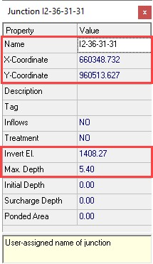
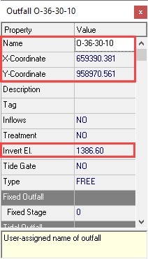
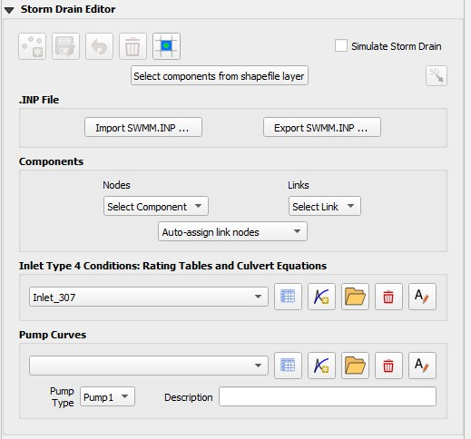

.. vim: syntax=rst

Chapter 7
~~~~~~~~~

Porting a SWMM Model to the FLO-2D Storm Drain System
^^^^^^^^^^^^^^^^^^^^^^^^^^^^^^^^^^^^^^^^^^^^^^^^^^^^^

Introduction
''''''''''''

This chapter describes the porting procedure to modify and adapt the input data for a ‘standalone’ EPA SWMM Version 5.0.022 to the FLO-2D Pro storm
drain model.
The SWMM engine was modified and integrated into the FLO-2D Pro model.
The FLO-2D storm drain model is a distinctly new model that is superior to the original EPA SWMM model.
The following data file revisions are required to convert an existing ‘stand-alone’ SWMM model to a FLO-2D storm drain model.

Porting SWMM Data Files to a FLO-2D Storm Drain Model
'''''''''''''''''''''''''''''''''''''''''''''''''''''

The modifications that must be made to the SWMM.inp file are discussed.

Rain gages

Rain gages are not required in the FLO-2D Storm Drain Model.

Subcatchments

Subcatchments are not required in the FLO-2D Storm Drain Model.

Inlets

The required data for inlets are (Figure 60):

    - Name (field): Starts with the character (‘I’ or ‘i’).

    - X-coordinate and Y-coordinate: It is required to have a spatial reference to pair FLO-2D and the ‘stand-alone’ SWMM system.

    - Invert Elevation and Maximum Depth (fields):

      - The invert elevation and maximum depth can be edited manually in the QGIS plug-in or in the SWMM GUI.
        Open the FLO-2D surface model in QGIS, go to the Storm Drain Editor, and Import SWMM.inp file, then add the data.
        o The maximum depth and the invert elevation are used to determine the rim elevation.

      - The rim elevation is compared with the FLO-2D grid element elevations.
        o These comparisons are listed in the FPRIMELEV.OUT file.
        o Ideally the elevations in the \*.inp file should match those of the grid system.

\ Required

   Fields

*Figure 60.
SWMM GUI Junction Dialog Box Showing the Required Data*

Outfalls

Outfalls are terminal nodes in the drainage system used to define final downstream boundaries.
Only a single link can be connected to an outfall node.
The required data includes (Figure 61):

    - Name (field)

    - X- and Y-coordinate: It is required to have a spatial reference to pair FLO-2D and the ‘stand-alone’ SWMM system.

    - Invert Elevation:

      - An outfall that returns flows to a channel must be assigned to the left bank.

      - An option to have an underground (underwater representing ponded flow) outfall was added in the FLO-2D storm drain.

      - This elevation can be lower than the grid element and is not reported in the FPRIMELEV.OUT file.

    - The outfall can discharge off the model.

    - Outfall Type (Figure 61):

      - Set to ‘FREE’ to exchange flow with the FLO-2D surface water system.
        o Other types such as NORMAL, FIXED, TIDAL or TIME SERIES can be assigned but the flows will not be exchanged with the surface water but will debouch
        the flow off the storm drain system.

    - Tide gate: Set to ‘NO’ for the outfalls to exchange flows with the surface water.

\ Required

   Fields

*Figure 61.
SWMM GUI Outfall Dialog Box.*

SWMM.ini

This file contains information about the model global settings and output and is saved by the QGIS plug-in and by the SWMM GUI.
To enable the display of the FLO-2D storm drain results in the SWMM GUI the user must set the following lines as follows:

[Results]

Saved=1

Current=1

SWMMFLO.DAT

This file contains the inlet geometry as well as the names/numbers that identify the paired inlet with the FLO-2D grid cells.
It is created from the SWMM.inp file by the QGIS plug-in.
To use the SWMM.inp to create the SWMMFLO.DAT, the following SWMM components must be removed from file:

    - Hydrologic processes such as time-varying rainfall, rainfall interception, evaporation, depression storage, groundwater percolation, snow accumulation
      and standing water surface.

    - Watershed processes such as infiltration trenches, streets, and swales.

    - Surface flood simulation features such as canals, culverts, and bridges.
      FLO-2D engine performs all the surface flood routing.

After the SWMM.inp file was edited, the storm drain command can be called from the FLO-2D QGIS Plug-in (Figure 62.
) create the additional Storm Drain data files, review FLO-2D Plugin User’s Manual for more details.

*Figure 62.
QGIS Plug-in Storm Drain Commands*

The FLO-2D QGIS Plug-in then locates and reads the SWMM.inp file (Figure 63.)
and loads the SWMM inlet nodes and associates them with a FLO-2D grid element.
At this point, the storm drain geometry can be entered in FLO-2D plug-in.

*Figure 63.
Reading the SWMM.inp File in QGIS.*

