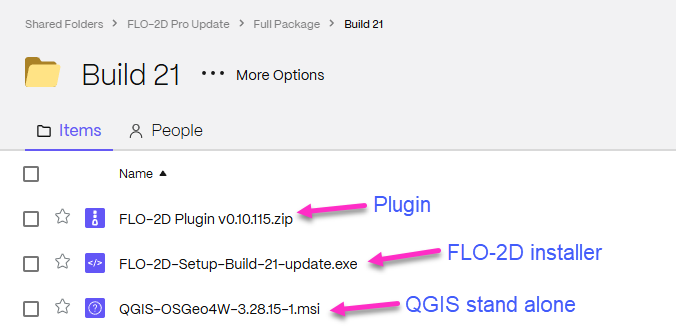

FLO-2D Pro Installation Instructions
======================================

FLO-2D is a flood routing model that simulates river, alluvial fan, urban and coastal flooding. The model
can tackle any diverse flooding problem including:

- River overbank flooding
- Watershed rainfall and runoff
- Urban flooding with street flow, flow obstruction and storage loss
- Overland tsunami/hurricane surges
- Storm drain modeling
- Mud and debris flows
- Unconfined alluvial fan flows
- Surface and groundwater interaction
- Dam and levee breach
- Tailings dam failure and volume prediction
- Flood insurance studies

.. raw:: html

    <iframe width="560" height="315" src="https://www.youtube.com/embed/3_M_YrUcg7s" frameborder="0" allowfullscreen></iframe>

Step 1: Download the Software
-------------------------------------------

FLO-2D Pro Subscribers should log into Sharefile and download the software and activator from their
FLO-2D Tech Support Account.

|ProSetup_Download|

.. |ProSetup_Download| raw:: html

   <a href="https://flo-2d.sharefile.com/" target="_blank">Download FLO-2D Pro</a>

Once the software is downloaded.  Go to Step 2.

Step 2: Run the Installer
----------------------------

Install FLO-2D using the following instructions.  Admin Rights Required.

.. image:: img/Instructions/image3.png

1. Right click zipped file to access properties.

2. Unblock the file if necessary.

.. image:: img/Instructions/image41.png

3. Double click the Setup file to run the installer.

.. image:: img/Instructions/image5.png

4. Check all options and click next.

.. image:: img/Instructions/image15a.png

5. Click Next and Install to run the installer.

.. image:: img/Instructions/image16.png

6. The Microsoft Visual C++ redistribution packages are embedded in the FLO-2D installer.  They install passively,
   but may request a restart.

Step 3: Run the Activator
----------------------------

The activator is stored in the tech support account. It requires Admin Rights to run.

.. important::

   The activator name tag is MM-YY where MM is the month and YY is the year of purchase. Don't run an activator from previous years.

|Activator|

.. |Activator| raw:: html

   <a href="https://flo-2d.sharefile.com/" target="_blank">Sharefile Login</a>

1. Download and run the activator.

.. image:: img/Instructions/inst002.png

2. Activation lasts 1 year past the purchase date.

.. image:: img/Instructions/inst003.png

3. FLO-2D uses a site license.  It can be installed and activated on any computer in the office that holds the
   license.  The license agreement is saved to the Documentation folder along with the rest of the FLO-2D Documentation.

C:\\users\\public\\documents\\FLO-2D Pro Documentation
