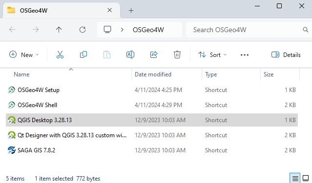
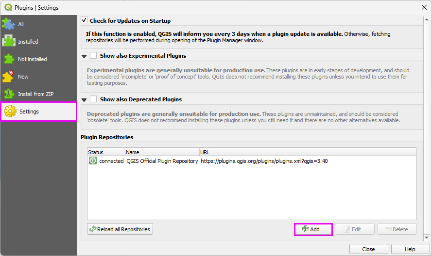
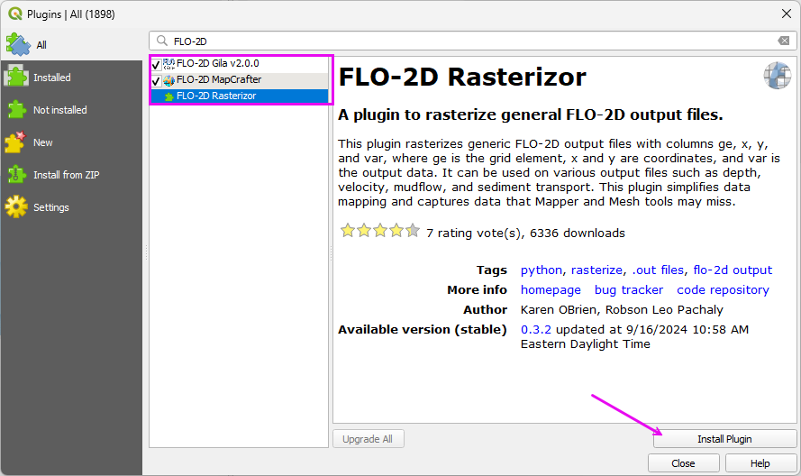

QGIS and FLO-2D Plugin Install Instructions
============================================

QGIS is an open-source geographic information system software designed for spatial data analysis and visualization.
The FLO-2D Plugin uses QGIS tools to effectively prepare FLO-2D data,
providing an enhanced modeling experience within a user-friendly environment.

Step 1: QGIS Installation
----------------------------
Choose one of the following methods:

.. dropdown:: **Option A – QGIS Latest Long-Term Release (Recommended)**

   The following method uses the OSGeo4W Network Installer to install the current QGIS LTR version and
   adds Python modules such as ``h5py`` and ``netCDF4``.

   .. container:: h3

      1. Download the OSGeo4W Installer

   .. raw:: html

      <a href="https://qgis.org/download/" target="_blank" rel="noopener noreferrer">OSGeo4W Installer</a>

   Choose the **OSGeo4W Network Installer** for 64-bit Windows.

   .. container:: h3

      2. Launch the Installer

   Run ``osgeo4w-setup.exe`` and choose **Express Installation** from the main menu.

   .. image:: img/Instructions/qgisnetwork001.png
      :width: 600px
      :class: bordered-img

   .. container:: h3

      3. Select the download site

   Choose a download site from the list provided.

   .. image:: img/Instructions/qgisnetwork006.png
      :width: 600px
      :class: bordered-img

   .. container:: h3

      4. Select Packages to Install

   Enable the following items:

   * **QGIS** (optional)
   * **QGIS (LTR)**
   * **GDAL**
   * **GRASS GIS** (optional)

   .. image:: img/Instructions/qgisnetwork023.png
      :width: 600px
      :class: bordered-img

   .. container:: h3

      5. Accept the Dependencies

   Install the dependencies when prompted.

   .. image:: img/Instructions/qgisnetwork017.png
      :width: 600px
      :class: bordered-img

   .. container:: h3

      6. Accept the License Agreements

   Accept the license agreements to continue.

   .. image:: img/Instructions/qgisnetwork018.png
      :width: 600px
      :class: bordered-img

   The installation should start. This may take some time depending on your internet connection.

   .. image:: img/Instructions/qgisnetwork019.png
      :width: 600px
      :class: bordered-img

   Click the **Finish** button when the installation is complete.

   .. image:: img/Instructions/qgisnetwork020.png
      :width: 600px
      :class: bordered-img

   .. container:: h3

      7. Install Additional Python Modules

   Run the OSGeo4W Setup program again and select **Advanced Install**.

   Click **Next** until reaching the package selection screen.

   Filter the package list by typing **h5py** in the search box.  
   Click the **Skip** button to select the latest version for installation.

   .. image:: img/Instructions/qgisnetwork011.png
      :width: 600px
      :class: bordered-img

   Repeat the process for **netCDF4**.

   .. image:: img/Instructions/qgisnetwork013.png
      :width: 600px
      :class: bordered-img

   Accept any dependencies.

   .. image:: img/Instructions/qgisnetwork024.png
      :width: 600px
      :class: bordered-img

   Click **Next** and **Finish** to complete the installation.

   .. container:: h3

      8. Verify Installation

   Search for and select the following packages:

   * ``h5py``
   * ``netCDF4``

   Run the **OSGeo4W Shell** from the Start Menu.

   .. image:: img/Instructions/qgisnetwork026.png
      :width: 600px
      :class: bordered-img

   Run the following commands inside the OSGeo4W Shell:

   ::

      python -c "import h5py; print('h5py:', h5py.__version__)"
      python -c "import netCDF4; print('netCDF4:', netCDF4.__version__)"

   A version number indicates a successful installation.

   .. image:: img/Instructions/qgisnetwork025.png
      :width: 600px
      :class: bordered-img

.. dropdown:: **Option B – QGIS Stand Alone Older Versions**

   Follow these instructions to set up an older version of QGIS. 

   Get an old stand alone installer from the QGIS download archive:

      .. raw:: html

         <a href="https://download.osgeo.org/qgis/win64/" target="_blank" rel="noopener noreferrer">QGIS Installer Archive</a>
   
   
   .. note:: The images reference QGIS version 3.34 and 3.28 but the steps are the same for any stand alone version of QGIS.
      
   .. image:: img/Instructions/archive.png
      :width: 600px
      :class: bordered-img
   
   1. Double click the QGIS installer.

   2. Finish installing with the default settings.

   .. image:: img/Instructions/image8.png
      :width: 600px
      :class: bordered-img

Step 2: QGIS Setup Profile
--------------------------------------------

.. _flo2d_plugin_step:

Build a QGIS User Profile by following these steps:

.. important::

   This step should be performed by the End User.  If it is done on an Admin account, the profile will only be 
   available on the Admin account.

1. Open QGIS. Any version newer than 3.30 should work.

2. Click **Settings → Options**.

.. image:: img/Instructions/image13.png
   :width: 600px
   :class: bordered-img

3. Click the **CRS** tab and set the options shown below.

.. important:: This step is critical for the FLO-2D Plugin to function properly.

.. image:: img/Instructions/image14.png
   :width: 600px
   :class: bordered-img

Step 3: Install FLO-2D Plugin
-------------------------------

.. warning:: Restart QGIS at the conclusion of Step 3 to **Save** the User Profile.

1. Add the FLO-2D Plugin Repository. Copy this link to the clipboard. Ctrl-C.

   ``https://flo-2dsoftware.github.io/FLO-2D-Plugins/plugins.xml``

2. Open to the Plugin Manager and Find the Settings tab.

3. Click the Add button to add the FLO-2D Plugin Repository.

4. Fill the form with the repository URL and click OK.

.. image:: img/Instructions/qgisplugin002.png
   :width: 600px
   :class: bordered-img

5. Install the FLO-2D Plugins.

   Switch to the All Plugins tab and filter the list with "FLO-2D".

   Install the following plugins:

Step 4: Recommended Plugins
-----------------------------------

1. These additional plugins are helpful for FLO-2D Model Development.

2. These plugins can be installed from the **All Plugins** menu:

   - Quick Map Services  
   - Profile Tool  
   - Curve Number Generator
   - Manning's Roughness Generator
   - Street View
   - QuickOSM

.. image:: img/Instructions/qgisplugin004.png
   :width: 600px
   :class: bordered-img

3. Quick Map Services requires an additional step.

   Click the QMS icon → Settings → More Services → **Get Contributed Pack**.

.. image:: img/Instructions/image15.gif
   :width: 600px
   :class: bordered-img

This concludes the installation and setup.  Please restart QGIS to save the profile.
Tutorial data is located here:

``C:\Users\Public\Documents\FLO-2D PRO Documentation\Example Projects\QGIS Tutorials``

.. image:: img/Instructions/image9.png
   :width: 600px
   :class: bordered-img

Setup Older FLO-2D Plugins (Optional)
---------------------------------------

Older versions of the FLO-2D Plugin can be downloaded from the following link:

   .. raw:: html

      <a href="https://flo-2d.com/qgis-plugin/" target="_blank" rel="noopener noreferrer">Download FLO-2D Plugin</a>

.. note::
   A dedicated QGIS User Profile is recommended when working with older versions of the FLO-2D Plugin.

1. Open QGIS and access the **Settings** menu.
2. Select **New Profile**.

.. image:: img/Instructions/qgisplugin005.png
   :width: 600px
   :class: bordered-img

3. QGIS loads in a default state. All required settings must be configured for the new profile.

.. image:: img/Instructions/qgisplugin006.png
   :width: 600px
   :class: bordered-img

4. Add the required previous build of the FLO-2D Plugin by opening the **Plugin Manager**.
5. Select the **Install from ZIP** tab.
6. Navigate to the downloaded ZIP file and select the plugin.
7. Accept the security warning when prompted.

.. image:: img/Instructions/qgisplugin007.png
   :width: 600px
   :class: bordered-img

.. note::
   The FLO-2D plugin toolbar now reflects version 0.10.115.

Return to :ref:`Step 2 <flo2d_plugin_step>` to complete the QGIS setup and install any additional required plugins.
