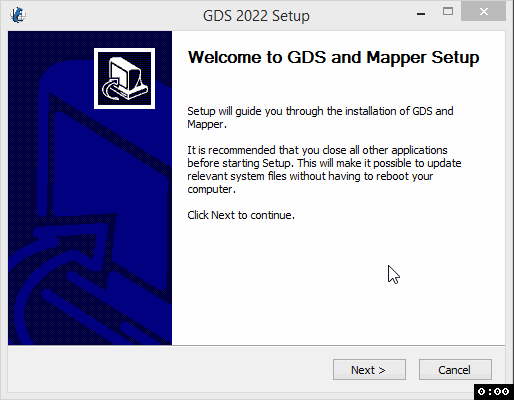
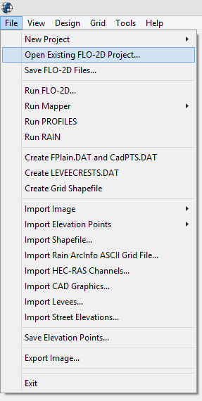
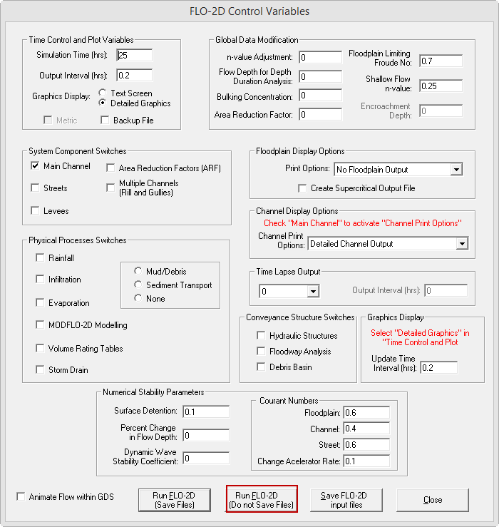

GDS - Mapper Install Instructions
======================================

.. raw:: html

    <iframe width="560" height="315" src="https://www.youtube.com/embed/voexru-EWjg" frameborder="0" allowfullscreen></iframe>

Step 1: Download the GDS-Mapper Installer
-------------------------------------------

FLO-2D Pro Subscribers should log into FLO-2D.ShareFile.com and download the GDS-Mapper installer from their
FLO-2D Tech Support Account.

|ProSetup_Download|

.. |ProSetup_Download| raw:: html

   <a href="https://flo-2d.sharefile.com/" target="_blank">ShareFile Login</a>

.. important:: GDS and Mapper are old processor programs.  It may be challenging to install them on Modern Windows
               systems.  If any installation errors show up, try the **Ignore** option or see the Troubleshooting
               section.

1. Go to FLO-2D Pro Update >> Processor Programs >> GDS Mapper Installer and download the file GDS-Mapper-Setup.exe.

.. image:: img/Instructions/inst004.png

Step 2: Run the Installer
-------------------------------

1. Run the file with Admin Rights.

2. If the installation fails or GDS/Mapper wont run, there are work around instructions in the Troubleshooting section.

Step 3: Test GDS
----------------------------------

1. Open GDS and open a project.

2. Load a Project.  Barn Mudflow is the fastest test.

.. image:: img/Instructions/gdstest002.png

3. Click OK to load the components.

.. image:: img/Instructions/gdstest002a.png

4. Street Errors??? Click OK or Enter key to close all of the Street error messages.
   FLO-2D seems OK with the streets but GDS
   doesn't like them.

5. Click the Select grid elements with a polygon button.

6. Click YES to create a grid layer.

7. Click 3 vertices to draw a simple polygon and double click to close.

.. image:: img/Instructions/gdstest001.gif

8. If no error message appears and some grid elements turn green, the test passed.

9. If error messages appear, review the Troubleshooting Section page on the left sidebar.

Step 4. Run the model
------------------------

1. Click File Run FLO-2D.

2. Select the Run Do Not Save option.

3. If the Blue Message says PROFESSIONAL LICENSE, the computer is activated.

4. If it says Basic, see FLO-2D Pro Install Instructions to run the activator.

.. image:: img/Instructions/gdstest004.png

5. When the model is finished, close the run.

.. image:: img/Instructions/gdstest005.png

Step 5. Run the Mapper test
-------------------------------

1. From the GDS File Menu, open Mapper Pro.

.. image:: img/Instructions/gdstest006.png

2. From the Mapper File Menu, Read FLO-2D Results...

.. image:: img/Instructions/gdstest007.png

3. Load FPLAIN.DAT from the file window.

.. image:: img/Instructions/gdstest008.png

4. Load a few maps to test Mapper.

.. image:: img/Instructions/gdstest009.png

5. If no error messages appeared, Mapper is intsalled correctly.

6. If error messages appeared, see the Troublehsooting Section on the left sidebar.

