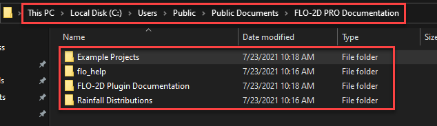

Install QGIS and the FLO-2D Plugin
============================================

QGIS is an open-source geographic information system software designed for spatial data analysis and visualization.
The FLO-2D Plugin uses QGIS tools to effectively prepare FLO-2D data,
providing an enhanced modeling experience within a user-friendly environment.

Step 1: QGIS Installation
----------------------------
There are options for installing QGIS. Choose one of the following methods:

.. dropdown:: **Option A – QGIS Latest Long-Term Release (Network Installation)**
   
   The following method uses the OSGeo4W Network Installer to install the current QGIS LTR version adds 
   Python modules such as ``h5py`` and ``netCDF4``.
   
      .. container:: h3

         1. Download the OSGeo4W Installer:

   .. raw:: html

      <a href="https://qgis.org/download/" target="_blank" rel="noopener noreferrer">OSGeo4W Installer</a>
   
   Choose the **OSGeo4W Network Installer** for 64-bit Windows.

      .. container:: h3

      2. Launch the OSGeo4W Network Installer

   Run ``osgeo4w-setup.exe`` and choose **Express Installation** from the main menu.

   .. image:: ../img/Instructions/qgisnetwork001.png

      .. container:: h3

      3. Select the download site.

   Choose a download site from the list provided. Any site can be used.

   .. image:: ../img/Instructions/qgisnetwork006.png
   
   .. container:: h3

      4. Select Packages to Install

   Enable the following items:

   * **QGIS** (optional)
   * **QGIS (LTR)**
   * **GDAL**
   * **GRASS GIS** (optional)

   .. image:: ../img/Instructions/qgisnetwork023.png

      .. container:: h3

      5. Accept the Dependencies
   
   Install the dependencies when prompted.

   .. image:: ../img/Instructions/qgisnetwork017.png

         .. container:: h3

      6. Accept the License Agreements
   
   Install the dependencies when prompted.

   .. image:: ../img/Instructions/qgisnetwork018.png

   The installation should start. This may take some time depending on 
   your internet connection.

   .. image:: ../img/Instructions/qgisnetwork019.png

   Click the **Finish** button when the installation is complete.

   .. image:: ../img/Instructions/qgisnetwork020.png

   .. container:: h3

      7. Install Additional Python Modules
   
   Run the OSGeo4W Setup program again and select **Advanced Install**.

   Click next until you reach the package selection screen. (Everything else should be default.)

   Filter the package list by typing **h5py** in the search box. Click the Skip text to select the 
   latest version for installation.

   .. image:: ../img/Instructions/qgisnetwork011.png

   Repeat the process for **netCDF4**.

   .. image:: ../img/Instructions/qgisnetwork013.png

   Accept any dependencies.

   .. image:: ../img/Instructions/qgisnetwork024.png

   Click Next and Finish to complete the installation.

      .. container:: h3

      8. Verify Installation

   Search for and select the following packages:
   * h5py 
   * netCDF4

   Run the OSGeo4W Shell from the Start Menu.

   .. image:: ../img/Instructions/qgisnetwork026.png

   Run the following commands inside the OSGeo4W Shell:

   ::

      python -c "import h5py; print('h5py:', h5py.__version__)"
      python -c "import netCDF4; print('netCDF4:', netCDF4.__version__)"

   A version number indicates a successful installation.

   .. image:: ../img/Instructions/qgisnetwork025.png

.. dropdown:: **Option B: QGIS Stand Alone Installation Older Versions**

   Follow these instructions to set up a older version of QGIS.  
   
   .. note:: The images reference QGIS verison 3.28 but the steps are the same for any stand alone version of QGIS.

   1. Double click the QGIS-OSGeo4W-3.28.11-1.msi file.

   2. Finish installing with the default settings.

   .. image:: ../img/Instructions/image8.png

   3. Open QGIS.

   .. image:: ../img/Instructions/Worksh002.png

   4. Click Settings/Options

   .. image:: ../img/Instructions/image13.png

   5. Click the CRS tab and set the options as shown below.  Use CRS from first layer added.  Use Project CRS.  Click OK to
      close the window.

   .. image:: ../img/Instructions/image14.png

Step 2: FLO-2D Plugin
----------------------
With QGIS installed it is time to add the FLO-2D plugin and a few other handy plugins.

1. Navigate to the plugin manager.

.. image:: ../img/Instructions/image10.png

2. Install the FLO-2D Plugin from a zip file.

3. Plugin Location C:\\Users\\Public\\Documents\\FLO-2D PRO Documentation\\QGIS Plugins

.. image:: ../img/Instructions/image12a.png

Step 3: Additional Plugins
----------------------------

1. These are also some recommended plugins.  Install them using the All Menu.

- FLO-2D Rasterizor
- FLO-2D MapCrafter
- Quick Map Services
- Profile Tool
- Curve Number Generator

.. image:: ../img/Instructions/image11.png

2. Quick Map Services requires one more step.  Click Quick Map Services icon and click Settings.
   On the settings window, go to More Services and click Get Contributed pack.  On the Visibility window, uncheck the
   unwanted maps.  Watch this Gif to see the process.

.. image:: ../img/Instructions/image15.gif

This concludes the installation and setup.  The tutorial data is here:

C:\\Users\\Public\\Documents\\FLO-2D PRO Documentation\\Example Projects\\QGIS Tutorials

Step 4: Installing a Missing Python Module
------------------------------------------

Some QGIS installations may not include certain Python modules that FLO-2D
tools rely on, such as ``matplotlib``. If a script fails to run due to a
missing module, it can be installed using the OSGeo4W Shell.

Follow these steps:

1. Open the **OSGeo4W Shell** created during the QGIS installation.

2. Install the missing module using ``pip``.  
   For example, to install ``matplotlib``:

   .. code-block:: bat

      pip install matplotlib

3. Close and restart QGIS to activate the new module.

If additional modules are missing (such as ``numpy`` or ``pillow``),
install them using the same method.

