Channel
=======

**Overview**

Use this training module to build an urban drainage channel by digitizing the channel components.  Finish it up by
adding tide gates and boundary conditions to the channel.

Required Data

All data is provided in the Lesson folders.

======== ======================
**File** **Content**
======== ======================
\*.shp   Left bank
\*.shp   Right bank
\*.shp   Cross sections
\*.shp   Points
\*.txt   Tide gate tables
======== ======================

Path:  ...\\Coastal 2D Training\\Project Data\\Channel

.. raw:: html

    <iframe width="560" height="315" src="https://www.youtube.com/embed/ezubMQuwNKU" frameborder="0" allowfullscreen></iframe>

Step 1: Prepare the map
_________________________

1. Use Quick Map Services to load an aerial image onto the map.

.. image:: ../img/Advanced-Workshop/adv/Lesson005.png

.. image:: ../img/Coastal/chan003.png

2. Make sure the Elevation Raster layer is checked on and if necessary change symbology to Hillshade.

.. image:: ../img/Coastal/chan001.png

Step 2: Load the data
______________________________

1. Click the Channel group in the User Layers.

2. Drag the channel shapefiles onto the map.

.. Important:: The channel templates may be slightly different in the data vs the lesson.  I tried to update the
   file names so it would be obvious that the imported data is a template.  I also tried to reduce the final number of
   cross sections.  The templates are not necessary on a real project, they serve to keep the class moving quickly.

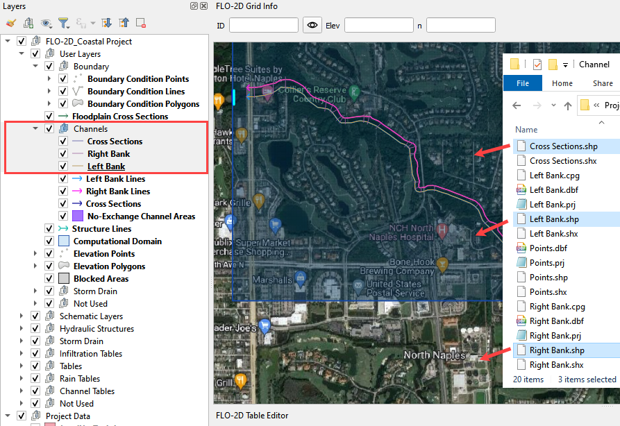

Step 3: Left bank digitize
______________________________

1. Click the newly imported Left Bank layer. It will be copied into the official layer.

2. Click the select features tool and drag the mouse over the left bank feature to select the line.

3. Ctrl-C will copy the line.

4. Click the official Left Bank Lines.

5. Click the Edit Pencil button and Ctrl-V to paste the line into the Left Bank Lines layer.

6. Save the Left Bank Lines layer and untoggle the Editor Pencil.

7. Watch the animated image for a demo.

.. image:: ../img/Coastal/copyleftbank.gif

Step 4: Right bank digitize
______________________________

1. Click the newly imported Right Bank layer.  It will be copied into the official layer.

2. Click the select features tool and drag the mouse over the right bank feature to select the line.

3. Ctrl-C will copy the line.

4. Click the official Right Bank Lines.

5. Click the Edit button and Ctrl-V to paste the line into the Right Bank Lines layer.

6. Save the Right Bank Lines layer and untoggle the Editor Pencil.

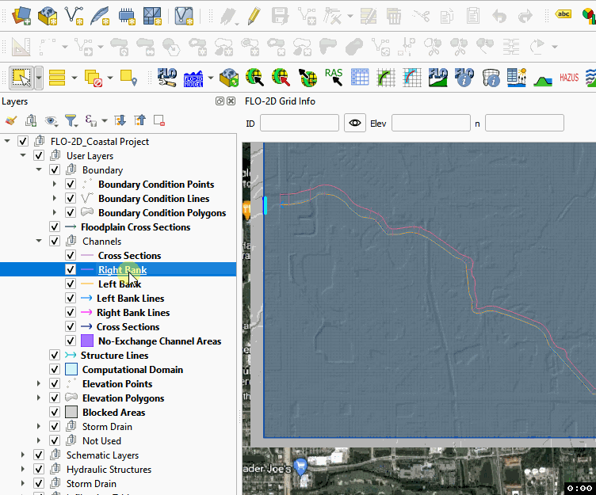

Step 5: Cross sections digitize
_________________________________

.. note:: Digitize the cross sections in order from upstream to downstream.

1. Zoom in on the southeast corner of the map.

.. image:: ../img/Coastal/chan004.png

2. Uncheck the Grid layer in the Schematized Layers Group.

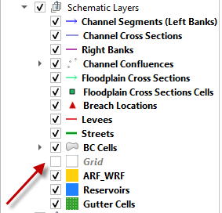

3. Go to the Channel Data group and double click the *imported* Cross Sections layer.

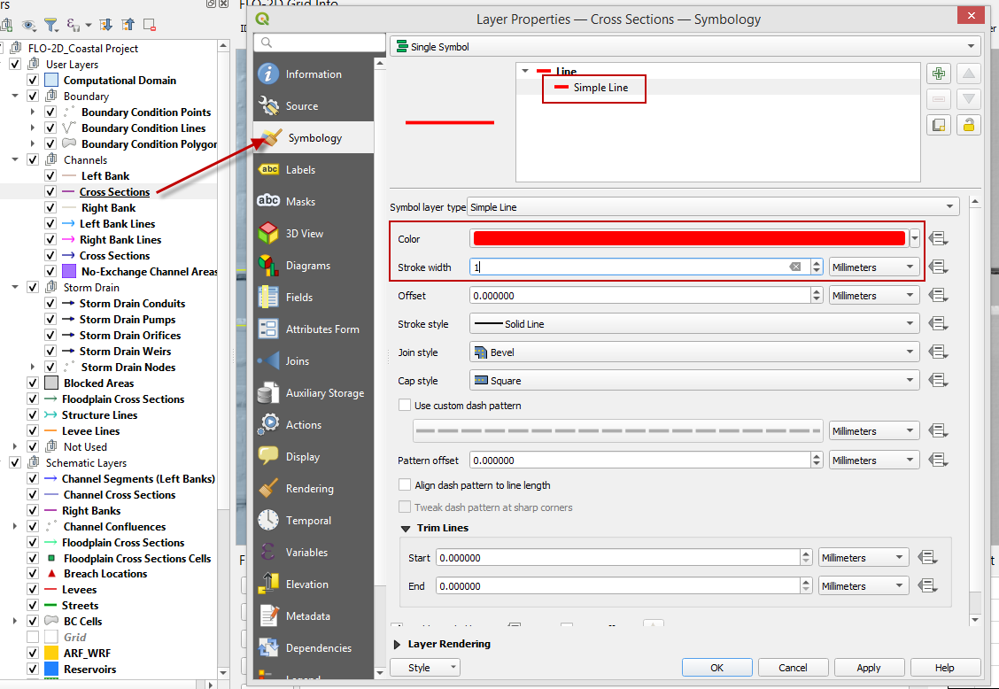

4. Click Symbology and Click Simple Line.  Set the color to red and the stroke width to 1.  Click OK to close the
   window.

.. image:: ../img/Coastal/chan005.png

5. Add the Snapping toolbar.  Right click the toolbar area and check the Snapping toolbar.

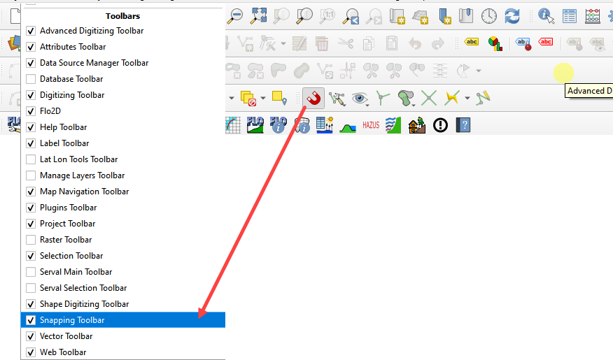

6. Click the Config button and set it to Advanced Configuration.

7. Click the eye button and set the active layer to Cross Sections.

.. image:: ../img/Coastal/snappingoptions.gif

7. Collapse the FLO-2D widgets and click Cross Sections Editor.

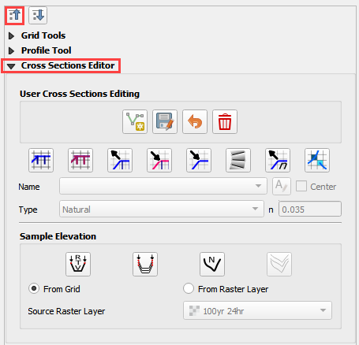

8. The first cross section has important restrictions.

   -  The line must cross the left bank line

   -  The line must start in the same cell as the left bank line.

   -  The line must cross the right bank line.

   -  The line must start in the same cell as the right bank line.

9. Click the Add Cross Section Lines button on the Cross Section Editor.

.. image:: ../img/Coastal/chan007.png

10. Digitize all 32 cross sections using process shown the following animation.  Use the red lines as guides.

    a. Left click the south side

    b. Left click the north side

    c. Right click to close

    d. Click OK or use the Enter key to close attributes window

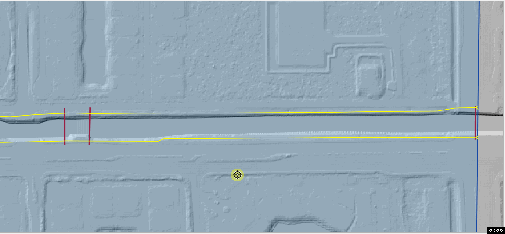

11. Handy digitizing features:

    - Left click to drop a point.  Right click to close a polyline

    - Rotate the scroll wheel to zoom in and out.

    - Click and hold the scroll wheel to pan while in editing mode.

    - Use the delete key to delete the last point created.

    - Use the Esc key to cancel the polyline.

    - The point won’t drop until the mouse button is released.

    - Redo and undo have limited functionality and can be useful.

12. Once the last cross section is complete.  Click the Save icon on the Cross Sections Editor.

.. image:: ../img/Coastal/chan009.png

13. Remove the unofficial channel layers from the layers list.  Right click them and click Remove.

.. image:: ../img/Coastal/chan010a.png

14. The final cross sections should look like something like this:

.. image:: ../img/Coastal/chan010.png

Step 6. Cross section attributes
__________________________________

1. Go to the User layers group.  Right click the Cross Sections layer and click Open Attribute Table.

2. Click the Edit pencil.

3. Set the field to fcn.

4. Set the n value to 0.03.

5. Click Update All.

6. Click Save button and turn off editor.

7. Close the table.

.. image:: ../img/Coastal/chanattrib.gif

8. Methods to determine the urban channel geometry.

   a. As-built files are the first source of data but not available in all cases.

   b. Survey channel cross sections.

   c. Sample elevation data from a LiDAR raster. (This method only works if the channels are dry.)

   d. Measure and estimate channel geometry with QGIS tools.

Step 7: Load cross section data
_________________________________

.. raw:: html

    <iframe width="560" height="315" src="https://www.youtube.com/embed/Di5yDHg1fUk" frameborder="0" allowfullscreen></iframe>

1. From the Cross Section Editor, choose Cross-Section-1.

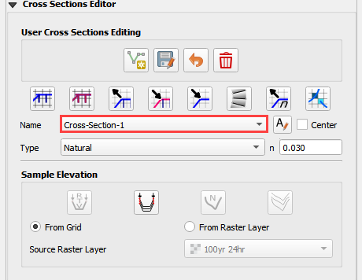

2. Open the corresponding cross section text file.

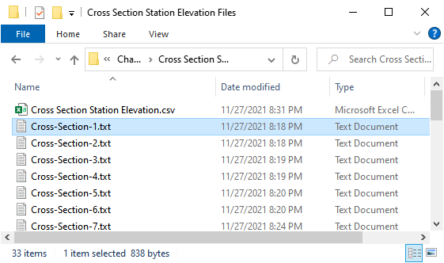

Path: ...\\Coastal 2D Training\\Project Data\\Channel\\Cross Section Station Elevation Files

3. Copy the data and close the text file.  Tip: Hold down the Ctrl key and press A C W keys.

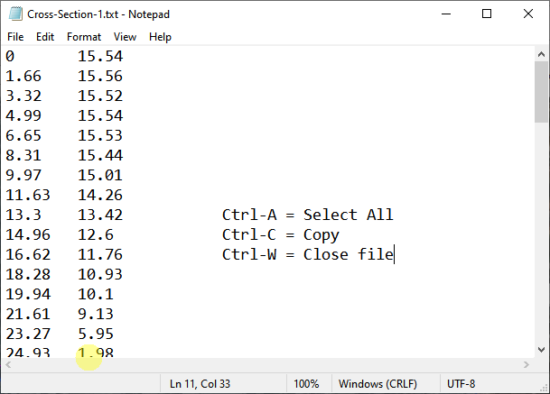

4. Click the first cell of the of the FLO-2D Table Editor and click the Paste button.

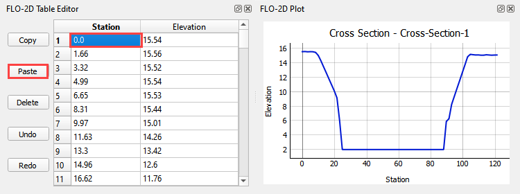

5. Repeat this process for all 32 cross sections.

Step 8: Schematize channel
______________________________

.. note:: If any of the following procedure needs to be repeated, always return to this Schematize step to reset
          the data before trying to modify anything.  It is a reset button and it is very important.

1. Click Schematize channel.

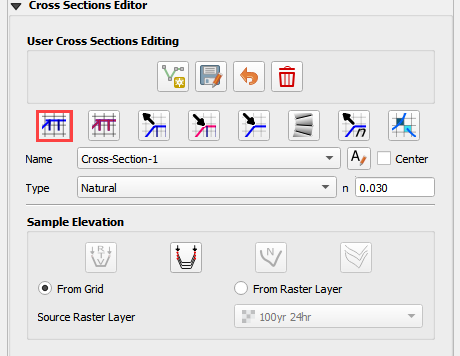

2. If the channel schematizing process was successful, the following messages will appear.
   Click Yes and Close.

.. image:: ../img/Coastal/chan016.png

3. If an error message appears.  Ask the instructor for help.

Step 9: Review bank alignment
______________________________

Channel alignment in urban projects can be important because channels are usually squeezed between features like
buildings, walls, and streets.  In this image, the right bank right along the houses.  Recheck the banks after adding
buildings.

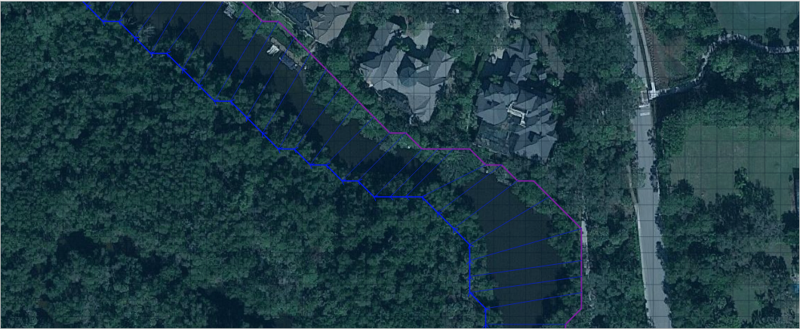

It is simple to make minor corrections to the left bank lines, right bank lines, and cross sections to realign
the channels.

1. In the User Layers group, turn on the Editor Pencil for Left Bank Lines, Right Bank Lines, and Cross Sections.

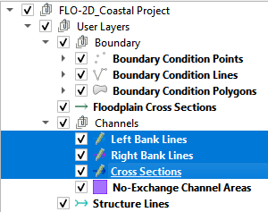

2. Set the Vertex Tool to All Layers.

.. image:: ../img/Advanced-Workshop/adv/Lesson033.png

3. Reposition the left or right bank so that it is better aligned with the right side of the channel.

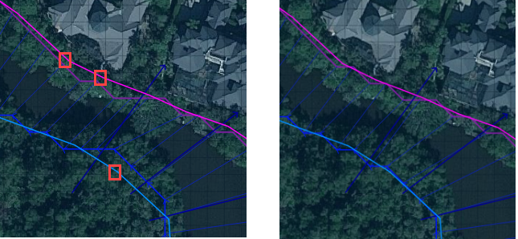

4. Click the Schematize button to adjust the Schematized Channel layers.  Click Yes and Close to close the windows.  In
   This case, hitting the enter button twice will be faster.

.. image:: ../img/Advanced-Workshop/adv/Lesson035.png

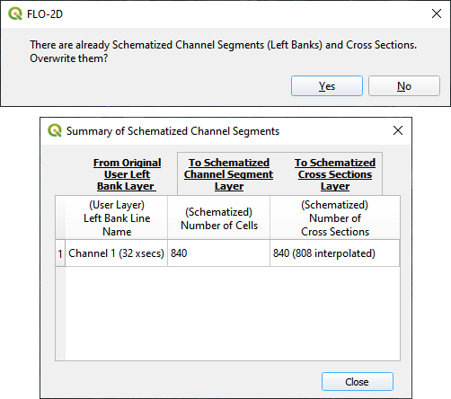

5.  Always finish by clicking the schematize button to ensure the final edits were updated.

6. Once the final edits are complete, save and close the editors for the User Layers.

Step 10: Interpolate the channel
_________________________________

N type channels are interpolated using the Interpolator.exe program.
This method will outline how to call the interpolator and reload the data.

.. raw:: html

    <iframe width="560" height="315" src="https://www.youtube.com/embed/5CrrcZATtxk" frameborder="0" allowfullscreen></iframe>

.. note:: If this process needs to be repeated for any reason, click Schematize button before performing this
          step.

1. Click the Create CHAN.DAT, XSEC.DAT, AND CHANBANK.DAT button.

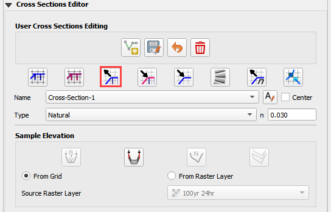

2. Select the folder where the \*.DAT files will be saved.

Path: ...\\Coastal 2D Training\\Project Data\\Channel Interpolate Test

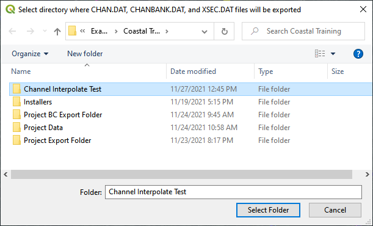

3. The first action saves the channel data.
   Click OK to close the message.

.. image:: ../img/Coastal/chan026.png

4. The second action calls the Interpolate.exe program from the FLO-2D Pro folder.  Click Interpolate.

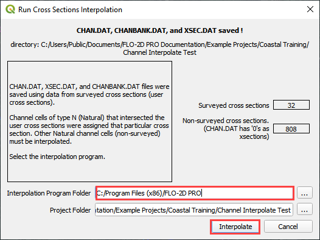

5. If the interpolation is performed correctly the following message will appear.
   Click Import CHAN.DAT and XSEC.DAT to update the channel data in QGIS.

.. image:: ../img/Advanced-Workshop/adv/Lesson048.png

6. Click the OK icon when the process is finished.

.. image:: ../img/Advanced-Workshop/adv/Lesson049.png

7. The channel is now complete.  The data will be saved to the CHAN.DAT, CHANBANK.DAT, and XSEC.DAT files.

Step 11: Channel boundary condition
___________________________________

The boundary condition for this channel include a hydrograph at the upstream side and a tide stage control at the
downstream side.

.. raw:: html

    <iframe width="560" height="315" src="https://www.youtube.com/embed/5CrrcZATtxk" frameborder="0" allowfullscreen></iframe>

Inlet
^^^^^

1. Zoom to the first channel element on the southeast corner of the map.

.. image:: ../img/Coastal/chan025.png

2. Uncheck the visibility of the User Layers Left Bank Lines, Right Bank Lines, Cross Sections.

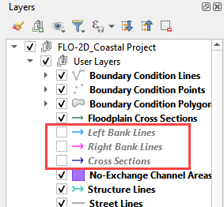

3. Collapse the FLO-2D Widgets and expand the Boundary Condition Editor.

.. image:: ../img/Coastal/chan029.png

4. Click the Add point BC button, click the first left bank cell of the channel and click OK.

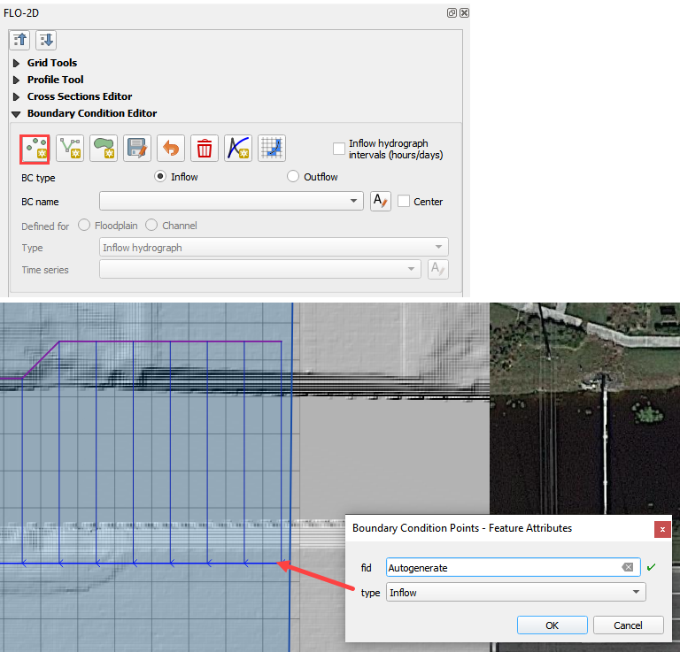

5. Click Save on the Widget and OK to close the message.

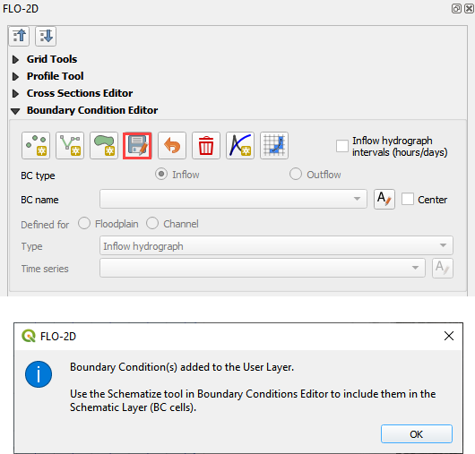

6.  Check the Inflow radio button and change the BC name of the inflow to CocoIn

7.  Set Defined to Channel

8. Name the new Time Series to 24hr100yr.

.. image:: ../img/Coastal/chan031.png

9. Open the hydrograph file in Notepad and copy the data.

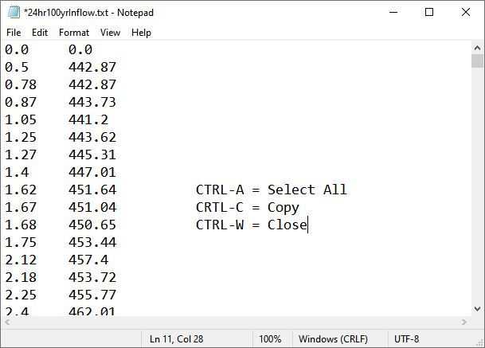

Path: ...\\Coastal 2D Training\\Project Data\\Boundary Conditions\\24hr100yrInflow.txt

10. Place the cursor in the first cell of the Table and click Paste.

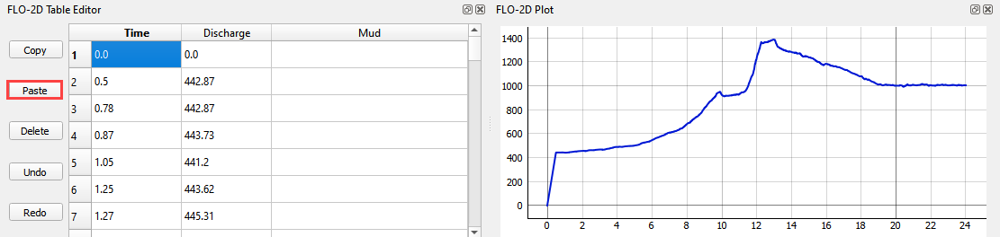

11. Click the Schematize button the boundary conditions and click OK to close the message.

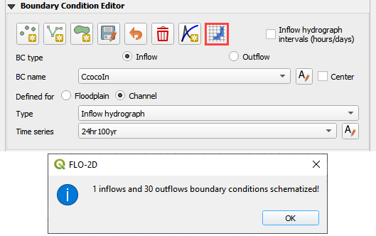

12. The inflow boundary is now complete. The data will be saved to the INFLOW.DAT file.

Outlet
^^^^^^

1. Zoom to the end of the channel.

2. Nothing is required in this location because the channel terminates upstream of the boundary.  It will exchange water
   with the floodplain as the tide goes up and down.

3. The following image has is an overlay of the last cross section and the tide table.

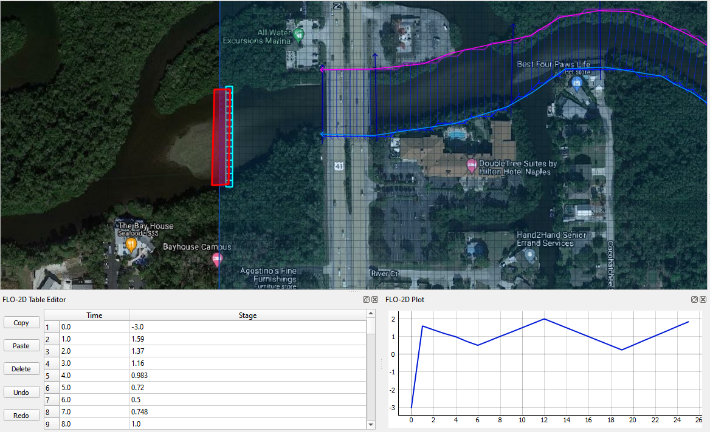

Step 12: Tide gates
______________________________

Two gated weirs are in the Cocohatchee canal.

.. image:: ../img/Coastal/chan036.png

1. Zoom to the first tide gate COCO1 to the West.

.. image:: ../img/Coastal/chan037.png

2. Collapse the FLO-2D widgets and click Structures Editor.

.. image:: ../img/Coastal/chan038.png

3. Digitize the first culvert by clicking on the upstream left bank element and downstream left bank element of the
   channel.  Right click to complete the line and click OK to close the Structure Line attribute box.

.. image:: ../img/Coastal/chan039.png

4. Move upstream to the East and create the second structure.

.. note:: Pan while editing: Use the arrow keys or click and drag the map with the mouse wheel.

          Zoom while editing: Roll the mouse wheel to zoom.

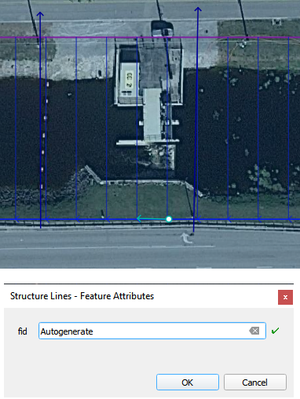

5. Click Save on the Structure Editor.  Fill out the data for each structure.

   -  Name the culverts Coco1, Coco2

   -  Type \= Channel

   -  Rating \= Rating table

   -  Tailwater condition is Allow Upstream Flow.

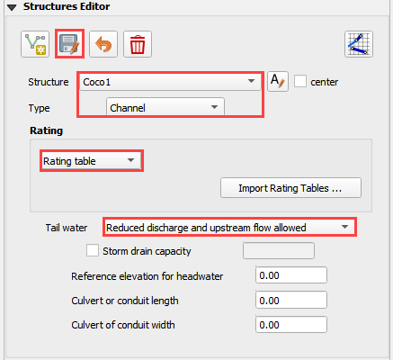

6.  Click the Import Rating Tables button

.. image:: ../img/Coastal/chan042.png

7.  Navigate to the Rating Tables files, select both tables and click Open.

Path: ...\Coastal 2D Training\\Project Data\\Weirs

.. image:: ../img/Coastal/chan043.png

8. The data was loaded into the FLO-2D Table Editor for the active structure.  Select a structure to refresh the plot.

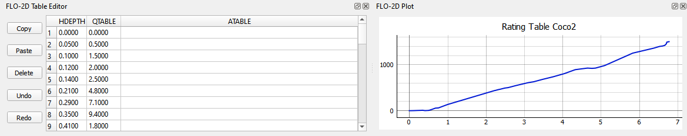

9. Click Schematize to write the data to the schematic layers.

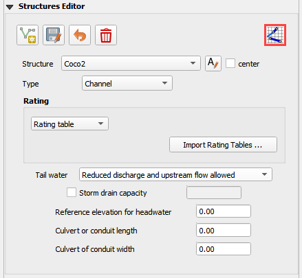

10. The hydraulic structures are now ready.  The data will be saved to the HYSTRUCT.DAT file.

Step 13: Export the project
______________________________

1. Click the Setup Control Parameters icon.

.. image:: ../img/Coastal/chan047.png

2. Check the boxes for Main Channel and Hydraulic Structures and click Save.

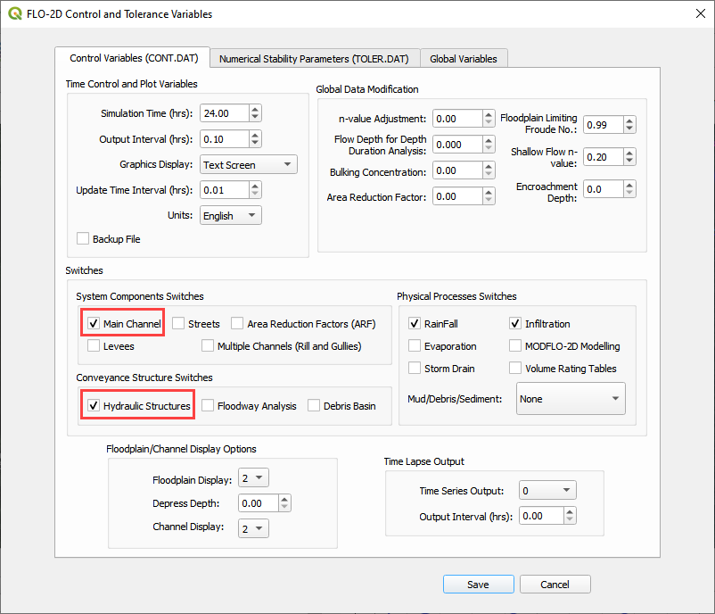

4. Click the Export button for the FLO-2D Data files.
   Click OK.

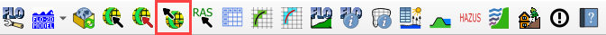

.. image:: ../img/Coastal/chan049.png

5. Create a new Export folder to test the weirs and channel hydraulics.

.. image:: ../img/Coastal/chan050.png

6. The project is ready to run.

.. image:: ../img/Coastal/chan051.png

Step 14: Run the simulation
______________________________

1. Click the Run FLO-2D Icon.

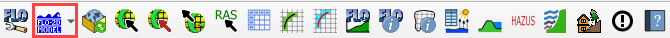

2. Set the FLO-2D Folder.
   C:\\program files (x86)\\flo-2d pro

3. Set the Project Folder.
Path:   ...\\Coastal 2D Training\\Project Runs\\Weir Test\\

4. Click OK.

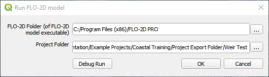

5. This is a good point to save project.

.. image:: ../img/Coastal/chan053.png

Step 15: Create a backup file
______________________________

1. Close QGIS.

2. Open the project folder.  Select the Coastal Project.gpkg and Coastal Project.qgz files.  Right click them and
   click Sent to/Compressed (zipped) folder.

.. image:: ../img/Coastal/creategrid019.png

3. Name the zipped file.
   It is good to choose a name that identifies project progress.
   For Example: **ChanOK.zip**

.. image:: ../img/Coastal/chan055.png

4. Open QGIS and reload the project.

.. image:: ../img/Coastal/creategrid021.png

5. Click yes to load the model.

.. raw:: html

    <iframe width="560" height="315" src="https://www.youtube.com/embed/lLwSBP_Y-ZY" frameborder="0" allowfullscreen></iframe>
