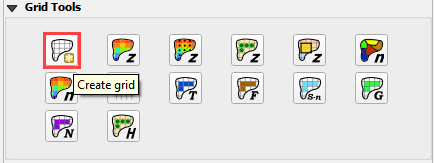
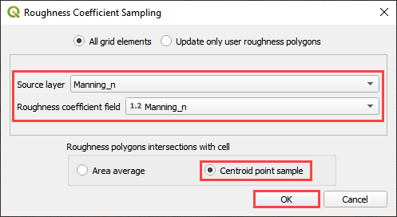
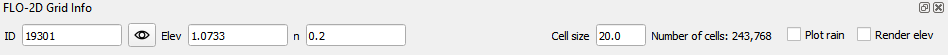

Create a Grid
=============

**Overview**

This module will outline how create a grid using QGIS, FLO-2D Plugin and project data.  Calculate elevation and
roughness to the grid.

**Required Data**

The required data is in the Coastal 2D Training Folder.

============= ===================
**File**      **Content**
============= ===================
\*.tif        Elevation Raster
\*.shp        Project AOI
\*.shp        Manning_n
============= ===================

Path:  ...\\Coastal 2D Training\\Project Data\\AOI

.. raw:: html

    <iframe width="560" height="315" src="https://www.youtube.com/embed/nyX01bFoUBA" frameborder="0" allowfullscreen></iframe>

Step 1: Set up the FLO-2D project
__________________________________

1. Open QGIS 3.22.9 or newer.

2. Drag the Project Area of Interest shapefile onto the map.

Path: ...\\Coastal 2D Training\\Project Data\\AOI

.. image:: ../img/Coastal/aoi.png

3. Click the Set-up button.

.. image:: ../img/Coastal/creategrid001.png

4. Click create.

.. image:: ../img/Coastal/creategrid002.png

5. Save the geopackage file to the project folder.

6. Name the file Coastal Project.gpkg.

Path: ...\\Coastal 2D Training\\Coastal Project.gpkg

7. Set the project CRS to Florida East HARN USft.
   Filter the list with an EPSG code: 2881.
   Select EPSG: 2881 and click OK.

.. image:: ../img/Coastal/creategrid003.png

8. Wait for the geopackage to write and check the accuracy of the project settings and click OK.

.. image:: ../img/Coastal/creategrid004.png

Step 2: Create the grid
______________________________

1. From the Grid Tools widget, select Create Grid.

2. Select the Project Domain layer, and the Cell Size field and click OK.

.. image:: ../img/Coastal/creategrid006.png

.. note:: The Project Area of Interest is a simple template. If your own project doesn't have a polygon layer that
   represents the project area, one can be digitized into the Computational Domain Layer.
   In order to align the grid to a raster, load the raster file into the dialog box.

3. Click OK to close.
   The grid is complete.

.. image:: ../img/Coastal/creategrid007.png

Step 3: Save the project
______________________________

1. Click the main Save button on the QGIS toolbar.

.. image:: ../img/Coastal/creategrid008.png

2. Navigate to the coastal folder, name the project Coastal Project.qgz and click Save.

Path: ...\\Coastal 2D Training\\Coastal Project.qgz

Step 4: Assign grid elevation
______________________________

1. Uncheck the Project Area of Interest Layer.

2. Click the Computational Domain Layer

.. image:: ../img/Coastal/creategrid011.png

3. Import the elevation file.
   Open the project folder and drag the Elevation Raster.tif file onto the map space.

\\Coastal 2D Training\\Project Data\\AOI\\Elevation Raster.tif

.. image:: ../img/Coastal/creategrid009.png

4. Move the elevation raster layer to the bottom of the layers list and click it to activate the Elevation layer.

.. image:: ../img/Coastal/moveelevationtobottom.gif

5. To interpolate the elevation to a grid layer from a raster layer, use the Sample Grid Elevation button.

.. image:: ../img/Coastal/creategrid010.png

6. Click on the Sample Grid Elevation button and enter the required data in the dialog fields and click OK.

7. Sampling Done dialog box will appear once the process is complete.
   Click OK to close it.

.. note:: Use the Fill NoData option if the elevation raster is missing data such as buildings.  This method uses the
          GDAL Warp processing tool.  To learn more about GDAL Warp, visit this page:

          https://gdal.org/programs/gdalwarp.html

.. image:: ../img/Coastal/creategrid012.png

.. image:: ../img/Workshop/Worksh154.png

Step 5: Assign roughness data
______________________________

1. Open the project folder and drag the Mannings_n.shp file onto the map space.

.. image:: ../img/Coastal/creategrid013.png

2. Click the Sample Roughness button.

.. image:: ../img/Coastal/creategrid014.png

3. Fill the dialog box and click OK.

4. Once the sample is complete, the following window will appear.
   Close the window.  It is OK if your time is different from the time in the following image.

.. image:: ../img/Coastal/creategrid016.png

5. The roughness values and elevations are assigned to the grid layer in the Schematized Layers group.  Use the
   Grid Info Tool to see individual values for each cell.

6. Click the Grid Info button and then click **any grid element** in the map area.

Step 6: Assign Control Variables
_________________________________

1. Click the Set Control Parameters Button.

2. Fill the dialog box using the two figures below.
   Save the data to the GeoPackage with the Save button.

.. note::  The variable descriptions and additional instructions are presented in the Data Input Manual.

C:\\Users\\Public\\Documents\\FLO-2D PRO Documentation\\flo_help\\Manuals\\Data Input Manual PRO.pdf

.. image:: ../img/Workshop/Worksh018.png

.. image:: ../img/Workshop/Worksh019.png

Step 7: Save the project
______________________________

1. Click the main Save button on the QGIS toolbar.

.. image:: ../img/Workshop/Worksh011.png

Step 8: Create a backup file
______________________________

1. Close QGIS.

2. Open the project folder.  Select the Coastal Project.gpkg and Coastal Project.qgz files.  Right click them and
   click Sent to/Compressed (zipped) folder.

.. image:: ../img/Coastal/creategrid019.png

3. Name the zipped file.
   It is good to choose a name that identifies project progress.
   For Example: Elevation and nvalue OK.zip

.. image:: ../img/Coastal/creategrid020.png

4. Open QGIS and reload the project.

.. image:: ../img/Coastal/creategrid021.png

5. Click yes to load the model.

.. image:: ../img/Coastal/creategrid022.png

